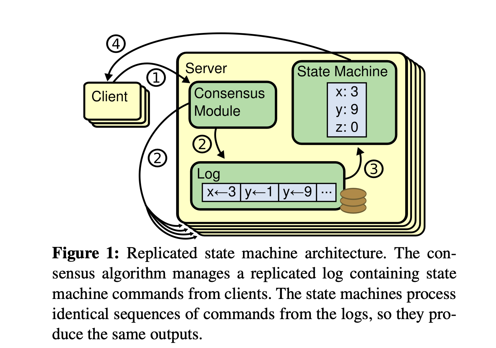

# Raft共识算法

本文主要是对[In Search of an Understandable Consensus Algorithm (Extended Version)](http://nil.csail.mit.edu/6.824/2020/papers/raft-extended.pdf)的翻译和总结。

## Abstract

Raft是用来管理replicated log的共识算法(consensus algorithm)。它的功能等价于 (multi-)Paxos，和Paxos算法一样高效，但是结构和Paxos不同。Raft算法相比于Paxos更容易理解，也为构建实际应用的系统提供了更好的基础。为了更易于理解，Raft将共识算法的关键要素（例如leader的选举，log replaction和安全性）分离出来，并且强制执行更强的一致性来减少需要考虑的状态数量。一项用户研究的结果表明，Raft相比于Paxos更易于让学生学习。

## 1 Introduction

共识算法(consensus algorithms)允许允许一组机器作为一个整体运行，并且在某些机器出现故障时能继续提供服务。正因为如此，他们在构建大型可靠的服务中起着关键作用。Paxos在过去十年左右主导了共识算法：大多数共识算法的实现都是基于Paxos或者受其影响，Paxos也成为用于向学生教授共识算法的主要工具。

但是Paxos很难理解，尽管做了做了很多次尝试让它更容易被理解。此外，它的架构也需要复杂的更改才能被用于工程系统。因此，工程师和学生都深受Paxos困扰。

在钻研Paxos之后，我们着手寻找一种新的共识算法，可以为系统构建和教育提供更好的基础。我们的方法不同寻常，因为我们的主要目标是*understandability*：我们能否为工程系统定义一个共识算法，并且以比Paxos更容易理解的方式来描述它。重要的不仅是让算法起作用，而且要让算法起作用的原因显而易见。

这项工作的成果是一个被称为Raft的共识算法。在设计Raft时，我们使用了一些特定的技术来让它更容易理解，包括拆分（Raft将leader election, log replication 和 safety分开）和状态简化（相比于Paxos，Raft降低了不确定性的程度和服务器之间可能不一致的方式）。对两所大学的43名学生的研究表明，Raft比Paxos更容易理解：在学习了两种算法之后，其中有33名学生回答Raft的相关问题比回答Paxos的问题表现更好。

Raft在很多方面与现有的共识算法相似（例如Oki 和 Liskov’s Viewstamped Replication），但是它有几个新特性：

- **Strong leader**：Raft相比于其他共识算法有更强的leadership。例如，log entries仅从leader传输到其他server上。这简化了replicated log的管理，使Raft更容易被理解。
- **Leader election**：Raft使用随机的计时器来选举leader。大部分共识算法都会使用heartbeat，这么做只是在其之上增加了少量改动，但是简单快速的解决了选举冲突。
- **Membership changes**：Raft使用了一种新的*joint consensus*方法来更改集群中的服务器，其中两种配置的大部分都在转换期间一致。这允许集群在配置更改期间继续正常运行。

我们相信无论出于教育目的还是对共识算法的实现，Raft的表现都优于Paxos和其他共识算法。它比其他共识算法更简单易懂；它的介绍足够详细，满足实现工程系统的需求；它有几个开源的实现，并且被多家公司使用；它的安全性被明确的定义和证明；它的效率和其他算法相当。

本文的其余部分介绍了replicated state machine问题（Section 2），讨论了Paxos的优缺点（Section 3），描述了实现可理解性的方法（Section 4），介绍了Raft共识算法（Section 5-8），评估Raft（Section 9），并讨论相关工作（Section 10）。

## 2 Replicated state machines

共识算法一般出现在 ***replicated state machines***的上下文中。在这种方法中，一组服务器上的state machines计算相同状态的完全一致的副本，并且即使有些服务器宕机也可以继续运行。*replicated state machines*用于解决分布式系统中的各种容错问题。例如具有单个leader的大型系统（如GFS，HDFS和RAMCloud），通常使用独立的replicated state machine来管理leader election，并存储当leader crash后需要保留下来的配置信息。replicated state machines的例子包括Chubby和ZooKeeper。

replicated state machines 通常使用 replicated log 实现，如Figure 1所示。每个server都会存储包含一系列command的log，state machine 则会按照顺序执行这些command。server上的log以相同的顺序包含相同的comamnd，因此state machine也会以相同的循序执行command。由于state machine是确定的，所以它们会运行相同的状态，并得到相同的结果。

保持replicated log的一致性是共识算法的任务。server上的共识算法模块接收来自client的命令，并将它们添加到它的log中。它与其他server上的共识算法模块通信，以保证每个server上的log都以同样的顺序包含相同的请求，即使某些server出现故障。一旦commands被正确复制，每个server上的state machine就会按照log中的顺序处理这些command，并将结果返回给client。因此，这些server看起来像一个单一的，高度可靠的state machine。

实际应用系统中的共识算法通常具有以下属性：

- 它们可以在所有non-[Byzantine](https://zh.wikipedia.org/wiki/%E6%8B%9C%E5%8D%A0%E5%BA%AD%E5%B0%86%E5%86%9B%E9%97%AE%E9%A2%98)条件下保证安全性（永远不会返回不正确的结果），包括网络延迟，分片，数据包丢失，重复或者乱序。
- 只要集群中的大多数服务器都可以正常运行，能够互相并且和客户端正常通信，它们就能保证服务可用。因此，典型的由五台服务器构成的集群可以容忍任意两台服务器故障。假设集群中的服务器停止而被当作失败，它们稍后可以从稳定存储上state恢复，并重新加入集群。
- 他们不依赖时间来保证日志的一致性：机器上错误的时钟和较大的延迟，在最坏情况下，也会引起可用性的问题。
- 在通常情况下，只要集群中的大多数机器都响应了这一轮的远程调用，命令就可以认为是完成的；少数的响应较慢的server不会影响整体系统的性能。

## 3 What’s wrong with Paxos?

在过去的十年中， Leslie Lamport 的Paxos协议几乎成为共识算法的代名词：它是课程教授中使用最多的协议，并且大多数的共识算法的实现都以它为基础。Paxos首先定义了一个能够就单个决策达成一致的协议，例如单个eplicated log条目，我们称之为*single-decree Paxos*。随后Paxos支持在多个实例之间达成一系列决策（*multi-Paxos*）。Paxos可以保证安全性和活跃性，并且支持集群中成员的变化。它的正确性已经被证明，并且在正常情况下是非常高效的。

但是Paxos有两个显著的缺点。第一点是Paxos非常难以理解。完整的解释出了名的晦涩难懂；很少有人能够理解它，并且需要付出很多努力。因此，有人尝试用更简单的术语来解释Paxos，这些解释侧重于协议single-decree subset，想要理解仍然十分困难。在NSDI 2012的与会者非正式调查中发现，即使是经验丰富的研究人员，也很少有人对Paxos感到满意。我们自己也在于Paxos作斗争，直到阅读了几个简化的解释并设计了我们自己的替代协议，我们才能理解完整的协议，这个过程花了将近一年的时间。

我们假设Paxos的晦涩性源于它选择single-decree subset作为其基础。Single-decree Paxos复杂又微妙：它被分成了两个阶段，这两个阶段没有简单直观的解释，也不能独立理解。因此，很难形成关于single-decree协议为什么有效的直观感受。multi-Paxos的组合规则显着增加了额外的复杂性和微妙性。我们认为，达成多个决策（即日志而不是单个条目）的共识问题可以用更直接和明显的方式分解。

Paxos的第二个问题是它没有为实现提供良好的基础。一个原因是没有一个广泛认可的multi-Paxos算法。Lamport的描述主要是关于single-decree Paxos；他勾勒出了多Paxos可能的实现方法，但许多缺失了很多细节。有人试图完善和优化Paxos，但它们与彼此，以及和Lamport的设想都有所不同。像Chubby这样的系统实现了类似Paxos的算法，但是实现的很多细节没有公开。

此外，Paxos的架构不太适用于构建实际应用系统；这也是single-decree分解的另一个结果。例如，独立地选择一组log entries，然后把它们合并成sequential log，只会额外增加复杂性。围绕log设计系统会更简单高效，其中新的日志条目按顺序追加。另一个问题是Paxos在其核心功能上使用对称的peer-to-peer 方法（尽管它使用较弱形式的leadership作为其性能优化）。如果系统中只需要做出一些简单的决策，这么设计是合理的，但是实际系统中很少会使用这种方法。如果需要做出一系列决策，更简单快捷的方法是首先选出一个leader，然后由leader来协调决策。

因此，实际系统与Paxos几乎没有共同点。每当从paxos开始实现系统时都会发现非常困难，然后会开发出和它截然不同的架构。这个过程非常耗时，并且容易出错，Paxos不容易让人理解进一步加剧了这个问题。Paxos的公式可能可以很好的证明其正确性，但是实际实现与Paxos差别太大，在实现时公式也没什么用。下面是来自Chubby开发者的评论：

> Paxos算法和实际系统的需求之间存在着显著的差距…最终实现的系统其实基于未经证实的协议。

基于这些问题我们得出结论：Paxos没有为构建系统或者教育提供良好的基础。鉴于共识算法在大型系统中的重要性，我们决定尝试能否设计出一种比Paxos有更好特性的替代的共识算法。Raft就是这个实验结果。

## 4 Designing for understandability

我们在设计Raft时有几个目标：它必须为构建实际系统提供完整并且实用的基础，从而大大减少开发人员设计的工作量；它必须在任何情况下都是安全的；并且它必须对常见的操作系统生效。我们最重要的目标——也是最难的挑战——是*understandability*。需要让大部分读者能轻松理解该算法。此外，需要有开发者的直觉，以便系统构建者在实际实现时有能力对算法进行不可避免的扩展。

在Raft系统设计时有很多点需要在一些替代方案中选择。在这些情况下，我们会根据可理解性来评估备选方案：解释每个备选方案有多难呢（例如：它的state space有多复杂，它是否有细微的影响等），以及读者能否改方案以及它的影响。

我们认识到在类似的分析中具有高度的主观性；尽管如此，我们还是使用了两种普遍适用的技术。第一种技术就是众所周知的问题分解法（problem decomposition）：只要有可能，我们就会把问题分解成独立的部分，它们可以被单独地solved, explained, and understood。例如，在Raft中，我们把leader election，log replication，safety和membership changes拆分开。

我们的第二种方法是通过减少要考虑states的数量来简化state space，是系统更加连贯并且尽可能消除不确定性。具体来说，logs不允许有漏洞，并且Raft限制了日志之间可能变得不一致的方式。虽然在大部分情况我们都试图消除不确定性，但是在某些情况下不确定性使算法更容易理解。尤其是通过随机的方式引入的不确定性，通过以同样的方式来处理所有可能的选择来减少state space（选择任何一个都没问题）。我们使用随机的方式来减少Raft的leader election算法。

## 5 The Raft consensus algorithm

Raft是一种用于管理Section 2中描述的replicated log的算法。Figure 2总结了该算法以供参考，Figure 3列出了该算法的关键属性；图片中的内存将在本节的剩余部分进行讨论。

Raft实现共识算法，首先会选举出一个唯一的*leader*，然后给予leader管理replicated log的全部责任。leader会从client接收log entries，将它们复制到其他server上，并且告诉server什么时候可以安全的将log entries应用到它们的state machines。leader的存在可以简化replicated log的管理流程。例如，leader可以在不咨询其他server的情况下决定log中放置新的log entry的位置，数据以一种简单的从leader流向其他server。leader可能会出现故障或者与其他服务器断开连接，这种情况下会选举出新的leader。

根据采用leader的方法，Raft将共识问题拆分成三个相对独立的子问题，将在以下小节中进行讨论：

1. Leader election：当现有的leader出现故障时，必须选举出新的leader（Section 5.2）
2. Log replication：leader需要接收来自client的log entries，并且在集群中复制它们，强制集群中其他server的log与自身的log一致(Section 5.3)。
3. Safety：Raft的关键安全属性是Figure 3中的State Machine Safety属性：如果任何一个server已经将特定的log entry应用到它的state machine，则其他服务器不会对同一个 log index执行不同的command。Section 5.4介绍了Raft如何保证这个属性；这个方案涉及了对Section 5.2 描述的选举机制的额外限制。

在介绍了共识算法之后，本节会讨论可用性(availability)相关的问题和计时(timing)在系统中的作用。

### 5.1 Raft basics

一个Raft集群通常包含多个server；5个server是一个常用的配置，它允许系统中最多两个server出现故障。系统中的server都处于*leader*, *follower* 或者 *candidate*三种状态之一。在正常情况下，系统中只有一个leader，其他server都是followers。followers处于被动状态：它们不会自己主动发出请求，而是简单的响应leaders和candidates的请求。leader则会处理所有client的请求（如果client请求到follower，follower则会将请求重定向到leader）。第三种状态candidate用于选举出新的leader，在Section 5.2会具体介绍。Figure 4显示了server的状态和它们之间的转换关系。

Raft将时间划分为任意长度的*terms*，如Figure 5中所示。term使用连续的整数编号。每个term都从*election*开始，其中一名或者多名candidate试图成为leader。如果一个candidate赢得了election，它将在这个term接下来的时间中作为leader服务。在某些情况下，election会出现split vote。在这种情况下，term将以没有leader结束；新的term（包括新的election）会立即开始。Raft保证在一个给定的term中至多有一个leader。

不同的server可能会在不同的时间点观察到term的切换，并且在某些情况下一个服务器可能观察不到election，甚至整个term。Term在Raft中充当逻辑时钟的角色，它们能够让server检测信息是否过时，例如stale leaders。每个server都会存储*current term*，这个数字随着时间单调递增。每当server进行通信时，都会交换*current terms*；如果一个server的*current term* 小于其他server，它会把自身的current term更新为较大的值。如果leader或者candidate发现它们的term已经过期，则会立即切换为follower状态。server会拒绝带有陈旧term序号的请求。

Raft服务器使用remote procedure calls (RPCs)进行通信，基础的共识算法只需要两种类型的RPC请求。RequestVote RPCs由candidates在进行election时使用(Section 5.2)，AppendEntries RPCs被leader用于replicate log entries 和提供heartbeat的功能(Section 5.3)。Section 7中添加了第三个RPC，用于在server间传输snapshot。如果server没有及时收到RPC的响应结果，则会进行重试。server在发送RPC请求时会并行处理来提高性能。

### 5.2 Leader election

Raft使用心跳机制来触发leader election。每当server启动时，都以follower状态开始。server只要从leader或者candidate收到有效的RPC请求，它就会保持follower状态。leader会定期向所有的follower发送heartbeats（不携带log entry的AppendEntries RPCs）来维护leader的身份。如果follower在超过*ection timeout*没有收到消息，它就会假设当前没有leader，并且启动election来选出新的leader。

在开始election前，follower会增加它当前的term，并转换为candidate状态。然后它会为自己投票，并向集群中的其他服务器并行发出RequestVote RPC。candidate会保持这种状态，直到以下三种情况发生：

1. 它赢得了election
2. 另一个server把自身确立为leader
3. 一段时间过去了，没有人赢得选举

这些结果将在以下段落中单独讨论。

candidate在election中获胜的条件是在当前term中收到集群中大多数server的选票。每个server在一个给定term中最多投票给一个candidate，基于先到先得的规则（注意：第 5.4 节增加了对投票的额外限制）。这些规则保证了在一个特定的term中最多一个candidate可以在election胜出（Figure 3中的Election Safety Property）。一旦candidate赢得了election，它就会成为leader。然后它会向其他所有的server发送heartbeat消息来建立权威，并且防止新的election开始。

在等待投票期间，candidate可能收到来自另一个声称是leader的server的AppendEntries RPC。如果leader的term（包含在RPC请求中）和不小于candidate的当前term，则candidate承认leader是合法的，并且返回到follower状态。如果RPC中的term小于candidate当前的term，candidate则拒绝RPC请求并继续处于candidate状态。

第三种可能的结果是candidate在选举中既没胜出也没失败：如果很多followers同时成为candidate，则有可能会平分选票，从而没有candidate获得多数投票。当这种情况发生时，每个candidate都会超时，然后会增加其term，并启动新一轮RequestVote RPCs开始新的选举。但是，如果不采用额外的措施，split votes可能会无限重复。

Raft使用随机的election超时时间来确保split votes很少见并且可以快速解决。首先为了防止split votes，election超时时间从一个固定区间中随机生成（例如150–300ms）。所以在大多数情况下只有一台server会最先超时；它会在其他server超时前赢得election并且开始发送heartbeat。这个机制同样应用于处理split votes。每个candidate在开始election前都会重置其随机的election timeout，并且在该超时时间结束后才开始下一轮election；这种方法减少了在新的election中再次出现 split vote 的可能性。Section 9.3表明这种方法可以快速的选出leader。

election的设计是可理解性如何指导我们在设计方案之间做出选择的一个例子。最初我们计划使用一个ranking system：为每个candidate分配一个唯一的rank，用于在candidate之间进行竞争选择。如果candidate发现了另一个rank更高的candidate，它就会回到follower状态，以便rank更高的candidate更容易赢得下一次election。我们发现这个方法在可用性方面产生了微妙的问题（如果更高rank的server出现故障，较低rank的server可能需要超时，并再次成为candidate，但是如果这个流程太快，它就会重置选取leader的进程）。我们对这个算法进行了多次调整，每次调整后都会出现新的极端情况。最终我们得出结论，使用随机重试的方法更明显，也更容易理解。

### 5.3 Log replication

leader被选出之后，就开始为client提供服务。每个client的请求包含了一个由replicated state machine执行的命令。leader将该命令作为一个新的entry附加到其log，然后向其他server并行发出AppendEntries RPC复制这个entry。当entry已经被安全的复制后，leader将这个entry应用到其state machine，并将执行的结果返回给client。如果follower崩溃，或者运行缓慢，或者网络数据包丢失，leader会无限重试AppendEntries RPC（即使已经在客户端响应之后）直到所有的follower最终存储所有的log entry。

日志的组织方式如Figure 6所示。每个log entry存储了一个state machine命令和leader 收到这个entry的term number。log entry里的term number用于检测log间的不一致性，来确保Figure 3中的某些特性。每个log entry还有一个整数索引用于标识其在log中的位置。

leader来决定何时将log entry应用到state machine是安全的；这样的entry被称为*committed*。Raft保证committed entries是持久的，并且最终会被所有可用的state machine执行。如果leader已经将log entry复制到大多数server中，这个log entry就会被committed（例如：Figure 6中的entry 7）。这一步也会commit leader log中所有先前的entry，包括被之前的leader创建的entry。Section 5.4讨论了在leader变更前后应用此规则的一些微妙之处，并且它表明commitment的定义是安全的。leader会记录将要被committed的最大的索引，并且把该索引包含在之后的AppendEntries RPC中（包括heartbeat），以便其他服务器获取该结果。一旦follower感知到log entry是committed，它就会将该log应用到本地state machine（按照log顺序）。

我们设计Raft的log机制来保证不同server上日志的高度一致。这不仅简化了系统的行为使其更具有预测性，也是确保安全性的重要组成部分。Raft维护了以下属性，共同构成了Figure 3中的Log Matching Property：

- 如果两个entry在不同的log中具有相同的index和term，那么它们存储的是相同的命令。（If two entries in different logs have the same index and term, then they store the same command.）
- 如果两个entry在不同的log中具有相同的index和term，那么logs中所有之前的entry都是相同的。（If two entries in different logs have the same index and term, then the logs are identical in all preceding entries.）

第一条属性源于这样一个事实：一个leader在一个给定的term中，对于一个给定的index最多创建一个entry，并且log entry不会改变它们在log中的位置。第二条属性由 AppendEntries 执行的简单一致性检查保证。当发送AppendEntries RPC请求时，leader会包含新entry在其log中上一个entry的index和term。如果follower在其日志中没有找到该index和term的entry，它会拒绝新的entry。一致性检查以归纳步骤运行：logs的初始状态符合Log Matching Property，并且当logs扩展时，一致性检查会保持Log Matching Property。因此每当 AppendEntries成功返回时，leader通过new entry就可以得知follower的log与自身的log相同。

在正常运行时，leader和follower的log会保持一致，因此AppendEntries一致性检查不会失败。但是，leader崩溃可能会使logs不一致（old leader 可能没有完全复制其log中的所有entry）。这些不一致可能导致一系列leader和follower崩溃。Figure 7说明了follower的log可能与new leader日志不同的方式。follower可能缺少leader中存在的entry，它也可能具有leader中不存在的entry，或者两种情况都有可能出现。缺失和多出的log entry可能会跨越多个term。

在Raft中，leader通过强制follower复制自身的log来处理不一致性。即follower中冲突的log将被leader中的log entry覆盖。在Section 5.4中将会表明通过再增加一个限制，这个操作就是安全的。

为了使follower的log与自己一致，leader需要找到二者log中最新一致的entry，并且follower log中改节点后的所有的entry，并且将leder log中改节点后的所有的entry发送给follower。所有这些操作都是为了响应AppendEntries RPC执行的一致性检查。leader会为每个follower维护一个nextindex，这是leader将发送给该follower下一个log entry的index。当leader刚被选出时，它会将所有的nextindex的值初始化为其log中最后一个entry的index的下一个值（例如Figure 7中的11）。如果follower中的log与leader中的log不一致，在下一次AppendEntries RPC中，AppendEntries的一致性检查会失败。被拒绝后，leader会递减nextindex并重试AppendEntries RPC。最终nextindex将到达leader和follower中匹配的点。当发生这种情况时，AppendEntries会成功，它会删除follower中所有冲突的entry并且追加leader log中的entry（如果有的话）。一旦AppendEntries执行成功，follower中的日志就与leader的一致，并且在term剩余的时间保持这种状态。

如果有需要的话可以优化上述协议来减少被拒绝的AppendEntries RPCs的数量。例如，当拒绝AppendEntries请求时，follower可以包括冲突条目所在的term和它在该term中的第一个index。有了这些信息，leader就可以直接绕过该term中所有冲突的index；每个有冲突entry的term都需要一个AppendEntries RPC，而不是每个entry一次RPC检测。在实践中，我们怀疑这种优化不是很有必要，因为故障很少发生，而且不太可能有很多不一致的entry。

通过这种机制，leader被选出时不需要采取任何特殊的操作来恢复log的一致性。它仅仅是开始正常运行，日志就会自动收敛来响应AppendEntries一致性检查的失败。leader永远不会覆盖或者删除自身log中的entry（Figure 3中的Leader Append-Only Property）。

这种log复制机制展示了Section 2中描述的理想的共识属性：只要大多数server启动，Raft就可以接受(accept)、复制(replicate)并且应用(apply)新的log entry；在正常情况下，可以通过单轮RPC将新的entry复制到集群中的大多数server；单个慢速的follower不会影响性能。

### 5.4 Safety

前面的部分描述了 Raft 如何选举leader和复制log entry。不过到目前为止所描述的机制还不能充分保证每个state machine以相同的顺序完全执行相同的命令。例如，当leader commit多个log entry时，follower可能此时不可用，随后可能被选为leader并且用新的log entry覆盖这些log entry；因此，不同的state machine可能会执行不同的命令序列。

本节通过添加对哪些server可以被选为leader的限制来完成Raft算法。该限制保证了任意给定term的leader都包含之前term中提交的所有entry（Figure 3中的Leader Completeness Property）。通过election的限制，我们使commitment的规则更加精确。最后，我们证明了Leader Completeness Property，并且展示了它如何保证replicated state machine的正确行为。

#### 5.4.1 Election restriction

在任何leader-based的共识算法中，leader必须最终存储所有committed log entries。在一些共识算法中，例如Viewstamped Replication，即使它最初不包含所有committed entries，也可以选出一个leader。这些算法包含额外的机制，在选举的过程中或者不久之后，来识别丢失的entry，并且把它们传给新的leader。但是这样会导致相当多额外的机制和复杂性。Raft使用了一种更简单的方法，它保证从election开始，每个新的leader都会包含之前term committed entries，不需要把这些entry传递给leader。这意味着 log entries仅会从leader流向follower，而且leader永远不会覆盖其log中已经存在的entry。

Raft在投票过程中来保证log中包含所有committed entries的candidate才能赢得election。candidate必须联系集群中超过半数的server才能当选，即每个committed entry至少存在于这些server中的一个。如果candidate的log于大多数server中的log一样新(up-to-date，下面会有准确定义)，那么它就保存了所有committed entries。RequestVote RPC实现了这个限制：RPC会包含candidate的log信息，voter自己的log比candidate的log更新(up-to-date)，它就会拒绝投票。

Raft通过比较log中最后一个entry的index和term来确定哪个log更新(up-to-date)。如果log中最后一个entry的term不同，具有更大term的log就更新(up-to-date)。如果log的term相同，更长的log就更新(up-to-date)。

#### 5.4.2 Committing entries from previous terms

如Section 5.3中所述，leader一旦发现该entry存储在大多数server中，该entry就会被committed。如果leader在commit entry前崩溃，下一任leader将会尝试完成复制该entry。但是当前leader不能立即断定上一个term的entry存储在大多数server中。Figure 8说明了一种情况，其中旧的log entry存储在大多数server中，但仍可能被未来的leader覆盖。

为了解决Figure 8中的问题，Raft不会通过计算replicas来commit之前term中的log entry。只有leader当前term的log entry通过计算replicas 判断是否commit；一旦以这种方式commit当前term的entry，由于Log Matching Property，所有先前的entries都会被间接commit。在某些情况下，leader可以安全的判断older log是否commited（例如，这个entry存储在每个server上），但Raft为了简单起见采用了更保守的方法。

Raft在commitment规则中引入了这种额外的复杂性，因为当leader从之前的term复制entry时，log entry会保留原始的term number。在其他共识算法中，如果新的leader从之前的“term”中复制entry，必须使用新的“term number”进行复制。Raft的方法使对log entry的推理变得更容易，因为它们随着时间推移和日志增长会保留相同的term number。此外，相较与其他算法，Raft中新的leader发送之前term的log entry更少（其他算法必须发送冗余的log entry才能重新编号，然后才能commit）。

#### 5.4.3 Safety argument

通过完整的Raft算法，我们现在可以更准的论证Leader Completeness Property成立（该论证基于安全证明；参考Section 9.2）。我们假设Leader Completeness Property不成立，然后我们证明一个矛盾。假设term T的leader（leader T）在其term中commit一个log entry，但是这个log entry未被未来某个term的leader存储。假设最新出现不存储该entry的leader U。

1. committed entry必须在选举时不存在于leader U的log中(leader永远不会删除或者覆盖entry)。
2. leader T在集群中的大多数机器上复制了该entry，而leader U收到了集群中大多数server的投票。因此，至少有一个server(“the voter”)即接受了leader T的entry，又投票给了leader U，如Figure 9中所示。投票者是达成矛盾的关键。
3. 投票者必须在投票给leader U之前接受来自leader T 的commited entry；否则它会拒绝leader T的AppendEntries请求（它的当前term会比leader T更高）。
4. 投票者在投票给leader U时仍然存储该entry，因为每个介入的leader都包含该entry（假设），leader永远不会删除entry，follower只会在与leader冲突时才删除entry。
5. 投票者把票投给了leader U，所以leader U的log一定和投票者一样是最新的。这导致了两个矛盾之一。
6. 首先，如果投票者和leader U共享相同的最后一个log term，那么leader U的log至少和投票者一样长，所以它的log中包含投票者log中的所有entry。这是一个矛盾点，因为投票者包含commited entry，而leader U假定不包含。
7. 否则，leader U最后一个log term一定大于投票者。此外，它比T更大，因为投票者最后一个log term至少是T（它包含来自term T的commited entry）。创建leader U最后一个log entry的更早的那个leader必须在其log中包含commited entry（假设）。那么根据Log Matching Property，leader U的log也必须包含committed entry，这是矛盾的。
8. 这样就完成了矛盾。因此所有term大于T的leader必须包含term T中commited的所有entry。
9. Log Matching Property保证未来的leader也将包含间接commited的entry，例如Figure 8(d)中的index 2。

根据Leader Completeness Property，我们可以证明Figure 3中的State Machine Safety Property，该属性表明如果server已经将给定index的log entry应用于其state machine，则不会有其他server对同一个index应用不同的log entry。当server将log entry应用于其state machine时，它的log必须与leader在此entry之前的log相同，并且这个entry必须是committed。现在考虑任一服务器对于给定log index的最低term；Log Completeness Property保证更高term的leader将存储相同的log entry，因此后续term的server对于该index也会应用相同的值。因此State Machine Safety Property成立。

最后，Raft要求server按照log index顺序应用entry。结合State Machine Safety Property，即所有的server将以相同的顺序将完全相同的一组log entries应用到它们的state machine。

### 5.5 Follower and candidate crashes

到目前为止，我们一直关注leader的崩溃。follower和caididate崩溃比leader崩溃更容易处理，并且他们的处理方式相同。如果一个follower或者candidate崩溃，那么之后发送给它们的RequestVote和AppendEntries RPCs将会失败。Raft通过无限重试来处理这些失败；如果崩溃的server重新启动，RPC将会成功完成。如果server在完成RPC之后，但是在返回结果之前崩溃，那么它在重启后会再次收到相同的RPC。Raft RPCs是幂等的，所以不会有什么影响。例如，如果follower收到一个AppendEntries请求，其中包含已经存在log中的log entry，它会忽略新请求中的这些entry。

### 5.6 Timing and availability

我们对Raft的要求之一是安全性不能依赖于时间：系统不能仅仅因为某些事件发生的比预期快或者慢就产生错误的结果。但是，availability（系统及时响应client的能力）不可避免的取决于时间。例如，如果消息通信的时间比server崩溃的时间长，candidates就不会熬到足以赢得选举的时间；没有稳定的leader，Raft就无法运转。

Raft leader选举中时间最关键。只要系统满足以下时间要求，Raft就可以选举并且维持稳定的leader：
$$
broadcastTime ≪ electionTimeout ≪ MTBF
$$
在这个不等式中，*broadcastTime*是server向集群中的每个server并行发送RPC并接收到它们的响应花费的平均时间；*electionTimeout*是Section 5.2中描述的选举超时时间；*MTBF*是单个服务器的平均故障间隔时间。broadcast time应该比election timeout 小一个数量级，以便leader可以可靠的发送阻止follower开始选举所需的heartbeat消息；再加上随机的election timeout，这种不平等也使split votes不太可能发生。election timeout需要比MTBF小几个数量级，这样系统才能稳定运行。当leader崩溃时，系统将在election timeout时间内不可用；我们希望这只占总时间的一小部分。

broadcast time和MTBF是底层系统的属性，而election timeout是我们需要指定的。Raft的RPC通常需要接收者将信息持久化到稳定的存储中，因此broadcast time可能在0.5ms 到 20ms之间，取决于具体的存储技术。因此，election timeout可能介于10ms到500ms之间。典型的server MTBF是几个甚至更长的时间，很容易满足时间要求。

## 6 Cluster membership changes

到目前为止，我们都假设集群的配置（参与共识算法的server）是固定的。在实际应用中，有时需要更改集群的配置，例如在server发生故障时替换，或者更改server备份的数量。尽管可以通过使整个集群下线，更细配置文件，然后重新启动集群来完成，但是会使集群在切换期间不可用。此外，如果需要任何手动操作的步骤，则存在操作失误的风险。为了避免这些问题，我们决定支持自动化配置更改，并将其纳入Raft算法。

为了使配置更改机制更安全，在过渡期间不能有在同一term有两个leader被选出的时间点。但是，服务器从旧配置切换到新配置的任何方法都是不安全的。因为不可能同时切换所有server，所以集群可能在过渡期间分裂成两个独立的大多数（majorities, 参考Figure 10）。

为了保证安全性，配置更改需要使用two-phase方法。有多种方法可以实现这两个阶段。例如，某些系统使用第一个阶段禁用旧的配置，因此无法处理client的请求；然后在第二阶段启用新的配置。在Raft中，集群首先切换到被称为*joint consensus*（联合共识）的过渡配置；一旦 joint consensus被committed，系统就会过渡到新配置。joint consensus结合了新旧配置：

- log entry 被复制到两种配置中的所有server。
- 任一配置中的任何一个server当选为leader。
- agreement（用于election和entry commitment）新配置和旧配置中各自的majorities。

joint consensus允许各个服务器在不同时间在配置之间切换，而不会影响安全性。而且joint consensus允许集群在配置更改期间继续为client提供服务。

集群配置使用replicated log中的特殊entries存储和通信；Figure 11说明了配置更改的过程。当leader收到将配置从$C_{old}$改为$C_{new}$的请求时，它将joint consensus 的配置（图中的$C_{old, new}$）存储为log entry，并使用之前描述的机制复制该log entry。一旦给定的server将新的配置entry添加到它的log中，它将使用该配置来进行未来的所有决策（server始终使用log中的最新的配置，无论这个entry是否committed）。这意味着leader将使用$C_{old, new}$的规则来决定何时commit $C_{old, new}$log entry。如果leader崩溃，则会在$C_{old}$或者$C_{old, new}$规则下选择新的leader，这取决于获胜的candidate是否收到了$C_{old, new}$。无论如何，$C_{new}$在此期间不能单方面决定。

一旦$C_{old, new}$被committed，$C_{old}$ 或者$C_{new}$ 都不能为经对方同意的情况下做出决定，并且Leader Completeness Property 确保只有具有$C_{old,new}$log entry可以被选为leader。现在leader可以安全的创建一个 $C_{new}$ 的log entry并将其复制到集群中。同样，这个配置会在每个server看到其后立即生效。当新配置根据$C_{new}$规则commit后，旧配置无关紧要，并且不在新配置中的server可以关闭。如Figure 11所示，不存在$C_{old}$或者$C_{new}$可以单方面作出决定的时间，保证了安全性。 

reconfiguration还有另外三个问题需要解决。第一个问题是新的server最开始可能不会存储任何log entry。如果以这种状态添加到集群中，它们可能需要很长时间才能赶上进度，在此期间可能无法commit新的log entry。为了避免server可用性的间断，Raft在配置更改之前引入了一个额外的阶段，在这个阶段中新的server作为非投票成员加入集群（leader将log entry复制给它们，但是它们不参与计算投票的大多数）。一旦新的server赶上了集群中的其他server，reconfiguration就可以按照上述的方法进行。

第二个问题是集群中的leader可能不是新的配置中的一部分。在这种情况下，一旦leader commit $C_{new}$ log entry，它就会下台（回到follower状态）。这意味着会存在一段时期（当它在commit $C_{new}$ ）leader会管理一个不包括自己的集群；它复制log，但是不会把自己计入majorities中。leader转换发生在$C_{new}$ commit 时，因为这是新配置可以独立运行的第一个节点（总是可以从$C_{new}$ 中选出一个leader）。在此之前，可能只有$C_{old}$中的server才能被选为leader。

第三个问题是removed server（不在$C_{new}$中的server）可能会破坏集群。这些server不会收到heartbeat，因此它们会超时并开始新的选举。它们会发送带有新的term number的RequestVote RPC，会导致当前的leader恢复follower状态。新的leader会被重新选出，但是removed server会再次超时，并再次重复改过程，导致集群可用性变差。

为了防止此问题，当server认为当前集群存在leader时，它们会忽略RequestVote RPC。具体来说，如果server在监听当前leader最小超时时间内收到RequestVote RPC，它不会更新自己的term或者投票给候选者。这并不会影响正常选举，每个server在开始选举之前需要等待最小的超时时间，但是这个策略可以避免removed server造成的中断：如果leader可以向集群中的server正常发送heartbeat，它就不会被更大的term废黜。

## 7 Log compaction

Raft的log在运行期间会不断增长，以容纳更多客户端的请求，但是在实际应用中，它不能无限增长。随着log增长，它会占据更多的存储空间，并且需要更长的时间重放。如果没有机制来丢弃日志中积累的过时信息，最终会导致可用性问题。

snapshotting是最简单的压缩方法。在snapshotting中，整个当前系统的状态被写入稳定存储上的*snapshot* ，然后丢弃改点之前的log。snapshotting被应用于Chubby和ZooKeeper，本节的剩余部分会介绍Raft中的snapshotting。

增量压缩的方法，例如log cleaning 和 log-structured merge trees也是可行的。它们每次对一部分数据进行操作，随着时间的积累，它们可以更均匀的分散压缩负载。首选选择一个积累了很多已删除和覆盖对象的区域，然后更紧凑的重写该区域中的活动对象并释放该区域。与snapshotting相比，这需要大量的额外机制和复杂性，snapshotting始终通过对整个数据集操作来简化问题。虽然使用log cleaning需要对Raft进行修改，但是state machine可以使用与 snapshotting相同的接口实现LSM树。

Figure 12显示了Raft中snapshotting的基本思想。每个server独立建立snapshot，仅覆盖已经commited的log entry。大部分工作包括state machine将其当前状态写入snapshot。Raft还在snapshot中包含少量元数据：*last included index* 是snapshot替换的log中最后一个entry的索引（state machine应用的最后一个entry），*last included term*是该entry的term。保存这些数据是为了支持建立snapshot后第一个log entry的AppendEntries的一致性检查，因为需要之前entry的log index和term。为了支持集群成员更改（Section 6），snapshot还包括log中截至最后entry的最新配置。一旦server完成shapshot写入，它可能会删除snapshot中最后index之前的所有log entry，以及之前建立的snapshot。

尽管server独立建立snapshot，但是leader有时需要向落后的follower发送snapshot。当leader已经丢弃了需要发送给follower的下一个log entry时，就会发生这种情况。但是这种情况在正常操作中不太可能出现：跟上leader的follower已经包含这个log entry。但是，一个特别慢的follower或者新加入集群的server则会出现这种情况。让follower保持最新状态的方法就是leader通过网络向其发送snapshot。

leader使用InstallSnapshot RPC向落后的follower发送snapshot；参考Figure 13。当follower通过InstallSnapshot RPC收到snapshot时，它需要决定如何处理其现有的log entry。通常情况下snapshot会包含接收者的log中尚未包含的新信息。这种情况下，follower会丢弃其整个log；log会全部被snapshot取代，并且可能有与snapshot 冲突未commit的entry。如果follower收到仅包含log 前缀部分的snapshot（由于重传或者错误），则snapshot覆盖的log将被删除，但是snapshot之后的log entry仍然有效并且需要保留。

这种snapshotting方法背离了 Raft的强leader原则，因为follower可以在leader不知情的情况下建立snapshot。但是我们认为这种背离是合理的。虽然leader有助于在达成共识时避免冲突，但是snapshotting时已经达成共识，因此不会有决策冲突。数据仍然只从leader流向follower，支持follower现在可以重新组织它们的数据。

我们考虑了另一种leader-based的方法，其中只有leader会创建snapshot，然后将其发送给每个follower。但是这种方式有两个缺点。首先，将snapshot发送给follower时会浪费网络带宽，并且减慢snapshoting的速度。每个follower已经拥有了生成自身snapshot所需要的信息，并且server在本地生成snapshot通常要比网络发送和接收snapshot要便捷的多。其次，leader的实现会更加复杂。例如，leader需要向follower复制新的log entry时同时向follower发送snapshot，以免阻塞客户端请求。

还有两个因素会影响snapshotting的性能。首先，server需要决定何时进行snapshot。如果server snapshot过于频繁，就会浪费磁盘带宽和电量；如果snapshot的频率过低，则可能耗尽其存储容量，并且会增加机器重启时重放log需要的时间。一种简单的策略是log达到固定大小（以字节为单位）时建立snapshot。

第二个性能问题是建立snapshot可能会花费大量的时间，并且不能推迟服务正常操作。解决方案是使用copy-on-write（写时拷贝）技术，以便可以接受新的update请求并且不影响正在建立的snapshot。例如，functional data structures 构建的state machine天然支持这一点。或者，操作系统的 copy-on-write（例如linux的fork）可用于创建整个state machine的内存快照（我们的实现使用这种方法）。

## 8 Client interaction

本节介绍client如何与Raft交互，包括client如何找到集群leader，以及Raft如何支持线性化语法。这些特性适用于所有基于共识算法的系统，Raft的解决方案与其他系统类似。

Raft的clients将所有的请求发送给leader。当client首次启动时，它会连接到一个随机的server。如果client第一次选择的server不是leader，这个server就会拒绝client的请求并提供其最近收到的leader的信息（AppendEntries请求会包含leader的网络地址）。如果leader宕机，client的请求就会超时，随后client会重新选择随机的server发送请求。

Raft的目标是实现Linearizable语法（每个操作看上去是在调用和响应之间的某个时刻立即执行一次）。但是到目前为止所描述的，Raft可以多次执行一个命令：例如，如果leade在commit log entry之后，响应client之前崩溃了，client会通过新的leader重试这个命令，导致这个命令会被执行两次。解决方案是让client为每个命令分配一个唯一的序列号。然后state machine检查当前序列号是否已经被处理过。如果接受到的命令的序列号已经执行过，则立即响应，无须重新执行该请求。

只读操作不需要向log中写入任何内容。但是会有返回过时数据的风险，因为响应请求的leader可能已经被它不知道的新leader取代。Linearizable reads 不能返回过时的数据，Raft需要两个额外的预防措施来保证这一点。首先，leader必须感知最新的commit entry的信息。The Leader Completeness Property保证leader拥有所有已经commit的entry，但是在term开始时，它可能不知道哪些entry是已经commited。为了找到答案，它需要在当前term commit 一个 entry。Raft通过让每个leader在term开始时向log中提交一个空白的 *no-op* entry来处理这个问题。其次，leader必须在处理只读请求之前检查其是否被废黜（如果有个新的leader已经产生，这个信息可能是过时的）。Raft通过让leader在处理只读请求之前与集群中的大多数成员交换心跳消息来处理此问题。或者leader可以依靠心跳机制来提供某种形式的租约，但是这种方式需要依赖计时的安全性。

