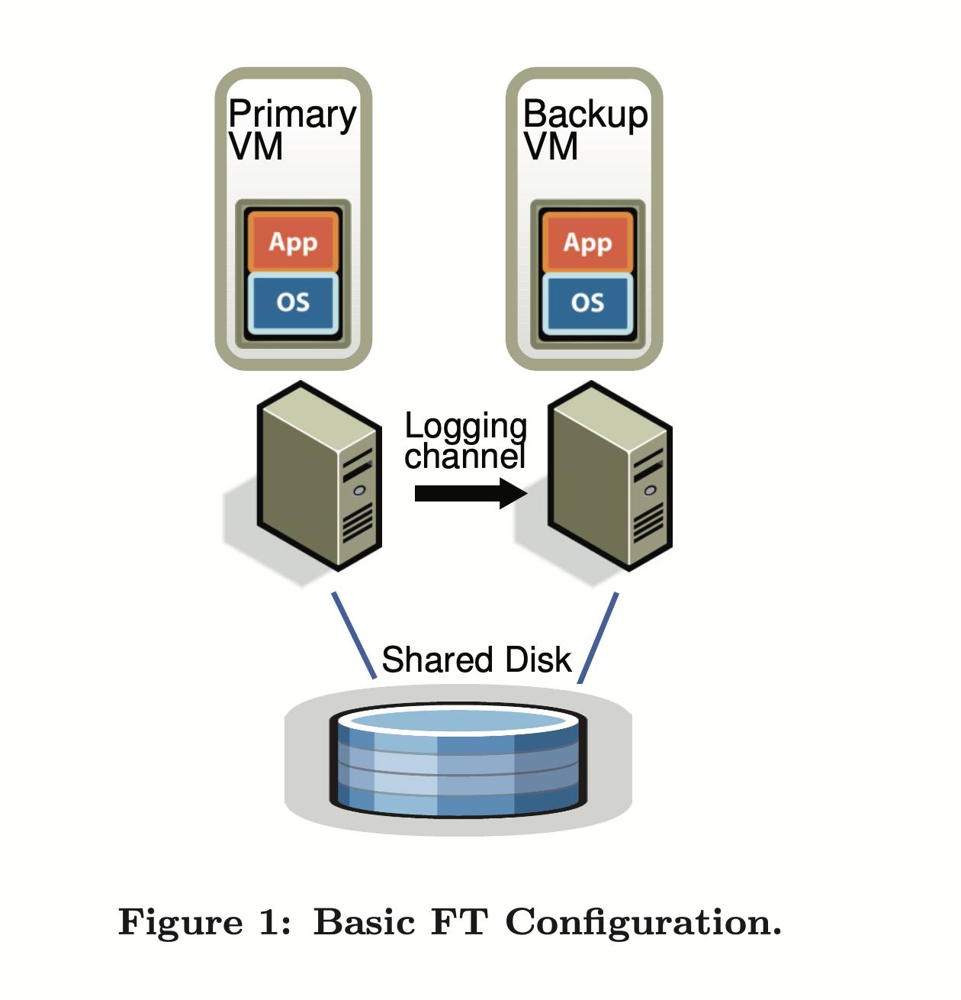
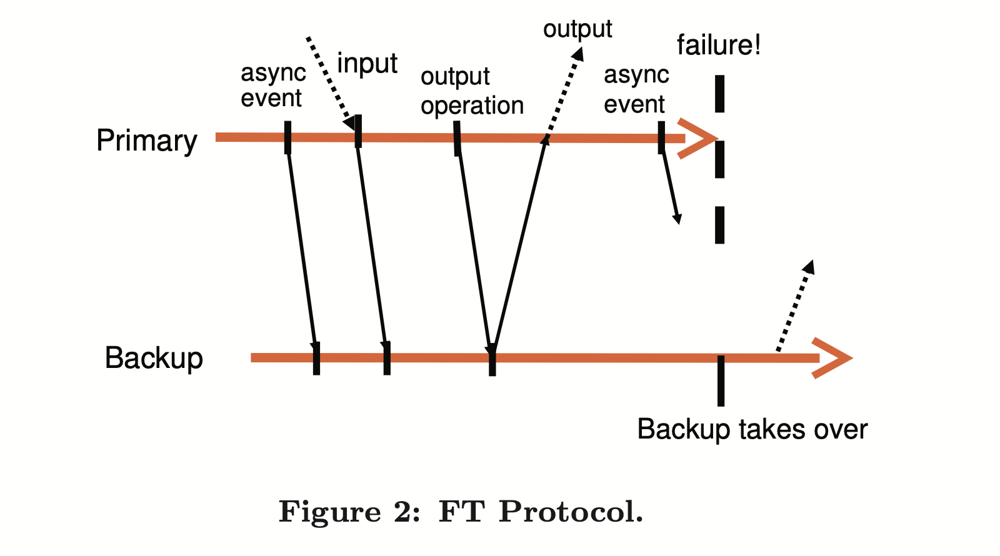
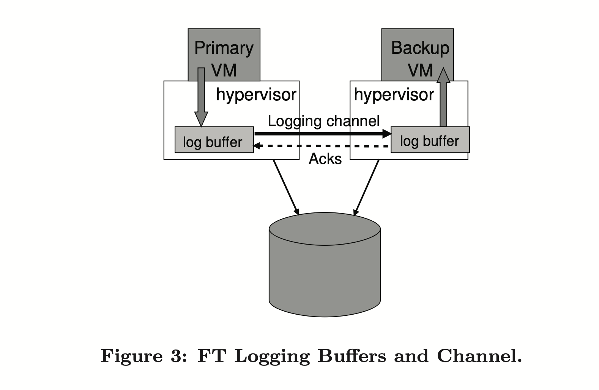

# The Design of a Practical System for Fault-Tolerant Virtual Machines(2010)

Daniel J. Scales, Mike Nelson, and Ganesh Venkitachalam VMware, Inc

[pdf link](https://github.com/Uyouii/MIT_6.824_2020_Project/blob/master/tutorial/LEC4%20Primary-Backup%20Replication/vm-ft.pdf)

## ABSTRACT

We have implemented a commercial enterprise-grade system for providing fault-tolerant virtual machines, based on the approach of replicating the execution of a primary virtual machine (VM) via a backup virtual machine on another server. We have designed a complete system in VMware Sphere 4.0 that is easy to use, runs on commodity servers, and typically reduces performance of real applications by less than 10%. In addition, the data bandwidth needed to keep the primary and secondary VM executing in lockstep is less than 20 Mbit/s for several real applications, which allows for the possibility of implementing fault tolerance over longer distances. An easy-to-use, commercial system that automatically restores redundancy after failure requires many additional components beyond replicated VM execution. We have designed and implemented these extra components and addressed many practical issues encountered in supporting VMs running enterprise applications. In this paper, we describe our basic design, discuss alternate design and choices and a number of the implementation details, and provide performance results for both micro-benchmarks and real applications.

## 1 INTRODUCTION

A common approach to implementing fault-tolerant servers is the primary/backup approach, where a backup server is always available to take over if the primary server fails. The state of the backup server must be kept nearly identical to the primary server at all times, so that the backup server can take over immediately when the primary fails, and in such a way that the failure is hidden to external clients and no data is lost. One way of replicating the state on the backup server is to ship changes to all state of the primary, including CPU, memory, and I/O devices, to the backup nearly continuously. However, the bandwidth needed to send this state, particular changes in memory, can be very large. 

A different method for replicating servers that can use much less bandwidth is sometimes referred to as the state-machine approach. The idea is to model the servers as deterministic state machines that are kept in sync by starting them from the same initial state and ensuring that they receive the same input requests in the same order. Since most servers or services have some operations that are not
deterministic, extra coordination must be used to ensure that a primary and backup are kept in sync. However, the amount of extra information need to keep the primary and backup in sync is far less than the amount of state (mainly memory updates) that is changing in the primary.

Implementing coordination to ensure deterministic execution of physical servers [14] is difficult, particularly as processor frequencies increase. In contrast, a virtual machine (VM) running on top of a hypervisor is an excellent platform for implementing the state-machine approach. A VM can be considered a well-defined state machine whose operations are the operations of the machine being virtualized (including all its devices). As with physical servers, VMs have some non-deterministic operations (e.g. reading a time-of-day clock or delivery of an interrupt), and so extra information must be sent to the backup to ensure that it is kept in sync. Since the hypervisor has full control over the execution of a VM, including delivery of all inputs, the hypervisor is able to capture all the necessary information about non-deterministic operations on the primary VM and to replay these operations correctly on the backup VM.

Hence, the state-machine approach can be implemented for virtual machines on commodity hardware, with no hard ware modifications, allowing fault tolerance to be implemented immediately for the newest microprocessors. In addition, the low bandwidth required for the state-machine approach allows for the possibility of greater physical separation of the primary and the backup. For example, replicated virtual machines can be run on physical machines distributed across a campus, which provides more reliability than VMs running in the same building.

We have implemented fault-tolerant VMs using the primary/backup approach on the VMware Sphere 4.0 platform, which runs fully virtualized x86 virtual machines in a highly-efficient manner. Since VMware Sphere implements a complete x86 virtual machine, we are automatically able to provide fault tolerance for any x86 operating systems and applications. The base technology that allows us to record the execution of a primary and ensure that the backup executes identically is known as deterministic replay. VMware Sphere Fault Tolerance (FT) is based on deterministic replay, but adds in the necessary extra protocols and functionality to build a complete fault-tolerant system. In addition to providing hardware fault tolerance, our system automatically restores redundancy after a failure by starting a new backup virtual machine on any available server in the local cluster. At this time, the production versions of both deterministic replay and VMware FT support only uni-processor VMs. Recording and replaying the execution of a multi-processor VM is still work in progress, with significant performance issues because nearly every access to shared memory can be a non-deterministic operation.

Bressoud and Schneider 3 describe a prototype implementation of fault-tolerant VMs for the HP PA-RISC platform. Our approach is similar, but we have made some fundamental changes for performance reasons and investigated a number of design alternatives. In addition, we have had to design and implement many additional components in the system and deal with a number of practical issues to build a complete system that is efficient and usable by customers running enterprise applications. Similar to most other practical systems discussed, we only attempt to deal with fail-stop failures, which are server failures that can be detected before the failing server causes an incorrect externally visible action. The rest of the paper is organized as follows. First, We describe our basic design and detail our fundamental protocols that ensure that no data is lost if a backup VM takes over after a primary VM fails. Then, we describe in detail many of the practical issues that must be addressed to build a robust, complete, and automated system. We also describe several design choices that arise for implementing fault-tolerant VMs and discuss the tradeoffs in these choices. Next, we give performance results for our implementation for some benchmarks and some real enterprise applications. Finally, we describe related work and conclude.

## 2 BASIC FT DESIGN

Figure 1 shows the basic setup of our system for faulttolerant VMs. For a given VM for which we desire to provide fault tolerance (the primary VM), we run a backup VM on a different physical server that is kept in sync and executes identically to the primary virtual machine, though with a small time lag. We say that the two VMs are in virtual lockstep. The virtual disks for the VMs are on shared storage (such as a Fibre Channel or SCSI disk array), and therefore accessible to the primary and backup VM for input and output. (We will discuss a design in which the primarv and backup VM have separate non-shared virtual disks in Section 4.1.) Only the primary VM advertises its presence on the network, so all network inputs come to the primary VM. Similarly, all other inputs (such as keyboard and mouse) go only to the primary VM.

All input that the primary VM receives is sent to the backup VM via a network connection known as the logging channel. For server workloads, the dominant input traffic is network and disk. Additional information, as discussed below in Section 2.1, is transmitted as necessary to ensure that the backup VM executes non-deterministic operations in the same way as the primary VM. The result is that the backup VM always executes identically to the primary VM. However, the outputs of the backup VM are dropped by the hypervisor, so only the primary produces actual outputs that are returned to clients. As described in Section 2.2, the primary and backup VM follow a specific protocol, including explicit acknowledgments by the backup VM, in order to ensure that no data is lost if the primary fails.

To detect if a primary or backup VM has failed, our system uses a combination of heart beating between the relevant servers and monitoring of the traffic on the logging channel. In addition, we must ensure that only one of the primary or backup VM takes over execution, even if there is a splitbrain situation where the primary and backup servers have lost communication with each other.

In the following sections, we provide more details on several important areas. In Section 2.1, we give some details
on the deterministic replay technology that ensures that primary and backup VMs are kept in sync via the information sent over the logging channel. In Section 2.2, we describe a fundamental rule of our FT protocol that ensures that no data is lost if the primary fails. In Section 2.3, we describe our methods for detecting and responding to a failure in a correct fashion.

### 2.1 Deterministic Replay Implementation

As we have mentioned, replicating server (or VM) execution can be modeled as the replication of a deterministic state machine. If two deterministic state machines are started in the same initial state and provided the exact same inputs in the same order, then they will go through the same sequences of states and produce the same outputs. A virtual machine has a broad set of inputs, including incoming network packets, disk reads, and input from the keyboard and mouse. Non-deterministic events (such as virtual interrupts) and non-deterministic operations (such as reading the clock cycle counter of the processor) also affect the VM's state. This presents three challenges for replicating execution of any VM running any operating system and workload:

1. correctly capturing all the input and non-determinism necessary to ensure deterministic execution of a backup virtual machine,
2.  correctly applying the inputs and non-determinism to the backup virtual machine
3. doing so in a manner that doesn't degrade performance.

In addition, many complex operations in ×86 microprocessors have undefined, hence non-deterministic, side effects. Capturing these undefined side effects and replaying them to produce the same state presents an additional challenge.

VMware deterministic replay 15 provides exactly this functionality for ×86 virtual machines on the VMware vSphere platform. Deterministic replay records the inputs of a VM and all possible non-determinism associated with the VM execution in a stream of log entries written to a log file. The VM execution may be exactly replayed later by reading the log entries from the file. For non-deterministic operations, sufficient information is logged to allow the operation to be reproduced with the same state change and output. For non-deterministic events such as timer or I completion in-terrupts, the exact instruction at which the event occurred is also recorded. During replay, the event is delivered at the same point in the instruction stream. VMware deterministic replay implements an efficient event recording and event delivery mechanism that employs various techniques, including the use of hardware performance counters developed in conjunction with AMD and Intel.

Bressoud and Schneider mention dividing the execution of VM into epochs, where non-deterministic events such as interrupts are only delivered at the end of an epoch. The notion of epoch seems to be used as a batching mechanism because it is too expensive to deliver each interrupt separately at the exact instruction where it occurred. However, our event delivery mechanism is efficient enough that VMware deterministic replay has no need to use epochs. Each interrupt is recorded as it occurs and efficiently delivered at the appropriate instruction while being replayed.

### 2.2 FT Protocol

For VMware FT, we use deterministic replay to produce the necessary log entries to record the execution of the primary VM, but instead of writing the log entries to disk, we send them to the backup VM via the logging channel. The backup VM replays the entries in real time, and hence executes identically to the primary VM. However, we must augment the logging entries with a strict FT protocol on the logging channel in order to ensure that we achieve fault tolerance. Our fundamental requirement is the following:

> **Output Requirement**: if the backup VM ever takes over after a failure of the primary, the backup VM will continue executing in a way that is entirely consistent with all outputs that the primary VM has sent to the external world. 

Note that after a failover occurs (i.e. the backup VM takes over after the failure of the primary VM), the backup VM will likely start executing quite differently from the way the primary VM would have continued executing, because of the many non-deterministic events happening during execution. However, as long as the backup VM satisfies the Output Requirement, no externally visible state or data is lost during a failover to the backup VM, and the clients will notice no interruption or inconsistency in their service.

The Output Requirement can be ensured by delaying any external output (typically a network packet) until the backup VM has received all information that will allow it to replay execution at least to the point of that output operation. One necessary condition is that the backup VM must have received all log entries generated prior to the output operation. These log entries will allow it to execute up to the point of the last log entry. However, suppose a failure were to happen immediately after the primary executed the output operation. The backup VM must know that it must keep replaying up to the point of the output operation and only "go live" (stop replaying and take over as the primary VM, as described in Section 2.3) at that point. If the backup were to go live at the point of the last log entry before the output operation, some non-deterministic event (e.g. timer interrupt delivered to the VM) might change its execution path before it executed the output operation.

Given the above constraints, the easiest way to enforce the Output Requirement is to create a special log entry at each output operation. Then, the Output Requirement may be enforced by this specific rule:

> Output Rule: the primary VM may not send an output to the external world, until the backup VM has received and acknowledged the log entry associated with the operation producing the output.

If the backup VM has received all the log entries, including the log entry for the output-producing operation, then the backup VM will be able to exactly reproduce the state of the primary VM at that output point, and so if the primary dies, the backup will correctly reach a state that is consistent with that output. Conversely, if the backup VM takes over without receiving all necessary log entries, then its state may quickly diverge such that it is inconsistent with the primarv's output. The Output Rule is in some ways analogous to the approach described in [11], where an "externally synchronous" IO can actually be buffered, as long as it is actually written to disk before the next external communication.

Note that the Output Rule does not say anything about stopping the execution of the primary VM. We need only
delay the sending of the output, but the VM itself can continue execution. Since operating systems do non-blocking network and disk outputs with asynchronous interrupts to indicate completion, the VM can easily continue execution and will not necessarily be immediately affected by the delay in the output. In contrast, previous work [3, 9] has typically indicated that the primary VM must be completely stopped prior to doing an output until the backup VM has acknowledged all necessary information from the primary VM.

As an example, we show a chart illustrating the requirements of the FT protocol in Figure 2. This figure shows a
timeline of events on the primary and backup VMs. The arrows going from the primary line to the backup line represent the transfer of log entries, and the arrows going from the backup line to the primary line represent acknowledgments. Information on asynchronous events, inputs, and output operations must be sent to the backup as log entries and acknowledged. As illustrated in the figure, an output to the external world is delayed until the primary VM has received an acknowledgment from the backup VM that it has received the log entry associated with the output operation. Given that the Output Rule is followed, the backup VM will be able to take over in a state consistent with the primary’s last output.

We cannot guarantee that all outputs are produced exactly once in a failover situation. Without the use of transactions with two-phase commit when the primary intends to send an output, there is no way that the backup can determine if a primary crashed immediately before or after sending its last output. Fortunately, the network infrastructure (including the common use of TCP) is designed to deal with lost packets and identical (duplicate) packets. Note that incoming packets to the primary may also be lost during a failure of the primary and therefore won't be delivered to the backup. However, incoming packets may be dropped for any number of reasons unrelated to server failure, so the network infrastructure, operating systems, and applications are all written to ensure that they can compensate for lost packets.

### 2.3 Detecting and Responding to Failure

As mentioned above, the primary and backup VMs must respond quickly if the other VM appears to have failed. If the backup VM fails, the primary VM will *go live* – that is, leave recording mode (and hence stop sending entries on the logging channel) and start executing normally. If the primary VM fails, the backup VM should similarly go live, but the process is a bit more complex. Because of its lag in execution, the backup VM will likely have a number of log entries that it has received and acknowledged, but have not yet been consumed because the backup VM hasn't reached the appropriate point in its execution yet. The backup VM must continue replaying its execution from the log entries until it has consumed the last log entry. At that point, the backup VM will stop replaying mode and start executing as a normal VM. In essence, the backup VM has been promoted to the primary VM (and is now missing a backup VM). Since it is no longer a backup VM, the new primary VM will now produce output to the external world when the guest OS does output operations. During the transition to normal mode, there may be some device-specific operations needed to allow this output to occur properly. In particular, for the purposes of networking, VMware FT automatically advertises the MAC address of the new primary VM on the network, so that physical network switches will know on what server the new primary VM is located. In addition, the newly promoted primary VM may need to reissue some disk IOs (as described in Section 3.4).

There are many possible ways to attempt to detect failure of the primary and backup VMs. VMware FT uses UDP heartbeating between servers that are running fault-tolerant VMs to detect when a server may have crashed. In addition, VMware FT monitors the logging traffic that is sent from the primary to the backup VM and the acknowledgments sent from the backup VM to the primary VM. Because of regular timer interrupts, the logging traffic should be regular and never stop for a functioning guest OS. Therefore, a halt in the flow of log entries or acknowledgments could indicate the failure of a VM. A failure is declared if heartbeating or logging traffic has stopped for longer than a specific timeout (on the order of a few seconds).

However, any such failure detection method is susceptible to a split-brain problem. If the backup server stops receiving heartbeats from the primary server, that may indicate that the primary server has failed, or it may just mean that all network connectivity has been lost between still functioning servers. If the backup VM then goes live while the primary VM is actually still running, there will likely be data corruption and problems for the clients communicating with the VM. Hence, we must ensure that only one of the primary or backup VM goes live when a failure is detected. To avoid split-brain problems, we make use of the shared storage that stores the virtual disks of the VM. When either a primary or backup VM wants to go live, it executes an atomic test-and-set operation on the shared storage. If the operation succeeds, the VM is allowed to go live. If the operation fails, then the other VM must have already gone live, so the current VM actually halts itself ("commits suicide"). If the VM cannot access the shared storage when trying to do the atomic operation, then it just waits until it can. Note that if shared storage is not accessible because of some failure in the storage network, then the VM would likely not be able to do useful work anyway because the virtual disks reside on the same shared storage. Thus, using shared storage to resolve split-brain situations does not introduce any extra unavailability.

One final aspect of the design is that once a failure has occurred and one of the VMs has gone live, VMware FT automatically restores redundancy by starting a new backup VM on another host. Though this process is not covered in most previous work, it is fundamental to making fault-tolerant VMs useful and requires careful design. More details are given in Section 3.1.

## 3 PRACTICAL IMPLEMENTATION OF FT

Section 2 described our fundamental design and protocols for FT. However, to create a usable, robust, and automatic system, there are many other components that must be designed and implemented.

### 3.1 Starting and Restarting FT VMs

One of the biggest additional components that must be designed is the mechanism for starting a backup VM in the same state as a primary VM. This mechanism will also be used when re-starting a backup VM after a failure has occurred. Hence, this mechanism must be usable for a running primary VM that is in an arbitrary state (i.e. not just starting up). In addition, we would prefer that the mechanism does not significantly disrupt the execution of the primary VM, since that will affect any current clients of the VM.

For VMware FT, we adapted the existing Motion functonality of VMware Sphere. VMware Motion [10] allows the migration of a running VM from one server to another server with minimal disruption – VM pause times are typically less than a second. We created a modified form of Motion that creates an exact running copy of a VM on a remote server, but without destroying the VM on the local server. That is, our modified FT Motion clones a VM to a remote host rather than migrating it. The FT VMotion also sets up a logging channel, and causes the source VM to enter logging mode as the primary, and the destination VM to enter replay mode as the new backup. Like normal VMotion, FT Motion typically interrupts the execution of the primary VM by less than a second. Hence, enabling FT on a running VM is an easy, non-disruptive operation.

Another aspect of starting a backup VM is choosing a server on which to run it. Fault-tolerant VMs run in a cluster of servers that have access to shared storage, so all VMs can tunically run on any server in the cluster. This fexibility allows VMware Sphere to restore FT redundancy even when one or more servers have failed. VMware Sphere implements a clustering service that maintains management and resource information. When a failure happens and a primary VM now needs a new backup VM to re-establish redundancy, the primary VM informs the clustering service that it needs a new backup. The clustering service determines the best server on which to run
the backup VM based on resource usage and other constraints and invokes an FT Motion to create the new backup VM. The result is that VMware FT typically can re-establish VM redundancy within minutes of a server failure, all without any noticeable interruption in the execution of a fault-tolerant VM.

### 3.2 Managing the Logging Channel

There are a number of interesting implementation details in managing the traffic on the logging channel. In our implementation, the hypervisors maintain a large buffer for logging entries for the primary and backup VMs. As the primary VM executes, it produces log entries into the log buffer, and similarly, the backup VM consumes log entries from its log buffer. The contents of the primary's log buffer are flushed out to the logging channel as soon as possible, and log entries are read into the backup's log buffer from the logging channel as soon as they arrive. The backup sends acknowledgments back to the primary each time that it reads some log entries from the network into its log buffer. These acknowledgments allow VMware FT to determine when an output that is delayed by the Output Rule can be sent. Figure 3 illustrates this process.

If the backup VM encounters an empty log buffer when it needs to read the next log entry, it will stop execution until a new log entry is available. Since the backup VM is not communicating externally, this pause will not affect any clients of the VM. Similarly, if the primary VM encounters a full log buffer when it needs to write a log entry, it must stop execution until log entries can be flushed out. This stop in execution is a natural flow-control mechanism that slows down the primary VM when it is producing log entries at too fast a rate. However, this pause can affect clients of the VM, since the primary VM will be completely stopped and unresponsive until it can log its entry and continue execution. Therefore, our implementation must be designed to minimize the possibility that the primary log buffer fills up.

One reason that the primary log buffer may fill up is because the backup VM is executing too slowly and therefore consuming log entries too slowly. In general, the backup VM must be able to replay an execution at roughly the same speed as the primary VM is recording the execution. Fortunately, the overhead of recording and replaying in VMware deterministic replay is roughly the same. However, if the server hosting the backup VM is heavily loaded with other VMs (and hence overcommitted on resources), the backup VM may not be able to get enough CPU and memory resources to execute as fast as the primary VM, despite the best efforts of the backup hypervisor's VM scheduler. 

Beyond avoiding unexpected pauses if the log buffers fill up, there is another reason why we don't wish the execution lag to become too large. If the primary VM fails, the backup VM must "catch up" by replaying all the log entries that it has already acknowledged before it goes live and starts communicating with the external world. The time to finish replaying is basically the execution lag time at the point of the failure, so the time for the backup to go live is roughly equal to the failure detection time plus the current execution lag time. Hence, we don't wish the execution lag time to be large (more than a second), since that will add significant time to the failover time.

Therefore, we have an additional mechanism to slow down the primary VM to prevent the backup VM from getting too far behind. In our protocol for sending and acknowledging log entries, we send additional information to determine the real-time execution lag between the primary and backup VMs. Typically the execution lag is less than 100 milliseconds. If the backup VM starts having a significant execution lag (say, more than 1 second), VMware FT starts slowing down the primary VM by informing the scheduler to give it a slightly smaller amount of the CPU (initially by just a few percent). We use a slow feedback loop, which will try to gradually pinpoint the appropriate CPU limit for the primary VM that will allow the backup VM to match its execution. If the backup VM continues to lag behind, we continue to gradually reduce the primary VM's CPU limit. Conversely, if the backup VM catches up, we gradually increase the primary VM's CPU limit until the backup VM returns to having a slight lag.

Note that such slowdowns of the primary VM are very rare, and typically happen only when the system is under extreme stress. All the performance numbers of Section 5 include the cost of any such slowdowns.

### 3.3 Operation on FT VMs

Another practical matter is dealing with the various control operations that may be applied to the primary VM. For example, if the primary VM is explicitly powered off, the backup VM should be stopped as well, and not attempt to go live. As another example, any resource management change on the primary (such as increased CPU share) should also be applied to the backup. For these kind of operations, special control entries are sent on the logging channel from the primary to the backup, in order to effect the appropriate operation on the backup.

In general, most operations on the VM should be initiated only on the primary VM. VMware FT then sends any necessary control entry to cause the appropriate change on the backup VM. The only operation that can be done independently on the primary and backup VMs is VMotion. That is, the primary and backup VMs can be Motioned independently to other hosts. Note that VMware FT ensures that neither VM is moved to the server where the other VM is, since that situation would no longer provide fault tolerance.

VMotion of a primary VM adds some complexity over a normal VMotion, since the backup VM must disconnect from the source primary and re-connect to the destination primary VM at the appropriate time. VMotion of a backup VM has a similar issue, but adds an additional complexity. For a normal VMotion, we require that all outstanding disk Its be quiesced (i.e. completed) just as the final switchover on the VMotion occurs. For a primary VM, this quiescing is easily handled by waiting until the physical IOs complete and delivering these completions to the VM. However, for a backup VM, there is no easy way to cause all IOs to be completed at any required point, since the backup VM must replay the primary VM's execution and complete IOs at the same execution point. The primary VM may be running a workload in which there are always disk IOs in flight during normal execution. VMware FT has a unique method to solve this problem. When a backup VM is at the final switchover point for a VMotion, it requests via the logging channel that the primary VM temporarily quiesce all of its IOs. The backup VM's IOs will then naturally be quiesced as well at a single execution point as it replays the primary VM's execution of the quiescing operation.

### 3.4 Implementation Issues for Disk IOs

There are a number of subtle implementation issues related to disk IO. First, given that disk operations are non-blocking and so can execute in parallel, simultaneous disk operations that access the same disk location can lead to non-determinism. Also, our implementation of disk IO uses DMA directly to/from the memory of the virtual machines, so simultaneous disk operations that access the same memory pages can also lead to non-determinism. Our solution is generally to detect any such IO races (which are rare), and force such racing disk operations to execute sequentially in the same way on the primary and backup.

Second, a disk operation can also race with a memory access by an application (or OS) in a VM, because the disk operations directly access the memory of a VM via DMA. For example, there could be a non-deterministic result if an application/OS in a VM is reading a memory block at the same time a disk read is occurring to that block. This situation is also unlikely, but we must detect it and deal with it if it happens. One solution is to set up page protection temporarily on pages that are targets of disk operations. The page protections result in a trap if the VM happens to make an access to a page that is also the target of an outstanding disk operation, and the VM can be paused until the disk operation completes. Because changing MMU protections on pages is an expensive operation, we choose instead to use bounce buffers. A bounce buffer is a temporary buffer that has the same size as the memory being accessed by a disk operation. A disk read operation is modified to read the specified data to the bounce buffer, and the data is copied to guest memory only as the IO completion is delivered. Similarly, for a disk write operation, the data to be sent is first copied to the bounce buffer, and the disk write is modified to write data from the bounce buffer. The use of the bounce buffer can slow down disk operations, but we have not seen it cause any noticeable performance loss. 

Third, there are some issues associated with disk IOs that are outstanding (i.e. not completed) on the primary when a failure happens, and the backup takes over. There is no way for the newly-promoted primary VM to be sure if the disk IOs were issued to the disk or completed successfully. In addition, because the disk IOs were not issued externally on the backup VM, there will be no explicit IO completion for them as the newly-promoted primary VM continues to run, which would eventually cause the guest operating system in the VM to start an abort or reset procedure. We could send an error completion that indicates that each IO failed, since it is acceptable to return an error even if the IO completed successfully. However, the guest OS might not respond well to errors from its local disk. Instead, we re-issue the pending IOs during the go-live process of the backup VM. Because we have eliminated all races and all IOs specify directly which memory and disk blocks are accessed, these disk operations can be reissued even if they have already completed successfully (i.e. they are idempotent).

### 3.5 Implementation Issues for Network IO

VMware vSphere provides many performance optimizations for VM networking. Some of these optimizations are based on the hypervisor synchronously updating the state of the virtual machine's network device. For example, receive buffers can be updated directly by the hypervisor while the VM is executing. Unfortunately these asynchronous updates to a VM's state add non-determinism. Unless we can guarantee that all updates happen at the same point in the instruction stream on the primary and the backup, the backup's execution can diverge from that of the primary. 

The biggest change to the networking emulation code for FT is the disabling of the asynchronous network optimizations. The code that asynchronously updates VM ring buffers with incoming packets has been modified to force the guest to trap to the hypervisor, where it can log the updates and then apply them to the VM. Similarly, code that normally pulls packets out of transmit queues asynchronously is disabled for FT, and instead transmits are done through a trap to the hypervisor (except as noted below).

The elimination of the asynchronous updates of the network device combined with the delaying of sending packets described in Section 2.2 has provided some performance challenges for networking. We've taken two approaches to improving VM network performance while running FT. First. we implemented clustering optimizations to reduce VM traps and interrupts. When the VM is streaming data at a sufficient bit rate, the hypervisor can do one transmit trap per group of packets and, in the best case, zero traps, since it can transmit the packets as part of receiving new packets. Likewise, the hypervisor can reduce the number of interrupts to the VM for incoming packets by only posting the interrupt for a group of packets.

Our second performance optimization for networking involves reducing the delay for transmitted packets. As noted earlier, the hypervisor must delay all transmitted packets until it gets an acknowledgment from the backup for the appropriate log entries. The key to reducing the transmit delay is to reduce the time required to send a log message to the backup and get an acknowledgment. Our primary optimizations in this area involve ensuring that sending and receiving log entries and acknowledgments can all be done without any thread context switch. The VMware Sphere hypervisor allows functions to be registered with the TCP stack that will be called from a deferred-execution context (similar to a tasklet in Linux) whenever TCP data is received. This allows us to quickly handle any incoming log messages on the backup and any acknowledgments received by the primary without an thread context switches. In addition. when the primary VM enqueues a packet to be transmitted, we force an immediate log flush of the associated output log entry (as described in Section 2.2 by scheduling a deferred-execution context to do the flush.

## 4 DESIGN ALTERNATIVES

In our implementation of VMware FT, we have explored a number of interesting design alternatives. In this section, we explore some of these alternatives.

### 4.1 Shared vs. Non-shared Disk

In our default design, the primary and backup VMs share the same virtual disks. Therefore, the content of the shared disks is naturally correct and available if a failover occurs. Essentially, the shared disk is considered external to the primary and backup VMs, so any write to the shared disk is considered a communication to the external world. Therefore, only the primary VM does actual writes to the disk, and writes to the shared disk must be delayed in accordance with the Output Rule.

An alternative design is for the primary and backup VMs to have separate (non-shared) virtual disks. In this design, the backup VM does do all disk writes to its virtual disks, and in doing so, it naturally keeps the contents of its virtual disks in sync with the contents of the primary VM's virtual disks. Figure 4 illustrates this configuration. In the case of non-shared disks, the virtual disks are essentially considered part of the internal state of each VM. Therefore, disk writes of the primary do not have to be delayed according to the Output Rule. The non-shared design is quite useful in cases where shared storage is not accessible to the primary and backup VMs. This may be the case because shared storage is unavailable or too expensive, or because the servers running the primary and backup VMs are far apart ("long-distance FT"). One disadvantage of the non-shared design is that the two copies of the virtual disks must be explicitly synced up in some manner when fault tolerance is first enabled. In addition, the disks can get out of sync after a failure, so they must be explicitly resynced when the backup VM is restarted after a failure. That is, FT VMotion must not only sync the running state of the primary and backup VMs, but also their disk state. In the non-shared-disk configuration, there may be no shared storage to use for dealing with a split-brain situation.

In this case, the system could use some other external tiebreaker, such as a third-party server that both servers can talk to. If the servers are part of a cluster with more than two nodes, the system could alternatively use a majority algorithm based on cluster membership. In this case, a VM would only be allowed to go live if it is running on a server that is part of a communicating sub-cluster that contains a majority of the original nodes.

### 4.2 Executing Disk Reads on the Backup VM

In our default design, the backup VM never reads from its virtual disk (whether shared or non-shared). Since the disk read is considered an input, it is natural to send the results of the disk read to the backup VM via the logging channel.

An alternate design is to have the backup VM execute disk reads and therefore eliminate the logging of disk read data. This approach can greatly reduce the traffic on the logging channel for workloads that do a lot of disk reads. However, this approach has a number of subtleties. It may slow down the backup VM's execution, since the backup VM must execute all disk reads and wait if they are not physically completed when it reaches the point in the VM execution where they completed on the primary.

Also, some extra work must be done to deal with failed disk read operations. If a disk read by the primary succeeds but the corresponding disk read by the backup fails, then the disk read by the backup must be retried until it succeeds, since the backup must get the same data in memory that the primary has. Conversely, if a disk read by the primary fails, then the contents of the target memory must be sent to the backup via the logging channel, since the contents of memory will be undetermined and not necessarily replicated by a successful disk read by the backup VM.

Finally, there is a subtlety if this disk-read alternative is used with the shared disk configuration. If the primary VM does a read to a particular disk location, followed fairly soon by a write to the same disk location, then the disk write must be delayed until the backup VM has executed the first disk read. This dependence can be detected and handled correctly, but adds extra complexity to the implementation.

In Section 5.1, we give some performance results indicating that executing disk reads on the backup can cause some slightly reduced throughput (1-4%) for real applications, but can also reduce the logging bandwidth noticeably. Hence, executing disk reads on the backup VM may be useful in cases where the bandwidth of the logging channel is quite limited.