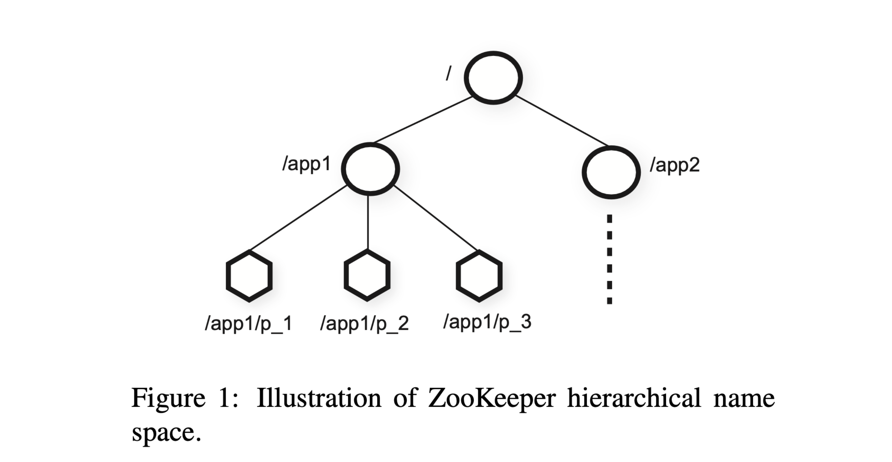

# ZooKeeper: Wait-free coordination for Internet-scale systems

## Abstract

In this paper, we describe ZooKeeper, a service for coordinating processes of distributed applications. Since ZooKeeper is part of critical infrastructure, ZooKeeper aims to provide a simple and high performance kernel for building more complex coordination primitives at the client. It incorporates elements from group messaging, shared registers, and distributed lock services in a replicated, centralized service. The interface exposed by ZooKeeper has the wait-free aspects of shared registers with an event-driven mechanism similar to cache invalidations of distributed file systems to provide a simple, yet powerful coordination service.

The ZooKeeper interface enables a high-performance service implementation. In addition to the wait-free property, ZooKeeper provides a per client guarantee of FIFO execution of requests and linearizability for all requests that change the ZooKeeper state. These design decisions enable the implementation of a high performance processing pipeline with read requests being satisfied by local servers. We show for the target workloads, 2:1 to 100:1 read to write ratio, that ZooKeeper can handle tens to hundreds of thousands of transactions per second. This performance allows ZooKeeper to be used extensively by client applications.

## 1 Introduction

Large-scale distributed applications require different forms of coordination. Configuration is one of the most basic forms of coordination. In its simplest form, configuration is just a list of operational parameters for the system processes, whereas more sophisticated systems have dynamic configuration parameters. Group member-ship and leader election are also common in distributed systems: often processes need to know which other pro-cesses are alive and what those processes are in charge of. Locks constitute a powerful coordination primitive that implement mutually exclusive access to critical resources.

One approach to coordination is to develop services for each of the different coordination needs. For exam-ple, Amazon Simple Queue Service focuses specifically on queuing. Other services have been developed specifically for leader election and configuration. Services that implement more powerful primitives can be used to implement less powerful ones. For example, Chubby is a locking service with strong synchronization guarantees. Locks can then be used to implement leader election, group membership, etc.

When designing our coordination service, we moved away from implementing specific primitives on the server side, and instead we opted for exposing an API that enables application developers to implement their own primitives. Such a choice led to the implementation of a *coordination kernel* that enables new primitives without requiring changes to the service core. This approach enables multiple forms of coordination adapted to the requirements of applications, instead of constraining developers to a fixed set of primitives.

When designing the API of ZooKeeper, we moved away from blocking primitives, such as locks. Blocking primitives for a coordination service can cause, among other problems, slow or faulty clients to impact negatively the performance of faster clients. The implementation of the service itself becomes more complicated if processing requests depends on responses and failure detection of other clients. Our system, Zookeeper, hence implements an API that manipulates simple *wait-free* data objects organized hierarchically as in file systems. In fact, the ZooKeeper API resembles the one of any other file system, and looking at just the API signatures, ZooKeeper seems to be Chubby without the lock methods, open, and close. Implementing wait-free data objects, however, differentiates ZooKeeper significantly from systems based on blocking primitives such as locks.

Although the wait-free property is important for performance and fault tolerance, it is not sufficient for coordination. We have also to provide order guarantees for operations. In particular, we have found that guaranteeing both *FIFO client ordering* of all operations and *linearizable writes* enables an efficient implementation of the service and it is sufficient to implement coordination primitives of interest to our applications. In fact, we can implement consensus for any number of processes with our API, and according to the hierarchy of Herlihy, ZooKeeper implements a universal object.

The ZooKeeper service comprises an ensemble of servers that use replication to achieve high availability and performance. Its high performance enables applications comprising a large number of processes to use such a coordination kernel to manage all aspects of coordination. We were able to implement ZooKeeper using a simple pipelined architecture that allows us to have hundreds or thousands of requests outstanding while still achieving low latency. Such a pipeline naturally enables the execution of operations from a single client in FIFO order. Guaranteeing FIFO client order enables clients to submit operations asynchronously. With asynchronous operations, a client is able to have multiple outstanding operations at a time. This feature is desirable, for example, when a new client becomes a leader and it has to manipulate metadata and update it accordingly. Without the possibility of multiple outstanding operations, the time of initialization can be of the order of seconds instead of sub-second.

To guarantee that update operations satisfy linearizability, we implement a leader-based atomic broadcast protocol, called **Zab**. A typical workload of a ZooKeeper application, however, is dominated by read operations and it becomes desirable to scale read throughput. In ZooKeeper, servers process read operations locally, and we do not use Zab to totally order them.

Caching data on the client side is an important technique to increase the performance of reads. For example, it is useful for a process to cache the identifier of the current leader instead of probing ZooKeeper every time it needs to know the leader. ZooKeeper uses a watch mechanism to enable clients to cache data without managing the client cache directly. With this mechanism, a client can watch for an update to a given data object, and receive a notification upon an update. Chubby manages the client cache directly. It blocks updates to invalidate the caches of all clients caching the data being changed. Under this design, if any of these clients is slow or faulty, the update is delayed. Chubby uses leases to prevent a faulty client from blocking the system indefinitely. Leases, however, only bound the impact of slow or faulty clients, whereas ZooKeeper watches avoid the problem altogether.

In this paper we discuss our design and implementation of ZooKeeper. With ZooKeeper, we are able to implement all coordination primitives that our applications require, even though only writes are linearizable. To validate our approach we show how we implement some coordination primitives with ZooKeeper.

To summarize, in this paper our main contributions are: 

- **Coordination kernel**: We propose a wait-free coordination service with relaxed consistency guarantees for use in distributed systems. In particular, we describe our design and implementation of a *coordination kernel*, which we have used in many critical applications to implement various coordination techniques.
- Coordination recipes: We show how ZooKeeper can be used to build higher level coordination primitives, even blocking and strongly consistent primitives, that are often used in distributed applications.

- Experience with Coordination: We share some of the ways that we use ZooKeeper and evaluate its performance.

## 2 The ZooKeeper service

Clients submit requests to ZooKeeper through a client API using a ZooKeeper client library. In addition to exposing the ZooKeeper service interface through the client API, the client library also manages the network connections between the client and ZooKeeper servers.

In this section, we first provide a high-level view of the ZooKeeper service. We then discuss the API that clients use to interact with ZooKeeper.

**Terminology.** In this paper, we use *client* to denote a user of the ZooKeeper service, *server* to denote a process providing the ZooKeeper service, and *znode* to denote an in-memory data node in the ZooKeeper data, which is organized in a hierarchical namespace referred to as the *data tree*. We also use the terms update and write to refer to any operation that modifies the state of the data tree. Clients establish a *session* when they connect to ZooKeeper and obtain a session handle through which they issue requests.

### 2.1 Service overview

ZooKeeper provides to its clients the abstraction of a set of data nodes (znodes), organized according to a hierarchical name space. The znodes in this hierarchy are data objects that clients manipulate through the ZooKeeper API. Hierarchical name spaces are commonly used in file systems. It is a desirable way of organizing data objects, since users are used to this abstraction and it enables better organization of application meta-data. To refer to a given znode, we use the standard UNIX notation for file system paths. For example, we use /A/B/C to denote the path to znode C, where C has B as its parent and B has A as its parent. All znodes store data, and all znodes, except for ephemeral znodes, can have children.

There are two types of znodes that a client can create: 

- **Regular**: Clients manipulate regular znodes by creating and deleting them explicitly;
- **Ephemeral**(短暂的): Clients create such znodes, and they either delete them explicitly, or let the system remove them automatically when the session that creates them terminates (deliberately or due to a failure)

Additionally, when creating a new znode, a client can set a *sequential* flag. Nodes created with the sequential flag set have the value of a monotonically increasing counter appended to its name. If n is the new znode and p is the parent znode, then the sequence value of n is never smaller than the value in the name of any other sequential znode ever created under p.

ZooKeeper implements watches to allow clients to receive timely notifications of changes without requiring polling. When a client issues a read operation with a watch flag set, the operation completes as normal except that the server promises to notify the client when the information returned has changed. Watches are one-time triggers associated with a session; they are unregistered once triggered or the session closes. Watches indicate that a change has happened, but do not provide the change. For example, if a client issues a getData(‘‘/foo’’, true) before “/foo” is changed twice, the client will get one watch event telling the client that data for “/foo” has changed. Session events, such as connection loss events, are also sent to watch callbacks so that clients know that watch events may be delayed.

**Data model.** The data model of ZooKeeper is essentially a file system with a simplified API and only full data reads and writes, or a key/value table with hierarchical keys. The hierarchal namespace is useful for allocating subtrees for the namespace of different applications and for setting access rights to those subtrees. We also exploit the concept of directories on the client side to build higher level primitives as we will see in section 2.4.

Unlike files in file systems, znodes are not designed for general data storage. Instead, znodes map to abstractions of the client application, typically corresponding to meta-data used for coordination purposes. To illustrate, in Figure 1 we have two subtrees, one for Application 1 (/app1) and another for Application 2 (/app2). The subtree for Application 1 implements a simple group membership protocol: each client process pi creates a znode p i under /app1, which persists as long as the process is running.

Although znodes have not been designed for general data storage, ZooKeeper does allow clients to store some information that can be used for meta-data or configuration in a distributed computation. For example, in a leader-based application, it is useful for an application server that is just starting to learn which other server is currently the leader. To accomplish this goal, we can have the current leader write this information in a known location in the znode space. Znodes also have associated meta-data with time stamps and version counters, which allow clients to track changes to znodes and execute conditional updates based on the version of the znode.

**Sessions.** A client connects to ZooKeeper and initiates a session. Sessions have an associated timeout. ZooKeeper considers a client faulty if it does not receive anything from its session for more than that timeout. A session ends when clients explicitly close a session handle or ZooKeeper detects that a clients is faulty. Within a session, a client observes a succession of state changes that reflect the execution of its operations. Sessions enable a client to move transparently from one server to another within a ZooKeeper ensemble, and hence persist across ZooKeeper servers.

### 2.2 Client API

We present below a relevant subset of the ZooKeeper API, and discuss the semantics of each request.

**create(path, data, flags)**: Creates a znode with path name **path**, stores ***data[]*** in it, and returns the name of the new znode. **flags** enables a client to select the type of znode: regular, ephemeral, and set the sequential flag;

**delete(path, version)**: Deletes the znode **path** if that znode is at the expected version;

**exists(path, watch)**: Returns true if the znode with path name path exists, and returns false otherwise. The watch flag enables a client to set a watch on the znode;

**getData(path, watch)**: Returns the data and meta-data, such as version information, associated with the znode. The **watch** flag works in the same way as it does for **exists()**, except that ZooKeeper does not set the watch if the znode does not exist;

**setData(path, data, version)**: Writes **data[]** to znode **path** if the version number is the current version of the znode;

**getChildren(path, watch)**: Returns the set of names of the children of a znode;

**sync(path)**: Waits for all updates pending at the start of the operation to propagate to the server that the client is connected to. The path is currently ignored.

All methods have both a synchronous and an asynchronous version available through the API. An application uses the synchronous API when it needs to execute a single ZooKeeper operation and it has no concurrent tasks to execute, so it makes the necessary ZooKeeper call and blocks. The asynchronous API, however, enables an application to have both multiple outstanding ZooKeeper operations and other tasks executed in parallel. The ZooKeeper client guarantees that the corresponding callbacks for each operation are invoked in order.

Note that ZooKeeper does not use handles to access znodes. Each request instead includes the full path of the znode being operated on. Not only does this choice simplifies the API (no **open()** or **close()** methods), but it also eliminates extra state that the server would need to maintain.

Each of the update methods take an expected version number, which enables the implementation of conditional updates. If the actual version number of the znode does not match the expected version number the update fails with an unexpected version error. If the version number is −1, it does not perform version checking.

### 2.3 ZooKeeper guarantees

ZooKeeper has two basic ordering guarantees:

- **Linearizable writes**: all requests that update the state of ZooKeeper are serializable and respect precedence;

- **FIFO client order**: all requests from a given client are executed in the order that they were sent by the

  client.

Note that our definition of linearizability is different from the one originally proposed by Herlihy, and we call it ***A-linearizability*** (asynchronous linearizability). In the original definition of linearizability by Herlihy, a client is only able to have one outstanding operation at a time (a client is one thread). In ours, we allow a client to have multiple outstanding operations, and consequently we can choose to guarantee no specific order for outstanding operations of the same client or to guarantee FIFO order. We choose the latter for our property. It is important to observe that all results that hold for linearizable objects also hold for A-linearizable objects because a system that satisfies A-linearizability also satisfies linearizability. Because only update requests are A-linearizable, ZooKeeper processes read requests locally at each replica. This allows the service to scale linearly as servers are added to the system.

To see how these two guarantees interact, consider the following scenario. A system comprising a number of processes elects a leader to command worker processes. When a new leader takes charge of the system, it must change a large number of configuration parameters and notify the other processes once it finishes. We then have two important requirements:

- As the new leader starts making changes, we do not want other processes to start using the configuration that is being changed;
- If the new leader dies before the configuration has been fully updated, we do not want the processes to use this partial configuration.

Observe that distributed locks, such as the locks provided by Chubby, would help with the first requirement but are insufficient for the second. With ZooKeeper, the new leader can designate a path as the ***ready*** znode; other processes will only use the configuration when that znode exists. The new leader makes the configuration change by deleting ***ready***, updating the various configuration znodes, and creating ***ready***. All of these changes can be pipelined and issued asynchronously to quickly update the configuration state. Although the latency of a change operation is of the order of 2 milliseconds, a new leader that must update 5000 different znodes will take 10 seconds if the requests are issued one after the other; by issuing the requests asynchronously the requests will take less than a second. Because of the ordering guarantees, if a process sees the *ready* znode, it must also see all the configuration changes made by the new leader. If the new leader dies before the *ready* znode is created, the other processes know that the configuration has not been finalized and do not use it.

The above scheme still has a problem: what happens if a process sees that ***ready*** exists before the new leader starts to make a change and then starts reading the configuration while the change is in progress. This problem is solved by the ordering guarantee for the notifications: if a client is watching for a change, the client will see the notification event before it sees the new state of the system after the change is made. Consequently, if the process that reads the ***ready*** znode requests to be notified of changes to that znode, it will see a notification informing the client of the change before it can read any of the new configuration.
