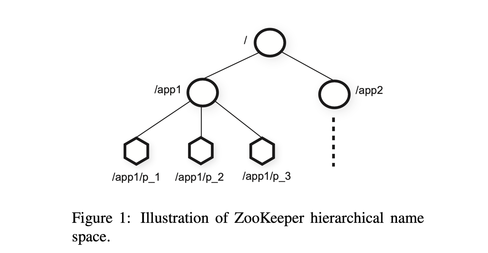

# ZooKeeper

本文是对[ZooKeeper: Wait-free coordination for Internet-scale systems](http://nil.csail.mit.edu/6.824/2020/papers/zookeeper.pdf)的翻译和总结

## Abstract

在这篇文章中，我们介绍了一个用来协调分布式进程的服务：ZooKeeper。ZooKeeper 是核心基础设施的一部分，它的目标是为client 构建更复杂的同步原语提供一个简单并且高性能的内核。它将集群消息传递(group messaging)、共享寄存器(shared registers)和分布式锁(distributed lock services)组合到一个分布式的服务中。ZooKeeper的接口具有共享寄存器的无等待(wait-free)特性，并且具有类似于分布式系统文件中缓存失效的事件驱动机制，以提供一个简单强大的协作服务(coordination service)。

ZooKeeper的接口性能非常高。除了wait-free特性外，ZooKeeper 还保证每个 client 的请求 FIFO 特性，以及线性化的更改ZooKeeper的状态。这些设计策略可以实现一个满足本地服务器读性能要求的高性能处理管道。对于2:1 到 100:1 的读写比，ZooKeeper每秒可以处理数万或者数十万个事务。基于这些特性，ZooKeeper 被客户端程序广泛使用。

## 1 Introduction

大型的分布式系统通常要求不同程度的协作，配置(Configuration)是其中的一个最基础的形式。一个最简单的形式是，只配置一些系统进程的运行参数，更复杂的系统则要求动态配置参数。集群中 member 和 leader 的选举在分布式系统中也很常见：通常进程需要感知到其他哪些进程还活着，以及这些进程负责什么。锁(Locks)则构成了一个强大的同步原语，来实现对关键资源的互斥访问。

一种分布式协作的方式是为每种不同的同步需求单独开发服务。例如，Amazon Simple Queue Service用于队列，其他一些服务则专门用于 leader 选举和配置。一些更强大的同步原语的服务可以用来实现对同步要求更低的服务。例如，Chubby是一个强一致性的锁服务，而锁可以用来实现 leader 选举。

当设计我们的协作服务时，我们不在每个服务上实现特定的语法，而是实现一个通用的接口，让开发人员可以实现他们自己的语法。即实现了一个“协作内核”，不需要改变核心服务，也可以实现新的同步语法。这种方式可以根据不同服务的需求，实现多种方式的同步，而不是将开发人员限制在一组固定的语法上。

在设计 ZooKeeper 的 API 时，我们放弃的阻塞原语，例如锁（Locks）。阻塞语法可能会导致慢速，故障的 client 对高性能的 client 造成负面影响等问题。如果请求处理需要依赖于其他 client 的结果和错误检测，服务本身的实现也会变得更加复杂。因此，ZooKeeper 的 API可以像文件系统一样操作简单的分层组织的*wait-free*数据对象。实际上，ZooKeeper 看起来就和文件系统一样。仅看 API 的签名的话，ZooKeeper 看起来像没有lock methods, open 和 close的 Chubby。但是wait-free的数据对象的特性是 ZooKeeper 与基于阻塞原语（例如锁）的系统有着很大的不同。

虽然wait-free特性对于性能和容错很重要，但是对协作(coordination)来说还不够。我们还必须保证操作的有序性。尤其我们发现保证所有操作的FIFO的client顺序和线性化的写入(linearizable writes)可以实现一个高效的服务，而且足以实现我们应用程序需要的协作语法。实际上可以使用我们的 API 达成任意数量进程的共识。并且根据Herlihy的层次结构，ZooKeeper 实现了一个全局对象(universal object)。

ZooKeeper服务由一组服务器组成，通过复制实现高可用性和高性能。它的高性能保证了由大量进程组成的应用程序使用它来管理协作的各个方面。我们使用简单的 pipeline 架构来实现 ZooKeeper，保证了我们在处理大量请求的同时，仍然能保证低延迟。而且 pipeline 天然支持client请求的 FIFO 特性。client 请求的 FIFO 保证了client 可以异步提交请求。通过异步操作，client也可以同时发起多个请求。这个特性是可选的，例如，当一个新的 client 成为 leader 时，它需要更改并更新元数据。在不存在多个未完成操作的情况下，初始化的时间也可能是秒级而不是亚秒级。

为了保证线性的更新操作，我们实现了一个基于 leader 的原子广播协议，**Zab**。但是 ZooKeeper应用的主要负载来源于read 操作，所以需要扩展read的吞吐量。在 ZooKeeper 中，server 在本地直接处理 read 操作，不会使用 Zab 协议对 read 操作进行排序。

在 client 侧缓存数据是提升 read 性能的一个有效的方法。例如，进程可以缓存当前leader 的数据，而不是每次需要获取 leader的信息时都访问 Zookeeper。ZooKeeper 使用 **watch** 机制让 client 在缓存数据的同时，不需要直接管理缓存数据。通过这种机制，client 可以监听给定数据的更新，并且在更新时收到通知。Chubby 直接管理 client 缓存。它会阻止更新，使所有缓存正在更新的数据的 client 的缓存失效。在这种设计下，如果这些客户端出现延迟或者故障，更新就会被延迟。Chubby 使用leases（租约）来防止故障的 client 永久阻塞系统。但是 leases 只能限制慢速或者故障的 client，但是 ZooKeeper 的 watch机制则完全避免了这个问题。

在本文中我们讨论了 ZooKeeper 的设计与实现。我们可以使用 ZooKeeper 实现应用程序需要的所有coordination primitives，即使只有 write 操作是线性化的。为了验证我们的方法，我们展示了如何使用 ZooKeeper 实现一些coordination primitives。

总而言之，在本文中我们的主要贡献是：

- **Coordination kernel**：我们提出了一种保证relaxed consistency，用于分布式系统的，无等待（wait-free） 的协作服务。重点是，我们描述了在很多核心程序中用来实现多种协作技术的***coordination kernel***的设计与实现。
- **Coordination recipes**：我们展示了如何使用ZooKeeper来构建更高级别的coordination primitives，尤其是分布式系统中经常使用的阻塞（blocking）和强一致性（strongly consistent）的primitives。
- **Experience with Coordination**：我们分享了一些使用 ZooKeeper 和评估其性能的方法。

## 2 The ZooKeeper service

client使用ZooKeeper client library 提供的 client API 请求ZooKeeper。client library除了提供 client API 访问 ZooKeeper 的接口外，还负责管理 client 和 ZooKeeper server 之间的网络连接。

在本章节中，我们首先提供一个整体的ZooKeeper 服务的视图，然后讨论下 client 和 ZooKeeper 交互的 API。

**Terminology**（术语）：本文中，我们使用*client*表示 ZooKeeper 服务的用户，*server*表示提供 ZooKeeper服务的进程，*znode* 表示 ZooKeeper 中的内存数据节点(data node)，这些数据节点通过*data tree*的方式组织在分层命名空间中。我们还使用terms update, write 来指代修改 data tree 状态的操作。clients 在连接 ZooKeeper 时会建立一个*session*，并且会获取一个 session handle 用来发送请求。

### 2.1 Service overview

ZooKeeper向 client 提供了一组通过分层命名空间(hierarchical name space)组织的数据节点（znode）的抽象。client通过ZooKeeper API来操作分层结构中的数据对象，znode。分层命名空间(hierarchical name spaces)通常用于文件系统中。这是一种理想的组织数据对象的方式，因为用户已经习惯了这种抽象，并且可以更好的管理应用程序的元数据。我们可以使用 UNIX 系统中标准系统文件路径的方式来引用 znode。例如，我们使用/A/B/C来表示 znode C 的路径，其中 C 的父节点是 B，B 的父节点是 A。所有的 znode 都存储数据，除了临时 zonde 之外，所有的 znode 都可以有子节点。

client 可以创建两种类型的 znode：

- **Regular**：client 通过显式的创建和删除来管理 regular znode。
- **Ephemeral**(临时的)：client 创建这种类型的 znode 后，要么显示的删除它们，要么让系统在 session（会话）终止的时候自动删除它们。

此外，在创建新的 znode 时，client 可以设置一个*sequential*flag。设置了sequential flag的节点会在名称中附加一个单调递增计数器的值。假如 n 是一个新的节点，p 是父节点，n 的序列号则不会小于p 下已经创建的其他sequential节点名称中的序列号。

ZooKeeper 实现了 watches，允许 client 不需要轮询也能及时接收更改通知。在 client 设置了 watch flag 的情况下发出 read 请求时，操作也会正常完成，只是 server 承诺在返回的信息变更时通知 client。watches 是与 session 关联的一次性触发器，一旦触发或者 session 关闭，它们就会取消注册。watches 表明更改已经发生，但是不提供更改的具体内容。例如，如果执行了`getData(‘‘/foo’’, true)`后更改了两次，client 将会收到一个watch事件，告诉 client`“/foo”`数据已经更改。Session事件(例如链接断开事件)也会触发 watch 回调，以便 client 感知 watch 事件可能会延迟。

**Data model.** ZooKeeper的数据模型本质上是具有简化版的接口，只能进行完整数据读写的文件系统，或者是一个具有分层接口的key/value表。分层命名空间对于为不同的应用程序分配子树，以及为这些子树设置访问权限很有用。我们还利用 client 的目录概念来构建更高级别的语法，例如2.4节的内容。

