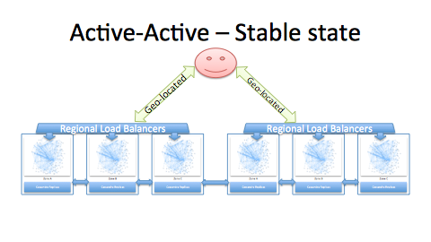
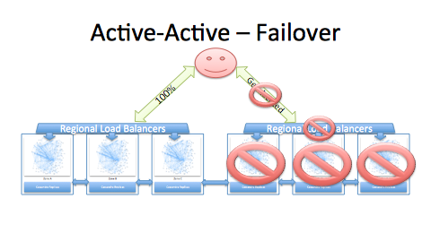
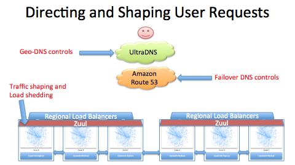
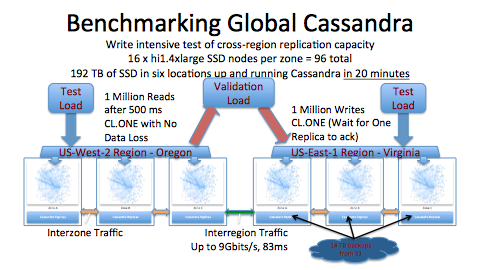
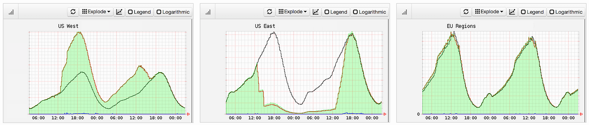
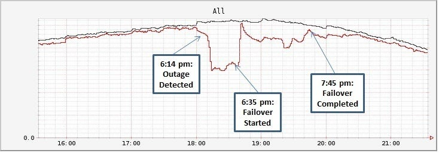

## Active-Active for Multi-Regional Resiliency

*by Ruslan Meshenberg, Naresh Gopalani, and Luke Kosewski*

https://netflixtechblog.com/active-active-for-multi-regional-resiliency-c47719f6685b

In June, [we talked about Isthmus](https://medium.com/@Netflix_Techblog/isthmus-resiliency-against-elb-outages-d9e0623484f3) — our approach to achieve resiliency against region-wide ELB outage. After completing the Isthmus project we embarked on the next step in our quest for higher resiliency and availability — a full multi-regional Active-Active solution. This project is now complete, and Netflix is running Active-Active across the USA, so this post aims to highlight some of the interesting challenges and learnings we found along the way.

今年 6 月，我们曾介绍过**Isthmus**—— 这是我们为抵御区域级 ELB 故障而设计的高可用方案。在完成 Isthmus 项目后，我们向着更高弹性与可用性的目标迈出了下一步：打造一套完整的 **多区域双活（Active-Active）** 架构。目前该项目已正式落地，Netflix 已在美国全境实现双活部署。本文将重点分享我们在这一过程中遇到的一些颇具价值的挑战与经验总结。

### Failure — function of scale and speed.

**故障 —— 规模与迭代速度的函数**

In general, failure rates an organization is dealing with depend largely on 2 factors: scale of operational deployment and velocity of change. If both scale and speed are small, then most of the time things just work. Once scale starts to grow, even with slow velocity, the chance of hardware failure will increase. Conversely, even at small scale, if velocity is fast enough, chance of software failure will increase. Ultimately, if you’re running at scale and still pursuing high velocity — things will break all the time.

通常来说，一家企业面临的故障概率，主要取决于两个因素：**业务部署规模**与**变更迭代速度**。

如果规模小、迭代慢，绝大多数情况下系统都能稳定运行。一旦规模开始扩张，即便迭代速度缓慢，硬件故障的概率也会上升。反之，即便规模不大，若迭代速度过快，软件故障的概率同样会增加。归根结底，若既要维持大规模部署，又要追求高速迭代，故障就会频繁发生。

Of course, not all failures are created equal. The types of failures that we’ll focus on in this post are the most important and difficult to deal with — complete and prolonged service outages with unhappy customers flooding customer service lines, going to twitter to express their frustration, articles popping up across multiple publications announcing “service X is down!”.

当然，故障的影响程度天差地别。本文重点关注的，是**最关键、也最难应对**的故障类型：**全局性、持续性的服务中断**—— 用户不满情绪激增、客服通道被淹没，大家涌向社交平台表达抱怨，各类媒体纷纷刊发 “X 服务已宕机” 的消息。

At Netflix, our internal availability goals are 99.99% — which does not leave much time for our services to be down. So in addition to deploying our services across multiple instances and Availability Zones, we decided to deploy them across multiple AWS Regions as well. Complete regional infrastructure outage is extremely unlikely, but our pace of change sometimes breaks critical services in a region, and we wanted to make Netflix resilient to any of the underlying dependencies. In doing so, we’re leveraging the principles of Isolation and Redundancy: a failure of any kind in one Region should not affect services running in another, a networking partitioning event should not affect quality of service in either Region.

在 Netflix，我们内部设定的可用性目标是**99.99%**，这意味着服务几乎不允许出现停机时间。因此，除了将服务部署在多实例、多可用区（AZ）之外，我们还决定将服务部署到**多个 AWS 区域（Region）**。

完整的区域级基础设施故障概率极低，但我们的迭代节奏有时会导致单个区域内的核心服务异常，我们希望让 Netflix 能够抵御所有底层依赖故障。为此，我们遵循**隔离**与**冗余**两大原则：任一区域发生任何类型的故障，都不应影响其他区域的服务运行；网络分区事件也不应影响任一区域的服务质量。

### Active-Active Overview

In a nutshell, Active-Active solution gets all the services on the user call path deployed across multiple AWS Regions — in this case US-East-1 in Virginia and US-West-2 in Oregon. In order to do so, several requirements must be satisfied

- Services must be stateless — all data / state replication needs to handled in data tier.
- They must access any resource locally in-Region. This includes resources like S3, SQS, etc. This means several applications that are publishing data into an S3 bucket, now have to publish the same data into multiple regional S3 buckets.
- there should not be any cross-regional calls on user’s call path. Data replication should be asynchronous.

简而言之，双活方案会将**用户请求链路**上的所有服务部署到多个 AWS 区域 —— 本次落地的是弗吉尼亚的**US-East-1**与俄勒冈的**US-West-2**。要实现这一架构，必须满足多项要求：

- 服务必须是**无状态**的 —— 所有数据 / 状态的同步均由**数据层**负责处理。
- 服务必须访问本区域内的本地资源，包括 S3、SQS 等。这意味着，原本向单个 S3 桶写入数据的多个应用，现在需要将同一份数据写入**多个区域的 S3 桶**。
- 用户请求链路上**不能存在任何跨区域调用**，数据同步需采用**异步**方式。

In a normal state of operation, users would be geo-DNS routed to the closest AWS Region, with a rough split of 50/50%. In the event of any significant region-wide outage, we have tools to override geo-DNS and direct all of users traffic to a healthy Region.

在正常运行状态下，用户会通过**地理 DNS**被路由至最近的 AWS 区域，流量大致按 50/50 分配。一旦某区域发生重大区域性故障，我们可通过工具强制覆盖地理 DNS 策略，将**全部用户流量导向正常运行的健康区域**。

There are several technical challenges in order to achieve such a setup:

- Effective tooling for directing traffic to the correct Region
- Traffic shaping and load shedding, to handle thundering herd events
- State / Data asynchronous cross-regional replication

要搭建这套架构，还面临多项技术挑战：

- 用于将流量精准导向对应区域的高效工具
- 流量整形与限流削峰，以应对**惊群效应**
- 状态 / 数据的跨区域异步同步

### DNS — Controlling user traffic with Denominator

**DNS — 通过 Denominator 控制用户流量**

We direct a user’s traffic to our services via a combination of UltraDNS and Route53 entries, our Denominator project provides a single client library and command line that controls multiple DNS providers. There are several reasons why we ended up using a combination of two:

- UltraDNS provides us ability to directionally route customers from different parts of North America to different regional endpoints. This feature is supported by other vendors including Dyn, but is not supported in Route53. We didn’t want to use a latency based routing mechanism because it could cause unpredictable traffic migration effects.
- By using Route53 layer between UltraDNS and ELBs, we have an additional ability to switch user traffic, and the Route53 API provides reliable and fast configuration changes that are not a strong point for other DNS vendor APIs.
- Switching traffic using a separate Route53 layer makes such change much more straightforward. Instead of moving territories with directional groups, we just move Route53 CNAMEs.

我们通过组合使用 UltraDNS 与 Route53 解析记录，将用户流量导向对应服务；自研的 **Denominator** 项目提供了统一的客户端库与命令行工具，用来管控多家 DNS 服务提供商。最终采用两家 DNS 组合使用，主要有以下原因：

- UltraDNS 支持将北美不同区域的用户**定向路由**到不同的区域服务端点。这一特性在 Dyn 等其他厂商中也有提供，但 Route53 并不支持。我们没有采用**基于延迟的路由**策略，因为它可能引发不可预期的**流量迁移**效果。
- 在 UltraDNS 与 ELB 之间增加一层 Route53，我们就多了一层流量切换能力；同时 Route53 API 支持可靠、快速的配置变更，这是其他 DNS 厂商 API 不具备的强项。
- 通过独立的 Route53 层做流量切换，会让变更更简单直接。我们不需要按地域分组去调整定向规则，只需要修改 Route53 的 CNAME 别名记录即可。

### Zuul — traffic shaping

We recently talked about [Zuul in great detail](http://techblog.netflix.com/2013/06/announcing-zuul-edge-service-in-cloud.html), as we opened this component to the community in June 2013. All of Netflix Edge services are fronted with the Zuul layer. Zuul provides us with resilient and robust ways to direct traffic to appropriate service clusters, ability to change such routing at runtime, and an ability to decide whether we should shed some of the load to protect downstream services from being over-run.

我们曾在 2013 年 6 月将该组件开源，并在当时**详细介绍过 Zuul**。Netflix 所有边缘服务的前端都部署了 Zuul 层。Zuul 为我们提供了高弹性、高可靠的流量路由能力，可将流量导向对应的服务集群，支持**运行时动态修改路由规则**，还能根据策略执行限流削峰，避免下游服务被流量压垮。

We had to enhance Zuul beyond it’s original set of capabilities in order to enable Active-Active use cases and operational needs. The enhancements were in several areas:

- Ability to identify and handle mis-routed requests. User request is defined as mis-routed if it does not conform to our geo directional records. This ensures a single user device session does not span multiple regions. We also have controls for whether to use “isthmus” mode to send mis-routed requests to the correct AWS Region, or to return a redirect response that will direct clients to the correct Region.
- Ability to declare a region in a “failover” mode — this means it will no longer attempt to route any mis-routed requests to another region, and instead will handle them locally
- Ability to define a maximum traffic level at any point in time, so that any additional requests will be automatically shed (response == error), in order to protect downstream services against a thundering herd of requests. Such ability is absolutely necessary in order to protect services that are still scaling up in order to meet growing demands, or when regional caches are cold, so that the underlying persistence layer does not get overloaded with requests.

为适配双活架构的业务场景与运维需求，我们在 Zuul 原有能力的基础上做了针对性增强，主要涉及以下几个方面：

- 支持识别并处理**错路由请求**。若用户请求不符合我们的地理定向解析规则，即判定为错路由请求。该能力可确保单个用户设备的会话不会跨多个区域。我们还可灵活控制策略：要么通过**Isthmus 模式**将错路由请求转发至正确的 AWS 区域，要么直接返回重定向响应，引导客户端访问正确区域。
- 支持将某一区域标记为**故障转移模式**—— 该模式下，区域不再尝试将错路由请求转发至其他区域，而是直接在本地处理。
- 支持**动态设定实时流量上限**，超出上限的请求会被自动拒绝（返回错误），以此防范**惊群效应**带来的流量冲击，保护下游服务。对于正在扩容以应对流量增长的服务，或是区域缓存尚未预热（冷缓存）的场景，该能力至关重要，可避免底层持久化层被请求压垮。

All of these capabilities provide us with a powerful and flexible toolset to manage how we handle user’s traffic in both stable state as well as failover situations.

上述所有能力，为我们在**常规运行**与**故障转移**两种场景下，提供了一套强大且灵活的用户流量管控工具集。

### Replicating the data — Cassandra and EvCache

**数据复制 ——Cassandra 与 EvCache**

One of the more interesting challenges in implementing Active-Active, was the replication of users’ data/state. Netflix has embraced Apache Cassandra as our scalable and resilient NoSQL persistence solution. One of inherent capabilities of Apache Cassandra is the product’s multi-directional and multi-datacenter (multi-region) asynchronous replication. For this reason all data read and written to fulfil users’ requests is stored in Apache Cassandra.

在双活架构的落地过程中，**用户数据与状态的复制**是颇具挑战性的核心问题之一。Netflix 选用 Apache Cassandra 作为可扩展、高可用的 NoSQL 持久化方案，而 Cassandra 原生就具备**多向、多数据中心（多区域）异步复制**能力。也正因如此，所有用于响应用户请求的读写数据，都存储在 Apache Cassandra 中。

Netflix has operated multi-region Apache Cassandra clusters in US-EAST-1 and EU-WEST-1 before Active-Active. However, most of the data stored in those clusters, although eventually replicated to the other region, was mostly consumed in the region it was written in using consistency levels of CL_LOCAL_QUORUM and CL_ONE. Latency was not such a big issue in that use case. Active-Active changes that paradigm. With requests possibly coming in from either US region, we need to make sure that the replication of data happens within an acceptable time threshold. This lead us to perform an experiment where we wrote 1 million records in one region of a multi-region cluster. We then initiated a read, 500ms later, in the other region, of the records that were just written in the initial region, while keeping a production level of load on the cluster. All records were successfully read. Although the test wasn’t exhaustive, with negative tests and comprehensive corner case failure scenarios, it gave us enough confidence in the consistency/timeliness level of Apache Cassandra, for our use cases.

在双活架构上线前，Netflix 已在 US-EAST-1 和 EU-WEST-1 运行着多区域 Cassandra 集群。不过，这些集群里的大部分数据，即便最终会同步到其他区域，也基本都在**写入所在的本地区域**被读取，使用的一致性级别为 `CL_LOCAL_QUORUM` 和 `CL_ONE`。在当时的场景下，延迟并非突出问题。

但双活架构彻底改变了这一模式：请求可能来自美国任意一个区域，我们必须保证数据复制能在可接受的时间阈值内完成。

为此我们做了一项实验：

在多区域集群的一个区域写入 100 万条记录，在集群保持生产级负载的前提下，**500 毫秒后**在另一个区域读取刚写入的数据。结果所有记录都被成功读取。

尽管该测试并未覆盖负面用例、全面的边界故障场景，但已让我们对 Cassandra 在我们业务场景下的**一致性与时效性**足够放心。

Since many of our applications that serve user requests need to do so in a timely manner, we need to guarantee that data tier reads are fast — generally in a single-millisecond range. In some cases, we also front our Cassandra clusters with a Memcached layer, in other cases we have ephemeral calculated data that only exists in Memcached. Managing memcached in a multi-regional Active-Active setup leads to a challenge of keeping the caches consistent with the source of truth. Rather than re-implementing multi-master replication for Memcached, we added remote cache invalidation capability to our [EvCache client](https://medium.com/@Netflix_Techblog/announcing-evcache-distributed-in-memory-datastore-for-cloud-c26a698c27f7) — a memcached client library that we open sourced earlier in 2013. Whenever there is a write in one region, EvCache client will send a message to another region (via SQS) to invalidate the corresponding entry. Thus a subsequent read in another region will recalculate or fall through to Cassandra and update the local cache accordingly.

我们很多面向用户请求的应用都需要保证低时延，数据层读取耗时通常要控制在**毫秒级**。

部分场景下，我们会在 Cassandra 集群前加一层 Memcached；还有一些临时计算数据，本身就只存在 Memcached 中。

在多区域双活架构下管理 Memcached，核心挑战是**让缓存与权威数据源保持一致**。

我们没有为 Memcached 重新实现多主复制，而是在我们 2013 年初开源的 Memcached 客户端库 **EvCache** 中新增了**远程缓存失效**能力。

当一个区域发生写入时，EvCache 客户端会通过 SQS 向另一区域发送消息，让对应缓存条目失效。

这样，另一区域后续的读取请求就会重新计算数据，或穿透缓存查 Cassandra，并相应更新本地缓存。

### Automating deployment across multiple environments and regions

**跨多环境、多区域的自动化部署**

When we launched our services in EU in 2012, we doubled our deployment environments from two to four: Test and Production, US-East and EU-West. Similarly, our decision to deploy our North American services in Active-Active mode increased deployment environments to six — adding Test and Production in the US-West region. While for any individual deployment we utilize [Asgard](https://medium.com/@Netflix_Techblog/asgard-web-based-cloud-management-and-deployment-2c9fc4e4d3a1) — an extremely powerful and flexible deployment and configuration console, we quickly realized that our developers should not have to go through a sequence of at least 6 (some applications have more “flavors” that they support) manual deployment steps in order to keep their services consistent through all the regions.

2012 年我们在欧洲上线服务时，部署环境直接从 2 套翻倍至 4 套：测试环境与生产环境，分别对应美国东部（US-East）和欧洲西部（EU-West）区域。同理，当我们决定将北美服务以**双活模式**部署后，部署环境数量进一步增至 6 套 —— 新增了美国西部（US-West）区域的测试与生产环境。

尽管单次部署我们都会使用 **Asgard**（一款功能强大、高度灵活的部署与配置控制台），但我们很快意识到：开发者不应为了保证所有区域服务状态一致，而去执行至少 6 步手动部署操作（部分应用还支持更多部署变体）。

To make the multi-regional deployment process more automated, our Tools team developed a workflow tool called Mimir, based on our open source Glisten workflow language, that allows developers to define multi-regional deployment targets and specifies rules of how and when to deploy. This, combined with automated canary analysis and automated rollback procedures allows applications to be automatically deployed in several places as a staged sequence of operations. Typically we wait for many hours between regional updates, so we can catch any problems before we deploy them world-wide.

为让多区域部署流程更加自动化，我们的工具团队基于开源的 **Glisten** 工作流语言，开发了一款名为 **Mimir** 的工作流工具。开发者可通过它定义多区域部署目标，并指定部署的方式与时机。

这套方案结合**自动化金丝雀分析**与**自动化回滚机制**，能够将应用按分阶段操作序列，自动部署到多个环境。通常我们会在不同区域的更新之间间隔数小时，以便在全球全量部署前提前发现问题。

### Monkeys — Gorilla, Kong, Split-brain

We’ve talked a lot about our Simian Army — a collection of various monkeys we utilize to break our system — so that we can validate that our many services are resilient to different types of failures, and learn how we can make our system anti-fragile. Chaos Monkey — probably the most well known member of Simian Army runs in both Test and Production environments, and most recently it now includes Cassandra clusters in its hit list.

我们曾多次介绍过**猿猴军团（Simian Army）**—— 这是我们用来主动 “破坏” 系统的各类故障注入工具合集，目的是验证服务对各类故障的弹性容错能力，同时探索如何让系统实现**反脆弱**。其中最知名的 **混沌猴子（Chaos Monkey）** 已在测试与生产环境运行，近期还将 Cassandra 集群也纳入了故障注入范围。

To validate our architecture was resilient to larger types of outages, we unleashed bigger Simians:

为验证架构能抵御更大规模的故障，我们启用了更重量级的 “巨型猴子”：

- **Chaos Gorilla**. It takes out a whole Availability Zone, in order to verify the services in remaining Zones are able to continue serving user requests without the loss of quality of service. While we were running Gorilla before Active-Active, continued regular exercises proved that our changed architecture was still resilient to Zone-wide outages.
- **Split-brain**. This is a new type of outage simulation where we severed the connectivity between Regions. We were looking to demonstrate that services in each Region continued to function normally, even though some of the data replication was getting queued up. Over the course of the Active-Active project we ran Split-brain exercise many times, and found and fixed many issues.
- **Chaos Kong**. This is the biggest outage simulation we’ve done so far. In a real world scenario this would have been triggered by a severe outage that would prompt us to rapidly shift user traffic to another region, but would inevitably result in some users experiencing total loss or lower quality of service. For the outage simulation we did not want to degrade user experience. We augmented what normally would have been an emergency traffic shifting exercise with extra steps so that users that were still routed to a “failed” region would still be redirected to the healthy region. Instead of getting errors, such users would still get appropriate responses. Also, we shifted traffic a bit more gradually than we would normally do under emergency circumstances in order to allow services to scale up appropriately and for caches to warm up gradually. We didn’t switch every single traffic source, but it was a majority and enough to prove we could take the full load of Netflix in US-West-2. We kept traffic in the west region for over 24 hours, and then gradually shifted it back to stable 50/50 state. Below you can see what this exercise looks like. Most traffic shifted from US-East to US-West, while EU-West remains unaffected:

**混沌大猩猩（Chaos Gorilla）**

直接让**整个可用区**下线，用于验证剩余可用区的服务能否继续正常提供服务，且不降低服务质量。在双活架构上线前我们就已运行大猩猩演练，持续的常规测试证明，迭代后的架构对可用区级故障依然具备强容错能力。

**脑裂（Split-brain）**

这是一种全新的故障模拟：**切断区域之间的网络连通性**。我们要验证：即便部分数据复制进入排队积压状态，每个区域内的服务仍能独立正常运行。在双活项目推进期间，我们多次执行脑裂演练，发现并修复了大量问题。

**混沌金刚（Chaos Kong）**

这是我们迄今规模最大的故障模拟。在真实场景中，它对应极端严重的故障，会迫使我们把用户流量快速切到另一区域，但难免会让部分用户出现服务完全中断或质量下降。

而在模拟故障时，我们不希望影响用户体验，因此在常规紧急流量切换基础上增加了额外步骤：确保仍被路由到 “故障区域” 的用户会被**重定向**到健康区域。这些用户不会收到错误，依然能得到正常响应。

同时，相比真实紧急场景，我们本次的流量切换节奏更平缓，给服务留出逐步扩容、缓存渐进预热的时间。

我们没有切换全部流量源，但已切换绝大多数流量，足以证明 **US-West-2** 能够承载 Netflix 全美全量负载。我们将流量保持在西部区域超过 24 小时，再逐步切回 50/50 的稳定状态。

下图展示了这次演练的效果：大部分流量从美国东部切到美国西部，欧洲西部则不受影响：

### Real-life failover

Even before we fully validated multi-regional isolation and redundancy via Chaos Kong, we got a chance to exercise regional failover in real life. One of our middle tier systems in one of the regions experienced a severe degradation that eventually lead to the majority of the cluster becoming unresponsive. Under normal circumstances, this would have resulted in a severe outage with many users affected for some time. This time we had additional tool at our disposal — we decided to exercise the failover and route user requests to the healthy region. Within a short time, quality of service was restored to all the users. We could then spend time triaging the root cause of the problem, deploying the fix, and subsequently routing traffic back to the now healthy region. Here is the timeline of the failover, the black line is a guide from a week before:

甚至在我们通过 **混沌金刚（Chaos Kong）** 完成多区域隔离与冗余能力的全面验证前，就已经在真实生产场景中实战了一次区域级故障切换。

我们某一区域内的一套**中间层系统**出现了严重的性能衰退，最终导致集群绝大部分节点失去响应。

在以往常规场景下，这会直接引发大规模严重故障，大量用户将在较长时间内受到影响。

而这一次，我们多了一套强力手段 —— 我们直接执行**故障切换**，将用户请求全部路由到健康的区域。

短短时间内，所有用户的服务质量便恢复正常。

随后我们便可从容地**排查问题根因**、部署修复方案，再将流量逐步切回已恢复健康的原区域。

下图是本次故障切换的时间线，黑色参考线为故障发生前一周的运行指标：

### Next steps in availability

All the work described above for Active-Active project is just a beginning. The project itself still has an upcoming Phase 2 — where we’ll focus on operational aspects of all of our multi-regional tooling, and automate as many of current manual steps as we can. We’ll focus on minimizing the time that we need to make a decision to execute a failover, and the time that it takes to fail over all of the traffic.

上文介绍的双活项目相关工作，仅仅是一个开始。该项目还将推进**第二阶段**—— 我们会聚焦所有多区域工具的运维运营层面，尽可能将当前的人工操作步骤全部自动化。我们将重点压缩两大耗时：从决策执行故障切换，到完成全量流量切换的整体时间。

We’re also continuing to tackle some of the more difficult problems. For example, how do you deal with some of your dependencies responding slowly, or returning errors, but only some of the time? Arguably, this is harder than dealing with Chaos type of scenarios — when something is not there, or consistently failing, it’s much easier to decide what to do. To help us learn how our systems deal with such scenarios, we have a Latency Monkey — it can inject latencies and errors (both client and server-side) at a given frequency / distribution.

我们还在持续攻克一些更棘手的难题。例如：如何应对**部分依赖服务仅偶发性响应缓慢或返回错误**的问题？可以说，这类场景比混沌工程模拟的故障更难处理 —— 当服务完全不可用或持续故障时，反而更容易做出应对决策。

为了研究系统如何应对这类场景，我们推出了**延迟猴子（Latency Monkey）**—— 它可以按指定频率 / 分布，在**客户端与服务端**同时注入延迟和错误。

### Summary

With large scale and velocity there is increased chance of failure. By leveraging the principles of Isolation and Redundancy we’ve made our architecture more resilient to widespread outages. The basic building blocks that we use to compose our services and make them resilient are available from our [OSS Github site](http://netflix.github.io/) — with most of the changes for Active-Active already available, and some going through code reviews before we update the source code.

规模越大、迭代速度越快，故障发生的概率就越高。

我们依托**隔离**与**冗余**两大原则，让架构能够更好地抵御大范围故障。我们用于打造高可用服务的核心基础组件，均可在**开源 GitHub 站点**获取；双活架构相关的大部分改造代码已开源，其余部分正在进行代码评审，完成后将更新至源码库。

This post described the technical challenges and solutions for Active-Active. The non-technical level of complexity is even more difficult , especially given that many other important projects were being worked on at the same time. The secret sauce for success were the amazing teams and incredible engineers that work at Netflix, and the ability of AWS to rapidly provision additional capacity in US-West-2. It’s all of the teams working together that made this happen in only a few months from beginning to end.

本文介绍了双活架构落地过程中的**技术挑战与解决方案**。而**非技术层面的复杂度**则更为艰巨，尤其是在同期还并行推进多个重要项目的情况下。

项目成功的核心秘诀，在于 Netflix 优秀的团队与顶尖的工程师，以及 AWS 在美国西部二区（US-West-2）快速提供额外资源扩容的能力。正是所有团队的通力协作，才让整个项目从启动到落地仅耗时数月便顺利完成。

If similar challenges and chance of working with amazing teams excite you, check out our [jobs site](http://jobs.netflix.com/). We’re looking for great engineers to join our teams and help us make Netflix services even more resilient and available!