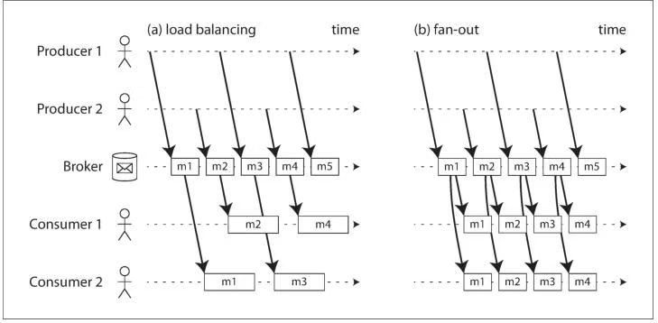
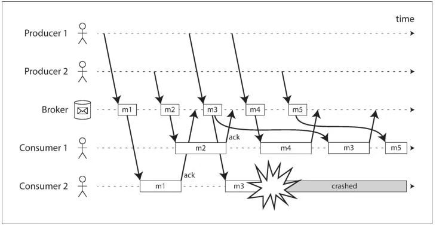
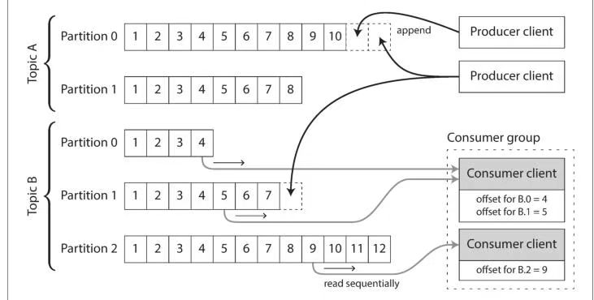

[toc]

## Chapter 11. Stream Processing

 However, one big assumption remained throughout Chapter 10: namely, that theinput is bounded—i.e., of a known and finite size—so the batch process knows whenit has finished reading its input. For example, the sorting operation that is central toMapReduce must read its entire input before it can start producing output: it couldhappen that the very last input record is the one with the lowest key, and thus needsto be the very first output record, so starting the output early is not an option.

然而，第 10 章的内容始终基于一个重要假设：**输入数据是有界的**—— 即数据量已知且有限，因此批处理程序能够明确感知输入数据的读取终点。例如，MapReduce 核心的排序操作，必须读取全部输入数据后才能开始生成输出 —— 因为有可能最后一条输入记录的键值最小，需要作为第一条输出记录，因此提前输出是不可行的。

In reality, a lot of data is **unbounded** because it arrives gradually over time: your usersproduced data yesterday and today, and they will continue to produce more datatomorrow. Unless you go out of business, this process never ends, and so the datasetis never “complete” in any meaningful way [1]. Thus, batch processors must artifi‐cially divide the data into chunks of fixed duration: for example, processing a day’sworth of data at the end of every day, or processing an hour’s worth of data at the endof every hour.

但在实际场景中，大量数据都是**无界的**：数据会随时间推移持续产生 —— 用户在昨天、今天不断生成数据，明天也会继续产生新数据。除非业务终止，否则这个数据生成的过程永不停歇，因此从实际意义来讲，这类数据集永远不会 “完整”[1]。正因如此，批处理程序不得不将数据人为切分为固定时长的块来处理：例如每天结束时处理当日产生的数据，或每小时结束时处理该小时内的数据。

The problem with daily batch processes is that changes in the input are only reflectedin the output a day later, which is too slow for many impatient users. To reduce thedelay, we can run the processing more frequently—say, processing a second’s worthof data at the end of every second—or even **continuously**, abandoning the fixed time slices entirely and simply processing every event as it happens. That is the idea behind **stream processing**.

按日执行批处理的问题在于，输入数据的变化要等到一天后才能体现在输出结果中，这对于许多对延迟敏感的用户来说实在太慢。为了降低延迟，我们可以提高处理的频率 —— 比如每秒结束时处理该秒内的数据；甚至可以完全摒弃固定时间切片的模式，转而**持续处理**，在每个事件产生的瞬间就对其进行处理。这正是**流处理**的设计理念。

 In principle, a file or database is sufficient to connect producers and consumers: aproducer writes every event that it generates to the datastore, and each consumerperiodically polls the datastore to check for events that have appeared since it last ran.This is essentially what a batch process does when it processes a day’s worth of data atthe end of every day.

理论上，仅依靠文件或数据库就足以衔接数据生产者与消费者：生产者将生成的所有事件写入数据存储系统，消费者则定期轮询该系统，以获取自上次轮询以来新增的事件。每日结束时处理当日数据的批处理程序，本质上就是这样工作的。

However, when moving toward continual processing with low delays, pollingbecomes expensive if the datastore is not designed for this kind of usage. The moreoften you poll, the lower the percentage of requests that return new events, and thusthe higher the overheads become. Instead, it is better for consumers to be notifiedwhen new events appear.

但在向低延迟的持续处理模式演进时，如果数据存储系统并非为这类场景设计，轮询的方式会产生极高的开销。轮询频率越高，返回新事件的请求占比就越低，由此引发的性能损耗也就越大。相比之下，**在有新事件产生时主动通知消费者**，才是更优的方案。

Databases have traditionally not supported this kind of notification mechanism verywell: relational databases commonly have triggers, which can react to a change (e.g., arow being inserted into a table), but they are very limited in what they can do andhave been somewhat of an afterthought in database design [4, 5]. Instead, specializedtools have been developed for the purpose of delivering event notifications.

传统数据库对这类通知机制的支持一直不够完善：关系型数据库虽然普遍提供触发器功能，能够对数据变更（例如向表中插入一行数据）做出响应，但触发器的功能十分受限，在数据库的整体设计中也更像是一个 “附加功能”[4,5]。正因如此，业界专门开发了一类工具，用于实现事件通知的功能。

### Transmitting Event Streams

**事件流的传输**

#### Messaging Systems

**消息系统**

Within this publish/subscribe model, different systems take a wide range ofapproaches, and there is no one right answer for all purposes. To differentiate thesystems, it is particularly helpful to ask the following two questions:

1. **What happens if the producers send messages faster than the consumers can process them?** Broadly speaking, there are three options: the system can **drop messages**, **buffer messages in a queue**, or **apply backpressure**(also known as flow control; i.e., blocking the producer from sending more messages). For example,Unix pipes and TCP use backpressure: they have a small fixed-size buffer, and if it fills up, the sender is blocked until the recipient takes data out of the buffer (see“Network congestion and queueing” on page 282).

   If messages are buffered in a queue, it is important to understand what happensas that queue grows. Does the system crash if the queue no longer fits in mem‐ory, or does it write messages to disk? If so, how does the disk access affect theperformance of the messaging system [6]?

2. **What happens if nodes crash or temporarily go offline—are any messages lost?** As with databases, durability may require some combination of writing to disk and/or replication (see the sidebar “Replication and Durability” on page 227),which has a cost. If you can afford to sometimes lose messages, you can probably get higher throughput and lower latency on the same hardware.

在发布 / 订阅模型的范畴内，不同系统采用的实现方案差异很大，不存在一种能适配所有场景的 “最优解”。想要区分各类系统的特性，提出以下两个问题会非常有帮助：

1. **若生产者发送消息的速度超过消费者的处理能力，系统会如何处理？** 总体而言，有三种应对方案：系统可以直接**丢弃消息**、将消息**缓冲在队列中**，或是启用**背压机制**（也称为流量控制，即阻塞生产者，使其无法继续发送更多消息）。例如，Unix 管道与 TCP 协议均采用了背压机制：它们会设置一个容量固定的小型缓冲区，一旦缓冲区被填满，发送方会被阻塞，直到接收方从缓冲区中取出数据（详见本书第 282 页的 “网络拥塞与排队” 一节）。

   若消息被缓冲在队列中，就必须明确队列持续增长时的系统行为：若队列无法再容纳于内存，系统是否会崩溃？还是会将消息写入磁盘？如果是后者，磁盘读写会对消息系统的性能造成何种影响 [6]？

2. **若节点崩溃或临时下线，是否会有消息丢失？**与数据库的设计逻辑类似，消息的持久性通常需要结合**写入磁盘**和 / 或**副本复制**两种手段来实现（详见本书第 227 页的 “副本复制与持久性” 侧边栏），而这两种手段都会产生一定的性能开销。如果业务场景可以容忍偶尔的消息丢失，那么在相同硬件条件下，系统往往能实现更高的吞吐量和更低的延迟。

Whether message loss is acceptable depends very much on the application. For exam‐ple, with sensor readings and metrics that are transmitted periodically, an occasionalmissing data point is perhaps not important, since an updated value will be sent ashort time later anyway. However, beware that if a large number of messages aredropped, it may not be immediately apparent that the metrics are incorrect [7]. If youare counting events, it is more important that they are delivered reliably, since everylost message means incorrect counters.

消息丢失是否可以接受，很大程度上取决于具体的业务场景。例如，对于周期性传输的传感器读数和监控指标而言，偶尔丢失一个数据点或许无关紧要 —— 因为不久之后就会有更新的值发送过来。但需要注意的是，若大量消息丢失，监控指标出现异常这一问题可能无法被立即察觉 [7]。而如果是在统计事件的场景下，消息的可靠投递就尤为重要了，因为每丢失一条消息，都会导致最终的统计结果出现偏差。

**Message brokers**

**消息代理**

A widely used alternative is to send messages via a **message broker** (also known as a **message queue**), which is essentially a kind of database that is optimized for handlingmessage streams [13]. It runs as a server, with producers and consumers connectingto it as clients. Producers write messages to the broker, and consumers receive themby reading them from the broker.

一种被广泛采用的替代方案是通过**消息代理**（也称为**消息队列**）来发送消息。消息代理本质上是一种专为处理消息流而优化的数据库 [13]。它以服务端模式运行，生产者与消费者则作为客户端与其建立连接：生产者向代理写入消息，消费者则从代理读取消息以获取数据。

By centralizing the data in the broker, these systems can more easily tolerate clientsthat come and go (connect, disconnect, and crash), and the question of durability ismoved to the broker instead. Some message brokers only keep messages in memory,while others (depending on configuration) write them to disk so that they are not lostin case of a broker crash. Faced with slow consumers, they generally allow **unbounded queueing** (as opposed to dropping messages or backpressure), although thischoice may also depend on the configuration.

通过将数据集中存储在代理端，这类系统能够更轻松地应对客户端的频繁上下线（连接、断开、崩溃）情况，同时消息持久性的保障责任也随之转移到了代理端。部分消息代理仅将消息存储在内存中；而另一些代理（根据配置不同）会将消息写入磁盘，从而避免在代理崩溃时丢失消息。面对消费速度较慢的消费者，消息代理通常允许**无限制排队**（而非丢弃消息或启用背压机制），不过这一策略也可能取决于具体的配置。

A consequence of queueing is also that consumers are generally **asynchronous**: when a producer sends a message, it normally only waits for the broker to confirm that ithas buffered the message and does not wait for the message to be processed by con‐sumers. The delivery to consumers will happen at some undetermined future point intime—often within a fraction of a second, but sometimes significantly later if there isa queue backlog.

消息排队机制带来的一个结果是，消费者通常为**异步工作模式**：当生产者发送一条消息时，它一般只需等待代理确认消息已存入缓冲区即可，无需等待消费者完成对消息的处理。消息的投递会在未来某个不确定的时间点完成 —— 通常在几分之一秒内，但如果出现队列积压，投递延迟有时会显著增加。

**Message brokers compared to databases**

**消息代理与数据库的对比**

Some message brokers can even participate in two-phase commit protocols using **XA** or **JTA** (see “Distributed Transactions in Practice” on page 360). This feature makesthem quite similar in nature to databases, although there are still important practicaldifferences between message brokers and databases:

- Databases usually keep data until it is explicitly deleted, where as most message brokers automatically delete a message when it has been successfully delivered to its consumers. Such message brokers are not suitable for long-term data storage.
- Since they quickly delete messages, most message brokers assume that their working set is fairly small—i.e., the queues are short. If the broker needs to buffer a lot of messages because the consumers are slow (perhaps spilling messages to disk if they no longer fit in memory), each individual message takes longer to process, and the overall throughput may degrade [6].
- Databases often support secondary indexes and various ways of searching for data, while message brokers often support some way of subscribing to a subset of topics matching some pattern. The mechanisms are different, but both are essen‐ tially ways for a client to select the portion of the data that it wants to know about.
- When querying a database, the result is typically based on a point-in-time snap‐ shot of the data; if another client subsequently writes something to the database that changes the query result, the first client does not find out that its prior result is now outdated (unless it repeats the query, or polls for changes). By contrast,message brokers do not support arbitrary queries, but they do notify clients when data changes (i.e., when new messages become available).

部分消息代理甚至可以通过**XA**或**JTA**协议参与两阶段提交（详见本书第 360 页的《分布式事务实战》一节）。这一特性使得消息代理在本质上与数据库颇为相似，但二者在实际应用中仍存在显著差异：

1. 数据库通常会留存数据，直至数据被显式删除；而大多数消息代理会在消息成功投递至消费者后，自动将其删除。因此，这类消息代理并不适用于长期数据存储。
2. 由于消息会被快速删除，大多数消息代理默认其工作集规模较小 —— 也就是说，消息队列的长度通常很短。如果因消费者处理速度过慢，导致代理需要缓冲大量消息（消息无法存入内存时，可能会写入磁盘），那么单条消息的处理耗时会相应增加，系统整体吞吐量也可能随之下降 [6]。
3. 数据库通常支持二级索引和多种数据查询方式；而消息代理则一般支持按特定模式订阅主题子集。二者的实现机制虽不相同，但本质上都是为了让客户端能够筛选出自己需要关注的数据。
4. 查询数据库时，返回的结果通常基于数据的某一时间点快照。如果后续有其他客户端写入数据，导致该查询结果失效，最初发起查询的客户端并不会收到通知（除非重新执行查询或轮询数据变更）。相比之下，消息代理不支持任意查询，但它会在数据发生变化时（即有新消息可用时）主动通知客户端。

This is the traditional view of message brokers, which is encapsulated in standardslike JMS [14] and AMQP [15] and implemented in software like RabbitMQ,ActiveMQ, HornetQ, Qpid, TIBCO Enterprise Message Service, IBM MQ, Azure Ser‐vice Bus, and Google Cloud Pub/Sub [16].

以上是对消息代理的传统定位，这一定位被纳入了 JMS [14]、AMQP [15] 等标准中，并在 RabbitMQ、ActiveMQ、HornetQ、Qpid、TIBCO 企业消息服务、IBM MQ、Azure 服务总线以及 Google Cloud Pub/Sub [16] 等软件中得以实现。

**Multiple consumers**

**多消费者模式**

When multiple consumers read messages in the same topic, two main patterns ofmessaging are used, as illustrated in Figure 11-1:

当多个消费者读取同一主题下的消息时，主要采用两种消息传递模式（如图 11-1 所示）：

**Load balancing** Each message is delivered to one of the consumers, so the consumers can share the work of processing the messages in the topic. The broker may assign messages to consumers arbitrarily. This pattern is useful when the messages are expensive to process, and so you want to be able to add consumers to parallelize the processing. (In AMQP, you can implement load balancing by having multi‐ ple clients consuming from the same queue, and in JMS it is called a shared subscription.)

**负载均衡模式** 每条消息只会投递至其中一个消费者，因此消费者可共同分担该主题下消息的处理工作。消息代理可将消息随机分配给任意消费者。当消息处理成本较高时，这种模式尤为适用 —— 你可以通过增加消费者数量来实现处理流程的并行化。（在 AMQP 中，可通过让多个客户端从同一个队列消费消息来实现负载均衡；在 JMS 中，该模式被称为 “共享订阅”。）

Fan-out Each message is delivered to all of the consumers. Fan-out allows several inde‐ pendent consumers to each “tune in” to the same broadcast of messages, without affecting each other—the streaming equivalent of having several different batch jobs that read the same input file. (This feature is provided by topic subscriptions in JMS, and exchange bindings in AMQP.)

**扇出模式** 每条消息会投递至所有消费者。扇出模式允许多个独立的消费者各自 “订阅” 同一消息广播流，且彼此互不影响 —— 这相当于流处理场景中，多个不同的批处理任务读取同一个输入文件的实现方式。（JMS 中通过主题订阅实现该功能，而 AMQP 中则通过交换器绑定来实现。）

> Figure 11-1. (a) Load balancing: sharing the work of consuming a topic amoing consumers; (b) fan-out: delivering each message to multiple consumers.

The two patterns can be combined: for example, two separate groups of consumers may each subscribe to a topic, such that each group collectively receives all messages,but within each group only one of the nodes receives each message.

这两种模式可以结合使用：例如，两个独立的消费者组可以分别订阅同一个主题，这样每个消费者组**整体**都会接收到该主题的所有消息，而在每个组内部，每条消息只会被其中一个节点接收。

**Acknowledgments and redelivery**

**消息确认与重投递**

Consumers may crash at any time, so it could happen that a broker delivers a message to a consumer but the consumer never processes it, or only partially processes it before crashing. In order to ensure that the message is not lost, message brokers use acknowledgments: a client must explicitly tell the broker when it has finished process‐ing a message so that the broker can remove it from the queue.

消费者随时可能发生崩溃，因此可能出现这样的情况：消息代理已将消息投递至某消费者，但该消费者**完全未处理消息**，或在处理过程中发生崩溃，仅完成了部分处理工作。 为避免消息丢失，消息代理会采用**确认机制**：客户端在完成消息处理后，必须向代理发送显式确认，代理收到确认后，才会将该消息从队列中移除。

If the connection to a client is closed or times out without the broker receiving anacknowledgment, it assumes that the message was not processed, and therefore itdelivers the message again to another consumer. (Note that it could happen that themessage actually was fully processed, but the acknowledgment was lost in the net‐work. Handling this case requires an atomic commit protocol, as discussed in “Dis‐tributed Transactions in Practice” on page 360.)

如果客户端的连接断开或超时，且代理始终未收到确认信息，就会判定这条消息未被成功处理，进而将其重新投递至其他消费者。（需注意的是，实际场景中可能存在消息已被完整处理，但确认信息在网络传输中丢失的情况。要处理这类场景，需要借助原子提交协议，详见本书第 360 页的《分布式事务实战》一节。）

When combined with load balancing, this redelivery behavior has an interestingeffect on the ordering of messages. In Figure 11-2, the consumers generally processmessages in the order they were sent by producers. However, consumer 2 crasheswhile processing message m3, at the same time as consumer 1 is processing messagem4. The unacknowledged message m3 is subsequently redelivered to consumer 1,with the result that consumer 1 processes messages in the order m4, m3, m5. Thus,m3and m4 are not delivered in the same order as they were sent by producer 1.

当确认重投机制与负载均衡模式结合使用时，会对消息的投递顺序产生一个值得关注的影响。如图 11-2 所示，正常情况下，消费者会按照生产者发送消息的顺序来处理消息。但如果消费者 2 在处理消息 m3 时发生崩溃，而同一时间消费者 1 正在处理消息 m4，那么未被确认的消息 m3 会被重新投递至消费者 1。最终消费者 1 处理消息的顺序就会变成 m4、m3、m5，导致 m3 和 m4 的投递顺序与生产者 1 的发送顺序不一致。

> Figure 11-2. Consumer 2 crashes while processing m3, so it is redelivered to consumer 1 at a later time.

Even if the message broker otherwise tries to preserve the order of messages (asrequired by both the JMS and AMQP standards), the combination of load balancingwith redelivery inevitably leads to messages being reordered. To avoid this issue, youcan use a separate queue per consumer (i.e., not use the load balancing feature). Mes‐sage reordering is not a problem if messages are completely independent of eachother, but it can be important if there are causal dependencies between messages, aswe shall see later in the chapter.

即便消息代理会尽可能保证消息顺序（这也是 JMS 和 AMQP 两项标准的要求），**负载均衡与重投递机制的组合，仍必然会导致消息乱序**。若要避免这一问题，可以为每个消费者分配独立的队列（即不启用负载均衡功能）。如果消息之间彼此完全独立，乱序问题通常不会造成影响；但正如本章后续内容所述，若消息之间存在因果依赖关系，那么顺序错乱就可能引发严重问题。

#### Partitioned Logs

**分区日志**

Why can we not have a hybrid, combining the durable storage approach of databaseswith the low-latency notification facilities of messaging? This is the idea behind **log-based message brokers**.

我们为何不能设计一种混合方案，将数据库的持久化存储特性与消息系统的低延迟通知能力相结合？这正是**基于日志的消息代理**的设计理念。

**Using logs for message storage**

**利用日志存储消息**

A log is simply an **append-only sequence of records** on disk. We previously discussedlogs in the context of log-structured storage engines and write-ahead logs in Chap‐ter 3, and in the context of replication in Chapter 5.

日志本质上是磁盘上的**仅追加记录序列**。本书第 3 章在介绍日志结构存储引擎与预写式日志时，以及第 5 章在讨论副本复制机制时，都曾提及日志这一概念。

The same structure can be used to implement a message broker: a producer sends a message by **appending it to the end of the log**, and a consumer receives messages by **reading the log sequentially**. If a consumer reaches the end of the log, it waits for anotification that a new message has been appended. The Unix tool tail -f, whichwatches a file for data being appended, essentially works like this.

这种数据结构同样可用于实现消息代理：生产者通过**将消息追加到日志末尾**的方式发送消息，消费者则通过**顺序读取日志**的方式接收消息。如果消费者读取到了日志末尾，就会等待新消息追加的通知。Unix 工具 `tail -f` 就是基于此原理工作的 —— 它会持续监控文件，等待新数据被追加写入。

In order to scale to higher throughput than a single disk can offer, the log can be **partitioned**(in the sense of Chapter 6). Different partitions can then be hosted on dif‐ferent machines, making each partition a separate log that can be read and writtenindependently from other partitions. A **topic** can then be defined as a group of parti‐tions that all carry messages of the same type. This approach is illustrated inFigure 11-3.

为了突破单块磁盘的吞吐量限制，日志可以进行**分区处理**（此处的分区与第 6 章讨论的概念一致）。不同的分区可部署在不同的机器上，每个分区都是一个独立的日志，能够与其他分区并行读写。在此基础上，**主题**可被定义为一组存储同类消息的分区集合。图 11-3 展示了这种架构的工作原理。

Within each partition, the broker assigns a **monotonically increasing sequence number**, or **offset**, to every message (in Figure 11-3, the numbers in boxes are message off‐sets). Such a sequence number makes sense because a partition is append-only, so themessages within a partition are totally ordered. There is no ordering guarantee acrossdifferent partitions.

在每个分区内部，消息代理会为每条消息分配一个**单调递增的序列号**（或称**偏移量**）。图 11-3 中，方框内的数字即为消息偏移量。由于分区是仅追加写入的，分区内的消息具备完全有序性，因此这种序列号的设计是合理的。不过，不同分区之间的消息不提供任何顺序保证。

> Figure 11-3. Producers send messages by appending them to a topic-partition file, andconsumers read these files sequentially.

Apache Kafka [17, 18], Amazon Kinesis Streams [19], and Twitter’s DistributedLog[20, 21] are log-based message brokers that work like this. Google Cloud Pub/Sub isarchitecturally similar but exposes a JMS-style API rather than a log abstraction [16].Even though these message brokers write all messages to disk, they are able to achievethroughput of millions of messages per second by partitioning across multiplemachines, and fault tolerance by replicating messages [22, 23].

Apache Kafka [17,18]、Amazon Kinesis Streams [19] 以及 Twitter 的 DistributedLog [20,21]，均是采用这种架构的基于日志的消息代理。Google Cloud Pub/Sub 的架构与之类似，但对外提供的是 JMS 风格的 API，而非日志抽象接口 [16]。尽管这类消息代理会将所有消息写入磁盘，但通过多机分区部署，它们能够实现每秒数百万条消息的吞吐量；同时借助消息副本复制机制，可保障系统的容错性 [22,23]。

**Consumer offsets**

**消费者偏移量**

Consuming a partition sequentially makes it easy to tell which messages have beenprocessed: all messages with an offset less than a consumer’s current offset havealready been processed, and all messages with a greater offset have not yet been seen.Thus, the broker does not need to track acknowledgments for every single message—it only needs to periodically record the consumer offsets. The reduced bookkeeping overhead and the opportunities for batching and pipelining in this approach helpincrease the throughput of log-based systems.

按顺序消费分区的设计，能够很方便地判断哪些消息已被处理：所有偏移量**小于**消费者当前偏移量的消息均已处理完毕，所有偏移量**大于**当前偏移量的消息则尚未被读取。因此，消息代理无需追踪每条消息的确认状态 —— 只需定期记录消费者的偏移量即可。这种设计减少了簿记开销，同时为批处理与流水线处理创造了条件，有助于提升基于日志的消息系统的吞吐量。

This offset is in fact very similar to the **log sequence number** that is commonly foundin single-leader database replication, and which we discussed in “Setting Up NewFollowers” on page 155. In database replication, the log sequence number allows afollower to reconnect to a leader after it has become disconnected, and resume repli‐cation without skipping any writes. Exactly the same principle is used here: the mes‐sage broker behaves like a leader database, and the consumer like a follower.

实际上，这种偏移量与单主库数据库复制中常见的**日志序列号**非常相似，本书第 155 页的《新从库的搭建》一节曾对此展开讨论。在数据库复制流程中，日志序列号支持从库在断开连接后重新连接主库，并在不遗漏任何写入操作的前提下恢复复制。这里采用的是完全相同的原理：消息代理扮演主库的角色，而消费者则相当于从库。

If a consumer node fails, another node in the consumer group is assigned the failedconsumer’s partitions, and it starts consuming messages at the last recorded offset. Ifthe consumer had processed subsequent messages but not yet recorded their offset,those messages will be processed a second time upon restart. We will discuss ways ofdealing with this issue later in the chapter.

如果某个消费者节点发生故障，消费者组中的其他节点会接管故障节点负责的分区，并从**最近一次记录的偏移量**开始继续消费消息。若该消费者在处理后续消息后，尚未及时记录新的偏移量，那么这些已处理的消息会在节点重启后被**重复处理**。本章后续内容将探讨应对这一问题的解决方案。

**Disk space usage**

**磁盘空间占用**

If you only ever append to the log, you will eventually run out of disk space. Toreclaim disk space, the log is actually divided into **segments**, and from time to timeold segments are deleted or moved to archive storage. (We’ll discuss a more sophisti‐cated way of freeing disk space later.) This means that if a slow consumer cannot keep up with the rate of messages, and itfalls so far behind that its consumer offset points to a deleted segment, it will misssome of the messages. Effectively, the log implements a **bounded-size buffer** that discards old messages when it gets full, also known as a **circular buffer** or **ring buffer**.However, since that buffer is on disk, it can be quite large.

如果日志始终只执行追加操作，磁盘空间终将耗尽。为回收磁盘空间，日志实际上会被划分成多个**段**，系统会定期删除旧日志段或将其转移至归档存储中。（后文会介绍一种更精细的磁盘空间释放方案。）这就意味着，若某个消费者消费速度过慢，无法跟上消息的产生速率，导致其消费偏移量指向了已被删除的日志段，那么该消费者就会丢失部分消息。从效果上看，这种日志结构相当于一个**有界缓冲区**—— 缓冲区存满时会丢弃旧消息，它也被称为**循环缓冲区**或**环形缓冲区**。不过，由于该缓冲区基于磁盘存储，其容量可以配置得相当大。

### Databass and Streams

**数据库与流数据**

#### Change Data Capture

**变更数据捕获**

**Log compaction**

**日志压缩**

If you can only keep a limited amount of log history, you need to go through thesnapshot process every time you want to add a new derived data system. However,**log compaction** provides a good alternative.

如果仅能保留有限的日志历史，那么每次新增衍生数据系统时，都需要执行一次快照流程。不过，**日志压缩**提供了一种更优的替代方案。

We discussed log compaction previously in “Hash Indexes” on page 72, in the con‐text of log-structured storage engines (see Figure 3-2 for an example). The principleis simple: the storage engine periodically looks for log records with the same key,throws away any duplicates, and **keeps only the most recent update** for each key. This compaction and merging process runs in the background.

本书第 72 页的《哈希索引》一节中，在介绍日志结构存储引擎时曾提及日志压缩机制（示例见图 3-2）。其原理十分简单：存储引擎会定期扫描具有相同键的日志记录，剔除重复记录，只为每个键保留**最新的更新记录**。这套压缩合并过程在后台自动运行。

In a log-structured storage engine, an update with a special null value (a tombstone)indicates that a key was deleted, and causes it to be removed during log compaction.But as long as a key is not overwritten or deleted, it stays in the log forever. The diskspace required for such a compacted log depends only on the current contents of thedatabase, not the number of writes that have ever occurred in the database. If thesame key is frequently overwritten, previous values will eventually be garbage-collected, and only the latest value will be retained.

在日志结构存储引擎中，一条带有特殊空值（即**墓碑标记**）的更新记录，表示某个键已被删除，该键会在日志压缩过程中被清除。但只要某个键未被覆盖或删除，就会永久保留在日志中。压缩日志所需的磁盘空间，仅取决于数据库的当前数据内容，与数据库历史上的写入操作总量无关。如果同一键被频繁覆盖，其历史值最终会被垃圾回收，日志中只会留存最新值。

The same idea works in the context of log-based message brokers and change data capture. If the CDC system is set up such that every change has a primary key, andevery update for a key replaces the previous value for that key, then it’s sufficient tokeep just the most recent write for a particular key.

这一理念同样适用于**基于日志的消息代理**与 ** 变更数据捕获（CDC）** 场景。若 CDC 系统被配置为每条变更记录都带有主键，且对同一键的每次更新都会覆盖该键之前的值，此时只需保留每个特定键的最新写入记录即可。

Now, whenever you want to rebuild a derived data system such as a search index, youcan start a new consumer from offset 0 of the log-compacted topic, and sequentiallyscan over all messages in the log. The log is guaranteed to contain the most recentvalue for every key in the database (and maybe some older values)—in other words,you can use it to obtain a full copy of the database contents without having to takeanother snapshot of the CDC source database.

如此一来，当你需要重建搜索索引这类衍生数据系统时，就可以从**日志压缩主题**的偏移量 0 处启动一个新的消费者，顺序扫描日志中的所有消息。该日志确保包含数据库中每个键的最新值（可能还会包含部分旧值）—— 也就是说，你无需再对 CDC 的源数据库创建新的快照，就能通过这份日志获取数据库的完整数据副本。

This log compaction feature is supported by Apache Kafka. As we shall see later inthis chapter, it allows the message broker to be used for durable storage, not just for transient messaging.

Apache Kafka 支持这一日志压缩功能。正如本章后续内容将介绍的，这一功能使得消息代理不仅可用于临时消息传递，还能作为**持久化存储**来使用。

#### Event Sourcing

**事件溯源**

There are some parallels between the ideas we’ve discussed here and **event sourcing**, a technique that was developed in the domain-driven design (DDD) community [42,43, 44]. We will discuss event sourcing briefly, because it incorporates some usefuland relevant ideas for streaming systems.

我们前文探讨的理念，与领域驱动设计（DDD）社区提出的一种名为**事件溯源**的技术存在诸多相通之处 [42,43,44]。在此我们对事件溯源做简要介绍，因为它包含了一些适用于流处理系统的实用理念。

Similarly to change data capture, event sourcing involves storing all changes to theapplication state as a log of change events. The biggest difference is that event sourcing applies the idea at a different level of abstraction:

-  In change data capture, the application uses the database in a mutable way,updating and deleting records at will. The log of changes is extracted from the database at a low level (e.g., by parsing the replication log), which ensures that the order of writes extracted from the database matches the order in which they were actually written, avoiding the race condition in Figure 11-4. The application writing to the database does not need to be aware that CDC is occurring.
- In event sourcing, the application logic is explicitly built on the basis of immuta‐ ble events that are written to an event log. In this case, the event store is append- only, and updates or deletes are discouraged or prohibited. Events are designed to reflect things that happened at the application level, rather than low-level state changes.

和变更数据捕获类似，事件溯源也会将应用状态的所有变更，以变更事件日志的形式进行存储。二者的核心区别在于，事件溯源是在**不同的抽象层次**上应用这一理念：

- 在变更数据捕获（CDC）中，应用会以可变的方式使用数据库，可随意执行记录的更新与删除操作。变更日志是从数据库底层提取的（例如，通过解析复制日志），这种方式能确保从数据库中提取的写入操作顺序，与实际写入顺序完全一致，从而避免图 11-4 中所示的竞态条件。向数据库写入数据的应用，无需感知变更数据捕获的存在。
- 在事件溯源中，应用逻辑明确地基于写入事件日志的**不可变事件**来构建。在这种模式下，事件存储是仅追加的，更新或删除操作会被限制甚至禁止。事件的设计目标是反映应用层面发生的行为，而非底层的数据状态变更。

Event sourcing is a powerful technique for data modeling: from an application pointof view it is more meaningful to record the user’s actions as immutable events, ratherthan recording the effect of those actions on a mutable database. Event sourcingmakes it easier to evolve applications over time, helps with debugging by making iteasier to understand after the fact why something happened, and guards againstapplication bugs (see “Advantages of immutable events” on page 460).

事件溯源是一种强大的数据建模技术：从应用的视角来看，将用户的操作记录为不可变事件，远比记录这些操作对可变数据库的影响更具业务意义。事件溯源不仅便于应用的长期演进，还能通过事后追溯，帮助开发者更轻松地定位问题原因，同时也能有效防范应用程序缺陷（详见本书第 460 页的《不可变事件的优势》一节）。

**Deriving current state from the event log**

**从事件日志推导当前状态**

An event log by itself is not very useful, because users generally expect to see the current state of a system, not the history of modifications. For example, on a shoppingwebsite, users expect to be able to see the current contents of their cart, not anappend-only list of all the changes they have ever made to their cart.

事件日志本身的用途十分有限，因为用户通常期望查看系统的**当前状态**，而非状态的修改历史。例如，在购物网站上，用户希望能看到购物车的当前商品内容，而非一份记录了所有购物车操作的仅追加列表。

Thus, applications that use event sourcing need to take the log of events (representingthe data written to the system) and transform it into application state that is suitablefor showing to a user (the way in which data is read from the system [47]). Thistransformation can use arbitrary logic, but it should be deterministic so that you canrun it again and derive the same application state from the event log.

因此，采用事件溯源的应用需要将事件日志（代表写入系统的数据），转换为适合展示给用户的应用状态（也就是从系统中读取数据的形式 [47]）。这种转换可以采用任意逻辑，但必须具备**确定性**—— 这样才能保证重放事件日志时，总能推导出完全一致的应用状态。

Like with change data capture, replaying the event log allows you to reconstruct thecurrent state of the system. However, log compaction needs to be handled differently:

- A CDC event for the update of a record typically contains the **entire new version** of the record, so the current value for a primary key is entirely determined by the most recent event for that primary key, and log compaction can discard previous events for the same key.
- On the other hand, with event sourcing, events are modeled at a higher level: an event typically expresses the intent of a user action, not the mechanics of the state update that occurred as a result of the action. In this case, later events typically do not override prior events, and so you need the full history of events to recon‐ struct the final state. Log compaction is not possible in the same way.

与变更数据捕获（CDC）类似，通过重放事件日志，就能够重建系统的当前状态。不过，两者在日志压缩的处理方式上存在差异：

1. 针对记录更新的 CDC 事件，通常会包含该记录的**完整新版本**。因此，某个主键对应的当前值，完全由该主键的最新事件决定，日志压缩时可以直接丢弃同一主键的历史事件。
2. 反观事件溯源，事件是在更高抽象层次上建模的：一条事件通常用于表达**用户操作的意图**，而非该操作引发的状态更新具体机制。在这种情况下，后续事件一般不会覆盖之前的事件，因此需要完整的事件历史才能重建最终状态，无法沿用 CDC 那样的日志压缩方式。

Applications that use event sourcing typically have some mechanism for storingsnapshots of the current state that is derived from the log of events, so they don’tneed to repeatedly reprocess the full log. However, this is only a performance optimi‐zation to speed up reads and recovery from crashes; the intention is that the system isable to store all raw events forever and reprocess the full event log whenever required.We discuss this assumption in “Limitations of immutability” on page 463.

采用事件溯源的应用，通常会通过某种机制存储从事件日志推导而来的当前状态快照，从而避免反复处理全量日志。但这仅仅是一种**性能优化手段**，目的是提升读取速度和崩溃后的恢复效率；其核心设计目标是，系统能够永久存储所有原始事件，并在需要时重放全量事件日志。关于这一设计假设的局限性，我们将在本书第 463 页的《不可变性的局限性》一节中展开讨论。

#### State, Streams and Immutability

**状态、流与不可变性**

Having an explicit translation step from an event log to a database makes it easier toevolve your application over time: if you want to introduce a new feature thatpresents your existing data in some new way, you can use the event log to build a separate **read-optimized view** for the new feature, and run it alongside the existingsystems without having to modify them. Running old and new systems side by side isoften easier than performing a complicated schema migration in an existing system.Once the old system is no longer needed, you can simply shut it down and reclaim itsresources [47, 57].

在事件日志与数据库之间设置显式的转换环节，能够让应用的长期演进变得更加轻松：若你希望新增一项功能，以全新方式呈现现有数据，只需基于事件日志为该功能构建一个独立的**读优化视图**，让它与现有系统并行运行，而无需对原有系统做任何修改。相比在已有系统中执行复杂的模式迁移，让新旧系统并行运转往往更加简便。当旧系统不再被需要时，你可以直接将其下线并回收其资源 [47,57]。

Storing data is normally quite straightforward if you don’t have to worry about how itis going to be queried and accessed; many of the complexities of schema design,indexing, and storage engines are the result of wanting to support certain query andaccess patterns (see Chapter 3). For this reason, you gain a lot of flexibility by **separating the form in which data is written from the form it is read**, and by allowing sev‐eral different read views. This idea is sometimes known as **command query responsibility segregation (CQRS)** [42, 58, 59].

如果无需考虑数据的查询与访问方式，那么数据存储通常会变得十分简单；模式设计、索引构建与存储引擎选择的诸多复杂性，归根结底都是为了支持特定的查询与访问模式（详见第 3 章）。正因如此，**将数据的写入格式与读取格式解耦**，并支持构建多种不同的读取视图，能够为你带来极大的灵活性。这种理念有时被称为**命令查询职责分离（CQRS）**[42,58,59]。

The traditional approach to database and schema design is based on the fallacy thatdata must be written in the same form as it will be queried. Debates about normaliza‐tion and denormalization (see “Many-to-One and Many-to-Many Relationships” onpage 33) become largely irrelevant if you can translate data from a write-optimizedevent log to read-optimized application state: it is entirely reasonable to denormalizedata in the read-optimized views, as the translation process gives you a mechanismfor keeping it consistent with the event log.

传统的数据库与模式设计思路，存在一个认知误区：认为数据的写入格式必须与其查询格式保持一致。而当你能够将数据从写优化的事件日志，转换为读优化的应用状态时，关于数据规范化与反规范化的争论（详见本书第 33 页的《一对多与多对多关系》一节）就基本失去了意义 —— 在**读优化视图中采用反规范化设计是完全合理的**，因为转换流程本身就提供了一种机制，确保读优化视图与事件日志的数据一致性。

**Concurrency control**

**并发控制**

The biggest downside of event sourcing and change data capture is that the consum‐ers of the event log are usually asynchronous, so there is a possibility that a user maymake a write to the log, then read from a log-derived view and find that their writehas not yet been reflected in the read view. We discussed this problem and potentialsolutions previously in “Reading Your Own Writes” on page 162.

事件溯源与变更数据捕获的最大缺点在于，事件日志的消费者通常是异步工作的。这就可能出现一种情况：用户向日志中写入数据后，立即从基于日志构建的视图中读取数据，却发现自己的写入操作尚未体现在该读视图中。关于这一问题及可能的解决方案，我们已在本书第 162 页的《读取自己的写入》一节中进行过探讨。

One solution would be to perform the updates of the read view synchronously withappending the event to the log. This requires a transaction to combine the writes intoan atomic unit, so either you need to keep the event log and the read view in the samestorage system, or you need a distributed transaction across the different systems.Alternatively, you could use the approach discussed in “Implementing linearizablestorage using total order broadcast” on page 350.

一种解决方案是，将**读视图的更新操作**与**事件追加到日志的操作**同步执行。这需要借助事务将这两项写入操作合并为一个原子单元，因此你要么需要将事件日志与读视图存储在同一个存储系统中，要么需要在多个系统之间执行分布式事务。此外，你也可以采用本书第 350 页《基于全序广播实现线性化存储》一节中讨论的方案。

On the other hand, deriving the current state from an event log also simplifies someaspects of concurrency control. Much of the need for multi-object transactions (see“Single-Object and Multi-Object Operations” on page 228) stems from a single useraction requiring data to be changed in several different places. With event sourcing,you can design an event such that it is a self-contained description of a user action.The user action then requires only a single write in one place—namely appending theevents to the log—which is easy to make atomic.

另一方面，基于事件日志推导当前状态，也会在某些方面简化并发控制的实现。多对象事务（详见本书第 228 页的《单对象与多对象操作》一节）的需求，很大程度上源于单个用户操作需要修改多个不同位置的数据。而在事件溯源模式下，你可以将事件设计为对用户操作的**自包含描述**。这样一来，用户操作仅需在一个位置执行一次写入 —— 也就是将事件追加到日志中，这种操作很容易实现原子性。

If the event log and the application state are partitioned in the same way (for exam‐ple, processing an event for a customer in partition 3 only requires updating partition3 of the application state), then a straightforward single-threaded log consumer needsno concurrency control for writes—by construction, it only processes a single eventat a time (see also “Actual Serial Execution” on page 252). The log removes the non‐determinism of concurrency by defining a serial order of events in a partition [24]. Ifan event touches multiple state partitions, a bit more work is required, which we willdiscuss in Chapter 12.

如果事件日志与应用状态采用相同的分区策略（例如，处理 3 号分区中某个客户的事件时，仅需更新应用状态的 3 号分区），那么一个简单的单线程日志消费者就无需为写入操作做并发控制 —— 从设计上看，它同一时间只会处理一条事件（另见本书第 252 页的《真正的串行执行》一节）。日志通过在分区内定义事件的**串行顺序**，消除了并发操作的不确定性 [24]。若某条事件涉及多个状态分区，则需要额外的处理手段，相关内容将在本书第 12 章中讨论。

### Processing Streams

#### Uses of Stream Processing

**流处理的应用场景**

**Complex event processing**

**复杂事件处理**

**Complex event processing (CEP)** is an approach developed in the 1990s for analyzingevent streams, especially geared toward the kind of application that requires search‐ing for certain event patterns [65, 66]. Similarly to the way that a regular expressionallows you to search for certain patterns of characters in a string, CEP allows you tospecify rules to search for certain patterns of events in a stream.

**复杂事件处理（CEP）** 是一项诞生于 20 世纪 90 年代的事件流分析技术，尤其适用于需要检测特定事件模式的应用场景 [65,66]。正如正则表达式可用于在字符串中匹配特定字符模式，复杂事件处理允许用户定义规则，以在事件流中检索符合条件的事件模式。

CEP systems often use a high-level declarative query language like SQL, or a graphi‐cal user interface, to describe the patterns of events that should be detected. Thesequeries are submitted to a processing engine that consumes the input streams andinternally maintains a state machine that performs the required matching. When amatch is found, the engine emits a **complex event** (hence the name) with the details ofthe event pattern that was detected [67].

复杂事件处理系统通常会提供 SQL 这类高级**声明式查询语言**，或图形化用户界面，来描述需要检测的事件模式。用户可将这类查询提交至处理引擎，引擎在消费输入事件流的同时，会在内部维护一个状态机，专门执行模式匹配操作。当检测到匹配的事件模式时，引擎会输出一条**复杂事件**，其中包含该事件模式的详细信息 [67]。

In these systems, the relationship between queries and data is reversed compared tonormal databases. Usually, a database stores data persistently and treats queries astransient: when a query comes in, the database searches for data matching the query,and then forgets about the query when it has finished. CEP engines reverse theseroles: queries are stored long-term, and events from the input streams continuouslyflow past them in search of a query that matches an event pattern [68].

这类系统中，查询与数据的关系与常规数据库恰好相反。在常规数据库中，数据是持久化存储的，而查询则是临时性的：当查询请求到达时，数据库会检索符合查询条件的数据，查询执行完毕后，数据库就会丢弃该查询的相关信息。而复杂事件处理引擎则完全颠倒了二者的角色：**查询会被长期存储**，输入流中的事件则持续流经这些查询，以寻找能够匹配的事件模式 [68]。

Stream analytics systems sometimes use probabilistic algorithms, such as **Bloom filters** (which we encountered in “Performance optimizations” on page 79) for setmembership, **HyperLogLog** [72] for cardinality estimation, and various percentile estimation algorithms (see “Percentiles in Practice” on page 16). Probabilistic algo‐rithms produce approximate results, but have the advantage of requiring significantlyless memory in the stream processor than exact algorithms. This use of approxima‐tion algorithms sometimes leads people to believe that stream processing systems arealways lossy and inexact, but that is wrong: there is nothing inherently approximateabout stream processing, and probabilistic algorithms are merely an optimization[73].

流分析系统有时会采用概率算法，例如用于集合成员关系判断的**布隆过滤器**（我们曾在本书第 79 页的《性能优化》一节中提及）、用于基数估计的**超对数对数算法（HyperLogLog）**[72]，以及各类分位数估计算法（详见本书第 16 页的《分位数的实际应用》一节）。概率算法会生成近似结果，但优势在于相比精确算法，它们在流处理器中所需的内存要少得多。流分析系统对近似算法的这类应用，有时会让人误以为流处理系统**天生就是有损且不精确的**，但这种观点是错误的：流处理本身并不存在固有的近似性，概率算法仅仅是一种**优化手段**[73]。

**Maintaining materialized views**

**维护物化视图**

We saw in “Databases and Streams” on page 451 that a stream of changes to a data‐base can be used to keep derived data systems, such as caches, search indexes, anddata warehouses, up to date with a source database. We can regard these examples asspecific cases of maintaining materialized views(see “Aggregation: Data Cubes andMaterialized Views” on page 101): deriving an alternative view onto some dataset sothat you can query it efficiently, and updating that view whenever the underlyingdata changes [50].

我们在本书第 451 页的《数据库与流数据》一节中提到，数据库的变更流可用于维持衍生数据系统（如缓存、搜索索引和数据仓库）与源数据库的同步。我们可以将这类场景视为**维护物化视图**的具体案例（详见本书第 101 页的《聚合：数据立方体与物化视图》一节）：为某一数据集构建一个优化后的替代视图，以支持高效查询；每当底层数据发生变更时，同步更新该视图 [50]。

Similarly, in event sourcing, application state is maintained by applying a log ofevents; here the application state is also a kind of materialized view. Unlike streamanalytics scenarios, it is usually not sufficient to consider only events within sometime window: building the materialized view potentially requires all events over anarbitrary time period, apart from any obsolete events that may be discarded by logcompaction (see “Log compaction” on page 456). In effect, you need a window thatstretches all the way back to the beginning of time.

同理，在事件溯源模式下，应用状态是通过应用事件日志来维护的 —— 这里的应用状态也属于一种物化视图。与流分析场景不同的是，仅考虑某个时间窗口内的事件通常是不够的：构建物化视图可能需要覆盖任意时间段内的所有事件，只有那些会被日志压缩机制丢弃的过期事件除外（详见本书第 456 页的《日志压缩》一节）。实际上，这就需要一个能够**回溯至数据起始时刻**的时间窗口。

#### Reasoning About Time

To adjust for incorrect device clocks, one approach is to log three timestamps [82]:

- The time at which the event occurred, according to the device clock
- The time at which the event was sent to the server, according to the device clock
- The time at which the event was received by the server, according to the server clock

针对设备时钟不准的问题进行校正时，有一种方法是记录三个时间戳 [82]：

- 依据**设备时钟**记录的**事件发生时间**
- 依据**设备时钟**记录的**事件发送至服务器的时间**
- 依据**服务器时钟**记录的**服务器接收事件的时间**

By subtracting the second timestamp from the third, you can estimate the offsetbetween the device clock and the server clock (assuming the network delay is negligi‐ble compared to the required timestamp accuracy). You can then apply that offset tothe event timestamp, and thus estimate the true time at which the event actuallyoccurred (assuming the device clock offset did not change between the time the eventoccurred and the time it was sent to the server).

将第三个时间戳减去第二个时间戳，即可估算出设备时钟与服务器时钟之间的**偏移量**（假设网络延迟相对于所需的时间戳精度可忽略不计）。随后，你可以将该偏移量应用到事件时间戳上，进而估算出事件实际发生的真实时间（假设在事件发生到发送至服务器的这段时间内，设备时钟的偏移量未发生变化）。

**Tumbling window** A tumbling window has a fixed length, and every event belongs to exactly one window. For example, if you have a 1-minute tumbling window, all the events with timestamps between 10:03:00 and 10:03:59 are grouped into one window,events between 10:04:00 and 10:04:59 into the next window, and so on. You could implement a 1-minute tumbling window by taking each event timestamp and rounding it down to the nearest minute to determine the window that it belongs to.

**滚动窗口** 滚动窗口具有固定时长，且每条事件**恰好属于一个窗口**。例如，若设置 1 分钟的滚动窗口，所有时间戳在 10:03:00 至 10:03:59 之间的事件会被划分到同一个窗口，时间戳在 10:04:00 至 10:04:59 之间的事件则归入下一个窗口，以此类推。实现 1 分钟滚动窗口的方法是，将每条事件的时间戳**向下取整至最近的分钟数**，从而确定该事件所属的窗口。

Hopping window A hopping window also has a fixed length, but allows windows to overlap in order to provide some smoothing. For example, a 5-minute window with a hop size of 1 minute would contain the events between 10:03:00 and 10:07:59, then the next window would cover events between 10:04:00 and 10:08:59, and so on. You can implement this hopping window by first calculating 1-minute tumbling windows, and then aggregating over several adjacent windows.

**跳跃窗口** 跳跃窗口同样具有固定时长，但允许窗口之间**重叠**，以此实现数据平滑的效果。例如，一个时长为 5 分钟、步长为 1 分钟的跳跃窗口，会包含 10:03:00 至 10:07:59 的事件；下一个窗口则会覆盖 10:04:00 至 10:08:59 的事件，依此类推。这种跳跃窗口可以这样实现：先计算出 1 分钟的滚动窗口，再对多个相邻的滚动窗口执行聚合操作。

Sliding window A sliding window contains all the events that occur within some interval of each other. For example, a 5-minute sliding window would cover events at 10:03:39 and 10:08:12, because they are less than 5 minutes apart (note that tumbling and hopping 5-minute windows would not have put these two events in the same window, as they use fixed boundaries). A sliding window can be implemented by keeping a buffer of events sorted by time and removing old events when they expire from the window.

**滑动窗口** 滑动窗口包含所有**时间间隔不超过设定阈值**的事件。例如，一个 5 分钟的滑动窗口可以同时包含时间戳为 10:03:39 和 10:08:12 的事件，因为这两个事件的时间间隔小于 5 分钟（注意：对于 5 分钟的滚动窗口或跳跃窗口而言，这两个事件不会被划分到同一个窗口，因为这两类窗口都采用固定的边界）。实现滑动窗口的方法是，维护一个**按时间排序的事件缓冲区**，当事件超出窗口时间范围时，将其从缓冲区中移除。

Session window Unlike the other window types, a session window has no fixed duration. Instead,it is defined by grouping together all events for the same user that occur closely together in time, and the window ends when the user has been inactive for some time (for example, if there have been no events for 30 minutes). Sessionization is a common requirement for website analytics (see “GROUP BY” on page 406).

**会话窗口** 与其他窗口类型不同，会话窗口**没有固定时长**。它的划分规则是：将同一用户在短时间内产生的所有事件归为一组；当用户的非活跃时长达到设定阈值（例如，30 分钟内无任何事件产生）时，该会话窗口随即关闭。会话划分是网站分析场景中的常见需求（详见本书第 406 页的 `GROUP BY` 相关内容）。

