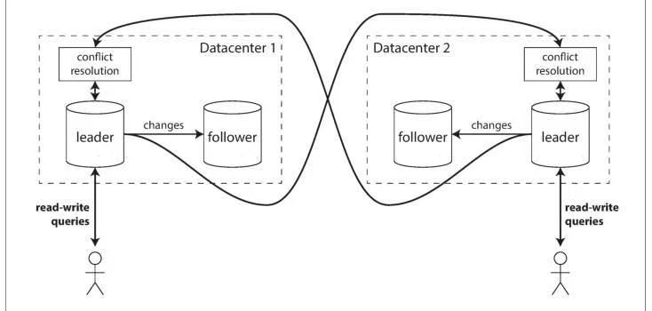
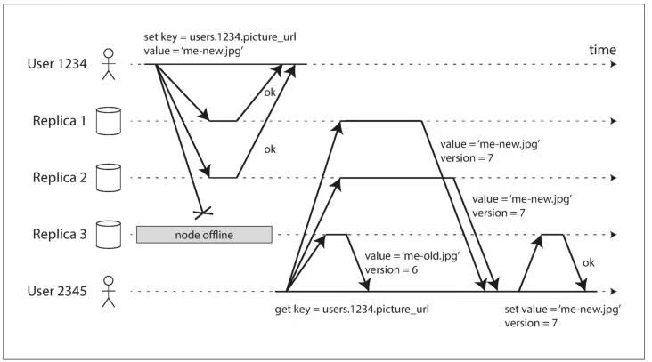
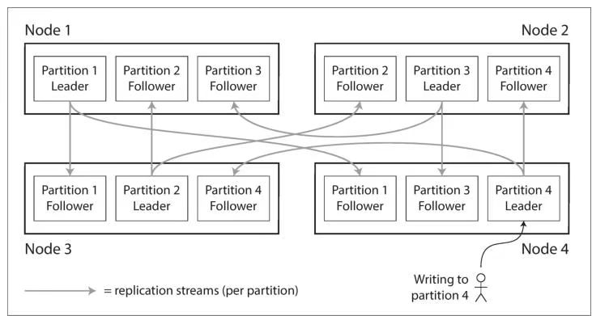
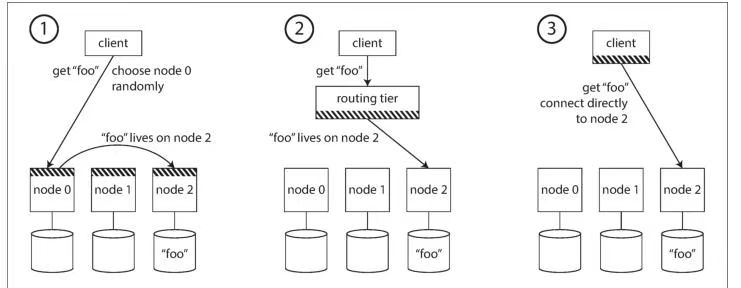
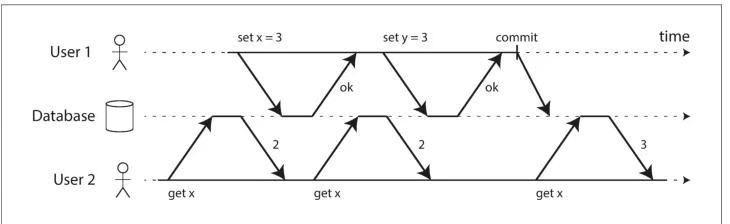
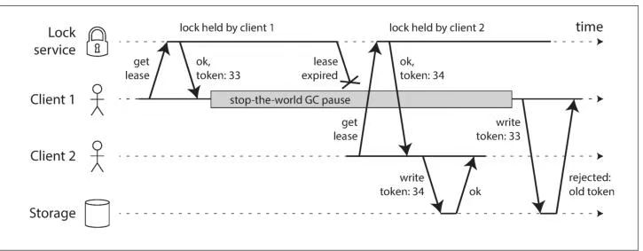
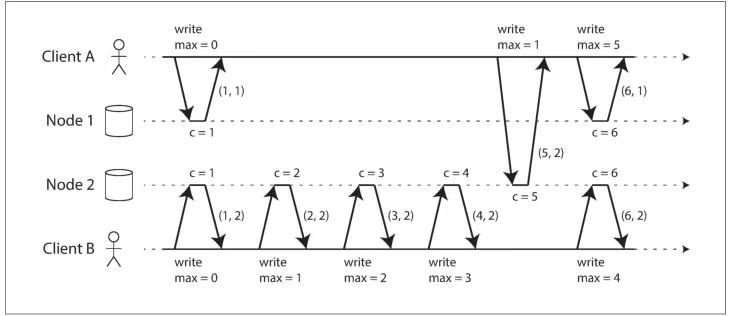
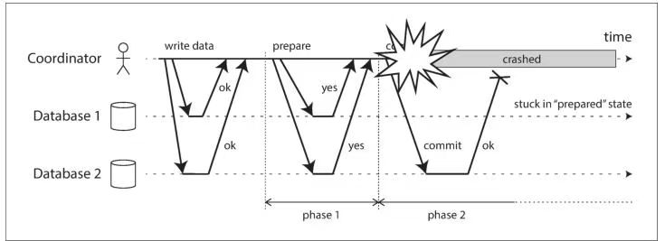

[toc]

## Chapter 1. Reliable, Scalable, and Maintainable Applications

第一章. 可靠，可扩张和和维护的应用程序

### Reliability

**Reliability** The system should continue to work correctly (performing the correct function at the desired level of performance) even in the face of adversity (hardware or soft‐ ware faults, and even human error)

**可靠性（Reliability）**：系统即使在面临不利情况时（包括硬件或软件故障，甚至人为错误），也应当能够继续**正确地运行**，并在**期望的性能水平**下完成其应有的功能。

Scalability As the system grows (in data volume, traffic volume, or complexity), there should be reasonable ways of dealing with that growth.

**可扩展性（Scalability）**：随着系统规模的增长（例如数据量、流量规模或系统复杂度的提升），应当有**合理可行的方式**来应对这种增长。

Maintainability Over time, many different people will work on the system (engineering and oper‐ ations, both maintaining current behavior and adapting the system to new use cases), and they should all be able to work on it productively

**可维护性（Maintainability）**：随着时间推移，许多不同的人都会参与到系统的工作中（包括工程和运维人员，既要维护现有行为，也要将系统适配到新的使用场景），并且他们都应当能够**高效、富有成效地**开展工作。

#### Hardware Faults

Hard disks are reported as having a mean time to failure (MTTF) of about 10 to 50years [5, 6]. Thus, on a storage cluster with 10,000 disks, we should expect on averageone disk to die per day.

硬盘通常被报告其**平均无故障时间（MTTF）**约为 **10 到 50 年** [5, 6]。因此，在一个拥有 **10,000 块磁盘**的存储集群中，**平均每天都会有一块磁盘发生故障**。

### Maintainability

It is well known that the majority of the cost of software is not in its initial develop‐ment, but in its ongoing maintenance—fixing bugs, keeping its systems operational,investigating failures, adapting it to new platforms,modifying it for new use cases,repaying technical debt, and adding new features.

众所周知，**软件成本的大头并不在最初的开发阶段**，而是在其**持续的维护过程中**——包括修复缺陷、保障系统持续运行、排查故障、适配新的平台、支持新的使用场景、偿还技术债务以及添加新功能。

Operability Make it easy for operations teams to keep the system runningsmoothly.

**可运维性（Operability）**： 使运维团队能够**轻松地**保障系统**平稳、持续地运行**。

Simplicity Make it easy for new engineers to understand the system, byremoving as muchcomplexity as possible from the system. (Note this is notthe same as simplicityof the user interface.)

**简单性（Simplicity）**：通过尽可能消除系统中的复杂性，使**新工程师能够容易地理解系统**。（注意：这并不等同于用户界面的简单性。）

EvolvabilityMake it easy for engineers to make changes to the system in thefuture, adaptingit for unanticipated use cases as requirements change. Alsoknown as extensibil‐ity, modifiability, or plasticity.

**可演进性（Evolvability）**：使工程师能够在未来**方便地对系统进行修改**，以适应需求变化下**事先未预料到的使用场景**。
 也称为**可扩展性（extensibility）**、**可修改性（modifiability）\**或\**可塑性（plasticity）**。


One of the best tools we have for removing accidental complexity is abstraction. Agood abstraction can hide a great deal of implementationdetail behind a clean,simple-to-understand façade. A good abstraction canalso be used for a wide range ofdifferent applications. Not only is this reusemore efficient than reimplementing asimilar thing multiple times, but it alsoleads to higher-quality software, as qualityimprovements in the abstractedcomponent benefit all applications that use it.

我们用于消除**偶然复杂性**的最佳工具之一是**抽象**。一个良好的抽象能够将大量的实现细节隐藏在**清晰、易于理解的外观（接口）\**之后。
好的抽象还可以被\**广泛应用于不同的场景**。这种复用不仅比多次重新实现类似功能更加高效，而且还能带来**更高质量的软件**，因为对被抽象组件所做的质量改进，会**惠及所有使用该组件的应用**。

## Chapter 2. Data Models and Query Languages

第二章 数据模型和查询语言

### Relational Model Versus Document Model 

关系模型和文档模型

The advantage of using an ID is that because it has no meaning to humans,it neverneeds to change: the ID can remain the same, even if the informationit identifieschanges. Anything that is meaningful to humans may need tochange sometime inthe future—and if that information is duplicated, all theredundant copies need to beupdated. That incurs write overheads, and risksinconsistencies (where some copiesof the information are updated butothers aren’t). Removing such duplication is thekey idea behind normalization in databases

使用标识符（ID）的优势在于，**它对人类不具备任何语义含义**，因此永远无需修改：即便其标识的信息发生变化，ID 也可以保持不变。任何对人类有语义含义的信息，未来都有可能需要修改 —— 而且如果这类信息存在重复存储的情况，那么所有冗余副本都需要逐一更新。这不仅会产生**写入开销**，还会带来**数据不一致的风险**（即部分信息副本完成了更新，其他副本却未同步更新）。**消除此类数据冗余**，正是数据库**规范化**设计的核心理念。


## Chapter 3. Storage and Retrieval

第三章. 存储和检索

### Data Structures That Power Your Database

This is an important trade-off in storage systems: well-chosen indexesspeed up readqueries, but every index slows down writes.

这是存储系统中的一个重要权衡：合理选择的索引可以加速读取查询，但每个索引都会减慢写入操作。


### Chapter 4. Encoding and Evolution

第 四章. 编码与进化

### Modes of Dataflow

However, there is an additional snag. Say you add a field to a record schema, and thenewer code writes a value for that new field to the database. Subsequently, an olderversion of the code (which doesn’t yet know about the new field) reads the record,updates it, and writes it back. In this situation, the desirable behavior is usually forthe old code to keep the new field intact, even though it couldn’t be interpreted.

然而，这里还有一个额外的陷阱。假设你向记录模式中添加了一个字段，较新的代码会将该字段的值写入数据库。随后，旧版本的代码（尚未知晓新字段）读取该记录、更新并重新写回。在这种情况下，理想的行为通常是旧代码应保持新字段的完整性，即使它无法解析该字段。

The encoding formats discussed previously support such preservation of unknownfields, but sometimes you need to take care at an application level, as illustrated inFigure 4-7. For example, if you decode a database value into model objects in theapplication, and later reencode those model objects, the unknown field might be lostin that translation process. Solving this is not a hard problem; you just need to beaware of it.

前面讨论的编码格式支持保留未知字段的功能，但在某些情况下你需要在应用程序层面特别注意，如图4-7所示。例如，如果将数据库值解码为应用程序中的模型对象，随后又重新编码这些模型对象时，未知字段可能会在转换过程中丢失。这个问题的解决方案并不困难，你只需要意识到它的存在即可。


Schema evolution thus allows the entire database to appear as if it was encoded with asingle schema, even though the underlying storage may contain records encoded withvarious historical versions of the schema.

因此，模式演变使得整个数据库看起来仿佛是使用单一模式编码的，即使其底层存储可能包含使用不同历史版本模式编码的记录。


The actor model is a programming model for concurrency in a single process. Ratherthan dealing directly with threads (and the associated problems of race conditions,locking, and deadlock), logic is encapsulated in actors. Each actor typically representsone client or entity, it may have some local state (which is not shared with any otheractor), and it communicates with other actors by sending and receiving asynchro‐nous messages. Message delivery is not guaranteed: in certain error scenarios, mes‐sages will be lost. Since each actor processes only one message at a time, it doesn’tneed to worry about threads, and each actor can be scheduled independently by theframework.

Actor模型是一种用于单个进程内并发的编程模型。它**而不是直接处理线程**（以及由此产生的竞态条件、锁和死锁等问题），而是将逻辑封装在Actor中。每个Actor通常代表一个客户端或实体，它可能拥有某些**局部状态**（该状态不会与其他Actor共享），并通过发送和接收**异步消息**与其他Actor通信。消息传递**不保证可靠**：在某些错误场景下，消息可能会丢失。由于每个Actor一次只处理一个消息，因此它**无需担心线程问题**，且每个Actor都可以由框架**独立调度**。

## Chapter 5. Replication

第 5 章 复制

### Leaders and Followers

You could make the files on disk consistent by locking the database (making itunavailable for writes), but that would go against our goal of high availability. Fortu‐nately, setting up a follower can usually be done without downtime. Conceptually,the process looks like this:

1. Take a consistent snapshot of the leader’s database at some point in time—if pos‐ sible, without taking a lock on the entire database. Most databases have this fea‐ ture, as it is also required for backups. In some cases, third-party tools are needed, such as innobackupex for MySQL.
2. Copy the snapshot to the new follower node.
3. The follower connects to the leader and requests all the data changes that have happened since the snapshot was taken. This requires that the snapshot is associ‐ ated with an exact position in the leader’s replication log. That position has vari‐ ous names: for example, PostgreSQL calls it the log sequence number, and MySQL calls it the binlog coordinates.
4. When the follower has processed the backlog of data changes since the snapshot,we say it has caught up. It can now continue to process data changes from the leader as they happen.

你可以通过锁定数据库（使其无法写入）来使磁盘上的文件保持一致，但这会违背我们追求高可用性的目标。幸运的是，通常可以在不中断服务的情况下完成从库的搭建。从概念上看，具体流程如下：

1. **获取主库的一致快照**：在某个时间点对主库数据库创建一个一致性的快照——**尽可能避免对整个数据库加锁**。大多数数据库都支持此功能（因为备份时也需要）。在某些情况下需要第三方工具，例如 MySQL 的 `innobackupex`。
2. **复制快照到新从库节点**：将快照文件完整复制到新的从库节点。
3. **同步增量数据**：从库连接主库，请求从快照创建时刻起**所有后续的数据变更**。这要求快照必须关联到主库复制日志中的一个精确位置，不同数据库对此位置有不同的称呼：
   - PostgreSQL 称其为 **日志序列号（LSN）**
   - MySQL 称其为 **二进制日志坐标（binlog 坐标）**
4. **完成数据同步**：当从库处理完快照创建后积累的所有数据变更时，我们称其已**追上主库进度**。此后，从库即可持续接收并处理主库实时产生的数据变更。


Leader failure: Failover

**领导者故障：故障转移**

Handling a failure of the leader is trickier: one of the followers needs to be promotedto be the new leader, clients need to be reconfigured to send their writes to the newleader, and the other followers need to start consuming data changes from the newleader. This process is called **failover**.

处理领导者故障更为复杂：需要将某个**从库提升为新的领导者**，客户端需重新配置以向新领导者发送写请求，其他从库需开始从新领导者消费数据变更。这一过程称为**故障转移**。

Failover can happen manually (an administrator is notified that the leader has failedand takes the necessary steps to make a new leader) or automatically. An automaticfailover process usually consists of the following steps:

1. Determining that the leader has failed. There are many things that could poten‐ tially go wrong: crashes, power outages, network issues, and more. There is no foolproof way of detecting what has gone wrong, so most systems simply use a timeout: nodes frequently bounce messages back and forth between each other,and if a node doesn’t respond for some period of time—say, 30 seconds—it is assumed to be dead. (If the leader is deliberately taken down for planned mainte‐ nance, this doesn’t apply.)
2. Choosing a new leader. This could be done through an election process (where the leader is chosen by a majority of the remaining replicas), or a new leader could be appointed by a previously elected controller node. The best candidate for leadership is usually the replica with the most up-to-date data changes from the old leader (to minimize any data loss). Getting all the nodes to agree on a new leader is a consensus problem, discussed in detail in Chapter 9.
3. Reconfiguring the system to use the new leader. Clients now need to send their write requests to the new leader (we discuss this in “Request Routing” on page 214). If the old leader comes back, it might still believe that it is the leader,not realizing that the other replicas have forced it to step down. The system needs to ensure that the old leader becomes a follower and recognizes the new leader.

故障转移可以是**人工**（管理员收到领导者故障通知后手动操作）或**自动**。自动故障转移通常包含以下步骤：

1. ***\*确认领导者故障\****. 潜在故障原因多样：崩溃、断电、网络问题等。无法100%可靠检测故障原因，因此多数系统采用**超时机制**：

   - 节点间频繁互发心跳包，若某节点在指定时间内（如30秒）无响应，则判定为故障。
   - **例外**：若领导者因计划性维护被主动下线，则不触发此机制。

2. ***\*选举新领导者\****

   - **选举机制**：剩余副本通过多数表决（majority）选出新领导者。
   - **指定机制**：由预选的控制器节点（controller node）直接任命。
   - **最优候选**：通常选择从旧领导者处**数据变更最完整**的副本（以最小化数据丢失风险）。
   - **共识问题**：所有节点需就新领导者达成一致，此问题在**第9章**详细讨论。

3. ***\*系统重新配置\****

   - **客户端路由**：客户端需将写请求重定向到新领导者（详见[第214页]的“请求路由”）。
   - **旧领导者恢复处理**：若旧领导者重新上线，可能仍自认为是领导者（未意识到已被强制下线）。系统需确保：
     - 旧领导者降级为从库
     - 旧领导者接受新领导者的权威


Failover is fraught with things that can go wrong:

- If asynchronous replication is used, the new leader may not have received all the writes from the old leader before it failed. If the former leader rejoins the cluster after a new leader has been chosen, what should happen to those writes? The new leader may have received conflicting writes in the meantime. The most common solution is for the old leader’s unreplicated writes to simply be discarded, which may violate clients’ durability expectations.
- Discarding writes is especially dangerous if other storage systems outside of the database need to be coordinated with the database contents. For example, in one incident at GitHub [13], an out-of-date MySQL follower was promoted to leader. The database used an autoincrementing counter to assign primary keys to new rows, but because the new leader’s counter lagged behind the old leader’s, itreused some primary keys that were previously assigned by the old leader. Theseprimary keys were also used in a Redis store, so the reuse of primary keys resul‐ted in inconsistency between MySQL and Redis, which caused some private datato be disclosed to the wrong users.
- In certain fault scenarios (see Chapter 8), it could happen that two nodes both believe that they are the leader. This situation is called split brain, and it is dan‐ gerous: if both leaders accept writes, and there is no process for resolving con‐ flicts (see “Multi-Leader Replication” on page 168), data is likely to be lost or corrupted. As a safety catch, some systems have a mechanism to shut down one node if two leaders are detected.ii However, if this mechanism is not carefully designed, you can end up with both nodes being shut down [14].
- What is the right timeout before the leader is declared dead? A longer timeout means a longer time to recovery in the case where the leader fails. However, if the timeout is too short, there could be unnecessary failovers. For example, a tempo‐ rary load spike could cause a node’s response time to increase above the timeout,or a network glitch could cause delayed packets. If the system is already strug‐ gling with high load or network problems, an unnecessary failover is likely to make the situation worse, not better.

**故障转移的过程中，往往潜藏着诸多容易导致异常的风险点：**

- 若采用**异步复制**机制，新主节点在旧主节点故障时，可能并未接收完旧主节点的所有写入操作。倘若旧主节点在新主节点当选后重新加入集群，这些未同步的写入操作该如何处理？在此期间，新主节点可能已经接收了与之冲突的写入操作。最常用的解决方案是直接丢弃旧主节点中未复制的写入操作，但这种做法可能会违背客户端对数据**持久性的预期**。
- 当数据库之外的其他存储系统需要与数据库中的数据保持协同一致时，丢弃写入操作的做法会格外危险。例如，GitHub 曾发生过这样一起事故 [13]：一台**数据滞后的 MySQL 从节点**被提升为主节点。该数据库原本依靠自增计数器为新数据行分配主键，而由于新主节点的计数器数值落后于旧主节点，它复用了一些旧主节点此前已经分配过的主键。这些主键同时也被用于 Redis 存储系统，主键的复用最终导致 MySQL 与 Redis 之间出现数据不一致，进而造成部分私密数据被泄露给错误的用户。
- 在某些故障场景下（详见第 8 章），可能会出现**两个节点均认为自己是主节点**的情况。这种现象被称为**脑裂**，具有极大的危险性：如果两个主节点都接收写入操作，且系统没有冲突解决机制（详见第 168 页的 “多主复制” 章节），数据很可能会丢失或损坏。作为一种安全兜底机制，部分系统会在检测到双主节点并存时，自动关闭其中一个节点。<sup>ii</sup> 但如果该机制的设计不够严谨，最终可能会导致**两个节点都被关闭** [14]。
- 判定主节点失效的**超时阈值设置为多少才合理**？超时阈值过长，意味着主节点故障后系统需要更长的时间才能完成恢复；但如果阈值过短，则可能引发不必要的故障转移。例如，临时的负载峰值可能导致节点响应时间超过阈值，或是网络瞬断会造成数据包延迟。如果系统本就正受困于高负载或网络问题，一次不必要的故障转移非但无法缓解问题，反而可能让情况雪上加霜。

### Problems with Replication Lag

复制延迟的问题

#### Reading Your Own Writes

Unfortunately, if an application reads from an asynchronous follower, it may see out‐dated information if the follower has fallen behind. This leads to apparent inconsis‐tencies in the database: if you run the same query on the leader and a follower at thesame time, you may get different results, because not all writes have been reflected inthe follower. This inconsistency is just a temporary state—if you stop writing to thedatabase and wait a while, the followers will eventually catch up and become consis‐tent with the leader. For that reason, this effect is known as **eventual consistency**

遗憾的是，如果应用程序从**异步从节点**读取数据，当从节点的数据同步滞后时，就可能获取到过期的信息。这会导致数据库出现**表面上的数据不一致**：倘若你同时在主节点和从节点上执行相同的查询，可能会得到不同的结果 —— 原因是从节点中尚未同步所有的写入操作。但这种不一致只是一种**临时状态**：如果停止向数据库写入数据，等待一段时间后，从节点最终会追平数据，与主节点保持一致。正是因为这一特性，这种现象被称为**最终一致性**。

 In this situation, we need **read-after-write consistency**, also known as **read-your-writes consistency** [24]. This is a guarantee that if the user reloads the page, they will alwayssee any updates they submitted themselves. It makes no promises about other users:other users’ updates may not be visible until some later time. However, it reassuresthe user that their own input has been saved correctly.

在这种情况下，我们就需要**写后读一致性**（也称为**读己写一致性**）[24]。这是一项保障机制：当用户刷新页面时，总能看到自己提交的所有更新内容。该机制不会对其他用户的操作做出承诺 —— 其他用户提交的更新，可能要等到一段时间后才能被看见。但它能让用户放心，自己输入的内容已经被正确保存。

How can we implement **read-after-write consistency** in a system with **leader-based replication**? There are various possible techniques. To mention a few:

- When reading something that the user may have modified, read it from the leader; otherwise, read it from a follower. This requires that you have some way of knowing whether something might have been modified, without actually querying it. For example, user profile information on a social network is nor‐ mally only editable by the owner of the profile, not by anybody else. Thus, a sim‐ ple rule is: always read the user’s own profile from the leader, and any other users’ profiles from a follower.
- If most things in the application are potentially editable by the user, that approach won’t be effective, as most things would have to be read from the leader (negating the benefit of read scaling). In that case, other criteria may be used to decide whether to read from the leader. For example, you could track the time of the last update and, for one minute after the last update, make all reads from the leader. You could also monitor the replication lag on followers and pre‐ vent queries on any follower that is more than one minute behind the leader.
- The client can remember the timestamp of its most recent write—then the sys‐ tem can ensure that the replica serving any reads for that user reflects updates at least until that timestamp. If a replica is not sufficiently up to date, either the read can be handled by another replica or the query can wait until the replica has  caught up. The timestamp could be a **logical timestamp** (something that indicates ordering of writes, such as the **log sequence number**) or the actual system clock(in which case clock synchronization becomes critical; see “Unreliable Clocks”on page 287).
-  If your replicas are distributed across multiple datacenters (for geographical proximity to users or for availability), there is additional complexity. Any request that needs to be served by the leader must be routed to the datacenter that con‐ tains the leader.

**在基于主节点的复制系统中，我们该如何实现写后读一致性呢？具体有多种可行的技术方案，以下列举其中几种：**

- 当读取用户**可能已修改过**的数据时，从主节点读取；其余情况下，从从节点读取。这要求系统具备一种判断逻辑 —— 无需实际查询数据，就能确定某条数据是否有可能被修改。例如，社交网络中的用户资料通常只有账号所有者可以编辑，其他用户无权修改。基于这一特点，我们可以制定一条简单规则：**始终从主节点读取用户自己的资料**，而从从节点读取其他用户的资料。
- 若应用中的大部分数据都存在被用户修改的可能，那么上述方案的效果就会大打折扣 —— 因为绝大多数读取请求都需要路由到主节点，这样就会**抵消读扩展带来的优势**。这种情况下，就需要借助其他判断标准来决定读取请求的路由目标。例如，系统可以记录每条数据的**最后更新时间戳**，在数据更新后的一分钟内，所有针对该数据的读取请求都定向到主节点；也可以实时监控从节点的**复制延迟**，一旦某个从节点与主节点的延迟超过一分钟，就暂时禁止向该从节点发送查询请求。
- 客户端可以记录自己**最近一次写入操作的时间戳**，之后系统就需要确保：为该用户提供读取服务的副本，至少包含该时间戳之前的所有更新数据。如果某个副本的数据同步进度未达标，那么要么将读取请求转发至其他同步完成的副本，要么让该查询请求**等待副本追平数据后再执行**。这里的时间戳可以是**逻辑时间戳**（用于标记写入操作顺序的标识，比如日志序列号），也可以是实际的系统时钟时间（这种情况下，**时钟同步就会变得至关重要**，详见第 287 页的 “不可靠时钟” 章节）。
- 若数据库副本分布在**多个数据中心**（此举或是为了让服务地理位置更贴近用户，或是为了提升系统可用性），则会引入额外的复杂度。所有需要由主节点处理的请求，都必须精准路由到**主节点所在的数据中心**。

Another complication arises when the same user is accessing your service from mul‐tiple devices, for example a desktop web browser and a mobile app. In this case youmay want to provide cross-device read-after-write consistency: if the user enters someinformation on one device and then views it on another device, they should see theinformation they just entered.

当同一用户通过多台设备访问服务时（例如桌面端网页浏览器和移动端应用），会衍生出另一个复杂问题。这种情况下，你可能需要实现**跨设备写后读一致性**：如果用户在一台设备上录入了某些信息，之后用另一台设备查看，应该能看到自己刚录入的内容。

In this case, there are some additional issues to consider:

-  Approaches that require remembering the timestamp of the user’s last update become more difficult, because the code running on one device doesn’t know what updates have happened on the other device. This metadata will need to be centralized.
- If your replicas are distributed across different datacenters, there is no guarantee that connections from different devices will be routed to the same datacenter. (For example, if the user’s desktop computer uses the home broadband connec‐ tion and their mobile device uses the cellular data network, the devices’ network routes may be completely different.) If your approach requires reading from the leader, you may first need to route requests from all of a user’s devices to the same datacenter.

这种场景下，还需要考虑以下额外问题：

- 那些需要记录用户最近一次更新时间戳的方案，实施难度会有所增加。因为运行在某一台设备上的代码，无法知晓其他设备上发生过哪些更新操作。这类元数据必须进行**集中存储**。
- 若数据库副本分布在不同的数据中心，那么来自用户不同设备的请求，无法保证会被路由到同一个数据中心。（例如，用户的台式机使用的是家庭宽带网络，而移动设备使用的是蜂窝数据网络，两台设备的网络路由可能完全不同。）如果你的方案要求读取请求必须由主节点处理，那么首先需要将该用户所有设备的请求，**统一路由至同一个数据中心**。

#### Monotonic Reads

**Monotonic reads** [23] is a guarantee that this kind of anomaly does not happen. It’s alesser guarantee than strong consistency, but a stronger guarantee than eventual con‐sistency. When you read data, you may see an old value; monotonic reads only meansthat if one user makes several reads in sequence, they will not see time go backward—i.e., they will not read older data after having previously read newer data.

单调读 [23] 是一种保证，用来避免上述这类异常情况的发生。它比**强一致性**弱，但比**最终一致性**强。当你读取数据时，可能会看到旧值；单调读只保证：**如果同一个用户按顺序进行了多次读取，那么他们不会看到时间倒退**——也就是说，在已经读到较新数据之后，不会再读到更旧的数据。

One way of achieving monotonic reads is to make sure that each user always makestheir reads from the same replica (different users can read from different replicas).For example, the replica can be chosen based on a hash of the user ID, rather thanrandomly. However, if that replica fails, the user’s queries will need to be rerouted toanother replica.

实现单调读的一种方式是：确保每个用户始终从**同一个副本**读取数据（不同用户可以从不同的副本读取）。例如，可以根据用户 ID 的哈希值来选择副本，而不是随机选择。不过，如果该副本发生故障，用户的查询就需要被重定向到另一个副本。

#### Consistent Prefix Reads

一致前缀读

Preventing this kind of anomaly requires another type of guarantee: **consistent prefix reads** [23]. This guarantee says that if a sequence of writes happens in a certain order,then anyone reading those writes will see them appear in the same order.

要防止这种异常，需要另一种保证：**一致前缀读（consistent prefix reads）** [23]。这种保证意味着：**如果一系列写操作是按某个顺序发生的，那么任何读取这些写操作的读者，看到的结果也会按照同样的顺序出现**。

This is a particular problem in **partitioned (sharded) databases**, which we will discussin Chapter 6. If the database always applies writes in the same order, reads always seea consistent prefix, so this anomaly cannot happen. However, in many distributed databases, different partitions operate independently, so there is no global ordering ofwrites: when a user reads from the database, they may see some parts of the databasein an older state and some in a newer state.

这在**分区（分片）数据库**中是一个特别突出的问题，我们将在第 6 章中讨论。如果数据库总是以相同的顺序应用写操作，那么读操作总是能看到一个一致的前缀，因此这种异常就不会发生。然而，在许多分布式数据库中，不同的分区是彼此独立运行的，并不存在全局的写入顺序：当用户从数据库读取数据时，可能会看到数据库的某些部分仍处于较旧的状态，而另一些部分已经处于较新的状态。

### Multi-Leader Replicatoin

In a **multi-leader** configuration, you can have a leader in eachdatacenter. Figure 5-6shows what this architecture might look like. Within each datacenter, regular leader–follower replication is used; between datacenters, each datacenter’s leader replicatesits changes to the leaders in other datacenters.

在**多主（multi-leader）配置**中，可以在每个数据中心各自设置一个主节点。图 5-6 展示了这种架构的大致样子。在每个数据中心内部，使用常规的**主从复制（leader–follower replication）**；而在数据中心之间，则由各个数据中心的主节点将其变更复制到其他数据中心的主节点。



Let’s compare how the **single-leader** and **multi-leader** configurations fare in a multi-datacenter deployment:

下面对比一下**单主（single-leader）**和**多主（multi-leader）**配置在多数据中心部署下的表现：

**Performance** In a single-leader configuration, every write must go over the internet to the datacenter with the leader. This can add significant latency to writes and might contravene the purpose of having multiple datacenters in the first place. In a multi-leader configuration, every write can be processed in the local datacenter and is replicated **asynchronously** to the other datacenters. Thus, the inter- datacenter network delay is hidden from users, which means the perceived per‐ formance may be better.

**性能（Performance）**. 在单主配置中，每一次写入都必须通过互联网发送到主节点所在的数据中心。这会显著增加写入延迟，甚至可能违背部署多个数据中心的初衷。而在多主配置中，每次写入都可以在本地数据中心直接处理，然后再**异步**复制到其他数据中心。这样一来，跨数据中心的网络延迟对用户是不可感知的，因此用户感受到的性能通常会更好。

**Tolerance of datacenter outages** In a single-leader configuration, if the datacenter with the leader fails, failover can promote a follower in another datacenter to be leader. In a multi-leader con‐ figuration, each datacenter can continue operating independently of the others,and replication catches up when the failed datacenter comes back online.

**数据中心故障容忍性（Tolerance of datacenter outages）**. 在单主配置中，如果主节点所在的数据中心发生故障，需要通过故障转移（failover），将另一个数据中心中的某个从节点提升为主节点。在多主配置中，每个数据中心都可以独立于其他数据中心继续运行；当发生故障的数据中心恢复上线后，再通过复制机制将数据追赶同步。

**Tolerance of network problems** Traffic between datacenters usually goes over the public internet, which may be less reliable than the local network within a datacenter. A single-leader configu‐ ration is very sensitive to problems in this inter-datacenter link, because writes are made synchronously over this link. A multi-leader configuration with asyn‐ chronous replication can usually tolerate network problems better: a temporary network interruption does not prevent writes being processed.

**网络问题容忍性（Tolerance of network problems）**. 数据中心之间的通信通常经过公网，这往往比数据中心内部的本地网络更不可靠。单主配置对这种跨数据中心链路的问题非常敏感，因为写操作需要通过该链路**同步**完成。而采用**异步复制**的多主配置通常能更好地容忍网络问题：短暂的网络中断并不会阻止写操作的正常处理。

Although multi-leader replication has advantages, it also has a big downside: t**he same data may be concurrently modified in two different datacenters**, and those **write conflicts must be resolved** (indicated as “conflict resolution” in Figure 5-6). We willdiscuss this issue in “Handling Write Conflicts” on page 171.

尽管多主复制具有一些优势，但它也有一个很大的缺点：**同一份数据可能会在两个不同的数据中心被并发修改**，而这些**写冲突必须被解决**（在图 5-6 中以“冲突解决 / conflict resolution”标示）。我们将在第 171 页的“**处理写冲突（Handling Write Conflicts）**”一节中讨论这个问题。


#### Handling Write Conflicts

Conflict avoidance

避免冲突

The simplest strategy for dealing with conflicts is to **avoid** them: if the application canensure that **all writes for a particular record go through the same leader**, then conflicts cannot occur. Since many implementations of multi-leader replication handleconflicts quite poorly, **avoiding conflicts** is a frequently recommended approach [34].

处理写冲突最简单的策略是**避免冲突**：如果应用能够确保**某条记录的所有写操作都经过同一个主节点（leader）**，那么就不会发生冲突。由于许多多主复制的实现对冲突的处理能力相当有限，**避免冲突**因此成为一种经常被推荐的做法 [34]。

For example, in an application where a user can edit their own data, you can ensurethat requests from a particular user are always routed to the same datacenter and usethe leader in that datacenter for reading and writing. Different users may have differ‐ent “home” datacenters (perhaps picked based on geographic proximity to the user),but from any one user’s point of view the configuration is essentially **single-leader**.

例如，在一个用户只能编辑自己数据的应用中，可以保证来自某个用户的请求始终被路由到**同一个数据中心**，并使用该数据中心中的主节点进行读写。不同用户可以有不同的“**归属（home）数据中心**”（可能根据用户的地理位置就近选择），但从单个用户的视角来看，这种配置本质上仍然是**单主**的。

However, sometimes you might want to change the designated leader for a record—perhaps because one datacenter has failed and you need to reroute traffic to anotherdatacenter, or perhaps because a user has moved to a different location and is nowcloser to a different datacenter. In this situation, **conflict avoidance breaks down**, andyou have to deal with the possibility of concurrent writes on different leaders.

然而，有时你可能需要更改某条记录所指定的主节点——比如某个数据中心发生故障，需要将流量重新路由到另一个数据中心；或者用户迁移到了新的地点，离另一个数据中心更近。在这种情况下，**冲突避免机制就会失效**，你就必须面对在不同主节点上发生**并发写入**的可能性。


There are various ways of achieving **convergent conflict resolution**:

- **Give each write a unique ID** (e.g., a timestamp, a long random number, a UUID,or a hash of the key and value), **pick the write with the highest ID as the winner**,and throw away the other writes. If a timestamp is used, this technique is known as **last write wins (LWW)**. Although this approach is popular, **it is dangerously prone to data loss** [35]. We will discuss LWW in more detail at the end of this chapter (“Detecting Concurrent Writes” on page 184).
- **Record the conflict in an explicit data structure** that preserves all information,and write application code that resolves the conflict at some later time (perhaps by prompting the user).

实现**收敛型冲突解决（convergent conflict resolution）**有多种方式：

- **为每一次写入分配一个唯一 ID**（例如时间戳、一个较长的随机数、UUID，或者 key 与 value 的哈希值），然后选择 **ID 最大的写入作为最终结果**，并丢弃其他写入。如果使用的是时间戳，这种技术被称为**最后写入胜出（Last Write Wins，LWW）**。虽然这种方法很流行，但它**极易导致数据丢失** [35]。我们将在本章末尾的“**检测并发写入（Detecting Concurrent Writes）**”（第 184 页）中更详细地讨论 LWW。
- **用显式的数据结构记录冲突**，保留所有相关信息，然后通过应用层代码在之后的某个时间点来解决冲突（例如提示用户进行选择）。


### LeaderLess Replication

On the other hand, in a **leaderless** configuration, failover does not exist. Figure 5-10shows what happens: the client (user 1234) sends the write to all three replicas in par‐allel, and the two available replicas accept the write but the unavailable replica missesit. Let’s say that it’s sufficient for two out of three replicas to acknowledge the write:after user 1234 has received two ok responses, we consider the write to be successful.The client simply ignores the fact that one of the replicas missed the write.

另一方面，在**无主（leaderless）配置**中，并不存在故障转移（failover）。图 5-10 展示了这种情况下会发生什么：客户端（用户 1234）将写请求**并行发送**给三个副本，其中两个可用副本接受了写入，而一个不可用的副本错过了这次写入。假设只要 **3 个副本中有 2 个确认（acknowledge）写入即可视为成功**：在用户 1234 收到两个 ok 响应之后，我们就认为这次写入已经成功。客户端会直接忽略有一个副本未能接收到写入这一事实。



Now imagine that the unavailable node comes back online, and clients start readingfrom it. Any writes that happened while the node was down are missing from thatnode. Thus, if you read from that node, you may get stale (outdated) values asresponses.

现在设想那个不可用的节点重新上线，并且客户端开始从它读取数据。由于该节点宕机期间发生的写入都没有同步到它上面，因此这些写入在该节点上是缺失的。于是，如果你从这个节点读取数据，得到的可能是**陈旧的（过期的）值**。

To solve that problem, when a client reads from the database, it doesn’t just send itsrequest to one replica: read requests are also sent to several nodes in parallel. The cli‐ent may get different responses from different nodes; i.e., the up-to-date value fromone node and a stale value from another. Version numbers are used to determinewhich value is newer (see “Detecting Concurrent Writes” on page 184).

为了解决这个问题，当客户端从数据库读取数据时，并不会只向一个副本发送请求：**读请求同样会并行发送给多个节点**。客户端可能会从不同节点收到不同的响应，也就是说，可能从某个节点拿到最新值，而从另一个节点拿到旧值。此时可以通过**版本号**来判断哪个值更新（参见第 184 页“**检测并发写入**”）。

**Read repair and anti-entropy.** 

**读修复（Read repair）与反熵（Anti-entropy）**

The replication scheme should ensure that **eventually all the data is copied to everyreplica**. After an unavailable node comes back online, how does it catch up on thewrites that it missed?

复制机制需要确保：**最终所有数据都会被复制到每一个副本上**。当一个曾经不可用的节点重新上线后，它是如何补齐在宕机期间错过的写入的呢？

Two mechanisms are often used in Dynamo-style datastores:

在 **Dynamo 风格的数据存储系统**中，通常会使用两种机制：

**Read repair** When a client makes a read from several nodes in parallel, it can detect any stale responses. For example, in Figure 5-10, user 2345 gets a version 6 value from rep‐ lica 3 and a version 7 value from replicas 1 and 2. The client sees that replica 3 has a stale value and writes the newer value back to that replica. This approach works well for values that are frequently read.

**读修复（Read repair）**. 当客户端并行地从多个节点读取数据时，它可以检测到哪些响应是陈旧的。例如，在图 5-10 中，用户 2345 从副本 3 读到了版本 6 的值，而从副本 1 和副本 2 读到了版本 7 的值。客户端可以判断出副本 3 上的数据是过期的，于是将较新的值写回到该副本。这种方法对于**被频繁读取的数据**效果很好。

**Anti-entropy process** In addition, some datastores have a background process that constantly looks for differences in the data between replicas and copies any missing data from one replica to another. Unlike the replication log in leader-based replication, this anti-entropy process does not copy writes in any particular order, and there may be a significant delay before data is copied.

**反熵过程（Anti-entropy process）**. 此外，一些数据存储系统还会运行一个**后台进程**，不断检查各个副本之间的数据差异，并将缺失的数据从一个副本复制到另一个副本。与基于主节点复制的复制日志不同，这种反熵过程**不会按照特定的写入顺序复制数据**，而且在数据被完全复制之前，**可能会存在较长的延迟**。


**Detecting Concurrent Writes**

**检测并发写入**

For defining concurrency, **exact time doesn’t matter**: we simply call two operationsconcurrent if they are both unaware of each other, regardless of the physical time at which they **occurred**.

在定义并发时，**精确时间并不重要**：只要两个操作彼此互不感知，无论它们实际发生的物理时间如何，我们就将这两个操作称为**并发操作**。

Note that the server can determine whether two operations are concurrent by looking at the **version numbers**—it does not need to interpret the value itself (so the valuecould be any data structure). The algorithm works as follows:

- The server maintains a version number for every key, increments the version number every time that key is written, and stores the **new version number along with the value written**.
- When a client reads a key, the server returns **all values that have not been overwritten**, as well as the latest version number. **A client must read a key before writing.**
- When a client writes a key, it must include the version number from the prior read, and it must **merge together all values that it received in the prior read**. (The response from a write request can be like a read, returning all current values, which allows us to chain several writes like in the shopping cart example.)
- When the server receives a write with a particular version number, it can overwrite all values with t**hat version number or below** (since it knows that they have been merged into the new value), but it must keep all values with a **higher version number** (because those values are concurrent with the incoming write).
- When a write includes the version number from a prior read, that tells us which previous state the write is based on. If you make a write without including a versionnumber, it is concurrent with all other writes, so it will not overwrite anything—itwill just be returned as one of the values on subsequent reads.

需要注意的是，服务器只需通过**版本号**就能判断两个操作是否并发，无需解析值本身的内容（因此值可以是任意数据结构）。该算法的工作流程如下：

- 服务器为每个键维护一个版本号，每当该键被写入时，版本号就会递增，同时将**新版本号与写入的值一并存储**。
- 当客户端读取某个键时，服务器会返回该键**所有未被覆盖的值**，以及当前的最新版本号。**客户端在执行写入操作前，必须先读取对应键的数据**。
- 客户端写入某个键时，必须附带之前读取操作获取的版本号，同时需要将之前读取到的**所有值合并为一个新值**。（写入请求的响应可以仿照读取操作，返回当前的所有值，这一设计支持像购物车场景那样，将多次写入操作串联执行。）
- 当服务器接收到携带特定版本号的写入请求时，可以覆盖所有版本号**小于等于该值**的数据（因为服务器明确这些数据已被合并到新值中）；但必须保留所有版本号**高于该值**的数据（因为这些数据与本次写入请求属于并发关系）。
- 若写入请求中附带了之前读取操作的版本号，这就明确了本次写入基于的**历史状态版本**。如果写入时未附带版本号，则该操作会被判定为与所有其他写入操作并发，因此它不会覆盖任何已有数据 —— 只会在后续的读取操作中，作为其中一个值被返回。

### Summary

In this chapter we looked at the issue of **replication**. Replication can serve severalpurposes:

- **High availability** Keeping the system running, even when one machine (or several machines, or an entire datacenter) goes down
- **Disconnected operation** Allowing an application to continue working when there is a network interruption
- **Latency** Placing data geographically close to users, so that users can interact with it faster
- **Scalability** Being able to handle a higher volume of reads than a single machine could handle, by performing reads on replicas

在本章中，我们讨论了**复制（replication）**的问题。复制可以服务于多个目的：

- **高可用性（High availability）** 即使一台机器（或多台机器，甚至整个数据中心）发生故障，系统仍然能够继续运行。
- **离线/断连运行（Disconnected operation）** 在网络中断的情况下，仍然允许应用继续工作。
- **低延迟（Latency）** 将数据放置在地理位置上更接近用户的地方，使用户能够更快地与数据交互。
- **可扩展性（Scalability）** 通过在副本上执行读操作，来处理单台机器无法承受的高读请求量。

Despite being a simple goal—keeping a copy of the same data on several machines—replication turns out to be a remarkably tricky problem. It requires carefully thinkingabout concurrency and about all the things that can go wrong, and dealing with theconsequences of those faults. At a minimum, we need to deal with unavailable nodesand network interruptions (and that’s not even considering the more insidious kindsof fault, such as silent data corruption due to software bugs).

尽管目标看起来很简单——在多台机器上保存同一份数据的副本——**复制实际上是一个极其棘手的问题**。它需要我们非常谨慎地思考并发问题，以及各种可能出错的情况，并处理这些故障所带来的后果。至少，我们必须应对节点不可用和网络中断（更不用说那些更加隐蔽的故障类型，例如由于软件缺陷导致的静默数据损坏）。

We discussed three main approaches to replication:

- **Single-leader replication** Clients send all writes to a single node (the leader), which sends a stream of data change events to the other replicas (followers). Reads can be performed on any replica, but reads from followers might be stale.
- **Multi-leader replication** Clients send each write to one of several leader nodes, any of which can accept writes. The leaders send streams of data change events to each other and to any follower nodes.
- **Leaderless replication** Clients send each write to several nodes, and read from several nodes in parallel in order to detect and correct nodes with stale data.

我们讨论了三种主要的复制方式：

- **单主复制（Single-leader replication）** 客户端将所有写请求发送到单一节点（主节点），主节点再将数据变更事件流发送给其他副本（从节点）。读操作可以在任意副本上执行，但从节点上的读取可能是过期的。
- **多主复制（Multi-leader replication）** 客户端将写请求发送到多个主节点中的任意一个，这些主节点都可以接受写入。各个主节点之间，以及主节点与其从节点之间，都会相互复制数据变更事件流。
- **无主复制（Leaderless replication）** 客户端将每一次写入发送给多个节点，并在读取时并行地从多个节点读取，以检测并修复包含过期数据的节点。

Each approach has advantages and disadvantages. Single-leader replication is popularbecause it is fairly easy to understand and there is no conflict resolution to worryabout. Multi-leader and leaderless replication can be more robust in the presence offaulty nodes, network interruptions, and latency spikes—at the cost of being harderto reason about and providing only very weak consistency guarantees.

每种方式都有其优缺点。**单主复制**由于概念相对简单，而且不需要处理写冲突，因此非常流行。**多主复制**和**无主复制**在面对节点故障、网络中断以及延迟抖动时通常更加健壮，但代价是系统更难理解，只能提供**较弱的一致性保证**。

Replication can be synchronous or asynchronous, which has a profound effect on thesystem behavior when there is a fault. Although asynchronous replication can be fastwhen the system is running smoothly, it’s important to figure out what happenswhen replication lag increases and servers fail. If a leader fails and you promote anasynchronously updated follower to be the new leader, **recently committed data maybe lost**.

复制可以是**同步**的，也可以是**异步**的，而这在系统发生故障时会对行为产生深远影响。尽管异步复制在系统运行良好时速度很快，但当复制延迟增大、服务器发生故障时，必须认真考虑会发生什么。如果主节点发生故障，并将一个**异步更新的从节点**提升为新的主节点，那么**最近已经提交的数据可能会丢失**。

We looked at some strange effects that can be caused by replication lag, and we dis‐cussed a few consistency models which are helpful for deciding how an applicationshould behave under replication lag:

- Read-after-write consistency Users should always see data that they submitted themselves.
- Monotonic reads After users have seen the data at one point in time, they shouldn’t later see the data from some earlier point in time.
- Consistent prefix reads Users should see the data in a state that makes causal sense: for example, seeing a question and its reply in the correct order.

我们还探讨了复制延迟可能引发的一些特殊问题，并介绍了几种一致性模型，这些模型有助于我们定义应用程序在复制延迟场景下应有的行为表现：

- **写后读一致性**：用户始终能够读取到自己提交的最新数据。
- **单调读一致性**：用户一旦读取到某个时间点的数据状态，后续读取操作就不会返回更早时间点的数据。
- **一致前缀读一致性**：用户读取的数据始终符合因果逻辑，比如能够按正确的先后顺序看到某条问题及其对应的回复。

Finally, we discussed the concurrency issues that are inherent in multi-leader andleaderless replication approaches: because they allow multiple writes to happen con‐currently, conflicts may occur. We examined an algorithm that a database might useto determine whether one operation happened before another, or whether they hap‐pened concurrently. We also touched on methods for resolving conflicts by mergingtogether concurrent updates.

最后，我们分析了多主复制和无主复制方案中固有的并发问题：由于这两种方案允许多个写入操作并行执行，因此很可能会引发冲突。我们介绍了一种数据库常用的算法，该算法能够判断一个操作是发生在另一个操作之前，还是与另一个操作属于并发关系。同时，我们也简要提及了通过合并并发更新来解决冲突的相关方法。

## Chapter 6. Partitioning

### Partitioning and Replication

分区与复制

**Partitioning is usually combined with replication** so that copies of each partition arestored on multiple nodes. This means that, even though each record belongs toexactly one partition, it may still be stored on several different nodes for fault tolerance.

**分区通常会与复制结合使用**，这样一来，每个分区的副本就会存储在多个节点上。这意味着，尽管每条记录**只属于某一个分区**，但为了实现容错性，该记录仍可能被存储在多个不同的节点上。

A node may store more than one partition. If a leader–follower replication model isused, the combination of partitioning and replication can look like Figure 6-1. Eachpartition’s leader is assigned to one node, and its followers are assigned to othernodes. Each node may be the leader for some partitions and a follower for other partitions.

一个节点可以存储多个分区。若采用**主从复制模型**，分区与复制的结合方式可参见图 6-1。每个分区的主节点会被分配至某一个节点，而该分区的从节点则分配至其他节点。**每个节点既可以是某些分区的主节点，同时也可以是另一些分区的从节点**。



### Partitioning of Key-Value Data

If the partitioning is unfair, so that some partitions have more data or queries thanothers, we call it **skewed**. The presence of skew makes partitioning much less effective.In an extreme case, all the load could end up on one partition, so 9 out of 10 nodesare idle and your bottleneck is the single busy node. **A partition with disproportionately high load is called a hot spot.**

若分区策略设计得不够均衡，导致部分分区的数据量或查询量远超其他分区，这种情况就称为**数据倾斜** 。数据倾斜的存在会大幅削弱分区策略的效果。

在极端情况下，所有负载最终都集中在某一个分区上，导致十台节点中有九台处于闲置状态，而系统的性能瓶颈就变成了这台超负荷运转的节点。**负载量异常偏高的分区，被称为热点分区**。

#### Skewed Workloads and Relieving Hot Spots

**倾斜的负载与热点缓解**

Today, most data systems are not able to automatically compensate for such a highlyskewed workload, so it’s the responsibility of the application to reduce the skew. Forexample, if one key is known to be very hot, a simple technique is to add a randomnumber to the beginning or end of the key. Just a two-digit decimal random numberwould split the writes to the key evenly across 100 different keys, allowing those keysto be distributed to different partitions.

如今，大多数数据系统都无法自动应对这类高度倾斜的负载，因此**减轻数据倾斜的责任需要由应用层来承担**。例如，若已知某个键是高频热点键，一种简单的解决办法是在该键的开头或结尾添加一个随机数。仅一个两位十进制随机数，就能将对原键的写入请求均匀分散到 100 个不同的键上，进而让这些键被分配至不同的分区。

However, having split the writes across different keys, any reads now have to do addi‐tional work, as they have to read the data from all 100 keys and combine it. This tech‐nique also requires additional bookkeeping: it only makes sense to append therandom number for the small number of hot keys; for the vast majority of keys withlow write throughput this would be unnecessary overhead. Thus, you also need someway of keeping track of which keys are being split.

但这种做法会给读取操作带来额外的工作量 —— 因为读取时需要从这 100 个键中分别获取数据，再将结果合并。同时，该方案还需要额外的记录工作：只有对少数热点键添加随机数才有意义；对于绝大多数写入吞吐量较低的普通键来说，这种操作只会造成不必要的开销。因此，应用层还需要有相应的机制，**记录哪些键是被拆分处理的热点键**。

### Request Routing

This is an instance of a more general problem called **service discovery**, which isn’tlimited to just databases. Any piece of software that is accessible over a network hasthis problem, especially if it is aiming for high availability (running in a **redundan tconfiguration** on multiple machines). Many companies have written their own in-house service discovery tools, and many of these have been released as open source[30].

这是一个更通用的问题 ——**服务发现**的具体体现，该问题并非数据库领域所独有。任何可通过网络访问的软件都会面临这个问题，尤其是那些追求高可用性（在多台机器上以**冗余配置**运行）的软件。许多企业都开发了自研的服务发现工具，其中不少已作为开源项目发布 [30]。

On a high level, there are a few different approaches to this problem (illustrated inFigure 6-7):

1. Allow clients to contact any node (e.g., via a **round-robin load balancer**). If that node coincidentally owns the partition to which the request applies, it can handle the request directly; otherwise, it forwards the request to the appropriate node,receives the reply, and passes the reply along to the client.
2. Send all requests from clients to a **routing tier** first, which determines the node that should handle each request and forwards it accordingly. This routing tier does not itself handle any requests; it only acts as a **partition-aware load balancer**.
3. Require that clients **be aware of the partitioning and the assignment of partitions to nodes**. In this case, a client can connect directly to the appropriate node,without any intermediary.

从宏观层面来看，解决该问题有以下几种不同方案（如图 6-7 所示）：

1. 允许客户端访问任意节点（例如，通过**轮询负载均衡器**）。如果该节点恰好负责请求对应的分区，就可以直接处理这个请求；否则，该节点会将请求转发至对应的目标节点，待接收目标节点的回复后，再将结果反馈给客户端。
2. 先将客户端的所有请求发送至**路由层**，由路由层确定每个请求应对应的处理节点，并完成请求转发。该路由层不处理任何业务请求，仅充当**感知分区的负载均衡器**。
3. 要求客户端**知晓分区情况以及分区与节点的对应关系**。这种情况下，客户端无需任何中间层，即可直接连接到对应的处理节点。



> Figure 6-7: Three different ways of routing a request to right nodes

Many distributed data systems rely on a **separate coordination service** such as **ZooKeeper** to keep track of this cluster metadata, as illustrated in Figure 6-8. Each noderegisters itself in ZooKeeper, and ZooKeeper maintains the authoritative mapping ofpartitions to nodes. Other actors, such as the routing tier or the partitioning-awareclient, can subscribe to this information in ZooKeeper. Whenever a partition changesownership, or a node is added or removed, ZooKeeper notifies the routing tier so thatit can keep its routing information up to date.

许多分布式数据系统会依赖 **ZooKeeper** 这类独立的**协调服务**，来维护集群的元数据信息（如图 6-8 所示）。每个节点会在 ZooKeeper 中完成自身注册，ZooKeeper 则负责维护**分区与节点之间的权威映射关系**。路由层、感知分区的客户端等其他角色，可以在 ZooKeeper 中订阅这些信息。每当某个分区的归属权发生变更，或是有节点新增、移除时，ZooKeeper 都会及时通知路由层，使其能够实时更新自身的路由信息。

## Chapter 7. Transactions

### The Slippery Concept of a Transaction

**事务的模糊概念**

#### The Meaning of ACID

The safety guarantees provided by transactions are often described by the well-known acronym **ACID**, which stands for **Atomicity**, **Consistency**, **Isolation**, and **Durability**.

事务提供的安全保障通常用广为人知的缩写词 **ACID** 来描述，它分别代表**原子性（Atomicity）、一致性（Consistency）、隔离性（Isolation）和持久性（Durability）**。

(Systems that do not meet the ACID criteria are sometimes called **BASE**, whichstands for **Basically Available**, **Soft state**, and **Eventual consistency** [9]. This is evenmore vague than the definition of ACID. It seems that the only sensible definition ofBASE is “not ACID”; i.e., it can mean almost anything you want.)

（那些不符合 ACID 标准的系统有时被称为 **BASE** 系统，BASE 代表**基本可用（Basically Available）、软状态（Soft state）和最终一致性（Eventual consistency）**[9]。这个定义比 ACID 的定义还要模糊。似乎对 BASE 唯一合理的解读就是 “非 ACID 系统”—— 也就是说，它几乎可以指代任何你想要的系统类型。）

**Atomicity, isolation, and durability are properties of the database, whereas consis‐tency (in the ACID sense) is a property of the application.** The application may relyon the database’s atomicity and isolation properties in order to achieve consistency,but it’s not up to the database alone. Thus, the letter C doesn’t really belong in ACID.

**原子性、隔离性和持久性是数据库自身的特性，而一致性（就 ACID 的语境而言）则是应用程序的特性**。应用程序可能会依赖数据库的原子性与隔离性特性来实现一致性，但这并非仅靠数据库就能完成。因此，ACID 中的字母 C（即一致性）其实并不名副其实。

#### Single-Object and Multi-Object Operations

To recap, in ACID, atomicity and isolation describe what the database should do if aclient makes several writes within the same transaction:

- Atomicity If an error occurs halfway through a sequence of writes, the transaction should be aborted, and the writes made up to that point should be discarded. In other words, the database saves you from having to worry about partial failure, by giving an **all-or-nothing guarantee**.
-  Isolation Concurrently running transactions shouldn’t interfere with each other. For example, if one transaction makes several writes, then another transaction should see either all or none of those writes, but not some subset.

总而言之，在 ACID 特性中，原子性与隔离性描述了当客户端在同一个事务中执行多次写入操作时，数据库应当采取的处理规则：

- **原子性**：如果在一系列写入操作执行的过程中发生错误，事务应当被中止，且此前已完成的写入操作都应被撤销。换句话说，数据库通过提供 **“要么全部完成，要么全部不做”** 的保障机制，帮你规避了对部分失败情况的担忧。
- **隔离性**：并发执行的事务之间不应相互干扰。例如，若某个事务执行了多次写入操作，那么其他事务要么能看到该事务所有写入操作的结果，要么完全看不到，而不会出现只看到其中一部分写入结果的情况。

### Weak Isolation Levels

**弱隔离级别**

#### Read Committed

 How do we prevent dirty reads? One option would be to use the same lock, and torequire any transaction that wants to read an object to briefly acquire the lock andthen release it again immediately after reading. This would ensure that a readcouldn’t happen while an object has a dirty, uncommitted value (because during thattime the lock would be held by the transaction that has made the write).

如何防止脏读的发生呢？一种方案是使用同一把锁，要求所有需要读取某一数据对象的事务先短暂获取该锁，读取完成后立即释放。这种方式可以确保，当数据对象存在未提交的脏数据时，其他事务无法读取该对象（因为这段时间内，锁会被执行写入操作的事务持有）。

However, the approach of requiring read locks does not work well in practice,because one long-running write transaction can force many read-only transactions towait until the long-running transaction has completed. This harms the response timeof read-only transactions and is bad for operability: a slowdown in one part of anapplication can have a knock-on effect in a completely different part of the applica‐tion, due to waiting for locks.

但在实际场景中，这种强制加读锁的方案并不可行。因为一个长时间运行的写入事务，会迫使大量只读事务一直等待，直到该写入事务执行完毕。这会降低只读事务的响应速度，还会影响系统的可操作性：应用程序某一部分的性能下降，会因为锁等待机制，对应用完全无关的其他部分产生连锁影响。



> Figure 7-4. No dirty reads: user 2 sees the new value for x only after user 1’s transaction has committed.

For that reason, most databasesvi prevent dirty reads using the approach illustrated in Figure 7-4: for every object that is written, the database remembers both the **old committed value** and the **new value** set by the transaction that currently holds the writelock. While the transaction is ongoing, any other transactions that read the object aresimply given the old value. Only when the new value is committed do transactionsswitch over to reading the new value.

正因为如此，大多数数据库会采用图 7-4 所示的方案来防止脏读：对于每一个被写入的数据对象，数据库会同时记录该对象的**旧版已提交值**，以及当前持有写锁的事务所设置的**新版值**。在该写入事务的执行过程中，其他所有读取该数据对象的事务，都会直接获取旧版值。只有当新版值被成功提交后，后续事务才会切换为读取新版值。

#### Snapshot Isolation and Repeatable Read

**快照隔离和可重复读**

**Snapshot isolation** [28] is the most common solution to this problem. The idea is that **each transaction reads from a consistent snapshot of the database**—that is, the transaction sees all the data that was committed in the database at the start of the transac‐tion. Even if the data is subsequently changed by another transaction, eachtransaction sees only the old data from that particular point in time.

**快照隔离（Snapshot Isolation）** [28] 是解决这一问题最常见的方法。其核心思想是：**每个事务都从数据库的一个一致性快照中读取数据**——也就是说，事务只能看到在**该事务开始时已经提交**到数据库中的所有数据。即使之后有其他事务对数据进行了修改，每个事务仍然只会看到**那个特定时间点上的旧数据**。

To implement **snapshot isolation**, databases use a generalization of the mechanismwe saw for preventing **dirty reads** in Figure 7-4. The database must potentially keep **several different committed versions of an object**, because various in-progress transactions may need to see the state of the database at different points in time. Because itmaintains several versions of an object side by side, this technique is known as **multi-version concurrency control (MVCC)**.

为了实现**快照隔离（snapshot isolation）**，数据库会使用一种机制的泛化版本，这种机制我们在图 7-4 中已经见过，用来防止**脏读（dirty reads）**。数据库可能需要同时保留**同一对象的多个已提交版本**，因为不同的正在执行中的事务，可能需要看到数据库在不同时间点的状态。由于这种技术会并排维护同一对象的多个版本，因此被称为**多版本并发控制（Multi-Version Concurrency Control，MVCC）**。

Each row in a table has a created_by field, containing the ID of the transaction that inserted this row into the table. Moreover, each row has a deleted_by field, which is initially empty. If a transaction deletes a row, the row isn’t actually deleted from thedatabase, but it is marked for deletion by setting the deleted_by field to the ID of the transaction that requested the deletion. At some later time, when it is certain that notransaction can any longer access the deleted data, a **garbage collection** **process** in thedatabase removes any rows marked for deletion and frees their space.

表中的**每一行**都有一个 `created_by` 字段，用来记录**插入该行的事务 ID**。此外，每一行还有一个 `deleted_by` 字段，初始为空。如果某个事务删除了一行，这一行并不会立刻从数据库中真正删除，而是通过将 `deleted_by` 字段设置为**发起删除操作的事务 ID**，来标记该行已被删除。等到确认再也没有任何事务可能访问这条已删除的数据之后，数据库中的**垃圾回收（garbage collection）进程**才会真正移除这些被标记删除的行，并释放它们所占用的空间。


**Visibility rules for observing a consistent snapshot**

**读取一致性快照的可见性规则**

When a transaction reads from the database, **transaction IDs** are used to decidewhich objects it can see and which are invisible. By carefully defining visibility rules,the database can present a **consistent snapshot** of the database to the application. Thisworks as follows:

1. At the start of each transaction, the database makes a list of all the other transac‐ tions that are in progress (not yet committed or aborted) at that time. Any writes that those transactions have made are ignored, even if the transactions subse‐ quently commit.
2. Any writes made by **aborted transactions** are ignored.
3. Any writes made by transactions with a **later transaction ID** (i.e., which started after the current transaction started) are ignored, regardless of whether those transactions have committed.
4. All other writes are visible to the application’s queries.

当事务从数据库中读取数据时，数据库会借助**事务 ID**来判定哪些数据对象对当前事务可见、哪些不可见。通过严谨定义可见性规则，数据库能够为应用程序呈现出一份**一致性的数据库快照**。其工作机制如下：

1. 每个事务启动时，数据库会生成一份清单，记录下此刻所有**正在执行中**（尚未提交或中止）的其他事务。无论这些事务后续是否提交，它们已执行的所有写入操作，对当前事务而言均视为不可见。
2. 所有**已中止事务**执行的写入操作，均视为不可见。
3. 所有**事务 ID 更大的事务**（即启动时间晚于当前事务的事务）执行的写入操作，无论是否提交，均视为不可见。
4. 除上述情况外，其他所有写入操作产生的数据，均对当前应用程序的查询请求可见。

A long-running transaction may continue using a snapshot for a long time, continu‐ing to read values that (from other transactions’ point of view) have long been over‐written or deleted. By never updating values in place but instead creating a newversion every time a value is changed, the database can provide a consistent snapshotwhile incurring only a small overhead.

一个长时间运行的事务可以持续使用某一份快照很长时间，始终读取那些**在其他事务看来早已被覆盖或删除**的数据值。数据库通过**从不原地更新数据值，而是在每次修改数据时都生成一个新版本**的设计，仅需产生少量额外开销，就能为事务提供一致性快照。

#### Preventing Lost Updates

Many databases provide **atomic update operations**, which remove the need to imple‐ment read-modify-write cycles in application code. They are usually the best solutionif your code can be expressed in terms of those operations. For example, the follow‐ing instruction is **concurrency-safe** in most relational databases:

许多数据库都支持**原子更新操作**，这就无需在应用代码中自行实现**读 - 改 - 写循环**的逻辑。如果业务逻辑可以通过这类操作来表达，原子更新操作通常是最优解决方案。例如，以下操作指令在大多数关系型数据库中都是**并发安全**的：

```mysql
UPDATE counters SET value=value+1 WHERE key='foo';
```

Atomic operations are usually implemented by taking an exclusive lock on the objectwhen it is read so that no other transaction can read it until the update has been.

原子操作的实现方式通常是：在读取目标数据对象时为其加**排他锁**，确保在更新操作完成前，其他事务无法读取该数据对象。

**Explicit locking**

**显式锁定**

Another option for preventing lost updates, if the database’s built-in atomic operations don’t provide the necessary functionality, is for the application to **explicitly lock** objects that are going to be updated. Then the application can perform a read-modify-write cycle, and if any other transaction tries to concurrently read the sameobject, it is forced to wait until the first read-modify-write cycle has completed.

若数据库内置的原子操作无法满足业务所需的功能，防止更新丢失的另一方案是由应用程序**显式锁定**即将被更新的数据对象。此时应用程序可执行读 - 改 - 写循环，而若有其他事务尝试并发读取同一数据对象，会被强制等待，直至第一个读 - 改 - 写循环执行完毕。

**Automatically detecting lost updates**

**自动检测更新丢失**

Atomic operations and locks are ways of preventing lost updates by forcing the read-modify-write cycles to happen sequentially. An alternative is to allow them to executein parallel and, if the transaction manager detects a lost update, abort the transactionand force it to retry its read-modify-write cycle.

原子操作与锁机制的核心逻辑是**强制读 - 改 - 写循环串行执行**，以此避免更新丢失。另一种思路则是允许这些循环并行执行：若事务管理器检测到更新丢失，便中止该事务，并强制其重新执行读 - 改 - 写循环。

An advantage of this approach is that databases can perform this check efficiently inconjunction with snapshot isolation. Indeed, PostgreSQL’s repeatable read, Oracle’sserializable, and SQL Server’s snapshot isolation levels automatically detect when alost update has occurred and abort the offending transaction. However, MySQL/InnoDB’s repeatable read does not detect lost updates [23]. Some authors [28, 30]argue that a database must prevent lost updates in order to qualify as providing snap‐shot isolation, so MySQL does not provide snapshot isolation under this definition.

这种方案的优势在于，数据库可结合**快照隔离**机制高效完成该检测。事实上，PostgreSQL 的可重复读隔离级别、Oracle 的串行化隔离级别，以及 SQL Server 的快照隔离级别，都会自动检测更新丢失的发生，并中止引发该问题的事务。但 MySQL/InnoDB 的可重复读隔离级别**不具备**更新丢失检测能力 [23]。有学者 [28,30] 提出，数据库若要被认定为提供 “快照隔离” 能力，必须具备防止更新丢失的特性 —— 按此定义，MySQL 并不满足快照隔离的要求。

Lost update detection is a great feature, because it doesn’t require application code touse any special database features—you may forget to use a lock or an atomic opera‐tion and thus introduce a bug, but lost update detection happens automatically and isthus less error-prone.

更新丢失检测是一项极具价值的特性：它无需应用代码调用任何特殊的数据库功能（你可能会因忘记使用锁或原子操作而引入漏洞），而更新丢失检测是**自动触发**的，因此出错概率更低。

**Compare-and-set**

**比较并设置（Compare-and-set，CAS）**

In databases that don’t provide transactions, you sometimes find an atomic compare-and-set operation (previously mentioned in “Single-object writes” on page 230). Thepurpose of this operation is to avoid lost updates by allowing an update to happenonly if the value has not changed since you last read it. If the current value does notmatch what you previously read, the update has no effect, and the read-modify-writecycle must be retried.

在**不提供事务**的数据库中，有时会提供一种**原子性的比较并设置（compare-and-set）操作**（此前已在第 230 页“**单对象写入（Single-object writes）**”中提到）。这种操作的目的是**避免更新丢失**：只有当某个值**自上次读取以来没有发生变化**时，更新才会生效。如果当前值与之前读取到的值不匹配，那么这次更新将**不会产生任何效果**，此时必须重新执行**读–修改–写（read–modify–write）**这一循环。


#### Write Skew and Phantoms

**写偏斜与幻读**

This anomaly is called **write skew** [28]. It is neither a dirty write nor a lost update,because the two transactions are updating two different objects (Alice’s and Bob’s on-call records, respectively). It is less obvious that a conflict occurred here, but it’s defi‐nitely a **race condition**: if the two transactions had run one after another, the seconddoctor would have been prevented from going off call. The anomalous behavior wasonly possible because the transactions ran concurrently.

这种异常被称为**写偏斜**[28]。它既不属于脏写，也不属于更新丢失，因为两个事务更新的是两个不同的数据对象（分别是爱丽丝和鲍勃的值班记录）。此处的冲突并不明显，但它无疑是一种**竞态条件**：若两个事务串行执行，第二个医生的离岗操作就会被阻止。这种异常行为的发生，完全是因为事务的并发执行。

You can think of write skew as a generalization of the lost update problem. Write skew can occur if two transactions read the same objects, and then update some ofthose objects (different transactions may update different objects). In the special casewhere different transactions update the same object, you get a dirty write or lostupdate anomaly (depending on the timing).

可以将写偏斜看作是更新丢失问题的**广义形式**。当两个事务读取了相同的数据对象，随后又更新了其中部分对象（不同事务可能更新不同的对象）时，就可能发生写偏斜。而在不同事务更新同一数据对象的特殊情况下，就会出现脏写或更新丢失异常（具体取决于操作的时序）。


If you can’t use a serializable isolation level, the second-best option in this case is probably to explicitly lock the rows that the transaction depends on. In the doc‐ tors example, you could write something like the following:

如果你无法使用可序列化的隔离级别，那么在这种情况下，次优的选择可能是明确地锁定那些该事务所依赖的行。在文档中的示例中，你可以编写类似以下的代码：

```mysql
BEGIN TRANSACTION;
SELECT * FROM doctors WHERE on_call=true AND shift_id=1234 FORUPDATE;
UPDATE doctors SET on_call=false WHERE name='Alice' AND shift_id=1234;
```


**Phantoms causing write skew**

**幻读引发的写偏斜**

All of these examples follow a similar pattern:

1. A SELECT query checks whether some requirement is satisfied by searching for rows that match some search condition (there are at least two doctors on call,there are no existing bookings for that room at that time, the position on the board doesn’t already have another figure on it, the username isn’t already taken,there is still money in the account).
2. Depending on the result of the first query, the application code decides how to continue (perhaps to go ahead with the operation, or perhaps to report an error to the user and abort).
3. If the application decides to go ahead, it makes a write (INSERT, UPDATE, or DELETE) to the database and commits the transaction.

所有这类场景都遵循相似的执行模式：

1. 执行一条 SELECT 查询，通过检索**匹配特定搜索条件的行**，判断某项业务要求是否得到满足（例如：至少有两名医生在值班、该会议室在指定时段暂无预订、棋盘上的某位置尚未放置棋子、用户名未被占用、账户内仍有余额）。
2. 应用程序代码根据第一步查询的结果，决定后续执行逻辑 —— 要么继续执行相关操作，要么向用户报错并中止事务。
3. 若应用程序决定继续执行，则向数据库**执行写入操作（INSERT、UPDATE 或 DELETE）**，并提交事务。

The effect of this write changes the precondition of the decision of step 2. Inother words, if you were to repeat the SELECT query from step 1 after commiting the write, you would get a different result, because the write changed the set ofrows matching the search condition (there is now one fewer doctor on call, themeeting room is now booked for that time, the position on the board is nowtaken by the figure that was moved, the username is now taken, there is now lessmoney in the account).

此次写入操作的结果，会改变第二步执行决策时依赖的**前置条件**。换句话说，若在写入操作提交后，重新执行第一步的 SELECT 查询，得到的结果会发生变化 —— 因为这次写入改变了**匹配搜索条件的行集合**（比如此时值班医生的人数减少了一名、会议室在该时段已有预订、棋盘上的目标位置已被占用、用户名变为已占用状态、账户余额相应减少）。

This effect, where a write in one transaction changes the result of a search query inanother transaction, is called a phantom [3]. Snapshot isolation avoids phantoms inread-only queries, but in read-write transactions like the examples we discussed,phantoms can lead to particularly tricky cases of write skew.

一个事务中的写入操作改变了另一个事务中搜索查询的结果，这种现象就称为**幻读**[3]。快照隔离机制能够避免只读查询出现幻读问题，但在我们讨论过的这类**读写事务**中，幻读则可能引发尤为棘手的写偏斜场景。

**Materializing conflicts**

**物化冲突**

If the problem of phantoms is that there is no object to which we can attach the locks,perhaps we can artificially introduce a lock object into the database?

幻读问题的症结在于没有可以附加锁的数据对象，那么或许我们可以主动在数据库中引入一个锁对象？

For example, in the meeting room booking case you could imagine creating a table oftime slots and rooms. Each row in this table corresponds to a particular room for aparticular time period (say, 15 minutes). You create rows for all possible combina‐tions of rooms and time periods ahead of time, e.g. for the next six months.

以会议室预订场景为例，你可以设想创建一张**时段 - 会议室对照表**。这张表中的每一行，对应某一间会议室在某一个特定时段（比如 15 分钟）的占用状态。你需要提前创建好未来一段时间内（例如半年）所有会议室与时段的组合记录。

Now a transaction that wants to create a booking can lock (SELECT FOR UPDATE) therows in the table that correspond to the desired room and time period. After it hasacquired the locks, it can check for overlapping bookings and insert a new booking asbefore. Note that the additional table isn’t used to store information about the book‐ing—it’s purely a collection of locks which is used to prevent bookings on the sameroom and time range from being modified concurrently.

如此一来，当某个事务想要创建一条预订记录时，就可以对目标会议室与目标时段对应的表行加锁（执行 `SELECT FOR UPDATE` 语句）。获取锁之后，事务就可以像之前一样检查是否存在重叠预订，再插入新的预订记录。需要注意的是，这张额外创建的表并非用于存储预订信息 —— 它仅作为**锁的集合**，用来防止同一间会议室在同一时段的预订请求被并发修改。

This approach is called **materializing conflicts**, because it takes a phantom and turns itinto a lock conflict on a concrete set of rows that exist in the database [11]. Unfortu‐nately, it can be hard and error-prone to figure out how to materialize conflicts, andit’s ugly to let a concurrency control mechanism leak into the application data model.For those reasons, materializing conflicts should be considered a last resort if noalternative is possible. A serializable isolation level is much preferable in most cases.

这种方案被称为**物化冲突**，其核心思路是将幻读问题转化为针对数据库中实际存在的一组行记录的锁冲突 [11]。但遗憾的是，设计和实现物化冲突的难度较大，且容易出错；同时，将并发控制机制侵入到应用数据模型中，这种做法也不够优雅。

### Serializability

Most databases thatprovide serializability today use one of three techniques, which we will explore in therest of this chapter:

-  Literally executing transactions in a serial order (see “Actual Serial Execution” on page 252)
- Two-phase locking (see “**Two-Phase Locking (2PL)**” on page 257), which for several decades was the only viable option
- Optimistic concurrency control techniques such as serializable snapshot isolation (see “**Serializable Snapshot Isolation (SSI)**” on page 261)

如今，大多数提供串行化能力的数据库会采用以下三种技术方案之一，本章后续内容将对其展开详细探讨：

- 严格按照串行顺序执行事务（参见第 252 页的**实际串行执行**）
- 两阶段锁（2PL）（参见第 257 页的**两阶段锁（2PL）**）—— 该方案在数十年间都是实现串行化唯一可行的选择
- 乐观并发控制技术，例如可串行化快照隔离（SSI）（参见第 261 页的**可串行化快照隔离（SSI）**）

#### Actual Serial Execution

**实际串行执行**

With stored procedures and in-memory data, executing all transactions on a singlethread becomes feasible. As they don’t need to wait for I/O and they avoid the over‐head of other concurrency control mechanisms, they can achieve quite goodthroughput on a single thread.

借助**存储过程**与**内存数据**技术，让所有事务在单线程上执行的方案具备了可行性。由于这类方案无需等待 I/O 操作，还能规避其他并发控制机制带来的额外开销，因此在单线程下也能实现相当可观的吞吐量。

**Summary of serial execution**

**事务串行执行总结**

Serial execution of transactions has become a viable way of achieving **serializable isolation** within certain constraints:

- Every transaction must be **small and fast**, because it takes only one slow transac‐ tion to stall all transaction processing.
- It is limited to use cases where the active dataset can fit in memory. Rarely accessed data could potentially be moved to disk, but if it needed to be accessed in a single-threaded transaction, the system would get very slow. *x*
-  Write throughput must be low enough to be handled on a single CPU core, or else transactions need to be partitioned without requiring cross-partition coordination.
- Cross-partition transactions are possible, but there is a hard limit to the extent to which they can be used.

在特定约束条件下，事务的串行执行已成为实现**可串行化隔离**的一种可行方案：

1. 所有事务必须**短小且高效**，因为仅需一个执行缓慢的事务，就会阻塞所有事务的处理流程。
2. 该方案仅适用于**活跃数据集可完全放入内存**的场景。访问频率较低的数据可以酌情转移至磁盘存储，但如果单线程事务需要访问这些磁盘数据，系统性能会急剧下降。
3. 写入吞吐量需低至单个 CPU 核心即可处理的水平；否则，就需要对事务进行分片，且分片后的事务无需跨分片协调。
4. 跨分片事务可以执行，但其使用范围存在严格限制。

**x.** If a transaction needs to access data that’s not in memory, the best solution may be to abort the transac‐ tion, asynchronously fetch the data into memory while continuing to process other transactions, and then restart the transaction when the data has been loaded. This approach is known as **anti-caching**, as previouslymentioned in “Keeping everything in memory” on page 88.

> **补充说明**：若某个事务需要访问不在内存中的数据，最优方案或许是先中止该事务；在持续处理其他事务的同时，异步将目标数据加载到内存；待数据加载完成后，再重启这个事务。这种方法被称为**反缓存**，前文第 88 页的 “全内存数据存储” 部分也曾提及。

#### Two-Phase Locking (2PL)

**两阶段锁（2PL）**

2PL is not 2PC

Note that while **two-phase locking (2PL)** sounds very similar to **two-phase commit (2PC)**, they are completely different things. Wewill discuss 2PC in Chapter 9.

需要注意的是，尽管**两阶段锁（2PL）** 和**两阶段提交（2PC）** 名称听起来十分相似，但二者是完全不同的机制。关于两阶段提交的内容，我们将在第 9 章展开讨论。

We saw previously that locks are often used to prevent **dirty writes** (see “No dirtywrites” on page 235): if two transactions concurrently try to write to the same object,the lock ensures that the second writer must wait until the first one has finished itstransaction (aborted or committed) before it may continue.

前文我们提到，锁机制常被用于防止**脏写**（参见第 235 页 “禁止脏写”）：若两个事务尝试并发写入同一数据对象，锁会强制第二个写入事务等待，直至第一个写入事务完成全部操作（提交或中止）后，才能继续执行。

Two-phase locking is similar, but makes the lock requirements much stronger. Sev‐eral transactions are allowed to concurrently read the same object as long as nobodyis writing to it. But as soon as anyone wants to write (modify or delete) an object,exclusive access is required:

- If transaction A has read an object and transaction B wants to write to that object, B must wait until A commits or aborts before it can continue. (This ensures that B can’t change the object unexpectedly behind A’s back.)

- If transaction A has written an object and transaction B wants to read that object,B must wait until A commits or aborts before it can continue. (Reading an old version of the object, like in Figure 7-1, is not acceptable under 2PL.)

两阶段锁的原理与之类似，但对加锁的要求更为严格。在没有事务对数据对象执行写入操作的前提下，多个事务可以并发读取该数据对象。而一旦有事务要对数据对象执行写入操作（修改或删除），就必须获取该对象的**排他访问权**，具体规则如下：

1. 若事务 A 已读取某数据对象，此时事务 B 想要写入该对象，事务 B 必须等待，直至事务 A 提交或中止后，才能继续执行。（这一规则确保事务 B 不会在事务 A 不知情的情况下擅自修改该对象。）
2. 若事务 A 已写入某数据对象，此时事务 B 想要读取该对象，事务 B 必须等待，直至事务 A 提交或中止后，才能继续执行。（在两阶段锁机制下，像图 7-1 那样读取数据对象的旧版本是不被允许的。）

 In 2PL, writers don’t just block other writers; they also block readers and vice versa.Snapshot isolation has the mantra readers never block writers, and writers never blockreaders(see “Implementing snapshot isolation” on page 239), which captures this keydifference between snapshot isolation and two-phase locking. On the other hand,because 2PL provides serializability, it protects against all the race conditions dis‐cussed earlier, including lost updates and write skew.

在两阶段锁机制中，写入操作不仅会阻塞其他写入操作，还会阻塞读取操作，**反之亦然**。快照隔离则遵循 **“读不阻塞写，写不阻塞读”** 的准则（参见第 239 页 “快照隔离的实现”），这一点恰好体现了快照隔离与两阶段锁的核心差异。而另一方面，由于两阶段锁能够提供串行化隔离级别，因此它可以防范前文讨论过的所有竞态条件，包括更新丢失与写偏斜。

**Implementation of two-phase locking**

**两阶段锁的实现**

2PL is used by the serializable isolation level in MySQL (InnoDB) and SQL Server,and the repeatable read isolation level in DB2 [23, 36].

MySQL（InnoDB 引擎）和 SQL Server 的**串行化隔离级别**，以及 DB2 的**可重复读隔离级别**，均采用了两阶段锁机制 [23,36]。

The blocking of readers and writers is implemented by a having a lock on each objectin the database. The lock can either be **in shared mode** or **in exclusive mode**. The lockis used as follows:

- If a transaction wants to read an object, it must first acquire the lock in shared mode. Several transactions are allowed to hold the lock in shared mode simultaneously, but if another transaction already has an exclusive lock on the object,these transactions must wait.
- If a transaction wants to write to an object, it must first acquire the lock in exclusive mode. No other transaction may hold the lock at the same time (either in shared or in exclusive mode), so if there is any existing lock on the object, the transaction must wait.
- If a transaction first reads and then writes an object, it may upgrade its shared lock to an exclusive lock. The upgrade works the same as getting an exclusive lock directly.
- After a transaction has acquired the lock, it must continue to hold the lock until the end of the transaction (commit or abort). This is where the name “two- phase” comes from: the first phase (while the transaction is executing) is when the locks are acquired, and the second phase (at the end of the transaction) is when all the locks are released.

读写操作之间的阻塞逻辑，是通过为数据库中的每个数据对象配置一把锁来实现的。锁分为两种模式：**共享锁模式**与**排他锁模式**，其使用规则如下：

- 若事务需要读取某一数据对象，必须先获取该对象的共享锁。多个事务可以同时持有同一对象的共享锁；但如果该对象已被其他事务加了排他锁，这些事务就必须等待。
- 若事务需要写入某一数据对象，必须先获取该对象的排他锁。同一时间内，不允许其他任何事务持有该对象的锁（无论是共享锁还是排他锁），因此只要该对象上存在任何锁，当前事务就必须等待。
- 若事务先读取某一数据对象、随后又要写入该对象，可将持有的共享锁升级为排他锁。锁升级的执行逻辑与直接获取排他锁完全一致。
- 事务获取锁之后，必须持续持有该锁，直至事务结束（提交或中止）。这正是 “两阶段” 这一名称的由来：第一阶段（事务执行期间）为加锁阶段，第二阶段（事务结束时）为解锁阶段。

**Performance of two-phase locking**

**两阶段锁的性能表现**

The big downside of two-phase locking, and the reason why it hasn’t been used byeverybody since the 1970s, is performance: transaction throughput and responsetimes of queries are significantly worse under two-phase locking than under weakisolation.

两阶段锁的一大缺点，也是它自 20 世纪 70 年代起未能得到全面普及的原因，在于**性能问题**：在两阶段锁机制下，事务吞吐量与查询响应时间的表现，要显著劣于弱隔离级别下的表现。

This is partly due to the overhead of acquiring and releasing all those locks, but moreimportantly due to reduced concurrency. By design, if two concurrent transactionstry to do anything that may in any way result in a race condition, one has to wait forthe other to complete.

性能不佳的部分原因在于获取和释放大量锁所产生的开销，但更关键的因素是**并发度的降低**。从设计逻辑来看，只要两个并发事务执行的操作存在引发竞态条件的潜在可能，其中一个事务就必须等待另一个事务执行完毕后，才能继续推进。


**Predicate locks**

**谓词锁**

In the preceding description of locks, we glossed over a subtle but important detail.In “Phantoms causing write skew” on page 250we discussed the problem of phan‐toms—that is, one transaction changing the results of another transaction’s searchquery. A database with serializable isolation must prevent phantoms.

在之前对锁机制的描述中，我们略过了一个细微但至关重要的细节。在第 250 页 “幻读引发的写偏斜” 一节中，我们讨论了幻读问题 —— 即一个事务改变了另一个事务的搜索查询结果。提供串行化隔离级别的数据库必须防范幻读问题。

In the meeting room booking example this means that if one transaction hassearched for existing bookings for a room within a certain time window (seeExample 7-2), another transaction is not allowed to concurrently insert or updateanother booking for the same room and time range. (It’s okay to concurrently insertbookings for other rooms, or for the same room at a different time that doesn’t affectthe proposed booking.) How do we implement this? Conceptually, we need a predicate lock [3]. It works sim‐ilarly to the shared/exclusive lock described earlier, but rather than belonging to aparticular object (e.g., one row in a table), it belongs to all objects that match somesearch condition, such as:

以会议室预订场景为例，这意味着：若某个事务已查询了某间会议室在特定时间窗口内的现有预订记录（参见示例 7-2），则不允许其他事务并发插入或更新该会议室在同一时间范围内的另一笔预订记录。（而并发插入其他会议室的预订记录，或同一会议室在不影响当前待提交预订的其他时段的预订记录，是允许的。）该如何实现这一规则呢？从逻辑层面来说，我们需要一种**谓词锁**[3]。它的工作原理与前文所述的共享 / 排他锁类似，但核心区别在于：它并非归属某个特定的数据对象（例如表中的某一行），而是归属所有匹配某一搜索条件的对象，例如以下查询所覆盖的对象：

```mysql
SELECT * FROM bookings WHERE room_id=123 AND end_time>'2018-01-01 12:00' AND start_time<'2018-01-01 13:00';
```

A predicate lock restricts access as follows:

-  If transaction A wants to read objects matching some condition, like in that SELECT query, it must acquire a shared-mode predicate lock on the conditions of the query. If another transaction B currently has an exclusive lock on any object matching those conditions, A must wait until B releases its lock before it is allowed to make its query.
- If transaction A wants to insert, update, or delete any object, it must first check whether either the old or the new value matches any existing predicate lock. If there is a matching predicate lock held by transaction B, then A must wait until B has committed or aborted before it can continue.

谓词锁的访问限制规则如下：

- 若事务 A 想要读取匹配某一条件的对象（如上述 SELECT 查询），则必须为该查询的条件获取一把共享模式的谓词锁。如果另一事务 B 当前持有任何匹配该条件的对象的排他锁，那么 A 必须等待 B 释放锁后，才能执行该查询。
- 若事务 A 想要插入、更新或删除任一对象，则必须先检查该对象的旧值或新值是否匹配任何已存在的谓词锁。如果存在事务 B 持有的匹配谓词锁，那么 A 必须等待 B 提交或中止后，才能继续执行。

The key idea here is that a predicate lock applies even to objects that **do not yet existin the database, but which might be added in the future** (phantoms). If two-phaselocking includes predicate locks, the database prevents all forms of write skew andother race conditions, and so its isolation becomes serializable.

这里的核心思路是：谓词锁的作用范围甚至包括**尚未存在于数据库中、但未来可能被添加**的对象（即幻行）。如果两阶段锁机制中包含谓词锁，数据库就能防范所有形式的写偏斜及其他竞态条件，从而使其隔离级别达到串行化。


**Index-range locks**

**索引范围锁**

Unfortunately, predicate locks do not perform well: if there are many locks by activetransactions, checking for matching locks becomes time-consuming. For that reason,most databases with 2PL actually implement **index-range locking**(also known as **next-key locking**), which is a simplified approximation of predicate locking [41, 50].

遗憾的是，谓词锁的**性能表现不佳**：如果存在大量由活跃事务持有的锁，那么检查是否存在匹配锁的操作会变得十分耗时。正因如此，大多数采用两阶段锁的数据库，实际实现的是**索引范围锁**（也称为**临键锁**）—— 它是谓词锁的一种简化近似方案 [41,50]。

Either way, an approximation of the search condition is attached to one of theindexes. Now, if another transaction wants to insert, update, or delete a booking forthe same room and/or an overlapping time period, it will have to update the samepart of the index. In the process of doing so, it will encounter the shared lock, and itwill be forced to wait until the lock is released.

无论采用哪种实现方式，查询条件的近似范围都会关联到某一个索引上。此时，若另一个事务想要插入、更新或删除同一间会议室、且 / 或时间存在重叠的预订记录，就必须更新索引的同一部分。在执行该操作的过程中，该事务会遇到对应的共享锁，进而被强制等待，直至这把锁被释放。

This provides effective protection against phantoms and write skew. Index-rangelocks are not as precise as predicate locks would be (they may lock a bigger range of objects than is strictly necessary to maintain serializability), but since they have muchlower overheads, they are a good compromise.

这种机制能够有效防范幻读与写偏斜问题。索引范围锁的精准度不及谓词锁（为了维持串行化，它锁定的对象范围可能比严格所需的范围更大），但由于其开销要低得多，因此是一种很好的折中方案。

If there is no suitable index where a range lock can be attached, the database can fallback to a shared lock on the entire table. This will not be good for performance, sinceit will stop all other transactions writing to the table, but it’s a safe fallback position.

如果不存在可关联范围锁的合适索引，数据库会退而求其次，对整个表加共享锁。这种做法的性能表现并不好，因为它会阻止所有其他事务向该表写入数据，但却是一种安全的兜底方案。

#### Serializable Snapshot Isolation (SSI)

**可串行化快照隔离（SSI）**

**Decisions based on an outdated premise**

**基于过期前提的决策**

When we previously discussed write skew in snapshot isolation (see “Write Skew andPhantoms” on page 246), we observed a recurring pattern: a transaction reads somedata from the database, examines the result of the query, and decides to take someaction (write to the database) based on the result that it saw. However, under snap‐shot isolation, the result from the original query may no longer be up-to-date by thetime the transaction commits, because the data may have been modified in the mean‐time.

前文讨论快照隔离下的写偏斜问题时（参见第 246 页 “写偏斜与幻读”），我们发现了一种重复出现的模式：事务先从数据库中读取部分数据，分析查询结果，再基于所见的结果决定执行某些操作（向数据库写入数据）。但在快照隔离机制下，当事务提交时，初始查询得到的结果可能已经失效 —— 因为在此期间，相关数据可能已被修改。

Put another way, the transaction is taking an action based on a premise (a fact thatwas true at the beginning of the transaction, e.g., “There are currently two doctors oncall”). Later, when the transaction wants to commit, the original data may havechanged—the premise may no longer be true.

换一种说法，事务的操作是基于某一**前提**执行的（该前提在事务启动时成立，例如 “目前有两名医生在值班”）。而当事务准备提交时，原始数据可能已经发生变化，这个前提也就不再成立。

When the application makes a query (e.g., “How many doctors are currently oncall?”), the database doesn’t know how the application logic uses the result of thatquery. To be safe, the database needs to assume that any change in the query result(the premise) means that writes in that transaction may be invalid. In other words,there may be a causal dependency between the queries and the writes in the transac‐tion. In order to provide serializable isolation, the database must detect situations inwhich a transaction may have acted on an outdated premise and abort the transac‐tion in that case.

当应用程序发起查询（例如 “当前有多少名医生在值班？”）时，数据库并不知道应用程序的业务逻辑会如何利用该查询结果。为了保证安全性，数据库需要做出这样的假设：**查询结果（即前提）的任何变化，都可能导致该事务中的写入操作失效**。换句话说，事务中的查询操作与写入操作之间，可能存在一种**因果依赖**关系。

How does the database know if a query result might have changed? There are twocases to consider:

- Detecting reads of a stale MVCC object version (uncommitted write occurred before the read)
- Detecting writes that affect prior reads (the write occurs after the read)

数据库如何判断查询结果是否可能发生变化？需要考虑以下两种情况：

- 检测对**多版本并发控制（MVCC）过期数据版本**的读取操作（即读取操作发生前，已有未提交的写入操作存在）
- 检测会影响**历史读取结果**的写入操作（即写入操作发生在读取操作之后）

### Summary

**Dirty reads** One client reads another client’s writes before they have been committed. The **read committed** isolation level and stronger levels prevent dirty reads.

**脏读** 一个客户端读取了另一个客户端**尚未提交**的写入数据。**读已提交**及更高级别的隔离级别可以防止脏读。

**Dirty writes** One client overwrites data that another client has written, but not yet committed. Almost all transaction implementations prevent dirty writes.

**脏写** 一个客户端覆盖了另一个客户端**已写入但未提交**的数据。几乎所有事务实现都能防止脏写。

**Read skew (nonrepeatable reads)** A client sees different parts of the database at different points in time. This issue is most commonly prevented with snapshot isolation, which allows a transaction to read from a consistent snapshot at one point in time. It is usually implemented with multi-version concurrency control (MVCC).

**读偏斜（不可重复读）** 一个客户端在事务的不同时间点，读取到数据库中不一致的数据集。这个问题最常用**快照隔离**来解决，快照隔离允许事务读取某一时间点的一致性快照，通常基于**多版本并发控制（MVCC）** 实现。

**Lost updates** Two clients concurrently perform a read-modify-write cycle. One overwrites the other’s write without incorporating its changes, so data is lost. Some implemen‐ tations of snapshot isolation prevent this anomaly automatically, while others require a manual lock (SELECT FOR UPDATE).

**更新丢失** 两个客户端并发执行**读 - 改 - 写**循环，其中一个客户端的写入操作覆盖了另一个的写入结果，且未整合对方的修改，导致数据丢失。部分快照隔离的实现会自动防止这种异常，其他实现则需要手动加锁（如执行 `SELECT FOR UPDATE` 语句）。

**Write skew** A transaction reads something, makes a decision based on the value it saw, and writes the decision to the database. However, by the time the write is made, the premise of the decision is no longer true. **Only serializable isolation prevents this anomaly.**

**写偏斜** 一个事务读取某些数据后，基于所见的值做出决策，并将决策结果写入数据库。但当写入操作执行时，当初决策所依赖的前提条件已不再成立。**只有串行化隔离级别能够防止这种异常**。

**Phantom reads** A transaction reads objects that match some search condition. Another client makes a write that affects the results of that search. Snapshot isolation prevents straightforward phantom reads, but phantoms in the context of write skew require special treatment, such as **index-range locks**.

**幻读** 一个事务读取匹配某一搜索条件的对象，另一个客户端执行写入操作，改变了该搜索条件的结果集。快照隔离可以防止简单的幻读，但幻读引发的写偏斜问题需要特殊处理，例如使用**索引范围锁**。

Weak isolation levels protect against some of those anomalies but leave you, theapplication developer, to handle others manually (e.g., using explicit locking). Onlyserializable isolation protects against all of these issues. We discussed three differentapproaches to implementing serializable transactions:

弱隔离级别只能防范上述部分异常，其余异常需要应用开发者手动处理（例如使用显式锁）。**只有串行化隔离级别能够防范所有这些问题**。我们讨论过三种实现串行化事务的方案：

**Literally executing transactions in a serial order** If you can make each transaction very fast to execute, and the transaction throughput is low enough to process on a single CPU core, this is a simple and effective option.

**严格按串行顺序执行事务** 若能保证每个事务执行速度极快，且事务吞吐量低至单个 CPU 核心即可处理，这会是一种简单且高效的方案。

**Two-phase locking** For decades this has been the standard way of implementing serializability, but many applications avoid using it because of its performance characteristics.

**两阶段锁** 数十年来，这一直是实现串行化的标准方案，但由于其性能特性，许多应用会避免使用它。

**Serializable snapshot isolation (SSI)** A fairly new algorithm that avoids most of the downsides of the previous approaches. It uses an optimistic approach, allowing transactions to proceed without blocking. When a transaction wants to commit, it is checked, and it is aborted if the execution was not serializable.

**可串行化快照隔离（SSI）** 这是一种相对较新的算法，规避了前两种方案的大部分缺点。它采用**乐观并发控制**思路，允许事务无阻塞地执行；仅在事务提交阶段进行冲突检查，若检测到执行过程不满足串行化要求，则中止该事务并要求重试。


## Chapter 8. The Trouble With Distributed Systems

### Faults and Partial Failures

**故障与部分失效**

There is no fundamental reason why software on a single computer should be flaky:when the hardware is working correctly, the same operation always produces thesame result (it is deterministic). If there is a hardware problem (e.g., memory corrup‐tion or a loose connector), the consequence is usually a total system failure (e.g., ker‐nel panic, “blue screen of death,” failure to start up). An individual computer withgood software is usually either fully functional or entirely broken, but not somethingin between.

单台计算机上的软件本不该存在稳定性问题：在硬件正常运行的情况下，相同操作理应产生相同结果（即具备**确定性**）。若硬件出现故障（例如内存损坏或接口松动），后果通常是**系统完全瘫痪**（如内核崩溃、蓝屏死机、无法启动）。一台搭载优质软件的独立计算机，其状态通常只有**完全可用**和**彻底故障**两种，而非介于两者之间的中间状态。

This is a deliberate choice in the design of computers: if an internal fault occurs, weprefer a computer to crash completely rather than returning a wrong result, becausewrong results are difficult and confusing to deal with. Thus, computers hide the fuzzyphysical reality on which they are implemented and present an idealized systemmodel that operates with mathematical perfection. A CPU instruction always doesthe same thing; if you write some data to memory or disk, that data remains intactand doesn’t get randomly corrupted. This design goal of always-correct computationgoes all the way back to the very first digital computer [3].

这是计算机设计过程中一个**刻意为之的选择**：当内部故障发生时，我们更倾向于让计算机彻底崩溃，而非返回错误结果 —— 因为错误结果的处理难度大，且极易造成混乱。基于此，计算机屏蔽了底层硬件模糊的物理特性，对外呈现出一个理想化的系统模型，该模型能够以数学层面的完美状态运行。一条 CPU 指令的执行结果永远保持一致；向内存或磁盘写入的数据会完整留存，不会发生随机损坏。这种 **“始终正确计算”** 的设计目标，最早可以追溯到第一台数字计算机诞生的时代 [3]。

If we want to make distributed systems work, we must accept the possibility of partial failure and build fault-tolerance mechanisms into the software. In other words, we need to **build a reliable system from unreliable components**. (As discussed in “Relia‐bility” on page 6, there is no such thing as perfect reliability, so we’ll need to understand the limits of what we can realistically promise.) Even in smaller systems consisting of only a few nodes, it’s important to think aboutpartial failure. In a small system, it’s quite likely that most of the components areworking correctly most of the time. However, sooner or later, some part of the system  will become faulty, and the software will have to somehow handle it. The fault han‐dling must be part of the software design, and you (as operator of the software) needto know what behavior to expect from the software in the case of a fault.

若要让分布式系统稳定运行，我们就必须接受**部分失效**的可能性，并在软件中内置**容错机制**。换句话说，我们需要**用不可靠的组件构建可靠的系统**。（正如第 6 页 “可靠性” 一节所讨论的，绝对可靠的系统并不存在，因此我们需要清楚自己实际能承诺的可靠性边界。）即便是由少数节点构成的小型系统，考量部分失效问题也同样重要。在小型系统中，大多数组件多数时候都能正常工作，这种情况是很常见的。但无论如何，系统的某个部分迟早会出现故障，软件必须以某种方式对此进行处理。故障处理逻辑必须作为软件设计的一部分，而你（作为软件运维人员）需要清楚，当故障发生时，软件会呈现出怎样的行为。

**Building a Reliable System from Unreliable Components**

You may wonder whether this makes any sense—intuitively it may seem like a systemcan only be as reliable as its least reliable component (its weakest link). This is not thecase: in fact, it is an old idea in computing to construct a more reliable system from aless reliable underlying base [11]. For example:

- **Error-correcting codes** allow digital data to be transmitted accurately across a communication channel that occasionally gets some bits wrong, for example due to radio interference on a wireless network [12].
- IP (the Internet Protocol) is unreliable: it may drop, delay, duplicate, or reorder packets. TCP (the Transmission Control Protocol) provides a more reliable transport layer on top of IP: it ensures that missing packets are retransmitted,duplicates are eliminated, and packets are reassembled into the order in which they were sent.

你可能会疑惑，这种思路是否成立 —— 直观来看，系统的可靠性似乎至多等同于其**最不可靠组件**的可靠性（也就是 “木桶效应”）。但事实并非如此：实际上，通过可靠性较低的底层基础构建更可靠的系统，是计算机领域的一个古老理念 [11]。例如：

- **纠错码**技术能够让数字数据在存在偶发比特错误的通信信道上准确传输，比如无线网络中受无线电干扰影响的信道 [12]。
- 互联网协议（IP）本身是不可靠的：它可能会丢弃、延迟、重复或乱序发送数据包。而传输控制协议（TCP）在 IP 的基础上，提供了更可靠的传输层服务：它会确保丢失的数据包被重传、重复的数据包被剔除，并且数据包会按照发送顺序重新组装。

Although the system can be more reliable than its underlying parts, there is always alimit to how much more reliable it can be. For example, error-correcting codes candeal with a small number of single-bit errors, but if your signal is swamped by inter‐ference, there is a fundamental limit to how much data you can get through yourcommunication channel [13]. TCP can hide packet loss, duplication, and reorderingfrom you, but it cannot magically remove delays in the network.

尽管上层系统的可靠性可以高于底层组件，但这种可靠性的提升存在**本质上限**。例如，纠错码可以处理少量的单比特错误，但如果信号被干扰完全淹没，通信信道能够传输的数据量就会存在无法突破的极限 [13]。TCP 可以为你屏蔽丢包、重复和乱序的问题，却无法凭空消除网络延迟。

Although the more reliable higher-level system is not perfect, it’s still useful because ittakes care of some of the tricky low-level faults, and so the remaining faults are usu‐ally easier to reason about and deal with. We will explore this matter further in “Theend-to-end argument” on page 519.

虽然经过可靠性增强的上层系统并非尽善尽美，但它依然具备很高的实用价值：因为它已经处理了部分棘手的底层故障，剩下的故障通常更容易被分析和应对。关于这一点，我们将在第 519 页的 **“端到端原则”** 一节中展开进一步探讨。

### Knowledge, Truth, and Lies

**认知、真相与误判**

The moral of these stories is that a node cannot necessarily trust its own judgment ofa situation. A distributed system cannot exclusively rely on a single node, because anode may fail at any time, potentially leaving the system stuck and unable to recover.Instead, many distributed algorithms rely on a quorum, that is, voting among thenodes (see “Quorums for reading and writing” on page 179): decisions require someminimum number of votes from several nodes in order to reduce the dependence onany one particular node.

这些案例揭示的核心启示是：节点未必能信任自身对当前状况的判断。分布式系统不能完全依赖单个节点 —— 因为任一节点都可能随时发生故障，这有可能导致整个系统陷入停滞且无法恢复。恰恰相反，许多分布式算法的设计都依赖于**法定人数**机制，即通过节点间的投票达成决策（参见第 179 页 “读写操作的法定人数机制”）：决策的生效需要获取若干节点的最低票数支持，以此降低系统对单一节点的依赖。

That includes decisions about declaring nodes dead. If a quorum of nodes declaresanother node dead, then it must be considered dead, even if that node still very muchfeels alive. The individual node must abide by the quorum decision and step down.

这一机制同样适用于**节点失效状态的判定决策**。只要超过法定人数的节点判定某一节点已失效，无论该节点自身是否仍处于正常运行状态，都必须被认定为失效节点。该节点自身也必须遵从法定人数的决策结果，退出系统运行。

Most commonly, the quorum is an **absolute majority of more than half the nodes**(although other kinds of quorums are possible). A majority quorum allows the sys‐tem to continue working if individual nodes have failed (with three nodes, one failurecan be tolerated; with five nodes, two failures can be tolerated). However, it is stillsafe, because there can only be only one majority in the system—there cannot be twomajorities with conflicting decisions at the same time. We will discuss the use of quo‐rums in more detail when we get to **consensus** algorithmsin Chapter 9.

在实践中，法定人数通常指**超过半数节点的绝对多数派**（当然也存在其他类型的法定人数机制）。多数派法定人数机制允许系统在部分节点失效的情况下继续运行：3 个节点的集群可容忍 1 个节点失效，5 个节点的集群则可容忍 2 个节点失效。同时，这种机制具备安全性 —— 系统中同一时间只会存在一个多数派，不会出现两个持有冲突决策的多数派并存的情况。关于法定人数机制的具体应用，我们将在第 9 章探讨**共识算法**时展开详细论述。


 Let’s assume that every time the lock server grants a lock or lease, it also returns **afencing token**, which is a number that increases every time a lock is granted (e.g.,incremented by the lock service). We can then require that every time a client sends awrite request to the storage service, it must include its current fencing token.

我们不妨做这样的设定：**锁服务器**每次授予锁或租约时，都会同时返回一个**防护令牌**。这个令牌是一个数字，每授予一次锁就会递增（例如由锁服务负责递增）。基于此，我们可以要求客户端**每次向存储服务发送写入请求时**，都必须附带其当前持有的防护令牌。

In Figure 8-5, client 1 acquires the lease with a token of 33, but then it goes into along pause and the lease expires. Client 2 acquires the lease with a token of 34 (thenumber always increases) and then sends its write request to the storage service,including the token of 34. Later, client 1 comes back to life and sends its write to thestorage service, including its token value 33. However, the storage server remembersthat it has already processed a write with a higher token number (34), and so it rejectsthe request with token 33.

在图 8-5 的场景中，客户端 1 获取了防护令牌为 33 的租约，但随后进入长时间停滞状态，租约也随之过期。客户端 2 紧接着获取了防护令牌为 34 的租约（令牌数值始终保持递增），并向存储服务发送写入请求，请求中附带了令牌 34。一段时间后，客户端 1 恢复正常运行，也向存储服务发送写入请求，附带的令牌数值为 33。但存储服务器会记录自己已经处理过令牌数值更高（34）的写入请求，因此会**拒绝携带令牌 33 的这次请求**。



> Figure 8-5. Making access to storage safe by allowing writes only in the order of increasing fencing tokens

#### Byzantine Faults

**拜占庭故障**

**The Byzantine Generals Problem**

**拜占庭将军问题**

The Byzantine Generals Problem is a generalization of the so-called Two Generals Problem[78], which imagines a situation in which two army generals need to agreeon a battle plan. As they have set up camp on two different sites, they can only com‐municate by messenger, and the messengers sometimes get delayed or lost (like pack‐ets in a network). We will discuss this problem of consensusin Chapter 9.

拜占庭将军问题是**两军问题**[78] 的泛化扩展，该问题构想了这样一种场景：两位军队将领需要就作战计划达成共识。由于他们分别扎营在两处不同的营地，只能通过信使传递消息，而信使可能会出现延误或失踪的情况（就像网络中的数据包丢失一样）。关于这个共识问题，我们将在第 9 章展开讨论。

In the Byzantine version of the problem, there are n generals who need to agree, andtheir endeavor is hampered by the fact that there are some traitors in their midst.Most of the generals are loyal, and thus send truthful messages, but the traitors maytry to deceive and confuse the others by sending fake or untrue messages (while try‐ing to remain undiscovered). It is not known in advance who the traitors are.

在拜占庭将军问题的设定中，共有n位将领需要达成共识，而他们的行动受制于一个情况 —— 队伍中存在叛徒。大多数将领是忠诚的，会传递真实的消息，但叛徒可能会发送伪造或虚假的消息，以此欺骗、混淆其他将领的判断，同时还会设法隐藏自己的身份。叛徒的身份在事前是未知的。

A system is Byzantine fault-tolerant if it continues to operate correctly even if someof the nodes are malfunctioning and not obeying the protocol, or if malicious attack‐ers are interfering with the network. This concern is relevant in certain specific circumstances

若一个系统**即便在部分节点发生故障、不遵守协议，或遭遇恶意攻击者的网络干扰时，仍能保持正确运行**，那么这个系统就具备**拜占庭容错能力**。这类问题仅在一些特定场景下才需要重点考量。

#### System Model and Reality

**系统模型与现实**

**Correctness of an algorithm**

To define what it means for an algorithm to be correct, we can describe its properties.For example, the output of a sorting algorithm has the property that for any two dis‐tinct elements of the output list, the element further to the left is smaller than the ele‐ment further to the right. That is simply a formal way of defining what it means for alist to be sorted.

要定义一个算法的正确性，我们可以描述它应具备的**特性**。例如，排序算法的输出具有这样的特性：对于输出列表中的任意两个不同元素，左侧的元素始终小于右侧的元素。这是对 “列表已排序” 这一概念的一种形式化定义方式。

Similarly, we can write down the properties we want of a distributed algorithm todefine what it means to be correct. For example, if we are generating fencing tokensfor a lock (see “Fencing tokens” on page 303), we may require the algorithm to havethe following properties:

- **Uniqueness** No two requests for a fencing token return the same value.
- **Monotonic sequence** If request xreturned token tx, and request yreturned token ty, and x completed before ybegan, then tx< ty.
- **Availability** A node that requests a fencing token and does not crash eventually receives a response.

同理，我们也可以通过列举期望的特性，来定义一个分布式算法的正确性。例如，在为锁生成防护令牌时（参见第 303 页 “防护令牌”），我们可能要求该算法具备以下特性：

- **唯一性**：任意两次防护令牌的请求，都不会返回相同的数值。
- **单调性序列**：若请求x返回的令牌为tx，请求y返回的令牌为ty，且请求x在请求y开始之前完成，则有 tx<ty。
- **可用性**：发起防护令牌请求且未发生崩溃的节点，最终都会收到响应。

An algorithm is correct in some system model if it always satisfies its properties in allsituations that we assume may occur in that system model. But how does this makesense? If all nodes crash, or all network delays suddenly become infinitely long, thenno algorithm will be able to get anything done.

若一个算法在某个系统模型所假设的**所有可能发生的场景**中，均能始终满足其既定特性，那么该算法在这个系统模型中就是正确的。但这一说法如何才能成立呢？如果所有节点都发生崩溃，或者所有网络延迟突然变得无限长，那么任何算法都无法完成任务。

**Safety and liveness**

**安全属性与活性属性**

To clarify the situation, it is worth distinguishing between two different kinds ofproperties: **safety** and **liveness** properties. In the example just given, **uniqueness** and **monotonic sequence** are safety properties, but **availability** is a liveness property.

为了厘清这一情况，我们有必要区分两类不同的属性：**安全属性**与**活性属性**。在刚才的示例中，**唯一性**与**单调性序列**属于安全属性，而**可用性**则属于活性属性。

What distinguishes the two kinds of properties? A giveaway is that liveness propertiesoften include the word “**eventually**” in their definition. (And yes, you guessed it—**eventual consistency is a liveness property** [89].)

这两类属性的区别是什么？一个显著特征是，活性属性的定义中往往包含 “最终” 一词。（没错，你可以猜到 ——**最终一致性**就是一种活性属性 [89]。）

Safety is often informally defined as **nothing bad happens,** and liveness as **something good eventually happens**. However, it’s best to not read too much into those informaldefinitions, because the meaning of good and bad is subjective. The actual definitionsof safety and liveness are precise and mathematical [90]:

- If a safety property is violated, we can point at a particular point in time at which it was broken (for example, if the uniqueness property was violated, we can iden‐ tify the particular operation in which a duplicate fencing token was returned). After a safety property has been violated, the violation cannot be undone—the damage is already done.
- A liveness property works the other way round: it may not hold at some point in time (for example, a node may have sent a request but not yet received a response), but there is always hope that it may be satisfied in the future (namely by receiving a response).

安全属性的通俗定义通常是 **“不会发生任何糟糕的情况”**，而活性属性则是**“好事最终总会发生”**。不过，我们不宜过度解读这些通俗定义，因为 “好” 与 “坏” 的界定具有主观性。安全属性与活性属性的准确定义，是严谨且具备数学依据的 [90]：

- 若某一安全属性被违反，我们可以明确指出它被破坏的**具体时间点**（例如，若唯一性属性被违反，我们能够定位到返回重复防护令牌的那次具体操作）。安全属性一旦被违反，这种违规状态便无法逆转 —— 损害已经造成。
- 活性属性的逻辑则恰好相反：它可能在某个时间点不成立（例如，某个节点已发送请求但尚未收到响应），但我们始终有理由相信，它在**未来某一时刻可以得到满足**（也就是通过接收响应来达成）。

An advantage of distinguishing between safety and liveness properties is that it helpsus deal with difficult system models. For distributed algorithms, it is common torequire that **safety properties always hold, in all possible situations of a system model**[88]. That is, even if all nodes crash, or the entire network fails, the algorithm mustnevertheless ensure that it does not return a wrong result (i.e., that the safety proper‐ties remain satisfied).

区分安全属性与活性属性的一大好处，在于它能帮助我们应对复杂的系统模型。对于分布式算法而言，一个常见的要求是：**安全属性必须在系统模型的所有可能场景下始终成立**[88]。也就是说，即便所有节点崩溃、或整个网络瘫痪，算法也必须保证不会返回错误结果（即安全属性始终得到满足）。

### Summary

 In this chapter we also went on some tangents to explore whether the unreliability ofnetworks, clocks, and processes is an inevitable law of nature. We saw that it isn’t: it is possible to give hard realtime response guarantees and bounded delays in networks, but doing so is very expensive and results in lower utilization of hardwareresources. Most non-safety-critical systems choose cheap and unreliable over expensive and reliable.

在本章中，我们还穿插探讨了一些延伸话题，旨在弄清**网络、时钟与进程的不可靠性是否属于不可规避的自然规律**。而我们得到的结论是：并非如此。硬实时响应保证与网络有界延迟**是可以实现的**，但这种实现的成本极其高昂，并且会导致硬件资源利用率降低。对于大多数**非安全关键系统**而言，它们更倾向于选择**廉价但不可靠**的方案，而非**昂贵但可靠**的方案。

## Chapter 9. Consistency and Consensus

**第九章. 一致性和共识**

The best way of building fault-tolerant systems is to find some **general-purpose abstractions with useful guarantees**, implement them once, and then let applicationsrely on those guarantees. This is the same approach as we used with transactions inChapter 7: by using a transaction, the application can pretend that there are nocrashes (atomicity), that nobody else is concurrently accessing the database (isola‐tion), and that storage devices are perfectly reliable (durability). Even though crashes,race conditions, and disk failures do occur, the transaction abstraction hides thoseproblems so that the application doesn’t need to worry about them.

构建容错系统的最佳方式，是提炼出若干具备**实用保障机制的通用抽象**，对其进行一次性实现，而后让上层应用直接依赖这些保障机制运行。这与我们在第 7 章中讨论事务时采用的思路如出一辙：通过使用事务，应用程序可以**无需考虑**崩溃问题（原子性）、无需考虑其他主体并发访问数据库的情况（隔离性），也无需考虑存储设备的可靠性问题（持久性）。尽管崩溃、竞态条件和磁盘故障实际都会发生，但事务抽象会将这些问题完全屏蔽，让应用程序无需再为其费心。

### Linearizability

**线性一致性**

#### What Makes a System Linearizable?

**什么样的系统具备线性一致性？**

**Linearizability Versus Serializability**

**线性一致性与可串行化的区别**

Linearizability is easily confused with serializability (see “Serializability” on page 251),as both words seem to mean something like “can be arranged in a sequential order.”However, they are two quite different guarantees, and it is important to distinguishbetween them:

线性一致性很容易与可串行化混淆（参见第 251 页 “可串行化”），这两个术语的字面意思都近似于 “可按某种顺序排列”。但实际上，二者是两种截然不同的保障机制，厘清它们的区别至关重要：

**Serializability** Serializability is an isolation property of transactions, where every transaction may read and write multiple objects (rows, documents, records)—see “Single- Object and Multi-Object Operations” on page 228. It guarantees that transac‐ tions behave the same as if they had executed in some serial order (each transaction running to completion before the next transaction starts). It is okay for that serial order to be different from the order in which transactions were actually run [12].

**可串行化** 可串行化是**事务的隔离属性**，适用于包含多对象（行、文档、记录）读写操作的事务场景（参见第 228 页 “单对象与多对象操作”）。它能保证：事务的执行效果，等价于所有事务按照某一种**串行顺序**依次执行 —— 即每个事务都完整执行完毕后，下一个事务才开始执行。这种串行顺序，允许与事务实际的执行顺序不一致 [1

Linearizability Linearizability is a recency guarantee on reads and writes of a register (an indi‐ vidual object). It doesn’t group operations together into transactions, so it does not prevent problems such as write skew (see “Write Skew and Phantoms” on page 246), unless you take additional measures such as materializing conflicts (see “Materializing conflicts” on page 251).

**线性一致性** 线性一致性是**寄存器（单个对象）读写操作的最新性保障**。它不会将多个操作分组为事务，因此无法防范写偏斜这类问题（参见第 246 页 “写偏斜与幻读”），除非额外采取物化冲突等措施（参见第 251 页 “物化冲突”）。

A database may provide both serializability and linearizability, and this combinationis known as strict serializabilityor strong one-copy serializability(strong-1SR) [4, 13].Implementations of serializability based on two-phase locking (see “Two-Phase Lock‐ing (2PL)” on page 257) or actual serial execution (see “Actual Serial Execution” onpage 252) are typically linearizable.

一个数据库可以同时提供可串行化与线性一致性这两种保障，这种组合特性被称为**严格可串行化**或**强单副本可串行化（strong-1SR）**[4,13]。基于两阶段锁（参见第 257 页 “两阶段锁（2PL）”）或严格串行执行（参见第 252 页 “严格串行执行”）实现的可串行化，通常具备线性一致性。

However, serializable snapshot isolation (see “Serializable Snapshot Isolation (SSI)”on page 261) is not linearizable: by design, it makes reads from a consistent snapshot,to avoid lock contention between readers and writers. The whole point of a consistentsnapshot is that it does not include writes that are more recent than the snapshot, andthus reads from the snapshot are not linearizable.

但**可串行化快照隔离（SSI）**（参见第 261 页 “可串行化快照隔离（SSI）”）**不具备线性一致性**：其设计初衷是让事务读取一致性快照，以此避免读写操作之间的锁竞争。而一致性快照的核心特点，就是不包含快照生成之后的新写入操作 —— 因此，基于快照的读取不满足线性一致性要求。

#### Relying on Linearizability

Similar issues arise if you want to ensure that a bank account balance never goes neg‐ative, or that you don’t sell more items than you have in stock in the warehouse, orthat two people don’t concurrently book the same seat on a flight or in a theater.These constraints all require there to be a single up-to-date value (the account balance, the stock level, the seat occupancy) that all nodes agree on.

当你需要确保以下约束条件时，也会遇到类似的问题：银行账户余额绝不能为负、商品出库数量不超过仓库库存量、航班或剧院的同一个座位不会被两人同时预订。这些约束的实现，都需要一个**所有节点均认可的单一最新有效值**—— 即账户余额、库存数量、座位占用状态。

In real applications, it is sometimes acceptable to treat such constraints loosely (forexample, if a flight is overbooked, you can move customers to a different flight andoffer them compensation for the inconvenience). In such cases, linearizability maynot be needed, and we will discuss such loosely interpreted constraints in “Timelinessand Integrity” on page 524.

在实际业务场景中，这类约束有时可以宽松处理。例如，若航班出现超售情况，你可以为乘客改签至其他航班，并为其因此产生的不便提供补偿。在这类场景下，就不需要用到线性一致性；关于这类宽松约束的相关内容，我们将在第 524 页的 **“时效性与完整性”** 一节中展开讨论。

However, a hard uniqueness constraint, such as the one you typically find in rela‐tional databases, requires linearizability. Other kinds of constraints, such as foreignkey or attribute constraints, can be implemented without requiring linearizability[19].

但对于**硬性唯一性约束**（例如关系型数据库中常见的唯一性约束），则必须依赖线性一致性才能实现。而其他类型的约束（如外键约束或属性约束），即便不依赖线性一致性，同样可以实现 [19]。

#### The Cost of Linearizability

**线性一致性的成本**

**The Unhelpful CAP Theorem**

**并无实际指导意义的 CAP 定理**

CAP is sometimes presented as **Consistency**, **Availability**, **Partition tolerance**: pick 2out of 3. Unfortunately, putting it this way is misleading [32] because network parti‐tions are a kind of fault, so they aren’t something about which you have a choice: theywill happen whether you like it or not [38].

CAP 定理有时被阐释为**一致性（Consistency）、可用性（Availability）、分区容错性（Partition tolerance）三者选其二**。但遗憾的是，这种表述具有误导性 [32]—— 因为网络分区属于一种故障类型，它的发生并不以人的意志为转移，无论你是否愿意，它迟早都会出现 [38]。

At times when the network is working correctly, a system can provide both **consistency (linearizability)** and **total availability**. When a network fault occurs, you have tochoose between either **linearizability** or **total availability**. Thus, a better way of phras‐ing CAP would be either Consistent or Available when Partitioned[39]. A more relia‐ble network needs to make this choice less often, but at some point the choice isinevitable.

在网络正常运行时，系统可以同时提供**一致性（线性一致性）\**与\**完全可用性**。而当网络故障导致分区发生时，你就必须在**线性一致性**与**完全可用性**之间做出取舍。因此，对 CAP 定理更准确的表述应当是：**发生网络分区时，一致性与可用性二者择一**[39]。网络可靠性越高，需要做出这种取舍的频率就越低，但从根本上来说，这种选择是无法避免的。

In discussions of CAP there are several contradictory definitions of the term availa‐bility, and the formalization as a theorem [30] does not match its usual meaning [40].Many so-called “highly available” (fault-tolerant) systems actually do not meet CAP’sidiosyncratic definition of availability. All in all, there is a lot of misunderstandingand confusion around CAP, and it does not help us understand systems better, soCAP is best avoided.

在关于 CAP 定理的讨论中，“可用性” 这一术语存在多种相互矛盾的定义，该定理的形式化定义 [30] 与 “可用性” 的常规含义并不相符 [40]。许多所谓的 “高可用”（容错）系统，实际上并不符合 CAP 定理中对可用性的特殊定义。总而言之，围绕 CAP 定理存在大量的误解与混淆，它不仅无法帮助我们更深入地理解系统，反而可能造成困扰，因此最好尽量避免过度依赖这一理论。

The CAP theorem as formally defined [30] is of very narrow scope: it only considersone consistency model (namely linearizability) and one kind of fault (network parti‐tions,vi or nodes that are alive but disconnected from each other). It doesn’t say anything about network delays, dead nodes, or other trade-offs. Thus, although CAP hasbeen historically influential, it has little practical value for designing systems [9, 40].

从形式化定义来看 [30]，CAP 定理的适用范围非常狭窄：它只考量了一种一致性模型（即线性一致性）和一种故障类型（网络分区，也就是节点存活但彼此断开连接的情况）。对于网络延迟、节点宕机，以及其他需要权衡的因素，该定理并未提及。因此，尽管 CAP 定理在历史上具有一定的影响力，但对于实际的系统设计而言，它的实用价值十分有限 [9,40]。

Can’t we maybe find a **more efficient implementation of linearizable storage**? Itseems the answer is no: Attiya and Welch [47] prove that if you want linearizability,the response time of read and write requests is at least proportional to the **uncertainty of delays in the network**. In a network with highly variable delays, like most com‐puter networks (see “Timeouts and Unbounded Delays” on page 281), the responsetime of linearizable reads and writes is inevitably going to be high. A faster algorithmfor linearizability does not exist, but **weaker consistency models** can be much faster,so this trade-off is important for latency-sensitive systems. In Chapter 12 we will dis‐cuss some approaches for avoiding linearizability without sacrificing correctness.

难道我们就不能找到一种**更高效的线性一致性存储实现方案**吗？答案似乎是否定的：阿提亚（Attiya）与韦尔奇（Welch）[47] 证明，若要实现线性一致性，读写请求的响应时间至少与**网络延迟的不确定性成正比**。对于延迟高度可变的网络（如多数计算机网络，参见第 281 页的《超时与无界延迟》一节）而言，线性一致性读写的响应时间必然会处于较高水平。目前并不存在更快速的线性一致性实现算法，但**弱一致性模型**的执行效率可以提升很多，因此这种权衡对延迟敏感型系统而言至关重要。在第 12 章中，我们将探讨一些无需牺牲正确性、同时又能规避线性一致性的实现方案。

### Ordering Guarantees

**顺序保障**

Causality imposes an ordering on events: cause comes before effect; a message is sentbefore that message is received; the question comes before the answer. And, like inreal life, one thing leads to another: one node reads some data and then writes some‐thing as a result, another node reads the thing that was written and writes somethingelse in turn, and so on. These chains of causally dependent operations define thecausal order in the system—i.e., what happened before what.

因果关系会给事件施加一种先后顺序：**因**发生于**果**之前；消息的发送发生于该消息的接收之前；问题的提出发生于该问题的解答之前。与现实场景同理，事件的发生环环相扣：某个节点读取部分数据后，基于这些数据执行写入操作；另一个节点读取此次写入的结果，继而又执行新的写入操作，以此类推。这些**存在因果依赖的操作链**，定义了系统中的**因果顺序**—— 即哪些事件发生在哪些事件之前。

If a system obeys the ordering imposed by causality, we say that it is **causally consistent.** For example, snapshot isolation provides causal consistency: when you readfrom the database, and you see some piece of data, then you must also be able to seeany data that causally precedes it (assuming it has not been deleted in the meantime).

若一个系统遵循因果关系所施加的顺序规则，我们就称该系统具备**因果一致性**。例如，快照隔离就能够提供因果一致性：当你从数据库中读取数据时，若能看到某一份数据，那么你也一定能看到所有在因果关系上先于这份数据产生的数据（前提是这些前置数据在此期间未被删除）。


**The Causal order is not a total order**

**因果顺序并非全序**

The difference between a total order and a partial order is reflected in different data‐base consistency models:

全序与偏序的区别，体现在不同的数据库一致性模型中：

**Linearizability** In a linearizable system, we have a **total order** of operations: if the system behaves as if there is only a single copy of the data, and every operation is atomic, this means that for any two operations we can always say which one happened first. This total ordering is illustrated as a timeline in Figure 9-4.

**线性一致性** 在一个线性一致性系统中，所有操作遵循**全序关系**：如果系统的表现就如同只有一份数据副本，且每个操作都是原子性的，那么这意味着对于任意两个操作，我们始终能够判定二者的先后顺序。这种全序关系可以用图 9-4 中的时间线直观表示。

**Causality** We said that two operations are **concurrent** if neither happened before the other (see “The “happens-before” relationship and concurrency” on page 186). Put another way, two events are ordered if they are causally related (one happened before the other), but they are incomparable if they are concurrent. This means that causality defines a partial order, not a total order: some operations are ordered with respect to each other, but some are incomparable.

**因果关系** 我们曾定义：若两个操作之间不存在 “先发生” 关系，则称这两个操作是**并发**的（参见第 186 页 “‘先发生’关系与并发”）。换而言之，若两个事件存在因果关联（一个事件发生在另一个事件之前），则二者存在明确的先后顺序；若两个事件是并发的，则二者之间**无法比较先后**。这意味着因果关系定义的是一种**偏序关系**，而非全序关系：部分操作之间存在明确的先后顺序，但部分操作之间无法比较。

Therefore, according to this definition, **there are no concurrent operations in a linearizable datastore**: there must be a single timeline along which all operations aretotally ordered. There might be several requests waiting to be handled, but the data‐store ensures that every request is handled atomically at a single point in time, actingon a single copy of the data, along a single timeline, without any concurrency.

因此，根据这个定义，**线性一致性数据存储中不存在并发操作**：所有操作必须沿着一条单一的时间线构成全序关系。系统中可能存在多个等待处理的请求，但数据存储会确保每个请求都在某个时间点被原子性地处理，基于唯一的数据副本、遵循单一的时间线执行，不存在任何并发情况。

Concurrency would mean that the timeline branches and merges again—and in thiscase, operations on different branches are incomparable (i.e., concurrent). We sawthis phenomenon in Chapter 5: for example, Figure 5-14 is not a straight-line totalorder, but rather a jumble of different operations going on concurrently. The arrowsin the diagram indicate causal dependencies—the partial ordering of operations.

并发意味着时间线会产生分支，之后又会合并 —— 在这种情况下，不同分支上的操作之间无法比较先后（即处于并发状态）。我们在第 5 章中已经见过这种现象：例如，图 5-14 所展示的并非一条线性的全序关系，而是多个操作并发执行的混杂状态。图中的箭头代表了因果依赖关系，也就是操作之间的偏序关系。

If you are familiar with distributed version control systems such as Git, their versionhistories are very much like the graph of causal dependencies. Often one commithappens after another, in a straight line, but sometimes you get branches (when sev‐eral people concurrently work on a project), and merges are created when those con‐currently created commits are combined.

如果你熟悉 Git 这类**分布式版本控制系统**，就会发现它们的版本历史与因果依赖关系图非常相似。版本提交通常会沿着一条直线依次进行，但有时也会产生分支（比如多人并发协作同一个项目时）；当这些并发创建的提交被整合到一起时，就会形成合并记录。


**Linearizability is stronger than causal consistency**

**线性一致性强于因果一致性**

So what is the relationship between the causal order and linearizability? The answer is that **linearizability implies causality**: any system that is linearizable will preserve causality correctly [7]. In particular, if there are multiple communication channels in asystem (such as the message queue and the file storage service in Figure 9-5), lineariz‐ability ensures that causality is automatically preserved without the system having todo anything special (such as passing around timestamps between different components).

那么，因果顺序与线性一致性之间存在怎样的关系？答案是**线性一致性蕴含因果一致性**：任何具备线性一致性的系统，都能正确地保持因果关系 [7]。具体来说，若系统中存在多条通信渠道（例如图 9-5 中的消息队列与文件存储服务），线性一致性可以确保因果关系被自动维持，无需系统采取任何特殊手段（比如在不同组件之间传递时间戳）。

The fact that linearizability ensures causality is what makes linearizable systems simple to understand and appealing. However, as discussed in “The Cost of Linearizability” on page 335, making a system linearizable can harm its performance andavailability, especially if the system has significant network delays (for example, if it’s geographically distributed). For this reason, some distributed data systems have abandoned linearizability, which allows them to achieve better performance but can make them difficult to work with.

线性一致性能够保障因果关系这一特性，让线性一致性系统易于理解且颇具吸引力。但正如第 335 页《线性一致性的成本》一节所讨论的，实现系统的线性一致性可能会损害其性能与可用性，在系统存在显著网络延迟的场景下（例如地理分布式系统），这种负面影响尤为突出。正因如此，部分分布式数据系统舍弃了线性一致性 —— 这一做法能换取更优的性能表现，但也会提升系统的使用难度。

The good news is that a middle ground is possible. Linearizability is not the only wayof preserving causality—there are other ways too. A system can be causally consistentwithout incurring the performance hit of making it linearizable (in particular, theCAP theorem does not apply). **In fact, causal consistency is the strongest possibleconsistency model that does not slow down due to network delays, and remains available in the face of network failures** [2, 42].

好消息是，我们可以找到一种**折中方案**。线性一致性并非保持因果关系的唯一方式，还存在其他替代方案。系统可以在不承担线性一致性带来的性能损耗的前提下，实现因果一致性（值得一提的是，这种情况下 CAP 定理不再适用）。实际上，因果一致性是这样一种一致性模型：它是**不会因网络延迟而降低速度、且在网络故障发生时仍能保持可用的最强一致性模型**[2,42]。

In many cases, systems that appear to require linearizability in fact only really require causal consistency, which can be implemented more efficiently. Based on this observation, researchers are exploring new kinds of databases that preserve causality, with performance and availability characteristics that are similar to those of eventually consistent systems [49, 50, 51].

在许多场景下，**看似需要线性一致性的系统**，实际上往往只需要因果一致性即可 —— 而因果一致性的实现效率更高。基于这一发现，研究人员正在探索**具备因果一致性保障能力的新型数据库**，这类数据库的性能与可用性表现，与最终一致性系统相近 [49,50,51]。


#### Sequence Number Ordering

**序列编号排序**

Although causality is an important theoretical concept, actually keeping track of allcausal dependencies can become impractical. In many applications, clients read lotsof data before writing something, and then it is not clear whether the write is causallydependent on all or only some of those prior reads. Explicitly tracking all the datathat has been read would mean a large overhead.

因果关系虽是一个重要的理论概念，但实际追踪所有因果依赖关系，往往不具备可行性。在诸多应用场景中，客户端会先读取大量数据，再执行写入操作，而此时我们很难界定，后续的写入操作是与此前所有的读取操作存在因果依赖，还是仅与其中部分读取操作有关。若要显式追踪所有已读取的数据，会产生极大的性能开销。

However, there is a better way: we can use sequence numbersor timestamps to orderevents. A timestamp need not come from a time-of-day clock (or physical clock,which have many problems, as discussed in “Unreliable Clocks” on page 287). It caninstead come from a logical clock, which is an algorithm to generate a sequence ofnumbers to identify operations, typically using counters that are incremented forevery operation.

不过，我们可以采用一种更优的方案：借助**序列编号**或**时间戳**来为事件排序。时间戳的来源不一定是日历时钟（即物理时钟，其存在诸多弊端，详见第 287 页的《不可靠时钟》），也可以来源于**逻辑时钟**。逻辑时钟是一种生成数字序列以标识操作的算法，通常会为每一次操作递增计数器，以此生成对应的编号。

Such sequence numbers or timestamps are compact (only a few bytes in size), andthey provide a **total order**: that is, every operation has a unique sequence number, andyou can always compare two sequence numbers to determine which is greater (i.e.,which operation happened later).

这类序列编号或时间戳具备**简洁性**（仅占用数个字节的存储空间），并且能够定义一种**全序关系**：也就是说，每一项操作都对应一个唯一的序列编号，通过对比任意两个序列编号的大小，我们就能判断出对应操作的先后顺序（编号更小的操作发生时间更早）。

In particular, we can create sequence numbers in a total order that is consistent withcausality:vii we promise that if operation A causally happened before B, then A occurs before B in the total order (A has a lower sequence number than B). Concurrentoperations may be ordered arbitrarily. Such a total order captures all the causalityinformation, but also imposes more ordering than strictly required by causality.

值得一提的是，我们可以生成一种与因果关系一致的全序序列编号：⁷ 我们保证，若操作 A 在因果关系上发生于操作 B 之前，那么在全序关系中，操作 A 也会排在操作 B 之前（即操作 A 的序列编号小于操作 B）。对于并发操作，则可按照任意顺序排列。这种全序关系既涵盖了所有因果信息，又施加了比因果关系严格得多的排序约束。

In a database with single-leader replication (see “Leaders and Followers” on page152), the replication log defines a total order of write operations that is consistentwith causality. The leader can simply increment a counter for each operation, andthus assign a monotonically increasing sequence number to each operation in thereplication log. If a follower applies the writes in the order they appear in the replica‐tion log, the state of the follower is always causally consistent (even if it is lagging behind the leader).

在采用**单主复制**的数据库中（详见第 152 页的《主节点与从节点》），复制日志定义了一套与因果关系一致的写入操作全序。主节点只需为每一次操作递增计数器，就能为复制日志中的每一项操作分配一个**单调递增**的序列编号。若从节点严格按照复制日志中的顺序执行写入操作，那么无论其同步进度是否落后于主节点，自身的数据状态都能始终保持**因果一致性**。


A Lamport timestamp bears no relationship to a physical time-of-day clock, but it provides **total ordering**: if you have two timestamps, the one with a greater countervalue is the greater timestamp; if the counter values are the same, the one with thegreater node ID is the greater timestamp.

**兰波特时间戳**与物理日历时钟毫无关联，但它能够实现**全序关系排序**：若存在两个时间戳，计数器数值更大的那个时间戳更大；若两个时间戳的计数器数值相同，则节点 ID 更大的那个时间戳更大。

So far this description is essentially the same as the even/odd counters described inthe last section. The key idea about Lamport timestamps, which makes them consis‐tent with causality, is the following: every node and every client keeps track of themaximum counter value it has seen so far, and includes that maximum on everyrequest. When a node receives a request or response with a maximum counter valuegreater than its own counter value, it immediately increases its own counter to thatmaximum.

截至目前，上述描述本质上与上一节提到的**奇偶计数器**机制完全一致。兰波特时间戳之所以能与因果关系保持一致，其核心设计思路如下：**每个节点与每个客户端都会记录自身迄今为止见过的最大计数器值，并在每次请求中附带该最大值**。当某个节点接收到的请求或响应中，携带的最大计数器值大于自身当前的计数器值时，该节点会立即将自身的计数器更新为这个最大值。

This is shown in Figure 9-8, where client A receives a counter value of 5 from node 2,and then sends that maximum of 5 to node 1. At that time, node 1’s counter was only1, but it was immediately moved forward to 5, so the next operation had an incre‐mented counter value of 6.

这一过程如图 9-8 所示：客户端 A 从节点 2 获取到计数器值 5，随后便将这个最大值 5 携带至发往节点 1 的请求中。此时，节点 1 自身的计数器值仅为 1，但它会立即将计数器更新为 5，因此其执行的下一次操作，对应的计数器值就会递增为 6。



As long as the maximum counter value is carried along with every operation, thisscheme ensures that the ordering from the Lamport timestamps is consistent withcausality, because every causal dependency results in an increased timestamp.

只要每次操作都携带当前的最大计数器值，这套机制就能确保兰波特时间戳所定义的排序与因果关系一致 —— 因为每一个因果依赖关系，都会对应一个递增的时间戳。

#### Total Order Broadcast

**全序广播**

Total order broadcast is usually described as a protocol for exchanging messagesbetween nodes. Informally, it requires that two safety properties always be satisfied:

- **Reliable delivery** No messages are lost: if a message is delivered to one node, it is delivered to all nodes.
- **Totally ordered delivery** Messages are delivered to every node in the same order.

全序广播通常被定义为一种节点间的消息交换协议。通俗来讲，该协议要求始终满足以下两项**安全属性**：

- **可靠投递**：无消息丢失。若一条消息被投递至某一节点，就必须被投递至所有节点。
- **全序投递**：所有节点接收消息的顺序完全一致。

A correct algorithm for total order broadcast must ensure that the reliability and ordering properties are always satisfied, even if a node or the network is faulty. Of course, messages will not be delivered while the network is interrupted, but an algorithm can keep retrying so that the messages get through when the network is eventually repaired (and then they must still be delivered in the correct order).

一个正确的全序广播算法，必须确保上述可靠性与有序性属性始终成立，即便是在节点或网络发生故障的情况下。当然，网络中断期间消息无法完成投递，但算法可以持续重试，确保网络恢复后消息能够成功送达（且送达时仍需遵循既定的正确顺序）。

**Using total order broadcast**

**全序广播的应用场景**

Consensus services such as ZooKeeper and etcd actually implement total orderbroadcast. This fact is a hint that there is a strong connection between total orderbroadcast and consensus, which we will explore later in this chapter.

ZooKeeper、etcd 这类**共识服务**的底层，实际上都实现了全序广播机制。这一特性也暗示了全序广播与共识之间存在紧密的关联，我们将在本章后续内容中深入探讨这一点。

Total order broadcast is exactly what you need for database replication: if every mes‐sage represents a write to the database, and every replica processes the same writes inthe same order, then the replicas will remain consistent with each other (aside fromany temporary replication lag). This principle is known as **state machine replication**[60], and we will return to it in Chapter 11.

全序广播的特性，恰好满足数据库复制的核心需求：如果每条消息对应一次数据库写入操作，且所有副本都按照相同顺序处理这些写入请求，那么各副本之间的数据状态就能保持一致（暂不考虑暂时性的复制延迟）。这一实现原理被称为**状态机复制**[60]，我们会在第 11 章中进一步展开讨论。

Similarly, total order broadcast can be used to implement **serializable transactions**: asdiscussed in “Actual Serial Execution” on page 252, if every message represents adeterministic transaction to be executed as a stored procedure, and if every node pro‐cesses those messages in the same order, then the partitions and replicas of the data‐base are kept consistent with each other [61].

同理，全序广播也可用于实现**可串行化事务**：正如第 252 页《实际串行执行》一节所述，若每条消息对应一个可作为存储过程执行的确定性事务，且所有节点都按同一顺序处理这些消息，那么数据库的各个分区与副本就能维持数据一致性 [61]。

An important aspect of total order broadcast is that the order is fixed at the time themessages are delivered: a node is not allowed to retroactively insert a message into anearlier position in the order if subsequent messages have already been delivered. Thisfact makes total order broadcast stronger than timestamp ordering.

全序广播的一个关键特性在于，消息的投递顺序在送达时即被固定：如果后续消息已经完成投递，节点就不能再将新消息回溯插入到顺序中的靠前位置。这一特性使得全序广播的排序能力，要强于基于时间戳的排序方式。

Another way of looking at total order broadcast is that it is a way of creating a **log** (asin a replication log, transaction log, or write-ahead log): delivering a message is likeappending to the log. Since all nodes must deliver the same messages in the sameorder, all nodes can read the log and see the same sequence of messages.

从另一个角度理解，全序广播相当于构建了一份**日志**（类似复制日志、事务日志或预写式日志）：投递消息的过程，就等同于向日志中追加内容。由于所有节点接收消息的顺序完全一致，因此它们读取这份日志时，看到的消息序列也完全相同。

Total order broadcast is also useful for implementing a lock service that provides **fencing tokens** (see “Fencing tokens” on page 303). Every request to acquire the lockis appended as a message to the log, and all messages are sequentially numbered inthe order they appear in the log. The sequence number can then serve as a fencingtoken, because it is monotonically increasing. In ZooKeeper, this sequence number is called **zxid** [15].

全序广播还可用于实现支持**围栏令牌**的锁服务（详见第 303 页《围栏令牌》）。所有获取锁的请求都会作为消息追加到日志中，日志中的消息会按照顺序被分配一个连续的序列号。这个序列号即可作为围栏令牌，因为它具备单调递增的特性。在 ZooKeeper 中，该序列号被称为 **zxid**[15]。

**Implementing linearizable storage using total order broadcast**

**基于全序广播实现线性化存储**

Total order broadcast is asynchronous: messages are guaranteed to be delivered relia‐bly in a fixed order, but there is no guarantee about when a message will be delivered(so one recipient may lag behind the others). By contrast, linearizability is a recencyguarantee: a read is guaranteed to see the latest value written.

全序广播是**异步**的：它能确保消息以固定顺序实现可靠投递，但并不保证消息的投递时间（因此部分接收方可能会落后于其他节点）。相比之下，**线性化**是一种**最新值保证**：读取操作一定能获取到最新写入的数据值。

However, if you have total order broadcast, you can build linearizable storage on topof it. For example, you can ensure that usernames uniquely identify user accounts.

不过，基于全序广播机制，我们可以构建出线性化存储。例如，利用这一方式能够确保用户名可以唯一标识用户账户。

Imagine that for every possible username, you can have a linearizable register with anatomic compare-and-set operation. Every register initially has the value null (indi‐ cating that the username is not taken). When a user wants to create a username, youexecute a compare-and-set operation on the register for that username, setting it tothe user account ID, under the condition that the previous register value is null. Ifmultiple users try to concurrently grab the same username, only one of the compare-and-set operations will succeed, because the others will see a value other than null (due to linearizability).

我们可以这样设想：为每一个可能被使用的用户名配置一个线性化寄存器，该寄存器支持**原子化比较并设置操作**。所有寄存器的初始值均为 `null`（表示对应的用户名尚未被占用）。当用户想要注册某一用户名时，就对该用户名对应的寄存器执行比较并设置操作 —— 若寄存器当前值为 `null`，则将其更新为该用户的账户 ID。

You can implement such a linearizable compare-and-set operation as follows byusing total order broadcast as an **append-only log** [62, 63]:

1. Append a message to the log, tentatively indicating the username you want to claim.
2. Read the log, and wait for the message you appended to be delivered back to you.xi
3. Check for any messages claiming the username that you want. If the first message for your desired username is your own message, then you are successful: you can commit the username claim (perhaps by appending another message to the log) and acknowledge it to the client. If the first message for your desired username is from another user, you abort the operation.

借助全序广播构建一个**追加式日志**，我们就能实现上述的线性化比较并设置操作，具体流程如下 [62, 63]：

1. 向日志中追加一条消息，暂存声明要占用的用户名相关信息。
2. 读取日志内容，并等待自己追加的这条消息被回传给自身。
3. 检查日志中是否存在其他声明占用该用户名的消息。
   - 若针对该用户名的第一条声明消息来自于自身，则操作成功：你可以提交用户名占用声明（方式之一是向日志中再追加一条确认消息），并向客户端返回操作成功的响应。
   - 若针对该用户名的第一条声明消息来自其他用户，则终止本次操作。

Because log entries are delivered to all nodes in the same order, if there are severalconcurrent writes, all nodes will agree on which one came first. Choosing the first ofthe conflicting writes as the winner and aborting later ones ensures that all nodesagree on whether a write was committed or aborted. A similar approach can be usedto implement **serializable multi-object transactions** on top of a log [62].

由于**日志条目**会以相同的顺序投递至所有节点，因此即便存在多笔并发写入操作，所有节点也会对这些操作的先后顺序形成一致共识。我们可以将存在冲突的写入操作中，排在首位的那一笔判定为执行成功，其余后续操作则终止执行。这种处理方式能够确保所有节点对某笔写入操作最终是提交还是终止，达成完全一致的结论。基于类似的思路，我们还可以在日志之上实现支持**可串行化的多对象事务**[62]。

While this procedure ensures linearizable writes, it doesn’t guarantee linearizablereads—if you read from a store that is asynchronously updated from the log, it maybe stale. (To be precise, the procedure described here provides **sequential consistency**[47, 64], sometimes also known as **timeline consistency** [65, 66], a slightly weakerguarantee than linearizability.) To make reads linearizable, there are a few options:

- You can sequence reads through the log by appending a message, reading the log,and performing the actual read when the message is delivered back to you. The message’s position in the log thus defines the point in time at which the read happens. (Quorum reads in etcd work somewhat like this [16].)
- If the log allows you to fetch the position of the latest log message in a linearizable way, you can query that position, wait for all entries up to that position to be delivered to you, and then perform the read. (This is the idea behind Zoo‐ Keeper’s sync() operation [15].)
- You can make your read from a replica that is synchronously updated on writes,and is thus sure to be up to date. (This technique is used in chain replication [63]; see also “Research on Replication” on page 155.)

上述流程虽能保障写入操作的线性化，但无法确保读取操作的线性化 —— 如果读取操作的数据源是一个通过日志异步更新的存储副本，那么读取到的数据就可能是过期的。（准确来说，此处描述的流程提供的是**顺序一致性**[47, 64]，该一致性模型有时也被称为**时间线一致性**[65, 66]，其保障强度略低于线性化一致性。）若要实现线性化读取，可采用以下几种方案：

1. 将读取操作也纳入日志的排序流程：先向日志中追加一条消息，随后读取日志内容，待这条消息被回传至自身时，再执行实际的读取操作。如此一来，该消息在日志中的位置，就定义了读取操作发生的时间点。（etcd 中的**仲裁读**机制，工作原理与此类似 [16]。）
2. 如果日志支持以线性化的方式获取最新日志条目的位置，那么可以先查询该位置，等待所有序号不大于该位置的日志条目全部投递至本地后，再执行读取操作。（这正是 ZooKeeper 中 `sync()` 操作的设计思路 [15]。）
3. 选择从一个**写入同步更新**的副本中读取数据，这类副本的数据状态可以确保是实时最新的。（该技术被应用于**链式复制**协议中 [63]；相关内容亦可参考第 155 页的《复制技术研究》。）

**Implementing total order broadcast using linearizable storage**

**基于线性化存储实现全序广播**

The last section showed how to build a linearizable compare-and-set operation from total order broadcast. We can also turn it around, assume that we have linearizable storage, and show how to build total order broadcast from it.

上一节介绍了如何基于全序广播实现线性化比较并设置操作。我们也可以**反过来**，假设已经具备线性化存储能力，再基于它来构建全序广播机制。

The easiest way is to assume you have a linearizable register that stores an integer andthat has an **atomic increment-and-get operation** [28]. Alternatively, an atomic compare-and-set operation would also do the job.

实现这一目标的最简方式，是假定存在一个存储整数的线性化寄存器，且该寄存器支持**原子化自增获取操作**[28]。当然，使用原子化比较并设置操作也能达成同样的效果。

The algorithm is simple: for every message you want to send through total orderbroadcast, you increment-and-get the linearizable integer, and then attach the valueyou got from the register as a sequence number to the message. You can then sendthe message to all nodes (resending any lost messages), and the recipients will deliverthe messages consecutively by sequence number.

对应的算法十分简洁：对于每一条需要通过全序广播发送的消息，先对这个线性化整数执行原子化自增获取操作，再将从寄存器中获取的数值作为**序列号**附加到消息上。随后，将这条消息发送至所有节点（并重发所有丢失的消息），接收方则按照序列号的顺序依次投递消息。

Note that unlike Lamport timestamps, the numbers you get from incrementing the linearizable register form a **sequence with no gaps**. Thus, if a node has delivered mes‐sage 4 and receives an incoming message with a sequence number of 6, it knows thatit must wait for message 5 before it can deliver message 6. The same is not the case with Lamport timestamps—in fact, this is the key difference between total order broadcast and timestamp ordering.

需要注意的是，与兰波特时间戳不同，通过线性化寄存器自增得到的数值，生成的是一个**无间隙的连续序列**。因此，若某个节点已经投递了序列号为 4 的消息，此时收到一条序列号为 6 的消息，就知道必须先等待消息 5 投递完成，再处理消息 6。而兰波特时间戳则不具备这一特性 —— 实际上，这正是全序广播与时间戳排序的**核心区别**。

How hard could it be to make a linearizable integer with an atomic increment-and-get operation? As usual, if things never failed, it would be easy: you could just keep itin a variable on one node. The problem lies in handling the situation when networkconnections to that node are interrupted, and restoring the value when that node fails[59]. In general, if you think hard enough about linearizable sequence number gener‐ators, you inevitably end up with a **consensus algorithm**.

实现一个支持原子化自增获取操作的线性化整数寄存器，难度究竟有多大？和大多数分布式问题一样，如果系统永远不会发生故障，这件事会非常简单：只需在单个节点上用一个变量存储该整数即可。真正的难点在于，如何处理与该节点的网络连接中断的情况，以及节点故障后如何恢复该数值 [59]。通常来说，只要深入研究线性化序列号生成器的实现方案，最终都会不可避免地触及**共识算法**。

This is no coincidence: it can be proved that a **linearizable compare-and-set (orincrement-and-get) register** and **total order broadcast** are both **equivalent to consensus** [28, 67]. That is, if you can solve one of these problems, you can transform it intoa solution for the others. This is quite a profound and surprising insight!

这并非偶然现象：已有相关证明表明，支持原子化比较并设置（或自增获取）操作的线性化寄存器、全序广播，这两者在本质上都**与共识问题等价**[28, 67]。也就是说，只要能解决其中任意一个问题，就能将其转化为解决另外两个问题的方案。这是一个深刻且出人意料的结论！

### Distributed Transactions and Consensus

**分布式事务与共识**

 In this section we will first examine the atomic commit problem in more detail. Inparticular, we will discuss the two-phase commit (2PC) algorithm, which is the mostcommon way of solving atomic commit and which is implemented in various data‐bases, messaging systems, and application servers. It turns out that 2PC is a kind ofconsensus algorithm—but not a very good one [70, 71].

在本节中，我们将首先深入探讨**原子提交问题**。具体而言，我们会介绍**两阶段提交（2PC）算法**—— 这是解决原子提交问题最常用的方案，已在各类数据库、消息系统及应用服务器中落地实现。事实证明，2PC 本质上属于一种共识算法，只是其性能与可靠性表现并不算出色 [70, 71]。

By learning from 2PC we will then work our way toward better consensus algorithms,such as those used in ZooKeeper (Zab) and etcd (Raft).

我们将从 2PC 的设计思路与局限性中汲取经验，进而介绍性能更优的共识算法，例如 ZooKeeper 所采用的 Zab 算法与 etcd 所采用的 Raft 算法。

#### Atomic Commit and Two-Phase Commit (2PC)

**原子提交与两阶段提交（2PC）**

In Chapter 7 we learned that the purpose of **transaction atomicity** is to provide sim‐ple semantics in the case where something goes wrong in the middle of making several writes. The outcome of a transaction is either a **successful commit**, in which caseall of the transaction’s writes are made durable, or an **abort**, in which case all of thetransaction’s writes are rolled back (i.e., undone or discarded).

在第 7 章中我们已经了解到，**事务原子性**的设计目标，是在多笔写入操作执行过程中发生异常时，为系统提供简洁清晰的执行语义。事务的最终结果只有两种可能：要么**成功提交**，此时事务内的所有写入操作都会被持久化；要么**执行回滚**，此时事务内的所有写入操作都会被撤销（即取消或丢弃已执行的修改）。

Atomicity prevents failed transactions from littering the database with half-finished results and half-updated state. This is especially important for **multi-object transactions** (see “Single-Object and Multi-Object Operations” on page 228) and databasesthat maintain secondary indexes. Each secondary index is a separate data structurefrom the primary data—thus, if you modify some data, the corresponding changeneeds to also be made in the secondary index. Atomicity ensures that the secondaryindex stays consistent with the primary data (if the index became inconsistent withthe primary data, it would not be very useful).

原子性能够避免未完成的操作结果和半更新状态充斥数据库，这一点对于**多对象事务**（详见第 228 页《单对象与多对象操作》）以及维护二级索引的数据库而言，尤为关键。每一个二级索引都是独立于主数据的单独数据结构 —— 因此，当主数据被修改时，对应的二级索引也必须同步更新。原子性保障了二级索引与主数据的一致性（若索引与主数据出现不一致，其本身的价值就会大打折扣）。

**From single-node to distributed atomic commit**

**从单节点原子提交到分布式原子提交**

For transactions that execute at a single database node, atomicity is commonly imple‐mented by the storage engine. When the client asks the database node to commit thetransaction, the database makes the transaction’s writes durable (typically in a write-ahead log; see “Making B-trees reliable” on page 82) and then appends a **commit record** to the log on disk. If the database crashes in the middle of this process, thetransaction is recovered from the log when the node restarts: if the commit recordwas successfully written to disk before the crash, the transaction is considered com‐mitted; if not, any writes from that transaction are rolled back.

对于仅在单个数据库节点上执行的事务，原子性通常由存储引擎直接实现。当客户端向数据库节点发起事务提交请求时，数据库会先将事务的写入操作持久化（通常是写入预写式日志，详见第 82 页《保障 B 树的可靠性》），随后在磁盘日志中追加一条**提交记录**。若数据库在这一过程中发生崩溃，节点重启时会从日志中恢复事务状态：如果崩溃发生前，提交记录已成功写入磁盘，则判定该事务已提交；反之，则回滚该事务的所有写入操作。

Thus, on a single node, transaction commitment crucially depends on the order inwhich data is durably written to disk: first the data, then the commit record [72]. Thekey deciding moment for whether the transaction commits or aborts is the momentat which the disk finishes writing the commit record: before that moment, it is stillpossible to abort (due to a crash), but after that moment, the transaction is commit‐ted (even if the database crashes). Thus, it is a single device (the controller of one par‐ticular disk drive, attached to one particular node) that makes the commit atomic.

由此可见，在单节点场景下，事务能否成功提交，关键取决于数据持久化到磁盘的顺序：必须先写入业务数据，再写入提交记录 [72]。事务提交或回滚的**核心判定节点**，是磁盘完成提交记录写入的那一刻：在此之前，事务仍有因系统崩溃而被回滚的可能；而在此之后，无论数据库是否崩溃，该事务都已被判定为提交状态。因此，单节点事务的原子提交，实际上是由单个设备（即与该节点相连的某一磁盘驱动器的控制器）来保证的。

However, what if multiple nodes are involved in a transaction? For example, perhapsyou have a multi-object transaction in a partitioned database, or a term-partitionedsecondary index (in which the index entry may be on a different node from the pri‐mary data; see “Partitioning and Secondary Indexes” on page 206). Most “NoSQL”distributed datastores do not support such distributed transactions, but various clus‐tered relational systems do (see “Distributed Transactions in Practice” on page 360).

但如果事务涉及多个节点，情况又会如何？例如，在分区数据库中执行多对象事务，或是操作按词条分区的二级索引（索引条目与主数据可能存储在不同节点上，详见第 206 页《分区与二级索引》）。大多数 “非关系型” 分布式数据存储系统不支持此类分布式事务，但许多集群式关系型数据库系统对此提供了支持（详见第 360 页《实践中的分布式事务》）。

In these cases, it is not sufficient to simply send a commit request to all of the nodesand independently commit the transaction on each one. In doing so, it could easilyhappen that the commit succeeds on some nodes and fails on other nodes, whichwould violate the atomicity guarantee:

- Some nodes may detect a constraint violation or conflict, making an abort necessary, while other nodes are successfully able to commit.
- Some of the commit requests might be lost in the network, eventually aborting due to a timeout, while other commit requests get through.
- Some nodes may crash before the commit record is fully written and roll back on recovery, while others successfully commit.

在分布式场景中，简单地向所有节点发送提交请求、并让各节点独立提交事务的做法是行不通的。这种方式极易导致部分节点提交成功、部分节点提交失败，从而违背原子性保障，具体原因如下：

1. 部分节点可能检测到约束违规或数据冲突，必须执行回滚操作，而其他节点却能够成功提交事务。
2. 部分提交请求可能在网络传输中丢失，最终因超时而触发回滚，而其他提交请求则成功送达并执行。
3. 部分节点可能在提交记录完全写入磁盘前发生崩溃，重启后会回滚事务，而其他节点则成功完成提交。

If some nodes commit the transaction but others abort it, the nodes become inconsis‐tent with each other (like in Figure 7-3). And once a transaction has been committedon one node, it cannot be retracted again if it later turns out that it was aborted onanother node. For this reason, a node must only commit once it is certain that allother nodes in the transaction are also going to commit.

若部分节点提交了事务，而另一些节点执行了回滚，节点之间的状态就会出现不一致（如图 7-3 所示）。而且，事务一旦在某一节点提交，即便后续发现其他节点执行了回滚，也无法撤销该节点的提交操作。正因如此，任一节点都必须在确认**事务涉及的所有其他节点均会提交**后，才能执行自身的提交操作。

A transaction commit must be irrevocable—you are not allowed to change yourmind and retroactively abort a transaction after it has been committed. The reasonfor this rule is that once data has been committed, it becomes visible to other transac‐tions, and thus other clients may start relying on that data; this principle forms thebasis of read committedisolation, discussed in “Read Committed” on page 234. If atransaction was allowed to abort after committing, any transactions that read thecommitted data would be based on data that was retroactively declared not to haveexisted—so they would have to be reverted as well.

事务的提交操作必须是**不可撤销**的 —— 事务提交后，不允许再改变决策，对其进行回溯性回滚。制定这条规则的原因在于：事务提交后，其修改的数据会对其他事务可见，其他客户端可能会基于这些数据执行新的操作；这一原则正是**读已提交隔离级别**的设计基础（详见第 234 页《读已提交》）。若允许事务提交后再执行回滚，所有读取过该事务提交数据的其他事务，就会基于 “事后被宣告为不存在” 的数据进行操作 —— 这些事务同样需要被回滚，这会造成连锁反应。

(It is possible for the effects of a committed transaction to later be undone byanother, compensating transaction [73, 74]. However, from the database’s point ofview this is a separate transaction, and thus any cross-transaction correctnessrequirements are the application’s problem.)

（当然，已提交事务产生的影响，后续可通过另一个独立的**补偿事务**来抵消 [73,74]。但从数据库的角度来看，补偿事务属于全新的独立事务，因此，跨事务的一致性保障需求，需要由业务应用层自行处理。）


**Coordinator failure**

**协调者故障**

We have discussed what happens if one of the participants or the network fails during2PC: if any of the prepare requests fail or time out, the coordinator aborts the trans‐action; if any of the commit or abort requests fail, the coordinator retries them indefinitely. However, it is less clear what happens if the coordinator crashes.

我们已经讨论过，在两阶段提交（2PC）过程中，若某个参与者或网络发生故障会出现何种情况：若任一预提交请求失败或超时，协调者则会中止该事务；若任一提交或中止请求失败，协调者会无限重试这些请求。但协调者若发生崩溃，后续的处理逻辑则相对复杂。

If the coordinator fails before sending the prepare requests, a participant can safelyabort the transaction. But once the participant has received a prepare request andvoted “yes,” it can no longer abort unilaterally—it must wait to hear back from thecoordinator whether the transaction was committed or aborted. If the coordinatorcrashes or the network fails at this point, the participant can do nothing but wait. Aparticipant’s transaction in this state is called in doubtor uncertain.

如果协调者在发送预提交请求之前崩溃，参与者可以安全地中止该事务。但一旦参与者收到预提交请求并投票同意，它就不能再单方面中止事务 —— 必须等待协调者反馈，确认该事务最终是提交还是中止。若此时协调者崩溃或网络发生故障，参与者除了等待外别无选择。处于这种状态的参与者事务，被称为**疑态事务**或**未决事务**。

The situation is illustrated in Figure 9-10. In this particular example, the coordinatoractually decided to commit, and database 2 received the commit request. However,the coordinator crashed before it could send the commit request to database 1, and sodatabase 1 does not know whether to commit or abort. Even a timeout does not helphere: if database 1 unilaterally aborts after a timeout, it will end up inconsistent withdatabase 2, which has committed. Similarly, it is not safe to unilaterally commit,because another participant may have aborted.

这种情况可通过图 9-10 来阐释。在这个具体示例中，协调者实际上已经决定提交事务，且数据库 2 也已收到提交请求。但协调者在向数据库 1 发送提交请求前发生崩溃，导致数据库 1 无法确定应该提交还是中止事务。此时，即使等待超时也无济于事：如果数据库 1 在超时后单方面中止事务，会与已执行提交操作的数据库 2 产生数据不一致；同理，单方面提交也存在风险，因为其他参与者有可能已经中止了事务。



Without hearing from the coordinator, the participant has no way of knowingwhether to commit or abort. In principle, the participants could communicate amongthemselves to find out how each participant voted and come to some agreement, butthat is not part of the 2PC protocol.

在未收到协调者反馈的情况下，参与者无法判断应该执行提交还是中止操作。理论上，参与者之间可以互相通信，确认彼此的投票结果并达成一致决议，但这并不属于两阶段提交协议的范畴。

The only way 2PC can complete is by waiting for the coordinator to recover. This iswhy the coordinator must write its commit or abort decision to a transaction log ondisk before sending commit or abort requests to participants: when the coordinatorrecovers, it determines the status of all in-doubt transactions by reading its transac‐tion log. Any transactions that don’t have a commit record in the coordinator’s logare aborted. Thus, the commit point of 2PC comes down to a regular single-nodeatomic commit on the coordinator.

两阶段提交协议能够完成事务处理的唯一方式，就是等待协调者恢复。这也是为什么协调者必须在向参与者发送提交或中止请求之前，将自身的提交 / 中止决策写入磁盘上的事务日志：当协调者恢复后，会通过读取事务日志来确定所有疑态事务的状态。凡是在协调者日志中没有提交记录的事务，一律视为中止。由此可见，两阶段提交的提交点，最终取决于协调者节点上一次常规的单节点原子提交操作。


#### Fault-Tolerant Consensus

**容错共识**

Informally, consensus means getting several nodes to agree on something. For exam‐ple, if several people concurrently try to book the last seat on an airplane, or the same seat in a theater, or try to register an account with the same username, then a consensus algorithm could be used to determine which one of these mutually incompatible operations should be the winner.

通俗来讲，共识的含义是让多个节点就某一事项达成一致意见。例如，当多个人同时尝试预订某架飞机的最后一个座位、某剧院的同一个座位，或是注册同一个用户名时，就可以借助共识算法来判定，在这些互斥的操作中哪一个能够最终生效。

The consensus problem is normally formalized as follows: one or more nodes mayproposevalues, and the consensus algorithm decides on one of those values. In theseat-booking example, when several customers are concurrently trying to buy the lastseat, each node handling a customer request may propose the ID of the customer it isserving, and the decision indicates which one of those customers got the seat.

共识问题的形式化定义通常如下：一个或多个节点可以**提议**某个值，共识算法则从这些提议的值中选定一个作为最终决议。以座位预订的场景为例，当多名客户同时抢购最后一个座位时，每个处理客户请求的节点都可以提议自己所服务客户的 ID，而算法的最终决议则会明确哪一位客户成功订到该座位。

In this formalism, a consensus algorithm must satisfy the following properties [25]:

- **Uniform agreemen**t No two nodes decide differently.
- **Integrity** No node decides twice.
- **Validity** If a node decides value v, then v was proposed by some node.
- **Termination** Every node that does not crash eventually decides some value.

在这一形式化定义下，一个共识算法必须满足以下四个特性 [25]：

1. **统一一致性**：所有节点的最终决议结果完全一致，不存在分歧。
2. **完整性**：任何节点都不会做出两次及以上的决议。
3. **有效性**：若某节点决议的值为`v`，则`v`必定是由某个节点提出的提议值。
4. **终止性**：所有未发生崩溃的节点，最终都会得出一个确定的决议。

The uniform agreement and integrity properties define the core idea of consensus:everyone decides on the same outcome, and once you have decided, you cannotchange your mind. The validity property exists mostly to rule out trivial solutions: forexample, you could have an algorithm that always decides null, no matter what wasproposed; this algorithm would satisfy the agreement and integrity properties, butnot the validity property.

统一一致性与完整性定义了共识的核心内涵：所有参与者的决议结果保持一致，且一旦做出决议，便不可更改。有效性这一特性的存在，主要是为了排除无意义的方案。例如，存在这样一种算法，无论节点提出何种提议值，它始终将`null`作为决议结果 —— 该算法虽然满足一致性和完整性，但并不满足有效性。

The **termination** property formalizes the idea of fault tolerance. It essentially says thata consensus algorithm cannot simply sit around and do nothing forever—in otherwords, it must make progress. Even if some nodes fail, the other nodes must stillreach a decision. (Termination is a liveness property, whereas the other three aresafety properties—see “Safety and liveness” on page 308.) 

终止性则是对**容错性**的形式化描述。其核心要义是，共识算法不能无限期地处于停滞状态，换句话说，它必须能够持续推进流程。即使部分节点发生故障，其余正常节点仍需达成最终决议。（终止性属于**活性属性**，而另外三个特性则属于**安全性属性**—— 参见第 308 页的 “安全性与活性”）。

The system model of consensus assumes that when a node “crashes,” it suddenly dis‐appears and never comes back. (Instead of a software crash, imagine that there is anearthquake, and the datacenter containing your node is destroyed by a landslide. Youmust assume that your node is buried under 30 feet of mud and is never going tocome back online.) In this system model, any algorithm that has to wait for a node torecover is not going to be able to satisfy the termination property. In particular, 2PCdoes not meet the requirements for termination.

共识算法的系统模型假定，当一个节点发生 “崩溃” 时，会直接停止运行且永不恢复。（这里可以抛开软件崩溃的场景想象一下：假如发生地震，承载节点的机房因山体滑坡被摧毁，你必须认定这个节点被埋在 30 英尺深的淤泥下，再也无法上线运行）。在该系统模型中，任何需要等待故障节点恢复后才能继续推进的算法，都无法满足终止性要求。**两阶段提交（2PC）** 正是如此，它不符合终止性的相关要求。

Of course, if all nodes crash and none of them are running, then it is not possible forany algorithm to decide anything. There is a limit to the number of failures that analgorithm can tolerate: in fact, it can be proved that any consensus algorithm requiresat least a majority of nodes to be functioning correctly in order to assure termination[67]. That majority can safely form a quorum (see “Quorums for reading and writ‐ing” on page 179).

当然，如果所有节点全部崩溃且无一正常运行，那么任何算法都无法做出任何决议。算法的容错能力存在上限：事实上，经证明，任何共识算法要想保证终止性，都需要至少**超过半数的节点保持正常运行**[67]。这部分占多数的节点能够可靠地构成一个**法定人数**（参见第 179 页的 “读写操作的法定人数机制”）。

Thus, the termination property is subject to the assumption that fewer than half ofthe nodes are crashed or unreachable. However, most implementations of consensusensure that the safety properties—agreement, integrity, and validity—are always met,even if a majority of nodes fail or there is a severe network problem [92]. Thus, alarge-scale outage can stop the system from being able to process requests, but it can‐not corrupt the consensus system by causing it to make invalid decisions.

因此，终止性的成立，是以**发生崩溃或无法连通的节点数量不超过总数的一半**为前提的。不过，绝大多数共识算法的实现都能确保，即便超过半数节点发生故障或出现严重的网络问题，**安全性属性**（一致性、完整性、有效性）也始终能够得到满足 [92]。也就是说，大规模故障可能会导致系统无法处理请求，但绝不会使共识系统做出无效决议，进而破坏系统的一致性。

**Consensus algorithms and total order broadcast**

**共识算法与全序广播**

The best-known fault-tolerant consensus algorithms are **Viewstamped Replication(VSR)** [94, 95], **Paxos** [96, 97, 98, 99], **Raft** [22, 100, 101], and **Zab** [15, 21, 102]. Thereare quite a few similarities between these algorithms, but they are not the same [103].In this book we won’t go into full details of the different algorithms: it’s sufficient tobe aware of some of the high-level ideas that they have in common, unless you’reimplementing a consensus system yourself (which is probably not advisable—it’shard [98, 104]).

最知名的容错共识算法包括**Viewstamped Replication，VSR**[94, 95]、**Paxos**[96, 97, 98, 99]、**Raft**[22, 100, 101] 以及 **Zab **[15, 21, 102]。这些算法之间存在诸多相似之处，但并非完全相同 [103]。本书不会深入探讨各类算法的完整细节 —— 只要了解它们共通的核心设计思路就足够了，除非你需要亲自实现一个共识系统（通常并不推荐，因为这项工作的难度极高 [98, 104]）。

Most of these algorithms actually don’t directly use the formal model described here(proposing and deciding on a single value, while satisfying the agreement, integrity,validity, and termination properties). Instead, they decide on a sequence of values,which makes them **total order broadcast** algorithms, as discussed previously in thischapter (see “Total Order Broadcast” on page 348).

事实上，这些算法大多并未直接采用前文所述的形式化模型（即对单一值进行提议与决议，同时满足一致性、完整性、有效性和终止性这四项特性）。相反，它们会对**一系列值**进行决议，这就使它们具备了全序广播算法的属性，相关内容已在本章前文提及（参见本书第 348 页的 “全序广播” 一节）。

Remember that total order broadcast requires messages to be delivered exactly once,in the same order, to all nodes. If you think about it, this is equivalent to performingseveral rounds of consensus: in each round, nodes propose the message that theywant to send next, and then decide on the next message to be delivered in the totalorder [67].

回顾一下，全序广播的核心要求是：**每条消息均仅投递一次，且所有节点收到的消息顺序完全一致**。细究起来，这一要求等价于执行多轮共识过程：在每一轮共识中，各节点提议自己接下来要发送的消息，然后共同决议出下一条要按全序投递的消息 [67]。

So, **total order broadcast is equivalent to repeated rounds of consensus** (each consen‐sus decision corresponding to one message delivery):

- Due to the **agreement property** of consensus, all nodes decide to deliver the same messages in the same order.
- Due to the **integrity property**, messages are not duplicated.
- Due to the **validity property**, messages are not corrupted and not fabricated out of thin air.
- Due to the **termination property**, messages are not lost.

由此可见，**全序广播等价于重复执行多轮共识**（每一次共识决议对应一条消息的投递），具体对应关系如下：

1. 得益于共识算法的**一致性**特性，所有节点会按照完全相同的顺序投递相同的消息。
2. 得益于共识算法的**完整性**特性，消息不会被重复投递。
3. 得益于共识算法的**有效性**特性，消息不会被篡改，也不会凭空生成无中生有的消息。
4. 得益于共识算法的**终止性**特性，消息不会丢失。

Viewstamped Replication, Raft, and Zab implement total order broadcast directly,because that is more efficient than doing repeated rounds of one-value-at-a-timeconsensus. In the case of Paxos, this optimization is known as Multi-Paxos.

Viewstamped Replication、Raft 与 Zab 均直接实现了全序广播功能，相比重复执行单值共识的方式，这种设计的效率更高。而在 Paxos 算法中，此类优化被称为**Multi-Paxos**。

**Single-leader replication and consensus**

**单主复制与共识**

In Chapter 5 we discussed single-leader replication (see “Leaders and Followers” onpage 152), which takes all the writes to the leader and applies them to the followers inthe same order, thus keeping replicas up to date. Isn’t this essentially total orderbroadcast? How come we didn’t have to worry about consensus in Chapter 5?

在本书第 5 章中，我们探讨过单主复制机制（参见第 152 页的 “主节点与从节点” 一节）。该机制会将所有写操作都路由至主节点，再按相同顺序同步至所有从节点，从而保证所有副本数据一致。这本质上不就是全序广播吗？那为什么在第 5 章中，我们完全不需要考虑共识相关的问题呢？

The answer comes down to how the leader is chosen. If the leader is manually chosenand configured by the humans in your operations team, you essentially have a “con‐sensus algorithm” of the dictatorial variety: only one node is allowed to accept writes(i.e., make decisions about the order of writes in the replication log), and if that nodegoes down, the system becomes unavailable for writes until the operators manuallyconfigure a different node to be the leader. Such a system can work well in practice,but it does not satisfy the termination property of consensus because it requireshuman intervention in order to make progress.

答案的核心在于**主节点的选举方式**。如果主节点是由运维人员手动选定并配置的，那么这种模式本质上就是一种**集权式 “共识算法”**：仅允许单个节点接收写操作（即由该节点决定复制日志中写操作的执行顺序）；一旦该主节点发生故障，系统的写服务就会陷入不可用状态，直到运维人员手动将另一个节点配置为主节点为止。这类系统在实际场景中可以稳定运行，但它并不满足共识算法的终止性要求 —— 因为系统的持续运转需要人工介入。

**Epoch numbering and quorums**

**纪元编号与法定人数**

All of the consensus protocols discussed so far internally use a leader in some form oranother, but they don’t guarantee that the leader is unique. Instead, they can make aweaker guarantee: the protocols define an **epoch number**(called the **ballot number** in Paxos, **view number** in Viewstamped Replication, and **term number** in Raft) and guarantee that within each epoch, the leader is unique.

前文讨论的所有共识协议，在内部都会以某种形式引入主节点，但这些协议并不保证主节点的唯一性。相反，它们只能做出一个较弱的保证：协议会定义一个**纪元编号**（在Paxos中被称为**表决编号**，在Viewstamped Replication中被称为**视图编号**，在Raft中被称为**任期编号**），并保证在同一个纪元内，主节点是唯一的。

Every time the current leader is thought to be dead, a vote is started among the nodesto elect a new leader. This election is given an incremented epoch number, and thus **epoch numbers are totally ordered and monotonically increasing**. If there is a conflictbetween two different leaders in two different epochs (perhaps because the previousleader actually wasn’t dead after all), then **the leader with the higher epoch number prevails**.

每当集群认为当前主节点已失效时，节点之间会启动一轮投票，选举新的主节点。这轮选举会被赋予一个递增的纪元编号，因此纪元编号是**全序且单调递增**的。如果两个不同纪元的主节点之间出现冲突（可能是因为前一任主节点实际上并未失效），那么**纪元编号更大的主节点拥有优先权**。

Before a leader is allowed to decide anything, it must first check that there isn’t someother leader with a higher epoch number which might take a conflicting decision.How does a leader know that it hasn’t been ousted by another node? Recall “TheTruth Is Defined by the Majority” on page 300: a node cannot necessarily trust itsown judgment—just because a node thinks that it is the leader, that does not neces‐sarily mean the other nodes accept it as their leader.

主节点在获准做出任何决议之前，必须首先确认不存在纪元编号更大的其他主节点 —— 毕竟这些节点可能会做出与之冲突的决议。那么，主节点如何确认自己没有被其他节点取代呢？回顾本书第 300 页的 **“真理由多数派定义”** 一节：一个节点不能仅凭自身判断下定论 —— 仅仅因为某个节点自认为是主节点，并不代表其他节点也承认它的主节点身份。

Instead, it must collect votes from a quorumof nodes (see “Quorums for reading andwriting” on page 179). For every decision that a leader wants to make, it must sendthe proposed value to the other nodes and wait for a quorum of nodes to respond infavor of the proposal. The quorum typically, but not always, consists of a majority ofnodes [105]. A node votes in favor of a proposal only if it is not aware of any otherleader with a higher epoch.

相反，主节点必须**收集法定人数节点的投票**（参见本书第 179 页的 “读写操作的法定人数机制”）。对于主节点想要做出的每一项决议，它都必须将提议值发送给其他节点，并等待法定人数的节点对该提案投出赞成票。通常（但并非绝对），法定人数由**多数节点**构成 [105]。只有当节点不知道存在纪元编号更大的其他主节点时，才会对该提案投赞成票。

Thus, we have two rounds of voting: once to choose a leader, and a second time tovote on a leader’s proposal. The key insight is that the quorums for those two votesmust overlap: if a vote on a proposal succeeds, at least one of the nodes that voted forit must have also participated in the most recent leader election [105]. Thus, if thevote on a proposal does not reveal any higher-numbered epoch, the current leadercan conclude that no leader election with a higher epoch number has happened, andtherefore be sure that it still holds the leadership. It can then safely decide the pro‐posed value.

由此可见，整个过程包含两轮投票：第一轮用于选举主节点，第二轮用于对主节点提出的提案进行表决。核心要点在于，**这两轮投票的法定人数集合必须存在交集**：如果一项提案的投票获得通过，那么投赞成票的节点中，至少有一个节点同时参与了最近一次的主节点选举 [105]。如此一来，若提案投票未发现任何更高编号的纪元，当前主节点即可断定，尚未出现更高纪元的主节点选举，进而确认自己的主节点身份仍然有效。此时，主节点就可以安全地敲定该提案的决议值。

This voting process looks superficially similar to two-phase commit. The biggest dif‐ferences are that in 2PC the coordinator is not elected, and that fault-tolerant consen‐sus algorithms only require votes from a majority of nodes, whereas 2PC requires a“yes” vote from every participant. Moreover, consensus algorithms define a recoveryprocess by which nodes can get into a consistent state after a new leader is elected,ensuring that the safety properties are always met. These differences are key to thecorrectness and fault tolerance of a consensus algorithm.

这一投票流程表面上与两阶段提交颇为相似。二者最大的区别在于：两阶段提交中的协调者无需选举产生；且容错共识算法仅需获得多数节点的投票即可，而两阶段提交则要求**所有参与者都投赞成票**。此外，共识算法还定义了一套恢复流程，当新主节点当选后，各节点可通过该流程恢复至一致状态，从而确保安全性属性始终得到满足。这些差异，正是共识算法具备正确性与容错能力的关键所在。

**Limitations of consensus**

**共识算法的局限性**

Consensus algorithms are a huge breakthrough for distributed systems: they bringconcrete safety properties (agreement, integrity, and validity) to systems where every‐thing else is uncertain, and they nevertheless remain fault-tolerant (able to make pro‐gress as long as a majority of nodes are working and reachable). They provide totalorder broadcast, and therefore they can also implement linearizable atomic opera‐tions in a fault-tolerant way (see “Implementing linearizable storage using total orderbroadcast” on page 350).

共识算法堪称分布式系统领域的一项重大突破：在一个处处充满不确定性的系统中，它能够提供明确的**安全性属性**（一致性、完整性与有效性），同时还能保持容错能力 —— 只要多数节点处于正常工作且可连通的状态，系统就能持续推进业务流程。共识算法可实现全序广播，因此也能以容错的方式实现**线性化原子操作**（参见本书第 350 页的 “基于全序广播实现线性化存储” 一节）。

Nevertheless, they are not used everywhere, because the benefits come at a cost.

尽管优势显著，共识算法却并未在所有场景中得到应用，这是因为其收益的背后需要付出相应的代价。

The process by which nodes vote on proposals before they are decided is a kind ofsynchronous replication. As discussed in “Synchronous Versus Asynchronous Repli‐cation” on page 153, databases are often configured to use asynchronous replication.In this configuration, some committed data can potentially be lost on failover—butmany people choose to accept this risk for the sake of better performance.

节点在对提案做出决议之前，需要先通过投票达成共识，这一过程本质上属于**同步复制**。正如本书第 153 页 “同步复制与异步复制” 一节所述，数据库通常会被配置为异步复制模式。在这种配置下，发生故障转移时可能会丢失部分已提交的数据 —— 但为了换取更优的性能，许多人选择接受这种风险。

Consensus systems always require a strict majority to operate. This means you need aminimum of three nodes in order to tolerate one failure (the remaining two out ofthree form a majority), or a minimum of five nodes to tolerate two failures (theremaining three out of five form a majority). If a network failure cuts off some nodesfrom the rest, only the majority portion of the network can make progress, and therest is blocked (see also “The Cost of Linearizability” on page 335).

共识系统的运行始终需要**严格多数**的节点支持。这意味着，若要容忍 1 个节点故障，集群至少需要部署 3 个节点（3 个节点中剩余 2 个即可构成多数派）；若要容忍 2 个节点故障，则集群至少需要部署 5 个节点（5 个节点中剩余 3 个即可构成多数派）。一旦发生网络故障，导致部分节点与集群失联，那么只有处于多数派分区的节点能够继续推进业务，其余节点则会陷入阻塞状态（另可参见本书第 335 页的 “线性化的代价” 一节）。

Most consensus algorithms assume a fixed set of nodes that participate in voting,which means that you can’t just add or remove nodes in the cluster. Dynamic mem‐bership extensions to consensus algorithms allow the set of nodes in the cluster tochange over time, but they are much less well understood than static membershipalgorithms.

多数共识算法会假定参与投票的节点集合是固定的，这意味着无法随意向集群中添加或移除节点。针对共识算法的**动态节点成员机制**扩展方案，允许集群的节点集合随时间变化，但这类方案的成熟度远不及静态节点成员机制。

Consensus systems generally rely on timeouts to detect failed nodes. In environmentswith highly variable network delays, especially geographically distributed systems, itoften happens that a node falsely believes the leader to have failed due to a transientnetwork issue. Although this error does not harm the safety properties, frequentleader elections result in terrible performance because the system can end up spend‐ing more time choosing a leader than doing any useful work.

共识系统通常依靠**超时机制**来检测故障节点。在网络延迟波动极大的环境中，尤其是在地理分布式系统里，常常会出现这样的情况：某个节点会因**临时性网络故障**，错误地判定主节点已经失效。虽然这类误判不会损害系统的安全性属性，但过于频繁的主节点选举会导致系统性能急剧下降 —— 因为系统可能会将更多时间耗费在选举主节点上，而非执行实际的业务工作。

Sometimes, consensus algorithms are particularly sensitive to network problems. Forexample, Raft has been shown to have unpleasant edge cases [106]: if the entire net‐work is working correctly except for one particular network link that is consistentlyunreliable, Raft can get into situations where leadership continually bounces betweentwo nodes, or the current leader is continually forced to resign, so the system effec‐tively never makes progress. Other consensus algorithms have similar problems, anddesigning algorithms that are more robust to unreliable networks is still an openresearch problem.

在某些场景下，共识算法对网络问题的敏感度会尤为突出。例如，有研究表明 Raft 算法存在一些棘手的**边界情况**[106]：即便整个网络的大部分链路都正常工作，只要有某一条特定的网络链路持续不稳定，Raft 集群就可能陷入这样的困境 —— 主节点身份在两个节点之间频繁切换，或者现任主节点被迫频繁退位，最终导致系统实际上完全无法推进业务。其他共识算法也存在类似问题，因此，设计对不稳定网络环境鲁棒性更强的共识算法，至今仍是一个开放的研究课题。

#### Membership and Coordination Services

**成员管理与协调服务**

ZooKeeper and etcd are designed to hold small amounts of data that can fit entirely in memory (although they still write to disk for durability)—so you wouldn’t want tostore all of your application’s data here. That small amount of data is replicatedacross all the nodes using a fault-tolerant total order broadcast algorithm. As dis‐cussed previously, total order broadcast is just what you need for database replica‐tion: if each message represents a write to the database, applying the same writes inthe same order keeps replicas consistent with each other.

ZooKeeper 与 etcd 的设计定位是存储**少量可完全载入内存的数据**（尽管为了保证持久性，它们仍会将数据写入磁盘）—— 因此，你不会希望将应用的全部数据都存储在这里。这些少量数据会通过**容错全序广播算法**在所有节点间实现复制。正如前文所述，全序广播恰好满足数据库复制的需求：如果每条消息都代表一次数据库写操作，那么所有节点按相同顺序执行这些写操作，就能保证各副本之间的数据一致性。

ZooKeeper is modeled after Google’s Chubby lock service [14, 98], implementing notonly total order broadcast (and hence consensus), but also an interesting set of otherfeatures that turn out to be particularly useful when building distributed systems:

ZooKeeper 的设计借鉴了谷歌的 Chubby 锁服务 [14, 98]，它不仅实现了全序广播（进而实现了共识机制），还提供了一系列其他实用特性，这些特性在构建分布式系统的过程中被证明价值极高：

**Linearizable atomic operations** Using an atomic compare-and-set operation, you can implement a lock: if several nodes concurrently try to perform the same operation, only one of them will suc‐ ceed. The consensus protocol guarantees that the operation will be atomic and linearizable, even if a node fails or the network is interrupted at any point. A dis‐ tributed lock is usually implemented as a lease, which has an expiry time so that it is eventually released in case the client fails (see “Process Pauses” on page 295).

**线性化原子操作** 借助原子比较并设置（CAS）操作，你可以实现分布式锁：当多个节点并发执行同一操作时，仅有一个节点能够成功。共识协议可以保证，即便操作过程中发生节点故障或网络中断，该操作依然具备原子性与线性化特性。分布式锁通常会以**租约**的形式实现，并设置过期时间 —— 这样一来，即便客户端发生故障，锁最终也会被自动释放（参见本书第 295 页的 “进程暂停” 一节）。

**Total ordering of operations** As discussed in “The leader and the lock” on page 301, when some resource is protected by a lock or lease, you need a fencing token to prevent clients from con‐ flicting with each other in the case of a process pause. The fencing token is some number that monotonically increases every time the lock is acquired. ZooKeeper provides this by totally ordering all operations and giving each operation a **monotonically increasing transaction ID (zxid)** and **version number (cversion)** [15].

**操作全序性** 正如本书第 301 页 “主节点与锁” 一节所述，当某一资源被锁或租约保护时，需要引入**围栏令牌**来避免进程暂停场景下的客户端冲突问题。围栏令牌是一个递增数值，每一次获取锁操作都会生成一个比之前更大的令牌。ZooKeeper 通过对所有操作进行全序排序来实现这一机制，它会为每一项操作分配一个**单调递增的事务 ID（zxid）** 与**版本号（cversion）**[15]。

**Failure detection** Clients maintain a **long-lived session** on ZooKeeper servers, and the client and server periodically exchange heartbeats to check that the other node is still alive. Even if the connection is temporarily interrupted, or a ZooKeeper node fails, the session remains active. However, if the heartbeats cease for a duration that is longer than the session timeout, ZooKeeper declares the session to be dead. Any locks held by a session can be configured to be automatically released when the **session times out** (ZooKeeper calls these **ephemeral nodes**).

**故障检测** 客户端会与 ZooKeeper 服务器建立**长连接会话**，客户端与服务器之间会定期交换心跳包，以确认对方是否处于存活状态。即便连接发生临时中断，或是某一 ZooKeeper 节点发生故障，会话依然会保持有效。但如果心跳包的中断时长超过会话超时阈值，ZooKeeper 就会判定该会话已失效。会话持有的所有锁都可以被配置为**会话超时时自动释放**（ZooKeeper 将这类锁对应的节点称为**临时节点**）。

**Change notifications** Not only can one client read locks and values that were created by another client,but it can also watch them for changes. Thus, a client can find out when another client joins the cluster (based on the value it writes to ZooKeeper), or if another client fails (because its session times out and its ephemeral nodes disappear). By subscribing to notifications, a client avoids having to frequently poll to find out about changes.

**变更通知** 客户端不仅可以读取其他客户端创建的锁与数据，还能为这些数据注册**变更监听**。这样一来，当有新客户端加入集群时（可通过其写入 ZooKeeper 的数据判断），或是某一客户端发生故障时（因会话超时导致临时节点消失），监听客户端都能及时感知。通过订阅变更通知，客户端无需通过频繁轮询来获取数据变化。

Of these features, only the linearizable atomic operations really require consensus. However, it is the combination of these features that makes systems like ZooKeeperso useful for distributed coordination.

在上述特性中，只有**线性化原子操作**真正依赖共识机制实现。但正是这些特性的组合，才让 ZooKeeper 这类系统在分布式协调场景中具备了不可替代的价值。

### Summary

We saw that achieving **consensus** means deciding something in such a way that allnodes agree on what was decided, and such that the decision is irrevocable. Withsome digging, it turns out that a wide range of problems are actually reducible toconsensus and are equivalent to each other (in the sense that if you have a solutionfor one of them, you can easily transform it into a solution for one of the others).Such equivalent problems include:

- **Linearizable compare-and-set registers** The register needs to atomically decide whether to set its value, based on whether its current value equals the parameter given in the operation.

- **Atomic transaction commit** A database must decide whether to commit or abort a distributed transaction.

- **Total order broadcas**t The messaging system must decide on the order in which to deliver messages.

- **Locks and leases** When several clients are racing to grab a lock or lease, the lock decides which one successfully acquired it.

- **Membership/coordination service** Given a failure detector (e.g., timeouts), the system must decide which nodes are alive, and which should be considered dead because their sessions timed out.

- **Uniqueness constraint** When several transactions concurrently try to create conflicting records with the same key, the constraint must decide which one to allow and which should fail with a constraint violation.

我们已经明确，**达成共识**的内涵是：以一种能让所有节点对决议结果形成一致认可的方式做出决策，且该决策一旦确定便不可撤销。深入探究后不难发现，分布式领域内的诸多问题，实际上都可归结为共识问题，且这些问题彼此等价 —— 也就是说，只要能解决其中一个问题，就能轻松将解决方案转化为其他问题的解决思路。这类等价问题包括：

1. **线性化比较并设置寄存器**：寄存器需要基于自身当前值是否与操作传入的参数值相等，来原子性地决定是否更新其值。
2. **原子事务提交**：数据库必须决定是提交还是中止一个分布式事务。
3. **全序广播**：消息系统必须决定消息的投递顺序。
4. **锁与租约**：当多个客户端竞争获取同一把锁或租约时，由锁来决定哪一个客户端能够成功获取。
5. **成员管理 / 协调服务**：基于故障检测器（如超时机制），系统必须判定哪些节点处于存活状态，哪些节点因会话超时应被标记为失效。
6. **唯一性约束**：当多个事务并发尝试创建具有相同主键的冲突记录时，由约束机制决定允许其中哪一个事务执行，哪一个事务因违反约束而失败。

All of these are straightforward if you only have a single node, or if you are willing toassign the decision-making capability to a single node. This is what happens in asingle-leader database: all the power to make decisions is vested in the leader, whichis why such databases are able to provide linearizable operations, uniqueness con‐straints, a totally ordered replication log, and more.

如果系统只有单个节点，或者你愿意将决策能力完全赋予单个节点，那么解决上述所有问题都会变得十分简单。单主数据库正是采用了这种模式：所有决策权限都集中在主节点手中，这也是此类数据库能够提供线性化操作、唯一性约束、全序复制日志等功能的原因所在。

However, if that single leader fails, or if a network interruption makes the leaderunreachable, such a system becomes unable to make any progress. There are threeways of handling that situation:

1. Wait for the leader to recover, and accept that the system will be blocked in the meantime. Many XA/JTA transaction coordinators choose this option. This approach does not fully solve consensus because it does not satisfy the termina‐ tion property: if the leader does not recover, the system can be blocked forever.
2. Manually fail over by getting humans to choose a new leader node and reconfig‐ ure the system to use it. Many relational databases take this approach. It is a kind of consensus by “act of God”—the human operator, outside of the computer sys‐ tem, makes the decision. The speed of failover is limited by the speed at which humans can act, which is generally slower than computers.
3. Use an algorithm to automatically choose a new leader. This approach requires a consensus algorithm, and it is advisable to use a proven algorithm that correctly handles adverse network conditions [107].

然而，一旦这个唯一的主节点发生故障，或是网络中断导致主节点无法被访问，这类系统就会陷入无法推进业务的停滞状态。针对这种情况，有三种应对方案：

1. **等待主节点恢复**，同时接受系统在此期间处于阻塞状态的现实。许多 XA/JTA 事务协调器都会选择这种方案。但该方案并未彻底解决共识问题，因为它不满足共识的**终止性**要求 —— 如果主节点永远无法恢复，系统就会被永久阻塞。
2. **手动执行故障转移**，由运维人员选定一个新的主节点，并重新配置系统使其成为新的主节点。许多关系型数据库采用的就是这种方案。这相当于一种**人为干预式共识**—— 决策由计算机系统之外的运维人员做出。故障转移的速度受制于人工操作的效率，通常要慢于计算机自动处理的速度。
3. **使用算法自动选举新主节点**。这种方案需要依赖共识算法，且建议选用**经过实践验证的算法**，以确保其能正确应对各类恶劣网络状况 [107]。

