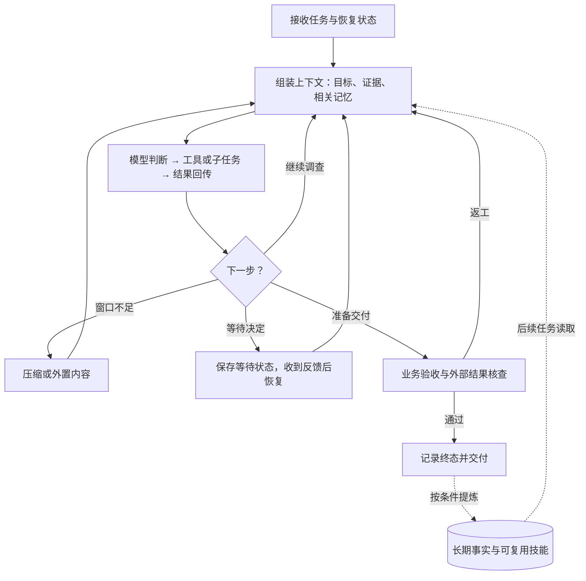
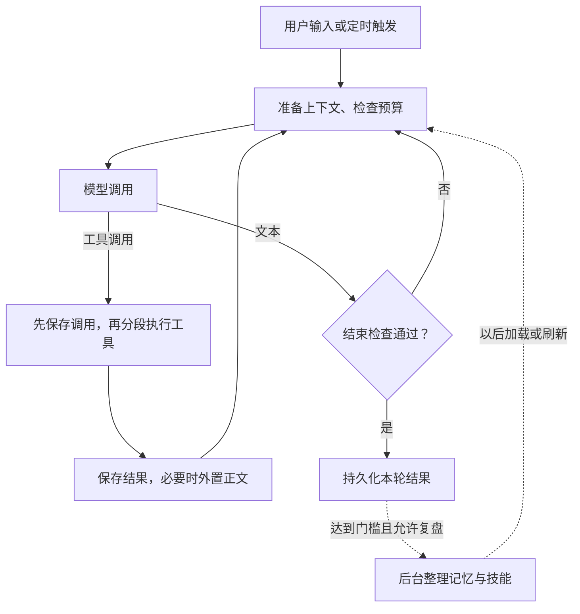
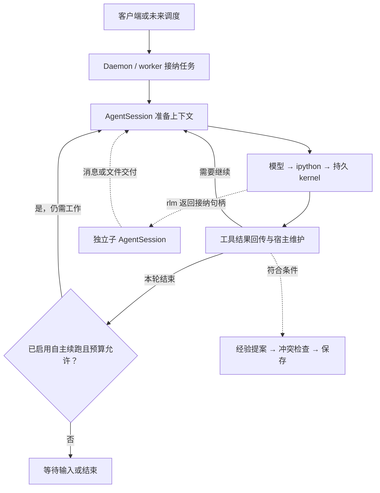
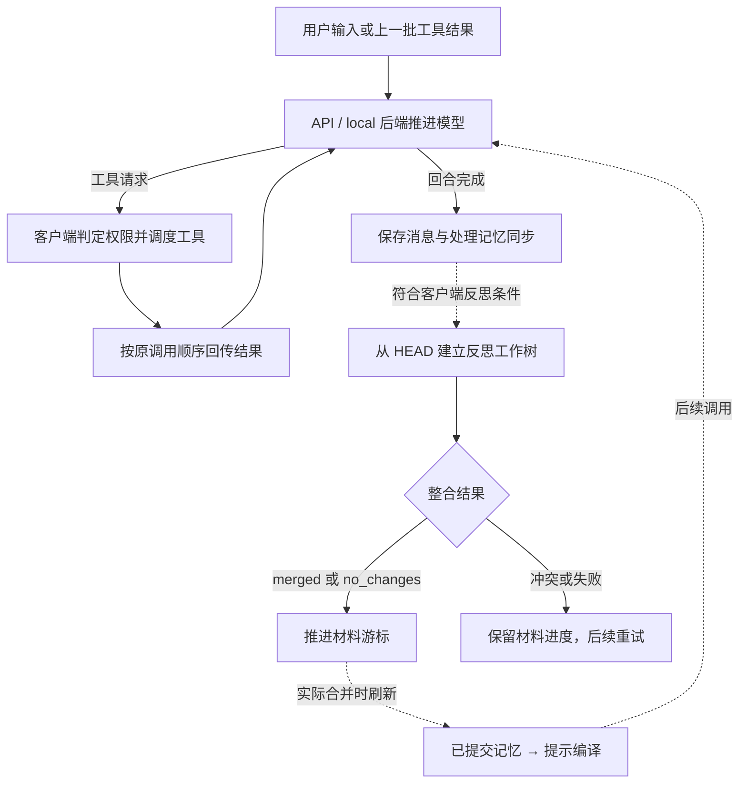
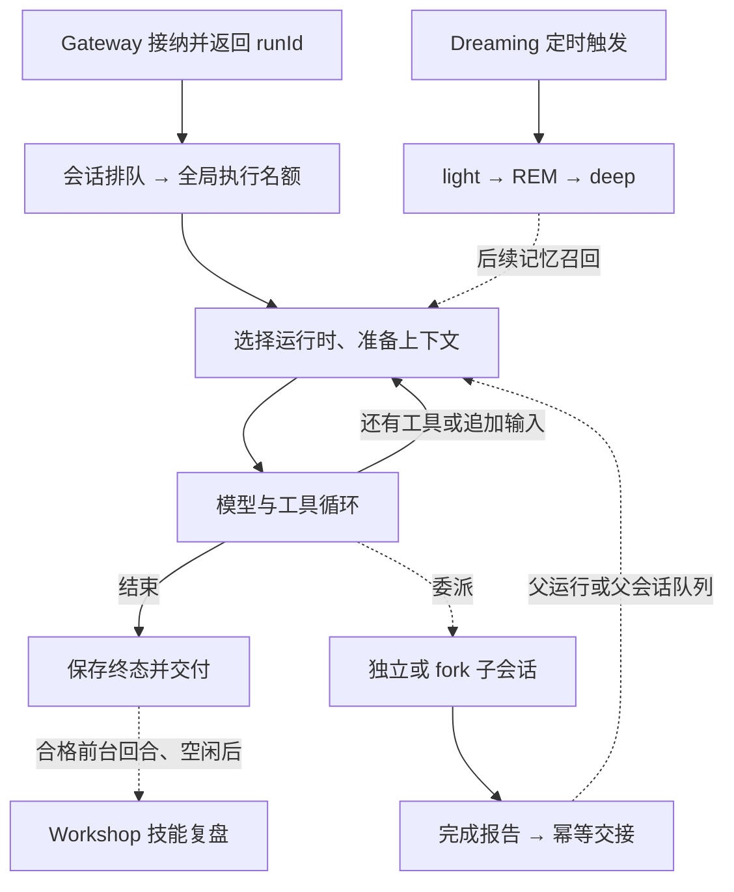
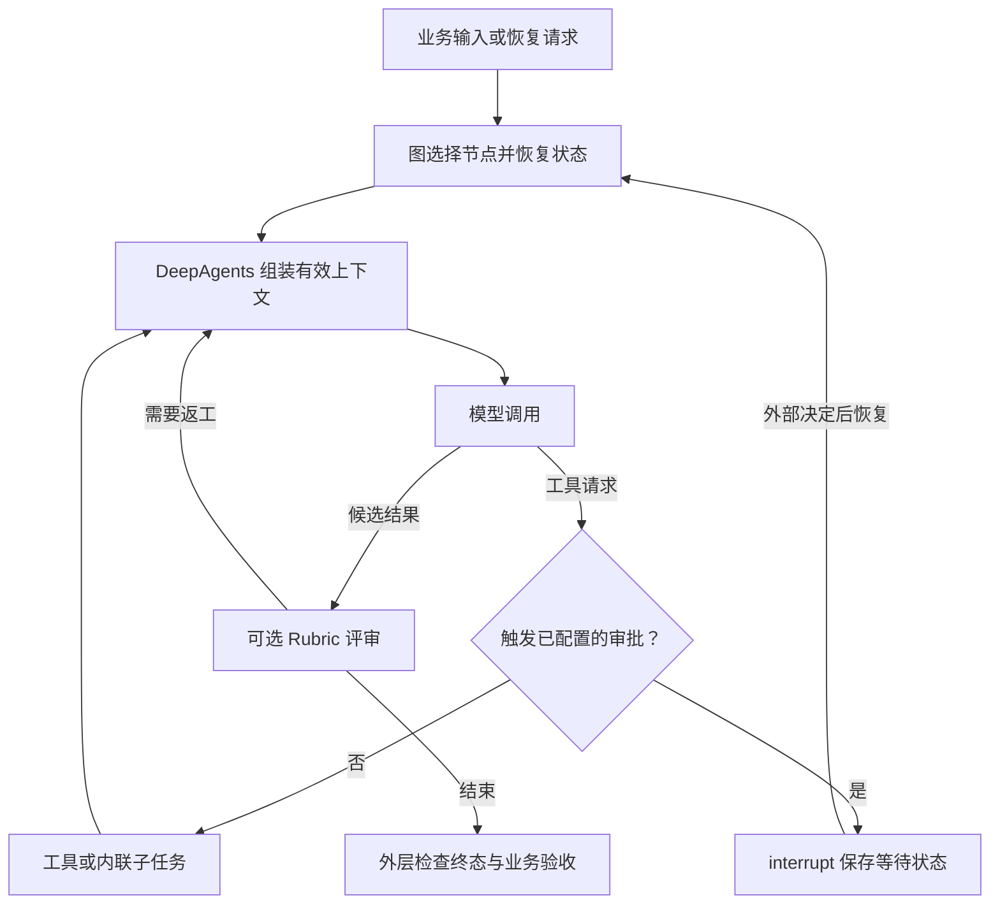
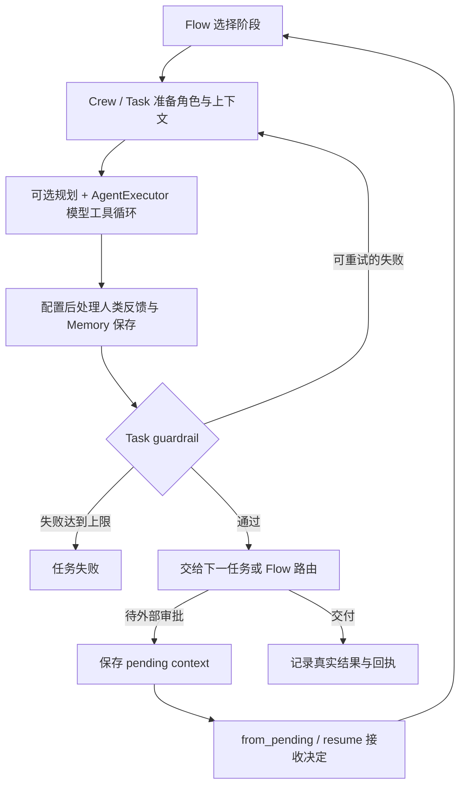
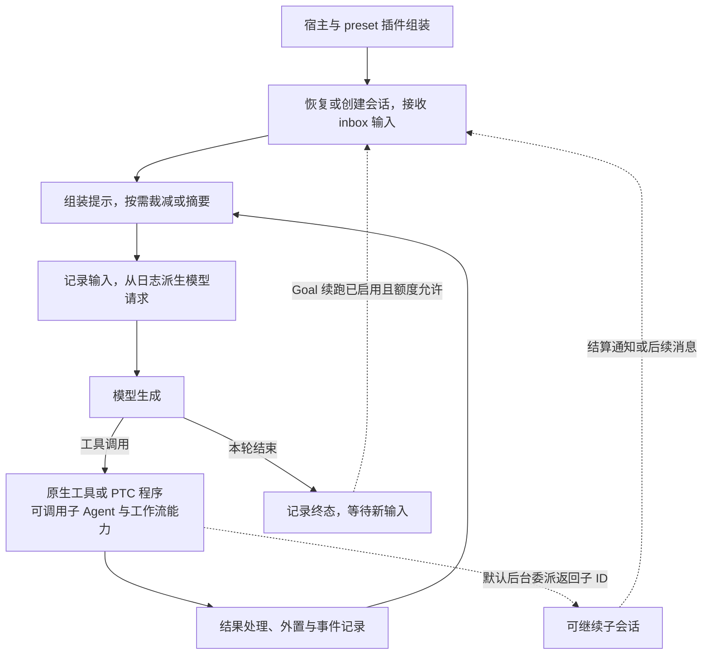

# 开源 Agent 实现调研

这份总览用于快速比较七组实现；具体调用链、默认参数和源码阅读路线放在各篇详解中。重点关注数字员工的四类能力：**自主学习、上下文管理、持久 Memory、Agent loop 与业务编排**。

版本基准沿用已有调研：前四组源码获取于 **2026-09-06**，LangGraph / DeepAgents 与 CrewAI 获取于 **2026-09-07**；DeepSeek Harness 新增于 **2026-09-09**。本文依据各自固定源码与官方资料整理，未运行项目或评测效果。

## 阅读入口

| 实现与详解 | 最值得研究的问题 | 主要层次 |
|---|---|---|
| [Hermes Agent](<Hermes Agent 设计与实现.md>) | 如何把任务经验整理成短记忆和技能？ | 个人助手运行系统 |
| [Prime Agent](<Prime Agent 设计与实现.md>) | 如何用代码组织材料、子任务与长期目标？ | REPL、经验库与任务宿主 |
| [Letta Code](<Letta Code 设计与实现.md>) | 如何让身份与记忆跨会话延续，并追踪变更？ | 会话执行与 Git 记忆 |
| [OpenClaw](<OpenClaw 设计与实现.md>) | 如何长期在线，接纳多入口任务并可靠交付？ | 网关、队列与助理运行系统 |
| [LangGraph / DeepAgents](<LangGraph 与 DeepAgents 设计与实现.md>) | 如何把自主执行放进可暂停、可恢复的业务图？ | 图运行时与 Agent 执行框架 |
| [CrewAI](<CrewAI 设计与实现.md>) | 如何将岗位角色、任务契约和审批组织成流程？ | 协作与业务编排框架 |
| [DeepSeek Harness](<DeepSeek Harness 设计与实现.md>) | 如何把循环、上下文、存储与编排拆成可替换插件？ | 插件化运行时与程序化编排 |

快速跳转：[七组机制](#hermes-agent) · [DeepSeek Harness](#deepseek-harness) · [记忆与恢复对照](#comparison) · [研究顺序](#reading-route) · [版本与术语](#versions)

## 先看职责，再看默认能力

下图是比较七组实现的职责模型，不是任何项目的默认调用链。虚线表示需要配置或按条件发生的动作。

| 要区分的概念 | 分别解决什么 |
|---|---|
| 上下文 / Memory | 当前怎么继续推理 / 以后还应知道什么 |
| Skill / 计划 | 可复用的做事方法 / 本次任务的步骤与依赖 |
| 历史 / 检查点 | 查找过去证据 / 恢复已保存的执行状态与进度 |
| 文本结束 / 业务完成 | 模型本轮停止生成 / 验收通过且真实交付成立 |
| 经验写入 / 学习有效 | 保存了变化 / 后续任务正确使用且效果得到验证 |

**比较口径：**“框架可以配置”不等于“产品默认启用”；以下常规学习路径修改外部记忆、技能或提示，未发现模型权重更新步骤。DeepSeek Harness 还开放运行能力创作，但所查标准组合未内置自动经验复盘闭环。

## Hermes Agent：前台做事，后台整理经验

| 维度 | 核心实现 |
|---|---|
| 自主学习 | 前台主动记忆；默认累计 10 个用户回合检查记忆复盘，10 次调用迭代检查技能复盘。 |
| 上下文 | 超长工具正文外置；摘要保留近期内容，旧消息仍可通过历史库搜索。 |
| Memory | `MEMORY.md`、`USER.md` 常驻短记忆；技能按需读取，通常按 profile 共享。 |
| Loop / 编排 | Python 循环推进模型与工具；工具分段并发，子任务和定时任务复用执行内核。 |

**关键边界：**自动复盘还要求最终回复、未中断且工具可用；记忆写盘不立即刷新所有提示快照。启用持久化时，调用或结果保存失败会阻止正常续跑；这仍不是外部操作的完整事务。

依据：[复盘触发][h-review]、[工具持久化][h-loop]、[提示刷新][h-prompt]。参数和完整失败路径见[详解](<Hermes Agent 设计与实现.md>)。

## Prime Agent：把计算状态、经验和生命周期分开

| 维度 | 核心实现 |
|---|---|
| 自主学习 | review 决定是否 refinement，再提出、检查并应用 prompt / memory / skill / subagent 条目修改。 |
| 上下文 | 数据留在 Python REPL；对话采用摘要与近期消息，JSONL 保留原始轨迹。 |
| Memory | 默认 session-local Harness；跨新会话需显式 global 写入，提示先展示有限概览。 |
| Loop / 编排 | 宿主管理模型循环；`ipython` 串行保护共享内核，独立子会话可并行。 |

**关键边界：**`await rlm()` 等待接纳，不是最终答案。Autonomous mode 默认关闭；Goal、当前续跑、未来唤醒各有机制。kernel 只做尽力快照，结果不明的修改命令不自动重放。

依据：[RLM 协议][p-rlm]、[长期任务策略][p-long]、[命令恢复][p-recovery]。快照限制与经验版本机制见[详解](<Prime Agent 设计与实现.md>)。

## Letta Code：用长期身份和 Git 管理记忆

| 维度 | 核心实现 |
|---|---|
| 自主学习 | 主动编辑记忆；客户端默认累计 25 步后在回合结束检查反思，候选修改进入独立工作树。 |
| 上下文 | 后端维护有效窗口；local 用摘要与保留消息更新当前集合，原始历史继续保留。 |
| Memory | 同一 Agent 的多条 conversation 共用 MemFS；local 从已提交 Git 版本编译提示。 |
| Loop / 编排 | 后端推进模型，客户端按权限执行本地工具并回传；同资源写入按序处理。 |

**关键边界：**默认是 API 后端，local 算法不能直接代表云端；云端接管自动反思后客户端不重复启动。文件修改、Git 提交、跨机器同步、进入提示是不同阶段，`no_changes` 也能表示本批材料已处理。

依据：[后端默认值][l-defaults]、[反思整合状态][l-merge-status]、[提示编译][l-compiler-refresh]。MemFS v1 / v2 与恢复协议见[详解](<Letta Code 设计与实现.md>)。

## OpenClaw：将长期在线与结果交付放在运行时之外

| 维度 | 核心实现 |
|---|---|
| 自主学习 | 默认 Dreaming 分阶段巩固事实；Workshop 按条件复盘、扫描并应用技能提案。 |
| 上下文 | 旧工具结果裁减、压缩前日记写入、对话摘要分别处理体积和连续性。 |
| Memory | Markdown 保存内容，SQLite 保存索引与状态；混合检索不足时可升级为 Active Memory。 |
| Loop / 编排 | Gateway 接纳请求，会话队列与全局额度协调执行，选定运行时负责模型循环。 |

**关键边界：**运行时决定哪些压缩与学习能力可用；Workshop 自动复盘排除已压缩回合等材料。计算完成不等于报告送达，等待超时也不取消底层任务；向量服务失败能否降级取决于配置方式。

依据：[运行协调][o-runtime]、[子结果交付][o-delivery]、[检索故障策略][o-fallback]。来源过滤、触发门槛和写入者校验见[详解](<OpenClaw 设计与实现.md>)。

## LangGraph / DeepAgents：业务图约束阶段，Agent 选择动作

| 维度 | 核心实现 |
|---|---|
| 自主学习 | 配置记忆文件后主动写入；后台巩固需另建流程，可选 Rubric 负责当前任务评审与返工。 |
| 上下文 | 大输出外置，摘要事件重建有效输入；增量消息通道减少检查点保存成本。 |
| Memory | Backend 决定文件去向，Checkpointer 保存 thread 进度，Store 支持跨 thread 知识。 |
| Loop / 编排 | LangGraph 管状态与路由；LangChain 建立基础循环，DeepAgents 装配执行中间件。 |

**关键边界：**默认不配置 checkpointer / store；`interrupt` 恢复从节点开头重跑。内联 `task` 等待完成，远端后台任务需另配；缓存可能延迟记忆更新可见性，Rubric 结束也不一定验收通过。

依据：[工厂组装][lg-assembly]、[中断语义][lg-interrupt]、[评审终态][lg-rubric-status]。存储、子任务与上下文策略见[详解](<LangGraph 与 DeepAgents 设计与实现.md>)。

## CrewAI：将角色协作、任务验收与业务流程分层

| 维度 | 核心实现 |
|---|---|
| 自主学习 | Memory 抽取事实，显式 human feedback 提炼规则，`train()` 生成可复用提示建议。 |
| 上下文 | Task 传递依赖输出；超限后摘要替换消息，保留 system 与用户文件附件。 |
| Memory | 统一 Memory 默认使用 LanceDB；Crew 默认关闭，普通 Flow 默认创建，但并非自动保存所有状态。 |
| Loop / 编排 | 默认 AgentExecutor 本身基于 Flow；Crew 组织任务，Flow 控制业务路由，可选规划调度依赖步骤。 |

**关键边界：**默认是新的 `experimental.AgentExecutor`，旧执行器已弃用；planning 默认关闭。自动 Memory 保存早于 Task 最终校验；此快照跨进程审批恢复后不会自动续接反馈提炼，需另设学习步骤。

依据：[默认执行器][c-executor-default]、[保存顺序][c-executor-entry]、[反馈恢复][c-feedback-resume]。持久化与学习路径见[详解](<CrewAI 设计与实现.md>)。

## DeepSeek Harness：插件化组装，让执行与上下文可以追溯

| 维度 | 核心实现 |
|---|---|
| 自主学习 | 显式编辑指令、技能或调用外部 Memory；Creator 支持临时插件创作与失败修复，未内置默认经验复盘闭环。 |
| 上下文 | 先外置超长结果，窗口有压力时先裁减再摘要；通过替换事件改变有效视图，保留原日志。 |
| Memory | JSONL 保存会话；文件指令与技能按范围加载；第三方 Memory MCP 示例默认关闭。 |
| Loop / 编排 | Cordis 组装服务与事件；原生循环、PTC 工具程序、workflow 子任务、Goal 与 Ralph 分别承担不同职责。 |

**关键边界：**PTC 默认每次新建 worker，不跨调用保留变量；会话日志不是跨任务知识库，外置原文也可能过期。resume 后 Goal 不自动重新启用；已记录调用但缺少持久结果时标记“结果未知”，涉及副作用时先核查外部状态。

依据：[循环与日志][d-loop]、[Memory 默认值][d-memory]、[PTC 运行时][d-ptc]、[Goal 恢复][d-goal]、[中断修复][d-repair]。模式差别、压缩策略与 Creator 见[详解](<DeepSeek Harness 设计与实现.md>)。

## 横向对照：经验何时可见，任务怎样恢复

### Memory 的作用域与可见时机

| 实现 | 复用范围 | 更新何时进入推理 |
|---|---|---|
| Hermes | 通常同一 profile | 短记忆在提示建立或刷新时加载；技能按需读取。 |
| Prime | session-local；显式 global 跨会话 | refinement 后重建概览；详情仍需主动读取。 |
| Letta Code | 同一 Agent 的多条 conversation | local 根据已提交 MemFS 版本编译；远端同步另行处理。 |
| OpenClaw | Agent 工作区；私聊召回受配置限制 | 记忆按预算注入或召回；技能更新由新会话加载。 |
| DeepAgents | thread 状态或调用方配置的 namespace | 文件更新后仍可能命中旧记忆、技能缓存，需明确刷新。 |
| CrewAI | 配置的 Crew / Flow scope 与后端 | 同一 Memory 的 recall 等待待写队列；不构成跨进程屏障。 |
| DeepSeek Harness | 指令 / 技能目录；另接 Memory 时由提供方定范围 | 指令按适用路径注入，技能正文按需重读；外部记忆需实际召回。 |

### 长期运行的三种不同承诺

| 实现 | 继续工作与委派 | 故障后重点核查 |
|---|---|---|
| Hermes | 子 Agent、定时执行 | 调用与结果是否持久化，卸载正文是否仍可读。 |
| Prime | 常驻 worker、句柄委派、可选续跑 | kernel 快照是否完整，命令是否处于结果不明状态。 |
| Letta Code | 会话后端与客户端交接 | 后端是否仍等待工具结果，记忆是否提交与同步。 |
| OpenClaw | 网关托管、异步子结果交付 | 活跃写入者、运行终态、报告送达状态。 |
| LangGraph / DeepAgents | 配置后的图检查点与中断恢复 | 哪些节点会重跑，外部操作是否已完成。 |
| CrewAI | state persistence、runtime checkpoint、pending feedback | 恢复的是字段还是进度，保存事件是否匹配。 |
| DeepSeek Harness | 事件日志恢复、可继续子会话、Goal / Ralph | 工具是否结果未知、Goal 是否启用续跑、spill 原文是否过期。 |

三种承诺分别是：**恢复当前任务、跨任务复用知识、在未来再次启动任务**。检查点、Memory 和调度器各负责一部分；外部系统的去重与真实回执仍需业务实现。上述对照依据各篇详解的固定版本，不表示每项机制默认启用。

## 面向数字员工的研究路线

| 主线 | 阅读顺序 | 每一步要回答的问题 |
|---|---|---|
| 业务编排 | LangGraph / DeepAgents → CrewAI | 状态和依赖怎样表达？角色、审批与验收怎样接入？ |
| 持续学习 | Hermes → Letta Code | 经验怎样提取与复用？候选记忆怎样版本化、整合与刷新？ |
| 长期运行 | Prime → OpenClaw | 任务如何托管？不确定结果、后续事件和异步交付怎样处理？ |
| 运行时扩展 | DeepSeek Harness，再对照 Prime | 插件如何替换？一次工具程序与持久 REPL 怎样保存状态？ |

这条路线按实现职责安排。可以共用“工单调查—方案—审批—执行—归档”场景，先打通业务状态与验收，再加入学习和多角色协作。

| 验证目标 | 最小实验 | 观察结果 |
|---|---|---|
| 知识跨任务可用 | 写入事实 → 新任务使用 → 纠正后再用 | 作用域、缓存刷新、新旧事实采用率。 |
| 经验提高表现 | 纠错任务 → 同类新样例，对比有无学习 | 是否读取技能、错误复发率、成本。 |
| 压缩后保留关键证据 | 早期埋入精确 ID 和约束，压缩后继续 | 原文能否找回，是否遗漏或猜测。 |
| 中断后正确交付 | 在工具后或审批时结束进程，再恢复 | 重跑、重复动作、子结果丢失。 |
| 反馈确实变成经验 | 对比直接反馈与 pending/resume | 是否提炼、保存完成、下次是否召回。 |
| 多角色有实际收益 | 注入失败、超时和分批子结果 | 汇合是否正确、验收是否有真实证据。 |
| 运行能力正确替换 | 更新一个插件或技能，再开启后续任务 | 注册是否清理、缓存是否刷新、临时状态是否被误当成持久状态。 |

所有实验均需固定模型、初始记忆和任务集；本文未执行这些实验。

## 版本与术语

固定源码版本（点击展开）

| 项目 | 固定 commit | 提交时间（Asia/Shanghai） |
|---|---|---|
| Hermes Agent | [245e48008fa8](https://github.com/NousResearch/hermes-agent/commit/245e48008fa814b3251f50755eb656bd9fb86cb1) | 2026-09-06 08:00:18 |
| Prime Agent | [9c54a35dac3a](https://github.com/PrimeIntellect-ai/prime-agent/commit/9c54a35dac3a2ad17910074d66664859ea175666) | 2026-09-06 03:12:41 |
| Letta Code | [701f2a536782](https://github.com/letta-ai/letta-code/commit/701f2a5367828847313876c735ade27b9df97689) | 2026-09-06 09:02:04 |
| OpenClaw | [047fdfe90fef](https://github.com/openclaw/openclaw/commit/047fdfe90fef01802d659eedb781cb410fcd6ccc) | 2026-09-06 11:06:22 |
| LangGraph · `1.2.11` | [81bf17b23123](https://github.com/langchain-ai/langgraph/commit/81bf17b23123e4ef8b9d5f49fa09a0122fc2edd1) | 2026-09-03 23:23:25 |
| DeepAgents · `0.7.13` | [07d2952d346d](https://github.com/langchain-ai/deepagents/commit/07d2952d346d81d06bd181db8c560a77f2b51bc8) | 2026-09-07 03:36:01 |
| LangChain · `1.4.0` | [fa942aec719a](https://github.com/langchain-ai/langchain/commit/fa942aec719abd92026dcb56cab8e50a38776611) | 2026-09-07 09:23:40 |
| CrewAI · `1.15.20` | [1f3e6113d75c](https://github.com/crewAIInc/crewAI/commit/1f3e6113d75cd12b2899943faffbc729130d200b) | 2026-09-07 18:57:15 |
| DeepSeek Harness · `0.1.5-alpha.1` | [5dda764ed3aa](https://github.com/deepseek-ai/deepseek-harness/commit/5dda764ed3aa172535a7967b06ff95d9cbfe536a) | 2026-09-08 23:25:45 |

LangChain 是 DeepAgents 基础循环的实现依据，不另计为一组项目。旧资料中的 Letta V1、OpenClaw QMD、CrewAI 多套旧 Memory 与旧执行器，都应与此处版本区分。

术语与证据范围（点击展开）

| 术语 | 本文含义 |
|---|---|
| Harness | 模型之外管理工具、状态、上下文和调度的运行代码。 |
| Agent loop | 反复执行模型推理、工具调用和结果回传的循环。 |
| Checkpointer | 保存执行状态与进度的组件；具体恢复语义依实现而异。 |
| Store / Backend | 跨任务数据接口 / 文件或执行环境的实现接口。 |
| Guardrail / Rubric | 任务结果的检查约束 / 可选模型评审标准；效果取决于输入证据。 |

源码能确认机制、默认值和分支存在；不能单凭这些推出召回率、学习收益或运行可靠性。各篇详解保留固定提交引用、例外条件与源码阅读路线。

[l-defaults]: https://github.com/letta-ai/letta-code/blob/701f2a5367828847313876c735ade27b9df97689/src/settings-manager.ts#L173-L198
[l-merge-status]: https://github.com/letta-ai/letta-code/blob/701f2a5367828847313876c735ade27b9df97689/src/agent/memory-worktree.ts#L208-L238
[l-compiler-refresh]: https://github.com/letta-ai/letta-code/blob/701f2a5367828847313876c735ade27b9df97689/src/backend/local/local-backend.ts#L930-L1011
[lg-assembly]: https://github.com/langchain-ai/deepagents/blob/07d2952d346d81d06bd181db8c560a77f2b51bc8/libs/deepagents/deepagents/graph.py#L861-L975
[lg-interrupt]: https://github.com/langchain-ai/langgraph/blob/81bf17b23123e4ef8b9d5f49fa09a0122fc2edd1/libs/langgraph/langgraph/types.py#L851-L871
[lg-rubric-status]: https://github.com/langchain-ai/deepagents/blob/07d2952d346d81d06bd181db8c560a77f2b51bc8/libs/deepagents/deepagents/middleware/rubric.py#L488-L508
[c-executor-default]: https://github.com/crewAIInc/crewAI/blob/1f3e6113d75cd12b2899943faffbc729130d200b/lib/crewai/src/crewai/agent/core.py#L379-L389
[c-executor-entry]: https://github.com/crewAIInc/crewAI/blob/1f3e6113d75cd12b2899943faffbc729130d200b/lib/crewai/src/crewai/experimental/agent_executor.py#L2874-L2923
[c-feedback-resume]: https://github.com/crewAIInc/crewAI/blob/1f3e6113d75cd12b2899943faffbc729130d200b/lib/crewai/src/crewai/flow/runtime/__init__.py#L1483-L1555
[h-review]: https://github.com/NousResearch/hermes-agent/blob/245e48008fa814b3251f50755eb656bd9fb86cb1/agent/turn_finalizer.py#L587-L616
[h-loop]: https://github.com/NousResearch/hermes-agent/blob/245e48008fa814b3251f50755eb656bd9fb86cb1/agent/turn_tool_round.py#L120-L160
[h-prompt]: https://github.com/NousResearch/hermes-agent/blob/245e48008fa814b3251f50755eb656bd9fb86cb1/agent/system_prompt.py#L650-L668
[p-rlm]: https://github.com/PrimeIntellect-ai/prime-agent/blob/9c54a35dac3a2ad17910074d66664859ea175666/packages/coding-agent/docs/rlm-runtime.md#L23-L60
[p-long]: https://github.com/PrimeIntellect-ai/prime-agent/blob/9c54a35dac3a2ad17910074d66664859ea175666/packages/coding-agent/docs/long-running-agents.md#L153-L214
[p-recovery]: https://github.com/PrimeIntellect-ai/prime-agent/blob/9c54a35dac3a2ad17910074d66664859ea175666/packages/coding-agent/docs/daemon.md#L133-L142
[o-runtime]: https://github.com/openclaw/openclaw/blob/047fdfe90fef01802d659eedb781cb410fcd6ccc/src/agents/embedded-agent-runner/run-orchestrator.ts#L192-L335
[o-delivery]: https://github.com/openclaw/openclaw/blob/047fdfe90fef01802d659eedb781cb410fcd6ccc/docs/tools/subagents.md#L105-L116
[o-fallback]: https://github.com/openclaw/openclaw/blob/047fdfe90fef01802d659eedb781cb410fcd6ccc/docs/concepts/memory-search.md#L122-L137

[d-loop]: https://github.com/deepseek-ai/deepseek-harness/blob/5dda764ed3aa172535a7967b06ff95d9cbfe536a/packages/core/agent-loop/src/agent.ts#L552-L617
[d-memory]: https://github.com/deepseek-ai/deepseek-harness/blob/5dda764ed3aa172535a7967b06ff95d9cbfe536a/docs/user/guide/mcp-memory.md#L5-L33
[d-ptc]: https://github.com/deepseek-ai/deepseek-harness/blob/5dda764ed3aa172535a7967b06ff95d9cbfe536a/packages/code-runtime/code-runtime-worker-thread/README.zh.md#L51-L79
[d-goal]: https://github.com/deepseek-ai/deepseek-harness/blob/5dda764ed3aa172535a7967b06ff95d9cbfe536a/packages/goal/goal-round-driver/README.zh.md#L47-L57
[d-repair]: https://github.com/deepseek-ai/deepseek-harness/blob/5dda764ed3aa172535a7967b06ff95d9cbfe536a/packages/core/session/src/repair.ts#L91-L133
