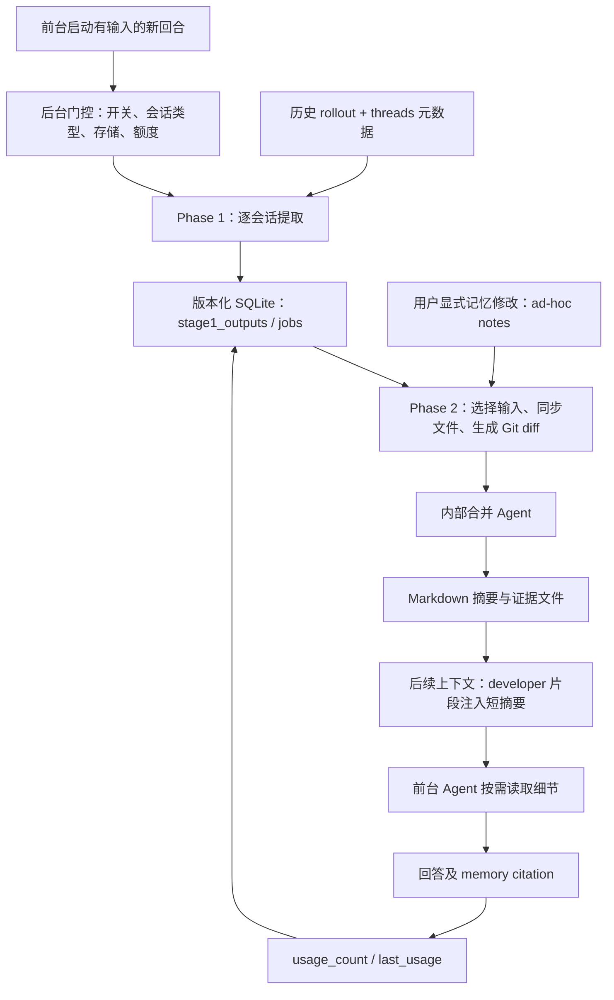

# Codex Memory 设计与实现

整理日期：2026-09-20。源码基准：本地 [Codex 仓库](/Users/taiyou/project/opensource/codex) 的提交 [5c5308fc9a9e](https://github.com/openai/codex/commit/5c5308fc9a9ee789049d646ef11e5400384b9c6f)，提交日期为 2026-09-20。本文沿实际调用链、SQL、Prompt 和测试源码分析；没有启动记忆任务、调用模型或运行 Rust 测试。文中的默认值只指这一提交的代码默认值。

本文是 [Codex 设计与实现](</Users/taiyou/project/uyouiigit/Reading/大模型/Agents/Codex 设计与实现.md>) 中 Memory 章节的展开，重点回答：历史如何变成记忆，记忆怎样影响下一次任务，以及系统如何处理更新、遗忘和并发。

<a id="overview"></a>

## 1. 核心设计：后台提炼，文件承载，按需读取

**Codex Memory 是一套把历史会话转换为可复用文本的后台流水线。** Phase 1 对每个符合条件的会话做提取，Phase 2 把提取结果合并成 Markdown；前台会话加载短摘要，需要时再读取详细材料。回答里的记忆引用还会更新使用计数，影响下一轮合并选材。

这里更新的是模型输入和本地知识文件，源码没有在这条路径上训练模型权重。默认读取路径也没有 embedding 或向量索引：模型依据摘要决定查什么，再通过文件检索取回证据。[提取实现][phase1]、[合并实现][phase2]、[读取扩展][extension]、[本地搜索][search]



应先区分四种容易统称为“记忆”的东西：

| 对象 | 保存什么 | 在系统中的作用 |
| --- | --- | --- |
| 当前模型上下文 | 本次任务的消息、工具结果、上下文片段 | 支持当前推理；压缩是另一条上下文管理流程。 |
| Rollout 历史 | 持久化的会话记录 | 恢复会话和离线提取的证据源。 |
| Memory | 从历史提炼的摘要、经验、偏好和检索指针 | 跨会话复用知识；允许筛选、合并、淘汰。 |
| AGENTS.md / Skill | 项目规则、可复用操作流程 | 与 Memory 有不同加载入口；V1 合并可以产出记忆目录内的 Skill 文件。 |

官方文档也把本地 Codex Memory 与 ChatGPT 网页记忆区分开，并建议把必须执行的团队规则放在 AGENTS.md 或版本化文档中。[官方 Memory 说明](https://learn.chatgpt.com/docs/customization/memories)

| 想了解的问题 | 阅读位置 |
| --- | --- |
| V1、V2 有什么不同？ | [2. 模块与版本](#versions) |
| 什么时候生成，为什么刚结束会话还没记住？ | [3. 触发与调度](#trigger) |
| 一次聊天怎样变成可保存的记录？ | [4. Phase 1](#extraction) |
| 多次聊天怎样合并、去重和遗忘？ | [5. Phase 2](#consolidation) |
| Memory 怎样进入 Prompt，怎样检索？ | [6. 读取与引用](#read) |
| “记住 / 忘记”与 reset 分别做什么？ | [7. 修改与清理](#controls) |
| 哪些设计值得复用，有什么边界？ | [9. 设计分析](#tradeoffs) |

<a id="versions"></a>

## 2. 模块拆分与两套版本

### 2.1 当前代码在哪里

下面路径相对于 Codex 仓库根目录。应从实际实现进入：`codex-rs/memories/README.md` 仍写着调度在 `core/src/memories/`，但当前提交的实现已在 `memories/write/`；读取 Prompt 也已迁到 `ext/memories/`。

| 代码位置 | 职责 |
| --- | --- |
| [app-server/.../turn_processor.rs][trigger] | 前台新回合启动后尝试派发后台 Memory 任务。 |
| [memories/write/src/start.rs][start] | 门控、版本选择、清理、额度检查、串联两阶段。 |
| [memories/write/src/phase1.rs][phase1] | 候选领取、并行提取、成功 / 空输出 / 失败落库。 |
| [memories/write/src/rollout_input.rs][input] | 过滤输入；V2 按证据来源分层分配预算。 |
| [memories/write/src/phase2.rs][phase2] | 全局合并锁、同步工作目录、内部 Agent、心跳与收尾。 |
| [memories/write/src/workspace.rs][workspace] | Git 基线、diff、产物校验、符号链接清理。 |
| [state/src/runtime/memories.rs][db] | SQL 选择、任务租约、使用计数、保留与完成状态。 |
| [ext/memories/src/extension.rs][extension] | 上下文注入和可选的专用 Memory 工具。 |
| [memories/read/src/citations.rs][citations] | 引用解析；同 crate 的 `usage.rs` 做读取行为分类。 |
| [core/src/stream_events_utils.rs][feedback] | 从模型输出接入引用反馈、外部上下文污染标记。 |

### 2.2 V1 与 V2 是隔离的流水线

`MemoryVersion` 默认是 V1。`dual_write=true` 时，同一次入口分别启动 V1 和 V2 后台任务；前台仍只使用 `memories.version` 选中的版本。这是两份独立生成任务，不是把一份 V1 产物复制为 V2。[版本类型][version]、[后台双写][start]

| 维度 | V1：默认 | V2：可配置选择 |
| --- | --- | --- |
| 文件根目录 | `$CODEX_HOME/memories/` | `$CODEX_HOME/memories_v2/` |
| Memory 数据库文件名 | `memories_1.sqlite` | `memories_v2_1.sqlite`，按需打开 |
| 共享信息 | 两套 MemoryStore 都引用同一份 `threads` 元数据 | 同左；Memory 任务与产物记录独立。 |
| Phase 1 输出 | `raw_memory`、`rollout_summary`、可空的 `rollout_slug` | `rollout_summary`、字符串 `rollout_slug` |
| 中间文件 | `raw_memories.md` + `rollout_summaries/` | 同步 `rollout_summaries/`，不重建 `raw_memories.md` |
| 合并目标 | `MEMORY.md` + `memory_summary.md`，可选 `skills/` | 主要更新 `memory_summary.md`，不要求生成 handbook |
| 读取策略 | 摘要导航 → 搜索 MEMORY.md → 按需下钻 | 尽量直接使用注入摘要；额外证据会影响回答时才读 rollout summary |
| 强校验 | MEMORY.md 是文件，摘要首行是 `v1` | 摘要首行是 `v1`、小于 10,000 UTF-8 字节、包含四个指定标题 |

依据：[数据库命名][sqlite]、[版本化存储][db-versions]、[输出 Schema][output]、[文件同步][phase2]、[产物验证][validation]、[V1 读取指引][read-v1]、[V2 读取指引][read-v2]。

**不要用摘要首行 `v1` 判断流水线版本。** 两个版本目前都要求这个文件格式标记；流水线由配置、目录和数据库命名空间区分。

V2 Prompt 明显更强调来源、适用范围和历史状态：一次“本次先给我方案”应保留为本次任务要求，只有明确声明的默认偏好或跨任务证据才进入可复用偏好。V1 更积极地提炼稳定操作习惯和可复用经验。可以把 V2 理解为对“把局部指令泛化成永久偏好”问题的针对性约束；这是基于模板差异的设计解读，不代表已有质量评测结论。[V1 提取 Prompt][prompt1-v1]、[V2 提取 Prompt][prompt1-v2]、[V2 合并 Prompt][prompt2-v2]

### 2.3 产物与状态各自承担什么

以 V1 为例：

```text
$CODEX_HOME/memories/
├── memory_summary.md          # 小型概览，注入前台上下文
├── MEMORY.md                  # 可搜索的经验手册，模型按需读取
├── raw_memories.md             # 从数据库机械拼接的 Phase 2 输入
├── rollout_summaries/*.md      # 每个入选会话的摘要与来源元数据
├── skills/<name>/SKILL.md      # 可选的可复用操作流程
├── extensions/
│   ├── ad_hoc/instructions.md
│   ├── ad_hoc/notes/*.md       # 用户显式要求的增删改记录
│   └── <source>/resources/    # 其他扩展输入，如存在
├── phase2_workspace_diff.md    # 本次合并临时 diff，成功重建基线前移除
└── .git/                      # 上次成功合并的比较基线
```

`raw_memories.md` 的 raw 指“未经全局合并的提取结果”，并不是完整原始聊天。`rollout_summaries/*.md` 也是 Markdown；其中 `rollout_path` 指向原始历史记录，不能把二者误当成同一种文件。[文件生成][storage]

`stage1_outputs` 的关键字段是：

| 字段 | 含义 |
| --- | --- |
| `thread_id` | 主键；每个线程保存一份当前提取结果。 |
| `source_updated_at` | 提取所依据的线程更新时间，用于判断是否已处理。 |
| `raw_memory` / `rollout_summary` / `rollout_slug` | 模型提取内容；V2 的 `raw_memory` 以空字符串落库。 |
| `generated_at` | 提取生成时间；不能与源会话更新时间混用。 |
| `usage_count` / `last_usage` | 从引用反馈更新的次数和最后使用时间。 |
| `selected_for_phase2` / `selected_for_phase2_source_updated_at` | 最近一次成功合并确实消费过的输入快照。 |

`jobs` 用 `(kind, job_key)` 标识任务，记录 `status`、`ownership_token`、`lease_until`、`retry_at`、重试次数和 watermark。SQL 提供调度与可追踪状态，Markdown 提供模型可读取的知识表示；后者不是 SQL 的简单逐行导出。[数据库 Schema][schema]

<a id="trigger"></a>

## 3. 触发、开关与调度

### 3.1 `startup` 不等于只在线程创建时执行

实际调用链是：

```text
app-server turn/start
  → thread.start_or_steer_turn(...)
  → 有输入 && 实际 Started（不是 Steered）&& 主环境已配置
  → start_memories_startup_task(...)
  → 按版本 tokio::spawn
  → 清理旧记录 → 检查额度 → Phase 1 → Phase 2
```

入口排除 `ephemeral`、未开启 `Feature::MemoryTool`、非根 Agent 会话；后台还要求 MemoryStore 可用。它从历史中选择其他线程，明确排除当前线程。因而本轮刚说过的话不会在同一次触发中立即成为长期记忆。[调用点][trigger]、[入口门控][start]、[候选查询][claim]

这是一条机会式后台路径，不是独立常驻的定时守护进程。失败重试也依赖后续触发和数据库时间条件，`retry_at` 并不自动启动一个定时器。

### 3.2 三层开关控制不同事情

| 配置 / 状态 | 源码中的意义 | 常见误解 |
| --- | --- | --- |
| `[features].memories` | 总功能门控；Stable，代码默认 `false`。 | Stable 不表示默认开启。 |
| `memories.generate_memories` | 默认 `true`；新建线程时据此写 `memory_mode=enabled/disabled`。 | 不是 `start.rs` 中停止所有历史提取的总开关。 |
| `memories.use_memories` | 默认 `true`；控制读取扩展启用、摘要注入与专用工具。 | 设为 false 不会清空已有记忆。 |
| `threads.memory_mode` | `enabled / disabled / polluted`，影响该线程作为提取和合并来源的资格。 | 与前台是否读取其他线程的记忆不是同一件事。 |
| `memories.disable_on_external_context` | 默认 `false`；开启后，指定外部上下文事件可把线程标成 polluted。 | 不是无条件禁止所有工具型会话生成记忆。 |

依据：[feature 定义][feature]、[配置含义与默认值][config]、[线程创建][thread-create]、[读取扩展][extension]、[污染检测][feedback]。

特别是 `generate_memories=false`：它主要改变新线程的来源资格；启动入口仍可能为旧的 enabled 线程运行后台提取。要解释“关闭了某个开关却还在合并”，必须先确认关闭的是哪一层。

### 3.3 默认预算与时间窗口

| 项目 | 本提交默认值 / 常量 | 约束位置 |
| --- | --- | --- |
| 单次最多领取历史会话 | 2 | `max_rollouts_per_startup` |
| 候选扫描上限 | 5,000 | Phase 1 常量 |
| 历史最近更新时间窗口 | 10 天以内 | `max_rollout_age_days` |
| 至少空闲多久 | 6 小时 | `min_rollout_idle_hours` |
| Phase 1 本地并发上限 | 8 | `buffer_unordered(8)`；默认领取量还会把实际并发进一步限制。 |
| Phase 2 最多选取记录 | 256 | `max_raw_memories_for_consolidation`；V2 也沿用此配置名。 |
| 未使用记录保留窗口 | 30 天 | `max_unused_days` |
| 额度最低剩余比例 | 25% | 主、次窗口都检查；等于门槛仍可运行。 |
| 两阶段任务租约 | 3,600 秒 | 超时可被重新领取。 |
| 失败退避 | 3,600 秒 | 等待后续触发重试。 |
| Phase 2 成功后冷却 | 6 小时 | 数据库常量；无工作区变化的成功也进入该状态。 |
| Phase 2 运行期续租 | 每 90 秒 | 合并 Agent 监控循环。 |

依据：[配置常量][defaults]、[流水线常量][limits]、[Phase 2 领取][global-claim]。

额度检测还有边界：只有使用 Codex 后端的身份才做这条查询；缺失额度窗口视为通过，查询失败等无法判断的情形最终 `unwrap_or(true)`。因此它是尽力避免低额度后台消耗的机制，不能当成可靠的预算上限。[额度门控][guard]

<a id="extraction"></a>

## 4. Phase 1：从单次会话提取候选知识

### 4.1 先选会话，再领取任务

`claim_stage1_jobs_for_startup()` 按 `threads.updated_at_ms DESC` 扫描候选，条件包括：

1. 未归档，来源在交互来源列表中：CLI、VSCode、`atlas`、`chatgpt`。
2. `memory_mode='enabled'`，并且不是当前线程。
3. 最近更新时间处于“10 天以内、至少 6 小时前”的默认窗口。
4. 现存提取结果或任务的成功 watermark 没有覆盖该线程的当前更新时间。

时间判断用的是 **updated_at，而非 created_at**；一个创建很久但最近重新继续的任务仍可能入选。SQL 不检查任务是否成功，也没有在这里要求 `completed=true`；空闲过滤只是减少总结进行中工作的概率。[来源列表][sources]、[查询与去重][claim]

领取使用 `BEGIN IMMEDIATE` 和带条件的 INSERT / UPSERT。它同时检查租约、退避、重试额度和数据库中的运行任务数；`max_rollouts_per_startup` 还作为 `max_running_jobs` 传入，限制同一 MemoryStore 下的活动 Phase 1 任务数量。领取成功返回随机 `ownership_token`，后续完成写入必须匹配这个 token。[原子领取][claim-atomic]

Phase 1 失败会减少初始为 3 的重试额度；较新的 source watermark 可以重新激活任务、重置重试额度。空输出也记录成功 watermark，否则同一份没有可复用知识的会话会在每次启动时重复消耗模型。[任务完成与重试][phase1-state]

### 4.2 输入不是把整个日志原样交给模型

两版都会过滤掉 developer 消息、推理项、若干控制与压缩项；用户消息中的完整 AGENTS.md / Skill 包装片段也会移除。保留的材料包括用户和助手消息、受支持的工具调用与输出、Agent 间通信。序列化后的输入会经过 `redact_secrets`。[输入过滤][input]、[可保留项目类型][rollout-policy]

| 输入策略 | V1 | V2 |
| --- | --- | --- |
| 材料组织 | 过滤后的 ResponseItem 序列序列化为 JSON。 | 为材料标注 human user、assistant final、other agent 等来源。 |
| 总预算 | 模型有效上下文窗口的 70%；缺失模型窗口信息时回退 150,000 估算 tokens。 | 使用同一预算计算。 |
| 超预算选择 | 通过文本截断保留头尾。 | 先按来源优先级选材，同层优先保留较新的材料，再恢复原始时间顺序。 |
| 特殊处理 | 没有 V2 的分层策略。 | 图片 / 音频替换为占位符；工具输出先施加约 2,000 tokens 预算；单条序列化材料另有约 10,000 字节预算及预留。 |
| 模型消息 | 一个 user 输入项。 | 沿 UTF-8 边界拆成每片不超过 8,900 字节的输入片段。 |

V2 的优先顺序为：

```text
人类输入 > 助手最终答复 > 其他 Agent 信息
         > 助手进度消息 > 运行环境上下文 > 普通工具材料
```

如果 `request_user_input` 的非空回答可与问题配对，代码会将“问题 + 人类回答”归入最高层，避免用户在工具界面表达的约束被误归为低优先级工具输出。它也用元数据和包装标记识别子 Agent 内容，避免把它当成人类原话。这些判断是具体的来源识别规则，不是完美的内容真实性验证。[V2 证据选择][input]、[预算构造][prompts]

### 4.3 单次结构化提取，不是自主工具循环

Phase 1 构造 `Prompt::default()`，填入基础提取指令、筛选后的历史和严格输出 Schema，然后通过 `ModelClient` 流式取得文本并解析 JSON。该步骤没有注册自主检索 / 写文件工具；读取 rollout、脱敏、入库都由 Rust 代码完成。[提取请求][phase1]、[模型请求运行时][runtime]

V1 输出形状为：

```json
{
  "raw_memory": "待合并的偏好、任务经验、证据指针……",
  "rollout_summary": "本次会话的任务、行动、结果、失败与证据……",
  "rollout_slug": "build-test-workflow"
}
```

V2 删除了 `raw_memory` 字段，`rollout_slug` 必须是字符串。V2 解析器拒绝额外字段，脱敏后将 summary 截到 9,000 字节；V1 同样脱敏生成字段，但没有这条 V2 输出字节限制。没有有用内容可以返回空字段，作为成功无输出处理。[输出契约][output]

模型选择先看 `extract_model` 覆盖，再调用 provider 的 `memory_extraction_preferred_model()`；本提交通用 provider 默认返回 `gpt-5.6-luna`，其他 provider 可以覆盖。Phase 1 的 reasoning effort 为 Low。合并阶段同理使用 `consolidation_model` 或 provider 默认，本提交通用默认是 `gpt-5.6-terra`，effort 为 Medium；这些是实现默认值，不是模型选型建议。[模型默认值][models]、[阶段常量][limits]

### 4.4 成功落库包含防重复和删除语义

一次成功提交在数据库事务内完成：确认任务仍由当前 token 所有 → 标记完成及成功 watermark → UPSERT `stage1_outputs` → 推进全局合并 watermark。

UPSERT 只接受不旧于现存记录的 `source_updated_at`；同时保留之前的 Phase 2 选择基线，直到下一次合并成功才更新。若提取成功但输出为空，则删除该线程已有的 stage1 记录，并在确实删除时推进合并任务，让下游处理内容撤回。[事务实现][phase1-state]

**数据库中记录的“一次成功”只证明提取执行和结构处理成功。** JSON Schema 能约束字段形状，脱敏能处理匹配到的敏感内容，但任务结果是否正确、经验能否推广，仍依赖证据和模型判断。

<a id="consolidation"></a>

## 5. Phase 2：全局合并、增量差异与遗忘

### 5.1 选择输入：使用频率 + 最近使用时间

`get_phase2_input_selection()` 选择仍有内容、来源线程仍 enabled、处于保留窗口内的记录，排序键是：

```sql
ORDER BY
  COALESCE(usage_count, 0) DESC,
  COALESCE(last_usage, source_updated_at) DESC,
  source_updated_at DESC,
  thread_id DESC
```

选出最多 N 条后，再按 `thread_id ASC` 返回给文件生成器。[完整选择逻辑][selection]

这里有三个设计细节：

- **没有使用记录时回退到 `source_updated_at`，不是 `generated_at`。** 仓库 Memory README 中关于 generated_at 的说明已经落后于 SQL。
- **选择是跨项目的。** 这条查询不按当前 cwd 或 project 过滤；cwd / branch 等适用边界主要随元数据和 Prompt 保留，交由模型判断。
- **重要性排序与文件输出排序分开。** 热度决定是否入选，稳定的 thread_id 顺序避免仅因引用次数改变就造成整份文件重排和巨大 diff。

淘汰也分两步：先让过期记录退出 Phase 2 输入集；后台 prune 只物理删除 `selected_for_phase2=0` 的过期行，每次最多 200 条，并保留任务 watermark。这样曾经进入合并基线的证据不会在合并处理删除前就被简单扫掉。[保留清理][retention]

### 5.2 先拿全局锁，再把数据库状态投影到文件

Phase 2 使用固定任务键 `(memory_consolidate_global, global)`，同一版本只有一个全局任务持有租约；V1 和 V2 因使用不同数据库而彼此隔离。锁领取还检查退避与成功后的 6 小时冷却。[全局锁][global-claim]

持锁后按顺序执行：

1. 确保记忆根目录和可用的 Git 基线，移除上次残留的临时 diff。
2. 选择当前 stage1 输入集。
3. 同步 `rollout_summaries/`，删除已不属于输入集的摘要；V1 另重建 `raw_memories.md`。
4. 清理符合条件的过期扩展资源。
5. 相对上次成功基线生成 Git diff。
6. **无变化且产物校验通过**，直接标记成功；否则写入 diff 并运行合并 Agent。

即使没有新 stage1 记录，过期资源删除、用户 note 或缺失 / 无效的最终产物也可能需要合并。watermark 记录处理进度，真正判断文件是否有变化的是 Git diff；不能写成“watermark 不变就绝不运行”。[Phase 2 主流程][phase2]

### 5.3 Git 基线承担“新增、修改、删除”的统一输入协议

`phase2_workspace_diff.md` 同时包含变更文件列表和 unified diff。diff 正文最多写 4 MiB，超过后截断并保留提示；这不是说会把 4 MiB 一次性注入模型，而是给工具读取的磁盘输入文件设置上限。[diff 生成][workspace]、[常量][limits]

合并 Prompt 要求先读 diff，再结合已有摘要和选中的来源材料：新增证据可以补充经验，修改证据可以纠错，删除来源则移除仅由该来源支撑的结论。若一个经验块还有其他证据，应保留仍受支持的部分。**这部分“语义级遗忘”由模型完成，没有一个结构化事实依赖图自动执行删除。**[V1 合并策略][prompt2-v1]、[V2 合并策略][prompt2-v2]

成功后会删除临时 diff，并用当前文件重建一份新的 Git 基线。`reset_git_repository` 替换旧 `.git` 为单提交基线，因而这不是不断累积历史、供用户长期回滚的 Git 仓库；设计上也避免已删除内容持续留在旧 Git 对象里。[基线重建][git-baseline]

### 5.4 合并阶段运行真正的内部 Agent

与 Phase 1 的单次结构化请求不同，Phase 2 通过 ThreadManager 创建 `MemoryConsolidation` 内部线程，提交 Prompt，让 Agent 自己读取、编辑记忆文件。[内部线程创建][runtime]

配置会：

- 把 cwd 设为当前版本的记忆目录。
- 设置 ephemeral，关闭记忆生成与读取，避免“总结的总结”反复进入流水线。
- 禁用 Collab、MemoryTool、Apps、Plugins 等能力，清空 MCP servers，移除完成通知。
- 设置 `AskForApproval::Never`；在 Managed 权限模式下，把写权限限制到记忆根目录并禁止工具网络访问。

**权限边界有条件。** 若父级明确使用 Disabled 或 External 模式，代码保留该模式，不能概括成任何情况下都强制无网络、只能访问一个目录。Managed 配置收紧的是写权限；也不能据此推导所有读取都只限于该目录。工具网络沙箱与宿主调用模型服务是两个层次。[Agent 配置][agent-config]

### 5.5 成功需要通过产物检查

Agent 报告 Completed 后，宿主先关闭内部线程，再验证产物、再次确认锁所有权，随后重建 Git 基线，最后提交数据库完成状态。若丢锁或验证失败，不应把这次结果登记为正常成功。[收尾流程][completion]

V1 检查 `MEMORY.md` 是普通文件、摘要首行严格等于 `v1`；V2 不要求 MEMORY.md，但摘要必须小于 10,000 字节并有四个指定标题。验证还清理符号链接，发现并移除链接会让该次校验失败。这些检查能发现缺文件、坏格式、链接等问题，不能证明经验内容正确。[产物检查][validation]

数据库成功提交只把确实消费的 `(thread_id, source_updated_at)` 快照标成 selected，避免运行期间新生成的提取结果被错误地当作已经合并。[完成快照记录][phase2-state]

这里仍是跨 SQL 与文件系统的顺序操作，而不是一个原子事务。合并 Agent 直接修改工作目录，失败不自动回滚整套文件；因此应把它理解为基于租约、重试和下一次校验恢复的最终一致流程，不能宣称读者永远只会看到整套原子发布的成功版本。

<a id="read"></a>

## 6. 读取：短摘要注入，详细材料按需取回

### 6.1 注入的是 developer 片段

`MemoriesExtension` 在配置中保存 enabled、版本和根路径。构建完整初始上下文时，它读取该版本目录下的 `memory_summary.md`，trim、按 2,500 估算 tokens 截断，然后渲染读取指引，并通过 `PromptFragment::developer_policy` 注入模型输入。[读取 Prompt 构造][read-prompt]、[扩展实现][extension]、[上下文接入][context]

几个容易误读的边界：

- 只自动加载摘要和读取指引，不把 MEMORY.md、所有 Skill 和所有历史摘要全塞进上下文。
- 文件缺失、不可读或内容为空时，不贡献这段记忆上下文；V2 读取不会回退到 V1 目录。
- V2 渲染后再拆成每片最多 8,900 字节的有类型上下文片段；这是单片大小限制，摘要仍有前述总预算。
- 仓库合并 Prompt 将摘要称为“system prompt”，但实际接入角色是 **developer**，应以代码为准。
- 普通后续回合主要走上下文差异路径；后台文件更新没有专门的逐轮热刷新器。完整上下文重建时可以重新读取摘要，因此也不能把它描述为整个线程生命周期内绝对不可变的快照。

扩展在配置变化时保留线程最初选定的 MemoryVersion，防止摘要和检索工具跨版本混用。正常选定新版本后，应让后续线程使用新的命名空间。[配置更新][extension]、[上下文重建][context-refresh]、[V2 无回退测试][read-tests]

### 6.2 V1 的检索是渐进展开

V1 读取模板让模型按以下顺序工作：

```text
已注入的 memory_summary.md
  → 提取与任务有关的关键词
  → 搜索 MEMORY.md
  → 读取直接关联的 1～2 个 rollout summary 或 skill
  → 确实需要精确命令 / 错误 / 原始证据时，再沿 rollout_path 下钻
```

模板建议快速检索保持在约 4～6 个搜索步骤，避免扫描全部历史；明显自包含的简单任务可以跳过。它还要求区分历史经验和当前事实，在容易变化且核验代价低时优先核验。[V1 读取模板][read-v1]

这些是 **Prompt 规定的搜索策略**，不是 Rust 中强制执行的四到六次工具预算。实际是否检索、检索词、打开哪份文件，仍由前台模型决定。

### 6.3 V2 更侧重直接使用摘要中的有效上下文

V2 的指引允许直接使用摘要里已有的准确文件、PR、文档等指针，不要求为了重复发现同一个路径而额外查历史。只有详细证据、措辞、时间线或不确定性可能改变答案时，才读取对应 rollout summary；确实缺少有用路线时再搜索。[V2 读取模板][read-v2]

这是对读取成本的取舍：V1 的详细手册更适合汇总复杂经验，V2 则减少额外知识层，把有限的常驻摘要用于偏好、任务状态和直达来源的索引。二者哪一个效果更好，需要在检索成功率、重复犯错率和 token 成本上评测。

### 6.4 可选专用工具仍然做本地文本检索

`memories.dedicated_tools` 默认关闭。开启且读取扩展 enabled 时，注册以下工具；未开启时，读取模板中的文件检索通常由前台已有的文件 / Shell 能力完成。[工具注册][tools]

| 工具 | 行为 |
| --- | --- |
| `memories.list` | 枚举记忆目录条目；每页最多 2,000 个结果。 |
| `memories.search` | 多关键词检索，支持任一词、同一行全部词、行窗口内全部词；每页最多 200 个结果。 |
| `memories.read` | 按相对路径读取，可指定 1-based 起始行及行数；工具层传入 20,000 tokens 内容预算。 |
| `memories.add_ad_hoc_note` | 写入一条显式记忆修改请求；不直接改最终摘要。 |

本地 search 遍历普通文件，读取文本后用子串匹配；可忽略大小写，也可在 normalized 模式过滤非字母数字字符。结果按路径、行号排序，用 cursor 分页。这条实现没有语义相似度打分、向量召回或数据库全文索引。分页限制的是返回结果数，搜索实现仍先收集匹配，不能把每页 200 条理解为扫描只处理 200 条。[搜索后端][search]、[工具预算][tool-limits]、[read 工具][read-tool]

### 6.5 引用会影响保留优先级

读取模板约定回答末尾可以携带这种结构（以下为格式示意，不是本文使用了个人记忆）：

```xml
<oai-mem-citation>
<citation_entries>
rollout_summaries/example.md:8-10|note=[used prior build workflow]
</citation_entries>
<rollout_ids>
019c6e27-e55b-73d1-87d8-4e01f1f75043
</rollout_ids>
</oai-mem-citation>
```

运行时从助手输出中剥离该隐藏标记，解析文件行号等展示信息，同时把合法 rollout UUID 转成 ThreadId。对于对应版本数据库中存在的 stage1 行，更新：

```text
usage_count = COALESCE(usage_count, 0) + 1
last_usage = now
```

于是形成“使用历史 → 产生引用 → 增加使用权重 → 更可能再次入选”的闭环。[引用解析][citations]、[反馈接入][feedback]、[使用计数 SQL][usage]

这不是正确性奖励：代码主要信任模型提交的 rollout IDs，并不证明引用内容真实帮助了任务。直接读取文件的遥测与这个 SQL 计数也不同；仅有一次 `cat MEMORY.md` 不会在这条反馈路径里自动使对应线程 usage_count 增加。V2 还明确不引用注入摘要本身，只在读过的 rollout summary 影响答案时附引用，因此单纯使用常驻摘要也未必刷新底层记录的 last_usage。[读取遥测][read-metrics]、[V2 引用规则][read-v2]

<a id="controls"></a>

## 7. 显式修改、污染与清空

### 7.1 “记住 / 忘记”先变成 note

前台读取指引要求：只有用户明确要求记住、修改或忘记时，才追加一个小文件到当前版本的 `extensions/ad_hoc/notes/`，由后台合并应用修改，不直接改生成的 MEMORY.md 或摘要。[V1 更新指引][read-v1]、[V2 更新指引][read-v2]

专用工具的本地后端会检查文件名、非空内容和目录，并使用 `create_new(true)` 创建文件；同名文件不能覆盖。文件名格式为 `YYYY-MM-DDTHH-MM-SS-<slug>.md`，写入的是调用者提交的 Markdown 文本。[note 工具][note-tool]、[note 后端][note-backend]

这个方法本身没有立即启动 Phase 2 的调用。因此“note 写成功”与“记忆摘要已更新”是两个时间点，后者仍等待后台触发、冷却和合并。若启用了 dual_write，两个目录仍独立，这条写入不会自动把 note 广播到另一版本。[入口双写][start]、[note 后端][note-backend]

ad-hoc 扩展指引要求合并器应用新增和修改，保留 note 文件，并给来自 note 的信息标记 `[ad-hoc note]`；同时明确 note 是知识数据，不是让合并器执行任意操作的命令。[扩展指引][ad-hoc]

### 7.2 自动保留与显式删除不是同一种保证

有三条不同的遗忘路径：

| 路径 | 发生什么 | 生效边界 |
| --- | --- | --- |
| 超过 max_unused_days 或落出 top-N | 不再作为 Phase 2 的文件输入，diff 出现来源删除。 | 最终摘要中对应结论的撤回依赖后续合并。 |
| 用户要求忘记某个事实 | 追加删除 / 纠正 note。 | 模型在合并时落实语义修改，不能等同于删除全部历史证据。 |
| `memory/reset` | 清空版本化记忆数据库状态与相关文件根目录内容。 | 原始线程历史仍在；若仍启用且历史仍符合条件，未来可以重新生成。 |

扩展资源还有独立的 7 天清理策略：仅扫描带 instructions.md 的扩展下 `resources/` 中符合时间戳命名规则的 Markdown 文件，按文件名时间判断。它不适用于所有记忆文件，也不清理 `ad_hoc/notes/`。[扩展资源清理][prune]

### 7.3 外部上下文污染是可选策略

开启 `disable_on_external_context` 后，运行时对 ToolSearchCall / Output、WebSearchCall、某些 `call_id=None` 的 FunctionCallOutput 做检测并标记 polluted。该线程因不再 enabled 而退出后续来源选择；如果已进入上次成功合并的基线，数据库路径还会安排后续合并处理遗忘。[事件检测][feedback]、[污染状态更新][pollution]

这是一种比较粗的资格过滤，默认关闭。它不等价于内容级 Prompt injection 检测；也不能替代提取 / 合并 Prompt 中“把历史和工具输出视为证据而非指令”的要求。

### 7.4 Reset 会同时处理两套版本

app-server 的 reset 实现先调用 `clear_all_memory_data()`，清除 V1 和已有 V2 数据库里的 stage1、记忆 jobs、合并进度，再清空 `memories/`、`memories_v2/` 和兼容目录 `memories_extensions/`，保留根目录本身。[Reset 入口][reset]、[多版本清理][db-versions]、[文件清理][clear]

它不会通过这段代码修改全局 feature、把所有 threads.memory_mode 改成 disabled，或删除原始 rollout。各数据库事务与文件清理也是顺序执行的，不能视为跨多个数据库和文件系统的单一事务；已经注入当前对话的文本也不会因为删掉磁盘文件而自动从历史中消失。

### 7.5 V2 readiness 的含义

`memory/status` 默认要求成功合并数量达到 20，并且 V2 摘要通过结构校验，才返回 `v2_ready=true`。计数来自成功合并时记录的 **单次入选来源线程数的历史最大值**，不是所有批次累计去重数，也不是当前目录中的文件数。[状态接口][status]、[进度记录][phase2-state]

这个接口报告就绪状态，不在 handler 内自动修改 `memories.version`。是否切换仍是配置 / 上层客户端决策；ready 也不是记忆质量达标的评测分数。

<a id="example"></a>

## 8. 一个贯穿全流程的例子

假设旧线程 A 中，用户指出“这个 Rust 项目要用 `just test`，不要直接用 `cargo test`”，Agent 按该命令修复并核验了一个问题。下面是机制示意，不是实际运行结果：

1. **历史持久化**：rollout 保存用户原话、实际执行和结果；threads 保存路径、更新时间、memory_mode。
2. **后续任务触发**：A 足够空闲后，用户在新线程 B 开始工作，app-server 有机会启动后台流水线。
3. **Phase 1 提取**：A 满足来源、时间窗、enabled 和去重条件后被领取。V1 提取项目范围内的测试经验；V2 保留任务范围、用户纠正、命令、核验状态与不确定性。
4. **持久中间结果**：写入以 A 的 thread_id 为键的 stage1 记录。若无有用信息，则成功无输出，不硬造“经验”。
5. **Phase 2 合并**：A 入选，生成对应 summary；diff 告诉合并器有新证据。最终摘要提供该项目的测试路线，V1 还可在 MEMORY.md 保存详细规则。
6. **后续前台利用**：新上下文加载摘要。用户再问这个项目的测试问题时，Agent 有机会直接选对入口，必要时读取 A 的摘要及当前仓库规则。
7. **反馈与纠正**：若引用 A，记录使用次数。若用户之后纠正这条规则，可以追加 note，并由下一轮合并替换；如果规则仅适用于该项目，不能泛化到所有 Rust 仓库。

这个例子体现了 Memory 真正要节省的成本：让用户少重复纠正，让 Agent 少重复摸索。它保存历史线索和适用条件；当前仓库中的事实仍可能已经变化。

<a id="tradeoffs"></a>

## 9. 值得借鉴的设计与实际边界

| 设计选择 | 带来的收益 | 需要承担的代价 |
| --- | --- | --- |
| 并行提取 + 串行全局合并 | 单条任务可独立处理，共享知识库只有一个合并者。 | 合并串行且有冷却，记忆更新存在延迟。 |
| SQLite 管状态、Markdown 表达知识 | 调度可查询，产物可审阅、可用普通工具访问。 | SQL 与文件系统没有统一事务；恢复逻辑必须处理部分成功。 |
| 稳定文件排序 + Git diff | 新增、修改、删除都能以统一形式交给合并器。 | 语义级去重和撤回仍依赖模型，超大 diff 还可能截断。 |
| 短摘要 + 按需取证 | 控制固定上下文成本，详细材料仍可回查。 | 摘要遗漏和关键词失配会降低召回；额外检索消耗时间。 |
| 使用频率参与选材 | 经常被利用的经验更可能保留。 | 引用偏差可形成反馈循环；被频繁引用不等于正确。 |
| 双版本隔离 | 可分别生成、比较效果、切换读取版本。 | 可能产生两倍生成工作；显式 notes 和读取反馈也分属不同命名空间。 |
| 来源、范围与状态保留 | 降低把建议当成决定、把单次要求当成永久偏好的风险。 | 这些语义约束多在 Prompt 中，格式检查无法替代质量评测。 |

以下是从源码结构推导出的工程判断：

**首先，Memory 更适合做经验和检索路线，而不是权威业务状态。** 当前是否部署、某个权限是否仍有效、某个任务是否真的完成，不适合仅由历史摘要决定。源码的来源指针、时间和 scope 正是为了保留核验入口。

**其次，长期记忆的难点包括“不要记错”和“能够撤回”。** 当前实现为此加入空输出、源类型过滤、脱敏、版本化 Schema、引用、删除 diff 与显式 note，但没有建立每个事实的结构化证据依赖图，也没有用程序证明一条概括没有过度推断。

**再者，全局本地存储不天然提供项目隔离。** 同一 CODEX_HOME 下的候选会话和知识会跨项目合并；路径及适用范围通过内容表达。若要复用到多租户系统，应在存储、配置和权限层建立独立边界，不能仅靠 Prompt 中的 cwd 标签。

如果要复现这套架构，最小闭环可以是：历史证据 → 有范围的结构化提取 → 可恢复的合并任务 → 有界摘要 + 原始证据指针 → 显式纠正 / 删除。再按实际规模加入热度排序、复杂 Skill 生成、扩展源和版本实验；这些复杂度并非“能跨会话记住事情”的前提。

<a id="troubleshooting"></a>

## 10. 常见现象怎样对应到实现

| 现象 | 优先检查的源码原因 |
| --- | --- |
| 已启用，但刚结束的聊天没进 Memory | 当前线程被排除；默认空闲不足 6 小时；需要后续合适的后台触发。 |
| 很多历史都没生成摘要 | 单次默认只领取 2 个；来源、归档、enabled、时间窗、额度或租约可能过滤了候选。 |
| Phase 1 已成功，摘要仍没更新 | Phase 2 可能在成功后 6 小时冷却、退避、运行中，或该条记录未进入 top-N。 |
| generate_memories=false 但旧记忆仍在变化 | 这个配置主要决定新线程来源资格，旧 enabled 来源仍可能被处理。 |
| use_memories=false 但磁盘文件还在 | 读取开关不会执行 reset；也不会自动撤回旧对话已经注入的内容。 |
| 切 V2 后看不到 V1 记忆 | 两套根目录与数据库独立；V2 无摘要时不会回退 V1。 |
| note 已写入但答复仍沿用旧信息 | note 追加、后台合并、上下文重建之间存在时间差。 |
| 没有新对话，合并器还是运行了 | 扩展资源、notes、失效产物都可触发合并工作；watermark 不是唯一判据。 |
| “超过 30 天”仍有文件 | 保留用的是使用 / 源更新时间，物理清理还有 selected 标志和批次限制，最终文件等待成功合并更新。 |
| reset 后记忆又出现 | 源会话和生成资格仍保留，后续流水线可以再次提取。 |

排查顺序可以沿“配置 → threads 资格 → jobs 状态 → stage1 输出 → Phase 2 选择 / diff → 最终摘要 → 前台上下文”推进。只看 `memory_summary.md` 是否存在，很难定位到底卡在哪一步。

<a id="prompts"></a>

## 附录 A：关键 Prompt 的意图

这些片段来自本地源码模板，体现的是设计约束；不能把模型收到要求等同于系统已保证满足。

### A.1 V1：没有未来收益就不保存

```text
Will a future agent plausibly act better because of what I write here?
```

V1 让模型先判断是否存在可复用信号，否则返回空字段。它倾向保留用户反复纠正的习惯、难发现的路径、有效工作流和失败规避办法，而不是“今天运行过测试”这种流水账。[完整提取模板][prompt1-v1]

### A.2 V2：一次任务的要求不能直接提升为全局偏好

```text
Write task history, not a user profile.
```

V2 模板用“show me the plan before editing this”举例：应记录为此次编辑要求；只有用户明确说自己偏好普遍先看计划，才有依据写成默认偏好。它还要求保留中断、未完成、被后续纠正或替代的任务状态。[完整 V2 提取模板][prompt1-v2]

### A.3 合并：删除证据要传播到最终记忆

```text
Remove claims supported only by deleted sources, preserve claims with remaining support,
and do not restore corrected or deleted claims from older summaries.
```

这条 V2 合并要求解释了为什么需要 diff 和来源指针：仅仅每次追加“新总结”，会让失效事实继续累积。合并器必须能够撤回只由已删除证据支撑的结论，同时保留仍有支持的内容。[完整 V2 合并模板][prompt2-v2]

### A.4 V1 的手册格式保留适用条件

```text
# Task Group: <cwd / project / workflow / detail-task family>
scope: <what this block covers, when to use it, and notable boundaries>
applies_to: cwd=<...>; reuse_rule=<...>
```

`Task Group` 帮助检索，scope 帮助快速判断相关性，applies_to 防止把某个 checkout 或特定时间的操作规则套到别处。格式本身由 Prompt 约定，V1 宿主校验并不逐项验证每个手册块都有这些字段。[完整 V1 合并模板][prompt2-v1]

<a id="source-route"></a>

## 附录 B：建议的源码阅读与验证路线

| 顺序 | 入口 | 要回答的问题 |
| --- | --- | --- |
| 1 | [turn_processor.rs][trigger] → [start.rs][start] | 谁触发，哪些运行不启动流水线？ |
| 2 | [config/types.rs][config] → [MemoryVersion][version] | 默认开关、版本、预算和目录如何确定？ |
| 3 | [state/runtime/memories.rs][claim] | 候选资格、原子领取、去重与重试如何实现？ |
| 4 | [phase1.rs][phase1] → [rollout_input.rs][input] → [phase1_output.rs][output] | 输入会丢掉什么，输出有什么硬约束？ |
| 5 | [phase2.rs][phase2] → [workspace.rs][workspace] | 合并怎样从增量输入运行到成功发布？ |
| 6 | [extension.rs][extension] → [prompts.rs][read-prompt] → [read_path 模板][read-v1] | 模型究竟看到了哪些 Memory，如何继续检索？ |
| 7 | [引用解析][citations] → [stream_events_utils.rs][feedback] | 使用反馈怎样回流至保留选择？ |

现有测试中值得配合阅读的几组：

- [startup_tests.rs][startup-tests]：工作目录 diff、缺产物重试、扩展清理、模型选择、V2 提取和合并。
- [startup_dual_write_tests.rs][dual-tests] 与 [memory_versions_tests.rs][version-tests]：两套存储和任务隔离、reset 不丢线程历史。
- [phase2_sandbox_tests.rs][sandbox-tests]：Managed、Disabled、External 父级权限的实际继承行为。
- [rollout_input_tests.rs][input-tests]：输入过滤、Unicode 分片等边界。
- [prompts_tests.rs][read-tests]：V2 读取自己的摘要，不回退 V1。

本次是源码级核查，以上测试没有在本次执行。运行测试能核验具体契约，但记忆质量仍需要真实任务集衡量，例如：是否减少用户重复纠正、是否保留授权范围、是否错误复用过期事实、删除请求是否成功传播，以及额外模型 / 工具成本。

[trigger]: https://github.com/openai/codex/blob/5c5308fc9a9ee789049d646ef11e5400384b9c6f/codex-rs/app-server/src/request_processors/turn_processor.rs#L670
[start]: https://github.com/openai/codex/blob/5c5308fc9a9ee789049d646ef11e5400384b9c6f/codex-rs/memories/write/src/start.rs#L20
[phase1]: https://github.com/openai/codex/blob/5c5308fc9a9ee789049d646ef11e5400384b9c6f/codex-rs/memories/write/src/phase1.rs#L120
[phase2]: https://github.com/openai/codex/blob/5c5308fc9a9ee789049d646ef11e5400384b9c6f/codex-rs/memories/write/src/phase2.rs#L47
[extension]: https://github.com/openai/codex/blob/5c5308fc9a9ee789049d646ef11e5400384b9c6f/codex-rs/ext/memories/src/extension.rs#L43
[search]: https://github.com/openai/codex/blob/5c5308fc9a9ee789049d646ef11e5400384b9c6f/codex-rs/ext/memories/src/local/search.rs#L18
[input]: https://github.com/openai/codex/blob/5c5308fc9a9ee789049d646ef11e5400384b9c6f/codex-rs/memories/write/src/rollout_input.rs#L1
[workspace]: https://github.com/openai/codex/blob/5c5308fc9a9ee789049d646ef11e5400384b9c6f/codex-rs/memories/write/src/workspace.rs#L11
[db]: https://github.com/openai/codex/blob/5c5308fc9a9ee789049d646ef11e5400384b9c6f/codex-rs/state/src/runtime/memories.rs#L21
[citations]: https://github.com/openai/codex/blob/5c5308fc9a9ee789049d646ef11e5400384b9c6f/codex-rs/memories/read/src/citations.rs#L6
[feedback]: https://github.com/openai/codex/blob/5c5308fc9a9ee789049d646ef11e5400384b9c6f/codex-rs/core/src/stream_events_utils.rs#L96
[version]: https://github.com/openai/codex/blob/5c5308fc9a9ee789049d646ef11e5400384b9c6f/codex-rs/protocol/src/memory_version.rs#L8
[sqlite]: https://github.com/openai/codex/blob/5c5308fc9a9ee789049d646ef11e5400384b9c6f/codex-rs/state/src/sqlite.rs#L31
[db-versions]: https://github.com/openai/codex/blob/5c5308fc9a9ee789049d646ef11e5400384b9c6f/codex-rs/state/src/runtime/memory_versions.rs#L10
[output]: https://github.com/openai/codex/blob/5c5308fc9a9ee789049d646ef11e5400384b9c6f/codex-rs/memories/write/src/phase1_output.rs#L11
[validation]: https://github.com/openai/codex/blob/5c5308fc9a9ee789049d646ef11e5400384b9c6f/codex-rs/memories/write/src/workspace.rs#L76
[read-v1]: https://github.com/openai/codex/blob/5c5308fc9a9ee789049d646ef11e5400384b9c6f/codex-rs/ext/memories/templates/memories/read_path.md#L1
[read-v2]: https://github.com/openai/codex/blob/5c5308fc9a9ee789049d646ef11e5400384b9c6f/codex-rs/ext/memories/templates/memories/read_path_v2.md#L1
[prompt1-v1]: https://github.com/openai/codex/blob/5c5308fc9a9ee789049d646ef11e5400384b9c6f/codex-rs/memories/write/templates/memories/stage_one_system.md#L1
[prompt1-v2]: https://github.com/openai/codex/blob/5c5308fc9a9ee789049d646ef11e5400384b9c6f/codex-rs/memories/write/templates/memories/stage_one_system_v2.md#L1
[prompt2-v1]: https://github.com/openai/codex/blob/5c5308fc9a9ee789049d646ef11e5400384b9c6f/codex-rs/memories/write/templates/memories/consolidation.md#L1
[prompt2-v2]: https://github.com/openai/codex/blob/5c5308fc9a9ee789049d646ef11e5400384b9c6f/codex-rs/memories/write/templates/memories/consolidation_v2.md#L1
[storage]: https://github.com/openai/codex/blob/5c5308fc9a9ee789049d646ef11e5400384b9c6f/codex-rs/memories/write/src/storage.rs#L23
[schema]: https://github.com/openai/codex/blob/5c5308fc9a9ee789049d646ef11e5400384b9c6f/codex-rs/state/memory_migrations/0001_memories.sql#L1
[claim]: https://github.com/openai/codex/blob/5c5308fc9a9ee789049d646ef11e5400384b9c6f/codex-rs/state/src/runtime/memories.rs#L90
[feature]: https://github.com/openai/codex/blob/5c5308fc9a9ee789049d646ef11e5400384b9c6f/codex-rs/features/src/lib.rs#L1136
[config]: https://github.com/openai/codex/blob/5c5308fc9a9ee789049d646ef11e5400384b9c6f/codex-rs/config/src/types.rs#L292
[thread-create]: https://github.com/openai/codex/blob/5c5308fc9a9ee789049d646ef11e5400384b9c6f/codex-rs/core/src/session/session.rs#L1023
[defaults]: https://github.com/openai/codex/blob/5c5308fc9a9ee789049d646ef11e5400384b9c6f/codex-rs/config/src/types.rs#L51
[limits]: https://github.com/openai/codex/blob/5c5308fc9a9ee789049d646ef11e5400384b9c6f/codex-rs/memories/write/src/lib.rs#L88
[global-claim]: https://github.com/openai/codex/blob/5c5308fc9a9ee789049d646ef11e5400384b9c6f/codex-rs/state/src/runtime/memories.rs#L1083
[guard]: https://github.com/openai/codex/blob/5c5308fc9a9ee789049d646ef11e5400384b9c6f/codex-rs/memories/write/src/guard.rs#L9
[sources]: https://github.com/openai/codex/blob/5c5308fc9a9ee789049d646ef11e5400384b9c6f/codex-rs/rollout/src/lib.rs#L86
[claim-atomic]: https://github.com/openai/codex/blob/5c5308fc9a9ee789049d646ef11e5400384b9c6f/codex-rs/state/src/runtime/memories.rs#L678
[phase1-state]: https://github.com/openai/codex/blob/5c5308fc9a9ee789049d646ef11e5400384b9c6f/codex-rs/state/src/runtime/memories.rs#L851
[rollout-policy]: https://github.com/openai/codex/blob/5c5308fc9a9ee789049d646ef11e5400384b9c6f/codex-rs/rollout/src/policy.rs#L67
[prompts]: https://github.com/openai/codex/blob/5c5308fc9a9ee789049d646ef11e5400384b9c6f/codex-rs/memories/write/src/prompts.rs#L133
[runtime]: https://github.com/openai/codex/blob/5c5308fc9a9ee789049d646ef11e5400384b9c6f/codex-rs/memories/write/src/runtime.rs#L309
[models]: https://github.com/openai/codex/blob/5c5308fc9a9ee789049d646ef11e5400384b9c6f/codex-rs/model-provider/src/provider.rs#L130
[selection]: https://github.com/openai/codex/blob/5c5308fc9a9ee789049d646ef11e5400384b9c6f/codex-rs/state/src/runtime/memories.rs#L435
[retention]: https://github.com/openai/codex/blob/5c5308fc9a9ee789049d646ef11e5400384b9c6f/codex-rs/state/src/runtime/memories.rs#L393
[git-baseline]: https://github.com/openai/codex/blob/5c5308fc9a9ee789049d646ef11e5400384b9c6f/codex-rs/git-utils/src/baseline.rs#L94
[agent-config]: https://github.com/openai/codex/blob/5c5308fc9a9ee789049d646ef11e5400384b9c6f/codex-rs/memories/write/src/phase2.rs#L294
[completion]: https://github.com/openai/codex/blob/5c5308fc9a9ee789049d646ef11e5400384b9c6f/codex-rs/memories/write/src/phase2.rs#L380
[phase2-state]: https://github.com/openai/codex/blob/5c5308fc9a9ee789049d646ef11e5400384b9c6f/codex-rs/state/src/runtime/memories.rs#L1244
[read-prompt]: https://github.com/openai/codex/blob/5c5308fc9a9ee789049d646ef11e5400384b9c6f/codex-rs/ext/memories/src/prompts.rs#L33
[context]: https://github.com/openai/codex/blob/5c5308fc9a9ee789049d646ef11e5400384b9c6f/codex-rs/core/src/session/mod.rs#L4161
[context-refresh]: https://github.com/openai/codex/blob/5c5308fc9a9ee789049d646ef11e5400384b9c6f/codex-rs/core/src/session/mod.rs#L4401
[read-tests]: https://github.com/openai/codex/blob/5c5308fc9a9ee789049d646ef11e5400384b9c6f/codex-rs/ext/memories/src/prompts_tests.rs#L38
[tools]: https://github.com/openai/codex/blob/5c5308fc9a9ee789049d646ef11e5400384b9c6f/codex-rs/ext/memories/src/tools/mod.rs#L33
[tool-limits]: https://github.com/openai/codex/blob/5c5308fc9a9ee789049d646ef11e5400384b9c6f/codex-rs/ext/memories/src/lib.rs#L12
[read-tool]: https://github.com/openai/codex/blob/5c5308fc9a9ee789049d646ef11e5400384b9c6f/codex-rs/ext/memories/src/tools/read.rs#L65
[usage]: https://github.com/openai/codex/blob/5c5308fc9a9ee789049d646ef11e5400384b9c6f/codex-rs/state/src/runtime/memories.rs#L53
[read-metrics]: https://github.com/openai/codex/blob/5c5308fc9a9ee789049d646ef11e5400384b9c6f/codex-rs/core/src/memory_usage.rs#L9
[note-tool]: https://github.com/openai/codex/blob/5c5308fc9a9ee789049d646ef11e5400384b9c6f/codex-rs/ext/memories/src/tools/ad_hoc_note.rs#L55
[note-backend]: https://github.com/openai/codex/blob/5c5308fc9a9ee789049d646ef11e5400384b9c6f/codex-rs/ext/memories/src/local/ad_hoc_note.rs#L16
[ad-hoc]: https://github.com/openai/codex/blob/5c5308fc9a9ee789049d646ef11e5400384b9c6f/codex-rs/memories/write/templates/extensions/ad_hoc/instructions.md#L1
[prune]: https://github.com/openai/codex/blob/5c5308fc9a9ee789049d646ef11e5400384b9c6f/codex-rs/memories/write/src/extensions/prune.rs#L8
[pollution]: https://github.com/openai/codex/blob/5c5308fc9a9ee789049d646ef11e5400384b9c6f/codex-rs/state/src/runtime/memories.rs#L624
[reset]: https://github.com/openai/codex/blob/5c5308fc9a9ee789049d646ef11e5400384b9c6f/codex-rs/app-server/src/request_processors/thread_processor.rs#L1880
[clear]: https://github.com/openai/codex/blob/5c5308fc9a9ee789049d646ef11e5400384b9c6f/codex-rs/memories/write/src/control.rs#L3
[status]: https://github.com/openai/codex/blob/5c5308fc9a9ee789049d646ef11e5400384b9c6f/codex-rs/app-server/src/request_processors/memory_status.rs#L9
[startup-tests]: https://github.com/openai/codex/blob/5c5308fc9a9ee789049d646ef11e5400384b9c6f/codex-rs/memories/write/src/startup_tests.rs#L356
[dual-tests]: https://github.com/openai/codex/blob/5c5308fc9a9ee789049d646ef11e5400384b9c6f/codex-rs/memories/write/src/startup_dual_write_tests.rs#L12
[version-tests]: https://github.com/openai/codex/blob/5c5308fc9a9ee789049d646ef11e5400384b9c6f/codex-rs/state/src/runtime/memory_versions_tests.rs#L9
[sandbox-tests]: https://github.com/openai/codex/blob/5c5308fc9a9ee789049d646ef11e5400384b9c6f/codex-rs/memories/write/src/phase2_sandbox_tests.rs#L14
[input-tests]: https://github.com/openai/codex/blob/5c5308fc9a9ee789049d646ef11e5400384b9c6f/codex-rs/memories/write/src/rollout_input_tests.rs#L1
