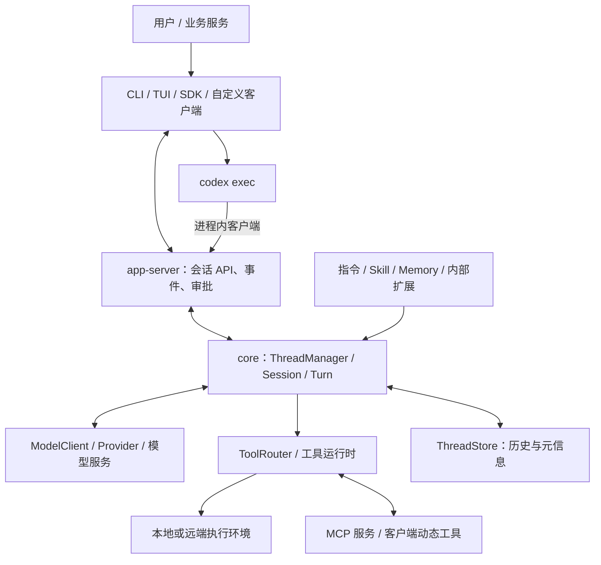
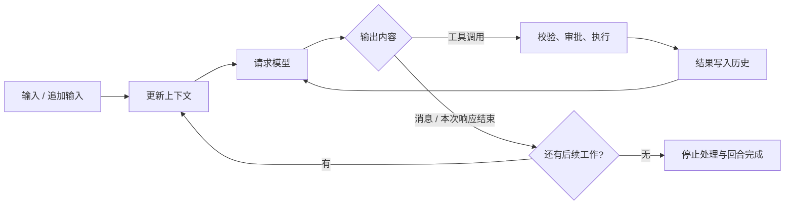
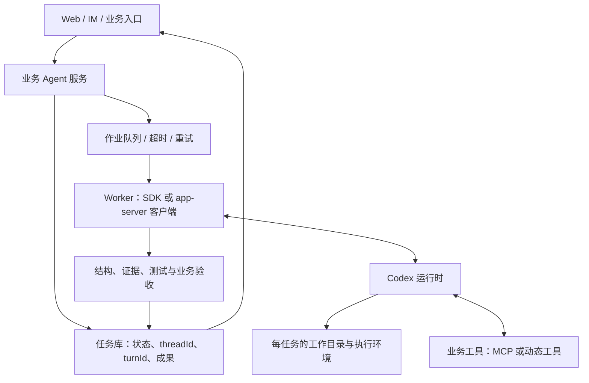

# Codex 设计与实现

最后整理：2026-09-17。源码基准：本地 `/Users/bytedance/Project/open_source/codex` 的 [e269f2164cbb](https://github.com/openai/codex/commit/e269f2164cbb9f499e4f22301c393500e2a831f3)，提交时间为北京时间 2026-09-17 18:02:38。本文依据这一固定提交分析，并核对当日官方 SDK / app-server 文档；未编译运行 Codex，也未执行示例中的模型请求。仓库中的 `0.0.0` 是开发版本占位，不能据此判断已发布客户端的能力。

<a id="overview"></a>

## 1. 设计概览与阅读导航

**Codex 是可复用的 Agent 运行时：它接收任务，组织模型上下文，执行工具，管理权限与会话，并把过程输出为事件。** 基于它封装业务 Agent，可以让 Codex 负责一次任务内部的推理与执行，业务服务负责任务入口、业务状态、凭据、调度和验收。

先给选型结论：

- **脚本、批处理、CI**：从 `codex exec` 或 TypeScript SDK 开始。
- **Python 服务**：使用 Python SDK，它在这个版本中基于 app-server，支持同步和异步客户端。
- **需要自己的聊天界面、审批交互、会话管理和执行中追加输入**：评估 app-server 双向协议。
- **需要改变 Agent loop、工具调度或存储实现**：才考虑源码级接入 Rust crates。

这里分析的是开源仓库内的运行时与接口。不能从本仓库推导 Codex 模型训练方式，也不能把它等同于 Codex 桌面端或云端服务的全部实现。接入边界与官方建议见 [SDK 文档](https://learn.chatgpt.com/docs/codex-sdk)、[app-server 文档](https://learn.chatgpt.com/docs/app-server)。

| 想了解的问题 | 阅读位置 |
| --- | --- |
| 源码从哪里开始读，各模块如何分工？ | [2. 源码结构](#architecture)、[附录 B](#source-route) |
| Thread、Turn、模型调用是什么关系？ | [3. 执行与状态](#runtime) |
| Prompt 请求长什么样，如何保证返回可处理？ | [4. 上下文与模型协议](#model-contract) |
| 权限和沙箱怎样落到工具执行上？ | [5. 工具与执行边界](#tools) |
| AGENTS.md、Skill、Memory 如何复用知识？ | [6. 指令、技能与记忆](#knowledge) |
| 如何选 SDK / CLI / app-server？ | [7. 接入方式](#integration) |
| 如何封装一个能持续运行的业务 Agent？ | [8. 封装方案](#agent-design) |
| 哪些 Prompt 值得参考？ | [附录 A](#prompts) |

<a id="architecture"></a>

## 2. 源码结构：界面、运行时、执行环境分层

### 2.1 目录地图

主实现位于 `codex-rs/`。它是 Rust workspace，已拆分为大量 crate；阅读时适合沿调用链进入，无需先通读全部目录。

| 目录 / 模块 | 主要职责 | 阅读时关注什么 |
| --- | --- | --- |
| `codex-cli/` | npm 安装与平台二进制启动包装 | 分发入口，Agent 主循环在 Rust 中。 |
| `codex-rs/cli/` | 命令分发 | `exec`、`app-server`、`mcp`、`exec-server` 等入口。 |
| `codex-rs/tui/` | 终端交互界面 | 展示事件、输入、审批与交互状态。 |
| `codex-rs/exec/` | 非交互任务入口 | 一次任务的输入、JSONL 事件与最终输出。 |
| `codex-rs/app-server/`、`app-server-transport/` | 面向客户端的服务及传输 | 请求处理、会话控制、通知和服务端反向请求。 |
| `app-server-protocol/`、`protocol/` | 对外协议及共享类型 | v2 RPC、`Op`、事件、模型消息、工具调用类型。 |
| `core/` | Agent 运行时 | `session/`、`thread_manager.rs`、`client.rs`、`tools/`、`context_manager/`。 |
| `model-provider/`、`models-manager/`、`codex-api/`、`codex-client/` | 模型与服务通信 | 模型能力、请求构建、流式响应和传输。 |
| `prompts/`、`context-fragments/` | 提示模板与上下文片段 | 指令如何按角色和用途进入模型输入。 |
| `tools/`、`core/src/tools/` | 工具公共契约与运行时调度 | 工具描述、适配、查找、执行与审批。 |
| `exec-server/`、`file-system/`、`sandboxing/` | 进程、文件系统与隔离执行 | 执行位置可以与 Agent 服务位置分开。 |
| `thread-store/`、`rollout/`、`state/`、`history/` | 持久化和历史 | 会话正文、元信息查询、活跃上下文各自的边界。 |
| `ext/` | 内部能力扩展 | skills、memories、agent、MCP、goal 等通过 contributor 接入。 |
| `skills/`、`memories/`、`core-plugins/`、`codex-mcp/` | 知识与外部能力 | 技能元信息、记忆写入、插件包、MCP 连接管理。 |
| `sdk/typescript/`、`sdk/python/` | 应用集成 SDK | 两者底层传输不同，详见第 7 章。 |

目录以 [workspace 清单](https://github.com/openai/codex/blob/e269f2164cbb9f499e4f22301c393500e2a831f3/codex-rs/Cargo.toml#L1-L155) 为准。一个重要的阅读习惯是**先定位当前文件，再参考旧教程**：本版本的主循环在 `core/src/session/turn.rs`；app-server v2 已拆到 `protocol/v2/` 目录。部分仓库说明仍保留重构前的路径。

### 2.2 核心调用关系



这是职责图，不表示所有前端都通过同一种传输调用。**本版本 `codex exec` 内部也启动 `InProcessAppServerClient`，复用 app-server 的线程生命周期 API**；它对外再输出适合非交互作业的事件。因此 TS SDK 与 Python SDK 的差别主要在客户端契约和进程通信路径，不能理解为各自拥有完全不同的 Agent loop。[exec 内部客户端](https://github.com/openai/codex/blob/e269f2164cbb9f499e4f22301c393500e2a831f3/codex-rs/exec/src/lib.rs#L972-L981)

`core` 供上层复用 Agent 逻辑，app-server 把这些能力组织成客户端接口。`codex-tools` 则将公共工具模型移出 core，同时保留依赖 `Session`、`TurnContext` 和审批流程的编排逻辑。[core 定位](https://github.com/openai/codex/blob/e269f2164cbb9f499e4f22301c393500e2a831f3/codex-rs/core/README.md#L1-L3)、[工具模块拆分边界](https://github.com/openai/codex/blob/e269f2164cbb9f499e4f22301c393500e2a831f3/codex-rs/tools/README.md#L1-L58)

**设计意义**：换界面、换业务入口通常无需重写 Agent loop；把工具执行搬到独立环境，也可以复用会话与模型调用部分。

<a id="runtime"></a>

## 3. 执行与状态：Thread → Turn → 多次模型调用

### 3.1 三个对外概念和两个内部上下文

| 概念 | 含义 | 示例 |
| --- | --- | --- |
| Thread | 持续会话，含历史与配置 | “修复支付服务测试失败”这一任务的多轮交流。 |
| Turn | 一次输入及其后续 Agent 工作 | 用户说“实施修复”后，可能发生几十次模型与工具交互。 |
| Item | 输入或输出单元 | 用户消息、Agent 消息、命令执行、文件修改、工具调用。 |
| `TurnContext` | 当前回合的运行信息 | 配置、取消、输出 Schema 等回合状态。 |
| `StepContext` | 一次执行步骤使用的能力快照 | 当前模型、环境、工具集合与可见状态。 |

**一次 Turn 不等于一次模型请求**。稳定的外部任务单位是 Thread / Turn，模型请求属于其内部实现。[Thread / Turn 参数](https://github.com/openai/codex/blob/e269f2164cbb9f499e4f22301c393500e2a831f3/codex-rs/app-server-protocol/src/protocol/v2/thread.rs#L55-L106)、[回合参数](https://github.com/openai/codex/blob/e269f2164cbb9f499e4f22301c393500e2a831f3/codex-rs/app-server-protocol/src/protocol/v2/turn.rs#L162-L258)

### 3.2 主循环做了什么

内部以提交操作和输出事件解耦控制与展示：`Submission` 进入输入通道，`submission_loop` 分发操作，事件经另一通道输出。因此客户端可以接收进度，也可以提交中断、追加输入等控制操作。[通道建立](https://github.com/openai/codex/blob/e269f2164cbb9f499e4f22301c393500e2a831f3/codex-rs/core/src/session/mod.rs#L580-L600)、[操作分发](https://github.com/openai/codex/blob/e269f2164cbb9f499e4f22301c393500e2a831f3/codex-rs/core/src/session/handlers.rs#L409-L433)

一次普通回合可概括为：

1. 检查是否需要压缩历史，处理先前完成的异步 hook。
2. 确认本次输入所需的 MCP / 插件能力，捕获 `StepContext`。
3. 更新模型可见的环境、权限、项目指令等状态，处理技能与插件输入。
4. 从历史构造模型请求，消费流式输出。
5. 若输出工具调用，交给工具运行时；执行结果写回历史，再请求模型。
6. 若还有待处理输入，或模型表明需要继续，则保持循环。
7. 无后续工作时执行停止 hook；hook 也可能附加继续任务的上下文，最后结束回合。

[准备与上下文捕获](https://github.com/openai/codex/blob/e269f2164cbb9f499e4f22301c393500e2a831f3/codex-rs/core/src/session/turn.rs#L163-L320)、[模型请求与继续条件](https://github.com/openai/codex/blob/e269f2164cbb9f499e4f22301c393500e2a831f3/codex-rs/core/src/session/turn.rs#L493-L567)、[停止处理](https://github.com/openai/codex/blob/e269f2164cbb9f499e4f22301c393500e2a831f3/codex-rs/core/src/session/turn.rs#L644-L706)



`response.completed` 只表示一次上游模型响应结束。源码仍会检查工具后续工作、待处理输入以及 `end_turn`，因此业务服务不能收到一段自然语言就判定任务结束。[流式完成处理](https://github.com/openai/codex/blob/e269f2164cbb9f499e4f22301c393500e2a831f3/codex-rs/core/src/session/turn.rs#L2790-L2845)

### 3.3 持久化：正文、元信息与当前上下文分开

`ThreadStore` 是存储边界。`LocalThreadStore` 通过 rollout JSONL 保存规范历史，通过 SQLite 保存可查询元信息；`LiveThread` 负责活跃线程的追加与元信息同步。写入历史本身不再隐式推断所有元信息，元信息有专门的更新接口。[存储职责](https://github.com/openai/codex/blob/e269f2164cbb9f499e4f22301c393500e2a831f3/codex-rs/thread-store/README.md#L1-L35)

这带来三个不同操作：

- **resume**：恢复同一个 Thread，继续积累历史。
- **fork**：从已有历史建立新 Thread，供另一条探索路径使用。
- **compact**：缩减模型当前要读取的上下文，不等同于删除全部持久化记录。

对封装层的含义：保存 `threadId` 只是保存索引。恢复还依赖相应的运行时存储、配置和执行环境；把 ID 传到一台没有会话数据的机器，不构成完整迁移。取消回合也不代表撤销已执行的命令或外部写入，业务层应另行定义回滚和补偿。

### 3.4 子 Agent 与并行工作

本版本包含多 Agent 实现。以 v2 路径为例，创建子 Agent 时记录父 Thread、父 Turn、任务路径、历史分叉方式和环境选择；消息交互由 Agent 控制层处理。子 Agent 的执行容量有独立限制机制，不能简单理解为无限启动模型请求。[子 Agent 创建](https://github.com/openai/codex/blob/e269f2164cbb9f499e4f22301c393500e2a831f3/codex-rs/core/src/tools/handlers/multi_agents_v2/spawn.rs#L127-L217)、[执行容量限制](https://github.com/openai/codex/blob/e269f2164cbb9f499e4f22301c393500e2a831f3/codex-rs/core/src/agent/control/execution.rs#L13-L98)

应区分三种并发：模型在一个响应中提出多个工具调用、Codex 在一个任务中委派子 Agent、业务服务并行运行多个独立任务。它们的状态与资源控制层不同。封装层仍需控制业务任务并发、工作目录分配和外部服务配额；不能假定一个内部并发参数解决全部调度问题。

<a id="model-contract"></a>

## 4. 上下文与模型协议

### 4.1 Prompt 由多层材料组成

“Prompt”在这里包括顶层指令、带角色的历史项、工具定义和输出约束，并非一个大字符串。

| 材料 | 来源与作用 |
| --- | --- |
| 基础模型指令 | 模型信息与模板；配置允许覆盖基础指令。 |
| 运行时 / 开发者指令 | 权限、模式、应用能力、业务方 `developerInstructions` 等。 |
| 项目指令 | 按项目根到工作目录路径加载 `AGENTS.md`，纳入上下文片段。 |
| 环境状态 | 工作目录、可用环境、工具与能力变化等。 |
| Skill / Memory | 技能目录及选中内容、记忆摘要和读取指引。 |
| 任务历史 | 用户消息、Agent 消息、工具调用及对应输出、压缩项等。 |
| 工具 / 输出 Schema | 工具名称与参数结构；可选最终输出 JSON Schema。 |

[基础指令覆盖](https://github.com/openai/codex/blob/e269f2164cbb9f499e4f22301c393500e2a831f3/codex-rs/models-manager/src/model_info.rs#L16-L52)、[运行状态构造](https://github.com/openai/codex/blob/e269f2164cbb9f499e4f22301c393500e2a831f3/codex-rs/core/src/session/world_state.rs#L1-L75)、[请求前 Prompt 对象](https://github.com/openai/codex/blob/e269f2164cbb9f499e4f22301c393500e2a831f3/codex-rs/core/src/session/turn.rs#L1524-L1542)

项目指令的自动加载有边界：按项目根标识向上定位，再从根到当前目录收集，受总字节预算及项目可信状态影响；存在 `AGENTS.override.md` 和可配置回退文件名。更深目录的指令并不意味着启动时会扫描整个仓库。[项目指令加载](https://github.com/openai/codex/blob/e269f2164cbb9f499e4f22301c393500e2a831f3/codex-rs/core/src/agents_md.rs#L1-L120)

**可变状态采用追加更新的思路**：例如 AGENTS.md 内容变化时，新片段明确说明替换旧指令；移除时追加失效说明；相同状态不重复注入。这样可以在保留历史前缀的同时告诉模型当前规则。[状态差异渲染](https://github.com/openai/codex/blob/e269f2164cbb9f499e4f22301c393500e2a831f3/codex-rs/core/src/context/world_state/agents_md.rs#L9-L79)

### 4.2 发给模型的请求长什么样

普通 Responses 路径的简化示意如下。字段取自实际请求构造；示例中的模型、指令和工具是说明用途，不是抓取的真实请求：

```json
{
  "model": "<已配置且可用的模型>",
  "instructions": "<基础 Agent 指令>",
  "input": [
    {
      "type": "message",
      "role": "developer",
      "content": [{"type": "input_text", "text": "<权限、能力与业务指令>"}]
    },
    {
      "type": "message",
      "role": "user",
      "content": [{"type": "input_text", "text": "分析这个仓库的测试失败原因"}]
    }
  ],
  "tools": [
    {
      "type": "function",
      "name": "lookup_build",
      "description": "读取构建结果",
      "parameters": {
        "type": "object",
        "properties": {"build_id": {"type": "string"}},
        "required": ["build_id"],
        "additionalProperties": false
      }
    }
  ],
  "tool_choice": "auto",
  "parallel_tool_calls": true,
  "stream": true,
  "store": false,
  "include": ["reasoning.encrypted_content"],
  "prompt_cache_key": "<运行时生成的缓存键>"
}
```

还可能携带 `reasoning`、`service_tier`、`client_metadata`、`text` 等参数。是否启用某项能力由模型、provider 和配置共同决定；`store: false` 是上游请求字段，不表示本地不保存 Thread。[请求构造](https://github.com/openai/codex/blob/e269f2164cbb9f499e4f22301c393500e2a831f3/codex-rs/core/src/client.rs#L849-L956)、[请求类型](https://github.com/openai/codex/blob/e269f2164cbb9f499e4f22301c393500e2a831f3/codex-rs/codex-api/src/common.rs#L260-L286)

**本版本还存在 Responses Lite 分支**：工具成为 `input` 中的 `AdditionalTools` 项，基础指令也成为输入片段，顶层 `instructions` 留空且 `tools` 不再单独传入；该路径还关闭这里的 `parallel_tool_calls` 标志。因此不能把上面的普通请求形状当成所有模型都使用的唯一格式。[Lite 分支](https://github.com/openai/codex/blob/e269f2164cbb9f499e4f22301c393500e2a831f3/codex-rs/core/src/client.rs#L859-L905)

### 4.3 模型返回如何规范化

规范化分为四层，各自解决不同问题：

| 层次 | 机制 | 保证的范围 |
| --- | --- | --- |
| 模型输出协议 | 解析为 `ResponseEvent` / `ResponseItem`，区分消息、函数调用、自定义工具调用等 | 客户端可以区分输出类型。 |
| 工具执行协议 | `ToolRouter` 按名称和类型路由；处理器反序列化参数，失败返回模型可理解的错误 | 防止把不可解析参数直接当成命令执行。 |
| 历史配对 | 调用与结果通过 `call_id` 关联；请求前修复缺失工具输出等结构 | 后续模型请求具备可处理的调用历史。 |
| 业务最终输出 | 可选 JSON Schema 转为 `text.format`，普通回合使用 strict 约束 | 约束最终数据形状；业务真实性仍需验收。 |

[工具路由](https://github.com/openai/codex/blob/e269f2164cbb9f499e4f22301c393500e2a831f3/codex-rs/core/src/tools/router.rs#L244-L291)、[参数解析错误](https://github.com/openai/codex/blob/e269f2164cbb9f499e4f22301c393500e2a831f3/codex-rs/core/src/tools/handlers/mod.rs#L85-L92)、[调用结果补齐](https://github.com/openai/codex/blob/e269f2164cbb9f499e4f22301c393500e2a831f3/codex-rs/core/src/context_manager/normalize.rs#L19-L140)、[最终 Schema 转换](https://github.com/openai/codex/blob/e269f2164cbb9f499e4f22301c393500e2a831f3/codex-rs/codex-api/src/common.rs#L374-L392)

例如中断留下没有结果的函数调用时，历史规范化可插入 `aborted` 输出；这是说明调用没有完整结果，不是伪造执行成功。参数反序列化也不等于所有自定义工具都完成了完整的 JSON Schema 与业务校验；客户端自己执行的工具需要在接收端继续校验。

还要区分两种“JSON”：

- `codex exec --json`：**执行事件流**。其中包含工具进度、消息、回合状态。
- `--output-schema` / SDK `outputSchema` / app-server `outputSchema`：**最终回答的数据结构**。

可以同时使用两者。应用必须分别处理事件协议、最终 JSON 解析和业务规则校验。

### 4.4 缓存、截断与压缩

缓存优化不只是给请求加一个 key。WebSocket 增量续接前，Codex 会检查请求属性是否兼容，确认旧输入加上上一轮输出仍是本次输入的前缀，再发送增量项并引用上一响应。前缀变化时不能继续沿用这一增量形式。[增量续接判断](https://github.com/openai/codex/blob/e269f2164cbb9f499e4f22301c393500e2a831f3/codex-rs/core/src/client.rs#L1350-L1414)

上下文预算处理包括工具输出截断、历史规范化和自动压缩。压缩可在回合前或执行中触发，具体分支取决于 provider 的远端压缩能力、功能开关和预算配置。内置本地摘要 Prompt 要求保留已完成工作、关键决策、约束和下一步，便于另一个上下文窗口继续任务。[历史截断与请求视图](https://github.com/openai/codex/blob/e269f2164cbb9f499e4f22301c393500e2a831f3/codex-rs/core/src/context_manager/history.rs#L394-L479)、[压缩路径选择](https://github.com/openai/codex/blob/e269f2164cbb9f499e4f22301c393500e2a831f3/codex-rs/core/src/session/turn.rs#L1413-L1470)、[摘要模板](https://github.com/openai/codex/blob/e269f2164cbb9f499e4f22301c393500e2a831f3/codex-rs/prompts/templates/compact/prompt.md#L1-L9)

**封装建议**：把稳定业务规则放在线程指令中，把本次任务放在用户输入中，大量外部数据通过工具按需查询。避免每个步骤重写全部历史或反复塞入同一份大文档；最终成果和任务状态仍应保存在业务存储中。

<a id="tools"></a>

## 5. 工具、权限与执行边界

### 5.1 工具描述、路由和执行分离

模型看见工具名称、说明和参数结构；工具路由层将模型输出转换成调用；具体处理器负责执行。公共工具 crate 提供 `ToolSpec`、`ToolExecutor`、`ToolCall`、`ToolOutput` 等契约，并适配 MCP、动态工具和 Code Mode。[公共工具边界](https://github.com/openai/codex/blob/e269f2164cbb9f499e4f22301c393500e2a831f3/codex-rs/tools/README.md#L1-L43)

不同工具采用不同执行路径。例如终端命令进入执行与沙箱逻辑，MCP 工具交给对应 MCP 服务，动态工具交给宿主客户端。**接入外部 API 后，该 API 自身的鉴权、参数检查与写入约束仍由工具服务负责。** 文件系统沙箱无法替外部工单系统决定用户是否能修改某张工单。

### 5.2 权限不是一条 Prompt

| 机制 | 决定的问题 |
| --- | --- |
| 沙箱 / permission profile | 当前执行环境允许读取、写入和访问网络的范围。 |
| `approvalPolicy` | 什么情况下可以发起审批。 |
| `approvalsReviewer` | 由用户还是自动审批评审方处理请求。 |
| 执行规则与工具逻辑 | 具体命令如何判定、是否允许重试及如何执行。 |

`ToolOrchestrator` 将审批、沙箱选择、实际尝试与拒绝后的处理集中起来。沙箱拒绝后是否可重试需要重新判断策略；严格自动评审场景中，原先批准的沙箱内执行不能直接授权一次无沙箱重试。[编排职责](https://github.com/openai/codex/blob/e269f2164cbb9f499e4f22301c393500e2a831f3/codex-rs/core/src/tools/orchestrator.rs#L1-L7)、[升级重试判断](https://github.com/openai/codex/blob/e269f2164cbb9f499e4f22301c393500e2a831f3/codex-rs/core/src/tools/orchestrator.rs#L397-L447)

两个容易混淆的设置：

- `approvalPolicy: "never"` 表示不请求批准；它不自动赋予更大权限。
- `workspace-write` 表示工作区及配置可写目录范围的权限，不代表进程与业务账户完成了多租户隔离。

配置也不只有一个 `config.toml`：有系统、用户、项目、会话覆盖和托管配置层，并记录每个配置项来自哪一层。宿主不能仅凭自己传入一个选项就假定它是最终有效值。[配置层与来源](https://github.com/openai/codex/blob/e269f2164cbb9f499e4f22301c393500e2a831f3/codex-rs/config/src/loader/README.md#L1-L48)

### 5.3 app-server 与 exec-server 的区别

| 服务 | 管理对象 | 典型接口 |
| --- | --- | --- |
| app-server | Agent 会话、回合、模型和客户端交互 | `thread/start`、`turn/start`、审批请求、消息事件。 |
| exec-server | 执行环境中的进程与文件 | `process/start`、`process/read`、`process/terminate`、文件系统 RPC。 |

exec-server 使 Agent 所在主机和工具执行主机能够分开。它有自己的协议、连接与进程生命周期；启动一个 exec-server 并不会自动得到任务调度、模型循环或多租户服务。[执行服务定位](https://github.com/openai/codex/blob/e269f2164cbb9f499e4f22301c393500e2a831f3/codex-rs/exec-server/README.md#L1-L39)

### 5.4 内部扩展与外部扩展

源码中的 `ext/extension-api` 通过 typed contributor 注册线程生命周期、回合生命周期、上下文、工具、配置、审批等能力。它是内部模块化的重要方向：能力可以参与运行时生命周期，而无需所有逻辑都挤进 `core`。[扩展注册表](https://github.com/openai/codex/blob/e269f2164cbb9f499e4f22301c393500e2a831f3/codex-rs/ext/extension-api/src/registry.rs#L18-L114)

业务接入优先使用面向进程的接口与已有扩展机制：

- **Skill**：提供某类任务的方法、模板和辅助脚本。
- **MCP**：提供业务系统的查询、操作或资源读取能力。
- **动态工具**：由 app-server 客户端声明、接收回调并执行。
- **源码 contributor**：适合需要修改运行时内部行为且能够承担版本跟进的团队。

这些机制不是同一种“插件”。尤其不能把内部 Rust 扩展接口当成有独立兼容承诺的第三方动态加载 ABI。

<a id="knowledge"></a>

## 6. 指令、技能与记忆

### 6.1 三者的职责

| 类型 | 主要保存什么 | 生效方式 |
| --- | --- | --- |
| AGENTS.md / developer instructions | 项目规则或业务 Agent 的行为要求 | 在适用范围内进入上下文。 |
| Skill | 可复用任务流程、参考材料、脚本 | 先提供目录信息，选中后读取相应内容。 |
| Memory | 从历史任务中提炼的经验、偏好与索引 | 功能启用后注入摘要，再按需检索细节。 |

不应把三者都理解为“自动学习”。项目指令通常是配置材料；Skill 可以由人编写，也可以由获准写文件的 Agent 生成；Memory 写入管线才明确包含后台提取和合并流程。

### 6.2 Skill 格式与数量控制

基本结构是 **YAML frontmatter + Markdown 正文**。元信息包含名称、描述和可选短描述，正文表达工作方法；脚本、参考资料和模板可放在相邻目录。当前解析器允许缺失名称时使用默认名，但要求非空描述，并对名称长度等做检查。[Skill 元信息解析](https://github.com/openai/codex/blob/e269f2164cbb9f499e4f22301c393500e2a831f3/codex-rs/skills/src/parser.rs#L4-L91)

以下为业务封装示例，不是本次执行自动生成的学习结果：

```markdown
---
name: build-failure-triage
description: 分析构建或测试失败，输出失败阶段、证据与下一步；适用于用户提供构建编号或失败日志的任务。
metadata:
  short-description: 构建失败归因
---

# 构建失败归因

## 输入
构建编号、仓库、目标提交，以及已知的失败信息。

## 步骤
1. 调用构建查询工具，确认失败阶段和目标提交。
2. 读取失败位置附近的日志，区分基础设施失败与代码失败。
3. 查询相关代码；把证据位置与推断分别记录。
4. 按调用方要求的结果 Schema 返回结论。

## 验收
每个主要判断附可定位证据；证据不足时列出缺失项。
```

目录规模方面，源码有 Skill 元信息预算、描述截断与条目省略统计，支持按能力来源读取技能包。这些机制控制模型上下文开销；**目录预算不等于删除磁盘上的 Skill，也不等于自动语义去重**。[目录预算与统计](https://github.com/openai/codex/blob/e269f2164cbb9f499e4f22301c393500e2a831f3/codex-rs/ext/skills/src/render.rs#L17-L111)、[技能读取指引](https://github.com/openai/codex/blob/e269f2164cbb9f499e4f22301c393500e2a831f3/codex-rs/ext/skills/src/catalog_prompt.rs#L1-L38)

### 6.3 Memory：两阶段提取与合并

专题补充（2026-09-20）：[Codex Memory 设计与实现](</Users/taiyou/project/uyouiigit/Reading/大模型/Agents/Codex Memory 设计与实现.md>) 沿更新后的本地源码展开 V1/V2、任务租约、增量合并、读取引用与遗忘机制；本节仍保留本文原始提交基准的概览。

本地 feature 定义中，`memories` 为 Stable，但 `default_enabled: false`；内置默认记忆版本为 V1。最终是否启用还受宿主及配置影响，不能据此推断某个已安装产品的实际状态。[功能开关](https://github.com/openai/codex/blob/e269f2164cbb9f499e4f22301c393500e2a831f3/codex-rs/features/src/lib.rs#L1133-L1139)、[记忆默认配置](https://github.com/openai/codex/blob/e269f2164cbb9f499e4f22301c393500e2a831f3/codex-rs/config/src/types.rs#L334-L368)


当前实际调用点位于 app-server 的 turn 处理器：有输入、确实启动了新回合且主环境已配置时，尝试启动记忆后台任务。记忆入口再排除临时会话、未启用该功能的会话和非根 Agent，并检查状态存储、目录与额度；因此不能仅凭函数名中的 startup，把触发时机解释为“只在线程创建时执行一次”。[实际触发点](https://github.com/openai/codex/blob/e269f2164cbb9f499e4f22301c393500e2a831f3/codex-rs/app-server/src/request_processors/turn_processor.rs#L670-L700)、[运行门槛](https://github.com/openai/codex/blob/e269f2164cbb9f499e4f22301c393500e2a831f3/codex-rs/memories/write/src/start.rs#L20-L94)

| 阶段 | 主要动作 | 工程控制 |
| --- | --- | --- |
| Phase 1 | 选取符合条件的历史会话，调用模型提取结构化结果 | 领取任务、限制扫描与并发、输出解析、敏感字段脱敏。 |
| Phase 2 | 选择提取结果，同步记忆工作目录，生成差异并交给合并 Agent | 全局任务锁、租约心跳、工作目录基线、成功后更新状态。 |
| Read path | 加载 `memory_summary.md` 与读取指引，让 Agent 按需寻找详细材料 | 摘要预算、按版本选择模板、使用状态与引用处理。 |

[Phase 1 领取与并发](https://github.com/openai/codex/blob/e269f2164cbb9f499e4f22301c393500e2a831f3/codex-rs/memories/write/src/phase1.rs#L120-L188)、[Phase 2 合并调度](https://github.com/openai/codex/blob/e269f2164cbb9f499e4f22301c393500e2a831f3/codex-rs/memories/write/src/phase2.rs#L55-L233)、[读取摘要](https://github.com/openai/codex/blob/e269f2164cbb9f499e4f22301c393500e2a831f3/codex-rs/ext/memories/src/prompts.rs#L30-L68)

V1 的主要文件职责如下：

```text
$CODEX_HOME/memories/
├── memory_summary.md       # 注入上下文的概览和索引
├── MEMORY.md               # 可检索的详细经验
├── raw_memories.md         # Phase 1 原始记忆的汇总材料
├── rollout_summaries/      # 按历史会话组织的摘要材料
├── skills/<name>/SKILL.md  # 整理出的可复用流程（如有）
└── .git/                   # 合并工作区的基线与差异跟踪
```

V1 Phase 1 输出含 `raw_memory`、`rollout_summary`、`rollout_slug`；V2 的解析契约只保留后两项，不再解码 `raw_memory`，并对摘要施加字节截断。Phase 2 也只在 V1 重建 `raw_memories.md`。因此上面的 V1 文件布局不能机械套到所有版本。[版本化提取契约](https://github.com/openai/codex/blob/e269f2164cbb9f499e4f22301c393500e2a831f3/codex-rs/memories/write/src/phase1_output.rs#L1-L83)、[合并输入的版本分支](https://github.com/openai/codex/blob/e269f2164cbb9f499e4f22301c393500e2a831f3/codex-rs/memories/write/src/phase2.rs#L190-L209)

合并也允许无操作：没有工作区变化且产物校验通过时可直接完成；有变化才进入合并 Agent。合并 Agent 关闭递归记忆生成、协作及若干外部能力。在 Codex 管理的权限模式下，其可写范围收敛到记忆目录且关闭网络；若父级显式使用 Disabled / External 权限模式，则保留对应模式，不能笼统宣称所有配置下都由 Codex 强制隔离。[无变化分支](https://github.com/openai/codex/blob/e269f2164cbb9f499e4f22301c393500e2a831f3/codex-rs/memories/write/src/phase2.rs#L130-L183)、[合并 Agent 配置](https://github.com/openai/codex/blob/e269f2164cbb9f499e4f22301c393500e2a831f3/codex-rs/memories/write/src/phase2.rs#L290-L342)

**设计边界**：这里的学习更新的是文本、索引与技能材料，没有训练模型权重。锁和 Schema 保护流程及结构，经验是否正确、何时值得合并仍依赖模型与证据质量。封装业务 Agent 时，可先使用人工维护的 Skill 和显式业务状态，再按需求接入自动记忆。

<a id="integration"></a>

## 7. 基于 Codex 封装 Agent：接口选型与示例

### 7.1 接入方式对照

| 方式 | 底层机制 | 适用场景 | 需要注意 |
| --- | --- | --- | --- |
| `codex exec` | 非交互 CLI 进程 | 脚本、单次作业、其他语言快速接入 | 自己处理进程、事件、错误和恢复。 |
| TypeScript SDK | 启动 `codex exec`，交换 JSONL 事件 | Node.js 后端与批处理 | 高层接口简洁；本版本没有完整的双向审批客户端接口。 |
| Python SDK | 启动本地 app-server，经 stdio JSON-RPC 通信 | Python 服务、多轮任务、异步调用 | API 与 TS 不完全对称；核对运行时版本和审批模式。 |
| 直接接 app-server | 双向 RPC + 通知 | 自定义交互产品、精细会话与审批控制 | 需完整处理连接、事件和服务端请求；涉及实验能力时锁定版本。 |
| Rust 源码级接入 | 直接使用 / 修改 core、扩展及存储接口 | 自研运行时、执行环境或深度内部定制 | 承担模块迁移、内部接口和升级维护成本。 |

[TS 启动参数与进程](https://github.com/openai/codex/blob/e269f2164cbb9f499e4f22301c393500e2a831f3/sdk/typescript/src/exec.ts#L92-L206)、[Python 客户端定位](https://github.com/openai/codex/blob/e269f2164cbb9f499e4f22301c393500e2a831f3/sdk/python/src/openai_codex/client.py#L193-L223)

**版本与支持范围**：当日官方文档将 Python SDK 列为稳定发布，并说明发布包自带固定版本 CLI runtime；同时 app-server 页面仍将命令及 WebSocket 传输标为实验性，并注明相应生产支持限制。对外产品应把运行时版本、协议兼容验证和升级回归列入接入方案，不能因为存在 v2 字样就推导所有字段与传输都稳定。[SDK 发布说明](https://learn.chatgpt.com/docs/codex-sdk)、[app-server 传输说明](https://learn.chatgpt.com/docs/app-server)

**旧方案迁移**：当前 CLI 中 `codex mcp` 用于管理外部 MCP 服务；`codex mcp-server` 和独立 `codex-mcp-server` 已移除。要把 Codex 当作其他 Agent 的执行单元，可以由业务适配器调用 SDK / app-server；若上层一定使用 MCP，再由适配器提供自己的 MCP 工具。[当前 CLI 命令](https://github.com/openai/codex/blob/e269f2164cbb9f499e4f22301c393500e2a831f3/codex-rs/cli/src/main.rs#L145-L177)、[官方迁移说明](https://learn.chatgpt.com/docs/codex-sdk)

### 7.2 CLI：最小作业封装

下面命令是使用方式示意，需替换工作目录并准备认证和 Schema 文件：

```bash
codex exec \
  --cd /path/to/repository \
  --sandbox read-only \
  --json \
  --output-schema /path/to/report.schema.json \
  --output-last-message /path/to/report.json \
  "分析构建失败原因，给出证据和下一步"
```

父进程读取 stdout 的 JSONL 事件，保留 stderr 诊断信息，并检查进程退出、回合失败及最终结果。任务需要续跑时保存事件中的 `thread_id`，用明确 ID 恢复；服务场景不宜依赖“最近一条会话”定位业务任务。[CLI 参数定义](https://github.com/openai/codex/blob/e269f2164cbb9f499e4f22301c393500e2a831f3/codex-rs/exec/src/cli.rs#L13-L85)、[非交互模式](https://learn.chatgpt.com/docs/non-interactive-mode)

`read-only` 约束 Agent 工具的写入权限；`--output-last-message` 是宿主 CLI 保存最终结果的路径。示例是分析任务，若需要 Agent 修改项目，应显式选择对应的工作区权限。

### 7.3 TypeScript：结构化分析 Agent

示例把 Codex 的输出约束为一个小型业务结果，并在应用侧检查类型。它是接入骨架，未在本文分析中执行：

```typescript
import { Codex } from "@openai/codex-sdk";

const repo = process.env.AGENT_WORKSPACE;
if (!repo) throw new Error("请设置 AGENT_WORKSPACE");

const outputSchema = {
  type: "object",
  properties: {
    status: { type: "string", enum: ["analyzed", "needs_input"] },
    summary: { type: "string" },
    evidence: { type: "array", items: { type: "string" } },
  },
  required: ["status", "summary", "evidence"],
  additionalProperties: false,
};

type Report = {
  status: "analyzed" | "needs_input";
  summary: string;
  evidence: string[];
};

function parseReport(text: string): Report {
  const value: unknown = JSON.parse(text);
  if (value === null || typeof value !== "object" || Array.isArray(value)) {
    throw new Error("最终输出必须是对象");
  }
  const r = value as Record<string, unknown>;
  if (
    Object.keys(r).length !== 3 ||
    typeof r.status !== "string" ||
    !["analyzed", "needs_input"].includes(r.status) ||
    typeof r.summary !== "string" ||
    !Array.isArray(r.evidence) ||
    !r.evidence.every((item) => typeof item === "string")
  ) {
    throw new Error("最终输出未通过业务结构校验");
  }
  return r as Report;
}

const codex = new Codex();
const thread = codex.startThread({
  workingDirectory: repo,
  sandboxMode: "read-only",
  approvalPolicy: "never",
  webSearchMode: "disabled",
});

const { events } = await thread.runStreamed(
  "分析仓库的测试组织方式；证据不足时返回 needs_input。",
  { outputSchema, signal: AbortSignal.timeout(300_000) },
);

let finalText = "";
let completed = false;
for await (const event of events) {
  if (event.type === "thread.started") {
    console.error("保存到业务任务记录的 threadId:", event.thread_id);
  } else if (event.type === "item.completed" && event.item.type === "agent_message") {
    finalText = event.item.text;
  } else if (event.type === "turn.completed") {
    completed = true;
  } else if (event.type === "turn.failed" || event.type === "error") {
    throw new Error(JSON.stringify(event));
  }
}
if (!completed) throw new Error("事件流结束，但未收到回合完成事件");
console.log(parseReport(finalText));
```

要点：

- `thread.id` 在首次启动事件到达后才有值；实际服务应及时写入任务库，示例只打印。
- `runStreamed()` 返回执行事件；`run()` 则收集完成的 items、最后 Agent 消息及 usage。
- 本版本 SDK 将 Schema 写入临时文件，转为 CLI 的 `--output-schema`；`AbortSignal` 传给子进程。
- 结构正确后仍要检查证据能否定位、结论是否符合业务条件；不能仅凭 `status` 字符串触发发布或关闭工单。

[SDK 流处理与结果汇总](https://github.com/openai/codex/blob/e269f2164cbb9f499e4f22301c393500e2a831f3/sdk/typescript/src/thread.ts#L45-L148)、[线程配置类型](https://github.com/openai/codex/blob/e269f2164cbb9f499e4f22301c393500e2a831f3/sdk/typescript/src/threadOptions.ts#L1-L30)

### 7.4 Python：复用 app-server 的线程能力

```python
import os
from openai_codex import ApprovalMode, Codex, Sandbox

workspace = os.environ["AGENT_WORKSPACE"]

with Codex() as codex:
    thread = codex.thread_start(
        cwd=workspace,
        sandbox=Sandbox.read_only,
        approval_mode=ApprovalMode.deny_all,
        developer_instructions="你负责构建失败归因。每个主要判断附证据位置。",
    )
    result = thread.run("梳理这个仓库的测试入口与执行前提。")
    print(result.final_response)
```

Python 高层 `thread_start` 在这个版本中默认 `ApprovalMode.auto_review`，会映射到 `on-request` 与自动评审；示例明确选择 `deny_all`，映射为不请求审批。业务接入应显式决定权限与审批，避免把不同 SDK 的默认值视为相同。[Python 线程入口](https://github.com/openai/codex/blob/e269f2164cbb9f499e4f22301c393500e2a831f3/sdk/python/src/openai_codex/api.py#L134-L176)、[审批模式映射](https://github.com/openai/codex/blob/e269f2164cbb9f499e4f22301c393500e2a831f3/sdk/python/src/openai_codex/_approval_mode.py#L13-L37)

### 7.5 app-server：完整的双向客户端

本地客户端可启动 `codex app-server --listen stdio://`。其消息是省略 `jsonrpc` 字段的双向 JSON-RPC，stdio 上每行一条 JSON。连接时先握手，再启动或恢复 Thread，最后提交 Turn。[官方协议说明](https://learn.chatgpt.com/docs/app-server)

以下仅列客户端发送的消息；**每一步必须等待对应响应并检查错误，再发送下一步**，`<thread-id>` 来自 `thread/start` 响应：

```jsonl
{"id":1,"method":"initialize","params":{"clientInfo":{"name":"build_agent","title":"Build Agent","version":"0.1.0"}}}
{"method":"initialized"}
{"id":2,"method":"thread/start","params":{"cwd":"/path/to/repository","sandbox":"read-only","approvalPolicy":"never","developerInstructions":"分析构建失败；主要判断附可定位证据。"}}
{"id":3,"method":"turn/start","params":{"threadId":"<thread-id>","input":[{"type":"text","text":"分析这次测试失败的原因"}]}}
```

外层客户端至少处理三类入站消息：

| 消息 | 如何处理 |
| --- | --- |
| 对客户端请求的响应，带 `id` 与 `result` / `error` | 关联正在等待的 RPC；启动响应不代表任务已完成。 |
| 通知，带 `method` 而无请求 `id` | 更新 Thread / Turn / Item 状态，合并消息增量。 |
| 服务端请求，带 `method` 与 `id` | 执行审批、工具回调或输入交互，使用原 `id` 回应。 |

常见通知有 `item/agentMessage/delta`、`item/started`、`item/completed`、`turn/completed`。最后一个仍需检查 turn 的终态，而不是把方法名中的 completed 一律解释为成功。正在执行时可以用 `turn/steer` 追加输入，用 `turn/interrupt` 取消；恢复或展示时使用相应 Thread API。

审批与动态工具都是服务端反向请求，例如 `item/commandExecution/requestApproval`、`item/fileChange/requestApproval`、`item/tool/call`。只实现“发送 prompt → 等待文本”会遗漏这些交互。[服务端请求定义](https://github.com/openai/codex/blob/e269f2164cbb9f499e4f22301c393500e2a831f3/codex-rs/app-server-protocol/src/protocol/common.rs#L1754-L1792)

还需注意：

- `exec` 事件名如 `turn.completed`；app-server 通知名如 `turn/completed`。不要让二者共用未经适配的解析器。
- `thread/start.dynamicTools` 等字段需要 `experimentalApi` 能力；应只为需要的功能显式启用实验面。
- 可用 `codex app-server generate-ts` / `generate-json-schema` 从所部署版本生成协议类型，避免人工维护漂移的字段表。

[动态工具的实验标记](https://github.com/openai/codex/blob/e269f2164cbb9f499e4f22301c393500e2a831f3/codex-rs/app-server-protocol/src/protocol/v2/thread.rs#L145-L151)、[协议生成命令分发](https://github.com/openai/codex/blob/e269f2164cbb9f499e4f22301c393500e2a831f3/codex-rs/cli/src/main.rs#L1549-L1574)

<a id="agent-design"></a>

## 8. 业务 Agent 的推荐封装方案

本章是基于以上源码边界给出的工程方案，不表示 Codex 已内置所有业务服务能力。

### 8.1 让业务服务管理任务，让 Codex 完成任务内部工作



| 责任 | 建议由谁承担 |
| --- | --- |
| 模型调用、工具循环、上下文压缩 | Codex。 |
| 技能加载、线程历史、执行过程事件 | Codex 提供机制；宿主决定配置、可见能力与持久化范围。 |
| 用户身份、业务授权、租户与凭据边界 | 业务服务与工具服务。 |
| 定时触发、任务队列、重试策略、资源配额 | 业务调度层。 |
| 最终成果验证、发布、工单状态变更 | 业务验收与交付层。 |

这样做的直接好处是：Codex 升级主要影响适配器，业务任务状态无需与内部 `ResponseItem` 一一绑定。

### 8.2 如何放置业务规则和工具

以“构建失败分析 Agent”为例：

1. **`developerInstructions`**：职责、输出要求、证据标准，以及何时视为任务完成。
2. **项目 AGENTS.md**：测试命令、目录约定、构建前提。
3. **Skill**：可复用的定位步骤、不同失败类型的处理方式。
4. **MCP / 动态工具**：`get_build`、`get_log_excerpt`、`get_change` 等业务能力。
5. **用户输入**：本次构建编号、问题和目标范围。
6. **最终 Schema**：结论、证据、下一步或缺失信息。

优先通过 `developerInstructions` 增加业务职责；只有确实准备接管基础 Agent 行为时才使用 `baseInstructions` 覆盖。后者会替换基础模板。

若选动态工具，流程是：在线程创建时声明工具 → 收到 `item/tool/call` → 宿主校验用户权限和参数 → 执行业务 API → 返回结果。若工具会产生外部写入，幂等键和重复调用处理应在工具服务端实现；模型重试不应自动转化为重复创建或重复扣减。[动态工具处理器](https://github.com/openai/codex/blob/e269f2164cbb9f499e4f22301c393500e2a831f3/codex-rs/core/src/tools/handlers/dynamic.rs#L118-L165)

### 8.3 任务状态与恢复

建议业务任务记录至少包含：

```text
job_id, user_or_tenant_id, workspace_id
runtime_version, instructions_version, skill_version
thread_id, active_turn_id, status
result, artifact_locations, validation_result, last_error
```

状态可采用 `queued → running → waiting_input / waiting_approval → completed / failed / cancelled`。这是外层业务状态机，应从协议事件与验收结果推导，不能只解析模型说了什么。

恢复原则：

- 收到 Thread / Turn ID 后及时持久化；连接丢失时先查询运行状态，再决定继续、恢复或创建新任务。
- 对同一 Thread 串行安排新业务回合；需要执行中补充信息时使用明确的 steer 语义。
- `fork` 分叉的是会话历史；若两条任务要并行修改代码，显式分配不同工作区或 worktree。
- 中断后核对已发生的文件修改和外部操作，再决定是否重试；不要把“未收到完成事件”当成“从未执行”。

### 8.4 从本地验证到服务化的落地顺序

1. **选一个只读任务**：用 SDK 完成“输入 → 工具 → 结构化结果”，验证任务是否适合 Codex。
2. **固化知识与工具契约**：版本化职责、Skill、工具参数和输出 Schema；准备成功、缺资料、工具失败三类样例。
3. **补上任务记录与恢复**：保存 ID、事件摘要和成果；验证超时、取消、进程退出后的行为。
4. **按需求增加交互**：需要审批、执行中输入或自定义 UI 时接入 app-server 的完整双向消息。
5. **扩展权限与执行环境**：为需要写代码的任务分配工作目录与相应权限，独立管理业务工具凭据。
6. **增加交付动作**：在结果验收通过后，由业务流程触发后续操作，并记录对应授权和结果。

对于多用户服务，单独的 `threadId` 或不同工作目录不足以隔离同一进程用户可访问的会话、配置和凭据。应按部署需求划分运行时进程、存储、执行环境和凭据范围。Memory 启用时也要明确共享范围，避免把一位用户的经验注入其他用户任务。

### 8.5 什么时候需要改源码

适合源码级定制的情况包括：替换持久化后端、接入特殊执行环境、增加必须参与回合生命周期的内部扩展，或改变工具调度机制。仅增加企业知识、业务工具和任务入口，通常先在 SDK / app-server 外层完成。

若确需源码集成，建议优先研究 `ThreadStore`、`ToolExecutor`、extension contributor 和 provider 等现有边界，并固定 commit。这样可以把维护成本集中在少数适配点；直接修改主循环则需要同时理解取消、工具结果、压缩、状态恢复和事件兼容。

<a id="prompts"></a>

## 附录 A：值得参考的关键 Prompt

以下是固定版本中的模板和机制；实际运行时可能按模型、配置和宿主选择不同内容。英文片段来自本地开源文件，作为分析对象。

| Prompt | 关键表达或要求 | 对封装 Agent 的启发 |
| --- | --- | --- |
| 基础 Agent 模板 | `You are a coding agent running in the Codex CLI`，同时规定工具使用、项目指令和交互方式 | 身份描述需要与可执行工具、环境规则一起提供。 |
| 压缩模板 | `Create a handoff summary for another LLM that will resume the task.` | 摘要围绕续做所需状态组织，而非只概括聊天主题。 |
| Skill 目录指引 | 先发现技能，再读取适用的 `SKILL.md` 和相关材料 | 目录负责路由，正文按需加载。 |
| Memory 读取指引 | 先看摘要和关键词，再查详细记忆及少量相关证据 | 记忆作为可检索线索，不应整库注入。 |
| Memory 合并模板 | 区分详细记忆、用户偏好、概要索引，允许重组和删除陈旧内容 | 自动学习需要明确产物职责和维护规则。 |

对应源码：[基础模板](https://github.com/openai/codex/blob/e269f2164cbb9f499e4f22301c393500e2a831f3/codex-rs/models-manager/prompt.md#L1-L28)、[压缩模板](https://github.com/openai/codex/blob/e269f2164cbb9f499e4f22301c393500e2a831f3/codex-rs/prompts/templates/compact/prompt.md#L1-L9)、[Skill 目录 Prompt](https://github.com/openai/codex/blob/e269f2164cbb9f499e4f22301c393500e2a831f3/codex-rs/ext/skills/src/catalog_prompt.rs#L1-L38)、[Memory 读取 Prompt](https://github.com/openai/codex/blob/e269f2164cbb9f499e4f22301c393500e2a831f3/codex-rs/ext/memories/templates/memories/read_path.md#L1-L64)、[V1 合并摘要规则](https://github.com/openai/codex/blob/e269f2164cbb9f499e4f22301c393500e2a831f3/codex-rs/memories/write/templates/memories/consolidation.md#L453-L590)

可直接借鉴的业务职责写法如下；其中规则通过宿主 developer 指令提供，工具与权限由运行时单独配置：

```text
你负责分析构建或测试失败，并输出可复核的归因结果。
先确认构建编号、目标提交和失败阶段，再读取有关日志与代码。
每个主要判断必须附证据位置；区分已验证事实与推断。
缺少必要信息时列出缺失项；只在证据足够时给出明确归因。
最终结果遵守本次请求附带的 JSON Schema。
```

Schema 约束字段，工具代码执行鉴权与业务检查，Prompt 指导工作方式。三者共同构成业务 Agent 的执行约定。

<a id="source-route"></a>

## 附录 B：建议的源码阅读路线

按下列顺序阅读，可以先建立主线，再深入感兴趣的实现：

| 顺序 | 文件 / 目录 | 要回答的问题 |
| --- | --- | --- |
| 1 | `codex-rs/cli/src/main.rs`、`exec/src/cli.rs` | 任务从哪个入口进入？ |
| 2 | `sdk/typescript/src/exec.ts`、`sdk/python/src/openai_codex/client.py` | SDK 怎样启动运行时并通信？ |
| 3 | `app-server-protocol/src/protocol/common.rs`、`v2/thread.rs`、`v2/turn.rs` | 对外协议能表达哪些状态与操作？ |
| 4 | `core/src/thread_manager.rs`、`core/src/session/handlers.rs` | Thread 如何创建、恢复和接收操作？ |
| 5 | `core/src/session/turn.rs` | 工具调用后为什么继续请求模型，何时结束回合？ |
| 6 | `core/src/client.rs`、`codex-api/src/common.rs` | 真正发给模型的请求如何构造？ |
| 7 | `core/src/session/world_state.rs`、`core/src/context_manager/` | 环境差异、历史和预算如何进入上下文？ |
| 8 | `core/src/tools/router.rs`、`orchestrator.rs`、`handlers/` | 工具怎样路由、校验、审批和执行？ |
| 9 | `thread-store/`、`rollout/`、`state/` | 会话与查询状态怎样持久化？ |
| 10 | `ext/skills/`、`memories/write/`、`ext/memories/` | 知识怎样加载、提取和合并？ |
| 11 | `ext/extension-api/`、`exec-server/` | 深度定制应接在哪个边界？ |

若只准备封装 Agent，可以先读第 1～3 项及第 7～8 章；若准备改运行时，再沿第 4～11 项深入。对比其他运行时可参照同目录的 [Hermes Agent 设计与实现](</Users/bytedance/Desktop/每日规划/Agents/Hermes Agent 设计与实现.md>) 与 [OpenClaw 设计与实现](</Users/bytedance/Desktop/每日规划/Agents/OpenClaw 设计与实现.md>)，比较执行循环、持久化、知识更新和接入边界。
