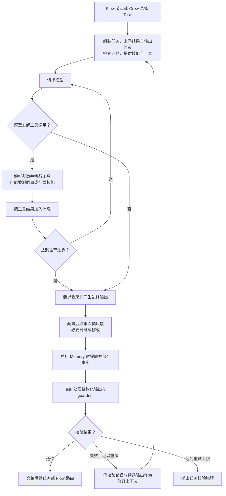
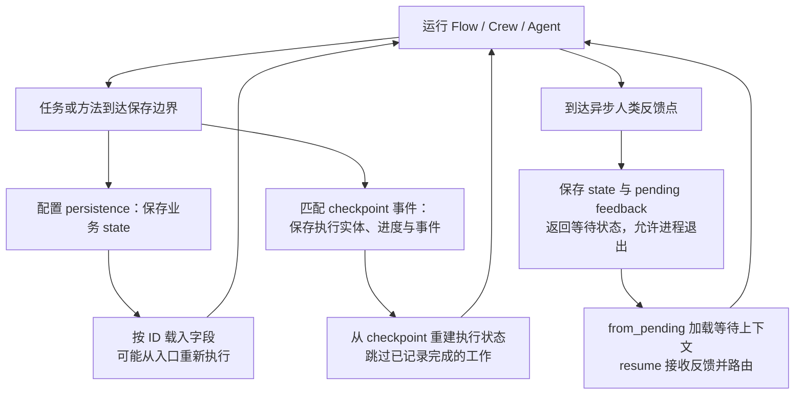
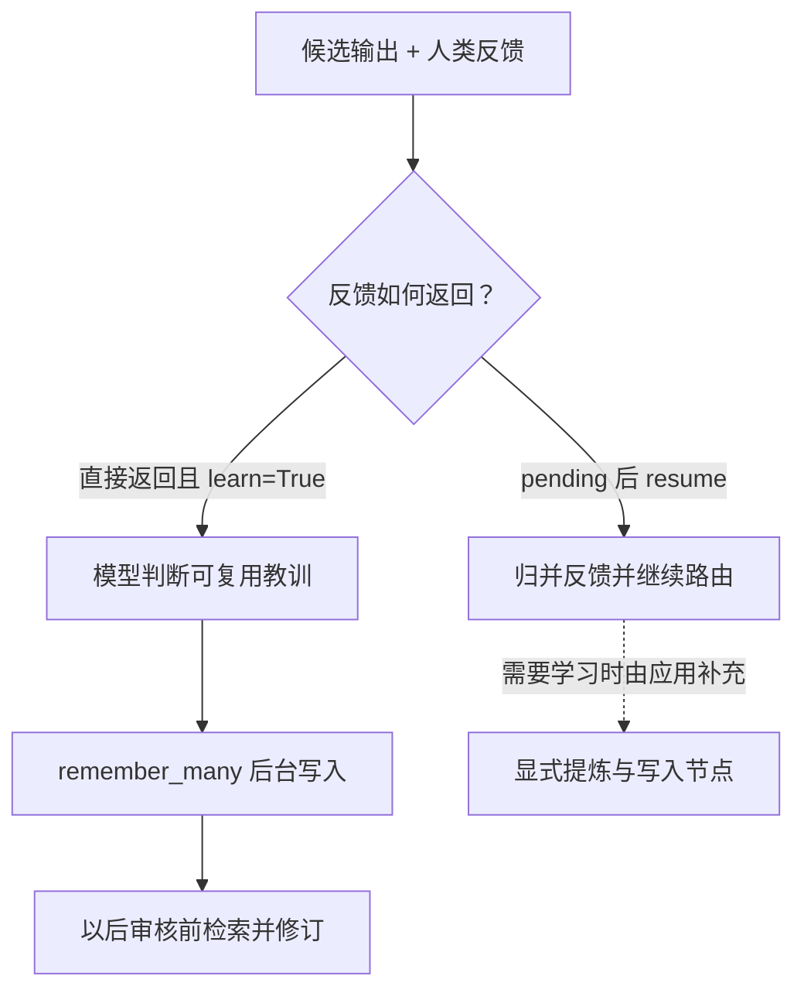

# CrewAI 设计与实现

[返回总览](<Agents 调研.md>)

本文关注 CrewAI 如何把角色分工、业务流程、工具调用和经验复用组合起来，支撑“接到业务请求后，按约束完成工作”的数字员工。重点是各层分别控制什么，以及持久状态、恢复和学习真正发生在哪里。

写作日期：**2026-09-07**。源码获取日期：**2026-09-07**。分析固定于 `crewAIInc/crewAI` 提交 [`1f3e6113d75cd12b2899943faffbc729130d200b`](https://github.com/crewAIInc/crewAI/tree/1f3e6113d75cd12b2899943faffbc729130d200b)，提交时间为 **2026-09-07 18:57:15（北京时间）**。本文只阅读源码与官方文档，**未安装、运行项目或验证模型效果**。

该快照声明的包版本为 **1.15.20**。调研时[官方文档](https://docs.crewai.com/en/concepts/flows)也跳转到 `v1.15.20`，但具体内容与上述主干快照存在差异。例如，Flow 实现已迁入 `flow/runtime`，Memory 默认路径和反馈学习参数也有变化。下文涉及默认值、执行与恢复语义时，以固定源码为准。[版本声明][version]

## 1. 整体设计：Flow 控制流程，Crew 组织分工，Agent 完成任务

Flow 节点可以运行普通函数、单个 Agent 或整个 Crew；将确定的审批与交付约束写进流程，把调查和归纳交给模型。[Flow 入口][flow-entry]、[Crew 调度][crew-run]

| 层次 | 管理什么 | 数字员工中的用途 |
|---|---|---|
| Flow | 触发、分支、汇合、状态、暂停恢复 | 申请、调查、审批、执行 |
| Crew / Process | 任务集合、上下文、顺序或层级协作 | 阶段内角色分工 |
| Task | 描述、依赖、输出模型、guardrail、人类输入 | 可检查的交付契约 |
| Agent / Executor | 角色与目标、提示、模型—工具循环 | 在任务边界内选择动作 |
| Memory / Knowledge / Skills / Tools | 经验、参考资料、操作规程、执行能力 | 记住什么、查什么、怎么做、如何行动 |

角色背景不会自动建立审批状态机或常驻服务。上述路径均在 MIT 开源仓库中；托管部署、控制台、企业治理及支持属于 CrewAI AMP Suite，不能视为本地 Crew 默认能力。[产品边界][product]

## 2. Agent loop：在任务上下文中反复调用模型和工具

**默认执行器为 `experimental.AgentExecutor`，旧 `CrewAgentExecutor` 已废弃。** 新执行器继承 `Flow[AgentExecutorState]`，用状态保存消息、迭代、待调用工具和计划进度；Flow 因而也用于 Agent 内部循环。[默认值][executor-default]、[执行状态][executor-state]

普通 `invoke` 清空消息、迭代和计划状态；本次提示组合任务、预期输出、上游结果，再接入 Memory、Knowledge、Skills 与训练建议。连续做任务不等于连续保留全部聊天历史。[提示][prompt]、[入口][executor-entry]

以下为未开启额外规划时的基础路径：

| 执行规则 | 默认 / 分支 | 实际边界 |
|---|---|---|
| 工具调用 | 原生 function calling，或文本 ReAct；接口拒绝可降级 | 宿主管理调用和观察结果 |
| `max_iter=25` | 达上限进入收束回答 | 单任务循环边界，不是一天工作预算 |
| Task guardrail | 候选结果校验，失败按配置重试 | 角色描述不会自动转为检查规则 |
| 自动 Memory 保存 | **早于 Task 结构化处理与 guardrail** | 已保存经验不代表最终验收通过 |

依据：[循环][loop]、[迭代默认][agent-defaults]、[校验配置][task-contract]、[重试][guardrail-retry]、[保存顺序][executor-entry]。只允许积累已审核结论时，应控制写入、使用只读视图或审批后显式写入。

### 可选规划：计划参与依赖调度

`planning` 默认 **False**，`planning_config` 默认 **None**。开启后生成带 `depends_on` 的 Todo，按依赖执行并根据观察调整计划。[开关][planning-default]、[生成][planning-create]、[调度][planning-route]、[观察][planning-observe]

| 当前步骤状态 | 执行器动作 |
|---|---|
| 只有一个可执行步骤 | 顺序执行 |
| 多个步骤依赖均已满足 | 进入并行分支 |
| 仍有未完成步骤，但没有可执行项 | 重新规划 |

这是任务内“计划—执行—观察—调整”循环；外层审批与交付条件仍由业务定义。

### 上下文管理：任务间传结果，任务内压缩消息

| 边界 | 处理方式 | 保留与丢失 |
|---|---|---|
| 新 Task | 接收选定上游输出，按需检索 Memory / Knowledge | 不自动带入前一任务完整工具轨迹 |
| 上下文超限，`respect_context_window=True`（默认） | 捕获错误后摘要并重试 | 是超限恢复，不能推断每次请求前精确限流 |
| 同一错误，开关关闭 | 抛出 `SystemExit` | 需缩小输入或使用检索 |
| `summarize_messages` | 非 system 消息按边界分块、可并行摘要 | 原列表替换为 system + 合并摘要；用户附件重新附上 |

依据：[默认开关][context-default]、[参数传递][context-pass]、[捕获][context-catch]、[恢复][context-recover]、[处理][context-handler]、[摘要实现][context-summary]。

这条路径没有同时建立 DeepAgents 式的原始历史文件入口。业务事实应另存任务结果、Flow state、证据文件或日志；附件引用保留不等于对话已归档，摘要也不能替代长期 Memory。

## 3. Crews 与 Flows：局部自主协作与业务编排

### 3.1 Crew 的协作方式与并发独立配置

| 配置 | 行为 | 边界 |
|---|---|---|
| `Process.sequential`（默认） | 按任务列表执行，后续聚合已有输出 | 传递交付结果，不是完整内部对话 |
| `Task.context` | 显式选择上游结果；空列表不传上游 | 用于限定上下文依赖 |
| `Process.hierarchical` | 建 manager，仍走同一任务骨架；模型用工具委派、询问成员 | 不自动创建任意组织树或永久子进程 |
| `allow_delegation` | 普通 Agent 默认关，manager 开 | 与任务并发不同 |
| `Task.async_execution` | 启动 future；后续同步任务先收集异步结果 | 层级模式不自动让全部任务并行 |

依据：[流程默认][crew-defaults]、[上下文][task-context]、[manager][crew-run]、[委派][agent-defaults]、[任务并发][crew-tasks]。层级、异步任务、异步 `kickoff` 是三个配置维度。

### 3.2 Flow 用完成事件驱动后续节点

| 声明 / 执行层 | 语义 |
|---|---|
| `@start` / `@listen` | 入口 / 订阅方法完成或命名事件 |
| `@router` | 返回后续路由结果 |
| `or_` / `and_` | 任一触发 / 等待全部触发 |
| runtime | 先顺序处理 router 链，再以 `asyncio.gather` 跑同组 listener |

Python 声明投影为可序列化 Flow Definition；同步方法在线程池执行。[DSL][flow-entry]、[条件][conditions]、[路由][flow-routing]、[方法执行][flow-method]

汇合节点应从 state 读取各分支成果，不能假定参数含全部分支结果；并行分支避免覆盖同一字段。回边可以表达返工，但终止、重试次数与幂等键仍需应用定义。

## 4. 持久状态与恢复：先分清三种保存对象

Flow state 是运行中共享的字典或 Pydantic 业务字段；跨进程恢复要看保存了哪类数据。

| 持久对象 | 保存内容 | 恢复语义 |
|---|---|---|
| Flow persistence | 流程 ID、方法、时间、JSON state；`@persist` 等启用，默认 SQLite | 按 ID 载入字段；无完成记录时可能从入口重跑 |
| Runtime checkpoint | 执行实体、完成方法、输出、次数、Crew 输入、事件与谱系 | 按已记录进度恢复；Crew 找首个无 `task.output` 的任务 |
| Pending feedback | state + 等待反馈上下文 | `from_pending` 重建，`resume` / `resume_async` 接收反馈并路由 |

依据：[SQLite][persist-store]、[状态加载][state-restore]、[checkpoint 字段][checkpoint-state]、[Crew 恢复][crew-tasks]、[pending][pending]。

`checkpoint` 需显式启用或从父对象继承。`checkpoint=True` 默认用 JSON provider、目录 `./.checkpoints`、事件 `task_completed`；普通方法组成的 Flow 应选 `method_execution_finished` 等适合事件，不能期待默认逐节点保存。[配置][checkpoint-config]

**恢复以成功写入的数据为边界。** 自动 checkpoint 保存失败只告警、仍继续运行；无报错不代表快照存在。它不覆盖外部工具事务，接口完成而进度未记账时仍可能重跑，工具需保存操作 ID 并检查已有结果。[保存失败][checkpoint-failure]、[序列化][checkpoint-serialization]

## 5. 人机协作：任务内修订与跨进程审批

| 接口 | 介入点 | 适用方式 |
|---|---|---|
| `Task.human_input` | Agent 形成候选答案后 | 当前执行内收集修订意见 |
| `@human_feedback` | 显式 Flow 节点 | 反馈归并为 `approved`、`needs_revision` 等路由 |
| 异步反馈 provider | 保存 pending context 与 state 后返回 | 允许原进程退出，后续恢复审批 |

依据：[任务反馈][executor-entry]、[反馈配置][feedback]、[等待恢复][pending]。开发者指定介入点，应用实现通知、回调鉴权、重复回调处理和部署；框架提供的是暂停恢复协议。

## 6. Memory：外部经验库及其检索作用域

### 6.1 统一 Memory 的开关与自动行为

此版本采用统一 `Memory`，不沿用旧教程的四类记忆对象。[官方说明](https://docs.crewai.com/en/concepts/memory)

| 容器 / 阶段 | 默认与作用域 | 行为边界 |
|---|---|---|
| Crew | `memory=False`；开启后根为 `/crew/<名称>` | 未开启不走自动记忆路径 |
| Flow | 默认创建 `/flow/<名称>` 根 Memory | 有对象不代表每个方法的 state 自动入库 |
| Crew 任务前 | 最多召回 5 条进入提示 | 共享读取可覆盖整个 Crew 分支 |
| Crew 执行结束 | 从任务、角色、预期结果、输出抽取事实，批量编码 | 按角色组织写入；角色目录不等于私有权限 |

依据：[Crew 初始化][crew-memory]、[Flow 初始化][flow-memory]、[读取][memory-read]、[写入][memory-save]。内部 AgentExecutor 虽继承 Flow，却跳过自动建库，复用 Agent / Crew 的记忆。[执行器状态][executor-state]

### 6.2 编码会整合经验，检索会判断相关性

| 路径 | 处理过程 | 结果 |
|---|---|---|
| 编码 | embedding → 找相似记录 → 模型推断 scope、类别、重要性、动作 | 可能插入、更新或删除经验 |
| shallow 检索 | 直接向量搜索 | 返回相关记忆 |
| deep 检索 | RecallFlow 分析查询、并行搜索、按置信度深入 | 结合多轮搜索结果 |
| 默认排序权重 | 相似度 0.5、新近程度 0.3、重要性 0.2 | 相关不等于正确 |

依据：[编码][memory-encode]、[检索][memory-recall]、[权重][memory-defaults]。错误经验可能反复被利用，需来源和业务验证；`scope`、`slice`、`source`、private 过滤也不能替代服务端认证与租户隔离。

### 6.3 持久后端与写入完成时机

默认后端是本地 LanceDB：优先 `$CREWAI_STORAGE_DIR/memory`，否则使用平台应用数据目录下的项目存储位置加 `memory`；支持显式路径和自定义后端。此处与当时官网的 `./.crewai/memory` 不同。跨进程需同一后端，跨 Crew / Flow 还需兼容作用域；名称不应充当严格隔离边界。[实际路径][memory-storage]

| API | 完成语义 |
|---|---|
| `remember()` | 阻塞至单条保存完成 |
| `remember_many()` | 后台编码，立即返回空列表；返回不代表落盘成功 |
| 同一 Memory 的 `recall()` | 先等待本对象待写队列，再读取 |
| `drain_writes()` | 显式等待待写队列 |

这个读前屏障不是任意独立进程之间的同步保证。[写入实现][memory-write]

## 7. 自主学习：普通积累、反馈学习与训练是不同路径

三条路径都改变外部经验或提示指导，**不自动修改模型权重、Agent 角色或工具实现**。

| 路径 | 开启与产物 | 下一次如何生效 |
|---|---|---|
| 普通 Memory 积累 | 启用 Memory；执行后抽取、整合事实 | 任务前召回相关经验 |
| 人类反馈学习 | `@human_feedback(learn=True)`，默认 False；提炼规则，默认来源 `hitl` | 下次审核前检索经验，先修订候选输出 |
| `crew.train()` | 初稿 + 反馈 + 改进稿 → 按角色保存 `suggestions` 文件 | 普通执行加载该角色建议并加入提示 |

依据：[自动写入][memory-save]、[反馈配置][feedback]、[调用顺序][feedback-run]、[训练][training]、[建议加载][training-load]。

反馈学习的两条调用路径并不对称：

**此快照的 `resume` 不再调用经验提炼，pending context 也不带学习配置；不能假定 `learn=True` 自动覆盖跨进程恢复后的审批。** 需要在恢复回调后补充提炼、写入并验证。[resume 路径][feedback-resume]、[pending 字段][feedback-context]

| 其他边界 | 实现含义 |
|---|---|
| 是否产出教训 | 模型判断；简单批准未必产生条目 |
| 学习失败 | 默认回退原输出或跳过提炼；`learn_strict` 可抛出预审/提炼错误 |
| 后台写入 | strict 不会使其变成同步事务 |
| 版本差异 | 官网 `learn_limit` 不在此快照装饰器参数中 |
| 训练配置 | 复制 Crew、开启 `human_input`、关闭成员委派 |
| 自定义训练文件 | 后续用 Crew 配置或 `CREWAI_TRAINED_AGENTS_FILE` 指向该文件 |

训练建议仍需效果评测；经验、反馈规则与建议文件应保留可追踪的来源、版本和验收结果。

## 8. Skills 与 Tools：操作规程和执行能力分开配置

| 能力 | 进入任务的方式 | 用途与边界 |
|---|---|---|
| Skills | 目录先发现元数据，`load_skill` 按需读 `SKILL.md`；也支持内联、预加载对象 | 操作规程；不自动授予 API 权限或安装脚本 |
| Tools | 开发者工具、配置接入的 MCP 等 | 执行读取、提交等真实动作 |
| Knowledge | 检索已有文档 | 参考资料 |
| Memory | 检索运行中提炼的经验 | 以后任务复用 |

依据：[技能发现][skills-setup]、[加载][skills-tool]、[工具接入][crew-tools]。

同一原生工具批次通常进入线程池，但包含 `result_as_answer` 或使用次数限制工具时改为顺序处理。Flow 分支、Crew 任务、Agent 工具的并发在不同层发生，有副作用的工具需在实际执行层检查冲突与幂等性。[批次并发][tool-parallel]

## 9. 端到端示例：售后异常调查数字员工

以下是应用设计示意，并非已验证的仓库业务系统。请求：“调查反复投诉的订单，形成方案，经审批后更新工单。”

| 阶段 | 编排与动作 | 保存 / 验证 |
|---|---|---|
| 登记 | 外部服务创建请求 ID | state 存订单、工单、阶段、操作 ID；查已有结果 |
| 并行调查 | 两个 listener 调只读 Agent，核验订单与投诉，按需读技能 | 分支写互不冲突的字段 |
| 形成方案 | `and_` 汇合后启动 Crew；调查员交证据，撰写员出方案 | 固定依赖用顺序任务，动态补充用 manager |
| 验收与审批 | 程序校验后进入异步 human feedback | 检查证据、订单与参数；保存 pending 后可退出 |
| 执行与归档 | 批准后调用带幂等键的工单工具 | 存回执与 checkpoint；只写入验收通过的业务经验 |

本例使用恢复式审批，另设经验提炼节点，不能只依赖 `learn=True`。Flow 控制阶段，Crew 在阶段内协作，状态、证据与外部回执共同支撑交付追查。

## 10. 源码阅读路线

| 顺序 | 阅读入口 | 核查问题 |
|---|---|---|
| 1 | [任务调度][crew-tasks] → [提示][prompt] → [loop][loop] | 角色如何接任务、调用工具、交付结果 |
| 2 | [Flow DSL][flow-entry] → [runtime][flow-routing] | 触发、并发、路由如何执行 |
| 3 | [state][state-restore]、[pending][pending]、[checkpoint][checkpoint-serialization] | 恢复了什么，哪些动作会重跑 |
| 4 | [写入][memory-save] → [编码检索][memory-recall] → [HITL][feedback] / [训练][training-load] | 经验何时产生、落盘并影响以后任务 |

[flow-entry]: https://github.com/crewAIInc/crewAI/blob/1f3e6113d75cd12b2899943faffbc729130d200b/lib/crewai/src/crewai/flow/flow.py#L1-L47
[version]: https://github.com/crewAIInc/crewAI/blob/1f3e6113d75cd12b2899943faffbc729130d200b/lib/crewai/src/crewai/__init__.py#L51
[product]: https://github.com/crewAIInc/crewAI/blob/1f3e6113d75cd12b2899943faffbc729130d200b/README.md#L39-L84
[crew-defaults]: https://github.com/crewAIInc/crewAI/blob/1f3e6113d75cd12b2899943faffbc729130d200b/lib/crewai/src/crewai/crew.py#L250-L269
[crew-run]: https://github.com/crewAIInc/crewAI/blob/1f3e6113d75cd12b2899943faffbc729130d200b/lib/crewai/src/crewai/crew.py#L1512-L1558
[crew-tasks]: https://github.com/crewAIInc/crewAI/blob/1f3e6113d75cd12b2899943faffbc729130d200b/lib/crewai/src/crewai/crew.py#L1552-L1637
[crew-tools]: https://github.com/crewAIInc/crewAI/blob/1f3e6113d75cd12b2899943faffbc729130d200b/lib/crewai/src/crewai/crew.py#L1654-L1696
[task-context]: https://github.com/crewAIInc/crewAI/blob/1f3e6113d75cd12b2899943faffbc729130d200b/lib/crewai/src/crewai/crew.py#L1868-L1878
[prompt]: https://github.com/crewAIInc/crewAI/blob/1f3e6113d75cd12b2899943faffbc729130d200b/lib/crewai/src/crewai/agent/core.py#L578-L624
[executor-entry]: https://github.com/crewAIInc/crewAI/blob/1f3e6113d75cd12b2899943faffbc729130d200b/lib/crewai/src/crewai/experimental/agent_executor.py#L2874-L2923
[loop]: https://github.com/crewAIInc/crewAI/blob/1f3e6113d75cd12b2899943faffbc729130d200b/lib/crewai/src/crewai/experimental/agent_executor.py#L1416-L1623
[agent-defaults]: https://github.com/crewAIInc/crewAI/blob/1f3e6113d75cd12b2899943faffbc729130d200b/lib/crewai/src/crewai/agents/agent_builder/base_agent.py#L297-L306
[task-contract]: https://github.com/crewAIInc/crewAI/blob/1f3e6113d75cd12b2899943faffbc729130d200b/lib/crewai/src/crewai/task.py#L233-L281
[conditions]: https://github.com/crewAIInc/crewAI/blob/1f3e6113d75cd12b2899943faffbc729130d200b/lib/crewai/src/crewai/flow/dsl/_conditions.py#L21-L28
[flow-routing]: https://github.com/crewAIInc/crewAI/blob/1f3e6113d75cd12b2899943faffbc729130d200b/lib/crewai/src/crewai/flow/runtime/__init__.py#L3141-L3290
[flow-method]: https://github.com/crewAIInc/crewAI/blob/1f3e6113d75cd12b2899943faffbc729130d200b/lib/crewai/src/crewai/flow/runtime/__init__.py#L2967-L3031
[persist-store]: https://github.com/crewAIInc/crewAI/blob/1f3e6113d75cd12b2899943faffbc729130d200b/lib/crewai/src/crewai/flow/persistence/sqlite.py#L54-L199
[state-restore]: https://github.com/crewAIInc/crewAI/blob/1f3e6113d75cd12b2899943faffbc729130d200b/lib/crewai/src/crewai/flow/runtime/__init__.py#L2280-L2363
[checkpoint-state]: https://github.com/crewAIInc/crewAI/blob/1f3e6113d75cd12b2899943faffbc729130d200b/lib/crewai/src/crewai/state/runtime.py#L52-L85
[checkpoint-config]: https://github.com/crewAIInc/crewAI/blob/1f3e6113d75cd12b2899943faffbc729130d200b/lib/crewai/src/crewai/state/checkpoint_config.py#L146-L202
[checkpoint-failure]: https://github.com/crewAIInc/crewAI/blob/1f3e6113d75cd12b2899943faffbc729130d200b/lib/crewai/src/crewai/state/checkpoint_listener.py#L201-L244
[checkpoint-serialization]: https://github.com/crewAIInc/crewAI/blob/1f3e6113d75cd12b2899943faffbc729130d200b/lib/crewai/src/crewai/state/runtime.py#L190-L214
[pending]: https://github.com/crewAIInc/crewAI/blob/1f3e6113d75cd12b2899943faffbc729130d200b/lib/crewai/src/crewai/flow/runtime/__init__.py#L1226-L1387
[feedback]: https://github.com/crewAIInc/crewAI/blob/1f3e6113d75cd12b2899943faffbc729130d200b/lib/crewai/src/crewai/flow/human_feedback.py#L206-L426
[feedback-run]: https://github.com/crewAIInc/crewAI/blob/1f3e6113d75cd12b2899943faffbc729130d200b/lib/crewai/src/crewai/flow/runtime/__init__.py#L3611-L3697
[feedback-resume]: https://github.com/crewAIInc/crewAI/blob/1f3e6113d75cd12b2899943faffbc729130d200b/lib/crewai/src/crewai/flow/runtime/__init__.py#L1483-L1555
[feedback-context]: https://github.com/crewAIInc/crewAI/blob/1f3e6113d75cd12b2899943faffbc729130d200b/lib/crewai/src/crewai/flow/async_feedback/types.py#L19-L143
[crew-memory]: https://github.com/crewAIInc/crewAI/blob/1f3e6113d75cd12b2899943faffbc729130d200b/lib/crewai/src/crewai/crew.py#L655-L703
[flow-memory]: https://github.com/crewAIInc/crewAI/blob/1f3e6113d75cd12b2899943faffbc729130d200b/lib/crewai/src/crewai/flow/runtime/__init__.py#L857-L865
[memory-read]: https://github.com/crewAIInc/crewAI/blob/1f3e6113d75cd12b2899943faffbc729130d200b/lib/crewai/src/crewai/agent/core.py#L656-L719
[memory-save]: https://github.com/crewAIInc/crewAI/blob/1f3e6113d75cd12b2899943faffbc729130d200b/lib/crewai/src/crewai/agents/agent_builder/base_agent_executor.py#L31-L69
[memory-encode]: https://github.com/crewAIInc/crewAI/blob/1f3e6113d75cd12b2899943faffbc729130d200b/lib/crewai/src/crewai/memory/encoding_flow.py#L225-L499
[memory-recall]: https://github.com/crewAIInc/crewAI/blob/1f3e6113d75cd12b2899943faffbc729130d200b/lib/crewai/src/crewai/memory/unified_memory.py#L681-L785
[memory-defaults]: https://github.com/crewAIInc/crewAI/blob/1f3e6113d75cd12b2899943faffbc729130d200b/lib/crewai/src/crewai/memory/unified_memory.py#L88-L160
[memory-storage]: https://github.com/crewAIInc/crewAI/blob/1f3e6113d75cd12b2899943faffbc729130d200b/lib/crewai/src/crewai/memory/storage/lancedb_storage.py#L51-L78
[memory-write]: https://github.com/crewAIInc/crewAI/blob/1f3e6113d75cd12b2899943faffbc729130d200b/lib/crewai/src/crewai/memory/unified_memory.py#L430-L578
[training]: https://github.com/crewAIInc/crewAI/blob/1f3e6113d75cd12b2899943faffbc729130d200b/lib/crewai/src/crewai/crew.py#L930-L983
[training-load]: https://github.com/crewAIInc/crewAI/blob/1f3e6113d75cd12b2899943faffbc729130d200b/lib/crewai/src/crewai/agent/core.py#L1312-L1349
[skills-setup]: https://github.com/crewAIInc/crewAI/blob/1f3e6113d75cd12b2899943faffbc729130d200b/lib/crewai/src/crewai/agent/core.py#L492-L552
[skills-tool]: https://github.com/crewAIInc/crewAI/blob/1f3e6113d75cd12b2899943faffbc729130d200b/lib/crewai/src/crewai/skills/tool.py#L35-L69
[tool-parallel]: https://github.com/crewAIInc/crewAI/blob/1f3e6113d75cd12b2899943faffbc729130d200b/lib/crewai/src/crewai/experimental/agent_executor.py#L1788-L1953
[context-default]: https://github.com/crewAIInc/crewAI/blob/1f3e6113d75cd12b2899943faffbc729130d200b/lib/crewai/src/crewai/agent/core.py#L288-L293
[context-pass]: https://github.com/crewAIInc/crewAI/blob/1f3e6113d75cd12b2899943faffbc729130d200b/lib/crewai/src/crewai/agent/core.py#L1184-L1205
[context-catch]: https://github.com/crewAIInc/crewAI/blob/1f3e6113d75cd12b2899943faffbc729130d200b/lib/crewai/src/crewai/experimental/agent_executor.py#L1614-L1623
[context-handler]: https://github.com/crewAIInc/crewAI/blob/1f3e6113d75cd12b2899943faffbc729130d200b/lib/crewai/src/crewai/utilities/agent_utils.py#L807-L844
[context-summary]: https://github.com/crewAIInc/crewAI/blob/1f3e6113d75cd12b2899943faffbc729130d200b/lib/crewai/src/crewai/utilities/agent_utils.py#L1084-L1177
[guardrail-retry]: https://github.com/crewAIInc/crewAI/blob/1f3e6113d75cd12b2899943faffbc729130d200b/lib/crewai/src/crewai/task.py#L1382-L1414
[context-recover]: https://github.com/crewAIInc/crewAI/blob/1f3e6113d75cd12b2899943faffbc729130d200b/lib/crewai/src/crewai/experimental/agent_executor.py#L2832-L2846
[executor-default]: https://github.com/crewAIInc/crewAI/blob/1f3e6113d75cd12b2899943faffbc729130d200b/lib/crewai/src/crewai/agent/core.py#L379-L389
[executor-state]: https://github.com/crewAIInc/crewAI/blob/1f3e6113d75cd12b2899943faffbc729130d200b/lib/crewai/src/crewai/experimental/agent_executor.py#L137-L193
[planning-default]: https://github.com/crewAIInc/crewAI/blob/1f3e6113d75cd12b2899943faffbc729130d200b/lib/crewai/src/crewai/agent/core.py#L314-L327
[planning-create]: https://github.com/crewAIInc/crewAI/blob/1f3e6113d75cd12b2899943faffbc729130d200b/lib/crewai/src/crewai/experimental/agent_executor.py#L385-L445
[planning-route]: https://github.com/crewAIInc/crewAI/blob/1f3e6113d75cd12b2899943faffbc729130d200b/lib/crewai/src/crewai/experimental/agent_executor.py#L1093-L1143
[planning-observe]: https://github.com/crewAIInc/crewAI/blob/1f3e6113d75cd12b2899943faffbc729130d200b/lib/crewai/src/crewai/experimental/agent_executor.py#L683-L748
