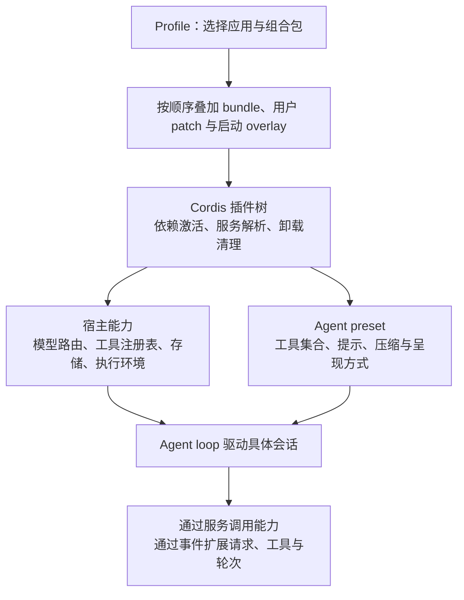
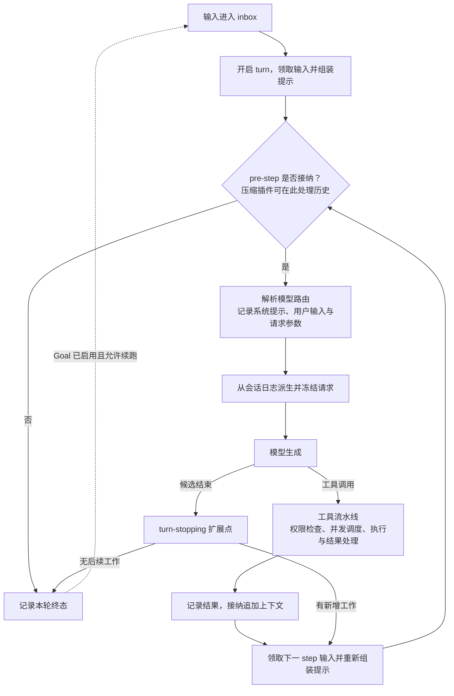
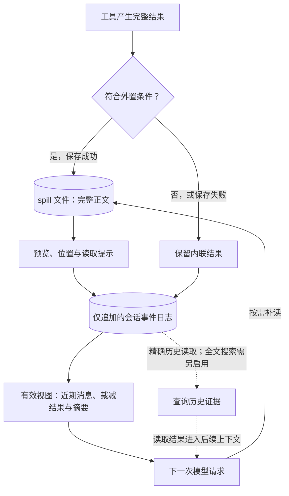

# DeepSeek Harness 设计与实现

[返回总览](<Agents 调研.md>)

DeepSeek Harness（`dsh`）把模型之外的执行系统拆成可组合的插件：工具、上下文、会话存储、Agent loop 和子任务调度，都有明确的接口与生命周期。研究它，重点在于**运行机制怎样替换，模型输入怎样追溯，以及不同编排方式如何继承状态**。

写作与源码获取日期：**2026-09-09**。分析固定于官方仓库 `deepseek-ai/deepseek-harness` 提交 [`5dda764ed3aa172535a7967b06ff95d9cbfe536a`](https://github.com/deepseek-ai/deepseek-harness/tree/5dda764ed3aa172535a7967b06ff95d9cbfe536a)，提交时间为 **2026-09-08 23:25:45（北京时间）**，根包版本为 **0.1.5-alpha.1**。项目处于开发者预览阶段；下文以该快照的 Web / Standard 组合为主要基准，其他模式单独说明。本文只阅读源码与官方资料，未安装、运行项目或评测效果。[版本][version]、[项目说明][readme]

| 研究维度 | 这份实现的重点 |
|---|---|
| 自主学习 | 提供文件指令、技能和运行时创作能力；所查标准组合未内置自动复盘与经验验证闭环。 |
| 长上下文 | 工具结果外置、结果裁减、摘要替换有效视图，分别控制不同阶段的体积。 |
| 持久 Memory | 会话日志默认持久化；跨会话知识可另接 Memory MCP，作用域与召回由提供方决定。 |
| Loop / 编排 | 可替换的循环驱动器，加上 PTC、子 Agent、workflow、Goal 和 Ralph 等独立机制。 |

## 1. 插件化架构：把能力接口与运行生命周期一起拆开

Cordis 用 `ctx` 提供服务，用事件连接扩展点。插件通过 `inject` 声明依赖，依赖就绪后再激活；注册的工具、提示片段和监听器在卸载时撤销。这样，更换一个实现时，其消费者仍通过同一个接口访问能力。[Cordis 机制][cordis]

| 概念 | 管什么 | 例子 |
|---|---|---|
| Profile | 应用的启动组合 | Web、headless、SDK |
| Bundle / patch | 插件配置的分发与覆盖 | 基础服务、界面、替换存储后端 |
| Preset | 会话使用的能力集合 | Standard、PTC、Minimal、Creator |
| Scope / realm | 注册可见范围与服务实例边界 | 隔离不同 preset 的服务，复用宿主注册表 |

Profile 和 preset 属于不同层次。Web 默认选择 `standard`；Web profile 支持配置实时重载，headless / SDK 等一次性或 stdio 应用在启动时组装。不能据此推断所有应用都可在执行途中任意换组件。[架构与配置层][architecture]、[Web 默认值][web-default]

| 模式 | 模型如何行动 | 与 Standard 的重要差别 |
|---|---|---|
| Standard | 原生工具调用 | 文件、Shell、技能、压缩、委派与 workflow |
| Code / PTC | 调用 `run_code`，在 TypeScript 中组合 SDK 工具 | 隐藏普通直接调用入口；通用 `workflow` 工具关闭 |
| Minimal | 持久 Shell 与 `str_replace_editor` | 固定提示，未挂载上下文压缩 |
| Creator（`cordis`） | 标准能力加运行时检查、临时插件与 preset 创作 | 改进对象可以是 Harness 的配置与能力 |

依据：[Standard 配置][standard]、[PTC 呈现][ptc-mode]、[PTC 的 workflow 开关][ptc-workflow]、[Minimal 配置][minimal]、[Creator 配置][creator-preset]。

## 2. Agent loop：从日志构造请求，再由事件决定如何推进

默认 `ReactLoopAgent` 区分 **step** 和 **turn**：step 包含一次模型请求及其工具执行，turn 可以连续经历多个 step。输入进入 inbox，循环领取后组装提示与工具，通过 `agent/pre-step` 决定是否接纳；随后解析实际模型路由，记录输入与请求参数，从日志派生并冻结本次模型请求。[轮次状态机][loop-turn]、[请求构造][loop-request]

图中省略流式重试与取消分支。实现上的关键约束是：模型输入从日志重建，而不是由各插件临时拼出一份无法追溯的隐藏上下文；配套不变式会核对请求消息与日志投影是否一致。[请求一致性检查][loop-invariant]

| 执行规则 | 实现与边界 |
|---|---|
| 工具并发 | 默认最多 10 个并行安全调用；独占调用形成屏障，结果按模型顺序记录。 |
| 请求失败 | 由恢复监听器决定是否重试；未处理的错误结束本轮。 |
| 取消 | 停止新增调用并等待已启动调用收束；未分发工具可记录明确的取消结果。 |
| 轮次结束 | 表示本轮没有欠下的模型工作，业务验收与外部交付仍需上层定义。 |

依据：[并发与取消][tool-scheduler]、[默认上限][loop-contract]、[请求失败处理][loop-errors]。

## 3. 长上下文：原始事件、有效视图与外置正文分开保存

DSH 不会让模型每次都读完整会话日志。日志保存事件，有效视图（surface）决定哪些消息进入下一次请求；裁减和摘要通过追加替换事件改变视图，被遮蔽的旧事件仍然保留。[摘要提交][summary-commit]

| 处理阶段 | 默认策略 | 保留与损失 |
|---|---|---|
| 工具结果外置 | 合格纯文本超过 50,000 UTF-8 字节时保存到 spill 文件 | 返回预览与位置；完整正文可能只在外置文件中 |
| 工具结果裁减 | 窗口有压力时，超过 8,192 字符的结果保留头 4,096、尾 1,024 | 原事件留在日志，新结果替换有效视图 |
| 历史摘要 | 默认达模型窗口的 80% 触发，近期保留预算按窗口的 16% 计算 | 选择完整的可压缩前缀，追加摘要及来源序号 |
| 溢出恢复 | 已确认 overflow 时尝试更大的安全压缩范围 | 默认最多恢复重试一次；仍可能失败 |

这里的字节、字符与 token 是不同计量。常规路径先裁减、重新计量，仍超阈值才摘要；保留比例是选取近期尾部的预算依据，不保证实际结果恰好占窗口的 16%。[外置配置][spill-default]、[外置执行][spill-policy]、[裁减配置][pruner-defaults]、[裁减实现][pruner]、[摘要默认值][compact-config]、[压力分支][compact-path]

**两处容易误判的边界：**第一，外置发生在结果记录前，因此“旧事件还在”不代表日志保有全部原文。PTC 也可能只在日志中保存子调用结果的预览，程序收到的值仍完整。第二，spill 默认位于临时目录，启动时会清理超过 30 天的文件；恢复会话仍可能指向已过期内容。正式证据应另有持久保存策略。[PTC 日志塑形][spill-policy]、[外置文件寿命][spill-lifetime]

基础配置保留精确历史读取接口，但全文检索设为 `openAt: never`，需显式启用。自动摘要失败也可能只记录警告并继续；有压缩插件不意味着永不溢出。[历史检索开关][history-default]、[摘要失败处理][compact-errors]

## 4. Memory 与技能：先看谁写入，再看何时重新加载

会话恢复解决“这项工作进行到哪里”，跨会话 Memory 解决“新任务还应知道什么”。DSH 默认持久化会话，同时提供文件指令、技能与外部 Memory 的接入方式；这些能力各有作用域。

| 载体 | 内容与写入方式 | 后续如何使用 |
|---|---|---|
| 会话日志 | 输入、输出、工具与状态事件 | 恢复该会话，或按稳定边界 fork |
| `AGENTS.md` 等文件 | 用户或 Agent 显式编辑环境约定 | 首步读取全局与项目适用链；结构化文件操作触发后续增量注入 |
| Skill 文件 | 显式保存可复用方法 | 自动提供名称、描述；`skill(name)` 按需读正文 |
| 第三方 Memory MCP | 模型调用外部记忆工具 | 提供方管理范围、存储与搜索，模型再召回 |

`AGENTS.md` 加载器会注入带来源的消息，并识别已生效内容，避免无变化时重复注入。它跟随成功的 `read/write/edit` 文件访问更新适用指令，不靠解析 Shell 的目录切换发现变化。[指令范围][instructions-scope]、[增量注入][instructions-refresh]

技能目录按工作目录、作用域链和 revision 缓存，同名技能优先采用更近的作用域；正文每次加载时重新读取。只修改正文会影响下一次 `skill()`，但不一定产生新目录消息，也不会改写旧工具结果。[技能目录][skill-catalog]、[正文读取与缓存][skill-load]、[作用域优先级][skill-scope]、[正文更新边界][skill-updates]

官方 Memory 指南给出 Memorix、MCP Reference Memory 和 Engram 三种**默认关闭**的接入示例。DSH 做工具发现与调用桥接，不统一管理它们的数据库、项目身份或检索算法。接入成功后仍要验证“写入 → 新会话召回 → 实际采用”，不能只看到工具列表就认为知识已经跨任务生效。[Memory 接入与默认值][memory-guide]、[MCP 工具注册][mcp-tools]

## 5. 自主学习：区分任务内修复、经验保存与能力创作

所查 Standard 组合没有默认的“任务结束后自动反思、筛选经验、写入长期记忆并验证收益”流程。Agent 可以在任务中修正错误，显式编辑指令或技能，也可以调用配置好的 Memory 工具；形成稳定的学习闭环，还需定义材料选择、写入时机和验证方式。

Creator 提供了更独特的探索方向：让 Agent 检查当前 Harness、定义临时插件，再运行或更新它。异步启动或界面渲染失败时，运行时会把错误送回 Agent，并引导检查、修复和重试。这是已有实现的任务内自修复路径。[Creator 工具配置][creator-preset]、[失败回传][creator-repair]

| 改进方式 | 保存了什么 | 能否跨重启复用 |
|---|---|---|
| 临时 `cordis_define / cordis_run` | 会话可见的内存定义与运行实例 | 定义随进程退出消失；日志里的代码不会自动恢复注册 |
| 用户 preset 创作 | 复制并编辑配置、技能和资源目录 | 文件持久存在，供后续选择与组装 |
| 写入 Skill / Memory | 方法或事实 | 取决于文件 / 提供方范围与后续加载 |
| Ralph 多轮推进 | 当前工作区和有界交接报告 | 服务于当前目标；本身不证明学到了通用经验 |

依据：[临时定义寿命][creator-lifetime]、[preset 复制实现][preset-copy]。这些路径修改外部资料或运行能力，本文核查的实现不涉及模型权重训练。

## 6. 编排：五种机制分别交出什么控制权

### 工具程序与子 Agent 工作流

PTC 让模型用一次 `run_code` 编写多步程序，通过 `tools` SDK 调用能力，筛选中间结果后再返回。嵌套调用仍经过工具流水线与并发约束，调用轨迹可追溯；只有整理后的外层输出及相关上下文进入父模型。**默认 TypeScript 后端每次创建新 worker，不像 Prime 的 REPL 那样跨调用保留变量。**[PTC 调度][ptc-execution]、[代码运行时][code-runtime]

| 机制 | 控制方式 | 状态与完成条件 |
|---|---|---|
| PTC `run_code` | TypeScript 组织工具调用 | 单次程序内保存中间变量，返回或打印精选结果 |
| `subagent` / `subagent_fork` | Standard 默认后台、可继续委派 | 返回子 ID 表示已接纳；结果随后通知，也可显式前台等待 |
| `workflow` | 脚本用 `agent/parallel/pipeline` 组织子任务 | 等脚本结果；业务需检查失败项和最终交付 |
| Goal | 在同一会话空闲时追加新轮次 | active、续跑启用且轮次额度足够时继续 |
| Ralph | 固定脚本逐轮启动全新子 Agent | 工作区和上一份报告接续，直到报告完成、受阻或额度耗尽 |

`spawn` 使用新上下文，`fork` 继承已完成的稳定历史，不包含父级正在执行的轮次。Standard 将两者设为 `continuable`，所以不能把默认的 `await subagent()` 当成等待最终答案。[默认委派配置][delegation-default]、[后台接纳代码][subagent-accept]、[委派上下文][subagent-context]

`workflow` 的 `pipeline` 是每个条目各自依次通过阶段，阶段之间没有全局汇合屏障；`phase()` 仅标注进度。普通子任务失败可以返回 `null`，参数错误、取消等致命错误则终止流程。若脚本忽略 `null` 并正常返回，工作流结束也不等于全部子任务成功。[工作流组合器][workflow-combinators]、[子任务结果][workflow-child]、[phase 语义][workflow-meta]

### 持续推进与故障恢复

Goal 在开始下一轮前等待持久化，并重新检查目标版本与竞争输入。会话 resume / fork 后，已有 Goal 保留状态，但续跑处于停用状态，需显式恢复；它不是日历或定时唤醒器。[Goal 驱动][goal-driver]、[恢复后的续跑规则][goal-resume]

Ralph 的工具指引要求用户明确请求全新 Agent 迭代；每轮只接收目标、共享工作区与上一份结构化报告。Standard 将轮次上限配置为 64；`complete` 报告必须含证据且没有下一步，但验证的是报告结构与字段约束，结论仍由子 Agent 报告。它适合研究如何用有限交接替换不断增长的聊天历史。[Ralph 配置][ralph-default]、[固定循环与报告检查][ralph-loop]

| 恢复环节 | 真实保证 | 需要另外核查 |
|---|---|---|
| 日志写入 | 默认 JSONL 后端；内存追加与落盘之间存在异步缓冲 | 不能把 `Session.append` 返回直接视为持久化完成 |
| 执行检查点 | 模型分发、顶层工具执行及下一步前等待 `flush` | 持久化失败阻止下游执行；外部系统仍没有共同事务 |
| 中断恢复 | 获取写所有权，补齐未闭合轮次 | 已记录调用但缺少结果时标记 `TOOL_OUTCOME_UNKNOWN`；只读 / 幂等可按需重试，有副作用时先核验 |
| 代码 / workflow worker | 每次运行有独立 worker，可限制资源与终止执行 | 日志不保存任意程序内存或跨系统事务；worker 也不是安全沙箱 |

依据：[异步持久化][persistence-buffer]、[检查点策略][checkpoint]、[恢复入口][resume]、[未知结果标记][repair]、[worker 边界][code-runtime]。业务流程仍需保存操作 ID、验收结果和外部回执。

## 7. 面向数字员工，最值得借鉴什么

| 设计取舍 | 可借鉴的做法 | 建议的最小实验 |
|---|---|---|
| 能力可替换 | 用服务接口、作用域和卸载协议管理插件 | 替换一个工具后端，核查旧注册是否清理 |
| 输入可追溯 | 从事件日志重建有效上下文 | 压缩前埋入精确 ID，再沿原事件或外置位置找回 |
| 编排有边界 | 分开工具程序、委派、同会话续跑与全新 Agent 迭代 | 让一个子任务失败，检查整体是否错误报成功 |
| 经验可生效 | 显式定义文件 / Memory 的写入与加载范围 | 新会话读取事实，修改技能正文后再次调用 |

如果研究重点是数字员工编排，建议先读 **Standard 配置 → Agent loop → 会话与压缩 → PTC / workflow → Goal / Ralph**，最后再看 Creator。这样可以先理解稳定的执行契约，再研究 Agent 如何扩展自己的运行能力。

源码阅读入口（点击展开）

| 问题 | 主要入口 |
|---|---|
| 实际默认组装 | `packages/bundle/base`、`bundle/web-app`、`preset/agent-presets/presets` |
| 模型与工具循环 | `packages/core/agent-loop/src/agent.ts`、`tool-calls.ts` |
| 上下文与原始证据 | `packages/compaction`、`spill`、`core/session` |
| 记忆与技能 | `docs/user/guide/mcp-memory.md`、`packages/context/agent-instructions`、`skill` |
| 程序化编排 | `packages/core/tools/src/ptc.ts`、`code-runtime`、`workflow`、`subagent` |
| 持续工作与扩展 | `packages/goal`、`workflow/tool-ralph`、`extensions/cordis-host-runner` |

[version]: https://github.com/deepseek-ai/deepseek-harness/blob/5dda764ed3aa172535a7967b06ff95d9cbfe536a/package.json#L1-L9
[readme]: https://github.com/deepseek-ai/deepseek-harness/blob/5dda764ed3aa172535a7967b06ff95d9cbfe536a/README.md#L5-L17
[cordis]: https://github.com/deepseek-ai/deepseek-harness/blob/5dda764ed3aa172535a7967b06ff95d9cbfe536a/docs/cordis-primer.zh.md#L7-L13
[architecture]: https://github.com/deepseek-ai/deepseek-harness/blob/5dda764ed3aa172535a7967b06ff95d9cbfe536a/docs/architecture.zh.md#L15-L31
[web-default]: https://github.com/deepseek-ai/deepseek-harness/blob/5dda764ed3aa172535a7967b06ff95d9cbfe536a/packages/bundle/web-app/cordis.patch.yml#L472-L483
[standard]: https://github.com/deepseek-ai/deepseek-harness/blob/5dda764ed3aa172535a7967b06ff95d9cbfe536a/packages/preset/agent-presets/presets/standard/agent.cordis.yml#L31-L99
[ptc-mode]: https://github.com/deepseek-ai/deepseek-harness/blob/5dda764ed3aa172535a7967b06ff95d9cbfe536a/packages/core/agent-tool-presentation/README.zh.md#L25-L46
[ptc-workflow]: https://github.com/deepseek-ai/deepseek-harness/blob/5dda764ed3aa172535a7967b06ff95d9cbfe536a/packages/preset/agent-presets/presets/ptc/agent.cordis.yml#L229-L272
[minimal]: https://github.com/deepseek-ai/deepseek-harness/blob/5dda764ed3aa172535a7967b06ff95d9cbfe536a/packages/preset/agent-presets/presets/minimal/agent.cordis.yml#L1-L14
[creator-preset]: https://github.com/deepseek-ai/deepseek-harness/blob/5dda764ed3aa172535a7967b06ff95d9cbfe536a/packages/preset/agent-presets/presets/cordis/agent.cordis.yml#L242-L263
[loop-turn]: https://github.com/deepseek-ai/deepseek-harness/blob/5dda764ed3aa172535a7967b06ff95d9cbfe536a/packages/core/agent-loop/src/agent.ts#L268-L350
[loop-request]: https://github.com/deepseek-ai/deepseek-harness/blob/5dda764ed3aa172535a7967b06ff95d9cbfe536a/packages/core/agent-loop/src/agent.ts#L552-L617
[loop-invariant]: https://github.com/deepseek-ai/deepseek-harness/blob/5dda764ed3aa172535a7967b06ff95d9cbfe536a/packages/core/agent-loop/src/invariant.ts#L19-L55
[tool-scheduler]: https://github.com/deepseek-ai/deepseek-harness/blob/5dda764ed3aa172535a7967b06ff95d9cbfe536a/packages/core/agent-loop/src/tool-calls.ts#L113-L170
[loop-contract]: https://github.com/deepseek-ai/deepseek-harness/blob/5dda764ed3aa172535a7967b06ff95d9cbfe536a/packages/core/agent-loop/README.zh.md#L46-L55
[summary-commit]: https://github.com/deepseek-ai/deepseek-harness/blob/5dda764ed3aa172535a7967b06ff95d9cbfe536a/packages/compaction/compaction-basic/src/region.ts#L454-L492
[spill-default]: https://github.com/deepseek-ai/deepseek-harness/blob/5dda764ed3aa172535a7967b06ff95d9cbfe536a/packages/bundle/base/cordis.patch.yml#L380-L386
[spill-policy]: https://github.com/deepseek-ai/deepseek-harness/blob/5dda764ed3aa172535a7967b06ff95d9cbfe536a/packages/spill/spill-policy/src/index.ts#L185-L225
[pruner]: https://github.com/deepseek-ai/deepseek-harness/blob/5dda764ed3aa172535a7967b06ff95d9cbfe536a/packages/compaction/compaction-tool-result-pruner/src/index.ts#L124-L173
[compact-config]: https://github.com/deepseek-ai/deepseek-harness/blob/5dda764ed3aa172535a7967b06ff95d9cbfe536a/packages/compaction/compaction-basic/src/config.ts#L19-L96
[compact-path]: https://github.com/deepseek-ai/deepseek-harness/blob/5dda764ed3aa172535a7967b06ff95d9cbfe536a/packages/compaction/compaction-basic/src/index.ts#L279-L326
[spill-lifetime]: https://github.com/deepseek-ai/deepseek-harness/blob/5dda764ed3aa172535a7967b06ff95d9cbfe536a/packages/spill/spill-local/src/index.ts#L39-L88
[history-default]: https://github.com/deepseek-ai/deepseek-harness/blob/5dda764ed3aa172535a7967b06ff95d9cbfe536a/packages/bundle/base/cordis.patch.yml#L110-L133
[compact-errors]: https://github.com/deepseek-ai/deepseek-harness/blob/5dda764ed3aa172535a7967b06ff95d9cbfe536a/packages/compaction/compaction-basic/src/index.ts#L148-L223
[instructions-scope]: https://github.com/deepseek-ai/deepseek-harness/blob/5dda764ed3aa172535a7967b06ff95d9cbfe536a/packages/context/agent-instructions/README.md#L28-L36
[instructions-refresh]: https://github.com/deepseek-ai/deepseek-harness/blob/5dda764ed3aa172535a7967b06ff95d9cbfe536a/packages/context/agent-instructions/src/index.ts#L305-L347
[skill-catalog]: https://github.com/deepseek-ai/deepseek-harness/blob/5dda764ed3aa172535a7967b06ff95d9cbfe536a/packages/skill/tool-skill/src/index.ts#L213-L249
[skill-load]: https://github.com/deepseek-ai/deepseek-harness/blob/5dda764ed3aa172535a7967b06ff95d9cbfe536a/packages/skill/skill/src/index.ts#L502-L546
[skill-scope]: https://github.com/deepseek-ai/deepseek-harness/blob/5dda764ed3aa172535a7967b06ff95d9cbfe536a/packages/skill/skill/src/index.ts#L553-L565
[skill-updates]: https://github.com/deepseek-ai/deepseek-harness/blob/5dda764ed3aa172535a7967b06ff95d9cbfe536a/docs/subsystems/skills.md#L229-L235
[memory-guide]: https://github.com/deepseek-ai/deepseek-harness/blob/5dda764ed3aa172535a7967b06ff95d9cbfe536a/docs/user/guide/mcp-memory.md#L5-L33
[mcp-tools]: https://github.com/deepseek-ai/deepseek-harness/blob/5dda764ed3aa172535a7967b06ff95d9cbfe536a/packages/mcp/mcp-client/src/tools.ts#L144-L182
[creator-repair]: https://github.com/deepseek-ai/deepseek-harness/blob/5dda764ed3aa172535a7967b06ff95d9cbfe536a/packages/extensions/cordis-host-runner/src/index.ts#L1019-L1067
[creator-lifetime]: https://github.com/deepseek-ai/deepseek-harness/blob/5dda764ed3aa172535a7967b06ff95d9cbfe536a/packages/extensions/cordis-host-runner/README.md#L44-L54
[preset-copy]: https://github.com/deepseek-ai/deepseek-harness/blob/5dda764ed3aa172535a7967b06ff95d9cbfe536a/packages/preset/agent-presets/src/authoring.ts#L105-L145
[ptc-execution]: https://github.com/deepseek-ai/deepseek-harness/blob/5dda764ed3aa172535a7967b06ff95d9cbfe536a/packages/core/tools/src/ptc.ts#L293-L356
[code-runtime]: https://github.com/deepseek-ai/deepseek-harness/blob/5dda764ed3aa172535a7967b06ff95d9cbfe536a/packages/code-runtime/code-runtime-worker-thread/README.zh.md#L51-L79
[delegation-default]: https://github.com/deepseek-ai/deepseek-harness/blob/5dda764ed3aa172535a7967b06ff95d9cbfe536a/packages/preset/agent-presets/presets/standard/agent.cordis.yml#L175-L198
[subagent-accept]: https://github.com/deepseek-ai/deepseek-harness/blob/5dda764ed3aa172535a7967b06ff95d9cbfe536a/packages/subagent/tool-subagent/src/index.ts#L525-L536
[subagent-context]: https://github.com/deepseek-ai/deepseek-harness/blob/5dda764ed3aa172535a7967b06ff95d9cbfe536a/packages/subagent/tool-subagent/README.zh.md#L85-L95
[workflow-combinators]: https://github.com/deepseek-ai/deepseek-harness/blob/5dda764ed3aa172535a7967b06ff95d9cbfe536a/packages/workflow/workflow-worker-thread/src/runtime.ts#L401-L456
[workflow-child]: https://github.com/deepseek-ai/deepseek-harness/blob/5dda764ed3aa172535a7967b06ff95d9cbfe536a/packages/workflow/workflow-worker-thread/src/runtime.ts#L299-L341
[workflow-meta]: https://github.com/deepseek-ai/deepseek-harness/blob/5dda764ed3aa172535a7967b06ff95d9cbfe536a/docs/subsystems/workflow.zh.md#L39-L65
[goal-driver]: https://github.com/deepseek-ai/deepseek-harness/blob/5dda764ed3aa172535a7967b06ff95d9cbfe536a/packages/goal/goal-round-driver/src/index.ts#L137-L192
[goal-resume]: https://github.com/deepseek-ai/deepseek-harness/blob/5dda764ed3aa172535a7967b06ff95d9cbfe536a/packages/goal/goal-round-driver/README.zh.md#L47-L57
[ralph-default]: https://github.com/deepseek-ai/deepseek-harness/blob/5dda764ed3aa172535a7967b06ff95d9cbfe536a/packages/preset/agent-presets/presets/standard/agent.cordis.yml#L222-L234
[ralph-loop]: https://github.com/deepseek-ai/deepseek-harness/blob/5dda764ed3aa172535a7967b06ff95d9cbfe536a/packages/workflow/tool-ralph/src/index.ts#L110-L182
[persistence-buffer]: https://github.com/deepseek-ai/deepseek-harness/blob/5dda764ed3aa172535a7967b06ff95d9cbfe536a/packages/session/session-persistence-jsonl/src/storage.ts#L274-L312
[checkpoint]: https://github.com/deepseek-ai/deepseek-harness/blob/5dda764ed3aa172535a7967b06ff95d9cbfe536a/packages/session/session-checkpoint-policy/src/index.ts#L52-L81
[resume]: https://github.com/deepseek-ai/deepseek-harness/blob/5dda764ed3aa172535a7967b06ff95d9cbfe536a/packages/core/agent-loop/src/index.ts#L875-L900
[repair]: https://github.com/deepseek-ai/deepseek-harness/blob/5dda764ed3aa172535a7967b06ff95d9cbfe536a/packages/core/session/src/repair.ts#L91-L133
[loop-errors]: https://github.com/deepseek-ai/deepseek-harness/blob/5dda764ed3aa172535a7967b06ff95d9cbfe536a/packages/core/agent-loop/README.zh.md#L123-L125
[pruner-defaults]: https://github.com/deepseek-ai/deepseek-harness/blob/5dda764ed3aa172535a7967b06ff95d9cbfe536a/packages/preset/agent-presets/presets/standard/agent.cordis.yml#L151-L156
