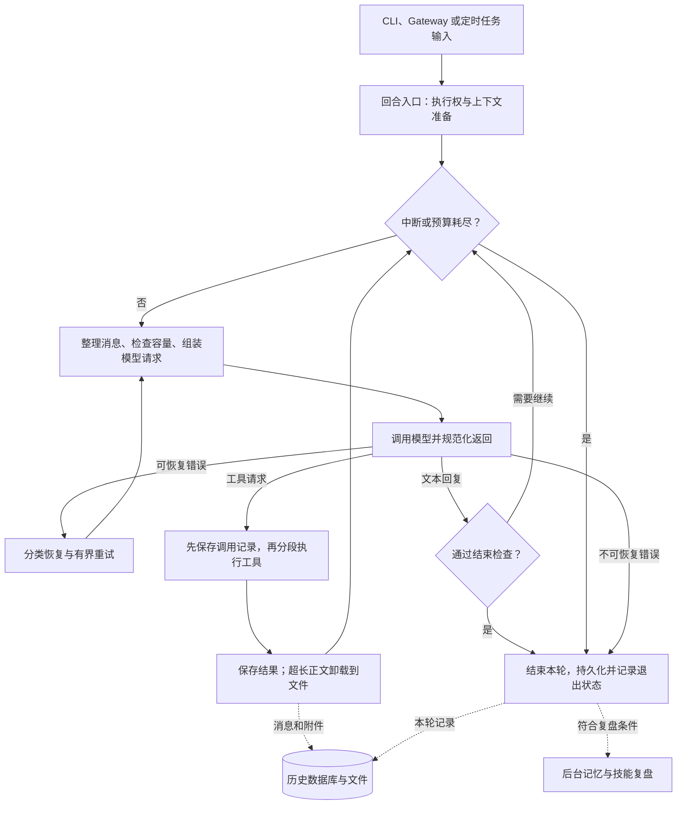
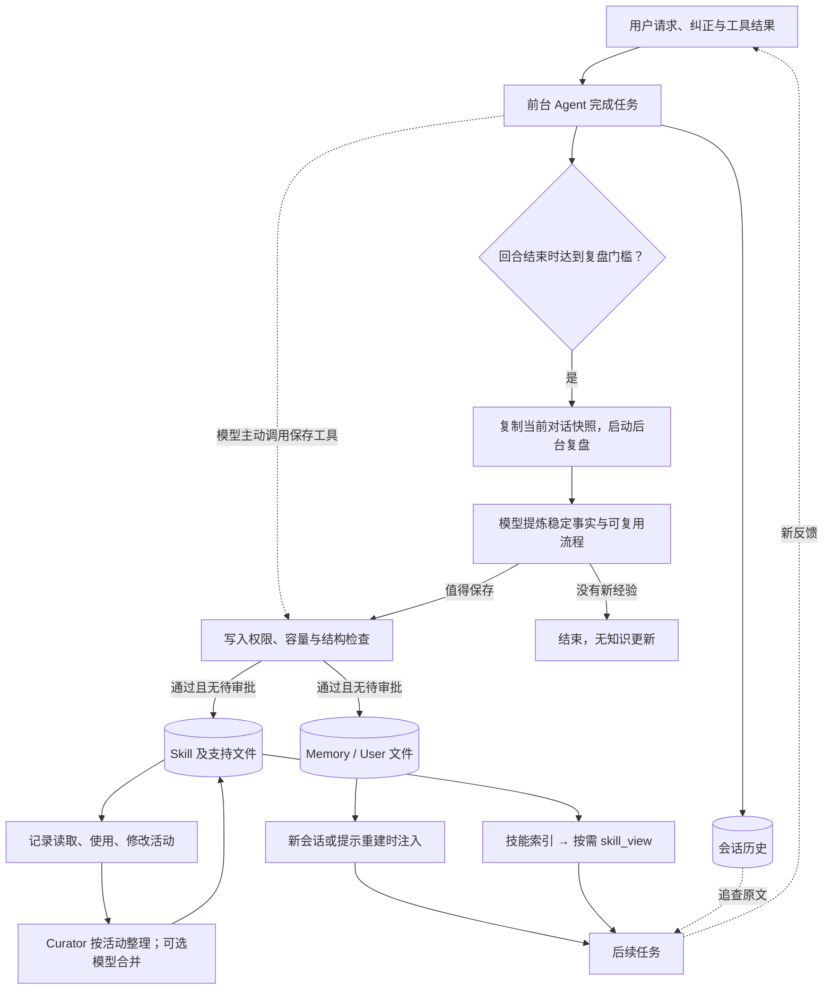
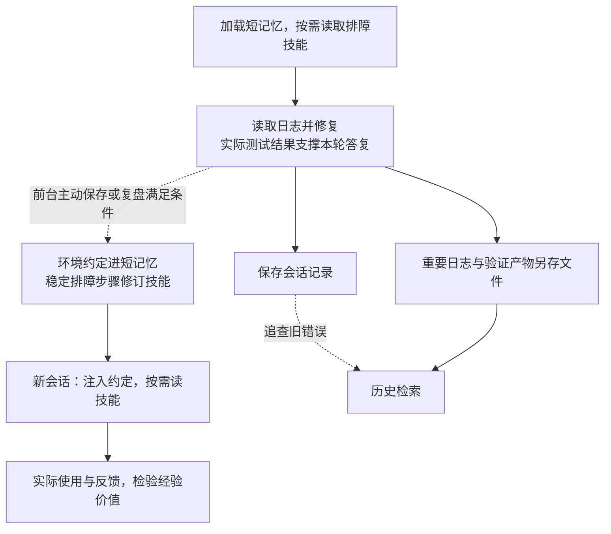

# Hermes Agent 设计与实现

[返回总览](<Agents 调研.md>)

写作日期：2026-09-07；Memory / Skill 自动学习机制补充：2026-09-15。源码基准：2026-09-06 获取的 [245e48008fa8](https://github.com/NousResearch/hermes-agent/commit/245e48008fa814b3251f50755eb656bd9fb86cb1)，提交者时间（committer date）为北京时间 2026-09-06 08:00:18。本文沿用这一固定版本，依据源码和随仓库保存的官方文档分析实现，未安装或运行项目；学习效果、实际召回率及运行成本不在本次验证范围内。

## 1. 设计目标与核心取舍

Hermes 让前台完成任务，后台把经验整理为短记忆和技能；后续任务直接读取精选知识，必要时检索原始对话。长期状态落在可检查、可编辑的文件和历史库中，当前窗口则可用摘要腾出空间。

`AIAgent` 通过混入类和辅助模块组织模型调用、工具、压缩与记忆，并预留外部服务接口。本文分析 Hermes 自己的 Python loop；可选 `codex_app_server` 会把整个回合交给另一运行时，生命周期边界不同。[主入口与运行时分支](https://github.com/NousResearch/hermes-agent/blob/245e48008fa814b3251f50755eb656bd9fb86cb1/agent/conversation_loop.py#L1390-L1477)、[上下文引擎扩展](https://github.com/NousResearch/hermes-agent/blob/245e48008fa814b3251f50755eb656bd9fb86cb1/website/docs/developer-guide/context-compression-and-caching.md#L10-L33)

## 2. 模块职责与状态分层

**模型当前可见内容与磁盘原文分开管理**：预览、摘要进入请求，历史与附件按各自生命周期保存。

| 层次 | 模块或存储 | 内容与读取方式 |
| --- | --- | --- |
| 回合入口 | `turn_facade`、`turn_context` | 接纳输入、取得执行权、恢复提示和消息。 |
| 调用循环 | `conversation_loop`、`turn_*` | 跟踪预算、重试、回复和退出原因。 |
| 活跃上下文 | 消息列表、`ContextCompressor` | 向模型发送提示、摘要、近期消息和工具结果。 |
| 常驻记忆 | `memories/MEMORY.md`、`USER.md` | 精选事实和用户信息，建立或刷新提示时整体注入。 |
| 程序性知识 | `skills/` | 先展示目录，再按需读取正文、脚本和模板。 |
| 历史与附件 | `state.db`、`cache/spillover/` | 分别保存可检索消息和超长工具正文。 |

主目录由 `HERMES_HOME` 决定，通常为 `~/.hermes`；profile 改变目录范围。同档案会话共享记忆和技能，各 Agent 的运行消息与提示快照仍独立，后台因此可更新知识而不重写前台会话。[记忆目录解析](https://github.com/NousResearch/hermes-agent/blob/245e48008fa814b3251f50755eb656bd9fb86cb1/tools/memory_tool.py#L38-L60)、[记忆实例与快照](https://github.com/NousResearch/hermes-agent/blob/245e48008fa814b3251f50755eb656bd9fb86cb1/tools/memory_tool_store.py#L66-L84)、[后台复盘的持久化分离](https://github.com/NousResearch/hermes-agent/blob/245e48008fa814b3251f50755eb656bd9fb86cb1/agent/background_review.py#L825-L856)

## 3. Agent loop：一个用户回合如何走完

下图展示常规路径，省略模型服务适配和部分清理分支。一个用户回合可以包含多次模型调用；一次模型调用又可以返回多个工具请求。



### 3.1 入口与执行顺序

`TurnFacadeMixin` 管理跨进程回合租约；新任务取消后台复盘，采用有界等待。`build_turn_context` 恢复提示和历史、记录用户输入并初始化计数；配置外部记忆服务时，还会通知回合开始并预取有语义的输入。[回合入口](https://github.com/NousResearch/hermes-agent/blob/245e48008fa814b3251f50755eb656bd9fb86cb1/agent/turn_facade.py#L1-L49)、[复盘取消](https://github.com/NousResearch/hermes-agent/blob/245e48008fa814b3251f50755eb656bd9fb86cb1/agent/background_review.py#L119-L143)、[外部记忆预取](https://github.com/NousResearch/hermes-agent/blob/245e48008fa814b3251f50755eb656bd9fb86cb1/agent/turn_context.py#L671-L691)

| 阶段 | 正常路径 | 失败或并发边界 |
| --- | --- | --- |
| 准备 | `begin_iteration` 查预算；`prepare_iteration` 整理消息与追加指令 | 中断或额度耗尽则停止。 |
| 模型返回 | 规范化后进入工具回合或文本结束检查 | 可恢复错误进入有界重试。 |
| 工具调用 | 启用会话持久化时，先保存调用记录，再执行 | 保存失败即结束；执行结果未持久化也不再交给模型。 |
| 工具分段 | 依给出顺序规划批次，结果接回消息列表 | 可并行读取、互不重叠文件操作及允许并发的 MCP 同批；其余串行。 |

先记录再执行可减少记录缺失，但不构成外部操作的完整事务。超长结果会在接回循环时卸载。[工具执行前后的持久化检查](https://github.com/NousResearch/hermes-agent/blob/245e48008fa814b3251f50755eb656bd9fb86cb1/agent/turn_tool_round.py#L120-L160)、[循环控制流](https://github.com/NousResearch/hermes-agent/blob/245e48008fa814b3251f50755eb656bd9fb86cb1/agent/conversation_loop.py#L1479-L1530)、[分段执行入口](https://github.com/NousResearch/hermes-agent/blob/245e48008fa814b3251f50755eb656bd9fb86cb1/run_agent.py#L1272-L1295)、[结果卸载接入点](https://github.com/NousResearch/hermes-agent/blob/245e48008fa814b3251f50755eb656bd9fb86cb1/agent/tool_executor.py#L986-L999)

### 3.2 结束、重试与预算

| 条件 | 默认处理 | 范围 |
| --- | --- | --- |
| 文本返回 | 空回复恢复；仅确认意图等情况可能继续 | 通过结束检查才保存最终消息。 |
| API 错误 | 最多尝试 3 次，按错误退避、切换或失败 | 上下文溢出另受压缩重试预算约束。 |
| 迭代额度 | `max_iterations = sys.maxsize`，近乎无上限 | 调用方可设额度及运行时间预算。 |
| 中断与收尾 | 循环及工具等待处查中断；`finalize_turn` 记录退出原因 | 完成、失败、中断分别记录，再判断是否复盘。 |
| 委派 | 子任务重新建立迭代预算 | 父额度不是整棵任务树的总额。 |

[文本结束入口](https://github.com/NousResearch/hermes-agent/blob/245e48008fa814b3251f50755eb656bd9fb86cb1/agent/turn_final_response.py#L46-L97)、[API 重试默认值](https://github.com/NousResearch/hermes-agent/blob/245e48008fa814b3251f50755eb656bd9fb86cb1/agent/agent_init.py#L1341-L1346)、[迭代入口和预算](https://github.com/NousResearch/hermes-agent/blob/245e48008fa814b3251f50755eb656bd9fb86cb1/agent/turn_iteration_prep.py#L220-L286)、[构造器默认值](https://github.com/NousResearch/hermes-agent/blob/245e48008fa814b3251f50755eb656bd9fb86cb1/run_agent.py#L231-L246)、[子任务预算](https://github.com/NousResearch/hermes-agent/blob/245e48008fa814b3251f50755eb656bd9fb86cb1/tools/delegate_tool.py#L175-L188)

## 4. 自主学习：从交互经验到下次复用

**Hermes 的自动学习，是让模型把交互经验写成持久知识，再在后续任务中读取。** 运行时负责提供材料、安排复盘、执行写入和管理容量；模型判断哪些经验值得保存、如何概括、修改哪条记忆或哪个技能。这条路径没有训练步骤，不更新模型权重，也没有以任务成功率为奖励的自动优化器。

### 4.1 学什么：Memory、Skill 与历史各有用途

| 载体 | 保存什么 | 谁决定内容 | 下次如何使用 |
| --- | --- | --- | --- |
| `USER.md` | 用户身份、长期偏好与工作风格 | 前台模型或后台复盘模型调用 `memory(target="user")` | 建立提示时整体注入。 |
| `MEMORY.md` | 跨任务适用的稳定环境事实、长期约定 | 模型调用 `memory(target="memory")` | 建立提示时整体注入，受严格字符预算限制。 |
| `SKILL.md` 与支持文件 | 某类任务的步骤、命令、判断条件、踩坑经验及该类任务的用户偏好 | 模型调用 `skill_manage` | 先读技能索引，匹配任务后再加载正文。 |
| 会话历史 | 本次进度、具体错误、原始工具结果和临时事实 | 运行时保存交互记录 | 需要时用 `session_search` 搜索或续读。 |

当前提示明确强调 **任务经验优先进入 Skill，Memory 只留跨任务事实**。例如，“用户偏好简短答复”可进用户记忆；“评审代码时先列出阻塞问题，每项附文件位置”应进入代码评审技能。提示还要求记忆用陈述事实的方式书写，避免变成脱离语境的永久命令。[Memory 引导](https://github.com/NousResearch/hermes-agent/blob/245e48008fa814b3251f50755eb656bd9fb86cb1/agent/prompt_builder.py#L161-L198)、[记忆工具的保存范围](https://github.com/NousResearch/hermes-agent/blob/245e48008fa814b3251f50755eb656bd9fb86cb1/tools/memory_tool.py#L215-L244)



### 4.2 何时学：前台主动保存与后台计数触发

前台收到用户纠正、发现有效方法或发现旧技能有误时，提示会引导它直接调用保存工具；这条路径不需要等计数达到门槛。**是否执行保存仍由模型选择，提示本身不会写文件。** [前台技能引导](https://github.com/NousResearch/hermes-agent/blob/245e48008fa814b3251f50755eb656bd9fb86cb1/agent/prompt_builder.py#L1300-L1323)

后台复盘则由代码安排，主要调用链是：

```text
build_turn_context → _tick_memory_nudge       # 用户回合计数
prepare_iteration                           # 调用循环迭代计数
finalize_turn → _spawn_background_review     # 回合结束后判断
  → 立即启动，或进入本地模型空闲队列
  → _run_review_in_thread → _run_review_fork
  → 独立 AIAgent.run_conversation(复盘提示, 对话快照)
  → memory / skill_manage → 磁盘知识
```

| 路径 | 默认门槛 | 计数与触发细节 |
| --- | --- | --- |
| Memory 复盘 | `memory.nudge_interval: 10` | 在回合准备时累计；要求内置存储存在且 `memory` 工具可用，达到门槛即清零并设置本轮复盘标志。 |
| Skill 复盘 | `skills.creation_nudge_interval` 缺省为 `10` | `prepare_iteration` 每次加一，累计可跨本 Agent 的多个回合；结束时检查并清零。不是 10 次成功工具调用，也不是 10 个用户回合。 |
| 前台保存 | 无最低回合数 | `memory` 或 `skill_manage` 进入工具执行前，会清零各自计数；该位置尚未拿到执行结果，因此失败的保存尝试也可能重置计数。 |
| 手动复盘 | `/refine [关注点]` | 直接走同一后台机制，不要求达到计数门槛；可将关注点追加到复盘提示。开关绕过的实现细节见 4.6。 |

两种计数在回合结束处汇合：有非空最终回复、未中断、未设置 `skip_background_review`，且至少一种复盘到期，才尝试启动。二者同时到期时使用合并提示，一次处理记忆与技能；只有一个到期则选择对应提示。`review_memory` / `review_skills` 决定提示侧重点，实际可调用工具另由白名单控制。[计数实现](https://github.com/NousResearch/hermes-agent/blob/245e48008fa814b3251f50755eb656bd9fb86cb1/agent/turn_context.py#L527-L551)、[迭代计数](https://github.com/NousResearch/hermes-agent/blob/245e48008fa814b3251f50755eb656bd9fb86cb1/agent/turn_iteration_prep.py#L49-L51)、[工具执行前重置](https://github.com/NousResearch/hermes-agent/blob/245e48008fa814b3251f50755eb656bd9fb86cb1/agent/tool_executor.py#L672-L678)、[结束条件](https://github.com/NousResearch/hermes-agent/blob/245e48008fa814b3251f50755eb656bd9fb86cb1/agent/turn_finalizer.py#L587-L616)、[提示选择](https://github.com/NousResearch/hermes-agent/blob/245e48008fa814b3251f50755eb656bd9fb86cb1/agent/background_review.py#L1119-L1147)

这些门槛只代表“提供一次复盘机会”。代码没有要求任务必须通过测试或 `completed=True`，也没有为所有未执行的复盘建立持久重试队列。触发后可能因关闭自动复盘、已有复盘运行、运行时不支持工具或进程退出而没有落盘产物。恢复会话时，Memory 计数可按历史用户消息数取模回填；它不是全局、持久的“已学习回合数”。[启动门控](https://github.com/NousResearch/hermes-agent/blob/245e48008fa814b3251f50755eb656bd9fb86cb1/run_agent.py#L734-L796)、[工具能力检查](https://github.com/NousResearch/hermes-agent/blob/245e48008fa814b3251f50755eb656bd9fb86cb1/agent/background_review.py#L1046-L1055)

### 4.3 后台如何复盘：复制上下文，共享知识存储

复盘不是在前台回复后附上一段“请反思”，而是创建另一个 `AIAgent`，把当前对话的结构副本与复盘提示作为输入。这里的“当前对话”可能已经压缩过，不等于数据库里的全部原始历史。

| 维度 | 实现方式 | 设计含义 |
| --- | --- | --- |
| 同模型输入 | 继承前台运行时、提示、工具定义与相关请求参数，重放完整快照 | 尽量命中已有前缀缓存；不代表免除模型费用。 |
| 不同模型输入 | 保留最近约 24 条消息；更旧用户文本截到 300 字符、助手文本截到 200 字符，并保留工具名称 | `_digest_history` 做确定性的文本缩略，旧工具结果正文不进入该摘要，细节可能丢失。 |
| 会话隔离 | 深复制嵌套消息；关闭会话持久化，解绑 `_session_db` 和压缩器数据库 | 后台整理提示与压缩结果不会写回前台对话。 |
| 知识写入 | 复用父 Agent 的内置 `_memory_store`；技能写到当前 profile 的技能目录 | 会话被隔离，Memory / Skill 仍可更新。 |
| 外部记忆 | 构造时 `skip_memory=True`，不初始化外部 Memory Provider | 避免把后台复盘提示当成用户经历交给外部记忆服务。 |
| 成本与停止 | 最多 16 次循环迭代；默认累计输入预算 600,000 tokens；关闭自身两个 nudge | 不会递归复盘自己；输入预算在下一次迭代开头检查，越过预算的当前请求会先完成。 |

[快照克隆入口](https://github.com/NousResearch/hermes-agent/blob/245e48008fa814b3251f50755eb656bd9fb86cb1/run_agent.py#L752-L758)、[异模型摘要](https://github.com/NousResearch/hermes-agent/blob/245e48008fa814b3251f50755eb656bd9fb86cb1/agent/background_review.py#L264-L295)、[复盘实例构建](https://github.com/NousResearch/hermes-agent/blob/245e48008fa814b3251f50755eb656bd9fb86cb1/agent/background_review.py#L770-L875)、[执行入口](https://github.com/NousResearch/hermes-agent/blob/245e48008fa814b3251f50755eb656bd9fb86cb1/agent/background_review.py#L973-L1010)、[累计预算检查](https://github.com/NousResearch/hermes-agent/blob/245e48008fa814b3251f50755eb656bd9fb86cb1/agent/conversation_loop.py#L103-L111)

**前台优先。** 新用户回合会取消正在运行的复盘，最多等 2 秒确认后继续。若复盘路由到 Hermes 管理的本地 `llama-server`，默认 `defer: auto` 会先放入内存队列，等前台至少安静 15 秒且服务空闲再派发；排队超过默认 30 分钟则可越过空闲条件。每会话只保留最新快照；这种本地延后模式被抢占后最多重排 3 次，队列不保证进程重启后恢复。[前台取消](https://github.com/NousResearch/hermes-agent/blob/245e48008fa814b3251f50755eb656bd9fb86cb1/agent/background_review.py#L119-L143)、[空闲调度](https://github.com/NousResearch/hermes-agent/blob/245e48008fa814b3251f50755eb656bd9fb86cb1/agent/review_idle_queue.py#L1-L39)、[队列合并与派发](https://github.com/NousResearch/hermes-agent/blob/245e48008fa814b3251f50755eb656bd9fb86cb1/agent/review_idle_queue.py#L94-L160)、[有界重排](https://github.com/NousResearch/hermes-agent/blob/245e48008fa814b3251f50755eb656bd9fb86cb1/run_agent.py#L801-L820)

### 4.4 如何把经验变成更新：学习策略主要写在提示里

Memory 复盘提示着重寻找用户身份、偏好、行为期待和工作方式，允许返回“没有值得保存的内容”。Skill 复盘提示更积极：用户纠正、有效技巧、新工作流、旧技能缺漏，都被视为更新信号。其修改顺序是：

1. **修订本次加载过且允许后台修改的技能**，把纠正直接写进相关步骤。
2. 若没有合适的当前技能，查找并修订已有的同类任务技能。
3. 需要更多细节时，在已有技能下补 `references/`、`templates/` 或 `scripts/`，并在 `SKILL.md` 中添加入口。
4. 只有没有合适归属时，才新建覆盖一类任务的技能。

提示要求写“操作规则 + 原因”，去掉会话叙事、重复规则和临时错误；旧规则错误时原位修正，避免在后面追加相互矛盾的补丁说明。某个工具尚未配置好，应保存已验证的配置修复办法，不能把“工具不可用”固化成永久限制。没有找到有效方法的失败尝试，不应被包装成可靠流程。[Memory 复盘提示](https://github.com/NousResearch/hermes-agent/blob/245e48008fa814b3251f50755eb656bd9fb86cb1/agent/background_review.py#L301-L310)、[知识提炼与排除规则](https://github.com/NousResearch/hermes-agent/blob/245e48008fa814b3251f50755eb656bd9fb86cb1/agent/background_review.py#L315-L365)、[Skill 复盘策略](https://github.com/NousResearch/hermes-agent/blob/245e48008fa814b3251f50755eb656bd9fb86cb1/agent/background_review.py#L368-L450)

**这些语义规则依赖模型遵循。** 程序不会自动证明一条经验正确，也不会检查新技能是否比旧技能提高成功率。默认后台工具范围不含终端，因此这次复盘通常是在已有证据上整理，不能再运行新写的脚本完成验证。

例如，本次已验证“先启动依赖容器，再运行集成测试”，而已有测试技能漏掉了第一步。假设该技能允许后台维护，模型可生成以下调用；工具负责把模型给出的补丁写入文件，不会自行推导新步骤：

```text
skill_view(name="project-testing")
skill_manage(
  action="patch", name="project-testing",
  old_string="运行集成测试。",
  new_string="启动依赖容器并确认健康后，再运行集成测试。"
)
```

`patch` 读取当前文件，调用文本匹配引擎替换目标片段，默认要求唯一匹配，然后检查更新后结构与大小并原子保存；工具也支持 `create` 新建技能、`write_file` 增加支持材料。写后才记录变更与使用元数据。这个过程实现的是“模型提出内容 → 工具受约束地编辑”，不存在自动生成新规则的固定算法。[补丁实现](https://github.com/NousResearch/hermes-agent/blob/245e48008fa814b3251f50755eb656bd9fb86cb1/tools/skill_manager_tool.py#L433-L481)、[创建实现](https://github.com/NousResearch/hermes-agent/blob/245e48008fa814b3251f50755eb656bd9fb86cb1/tools/skill_manager_tool.py#L393-L415)、[操作分发与记录](https://github.com/NousResearch/hermes-agent/blob/245e48008fa814b3251f50755eb656bd9fb86cb1/tools/skill_manager_tool.py#L736-L778)

### 4.5 哪些由代码强制：写入保护、审批与可追溯性

| 约束 | 代码实际执行的规则 | 边界 |
| --- | --- | --- |
| 工具范围 | 调度端只放行可用的 Memory / Skills 工具及 `read_file`、`search_files` | 默认不放行终端和通用文件写工具；`extra_tools` 可显式扩展，但不能凭空提供父 Agent 没有的工具。 |
| 技能归属 | 后台修改既有技能前检查管理标记；拒绝用户自有、pinned、external、bundled、Hub 技能 | 前台创建的技能默认属于用户；后台创建才记为 `created_by: "agent"`。用户可用 `hermes curator adopt <name>` 移交管理。 |
| 写前重读 | 修改既有正文或支持文件前，必须在本次复盘中读取该文件 | `skill_view` 和完整 `read_file` 都可建立读取标记；仅在旧对话里出现过不算，新建文件不要求先读。 |
| 结构与容量 | 校验名称、YAML 的 `name` / `description`、非空正文和大小 | 新建技能描述须放入 60 字符索引预算；正文上限 100,000 字符，支持文件写入上限 1 MiB。 |
| 内容检查 | 编写规范 lint 返回建议；`skills.guard_agent_created` 可开启安全扫描 | lint 建议不阻止保存；安全扫描默认关闭，均不等于流程有效性测试。 |
| 写入审批 | `memory.write_approval` / `skills.write_approval` 默认均为 `false` | 开启后，后台写入进入 pending；`success: true, staged: true` 表示已暂存，尚未写入知识文件。 |
| 变更记录 | 技能写入后记录 `.usage.json`、台账与前后文件快照，并清理技能索引构建缓存 | 台账默认开启但属尽力记录，记录失败不阻止修改；不保证每次变更都有完整回滚证据。 |

`created_by: "agent"` 在这里实际承担“允许整理器管理”的策略标记，不能仅凭字段名把它理解为严格作者证明；`adopt` 也会设置该标记。后台读写保护适用于自动复盘及采用同一后台身份的 Curator LLM 合并；Curator 的无模型归档阶段另有候选规则，见 7.1。[归属检查](https://github.com/NousResearch/hermes-agent/blob/245e48008fa814b3251f50755eb656bd9fb86cb1/tools/skill_manager_guards.py#L164-L224)、[标记含义](https://github.com/NousResearch/hermes-agent/blob/245e48008fa814b3251f50755eb656bd9fb86cb1/tools/skill_usage.py#L271-L278)、[前台与后台创建记录](https://github.com/NousResearch/hermes-agent/blob/245e48008fa814b3251f50755eb656bd9fb86cb1/tools/skill_manager_tool.py#L713-L727)

审批开启后，技能变更始终暂存，用户通过 `/skills pending`、`/skills diff <id>`、`/skills approve <id>` 检查并应用；Memory 后台变更同样暂存，前台则在存在交互通道时尝试当场询问。它是可选的用户控制，不是默认自动学习的必经审批。[审批默认配置](https://github.com/NousResearch/hermes-agent/blob/245e48008fa814b3251f50755eb656bd9fb86cb1/hermes_cli/config_defaults.py#L1191-L1201)、[技能审批与台账配置](https://github.com/NousResearch/hermes-agent/blob/245e48008fa814b3251f50755eb656bd9fb86cb1/hermes_cli/config_defaults.py#L1333-L1341)、[审批决策](https://github.com/NousResearch/hermes-agent/blob/245e48008fa814b3251f50755eb656bd9fb86cb1/tools/write_approval.py#L170-L185)

<details>
<summary>源码依据：白名单、写前读取、结构校验和台账</summary>

[后台白名单](https://github.com/NousResearch/hermes-agent/blob/245e48008fa814b3251f50755eb656bd9fb86cb1/agent/background_review.py#L918-L954)、[读取标记与守卫](https://github.com/NousResearch/hermes-agent/blob/245e48008fa814b3251f50755eb656bd9fb86cb1/tools/skill_manager_guards.py#L56-L78)、[完整文件读取接入](https://github.com/NousResearch/hermes-agent/blob/245e48008fa814b3251f50755eb656bd9fb86cb1/tools/file_tools.py#L523-L533)、[容量常量](https://github.com/NousResearch/hermes-agent/blob/245e48008fa814b3251f50755eb656bd9fb86cb1/tools/skill_manager_tool.py#L81-L86)、[元数据校验](https://github.com/NousResearch/hermes-agent/blob/245e48008fa814b3251f50755eb656bd9fb86cb1/tools/skill_manager_tool.py#L130-L176)、[建议性 lint](https://github.com/NousResearch/hermes-agent/blob/245e48008fa814b3251f50755eb656bd9fb86cb1/tools/skill_manager_tool.py#L370-L383)、[可选扫描](https://github.com/NousResearch/hermes-agent/blob/245e48008fa814b3251f50755eb656bd9fb86cb1/tools/skill_manager_tool.py#L40-L64)、[写后记录](https://github.com/NousResearch/hermes-agent/blob/245e48008fa814b3251f50755eb656bd9fb86cb1/tools/skill_manager_tool.py#L695-L733)、[台账及快照位置](https://github.com/NousResearch/hermes-agent/blob/245e48008fa814b3251f50755eb656bd9fb86cb1/tools/skill_ledger.py#L66-L108)、[台账尽力写入](https://github.com/NousResearch/hermes-agent/blob/245e48008fa814b3251f50755eb656bd9fb86cb1/tools/skill_ledger.py#L246-L288)

</details>

### 4.6 控制开关与本版本的实现细节

| 想控制的行为 | 配置或命令 | 实际范围 |
| --- | --- | --- |
| 停止自动后台复盘 | `auxiliary.background_review.enabled: false` | 不禁用前台 `memory` / `skill_manage` 保存。 |
| 单独停止计数触发 | `memory.nudge_interval: 0` / `skills.creation_nudge_interval: 0` | 停止各自周期触发；保存工具仍可用。 |
| 指定复盘模型 | `auxiliary.background_review.provider` 与 `model` | 默认沿用主模型；配置其他具体 provider + model 才走独立路由，解析失败回退主模型。 |
| 控制复盘输入预算 | `auxiliary.background_review.max_input_tokens` | 缺省 600,000；`<= 0` 关闭这项累计输入限制，并非关闭复盘。 |
| 改变本地复盘时机 | `auxiliary.background_review.defer: never` | 取消托管本地模型的空闲延后；其他运行时默认就立即尝试启动。 |
| 手动提炼经验 | `/refine 把本次验证成功的流程整理进相关技能` | 不依赖计数，关注点追加到复盘提示；依旧受工具和技能归属保护。 |

需要按代码理解两处细节：

- **默认间隔与示例不同。** `agent_init.py` 的技能间隔回退值为 10，但 `cli-config.yaml.example` 写的是 15；采用示例配置时实际按 15，不能把示例值当成未配置默认值。
- **裸 `/refine` 不总能绕过关闭开关。** `_spawn_background_review` 以 `focus is None` 判断是否检查自动开关。CLI 的 `explicit=True` 只绕过空闲延后，未绕过该开关；CLI / Gateway 都把空关注点传成 `None`。因此，本快照中关闭自动复盘后，带关注点的 `/refine ...` 可绕过开关，裸命令可能被跳过。Gateway 的裸命令也未传 `explicit=True`，仍可能进入本地空闲队列。这是调用链静态核查到的行为，与“手动复盘总能绕过”的泛化描述有差异。

[间隔回退值](https://github.com/NousResearch/hermes-agent/blob/245e48008fa814b3251f50755eb656bd9fb86cb1/agent/agent_init.py#L1295-L1299)、[示例配置](https://github.com/NousResearch/hermes-agent/blob/245e48008fa814b3251f50755eb656bd9fb86cb1/cli-config.yaml.example#L1068)、[开关与延后分支](https://github.com/NousResearch/hermes-agent/blob/245e48008fa814b3251f50755eb656bd9fb86cb1/run_agent.py#L734-L763)、[CLI 手动入口](https://github.com/NousResearch/hermes-agent/blob/245e48008fa814b3251f50755eb656bd9fb86cb1/hermes_cli/cli_commands_mixin.py#L2144-L2161)、[Gateway 手动入口](https://github.com/NousResearch/hermes-agent/blob/245e48008fa814b3251f50755eb656bd9fb86cb1/gateway/slash_commands_goals.py#L285-L301)、[模型路由](https://github.com/NousResearch/hermes-agent/blob/245e48008fa814b3251f50755eb656bd9fb86cb1/agent/background_review.py#L201-L242)

**因此，“越用越会”应拆成三个可检查结果：有无保存、后续是否加载、加载后是否做得更好。** Hermes 实现了前两项的写入与读取机制，并记录部分使用活动；第三项仍要靠真实任务的验证结果和用户反馈，不能从技能数量增长或一次复盘完成直接推断。


## 5. 上下文管理：预算、压缩与恢复

### 5.1 预算与默认开关

触发点以 **`(模型窗口 − max_tokens) × 比例`** 为基础，再应用最小阈值保护和可选绝对上限；用量优先取 API 返回值，缺失时估算。无额外限制时，128K 窗口、16K 输出预留、75% 比例约对应 84K tokens。[阈值计算实现](https://github.com/NousResearch/hermes-agent/blob/245e48008fa814b3251f50755eb656bd9fb86cb1/agent/context_compressor.py#L2204-L2253)

| 配置或条件 | 默认值 | 影响 |
| --- | --- | --- |
| `compression.enabled` / `in_place` | 均开启 | 原地压缩，保留会话 ID 和历史搜索能力。 |
| `compression.threshold` | 基础 0.50 | 窗口低于 512K 时至少 75%；部分 Codex 路由提高至 85%。 |
| Gateway 回合前检查 | 独立的 85% | 与循环内压缩阈值分开。 |
| `compression.tail_mode` | `lean` | 尾部为窗口的 2.5%，最低 10K、最高 25K tokens。 |
| `legacy` 尾部模式 | `threshold_tokens × target_ratio` | `target_ratio` 默认 0.20，大窗口可能留更多原文。 |
| `protect_last_n` | 20 | 近期消息基础保护数，压力下仍有进一步处理。 |
| `min_tail_user_messages` | 1，最低为 1 | 保护真实用户消息。 |
| `idle_compact_after_seconds` | 0，关闭 | 可配置空闲后恢复时压缩。 |

表中后三项也属于 `compression`。用户消息保护和调用配对可使尾部超过软预算，极大工具正文仍可能被裁减。[Gateway 与模型特例](https://github.com/NousResearch/hermes-agent/blob/245e48008fa814b3251f50755eb656bd9fb86cb1/website/docs/developer-guide/context-compression-and-caching.md#L36-L118)、[默认配置解析](https://github.com/NousResearch/hermes-agent/blob/245e48008fa814b3251f50755eb656bd9fb86cb1/agent/agent_init.py#L1420-L1468)、[尾部预算](https://github.com/NousResearch/hermes-agent/blob/245e48008fa814b3251f50755eb656bd9fb86cb1/agent/context_compressor.py#L1779-L1787)、[压力下的工具裁减](https://github.com/NousResearch/hermes-agent/blob/245e48008fa814b3251f50755eb656bd9fb86cb1/agent/context_compressor.py#L2659-L2707)

### 5.2 压缩后留下什么，失败后如何继续

压缩先清理旧工具结果与空消息，再总结中段、补充机械索引并修复工具调用配对。[压缩主流程](https://github.com/NousResearch/hermes-agent/blob/245e48008fa814b3251f50755eb656bd9fb86cb1/agent/context_compressor.py#L4578-L4655)

| 部分或状态 | 处理结果 | 恢复与损失边界 |
| --- | --- | --- |
| 中段对话 | 辅助模型摘要 + 标识符索引 + 预算内用户原文 + 恢复提示 | 超大输入会采样，摘要和原文保留都有损失。 |
| 近期尾部 | 保留近期消息；`lean` 可将较旧工具结果改为短占位 | 精确错误、路径或旧决策仍可能需要历史查询。 |
| 已概括消息 | 原地标记 `active=0, compacted=1` | 退出模型请求，保留会话 ID，仍可 `session_search`。 |
| 摘要服务不可用 | 自动压缩冷却 60、300、900 秒 | 连续无效压缩暂停自动尝试。 |
| 手动压缩或明确溢出 | `/compress` 或恢复路径重试 | 各受自己的尝试预算约束。 |

[摘要的机械补充与采样入口](https://github.com/NousResearch/hermes-agent/blob/245e48008fa814b3251f50755eb656bd9fb86cb1/agent/context_compressor.py#L3094-L3135)、[原地压缩及失败处理](https://github.com/NousResearch/hermes-agent/blob/245e48008fa814b3251f50755eb656bd9fb86cb1/website/docs/developer-guide/context-compression-and-caching.md#L75-L155)、[触发与熔断](https://github.com/NousResearch/hermes-agent/blob/245e48008fa814b3251f50755eb656bd9fb86cb1/agent/context_compressor.py#L2440-L2467)

### 5.3 工具卸载与历史查询的恢复边界

| 机制 | 默认限额与返回 | 失败或持久化边界 |
| --- | --- | --- |
| 工具结果限额 | 大窗口：普通 100K、MCP 50K、同轮 200K 字符；小窗口缩放 | 超限优先写入 `cache/spillover`。 |
| 卸载结果 | 约 1,500 字符预览及路径 | 保存失败则明确提示并截断；`read_file` 豁免重复卸载，多模态另处理。 |
| `session_search` | SQLite FTS5；默认 3 个结果，单条最多 4,000 字符 | 可按会话浏览、围绕消息续读；原记录是预览时只找回预览和路径。 |
| 卸载附件 | 默认清理超过 24 小时的文件 | 重要正文须另存工作文件，历史可查不保证附件仍在。 |

[输出预算](https://github.com/NousResearch/hermes-agent/blob/245e48008fa814b3251f50755eb656bd9fb86cb1/tools/budget_config.py#L7-L112)、[卸载与失败处理](https://github.com/NousResearch/hermes-agent/blob/245e48008fa814b3251f50755eb656bd9fb86cb1/tools/tool_result_storage.py#L192-L230)、[搜索返回形态](https://github.com/NousResearch/hermes-agent/blob/245e48008fa814b3251f50755eb656bd9fb86cb1/tools/session_search_tool.py#L250-L269)、[搜索默认参数](https://github.com/NousResearch/hermes-agent/blob/245e48008fa814b3251f50755eb656bd9fb86cb1/tools/session_search_tool.py#L533-L547)、[附件清理](https://github.com/NousResearch/hermes-agent/blob/245e48008fa814b3251f50755eb656bd9fb86cb1/tools/tool_result_storage.py#L19-L68)

## 6. 持久 Memory：磁盘写入与提示可见分开

### 6.1 存储工具负责可靠写入，模型负责取舍

内置记忆是有界的全量提示块，没有向量索引；条目以 `\n§\n` 分隔，容量按字符计算。[记忆格式与默认容量](https://github.com/NousResearch/hermes-agent/blob/245e48008fa814b3251f50755eb656bd9fb86cb1/tools/memory_tool_store.py#L22-L84)

| 对象或操作 | 保存与使用规则 | 失败或可见性边界 |
| --- | --- | --- |
| `MEMORY.md` / `USER.md` | 稳定环境事实与跨任务约定 2,200 字符；用户信息 1,375 字符 | 同 profile 共享长期知识，各 Agent 保留独立提示快照。 |
| 写入 | 加锁 → 重读磁盘 → 检查漂移 → 变更 → 原子保存 | 添加去除完全重复；替换、删除需唯一子串匹配。 |
| 批量整理 | 按最终内容检查容量，允许先删减再添加 | 多条匹配报错；满容量返回条目和用量，由模型合并，不静默丢弃。 |
| 连续失败 | 前 3 次整理失败返回错误和重试材料，超过后返回 `done: true` 并要求停止 | 成功写入与新回合会重置失败计数；这是工具返回的停止信号，不是全面禁用后续工具调用。 |
| 安全检查 | 加载、写入检测注入和外传等模式 | 加载可用阻断提示代替危险条目，磁盘原文保留供检查。 |
| 提示刷新 | 写工具立即更新磁盘和实时存储 | 已建提示前缀不逐次刷新；新会话或压缩后失效重建才重新加载。 |

**保存成功不等于下一次模型请求已读取新快照。** 工具响应与提示重建衔接这两个时间点。[压缩后的快照刷新](https://github.com/NousResearch/hermes-agent/blob/245e48008fa814b3251f50755eb656bd9fb86cb1/agent/system_prompt.py#L650-L668)

<details>
<summary>源码依据：记忆写入、容量与失败处理</summary>

[写入流程](https://github.com/NousResearch/hermes-agent/blob/245e48008fa814b3251f50755eb656bd9fb86cb1/tools/memory_tool_store.py#L190-L212)、[替换、删除与批量操作](https://github.com/NousResearch/hermes-agent/blob/245e48008fa814b3251f50755eb656bd9fb86cb1/tools/memory_tool_store.py#L236-L315)、[失败次数限制及加载检查](https://github.com/NousResearch/hermes-agent/blob/245e48008fa814b3251f50755eb656bd9fb86cb1/tools/memory_tool_store.py#L71-L133)

</details>

### 6.2 “自动更新旧记忆”实际上是模型生成替换操作

`MemoryStore` 不做语义冲突消解、重要性评分或自动过期。它能去掉完全相同的条目，并按唯一子串找到要替换的旧条目；“两条表述其实重复”“旧偏好已经失效”“哪些内容应合并腾出空间”仍由模型判断。满容量时，工具返回当前条目和用量，模型再生成 `operations` 批量删减、替换、添加；预算只检查整批执行后的最终状态。[单条与批量操作](https://github.com/NousResearch/hermes-agent/blob/245e48008fa814b3251f50755eb656bd9fb86cb1/tools/memory_tool_store.py#L214-L327)

例如，旧记忆写着“用户默认希望详细解释”，用户后来明确改成“默认简短，只有要求时展开”。合理的学习过程是模型识别偏好变化，调用以下操作，而不是同时保留两条互相矛盾的偏好。此例用于解释接口，未实际写入任何 Hermes 记忆：

```json
{
  "target": "user",
  "operations": [
    {
      "action": "replace",
      "old_text": "用户默认希望详细解释",
      "content": "用户默认偏好简短回答，需要时会明确要求展开。"
    }
  ]
}
```

磁盘保存、模型可见和后续复用是三个时间点：

```text
本次保存：文件更新 → 工具返回保存结果
当前会话：继续使用已冻结的系统提示；前台可从本轮纠正与工具结果理解新偏好
后续新会话 / 压缩后重建：重新读文件 → 新偏好进入系统提示
```

后台共享存储的修改同样不会立即改写父会话已缓存的提示。Skill 更新也只会清理索引构建缓存，不会主动改写前台已有的 `_cached_system_prompt` 或历史工具消息；后续重新读取正文才能看到文件中的新内容。因此，缓存稳定性与知识即时生效之间存在明确取舍。[Memory 冻结快照](https://github.com/NousResearch/hermes-agent/blob/245e48008fa814b3251f50755eb656bd9fb86cb1/tools/memory_tool_store.py#L329-L345)、[提示失效与重读](https://github.com/NousResearch/hermes-agent/blob/245e48008fa814b3251f50755eb656bd9fb86cb1/agent/system_prompt.py#L650-L668)、[Skill 写后缓存处理](https://github.com/NousResearch/hermes-agent/blob/245e48008fa814b3251f50755eb656bd9fb86cb1/tools/skill_manager_tool.py#L695-L711)

### 6.3 外部 Memory Provider 是另一条提取与召回路径

profile 用于组织目录，不是同一系统用户内的权限边界：历史搜索可显式只读打开其他档案数据库，按会话 ID 定位也会查其他档案。删除记忆不会清除历史同文；`memory.provider` 可接外部服务并与内置存储共存，其索引、召回与删除能力由插件决定。[跨档案搜索](https://github.com/NousResearch/hermes-agent/blob/245e48008fa814b3251f50755eb656bd9fb86cb1/tools/session_search_tool.py#L329-L365)、[外部服务初始化](https://github.com/NousResearch/hermes-agent/blob/245e48008fa814b3251f50755eb656bd9fb86cb1/agent/agent_init.py#L1263-L1289)

外部服务接入后，`MemoryManager` 可在回合开始预取相关记忆，在回合结束把输入、回复和可选消息交给 `sync_turn`；压缩前可调 `on_pre_compress`，真实会话边界可调 `on_session_end`。回合同步使用串行后台 worker，CLI `/new` 的结束提取与会话切换也按顺序排入同一个任务，避免旧对话被存入新会话。[回合同步](https://github.com/NousResearch/hermes-agent/blob/245e48008fa814b3251f50755eb656bd9fb86cb1/agent/memory_manager.py#L470-L489)、[会话边界顺序](https://github.com/NousResearch/hermes-agent/blob/245e48008fa814b3251f50755eb656bd9fb86cb1/agent/memory_manager.py#L593-L623)

这些接口不意味着所有插件都会自动抽取知识，更不意味着每次压缩都会无条件提炼并写入内置 `MEMORY.md`。本版本压缩前的记忆回调走外部 manager，能力由具体 provider 实现；内置短记忆的写入仍由 `memory` 工具承担。[Provider 接口](https://github.com/NousResearch/hermes-agent/blob/245e48008fa814b3251f50755eb656bd9fb86cb1/agent/memory_provider.py#L107-L155)、[压缩前回调分支](https://github.com/NousResearch/hermes-agent/blob/245e48008fa814b3251f50755eb656bd9fb86cb1/agent/conversation_compression.py#L2590-L2627)

## 7. 三项与长期使用相关的扩展

### 7.1 技能整理器

回合复盘负责“从这次交互提炼什么”，Curator 负责“已有技能库如何长期维护”。后者读取 `skills/.usage.json` 的活动记录，通过时间阈值决定状态变化，可选再让模型合并重复技能。

| 阶段 | 默认触发与动作 | 保护与限制 |
| --- | --- | --- |
| 常规整理 | 默认开启；每 7 天且空闲至少 2 小时检查 | 首次只登记时间，下个周期才实际整理。 |
| 活动记录 | 保存 `use_count`、`view_count`、`patch_count` 及对应时间 | 成功加载技能就计为使用；计数不等于任务成功次数。 |
| 无模型阶段 | 按最近读取、使用、修改时间中的最新值，30 天标 `stale`，90 天归档 | pinned 与任何定时任务引用的技能跳过，包含暂停的任务；首次见到无记录技能时先建时间基线。 |
| 内置技能归档 | `curator.prune_builtins: true`，默认把 bundled 技能也纳入无模型整理 | Hub / external 技能不属于该候选范围；这与后台 LLM 禁止修改 bundled 内容是两条规则。 |
| LLM 合并 | `curator.consolidate: false`，显式开启后才让模型整理技能库 | 单独使用 `auxiliary.curator` 路由与自身上下文；当前仅提供 Skills 工具，未提供终端。 |

`stale` 技能有了新活动可回到 `active`；归档会移动整个技能包到 `skills/.archive/`，可用 `hermes curator restore <name>` 恢复。LLM 想通过 `skill_manage(delete)` 移除被合并技能，必须声明已存在且不同名的 `absorbed_into` 目标；后台实际执行归档而非永久删除，并由整理流程改写相关定时任务的技能引用。目标存在检查不能证明旧知识已完整迁移，迁移质量仍依赖模型判断。[状态转换](https://github.com/NousResearch/hermes-agent/blob/245e48008fa814b3251f50755eb656bd9fb86cb1/agent/curator.py#L192-L244)、[候选范围](https://github.com/NousResearch/hermes-agent/blob/245e48008fa814b3251f50755eb656bd9fb86cb1/tools/skill_usage.py#L204-L219)、[合并删除保护](https://github.com/NousResearch/hermes-agent/blob/245e48008fa814b3251f50755eb656bd9fb86cb1/tools/skill_manager_guards.py#L241-L260)、[归档实现](https://github.com/NousResearch/hermes-agent/blob/245e48008fa814b3251f50755eb656bd9fb86cb1/tools/skill_manager_tool.py#L485-L520)、[定时引用改写](https://github.com/NousResearch/hermes-agent/blob/245e48008fa814b3251f50755eb656bd9fb86cb1/agent/curator.py#L657-L667)、[LLM 工具范围](https://github.com/NousResearch/hermes-agent/blob/245e48008fa814b3251f50755eb656bd9fb86cb1/agent/curator.py#L1013-L1049)

**使用反馈目前主要用于维护，不是效果评分。** `skill_view` 的非去重成功读取会同时更新 view 与 use，显式技能命令也会更新 use；修订递增 `patch_generation`，后续加载可记录 `reuse_after_patch`。它能说明技能被读过或改后被复用，无法证明遵循了全部步骤、节省了时间或提高了答案质量；后台读取也没有在这一计数入口被排除。以最新活动判断过期还意味着修改本身会延后归档。[读取即使用](https://github.com/NousResearch/hermes-agent/blob/245e48008fa814b3251f50755eb656bd9fb86cb1/tools/skills_tool.py#L640-L659)、[显式加载计数](https://github.com/NousResearch/hermes-agent/blob/245e48008fa814b3251f50755eb656bd9fb86cb1/agent/skill_commands.py#L287-L294)、[改后复用记录](https://github.com/NousResearch/hermes-agent/blob/245e48008fa814b3251f50755eb656bd9fb86cb1/tools/skill_usage.py#L460-L487)、[最新活动口径](https://github.com/NousResearch/hermes-agent/blob/245e48008fa814b3251f50755eb656bd9fb86cb1/tools/skill_usage.py#L106-L110)

运行前的备份、`REPORT.md` / `run.json` 和变更台账便于追查；`hermes curator ledger`、`hermes curator rollback <entry-id>` 可检查或恢复已记录变更。回合复盘则从本次成功工具结果生成通知，并把模型用量归入父会话的 `background_review`，便于区分“启动过复盘”“保存了什么”和“付出了多少调用成本”。[备份与报告](https://github.com/NousResearch/hermes-agent/blob/245e48008fa814b3251f50755eb656bd9fb86cb1/agent/curator.py#L877-L934)、[台账配置与命令](https://github.com/NousResearch/hermes-agent/blob/245e48008fa814b3251f50755eb656bd9fb86cb1/hermes_cli/config_defaults.py#L1337-L1341)、[复盘用量归属](https://github.com/NousResearch/hermes-agent/blob/245e48008fa814b3251f50755eb656bd9fb86cb1/agent/background_review.py#L699-L721)、[复盘变更通知](https://github.com/NousResearch/hermes-agent/blob/245e48008fa814b3251f50755eb656bd9fb86cb1/agent/background_review.py#L1072-L1100)

### 7.2 子任务的隔离与额度

`delegate_task` 建立独立 Agent、消息上下文和终端；父任务传目标与背景，最终摘要受父窗口余量限制。[子任务构造](https://github.com/NousResearch/hermes-agent/blob/245e48008fa814b3251f50755eb656bd9fb86cb1/tools/delegate_tool.py#L175-L188)、[返回摘要预算](https://github.com/NousResearch/hermes-agent/blob/245e48008fa814b3251f50755eb656bd9fb86cb1/tools/delegate_tool_results.py#L226-L265)

| 维度 | 默认或配置 | 边界 |
| --- | --- | --- |
| 记忆与工具 | 跳过内置长期记忆；禁用记忆写入、定时任务和用户询问工具 | 子任务不会按主会话方式积累长期记忆。 |
| 规模 | 最多并发 10 个，深度 1 | 更深委派须配置；每个子任务有自己的迭代预算。 |
| Git 隔离 | `delegation.worktree_isolation` 关闭 | 开启也仅适用于本地后端 Git 项目。 |
| 超时与中断 | 默认无固定总时长；正值超时最低按 30 秒 | 依活动检测停滞；父中断传给子任务。 |

[数量和深度默认值](https://github.com/NousResearch/hermes-agent/blob/245e48008fa814b3251f50755eb656bd9fb86cb1/tools/delegate_tool_config.py#L16-L26)、[可选隔离与超时](https://github.com/NousResearch/hermes-agent/blob/245e48008fa814b3251f50755eb656bd9fb86cb1/tools/delegate_tool_config.py#L101-L146)

### 7.3 定时任务的触发与交付

`tick → run_one_job → run_job → run_conversation` 复用同一循环。独立 Agent 加载记忆，但设置 `skip_background_review=True`，默认不在每次运行后复盘。[定时 Agent 配置](https://github.com/NousResearch/hermes-agent/blob/245e48008fa814b3251f50755eb656bd9fb86cb1/cron/scheduler.py#L2229-L2263)、[任务执行入口](https://github.com/NousResearch/hermes-agent/blob/245e48008fa814b3251f50755eb656bd9fb86cb1/cron/scheduler.py#L2290-L2349)

调度层管理执行归属、结果与投递；活动监视默认 **600 秒无活动**才超时，持续刷新归属记录，衡量停滞而非总时长。纯脚本分支可直接运行脚本、处理标准输出，无须 Agent 或模型。[活动监视](https://github.com/NousResearch/hermes-agent/blob/245e48008fa814b3251f50755eb656bd9fb86cb1/cron/scheduler.py#L1740-L1766)、[纯脚本分支](https://github.com/NousResearch/hermes-agent/blob/245e48008fa814b3251f50755eb656bd9fb86cb1/cron/scheduler.py#L1252-L1275)

## 8. 端到端示意：排障结果、经验与证据去向

以下为机制示意，非实测。用户要求排查服务超时，并纠正：“项目应通过容器执行测试。”



日志临时卸载与旧轮次压缩负责控制窗口；精确原文能否恢复取决于历史记录形态、缓存存活或另存文件。未经验证的猜测不应作为可靠流程，新增技能文件也不等于复用成功。

## 9. 源码阅读路线

建议先沿一条完整回合理解控制权，再追踪知识的写入和复用，最后阅读扩展任务。表中的链接均指向本文固定快照。

| 顺序 | 入口 | 重点关注 |
| --- | --- | --- |
| 1 | [回合门面](https://github.com/NousResearch/hermes-agent/blob/245e48008fa814b3251f50755eb656bd9fb86cb1/agent/turn_facade.py#L19-L49) → [主循环](https://github.com/NousResearch/hermes-agent/blob/245e48008fa814b3251f50755eb656bd9fb86cb1/agent/conversation_loop.py#L1390-L1530) | 输入进入后，哪些分支继续、结束或直接返回。 |
| 2 | [工具回合](https://github.com/NousResearch/hermes-agent/blob/245e48008fa814b3251f50755eb656bd9fb86cb1/agent/turn_tool_round.py#L120-L160) → [分段执行](https://github.com/NousResearch/hermes-agent/blob/245e48008fa814b3251f50755eb656bd9fb86cb1/run_agent.py#L1272-L1295) | 工具调用、持久化记录和并发顺序如何保持对应。 |
| 3 | [结果卸载](https://github.com/NousResearch/hermes-agent/blob/245e48008fa814b3251f50755eb656bd9fb86cb1/tools/tool_result_storage.py#L192-L230) → [上下文压缩](https://github.com/NousResearch/hermes-agent/blob/245e48008fa814b3251f50755eb656bd9fb86cb1/agent/context_compressor.py#L4578-L4655) | 即时输出限制与长期会话压缩各自处理什么。 |
| 4 | [记忆存储](https://github.com/NousResearch/hermes-agent/blob/245e48008fa814b3251f50755eb656bd9fb86cb1/tools/memory_tool_store.py#L66-L212) → [提示刷新](https://github.com/NousResearch/hermes-agent/blob/245e48008fa814b3251f50755eb656bd9fb86cb1/agent/system_prompt.py#L650-L668) | 磁盘实时状态与模型可见快照何时汇合。 |
| 5 | [复盘启动条件](https://github.com/NousResearch/hermes-agent/blob/245e48008fa814b3251f50755eb656bd9fb86cb1/agent/turn_finalizer.py#L587-L616) → [复盘实例](https://github.com/NousResearch/hermes-agent/blob/245e48008fa814b3251f50755eb656bd9fb86cb1/agent/background_review.py#L825-L856) | 学习触发、共享知识与隔离会话如何同时成立。 |
| 6 | [整理器](https://github.com/NousResearch/hermes-agent/blob/245e48008fa814b3251f50755eb656bd9fb86cb1/agent/curator.py#L877-L910)、[委派](https://github.com/NousResearch/hermes-agent/blob/245e48008fa814b3251f50755eb656bd9fb86cb1/tools/delegate_tool.py#L175-L188)、[定时 Agent](https://github.com/NousResearch/hermes-agent/blob/245e48008fa814b3251f50755eb656bd9fb86cb1/cron/scheduler.py#L2229-L2263) | 如何复用同一运行内核，同时改变预算、知识和交付边界。 |

本次核查到的是学习、记忆、压缩和调度机制的实现。复盘能否稳定产出有效技能、摘要丢失细节的概率、附件清理对长期恢复的实际影响，以及各外部记忆插件的表现，仍需要配套任务集和真实运行数据验证。
