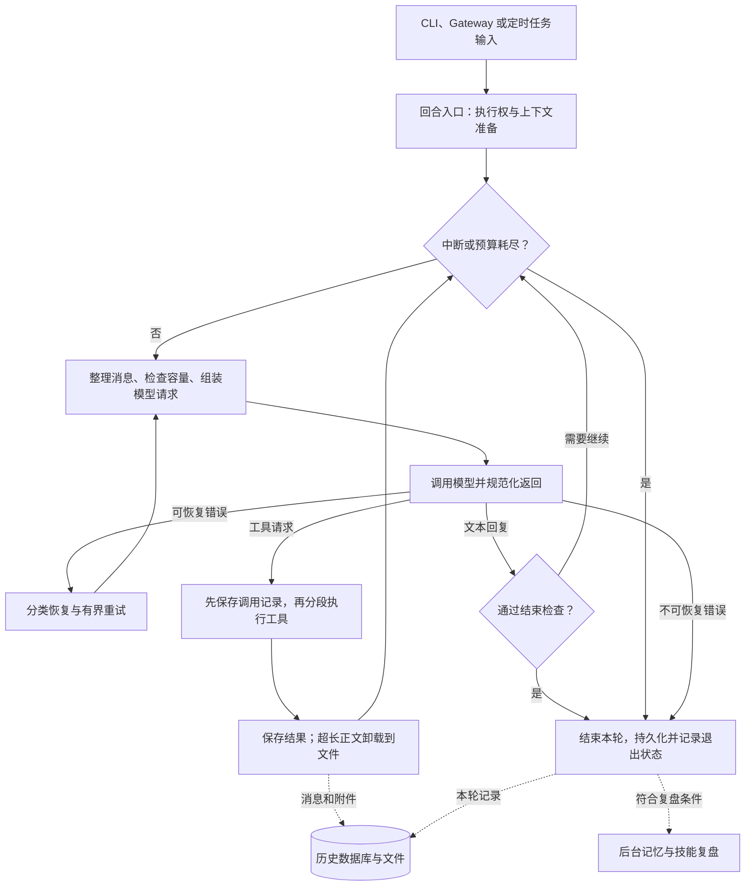
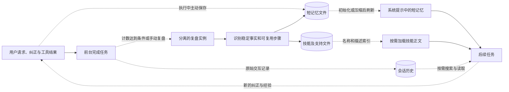
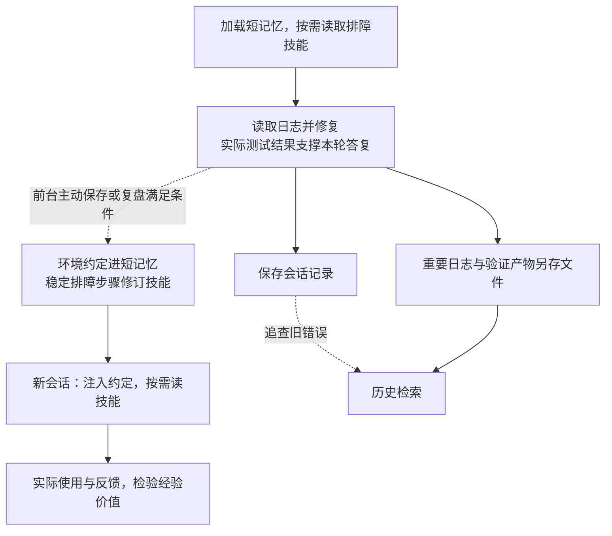

# Hermes Agent 设计与实现

[返回总览](<Agents 调研.md>)

写作日期：2026-09-07。源码基准：2026-09-06 获取的 [245e48008fa8](https://github.com/NousResearch/hermes-agent/commit/245e48008fa814b3251f50755eb656bd9fb86cb1)，提交时间为北京时间 2026-09-06 08:00:18。本文沿用这一固定版本，依据源码和随仓库保存的官方文档分析实现，未安装或运行项目；学习效果、实际召回率及运行成本不在本次验证范围内。

## 1. 设计目标与核心取舍

Hermes 让前台完成任务，后台把经验整理为短记忆和技能；后续任务直接读取精选知识，必要时检索原始对话。长期状态落在可检查、可编辑的文件和历史库中，当前窗口则可用摘要腾出空间。

`AIAgent` 通过混入类和辅助模块组织模型调用、工具、压缩与记忆，并预留外部服务接口。本文分析 Hermes 自己的 Python loop；可选 `codex_app_server` 会把整个回合交给另一运行时，生命周期边界不同。[主入口与运行时分支](https://github.com/NousResearch/hermes-agent/blob/245e48008fa814b3251f50755eb656bd9fb86cb1/agent/conversation_loop.py#L1390-L1477)、[上下文引擎扩展](https://github.com/NousResearch/hermes-agent/blob/245e48008fa814b3251f50755eb656bd9fb86cb1/website/docs/developer-guide/context-compression-and-caching.md#L10-L33)

## 2. 模块职责与状态分层

**模型当前可见内容与磁盘原文分开管理**：预览、摘要进入请求，历史与附件按各自生命周期保存。

| 层次 | 模块或存储 | 内容与读取方式 |
| --- | --- | --- |
| 回合入口 | `turn_facade`、`turn_context` | 接纳输入、取得执行权、恢复提示和消息。 |
| 调用循环 | `conversation_loop`、`turn_*` | 跟踪预算、重试、回复和退出原因。 |
| 活跃上下文 | 消息列表、`ContextCompressor` | 向模型发送提示、摘要、近期消息和工具结果。 |
| 常驻记忆 | `memories/MEMORY.md`、`USER.md` | 精选事实和用户信息，建立或刷新提示时整体注入。 |
| 程序性知识 | `skills/` | 先展示目录，再按需读取正文、脚本和模板。 |
| 历史与附件 | `state.db`、`cache/spillover/` | 分别保存可检索消息和超长工具正文。 |

主目录由 `HERMES_HOME` 决定，通常为 `~/.hermes`；profile 改变目录范围。同档案会话共享记忆和技能，各 Agent 的运行消息与提示快照仍独立，后台因此可更新知识而不重写前台会话。[记忆目录解析](https://github.com/NousResearch/hermes-agent/blob/245e48008fa814b3251f50755eb656bd9fb86cb1/tools/memory_tool.py#L38-L60)、[记忆实例与快照](https://github.com/NousResearch/hermes-agent/blob/245e48008fa814b3251f50755eb656bd9fb86cb1/tools/memory_tool_store.py#L66-L84)、[后台复盘的持久化分离](https://github.com/NousResearch/hermes-agent/blob/245e48008fa814b3251f50755eb656bd9fb86cb1/agent/background_review.py#L825-L856)

## 3. Agent loop：一个用户回合如何走完

下图展示常规路径，省略模型服务适配和部分清理分支。一个用户回合可以包含多次模型调用；一次模型调用又可以返回多个工具请求。

### 3.1 入口与执行顺序

`TurnFacadeMixin` 管理跨进程回合租约；新任务取消后台复盘，采用有界等待。`build_turn_context` 恢复提示和历史、记录用户输入并初始化计数；配置外部记忆服务时，还会通知回合开始并预取有语义的输入。[回合入口](https://github.com/NousResearch/hermes-agent/blob/245e48008fa814b3251f50755eb656bd9fb86cb1/agent/turn_facade.py#L1-L49)、[复盘取消](https://github.com/NousResearch/hermes-agent/blob/245e48008fa814b3251f50755eb656bd9fb86cb1/agent/background_review.py#L119-L143)、[外部记忆预取](https://github.com/NousResearch/hermes-agent/blob/245e48008fa814b3251f50755eb656bd9fb86cb1/agent/turn_context.py#L671-L691)

| 阶段 | 正常路径 | 失败或并发边界 |
| --- | --- | --- |
| 准备 | `begin_iteration` 查预算；`prepare_iteration` 整理消息与追加指令 | 中断或额度耗尽则停止。 |
| 模型返回 | 规范化后进入工具回合或文本结束检查 | 可恢复错误进入有界重试。 |
| 工具调用 | 启用会话持久化时，先保存调用记录，再执行 | 保存失败即结束；执行结果未持久化也不再交给模型。 |
| 工具分段 | 依给出顺序规划批次，结果接回消息列表 | 可并行读取、互不重叠文件操作及允许并发的 MCP 同批；其余串行。 |

先记录再执行可减少记录缺失，但不构成外部操作的完整事务。超长结果会在接回循环时卸载。[工具执行前后的持久化检查](https://github.com/NousResearch/hermes-agent/blob/245e48008fa814b3251f50755eb656bd9fb86cb1/agent/turn_tool_round.py#L120-L160)、[循环控制流](https://github.com/NousResearch/hermes-agent/blob/245e48008fa814b3251f50755eb656bd9fb86cb1/agent/conversation_loop.py#L1479-L1530)、[分段执行入口](https://github.com/NousResearch/hermes-agent/blob/245e48008fa814b3251f50755eb656bd9fb86cb1/run_agent.py#L1272-L1295)、[结果卸载接入点](https://github.com/NousResearch/hermes-agent/blob/245e48008fa814b3251f50755eb656bd9fb86cb1/agent/tool_executor.py#L986-L999)

### 3.2 结束、重试与预算

| 条件 | 默认处理 | 范围 |
| --- | --- | --- |
| 文本返回 | 空回复恢复；仅确认意图等情况可能继续 | 通过结束检查才保存最终消息。 |
| API 错误 | 最多尝试 3 次，按错误退避、切换或失败 | 上下文溢出另受压缩重试预算约束。 |
| 迭代额度 | `max_iterations = sys.maxsize`，近乎无上限 | 调用方可设额度及运行时间预算。 |
| 中断与收尾 | 循环及工具等待处查中断；`finalize_turn` 记录退出原因 | 完成、失败、中断分别记录，再判断是否复盘。 |
| 委派 | 子任务重新建立迭代预算 | 父额度不是整棵任务树的总额。 |

[文本结束入口](https://github.com/NousResearch/hermes-agent/blob/245e48008fa814b3251f50755eb656bd9fb86cb1/agent/turn_final_response.py#L46-L97)、[API 重试默认值](https://github.com/NousResearch/hermes-agent/blob/245e48008fa814b3251f50755eb656bd9fb86cb1/agent/agent_init.py#L1341-L1346)、[迭代入口和预算](https://github.com/NousResearch/hermes-agent/blob/245e48008fa814b3251f50755eb656bd9fb86cb1/agent/turn_iteration_prep.py#L220-L286)、[构造器默认值](https://github.com/NousResearch/hermes-agent/blob/245e48008fa814b3251f50755eb656bd9fb86cb1/run_agent.py#L231-L246)、[子任务预算](https://github.com/NousResearch/hermes-agent/blob/245e48008fa814b3251f50755eb656bd9fb86cb1/tools/delegate_tool.py#L175-L188)

## 4. 自主学习：从交互经验到下次复用

前台可主动调用记忆、技能工具，后台提供独立复盘机会；产物是文本知识和程序性材料，常规路径不更新模型权重。

### 4.1 触发条件与状态隔离

| 路径 | 默认门槛或输入 | 启动与隔离边界 |
| --- | --- | --- |
| 记忆复盘 | 累计 10 个用户回合 | 结束时须有最终回复、未中断、未禁用复盘、工具可用。 |
| 技能复盘 | 累计 10 次调用循环迭代 | `prepare_iteration` 计数，不等于成功工具调用数；同样检查结束条件。 |
| 手动复盘 | 显式 `/refine` | 自动开关可配置。 |
| 同模型复盘 | 对话快照，尽量沿用前台提示和工具定义 | 复用前缀缓存。 |
| 不同模型复盘 | 整理后的历史材料 | 单独路由。 |

[记忆触发计数](https://github.com/NousResearch/hermes-agent/blob/245e48008fa814b3251f50755eb656bd9fb86cb1/agent/turn_context.py#L542-L551)、[技能计数位置](https://github.com/NousResearch/hermes-agent/blob/245e48008fa814b3251f50755eb656bd9fb86cb1/agent/turn_iteration_prep.py#L49-L51)、[默认间隔](https://github.com/NousResearch/hermes-agent/blob/245e48008fa814b3251f50755eb656bd9fb86cb1/agent/agent_init.py#L1225-L1299)、[结束时复盘条件](https://github.com/NousResearch/hermes-agent/blob/245e48008fa814b3251f50755eb656bd9fb86cb1/agent/turn_finalizer.py#L587-L616)

复盘实例关闭会话持久化，不初始化外部记忆服务，压缩器也与父数据库解绑；内置记忆存储显式重新绑定，允许保存精选知识，同时避免整理指令和压缩写入前台状态。[复盘实例的状态分离](https://github.com/NousResearch/hermes-agent/blob/245e48008fa814b3251f50755eb656bd9fb86cb1/agent/background_review.py#L770-L856)、[复盘执行与材料选择](https://github.com/NousResearch/hermes-agent/blob/245e48008fa814b3251f50755eb656bd9fb86cb1/agent/background_review.py#L973-L1010)

### 4.2 更新规则与效果边界

| 决策 | 规则 | 后续复用或限制 |
| --- | --- | --- |
| 识别经验 | 用户纠正、可复用方法、技能遗漏或过时 | 优先修订本次用过的技能，再改其他已有内容，最后新建。 |
| 组织材料 | 细节进参考资料，重复动作进脚本，起始结构进模板 | 短记忆直接注入；技能靠名称、描述和 `skill_view` 按需读取。 |
| 允许修改 | 仅白名单工具；改现有技能前须重新读取 | 用户自有、固定、内置及 Hub 技能受保护。 |
| 写入校验 | 检查元数据、大小、编写规范 | 可选安全扫描默认关闭；没有强制新旧技能效果对照。 |

自动复盘主要修改整理器管理的内容。描述质量和模型选择决定技能能否命中；结构合法不能证明经验有效，仍需后续任务反馈。[复盘策略与技能保护](https://github.com/NousResearch/hermes-agent/blob/245e48008fa814b3251f50755eb656bd9fb86cb1/agent/background_review.py#L368-L445)、[技能分层读取](https://github.com/NousResearch/hermes-agent/blob/245e48008fa814b3251f50755eb656bd9fb86cb1/tools/skills_tool.py#L602-L617)

源码依据：技能写入校验

[写入校验](https://github.com/NousResearch/hermes-agent/blob/245e48008fa814b3251f50755eb656bd9fb86cb1/tools/skill_manager_tool.py#L130-L176)、[可选扫描](https://github.com/NousResearch/hermes-agent/blob/245e48008fa814b3251f50755eb656bd9fb86cb1/tools/skill_manager_tool.py#L40-L60)、[编写规范检查](https://github.com/NousResearch/hermes-agent/blob/245e48008fa814b3251f50755eb656bd9fb86cb1/tools/skill_manager_tool.py#L370-L383)

## 5. 上下文管理：预算、压缩与恢复

### 5.1 预算与默认开关

触发点以 **`(模型窗口 − max_tokens) × 比例`** 为基础，再应用最小阈值保护和可选绝对上限；用量优先取 API 返回值，缺失时估算。无额外限制时，128K 窗口、16K 输出预留、75% 比例约对应 84K tokens。[阈值计算实现](https://github.com/NousResearch/hermes-agent/blob/245e48008fa814b3251f50755eb656bd9fb86cb1/agent/context_compressor.py#L2204-L2253)

| 配置或条件 | 默认值 | 影响 |
| --- | --- | --- |
| `compression.enabled` / `in_place` | 均开启 | 原地压缩，保留会话 ID 和历史搜索能力。 |
| `compression.threshold` | 基础 0.50 | 窗口低于 512K 时至少 75%；部分 Codex 路由提高至 85%。 |
| Gateway 回合前检查 | 独立的 85% | 与循环内压缩阈值分开。 |
| `compression.tail_mode` | `lean` | 尾部为窗口的 2.5%，最低 10K、最高 25K tokens。 |
| `legacy` 尾部模式 | `threshold_tokens × target_ratio` | `target_ratio` 默认 0.20，大窗口可能留更多原文。 |
| `protect_last_n` | 20 | 近期消息基础保护数，压力下仍有进一步处理。 |
| `min_tail_user_messages` | 1，最低为 1 | 保护真实用户消息。 |
| `idle_compact_after_seconds` | 0，关闭 | 可配置空闲后恢复时压缩。 |

表中后三项也属于 `compression`。用户消息保护和调用配对可使尾部超过软预算，极大工具正文仍可能被裁减。[Gateway 与模型特例](https://github.com/NousResearch/hermes-agent/blob/245e48008fa814b3251f50755eb656bd9fb86cb1/website/docs/developer-guide/context-compression-and-caching.md#L36-L118)、[默认配置解析](https://github.com/NousResearch/hermes-agent/blob/245e48008fa814b3251f50755eb656bd9fb86cb1/agent/agent_init.py#L1420-L1468)、[尾部预算](https://github.com/NousResearch/hermes-agent/blob/245e48008fa814b3251f50755eb656bd9fb86cb1/agent/context_compressor.py#L1779-L1787)、[压力下的工具裁减](https://github.com/NousResearch/hermes-agent/blob/245e48008fa814b3251f50755eb656bd9fb86cb1/agent/context_compressor.py#L2659-L2707)

### 5.2 压缩后留下什么，失败后如何继续

压缩先清理旧工具结果与空消息，再总结中段、补充机械索引并修复工具调用配对。[压缩主流程](https://github.com/NousResearch/hermes-agent/blob/245e48008fa814b3251f50755eb656bd9fb86cb1/agent/context_compressor.py#L4578-L4655)

| 部分或状态 | 处理结果 | 恢复与损失边界 |
| --- | --- | --- |
| 中段对话 | 辅助模型摘要 + 标识符索引 + 预算内用户原文 + 恢复提示 | 超大输入会采样，摘要和原文保留都有损失。 |
| 近期尾部 | 保留近期消息；`lean` 可将较旧工具结果改为短占位 | 精确错误、路径或旧决策仍可能需要历史查询。 |
| 已概括消息 | 原地标记 `active=0, compacted=1` | 退出模型请求，保留会话 ID，仍可 `session_search`。 |
| 摘要服务不可用 | 自动压缩冷却 60、300、900 秒 | 连续无效压缩暂停自动尝试。 |
| 手动压缩或明确溢出 | `/compress` 或恢复路径重试 | 各受自己的尝试预算约束。 |

[摘要的机械补充与采样入口](https://github.com/NousResearch/hermes-agent/blob/245e48008fa814b3251f50755eb656bd9fb86cb1/agent/context_compressor.py#L3094-L3135)、[原地压缩及失败处理](https://github.com/NousResearch/hermes-agent/blob/245e48008fa814b3251f50755eb656bd9fb86cb1/website/docs/developer-guide/context-compression-and-caching.md#L75-L155)、[触发与熔断](https://github.com/NousResearch/hermes-agent/blob/245e48008fa814b3251f50755eb656bd9fb86cb1/agent/context_compressor.py#L2440-L2467)

### 5.3 工具卸载与历史查询的恢复边界

| 机制 | 默认限额与返回 | 失败或持久化边界 |
| --- | --- | --- |
| 工具结果限额 | 大窗口：普通 100K、MCP 50K、同轮 200K 字符；小窗口缩放 | 超限优先写入 `cache/spillover`。 |
| 卸载结果 | 约 1,500 字符预览及路径 | 保存失败则明确提示并截断；`read_file` 豁免重复卸载，多模态另处理。 |
| `session_search` | SQLite FTS5；默认 3 个结果，单条最多 4,000 字符 | 可按会话浏览、围绕消息续读；原记录是预览时只找回预览和路径。 |
| 卸载附件 | 默认清理超过 24 小时的文件 | 重要正文须另存工作文件，历史可查不保证附件仍在。 |

[输出预算](https://github.com/NousResearch/hermes-agent/blob/245e48008fa814b3251f50755eb656bd9fb86cb1/tools/budget_config.py#L7-L112)、[卸载与失败处理](https://github.com/NousResearch/hermes-agent/blob/245e48008fa814b3251f50755eb656bd9fb86cb1/tools/tool_result_storage.py#L192-L230)、[搜索返回形态](https://github.com/NousResearch/hermes-agent/blob/245e48008fa814b3251f50755eb656bd9fb86cb1/tools/session_search_tool.py#L250-L269)、[搜索默认参数](https://github.com/NousResearch/hermes-agent/blob/245e48008fa814b3251f50755eb656bd9fb86cb1/tools/session_search_tool.py#L533-L547)、[附件清理](https://github.com/NousResearch/hermes-agent/blob/245e48008fa814b3251f50755eb656bd9fb86cb1/tools/tool_result_storage.py#L19-L68)

## 6. 持久 Memory：磁盘写入与提示可见分开

内置记忆是有界的全量提示块，没有向量索引；条目以 `\n§\n` 分隔，容量按字符计算。[记忆格式与默认容量](https://github.com/NousResearch/hermes-agent/blob/245e48008fa814b3251f50755eb656bd9fb86cb1/tools/memory_tool_store.py#L22-L84)

| 对象或操作 | 保存与使用规则 | 失败或可见性边界 |
| --- | --- | --- |
| `MEMORY.md` / `USER.md` | 环境与精选经验 2,200 字符；用户信息 1,375 字符 | 同 profile 共享长期知识，各 Agent 保留独立提示快照。 |
| 写入 | 加锁 → 重读磁盘 → 检查漂移 → 变更 → 原子保存 | 添加去除完全重复；替换、删除需唯一子串匹配。 |
| 批量整理 | 按最终内容检查容量，允许先删减再添加 | 多条匹配报错；满容量返回条目和用量，由模型合并，不静默丢弃。 |
| 连续失败 | 本轮达到失败限制后要求停止重试 | 避免记笔记阻塞任务。 |
| 安全检查 | 加载、写入检测注入和外传等模式 | 加载可用阻断提示代替危险条目，磁盘原文保留供检查。 |
| 提示刷新 | 写工具立即更新磁盘和实时存储 | 已建提示前缀不逐次刷新；新会话或压缩后失效重建才重新加载。 |

**保存成功不等于下一次模型请求已读取新快照。** 工具响应与提示重建衔接这两个时间点。[压缩后的快照刷新](https://github.com/NousResearch/hermes-agent/blob/245e48008fa814b3251f50755eb656bd9fb86cb1/agent/system_prompt.py#L650-L668)

源码依据：记忆写入、容量与失败处理

[写入流程](https://github.com/NousResearch/hermes-agent/blob/245e48008fa814b3251f50755eb656bd9fb86cb1/tools/memory_tool_store.py#L190-L212)、[替换、删除与批量操作](https://github.com/NousResearch/hermes-agent/blob/245e48008fa814b3251f50755eb656bd9fb86cb1/tools/memory_tool_store.py#L236-L315)、[失败次数限制及加载检查](https://github.com/NousResearch/hermes-agent/blob/245e48008fa814b3251f50755eb656bd9fb86cb1/tools/memory_tool_store.py#L71-L133)

profile 用于组织目录，不是同一系统用户内的权限边界：历史搜索可显式只读打开其他档案数据库，按会话 ID 定位也会查其他档案。删除记忆不会清除历史同文；`memory.provider` 可接外部服务并与内置存储共存，其索引、召回与删除能力由插件决定。[跨档案搜索](https://github.com/NousResearch/hermes-agent/blob/245e48008fa814b3251f50755eb656bd9fb86cb1/tools/session_search_tool.py#L329-L365)、[外部服务初始化](https://github.com/NousResearch/hermes-agent/blob/245e48008fa814b3251f50755eb656bd9fb86cb1/agent/agent_init.py#L1263-L1289)

## 7. 三项与长期使用相关的扩展

### 7.1 技能整理器

| 阶段 | 默认触发与动作 | 保护与限制 |
| --- | --- | --- |
| 常规整理 | 默认开启；每 7 天且空闲至少 2 小时检查 | 首次只登记时间，下个周期才实际整理。 |
| 无模型阶段 | 未使用技能按 30 / 90 天规则标过时或归档 | 固定、定时任务引用等技能受保护，新技能有宽限期。 |
| LLM 合并 | 默认关闭，显式开启后归并重复技能 | 运行前尽力备份，记录状态和报告。 |

整理主要依据使用情况，归档不能证明技能失效。[整理策略与保护](https://github.com/NousResearch/hermes-agent/blob/245e48008fa814b3251f50755eb656bd9fb86cb1/website/docs/user-guide/features/curator.md#L17-L57)、[备份和运行流程](https://github.com/NousResearch/hermes-agent/blob/245e48008fa814b3251f50755eb656bd9fb86cb1/agent/curator.py#L877-L910)

### 7.2 子任务的隔离与额度

`delegate_task` 建立独立 Agent、消息上下文和终端；父任务传目标与背景，最终摘要受父窗口余量限制。[子任务构造](https://github.com/NousResearch/hermes-agent/blob/245e48008fa814b3251f50755eb656bd9fb86cb1/tools/delegate_tool.py#L175-L188)、[返回摘要预算](https://github.com/NousResearch/hermes-agent/blob/245e48008fa814b3251f50755eb656bd9fb86cb1/tools/delegate_tool_results.py#L226-L265)

| 维度 | 默认或配置 | 边界 |
| --- | --- | --- |
| 记忆与工具 | 跳过内置长期记忆；禁用记忆写入、定时任务和用户询问工具 | 子任务不会按主会话方式积累长期记忆。 |
| 规模 | 最多并发 10 个，深度 1 | 更深委派须配置；每个子任务有自己的迭代预算。 |
| Git 隔离 | `delegation.worktree_isolation` 关闭 | 开启也仅适用于本地后端 Git 项目。 |
| 超时与中断 | 默认无固定总时长；正值超时最低按 30 秒 | 依活动检测停滞；父中断传给子任务。 |

[数量和深度默认值](https://github.com/NousResearch/hermes-agent/blob/245e48008fa814b3251f50755eb656bd9fb86cb1/tools/delegate_tool_config.py#L16-L26)、[可选隔离与超时](https://github.com/NousResearch/hermes-agent/blob/245e48008fa814b3251f50755eb656bd9fb86cb1/tools/delegate_tool_config.py#L101-L146)

### 7.3 定时任务的触发与交付

`tick → run_one_job → run_job → run_conversation` 复用同一循环。独立 Agent 加载记忆，但设置 `skip_background_review=True`，默认不在每次运行后复盘。[定时 Agent 配置](https://github.com/NousResearch/hermes-agent/blob/245e48008fa814b3251f50755eb656bd9fb86cb1/cron/scheduler.py#L2229-L2263)、[任务执行入口](https://github.com/NousResearch/hermes-agent/blob/245e48008fa814b3251f50755eb656bd9fb86cb1/cron/scheduler.py#L2290-L2349)

调度层管理执行归属、结果与投递；活动监视默认 **600 秒无活动**才超时，持续刷新归属记录，衡量停滞而非总时长。纯脚本分支可直接运行脚本、处理标准输出，无须 Agent 或模型。[活动监视](https://github.com/NousResearch/hermes-agent/blob/245e48008fa814b3251f50755eb656bd9fb86cb1/cron/scheduler.py#L1740-L1766)、[纯脚本分支](https://github.com/NousResearch/hermes-agent/blob/245e48008fa814b3251f50755eb656bd9fb86cb1/cron/scheduler.py#L1252-L1275)

## 8. 端到端示意：排障结果、经验与证据去向

以下为机制示意，非实测。用户要求排查服务超时，并纠正：“项目应通过容器执行测试。”

日志临时卸载与旧轮次压缩负责控制窗口；精确原文能否恢复取决于历史记录形态、缓存存活或另存文件。未经验证的猜测不应作为可靠流程，新增技能文件也不等于复用成功。

## 9. 源码阅读路线

建议先沿一条完整回合理解控制权，再追踪知识的写入和复用，最后阅读扩展任务。表中的链接均指向本文固定快照。

| 顺序 | 入口 | 重点关注 |
| --- | --- | --- |
| 1 | [回合门面](https://github.com/NousResearch/hermes-agent/blob/245e48008fa814b3251f50755eb656bd9fb86cb1/agent/turn_facade.py#L19-L49) → [主循环](https://github.com/NousResearch/hermes-agent/blob/245e48008fa814b3251f50755eb656bd9fb86cb1/agent/conversation_loop.py#L1390-L1530) | 输入进入后，哪些分支继续、结束或直接返回。 |
| 2 | [工具回合](https://github.com/NousResearch/hermes-agent/blob/245e48008fa814b3251f50755eb656bd9fb86cb1/agent/turn_tool_round.py#L120-L160) → [分段执行](https://github.com/NousResearch/hermes-agent/blob/245e48008fa814b3251f50755eb656bd9fb86cb1/run_agent.py#L1272-L1295) | 工具调用、持久化记录和并发顺序如何保持对应。 |
| 3 | [结果卸载](https://github.com/NousResearch/hermes-agent/blob/245e48008fa814b3251f50755eb656bd9fb86cb1/tools/tool_result_storage.py#L192-L230) → [上下文压缩](https://github.com/NousResearch/hermes-agent/blob/245e48008fa814b3251f50755eb656bd9fb86cb1/agent/context_compressor.py#L4578-L4655) | 即时输出限制与长期会话压缩各自处理什么。 |
| 4 | [记忆存储](https://github.com/NousResearch/hermes-agent/blob/245e48008fa814b3251f50755eb656bd9fb86cb1/tools/memory_tool_store.py#L66-L212) → [提示刷新](https://github.com/NousResearch/hermes-agent/blob/245e48008fa814b3251f50755eb656bd9fb86cb1/agent/system_prompt.py#L650-L668) | 磁盘实时状态与模型可见快照何时汇合。 |
| 5 | [复盘启动条件](https://github.com/NousResearch/hermes-agent/blob/245e48008fa814b3251f50755eb656bd9fb86cb1/agent/turn_finalizer.py#L587-L616) → [复盘实例](https://github.com/NousResearch/hermes-agent/blob/245e48008fa814b3251f50755eb656bd9fb86cb1/agent/background_review.py#L825-L856) | 学习触发、共享知识与隔离会话如何同时成立。 |
| 6 | [整理器](https://github.com/NousResearch/hermes-agent/blob/245e48008fa814b3251f50755eb656bd9fb86cb1/agent/curator.py#L877-L910)、[委派](https://github.com/NousResearch/hermes-agent/blob/245e48008fa814b3251f50755eb656bd9fb86cb1/tools/delegate_tool.py#L175-L188)、[定时 Agent](https://github.com/NousResearch/hermes-agent/blob/245e48008fa814b3251f50755eb656bd9fb86cb1/cron/scheduler.py#L2229-L2263) | 如何复用同一运行内核，同时改变预算、知识和交付边界。 |

本次核查到的是学习、记忆、压缩和调度机制的实现。复盘能否稳定产出有效技能、摘要丢失细节的概率、附件清理对长期恢复的实际影响，以及各外部记忆插件的表现，仍需要配套任务集和真实运行数据验证。
