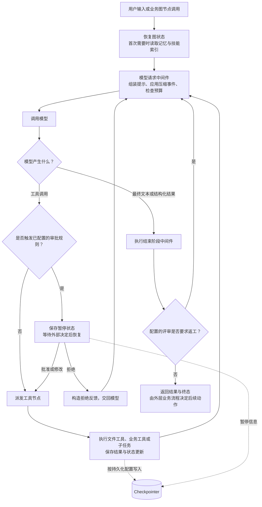
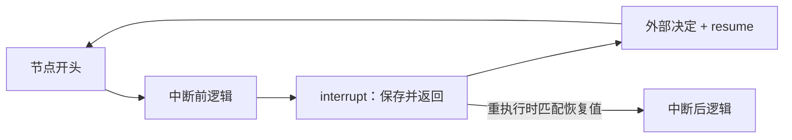
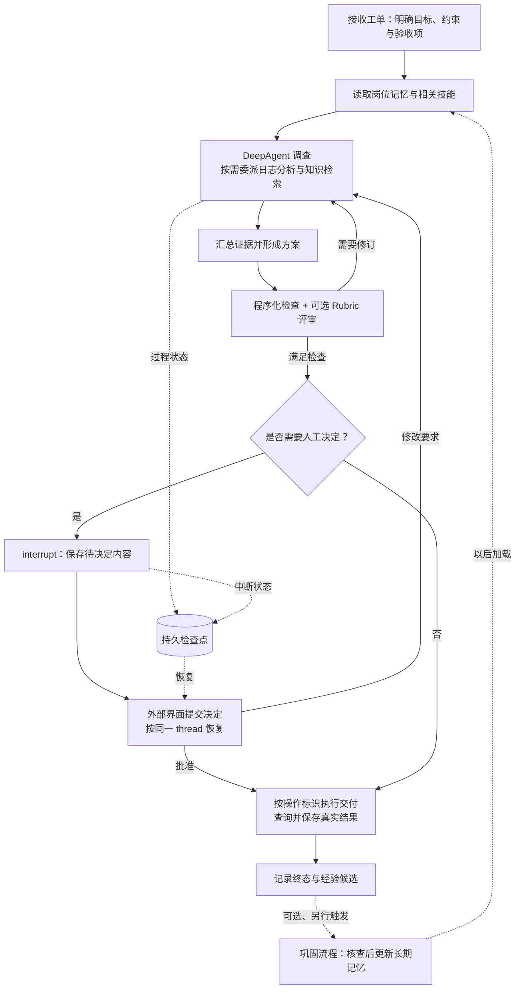

# LangGraph 与 DeepAgents 设计与实现

[返回总览](<Agents 调研.md>)

本文从数字员工的视角，分析 LangGraph 如何保存和推进工作流，DeepAgents 如何在其上组织模型、工具、技能、记忆和子任务。重点追踪一次任务从接收、执行、暂停、恢复到验收的过程，并区分当前任务状态与跨任务经验。

写作与源码获取日期：**2026-09-07**。分析以 Python 开源库为主，固定在以下提交；LangChain 作为 DeepAgents 基础循环的实现一并核查。表中版本来自源码包声明，这组快照用于阅读实现，未安装组合运行，也未进行任务效果或恢复可靠性测试。

| 项目 | 固定提交 | 包版本 | 提交时间（北京时间） |
|---|---|---|---|
| LangGraph | [81bf17b23123][lg-version] | `1.2.11` | 2026-09-03 23:23:25 |
| DeepAgents | [07d2952d346d][da-version] | `0.7.13` | 2026-09-07 03:36:01 |
| LangChain | [fa942aec719a][lc-version] | `1.4.0` | 2026-09-07 09:23:40 |

## 1. 三层职责：工作流运行时、基础循环与执行能力

业务图管理阶段，DeepAgent 承担阶段内需要判断的工作；编译好的图也能作为子任务接入。[组装入口][assembly]、[编译子任务][sub-compile]

| 层次 | 实现入口 | 管理什么 |
|---|---|---|
| LangGraph runtime | `StateGraph` / Pregel | 节点调度、状态合并、检查点、中断恢复 |
| LangChain Agent 图 | `create_agent` | 模型—工具路由、中间件、结构化结果 |
| DeepAgents 能力层 | `create_deep_agent` → `create_agent` | 文件、技能、记忆、摘要、子任务 |

确定的核验与交付步骤适合普通节点；调查、选工具和起草方案可以交给 Agent。开源库可直接调用，LangSmith 的追踪与托管属于配套产品，平台调度和身份能力不能算作本地库默认行为。

## 2. LangGraph 怎样表达并推进编排

`StateGraph` 节点接收状态、返回字段更新；图结构把业务依赖变成执行约束，具体条件仍由开发者定义。

| 机制 | 执行语义 | 典型用途 |
|---|---|---|
| reducer | 合并字段更新；单值字段并发写入会报冲突 | 追加多个调查节点的证据 |
| 固定边 / 条件边 | 固定顺序 / 按状态选路 | 审核通过后才能交付 |
| `add_edge([a, b], c)` | 等待两个前置节点完成 | 调查与核验后汇合 |
| `Send` | 为不同输入动态派发同一节点 | 并行处理多份资料 |
| `Command` | 同时更新状态并指定后续节点 | 保存判断结果并跳转 |

依据：[状态][state-model]、[并发冲突][concurrent-write]、[汇合][join]、[派发][send]、[命令][command]。

Pregel 每步按“选择节点 → 并行执行 → 合并更新 → 下一步”推进，同一步内的更新通常到下一步才对其他节点可见，直到无可执行节点或触及停止条件。[执行模型][pregel]

**状态边界：**局部变量、图通道、外部系统是三处不同状态。关键决策与结果 ID 应进入图状态；reducer 不会撤销文件修改或远程请求。

## 3. DeepAgents 的 Agent loop 如何建立

`create_deep_agent` 解析模型及 harness profile，组装文件系统、符合配置的子任务、自动摘要和工具调用配对修复，再把工具、状态与存储参数交给 `create_agent`。中间件和 profile 可改变最终配置。[组装流程][assembly]

| 路由 / 配置 | 实际含义 |
|---|---|
| 待执行工具调用 | 每项生成 `Send("tools", ...)`，结果通常回到模型 |
| 无工具调用 | 通常结束；中间件仍可改写路由 |
| `return_direct` / 结构化结果 | 全部工具允许直返或已取得所需结果时，可直接结束 |
| `TodoListMiddleware` | 通用栈不再默认加入；Codex 等 profile 可能补回 |
| `recursion_limit=9,999` | 图执行步数上限，不是模型轮次、token 预算或成功条件 |

依据：[循环条件边][agent-loop]、[Todo profile][todo-profile]、[图配置][assembly]。`write_todos` 只记录计划，不会自动编译为依赖图；工具并发也不提供业务互斥，冲突写入仍需依赖、锁或分区。

## 4. 暂停与恢复：检查点保存了什么

### 4.1 三种接口与持久化时机

| 接口 | 保存对象 | 作用域与边界 |
|---|---|---|
| Checkpointer | 图状态、执行进度 | 同一 `thread_id` 继续同一件工作 |
| Store | namespace + key 组织的应用数据 | 可跨 thread 共享经验 |
| Backend | 文件与执行环境的访问抽象 | 内容落在哪里由后端实现决定，见第 6 节 |

**独立调用 `create_deep_agent` 时，checkpointer 和 store 默认均为 `None`。** `InMemorySaver` / `InMemoryStore` 只适合本进程；跨进程恢复需持久实现和任务标识。[编译配置][compile]、[默认参数][factory-options]、[内存实现][memory-saver]、[持久化说明][persistence-doc]

| durability | 保存时机 | 对恢复位置的影响 |
|---|---|---|
| `sync` | 下一步开始前保存完成 | 先等保存，再继续执行 |
| `async`（默认） | 下一步执行期间异步保存 | 执行与保存重叠 |
| `exit` | 图退出时保存 | 不按每步保存 |

并行步骤还可保存成功任务的写入，恢复时重用，减少已完成节点的重复执行。[时机][durability]、[pending writes][pending-writes]

### 4.2 interrupt 恢复会重执行节点

`interrupt(payload)` 返回待决定内容；应用记录 thread，收到决定后用 `Command(resume=...)` 继续。DeepAgents 的 `interrupt_on` 或询问式文件权限在工具执行前接入批准、修改、拒绝。[中断协议][interrupt]、[审批中间件][hitl]

**恢复从节点开头重执行；多个中断按调用顺序匹配恢复值。** 中断前逻辑可能重复，确认阶段应与副作用拆开。[重执行语义][interrupt]

工程上，检查点与远端工单、邮件、数据库不构成共同事务。若外部动作完成而本地尚未记账就崩溃，恢复需按稳定操作 ID 查询、去重或补偿。

## 5. 上下文管理：模型输入与完整工作状态分开

### 5.1 先卸载大内容，再压缩旧消息

| 环节 | 默认触发 / 策略 | 结果与失败边界 |
|---|---|---|
| 普通工具输出卸载 | 约 20,000 tokens；按 4 字符/token 估算 | Backend 存全文，模型收预览和路径；失败保留原文 |
| 摘要前缩短参数 | 先处理旧 `write_file`、`edit_file` 大参数 | 再判断是否需要摘要 |
| 已知模型窗口 | 约 85% 触发，保留约 10% 近期内容 | 依赖 `max_input_tokens` |
| 未知模型窗口 | 170,000 tokens 触发，保留 6 条消息 | 是兜底值，不能适配所有小窗口模型 |

`read_file`、`grep` 等已有分页或限额的文件工具不走重复卸载路径。[卸载配置][offload-config]、[实现与失败分支][offload-implementation]、[排除项][offload-exclusions]、[摘要预算][summary-defaults]

### 5.2 模型视图、历史与检查点分别保存

| 保存对象 | 内容 / 作用 | 注意事项 |
|---|---|---|
| `_summarization_event` | 切分位置、摘要、历史路径；重建“摘要 + 近期消息” | 常规路径保留图中原始消息列表 |
| Backend 历史文件 | `/conversation_history/{session_id}.md` | 保存失败仍继续摘要，恢复路径为空 |
| 媒体与溢出处理 | 媒体卸载为引用；溢出后摘要重试、处理超大尾部 | 部分路径会改消息，不能概括为全程无损 |
| `DeltaChannel` | 消息增量，快照频率参数 50 | 降低状态存储成本；摘要降低模型输入体积 |

依据：[有效视图][summary-view]、[历史与溢出][summary-offload]、[增量状态][delta-state]。需要精确信息时可以读历史，但前提是保存成功且 Backend 仍可访问；窗口缩小不等于历史归档可靠。

## 6. 持久 Memory 与技能如何进入下一次任务

### 6.1 Backend 决定文件的存储和作用域

| Backend | 用途 | 持久化与作用域 |
|---|---|---|
| `StateBackend`（默认） | 笔记、临时文件、卸载内容 | 进入图状态；恢复依赖检查点，默认不跨 thread |
| `FilesystemBackend` | 工作区资料、磁盘记忆 | 保存到指定文件系统；跨机器取决于挂载 |
| `StoreBackend` | 跨任务记忆、共享资料 | namespace 工厂划分范围；耐久性取决于 Store |
| `CompositeBackend` | 按路径分流 | 如临时区用 State，`/memories/` 用 Store |
| 实现执行协议的后端 | Shell 与环境操作 | 普通文件存储不自动提供命令执行 |

依据：[State][state-backend]、[Store][store-backend]、[Backend 说明][backends-doc]。namespace 应从可信身份构造；路径里的 `user_id` 不等于认证。内置文件工具实施的权限也不自动覆盖直接 Backend 操作或自定义工具。[权限边界][permission-boundary]

### 6.2 Memory 整体注入，Skills 按需展开

| 配置 | 进入模型的方式 | 缓存 / 检索边界 |
|---|---|---|
| `memory=[...]` | 按顺序读取指定文件，缓存到 `memory_contents` 并注入系统提示 | 整体文本加载，不自动做向量检索 |
| `skills=[...]` | 扫描 `SKILL.md` 元数据；先给索引，再由模型读正文 | 同名以后配置来源为准；遵守程度取决于模型 |
| Store 语义搜索 | 配置索引，由节点或工具发起搜索 | `InMemoryStore` 默认未启用 |

记忆内容与技能索引已在状态中时，`before_agent` 不重复加载；检查点可能恢复旧缓存。磁盘更新不保证当前 thread 立即可见，需要新 thread 或显式重载。[Memory][memory-load]、[Skills][skills-load]、[可选索引][store-index]

## 7. 自主学习与验收：保存经验和纠正当前结果

### 7.1 经验写入与后台巩固

| 路径 | 怎样改变以后任务 | 必要条件 |
|---|---|---|
| 常规 Memory 学习 | 反馈 → 判断长期价值 → `edit_file` → 后续加载 | 记忆文件、可写 Backend、模型实际调用工具 |
| 技能修订 | 修改操作规程，后续任务读取 | 除可读目录外，还需相应写权限 |
| 后台巩固 | 另一个 DeepAgent 读会话、提取并合并经验 | 应用调度；自行管理游标、冲突和回滚 |

Memory 提示要求保存用户纠正、环境事实与可复用方法，避免一次性状态。工厂不会默认建立定时复盘服务，也没有模型权重训练步骤；文件合法、成功写入与经验有效仍需分别验证。[学习指导][memory-learning]、[巩固模式][memory-doc]

### 7.2 Rubric 评审当前结果，不自动沉淀经验

Beta `RubricMiddleware` 需显式加入并在调用状态传入 rubric；Agent 准备结束时由 grader 检查材料，默认最多 **3 次评审迭代**。[生命周期][rubric]

| 评审结果 / 条件 | 循环行为 | 业务应检查什么 |
|---|---|---|
| `needs_revision` | 评审意见回传主 Agent 返工 | 是否补齐证据与验收项 |
| `satisfied` | 结束 | grader 判断所依据的材料是否充分 |
| 无法评估、错误或达到上限 | 结束；可能仍返回先前完整答复 | `_rubric_status`、回调或事件 |

grader 默认没有验证工具，可由应用补充测试、查询工具。**生成结束不等于验收通过；当前任务返工也不等于跨任务学习。** 业务需读终态决定交付或人工处理，经验另行写入。[终态与返回消息][rubric-status]

## 8. 子 Agent：隔离推理上下文，明确交付方式

| 方式 | 输入与交付 | 调用边界 |
|---|---|---|
| `task(description, subagent_type)` | 默认 isolated：委派描述建立消息；返回结果包装为父级 `ToolMessage` | 等待子图完成；多个调用可并行 |
| Beta `fork` | 以父任务有效历史为背景 | 检查并禁止继续递归 |
| `CompiledSubAgent` | 接入预编译图 | 遵守结果接口，如返回含 `messages` 的状态 |
| `AsyncSubAgent` | 启动、检查、更新、取消、列举；保存远端 thread/run ID | 显式配置远端服务，调用方消费最终结果 |

依据：[输入与隔离][sub-state]、[结果回传][sub-result]、[异步接入][assembly]、[启动][async-start]、[检查更新][async-check]。

普通 `task` 与 Prime 接纳句柄不同，会等到完成；异步服务也不是它的一个布尔开关。isolated 仍可能传入或合并允许的状态字段，消息隔离不能推出磁盘或 Store 隔离。默认子任务栈不会无限复制主 Agent 的委派能力。

## 9. 端到端示例：让数字员工处理一条问题工单

以下为应用设计示意，**不是仓库自带工单系统或实测记录**。目标是调查问题、形成可核验方案，经必要的人工决定后交付。

| 内容 | 保存位置 | 用途 |
|---|---|---|
| 工单事实、阶段、证据引用、操作 ID | 图状态 + 持久检查点 | 同一 thread 恢复，查询外部操作是否已完成 |
| 大日志、中间报告 | 文件 Backend | 缩小输入，保留核查材料 |
| 稳定岗位约定、已核查经验 | 按用户或岗位组织的 Store | 以后任务加载或检索 |

业务系统负责验收、身份、调度和真实交付；模型自主性集中在调查与方案生成。是否提高成功率、降低成本，需要固定任务集和运行证据。

## 10. 源码阅读路线与实现取舍

| 顺序 | 阅读入口 | 要追踪的问题 |
|---|---|---|
| 1 | [工厂][assembly] → [条件边][agent-loop] | 默认能力、工具路由与结束条件 |
| 2 | [StateGraph][state-model] → [Pregel][pregel] | 并行状态如何合并与推进 |
| 3 | [中断][interrupt] → [恢复写入][pending-writes] | 哪些节点重执行，哪些结果复用 |
| 4 | [Backend][store-backend]、[Memory][memory-load]、[Skills][skills-load] | 内容保存与进入模型的时机 |
| 5 | [摘要][summary-view]、[增量状态][delta-state] | 输入容量与保存成本如何分别控制 |
| 6 | [子任务][sub-state]、[Rubric][rubric-status] | 子结果交付与验收终态 |

实现上可分别替换流程、模型、技能与存储。可靠恢复、有效经验和真实交付则需要应用自己的事务边界与验证。

[lg-version]: https://github.com/langchain-ai/langgraph/blob/81bf17b23123e4ef8b9d5f49fa09a0122fc2edd1/libs/langgraph/pyproject.toml#L1-L15
[da-version]: https://github.com/langchain-ai/deepagents/blob/07d2952d346d81d06bd181db8c560a77f2b51bc8/libs/deepagents/pyproject.toml#L1-L26
[lc-version]: https://github.com/langchain-ai/langchain/blob/fa942aec719abd92026dcb56cab8e50a38776611/libs/langchain_v1/pyproject.toml#L20-L30
[assembly]: https://github.com/langchain-ai/deepagents/blob/07d2952d346d81d06bd181db8c560a77f2b51bc8/libs/deepagents/deepagents/graph.py#L861-L975
[sub-compile]: https://github.com/langchain-ai/deepagents/blob/07d2952d346d81d06bd181db8c560a77f2b51bc8/libs/deepagents/deepagents/middleware/subagents.py#L640-L674
[state-model]: https://github.com/langchain-ai/langgraph/blob/81bf17b23123e4ef8b9d5f49fa09a0122fc2edd1/libs/langgraph/langgraph/graph/state.py#L131-L149
[concurrent-write]: https://github.com/langchain-ai/langgraph/blob/81bf17b23123e4ef8b9d5f49fa09a0122fc2edd1/libs/langgraph/langgraph/channels/last_value.py#L56-L65
[join]: https://github.com/langchain-ai/langgraph/blob/81bf17b23123e4ef8b9d5f49fa09a0122fc2edd1/libs/langgraph/langgraph/graph/state.py#L928-L943
[send]: https://github.com/langchain-ai/langgraph/blob/81bf17b23123e4ef8b9d5f49fa09a0122fc2edd1/libs/langgraph/langgraph/types.py#L704-L721
[command]: https://github.com/langchain-ai/langgraph/blob/81bf17b23123e4ef8b9d5f49fa09a0122fc2edd1/libs/langgraph/langgraph/types.py#L799-L824
[pregel]: https://github.com/langchain-ai/langgraph/blob/81bf17b23123e4ef8b9d5f49fa09a0122fc2edd1/libs/langgraph/langgraph/pregel/main.py#L454-L477
[agent-loop]: https://github.com/langchain-ai/langchain/blob/fa942aec719abd92026dcb56cab8e50a38776611/libs/langchain_v1/langchain/agents/factory.py#L1923-L2037
[todo-profile]: https://github.com/langchain-ai/deepagents/blob/07d2952d346d81d06bd181db8c560a77f2b51bc8/libs/deepagents/deepagents/profiles/harness/_openai_codex.py#L69-L85
[compile]: https://github.com/langchain-ai/langgraph/blob/81bf17b23123e4ef8b9d5f49fa09a0122fc2edd1/libs/langgraph/langgraph/graph/state.py#L1177-L1214
[factory-options]: https://github.com/langchain-ai/deepagents/blob/07d2952d346d81d06bd181db8c560a77f2b51bc8/libs/deepagents/deepagents/graph.py#L271-L291
[memory-saver]: https://github.com/langchain-ai/langgraph/blob/81bf17b23123e4ef8b9d5f49fa09a0122fc2edd1/libs/checkpoint/langgraph/checkpoint/memory/__init__.py#L37-L64
[durability]: https://github.com/langchain-ai/langgraph/blob/81bf17b23123e4ef8b9d5f49fa09a0122fc2edd1/libs/langgraph/langgraph/pregel/main.py#L3113-L3119
[pending-writes]: https://github.com/langchain-ai/langgraph/blob/81bf17b23123e4ef8b9d5f49fa09a0122fc2edd1/libs/langgraph/langgraph/pregel/_loop.py#L653-L679
[interrupt]: https://github.com/langchain-ai/langgraph/blob/81bf17b23123e4ef8b9d5f49fa09a0122fc2edd1/libs/langgraph/langgraph/types.py#L851-L871
[hitl]: https://github.com/langchain-ai/langchain/blob/fa942aec719abd92026dcb56cab8e50a38776611/libs/langchain_v1/langchain/agents/middleware/human_in_the_loop.py#L407-L494
[offload-config]: https://github.com/langchain-ai/deepagents/blob/07d2952d346d81d06bd181db8c560a77f2b51bc8/libs/deepagents/deepagents/middleware/filesystem.py#L1668-L1679
[offload-implementation]: https://github.com/langchain-ai/deepagents/blob/07d2952d346d81d06bd181db8c560a77f2b51bc8/libs/deepagents/deepagents/middleware/filesystem.py#L3223-L3249
[offload-exclusions]: https://github.com/langchain-ai/deepagents/blob/07d2952d346d81d06bd181db8c560a77f2b51bc8/libs/deepagents/deepagents/middleware/filesystem.py#L1512-L1539
[summary-defaults]: https://github.com/langchain-ai/deepagents/blob/07d2952d346d81d06bd181db8c560a77f2b51bc8/libs/deepagents/deepagents/middleware/summarization.py#L262-L299
[summary-view]: https://github.com/langchain-ai/deepagents/blob/07d2952d346d81d06bd181db8c560a77f2b51bc8/libs/deepagents/deepagents/middleware/summarization.py#L1345-L1378
[summary-offload]: https://github.com/langchain-ai/deepagents/blob/07d2952d346d81d06bd181db8c560a77f2b51bc8/libs/deepagents/deepagents/middleware/summarization.py#L1405-L1484
[delta-state]: https://github.com/langchain-ai/deepagents/blob/07d2952d346d81d06bd181db8c560a77f2b51bc8/libs/deepagents/deepagents/graph.py#L73-L76
[state-backend]: https://github.com/langchain-ai/deepagents/blob/07d2952d346d81d06bd181db8c560a77f2b51bc8/libs/deepagents/deepagents/backends/state.py#L38-L48
[store-backend]: https://github.com/langchain-ai/deepagents/blob/07d2952d346d81d06bd181db8c560a77f2b51bc8/libs/deepagents/deepagents/backends/store.py#L90-L118
[permission-boundary]: https://github.com/langchain-ai/deepagents/blob/07d2952d346d81d06bd181db8c560a77f2b51bc8/libs/deepagents/deepagents/graph.py#L462-L487
[memory-load]: https://github.com/langchain-ai/deepagents/blob/07d2952d346d81d06bd181db8c560a77f2b51bc8/libs/deepagents/deepagents/middleware/memory.py#L279-L361
[skills-load]: https://github.com/langchain-ai/deepagents/blob/07d2952d346d81d06bd181db8c560a77f2b51bc8/libs/deepagents/deepagents/middleware/skills.py#L933-L976
[store-index]: https://github.com/langchain-ai/langgraph/blob/81bf17b23123e4ef8b9d5f49fa09a0122fc2edd1/libs/checkpoint/langgraph/store/memory/__init__.py#L136-L164
[memory-learning]: https://github.com/langchain-ai/deepagents/blob/07d2952d346d81d06bd181db8c560a77f2b51bc8/libs/deepagents/deepagents/middleware/memory.py#L110-L145
[rubric]: https://github.com/langchain-ai/deepagents/blob/07d2952d346d81d06bd181db8c560a77f2b51bc8/libs/deepagents/deepagents/middleware/rubric.py#L488-L567
[rubric-status]: https://github.com/langchain-ai/deepagents/blob/07d2952d346d81d06bd181db8c560a77f2b51bc8/libs/deepagents/deepagents/middleware/rubric.py#L488-L508
[sub-state]: https://github.com/langchain-ai/deepagents/blob/07d2952d346d81d06bd181db8c560a77f2b51bc8/libs/deepagents/deepagents/middleware/subagents.py#L732-L794
[sub-result]: https://github.com/langchain-ai/deepagents/blob/07d2952d346d81d06bd181db8c560a77f2b51bc8/libs/deepagents/deepagents/middleware/subagents.py#L677-L714
[async-start]: https://github.com/langchain-ai/deepagents/blob/07d2952d346d81d06bd181db8c560a77f2b51bc8/libs/deepagents/deepagents/middleware/async_subagents.py#L247-L335
[async-check]: https://github.com/langchain-ai/deepagents/blob/07d2952d346d81d06bd181db8c560a77f2b51bc8/libs/deepagents/deepagents/middleware/async_subagents.py#L395-L519
[persistence-doc]: https://docs.langchain.com/oss/python/langgraph/persistence
[backends-doc]: https://docs.langchain.com/oss/python/deepagents/backends
[memory-doc]: https://docs.langchain.com/oss/python/deepagents/memory#background-consolidation
