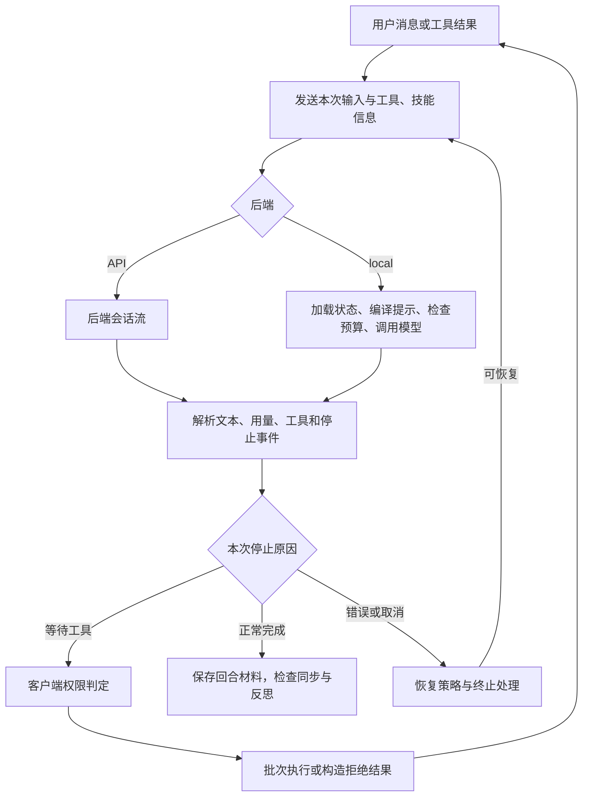
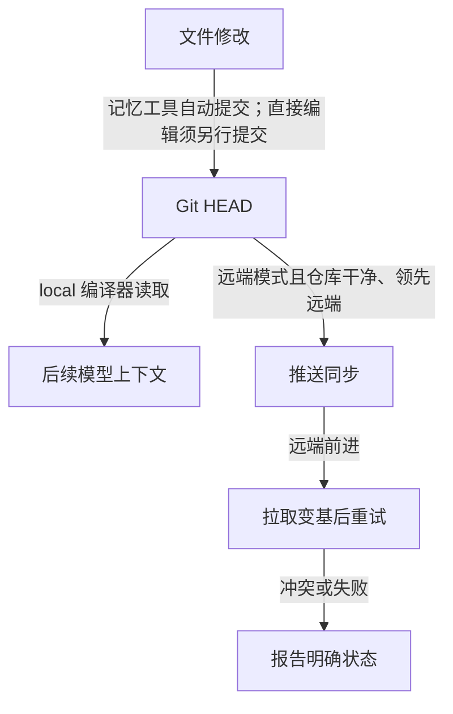
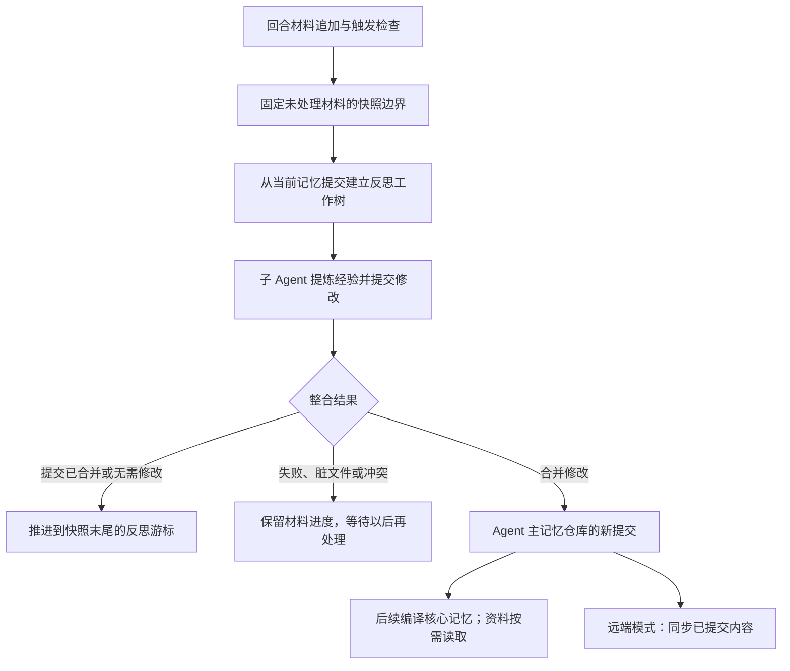

# Letta Code 设计与实现

[返回总览](<Agents 调研.md>)

写作日期：2026-09-07。本文基于 2026-09-06 获取的 Letta Code 源码快照，固定提交为 [`701f2a5367828847313876c735ade27b9df97689`](https://github.com/letta-ai/letta-code/commit/701f2a5367828847313876c735ade27b9df97689)。分析采用只读源码与当时的官方文档，不涉及部署运行或效果测试。

Letta Code 用长期 Agent 身份连接独立会话、Git 记忆与后台反思。经验主要保存在可读写文本和运行配置中；模型负责当次推理。阅读时沿着“消息 → 记忆提交 → 后续上下文”追踪，比把所有信息都称为 Memory 更清楚。

## 1. 长期身份与独立会话

一次会话结束后，当前上下文可以压缩或重建，Agent 的记忆继续存在。身份层决定“谁拥有经验”，会话层决定“当前处理哪条任务线”；跨任务连续性由外部状态维持，而非要求每次推理带上所有过去内容。

| 对象 | 保存什么 | 复用范围 |
| --- | --- | --- |
| `agent_id` | 身份、偏好、记忆归属 | 同一 Agent 的多个任务 |
| `conversation_id` | 消息、当前上下文 | 单条对话线，拥有独立推理预算 |
| 记忆 | pnpm 等稳定约定、项目知识 | 跨会话直接加载或按需读取 |
| 技能 | 可重复执行的步骤 | 按需加载，避免占满核心上下文 |

测试命令和临时错误先进入历史；稳定约定再整理为记忆或技能。同一 Agent 的后端修复会话与文档会话因此能共享经验，无需复制全部近期消息。[身份与上下文提示][identity]

当前仓库包含终端、无界面入口、本地运行时、App Server 和消息渠道。旧 `letta-ai/letta` 主分支已改为项目入口，V1 服务端退休、源码留在 archive；早期 Python 服务端与 archival memory 不属于本文实现线。[版本边界][history]

## 2. 两种后端如何划分职责

两种模式把状态保存和模型调用放在不同位置，但客户端工具仍需经过执行机器的权限边界。选择后端既影响部署位置，也影响能直接检查哪些实现；客户端能看到的协议行为，不足以说明云端内部步骤。

默认选择 `api`，地址为 `https://api.letta.com`；`--backend local` 切换为进程内实现，App Server 也可采用 local。上层共用消息和审批协议。[后端选择][backend-mode]、[默认设置][defaults]

| 层次 | 默认 API 路径 | local 路径 |
| --- | --- | --- |
| 交互与工具 | 当前机器处理界面、权限、本地工具与回传 | 复用同一执行框架 |
| 会话状态 | 后端保存和恢复消息、当前窗口 | 本地存储器保存会话与消息文件 |
| 模型调用 | API 后端推进 | 本地适配器调用配置的模型服务 |
| 长期记忆 | 远端仓库检出到本机，提交后同步 | 本机 Agent Git 仓库 |
| 可审阅边界 | 请求、事件、恢复协议、Git 同步 | 另可查看提示编译、压缩和模型适配 |

local 指状态与控制位置，模型仍可连接外部服务。本地 `conversation.json`、`messages.jsonl`、`system-prompt.json` 分别保存会话元信息、历史和编译提示缓存。后文精确预算算法以 local 为准，不外推为云端实现。[本地状态加载][local-state]、[官方自托管说明](https://docs.letta.com/self-hosting)

## 3. 一次任务如何走完运行循环

交互入口为 `use-conversation-loop` 的 `processConversation`，无界面循环在 `headless.ts`。两者通过 `sendMessageStream` 发送新消息或工具结果、工具定义、技能和流式字段，并请求压缩事件；API 依靠会话标识续接后端完整历史。[交互入口][loop]、[消息请求][message]

图中的控制权交接有三条边界：

| 条件 | 客户端动作 | 作用域与限制 |
| --- | --- | --- |
| `requires_approval` | 自动允许、拒绝或交互审批 | 表示等待工具处理，不等于必须弹窗 |
| 无界面工具确需用户输入 | 构造拒绝结果并回传 | 避免无限挂起，让模型决定后续行动 |
| local 输出工具调用 | 转为 `approval_request_message` | 仍交给客户端执行；API 还可先执行后端工具 |

依据：[审批与回传][approval-loop]、[模型事件转换][provider-events]。

`executeApprovalBatch` 预分配结果数组，按工具分类与资源键调度：只读可并行，同资源写入依次执行，不同资源组可并行；最终按原调用顺序回传。实际并发关系取决于工具声明的资源。[批次调度][batch]

| 停止或异常 | 后续行为 |
| --- | --- |
| 正常回答、取消、输出长度限制 | 分别处理回合结束、终止流/执行、长度边界 |
| 达到 `max_steps` | 先回传工具结果，再退出，避免后端卡在审批态 |
| 会话繁忙、审批标识失配 | 续接已有流，或重读后端状态 |
| 可恢复的限流、服务/网络异常 | 外层延迟重试；鉴权或额度失败按原因结束 |

SDK 自动重试默认关闭：网络报错时后端可能已接纳消息，重发可能重复动作。恢复先确认会话进度，再决定续接或重发。[步数边界][maxsteps]、[重试配置][message]、[恢复分类][recovery]

## 4. Git MemFS 怎样成为下一次推理的记忆

MemFS 按 Agent ID 管理普通文件与 Git 历史，同一 Agent 的会话共享内容；跨 Agent 共享需显式附加仓库。API 常见目录为 `~/.letta/agents/<agent-id>/memory`，local 为存储根下的 `memfs/<agent-id>/memory`。[记忆目录][memory-path]、[本地目录][local-path]

`memory`、`memory_apply_patch` 经 `commitMemoryWrite` 提交对应路径。回合末同步先查冲突和脏文件，不自动打包未提交编辑；local 没有 Letta 远端时跳过同步。因此“已修改”“已提交”“跨机器可见”是三个状态。提交把零散编辑变成可审阅版本，支持检查差异、查看历史和回退；仅保存文件不会自动完成这些步骤。[记忆写入][memory-write]、[提交实现][commit]、[回合末同步][memory-sync]

| 格式与选择条件 | 核心记忆 | 延后读取与约定 |
| --- | --- | --- |
| v1；当前 local 始终使用 | `system/` 下 Markdown | 其他资料通过文件索引发现 |
| v2：非 local 且有根 `MEMORY.md` | 根 `MEMORY.md` 及其他根级 Markdown | 子目录用自身 `MEMORY.md` 逐层索引；技能另行组织 |

v2 索引无前置元数据，其他记忆 Markdown 使用 `name`、`description`。客户端支持两代识别与校验，下述编译细节仅来自 local v1。[格式检测][memory-format]、[v2 提示约定][identity]

本地编译器用 `git ls-tree HEAD` 枚举、`git show HEAD:<path>` 读正文：核心内容进入提示，外部资料提供索引，技能正文按需加载。缓存同时检查原提示哈希和 MemFS 提交；提交变化后，按模型能力更新会话中系统消息或重编译，不回溯已发出的请求。[读取已提交内容][compiler-read]、[提示缓存与更新][compiler-refresh]

| 检索对象 | 默认能力 | 可选扩展或差异 |
| --- | --- | --- |
| MemFS 文件 | 路径、描述、Markdown 链接、普通搜索；无向量索引 | `memfs-search` 与 QMD 可引入语义/混合检索 |
| 对话消息 | local 为全文匹配 | 云端支持全文、向量与混合搜索 |

依据：[官方检索说明](https://docs.letta.com/concepts/memfs)、[消息搜索接口][search]。

## 5. 后台反思如何整理经验而不抢占当前记忆

任务中主动记忆与后台反思是两条入口：前者由当前 Agent 当场决定写入，后者集中整理已发生的交互。后台完成也不一定产生新提交，需要把“材料已审阅”和“记忆确有变化”分别记录。

客户端默认累计 **25 步、回合末检查、自动合并**；可改为压缩事件触发或关闭。步数按反思材料中的 assistant 记录计数，先追加本轮材料再检查；Cloud 返回 `cutover=true` 时由云端接管，客户端不重复启动。[触发默认值][defaults]、[回合末检查][reflection-trigger]、[云端接管][cutover]

| 阶段 | 保存或修改什么 | 并发与完成边界 |
| --- | --- | --- |
| 追加材料 | 用户、助手、推理、工具、错误写入 JSONL，累计步骤 | 从上次游标选未处理区间 |
| 固定快照 | 记录本批结束消息及材料边界 | 主会话可继续增长，新消息留待下批 |
| 建立候选 | 从父仓库 `HEAD` 创建 `letta/reflection/<id>` 与工作树 | 主要可写区域为 `memory-worktrees`，不直接改主目录 |
| 整合 | 默认自动合并；也可由主 Agent 在后台会话审阅 | 与最新主记忆重新整合 |

依据：[材料追加][transcript-append]、[快照][transcript-snapshot]、[工作树与范围][worktree]。

反思先读旧记忆，提炼纠正、偏好、事实、矛盾和流程；过滤临时路径、一次性状态、重复知识。优先修订已有技能，每批最多一项技能操作，没有长期价值可不修改。[反思提示][reflection-prompt]

| 整合结果 | 材料游标 | 记忆编译 |
| --- | --- | --- |
| `merged` | 推进到快照末尾 | 触发更新 |
| `no_changes` | 同样推进，避免反复处理 | 无需更新 |
| 主/反思目录脏、冲突或执行失败 | 保留原进度，清理候选工作树后可重试 | 不把失败当作新记忆 |

依据：[结果判定][merge-status]、[合并与清理][merge]、[游标提交][transcript-finalize]。

主会话与反思读取的材料截止点不同，游标只确认本批快照的处理结果，不代表已处理所有最新消息。Git 提供版本起点、候选与可追踪整合；内容价值仍靠提示和审阅判断。`/doctor` 可检查布局、重复与提示占用，学习收益需另行评测。

## 6. 上下文预算与完整历史怎样协作

local 优先用最近可信模型用量加新增消息估算；缺少可信统计时估算系统提示、消息和工具，文本约按字符数 / 4、图片用固定值。压缩后旧统计不再作新窗口基准。[用量估算][estimate]、[请求预算][budget]

| 环节 | 默认行为或条件 | 保留边界 |
| --- | --- | --- |
| 提前压缩 | 窗口 `W` 预留 `min(16384, max(1, floor(W×0.2)))` | 用量超过 `W − 预留` 触发；溢出另有补救 |
| 摘要策略 | 滑动窗口，保留预算比例 0.3；支持全量摘要 | 记录目标、已做工作、关键细节和查找线索 |
| 更新窗口 | 摘要 + 保留消息更新 `in_context_message_ids` | 完整历史追加压缩记录，原消息仍可检索 |
| 恢复与限制 | 滑窗失败可尝试全量摘要等恢复 | 历史压缩无法消除系统提示与工具的基础开销 |

估算可能偏离实际分词；基础输入已超窗时需调整输入本身。API 仅通过 compact 接口与压缩事件协作，不能据此断言云端阈值或数据库实现。[阈值][budget]、[压缩配置][compaction]、[状态更新][compaction-store]、[退路][compaction-fallback]、[API 代理][api-compact]

摘要保持任务方向，历史补回精确原文，MemFS 保存跨会话知识；三者分别承担延续、追溯和复用。例如摘要留下某个错误或接口的查找线索，后续通过消息搜索补回原文；稳定项目约定则从记忆加载，不依赖当前窗口恰好还保留那次讨论。

## 7. 技能与子 Agent 如何延伸长期能力

| 能力 | 默认路径 | 持久化边界 |
| --- | --- | --- |
| 技能发现 | 项目 → Agent MemFS → 全局 → 内置 | 先给名称与描述，使用时加载正文 |
| Agent 自有技能 | 保存做事方法，随记忆版本化 | 云端模式可同步迁移 |
| 普通子 Agent | 可新建、继承父上下文或部署已有 Agent | 新建时默认无独立持久 MemFS |
| 反思子 Agent | 在专门记忆范围编辑父 Agent 的候选版本 | 通过整合进入长期记忆 |

子任务以无界面子进程执行，输出结构化事件，取消时可发送终止信号。长期主身份与临时角色由此配合，无需每次分工都复制长期知识。[技能来源][skills]、[子进程参数][subagent-args]、[生命周期][subagent-process]

## 8. 从修复到复用：一条示意路径

以下是机制示意，并非运行记录：同一 Agent 在 local 模式修复订单接口，再处理退款功能。

| 时点 | 当次动作 | 留给后续的产物 |
| --- | --- | --- |
| 订单修复 | 读代码、改文件、执行测试；用户纠正 pnpm 与错误返回约定 | 历史保存操作和纠正原文 |
| 当场记忆 | 判断约定稳定后调用记忆工具 | 已提交记忆可供后续编译 |
| 达到反思门槛 | 独立工作树整理近期材料 | 合并则更新记忆；无修改也推进游标 |
| 新会话做退款 | 加载共享核心约定，按需读资料/技能 | 无需复制旧过程；精确输出通过历史搜索找回 |
| 任务接近窗口 | 摘要保存目标与进度 | 原历史留存，长期约定仍由 MemFS 承载 |

## 9. 源码阅读路线与分析范围

| 顺序 | 阅读入口 | 核心问题 |
| --- | --- | --- |
| 1 | [后端选择][backend-mode] → [消息请求][message] | API/local 怎样共用上层协议？ |
| 2 | [交互循环][loop] → [模型事件][provider-events] → [工具批次][batch] | 控制权怎样在模型与工具间交接？ |
| 3 | [预算][budget] → [压缩存储][compaction-store] | 完整历史与有效窗口如何分离？ |
| 4 | [提交][commit] → [同步][memory-sync] → [编译刷新][compiler-refresh] | 文件何时进入后续推理？ |
| 5 | [触发][reflection-trigger] → [快照][transcript-snapshot] → [工作树][worktree] → [游标][transcript-finalize] | 何时算反思完成？ |

源码证明流程与状态转换存在；学习收益、召回率、成本和并发可靠性仍需运行实验。API/local、MemFS 两代与 Cloud 接管的边界不能互相替代。

[history]: https://github.com/letta-ai/letta/blob/4511fa0bc91f68fbab32b91f694617271ea9012b/README.md#L1-L40
[identity]: https://github.com/letta-ai/letta-code/blob/701f2a5367828847313876c735ade27b9df97689/src/agent/prompts/letta_root_memfs.md#L5-L63
[backend-mode]: https://github.com/letta-ai/letta-code/blob/701f2a5367828847313876c735ade27b9df97689/src/backend/backend-mode.ts#L16-L39
[defaults]: https://github.com/letta-ai/letta-code/blob/701f2a5367828847313876c735ade27b9df97689/src/settings-manager.ts#L173-L198
[local-state]: https://github.com/letta-ai/letta-code/blob/701f2a5367828847313876c735ade27b9df97689/src/backend/local/local-store.ts#L2785-L2838
[loop]: https://github.com/letta-ai/letta-code/blob/701f2a5367828847313876c735ade27b9df97689/src/cli/app/use-conversation-loop.ts#L740-L805
[message]: https://github.com/letta-ai/letta-code/blob/701f2a5367828847313876c735ade27b9df97689/src/agent/message.ts#L297-L363
[approval-loop]: https://github.com/letta-ai/letta-code/blob/701f2a5367828847313876c735ade27b9df97689/src/headless.ts#L2766-L2858
[provider-events]: https://github.com/letta-ai/letta-code/blob/701f2a5367828847313876c735ade27b9df97689/src/backend/dev/provider-turn-executor.ts#L429-L510
[batch]: https://github.com/letta-ai/letta-code/blob/701f2a5367828847313876c735ade27b9df97689/src/agent/approval-execution.ts#L353-L475
[maxsteps]: https://github.com/letta-ai/letta-code/blob/701f2a5367828847313876c735ade27b9df97689/src/headless.ts#L2366-L2399
[recovery]: https://github.com/letta-ai/letta-code/blob/701f2a5367828847313876c735ade27b9df97689/src/agent/turn-recovery-policy.ts#L16-L107
[memory-path]: https://github.com/letta-ai/letta-code/blob/701f2a5367828847313876c735ade27b9df97689/src/agent/memory-filesystem.ts#L26-L80
[local-path]: https://github.com/letta-ai/letta-code/blob/701f2a5367828847313876c735ade27b9df97689/src/backend/local/paths.ts#L27-L52
[memory-write]: https://github.com/letta-ai/letta-code/blob/701f2a5367828847313876c735ade27b9df97689/src/tools/impl/memory.ts#L130-L159
[commit]: https://github.com/letta-ai/letta-code/blob/701f2a5367828847313876c735ade27b9df97689/src/agent/memory-git.ts#L1340-L1379
[memory-sync]: https://github.com/letta-ai/letta-code/blob/701f2a5367828847313876c735ade27b9df97689/src/agent/memory-git.ts#L1922-L2053
[memory-format]: https://github.com/letta-ai/letta-code/blob/701f2a5367828847313876c735ade27b9df97689/src/agent/memory-format.ts#L4-L47
[compiler-read]: https://github.com/letta-ai/letta-code/blob/701f2a5367828847313876c735ade27b9df97689/src/backend/local/system-prompt-compilation.ts#L60-L116
[compiler-refresh]: https://github.com/letta-ai/letta-code/blob/701f2a5367828847313876c735ade27b9df97689/src/backend/local/local-backend.ts#L930-L1011
[search]: https://github.com/letta-ai/letta-code/blob/701f2a5367828847313876c735ade27b9df97689/src/backend/api/search.ts#L9-L18
[reflection-trigger]: https://github.com/letta-ai/letta-code/blob/701f2a5367828847313876c735ade27b9df97689/src/cli/helpers/post-turn-reflection.ts#L17-L79
[cutover]: https://github.com/letta-ai/letta-code/blob/701f2a5367828847313876c735ade27b9df97689/src/cli/helpers/reflection-launcher.ts#L688-L742
[transcript-append]: https://github.com/letta-ai/letta-code/blob/701f2a5367828847313876c735ade27b9df97689/src/cli/helpers/reflection-transcript.ts#L930-L953
[transcript-snapshot]: https://github.com/letta-ai/letta-code/blob/701f2a5367828847313876c735ade27b9df97689/src/cli/helpers/reflection-transcript.ts#L1647-L1681
[transcript-finalize]: https://github.com/letta-ai/letta-code/blob/701f2a5367828847313876c735ade27b9df97689/src/cli/helpers/reflection-transcript.ts#L1873-L1905
[worktree]: https://github.com/letta-ai/letta-code/blob/701f2a5367828847313876c735ade27b9df97689/src/agent/memory-worktree.ts#L119-L205
[reflection-prompt]: https://github.com/letta-ai/letta-code/blob/701f2a5367828847313876c735ade27b9df97689/src/agent/subagents/builtin/reflection-v2.md#L51-L115
[merge-status]: https://github.com/letta-ai/letta-code/blob/701f2a5367828847313876c735ade27b9df97689/src/agent/memory-worktree.ts#L208-L238
[merge]: https://github.com/letta-ai/letta-code/blob/701f2a5367828847313876c735ade27b9df97689/src/agent/memory-worktree.ts#L573-L620
[estimate]: https://github.com/letta-ai/letta-code/blob/701f2a5367828847313876c735ade27b9df97689/src/backend/local/local-context-estimate.ts#L1-L25
[budget]: https://github.com/letta-ai/letta-code/blob/701f2a5367828847313876c735ade27b9df97689/src/backend/dev/provider-turn-executor.ts#L190-L270
[compaction]: https://github.com/letta-ai/letta-code/blob/701f2a5367828847313876c735ade27b9df97689/src/backend/local/compaction.ts#L21-L45
[compaction-store]: https://github.com/letta-ai/letta-code/blob/701f2a5367828847313876c735ade27b9df97689/src/backend/local/local-store.ts#L1664-L1726
[compaction-fallback]: https://github.com/letta-ai/letta-code/blob/701f2a5367828847313876c735ade27b9df97689/src/backend/local/local-backend.ts#L763-L824
[api-compact]: https://github.com/letta-ai/letta-code/blob/701f2a5367828847313876c735ade27b9df97689/src/backend/backend.ts#L475-L514
[skills]: https://github.com/letta-ai/letta-code/blob/701f2a5367828847313876c735ade27b9df97689/src/agent/skills.ts#L1-L9
[subagent-args]: https://github.com/letta-ai/letta-code/blob/701f2a5367828847313876c735ade27b9df97689/src/agent/subagents/manager.ts#L263-L321
[subagent-process]: https://github.com/letta-ai/letta-code/blob/701f2a5367828847313876c735ade27b9df97689/src/agent/subagents/manager.ts#L490-L527
