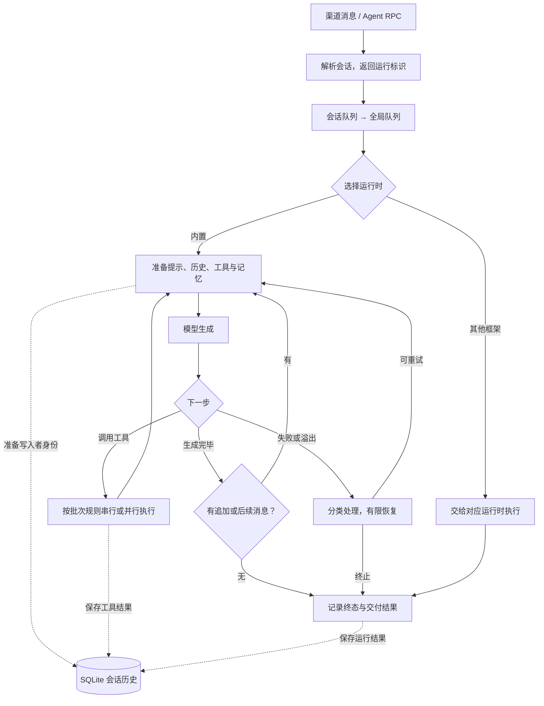
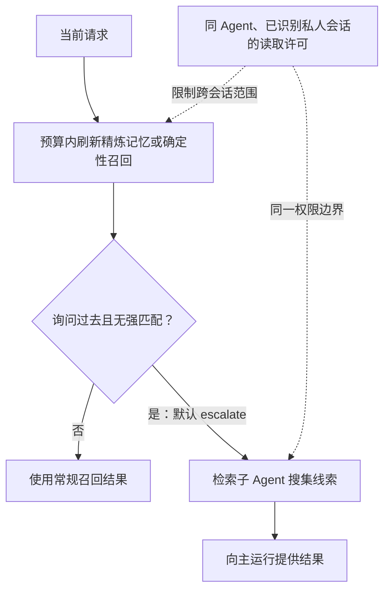
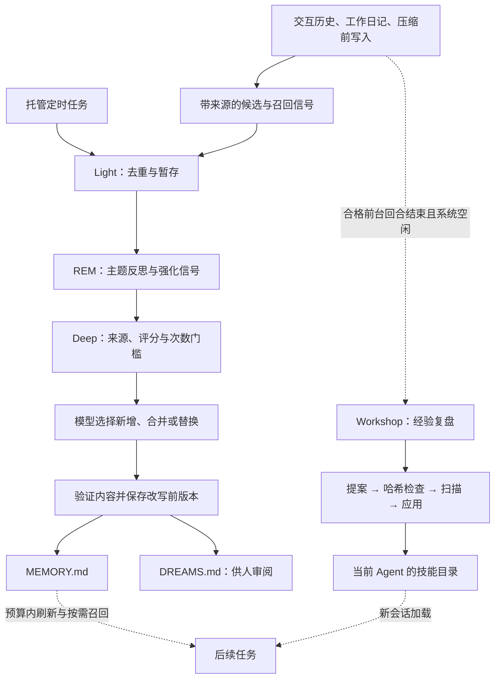

# OpenClaw 设计与实现

[返回总览](<Agents 调研.md>)

写作日期：2026-09-07。源码基准：2026-09-06 获取的 [047fdfe90fef](https://github.com/openclaw/openclaw/commit/047fdfe90fef01802d659eedb781cb410fcd6ccc)，提交时间为北京时间 2026-09-06 11:06:22，包版本为 `2026.9.2`。本文依据该快照中的实现和官方文档展开，未刷新主分支，也未运行项目或测试学习效果。

## 1. 设计定位与状态归属

OpenClaw 是长期在线的助理系统：聊天渠道、控制界面、命令行和定时任务共享 Gateway 入口。Gateway 识别会话、安排执行并交付结果，运行时推进模型与工具循环，记忆和技能供后续任务复用。[架构说明][oc1]

当前内置内核是自有 `packages/agent-core` 与 `@openclaw/ai`，部分代码改编自 Pi/pi-mono，终端仍依赖 `pi-tui`；另支持 Codex、Copilot 等运行框架与独立 CLI 后端，不能将所有执行路径视为同一内核。[内核入口][oc2]、[来源声明][oc3]

| 状态或模块 | 保存/负责什么 | 作用域 |
| --- | --- | --- |
| Agent | 工作区、技能、长期记忆 | 可拥有多个会话 |
| 会话与一次运行 | 连续对话；本次输入及工具循环 | 子 Agent 可建立独立会话 |
| Gateway 与队列 | 连接、入口身份、投递目标、运行标识 | 同会话串行，限制全局并发 |
| 运行时 | 模型、认证、工具、上下文、取消信号 | 执行当前运行 |
| memory-core | 索引、来源分类、候选与巩固阶段 | 持久记忆与召回 |
| Skill Workshop | 提案、修订哈希、扫描和回滚元数据 | 当前 Agent 的技能 |

默认主数据库为 `~/.openclaw/agents/<agentId>/agent/openclaw-agent.sqlite`，保存当前会话、历史、摘要与终态；旧 `sessions.json`、JSONL 主要留在迁移和归档路径。工作区 Markdown 保存可人工编辑的记忆，数据库保存检索与执行状态：只备份文件无法覆盖完整运行状态。[会话存储][oc4]、[记忆索引][oc5]

## 2. 一次任务怎样运行

### 2.1 接纳、排队与写入权

| 时点 | 执行动作 | 关键边界 |
| --- | --- | --- |
| 接收 `agent` RPC | 校验参数、解析会话、保存元数据，返回 `runId` | 仅代表接纳；结果由事件流或 `agent.wait` 获取 |
| `agentCommand` | 解析模型和技能，交给 `runEmbeddedAgent` | 入队后才分发合格的 CLI 后端 |
| 排队 | `enqueueSession` 包裹 `enqueueGlobal` | 会话延后维护先结束，再占全局名额 |
| 获得执行权 | 准备工作区、认证、工具、技能快照和提示 | 持久记录 `activeWriterRunId` |
| 写入历史 | 每次携带预期运行标识，数据库提交时复核 | 拒绝被替代旧实例的迟到写回 |

队列维持正常顺序，写入者校验处理异步完成造成的竞争；同一会话的维护也不会提前占住其他会话共享的执行名额。[入口与返回语义][oc6]、[入队实现][oc7]、[写入者检查][oc8]

### 2.2 模型、工具与追加消息

下图展开内置运行时；上下文按实际预算维护，其他框架自行推进底层循环。

| 条件 | 默认行为 | 作用域与边界 |
| --- | --- | --- |
| 单轮工具批次 | 默认并发；显式顺序或有工具要求 `sequential` 时整批顺序执行 | 不改变同会话运行串行规则 |
| 运行中收到新消息 | 默认 `steer` 尝试交给当前运行 | 不撤回已越过启动检查点的并行批次 |
| steer 遇到顺序工具 | 正在执行者可结束，未启动者可跳过 | 不等于回滚已完成动作 |
| 没有工具、追加及后续消息 | 循环正常结束 | 一段时间无输出本身不是完成信号 |

其他队列模式可留待后续回合、合并跟进，或中断后处理最新消息。[工具批次决策][oc9]、[默认并发配置][oc10]、[消息队列][oc11]、[循环退出][oc12]

### 2.3 终止、恢复与子任务交付

| 事件 | 处理 | 保留边界 |
| --- | --- | --- |
| 错误、取消、执行预算耗尽 | 可终止运行 | `agent.wait` 等待超时不取消底层任务 |
| 上下文溢出 | 压缩后有限重试，清理流式缓冲与工具摘要 | 避免重复输出 |
| 用户停止 | 不再开始新恢复步骤 | 已完成写入和压缩仍保留 |
| 子任务完成 | 父运行活跃时先唤醒/追加，否则同会话排队 | “算完”“已入队”“已送达”分别记录 |
| 子结果交付受阻 | 最多重试 30 分钟，间隔渐增至 5 分钟 | 截止后保留结果并暴露受阻状态 |

子 Agent 默认独立会话与上下文，也可用 `context: fork` 继承父历史。创建通常接纳即返回，父任务可让出回合等待完成事件；收到的报告仍需父任务审阅。交付使用稳定幂等标识，但外部回执不明时，人工重试仍可能重复消息。[子会话与继承][oc15]、[推送式完成][oc16]、[交付协议][oc17]

恢复依据：[重试与超时][oc13]、[取消边界][oc14]。

## 3. 长上下文：体积、延续性与长期价值

三种动作分别产生精简视图、日记和摘要，不能把它们都理解为删除旧历史。

| 动作 | 触发与默认值 | 写入结果/失败边界 |
| --- | --- | --- |
| pruning | 客户端需缓存 TTL 到期；约 30% 占用开始缩短旧结果 | 仍约 50% 且内容足够可换占位符；原结果保留 |
| memory flush | 压缩阈值前再提前一个软余量；默认要求工作区可写 | 仅追加 `memory/YYYY-MM-DD.md`；无有用内容可静默结束 |
| compaction | 默认开启；窗口减预留量触发，也可溢出补救 | 持久摘要 + 近期消息；必要压缩失败保留历史并报错 |

pruning 保护最近 3 个助手回合及首条用户消息之前的内容；`openclaw.cache-ttl` 投影标记可在重启后恢复。非 Anthropic 配置默认关闭，Anthropic 认证可能使用预设；直接 Anthropic API key 的合格请求走服务端清理，不套用客户端时间门槛。[完整裁减规则][oc18]

内置路径优先采用新鲜 token 统计，否则读取历史估算下次请求。memory flush 不改长期记忆和操作指令文件，保存的日记再交给长期整理流程。[预算计算][oc19]、[写入提示与默认开关][oc20]

compaction 保持工具调用/结果配对，新配置默认 `safeguard`，检查摘要结构、未完成请求和精确标识并有限修正。写入失败或重试耗尽不重置会话；仅在摘要模型未明确覆盖时可尝试备用模型，取消和质量检查失败不切模型。这些规则限于内置路径，原生框架负责自己的压缩。[摘要校验][oc21]、[模型回退][oc22]、[失败保持][oc23]

## 4. 持久记忆：保存什么，怎样找回

| 文件 | 内容 | 进入上下文的方式 |
| --- | --- | --- |
| `MEMORY.md` | 精炼长期事实、决定 | 按来源资格与提示预算加载 |
| `USER.md` | 用户偏好、指令 | 同上 |
| `memory/*.md` | 日记等详细材料 | 按需检索；裸 `/new`、`/reset` 可加载今昨笔记 |
| `DREAMS.md` | 后台整理的审阅日志 | 不作普通记忆自动注入或再晋升 |

依据：[文件约定][oc24]。

索引默认每块 400 tokens、重叠 80 tokens，合并短时间文件变更后更新。向量匹配含义，FTS5/BM25 保留错误码、标识符和配置键的精确命中；随后按时间和重要性排序，以 MMR 去重，无需学习式重排模型。日期笔记会衰减，精炼长期记忆通常保持有效。[分块与更新][oc25]、[排序过程][oc26]

| provider 配置或扩展 | 故障/可用性边界 |
| --- | --- |
| 默认向量服务 OpenAI；未显式指定、`auto` 或本地路径 | 失败可降级为关键词检索 |
| 显式指定 `openai`、`ollama` 等 | 请求失败报告记忆不可用，不以 fallback 掩盖配置问题 |
| 本地 GGUF | 需官方 llama.cpp provider；`sqlite-vec` 为可选加速 |
| 旧 QMD | 已移除；迁移保留原记忆/附加路径，内置不再提供其 HyDE 与交叉编码器 |
| 外部插件 | 仍可通过记忆插槽选择 `memory-lancedb` 等 |

依据：[故障策略][oc27]、[QMD 迁移][oc28]、[LanceDB插件][oc29]。

### 按需升级的 Active Memory

确定性路径按词法/向量触发短语匹配，最多补入 3 条可信内容；深层搜索只在回忆意图且无强命中时启动，普通问题无需每次多跑一轮模型。[两层召回][oc30]、[触发召回][oc31]

跨会话召回在个人安装默认开启，配置私聊隔离后默认关闭。即使加入索引，也只允许同 Agent 已识别的私人会话互相召回，排除群聊、其他 Agent 和元数据不足的历史，不扩大 `sessions_*` 权限。建立索引与当前请求获准读取是两次判断。[跨会话边界][oc32]

## 5. 自主学习：事实与操作技能分别更新

### 5.1 Dreaming：来源检查后巩固长期事实

默认 `memory-core` 每天 **03:00** 整理，时区可配。light 去重暂存，REM 提炼主题并影响候选排序，deep 才决定晋升到 `MEMORY.md`。[默认值][oc33]、[阶段职责][oc34]

| 检查点 | 条件或动作 | 失败/排除边界 |
| --- | --- | --- |
| 候选准入 | 评分、召回次数、不同查询数同时达标 | 建模前排除 `untrusted`、`system` |
| 会话来源 | 必须为交互会话 | 排除心跳、定时、子任务及未知来源 |
| 防止重复证据 | 召回内容带标记 | 不反复提取为新证据；审阅日志不参与晋升 |
| 模型决策与写入 | 新增/合并/替换；由候选来源片段组成结果 | 检查保留比例、引用、容量 |
| 接受改写 | 保存旧内容并复核哈希 | 模型不可用或校验失败，退到追加晋升路径 |

外部网页不会因为频繁出现就越过来源门槛；反思影响候选判断，可持久写入仍需证据。[候选过滤代码][oc35]、[摄取与门槛][oc36]、[巩固与留痕][oc37]

### 5.2 Skill Workshop：复盘后更新可复用步骤

自动模式和审批策略默认均为 `auto`，支持使用中修复、回合后复盘、每周整理。`propose` 只留提案，`off` 关闭自动捕获；显式 `/learn` 与人工创作仍可使用。[默认策略][oc38]、[模式说明][oc39]

| 自动经验复盘门槛 | 必须满足或排除什么 |
| --- | --- |
| 前台回合资格 | 至少 10 次模型迭代，已完成或中断，无模型服务/提示错误 |
| 系统空闲 | 等待 30 秒且没有活动运行 |
| 运行时能力 | 报告实际模型，且 `skill_workshop` 可用 |
| 排除范围 | 已压缩回合、子任务、心跳、定时任务、复盘自身 |

依据：[触发代码][oc40]。发生过压缩的回合不会自动复盘，仍可显式 `/learn`；后台维护也不会递归触发学习。

复盘只读取截至原回合结束的材料，工具限于 Workshop，最多一次技能变更，优先修正已有方法。

| 提案阶段 | 状态检查 | 应用范围 |
| --- | --- | --- |
| `PROPOSAL.md` | 绑定目标哈希；目标变化使提案过期 | 原回合之后的新消息不混入证据 |
| 扫描与应用 | 严重扫描结果可隔离，通过后生成 `SKILL.md` | 仅当前 Agent 的 `workshop-skills` |
| 生效与恢复 | 单项应用保留回滚元数据 | 新会话加载更新；当前会话保留技能快照 |

依据：[证据与操作限制][oc41]、[提案生命周期][oc42]。

Dreaming 与 Workshop 更新外部文件，不训练模型参数。定时任务只负责启动整理，默认心跳不自行维护记忆；评估插件接口可供外部控制器组合，但没有内置无限“评估—修订—停止”的通用优化循环。[评估接口边界][oc43]

## 6. 运行时差异决定哪些能力可用

| 层次 | 决定什么 | 边界 |
| --- | --- | --- |
| 模型服务 | 认证、发现、命名 | 服务/模型条目可配置 `agentRuntime.id` |
| 模型 | 本次使用哪个模型 | 同名模型不保证执行能力相同 |
| 运行时 | 如何驱动工具、压缩、结束回合 | 经验复盘需检查运行时实际能力 |
| Gateway | 接纳、队列、对外交付 | 保留统一入口，不接管原生结束语义 |

例如 Codex app-server 的服务存活与精确结束由原生 Codex 判断，Gateway 不能因暂时无输出就宣布完成。[配置分层][oc44]、[原生完成信号][oc45]

## 7. 排障到复用：端到端示意

以下不是运行记录，展示同一私人会话的构建排障如何产生不同产物。

| 时点 | 行为 | 后续价值/边界 |
| --- | --- | --- |
| 询问“以前怎样处理” | 排队；普通召回弱时升级 Active Memory | 仅在许可的私人历史中找线索 |
| 阅读日志与配置 | 工具循环，必要时分给子任务；接收用户补充 | 父运行审阅子报告后判断完成 |
| 上下文变大 | 合格旧结果裁减，临界前写日记、压缩 | 原历史保留；发生压缩则排除自动技能复盘 |
| 回合结束 | 未压缩且符合门槛时，空闲后 Workshop 复盘 | 应用后的技能供新会话加载 |
| 后续证据积累 | Dreaming 筛选并晋升稳定事实 | 候选不足可无变化，不保证每次产生新知识 |

历史支持追溯，记忆提供长期上下文，技能保存操作方法。

## 8. 源码阅读路线与核查边界

| 顺序 | 阅读入口 | 重点问题 |
| --- | --- | --- |
| 1 | [运行协调器][oc46] → [会话创建][oc47] | 何时获得执行权并选择运行时？ |
| 2 | [内核循环][oc48] | 工具结果怎样驱动下一轮，何时退出？ |
| 3 | [维护预算][oc49] | 统计与估算怎样决定提前写入？ |
| 4 | [Dreaming 调度][oc50] | 谁创建和去重后台整理任务？ |
| 5 | [经验复盘调度][oc51] | 哪些回合有资格成为学习材料？ |

快照文档有两处差异，本文采用更具体的说明：裁减专页确认投影标记可持久恢复，压缩页旧表仍称其仅在内存；Workshop 新流程不提供集合级事务或新建整体备份，区别于自学习页旧说法，但单提案回滚元数据仍保留。[每周整理恢复说明][oc52]

本文未评测召回率、技能收益、延迟和成本。来源过滤依赖工具正确声明网络来源，工作区文件在操作者信任边界内；来源门槛、扫描、哈希各约束不同风险，不能代替生成内容的效果验证。[来源边界][oc53]

[oc1]: https://github.com/openclaw/openclaw/blob/047fdfe90fef01802d659eedb781cb410fcd6ccc/docs/concepts/agent-loop.md#L9-L46
[oc2]: https://github.com/openclaw/openclaw/blob/047fdfe90fef01802d659eedb781cb410fcd6ccc/src/agents/runtime/index.ts#L1-L29
[oc3]: https://github.com/openclaw/openclaw/blob/047fdfe90fef01802d659eedb781cb410fcd6ccc/THIRD_PARTY_NOTICES.md#L7-L15
[oc4]: https://github.com/openclaw/openclaw/blob/047fdfe90fef01802d659eedb781cb410fcd6ccc/docs/concepts/session.md#L215-L240
[oc5]: https://github.com/openclaw/openclaw/blob/047fdfe90fef01802d659eedb781cb410fcd6ccc/docs/concepts/memory-builtin.md#L89-L135
[oc6]: https://github.com/openclaw/openclaw/blob/047fdfe90fef01802d659eedb781cb410fcd6ccc/docs/concepts/agent-loop.md#L18-L29
[oc7]: https://github.com/openclaw/openclaw/blob/047fdfe90fef01802d659eedb781cb410fcd6ccc/src/agents/embedded-agent-runner/run-orchestrator.ts#L192-L237
[oc8]: https://github.com/openclaw/openclaw/blob/047fdfe90fef01802d659eedb781cb410fcd6ccc/src/config/sessions/session-accessor.sqlite-transcript-write.ts#L211-L235
[oc9]: https://github.com/openclaw/openclaw/blob/047fdfe90fef01802d659eedb781cb410fcd6ccc/packages/agent-core/src/agent-loop.ts#L525-L594
[oc10]: https://github.com/openclaw/openclaw/blob/047fdfe90fef01802d659eedb781cb410fcd6ccc/packages/agent-core/src/agent.ts#L338-L361
[oc11]: https://github.com/openclaw/openclaw/blob/047fdfe90fef01802d659eedb781cb410fcd6ccc/docs/concepts/queue.md#L26-L44
[oc12]: https://github.com/openclaw/openclaw/blob/047fdfe90fef01802d659eedb781cb410fcd6ccc/packages/agent-core/src/agent-loop.ts#L486-L515
[oc13]: https://github.com/openclaw/openclaw/blob/047fdfe90fef01802d659eedb781cb410fcd6ccc/docs/concepts/agent-loop.md#L108-L165
[oc14]: https://github.com/openclaw/openclaw/blob/047fdfe90fef01802d659eedb781cb410fcd6ccc/docs/concepts/compaction.md#L37-L47
[oc15]: https://github.com/openclaw/openclaw/blob/047fdfe90fef01802d659eedb781cb410fcd6ccc/docs/tools/subagents.md#L11-L31
[oc16]: https://github.com/openclaw/openclaw/blob/047fdfe90fef01802d659eedb781cb410fcd6ccc/docs/tools/subagents.md#L93-L102
[oc17]: https://github.com/openclaw/openclaw/blob/047fdfe90fef01802d659eedb781cb410fcd6ccc/docs/tools/subagents.md#L105-L116
[oc18]: https://github.com/openclaw/openclaw/blob/047fdfe90fef01802d659eedb781cb410fcd6ccc/docs/concepts/session-pruning.md#L9-L115
[oc19]: https://github.com/openclaw/openclaw/blob/047fdfe90fef01802d659eedb781cb410fcd6ccc/src/auto-reply/reply/agent-runner-memory.ts#L1297-L1334
[oc20]: https://github.com/openclaw/openclaw/blob/047fdfe90fef01802d659eedb781cb410fcd6ccc/extensions/memory-core/src/flush-plan.ts#L16-L44
[oc21]: https://github.com/openclaw/openclaw/blob/047fdfe90fef01802d659eedb781cb410fcd6ccc/docs/concepts/compaction.md#L13-L47
[oc22]: https://github.com/openclaw/openclaw/blob/047fdfe90fef01802d659eedb781cb410fcd6ccc/docs/concepts/compaction.md#L129-L135
[oc23]: https://github.com/openclaw/openclaw/blob/047fdfe90fef01802d659eedb781cb410fcd6ccc/docs/concepts/compaction.md#L180-L200
[oc24]: https://github.com/openclaw/openclaw/blob/047fdfe90fef01802d659eedb781cb410fcd6ccc/docs/concepts/memory.md#L10-L65
[oc25]: https://github.com/openclaw/openclaw/blob/047fdfe90fef01802d659eedb781cb410fcd6ccc/docs/concepts/memory-builtin.md#L89-L131
[oc26]: https://github.com/openclaw/openclaw/blob/047fdfe90fef01802d659eedb781cb410fcd6ccc/docs/concepts/memory-search.md#L82-L108
[oc27]: https://github.com/openclaw/openclaw/blob/047fdfe90fef01802d659eedb781cb410fcd6ccc/docs/concepts/memory-search.md#L122-L137
[oc28]: https://github.com/openclaw/openclaw/blob/047fdfe90fef01802d659eedb781cb410fcd6ccc/docs/concepts/memory-builtin.md#L152-L191
[oc29]: https://github.com/openclaw/openclaw/blob/047fdfe90fef01802d659eedb781cb410fcd6ccc/docs/plugins/memory-lancedb.md#L11-L30
[oc30]: https://github.com/openclaw/openclaw/blob/047fdfe90fef01802d659eedb781cb410fcd6ccc/docs/concepts/active-memory.md#L10-L21
[oc31]: https://github.com/openclaw/openclaw/blob/047fdfe90fef01802d659eedb781cb410fcd6ccc/docs/concepts/memory-search.md#L110-L120
[oc32]: https://github.com/openclaw/openclaw/blob/047fdfe90fef01802d659eedb781cb410fcd6ccc/docs/concepts/active-memory.md#L44-L70
[oc33]: https://github.com/openclaw/openclaw/blob/047fdfe90fef01802d659eedb781cb410fcd6ccc/src/memory-host-sdk/dreaming.ts#L22-L32
[oc34]: https://github.com/openclaw/openclaw/blob/047fdfe90fef01802d659eedb781cb410fcd6ccc/docs/concepts/dreaming.md#L31-L63
[oc35]: https://github.com/openclaw/openclaw/blob/047fdfe90fef01802d659eedb781cb410fcd6ccc/extensions/memory-core/src/dreaming-consolidation-candidates.ts#L4-L24
[oc36]: https://github.com/openclaw/openclaw/blob/047fdfe90fef01802d659eedb781cb410fcd6ccc/docs/concepts/dreaming.md#L68-L92
[oc37]: https://github.com/openclaw/openclaw/blob/047fdfe90fef01802d659eedb781cb410fcd6ccc/docs/concepts/dreaming.md#L57-L97
[oc38]: https://github.com/openclaw/openclaw/blob/047fdfe90fef01802d659eedb781cb410fcd6ccc/src/skills/workshop/config.ts#L16-L23
[oc39]: https://github.com/openclaw/openclaw/blob/047fdfe90fef01802d659eedb781cb410fcd6ccc/docs/tools/self-learning.md#L125-L157
[oc40]: https://github.com/openclaw/openclaw/blob/047fdfe90fef01802d659eedb781cb410fcd6ccc/src/skills/workshop/experience-review-scheduler.ts#L14-L106
[oc41]: https://github.com/openclaw/openclaw/blob/047fdfe90fef01802d659eedb781cb410fcd6ccc/docs/tools/self-learning.md#L77-L104
[oc42]: https://github.com/openclaw/openclaw/blob/047fdfe90fef01802d659eedb781cb410fcd6ccc/docs/tools/skill-workshop.md#L67-L107
[oc43]: https://github.com/openclaw/openclaw/blob/047fdfe90fef01802d659eedb781cb410fcd6ccc/docs/tools/skill-workshop.md#L299-L324
[oc44]: https://github.com/openclaw/openclaw/blob/047fdfe90fef01802d659eedb781cb410fcd6ccc/docs/concepts/agent-runtimes.md#L10-L40
[oc45]: https://github.com/openclaw/openclaw/blob/047fdfe90fef01802d659eedb781cb410fcd6ccc/docs/concepts/agent-loop.md#L18-L35
[oc46]: https://github.com/openclaw/openclaw/blob/047fdfe90fef01802d659eedb781cb410fcd6ccc/src/agents/embedded-agent-runner/run-orchestrator.ts#L192-L335
[oc47]: https://github.com/openclaw/openclaw/blob/047fdfe90fef01802d659eedb781cb410fcd6ccc/src/agents/sessions/sdk.ts#L442-L548
[oc48]: https://github.com/openclaw/openclaw/blob/047fdfe90fef01802d659eedb781cb410fcd6ccc/packages/agent-core/src/agent-loop.ts#L287-L515
[oc49]: https://github.com/openclaw/openclaw/blob/047fdfe90fef01802d659eedb781cb410fcd6ccc/src/auto-reply/reply/agent-runner-memory.ts#L1297-L1334
[oc50]: https://github.com/openclaw/openclaw/blob/047fdfe90fef01802d659eedb781cb410fcd6ccc/extensions/memory-core/src/dreaming.ts#L367-L462
[oc51]: https://github.com/openclaw/openclaw/blob/047fdfe90fef01802d659eedb781cb410fcd6ccc/src/skills/workshop/experience-review-scheduler.ts#L14-L106
[oc52]: https://github.com/openclaw/openclaw/blob/047fdfe90fef01802d659eedb781cb410fcd6ccc/docs/tools/skill-workshop.md#L136-L153
[oc53]: https://github.com/openclaw/openclaw/blob/047fdfe90fef01802d659eedb781cb410fcd6ccc/docs/concepts/memory-architecture.md#L108-L125
