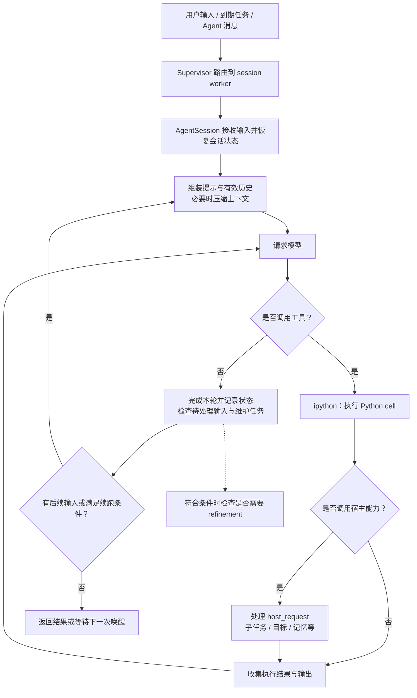
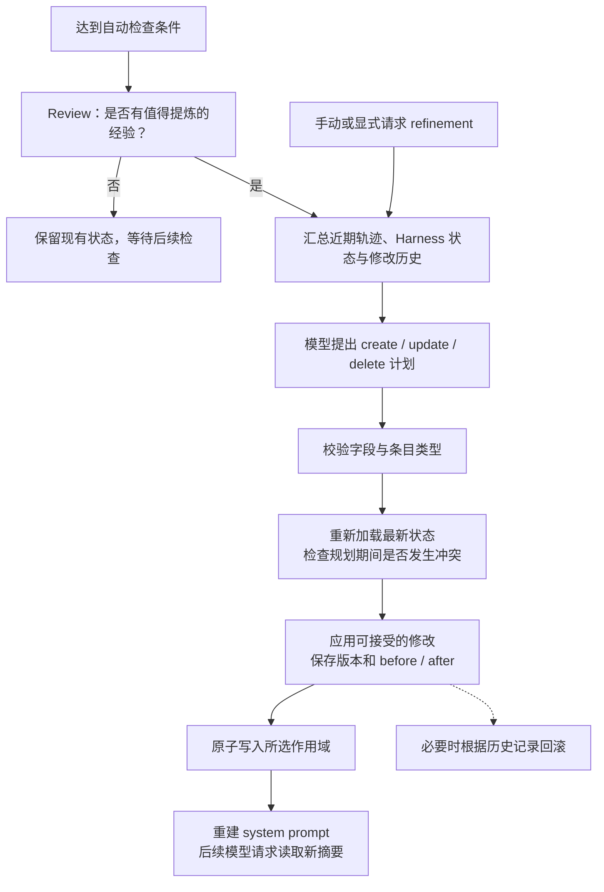
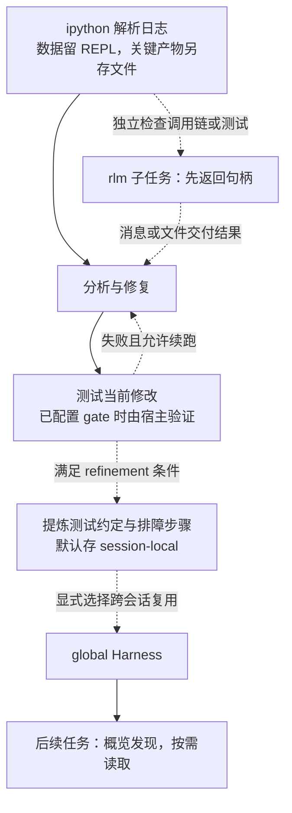

# Prime Agent 设计与实现

[返回总览](<Agents 调研.md>)

Prime 用持久 Python 环境保存工作数据，用可编辑经验库影响后续任务，由宿主管理执行与恢复。本文重点区分这三层的职责和持久化边界。

调研基于 `PrimeIntellect-ai/prime-agent` 的固定提交 [`9c54a35`](https://github.com/PrimeIntellect-ai/prime-agent/tree/9c54a35dac3a2ad17910074d66664859ea175666)，提交时间为 **2026-09-06 03:12:41（北京时间）**；本文整理于 **2026-09-07**。结论来自该版本的源码和仓库文档，未对模型效果或长期运行稳定性做实测。

## 1. 整体设计：模型用代码调度工作，宿主管理执行与状态

**RLM** 为会话提供持久 Python REPL，保存数据、函数和中间结果；**Continual Harness** 保存提示补充、记忆、技能调用说明与子 Agent 规范。TypeScript `AgentSession` 连接二者：Python 的 `rlm` 经 `host_request` 请求宿主能力，模型调用与生命周期仍由宿主掌握。[RLM 运行时职责](https://github.com/PrimeIntellect-ai/prime-agent/blob/9c54a35dac3a2ad17910074d66664859ea175666/packages/coding-agent/docs/rlm-runtime.md#L1-L72)

| 层次 | 职责 | 状态边界 |
| --- | --- | --- |
| TUI / headless 客户端 | 输入、展示事件、建立或恢复连接 | 客户端与任务生命周期依启动模式而定。 |
| Daemon supervisor | 路由、worker 健康、命令日志、消息投递 | 不执行模型、工具或压缩。 |
| Session worker | 持有根运行时、调度器、kernel 和后代任务 | 一个根任务树的执行与恢复单位。 |
| `AgentSession` / `Agent` | 模型与工具循环、压缩、refinement、停止策略 | 决定是否继续及采用哪些状态。 |
| Python kernel / Harness | 分别保存计算状态与结构化经验 | 当前工作与经验复用分开管理。 |

普通交互使用常驻 worker，关闭终端仅断开前端；一次性 headless、临时会话由客户端拥有生命周期，正常结束会移除 worker。部分 SDK 路径也可在进程内运行。[Daemon 的进程分工与生命周期](https://github.com/PrimeIntellect-ai/prime-agent/blob/9c54a35dac3a2ad17910074d66664859ea175666/packages/coding-agent/docs/daemon.md#L23-L66)

## 2. Agent loop：模型与工具构成内循环，宿主决定是否继续

下面展示常驻交互会话的主流程。压缩与 refinement 是宿主在合适边界执行的维护动作，不要求每轮都发生。

| 控制层 | 继续条件 | 停止或并发边界 |
| --- | --- | --- |
| `runLoop` 内层 | 模型请求 → 工具 → 结果回传 | 不再调用工具、被中止或满足工具终止条件时结束。 |
| `runLoop` 外层 | follow-up 或宿主 continuation 到来 | 最终文字只结束当前轮，外层状态决定是否续跑。 |
| 默认 `ipython` 工具 | 执行普通 Python cell | 标记 `sequential`，kernel 也串行执行，保护同一命名空间。 |
| 独立工作 | Python 异步或独立运行时的子 Agent | 通用工具调度器支持并行，不代表普通 cell 并行。 |

模型用代码表达操作，宿主管理归属、停止和持久化；阅读编排逻辑需结合底层循环与 `AgentSession`。[底层循环](https://github.com/PrimeIntellect-ai/prime-agent/blob/9c54a35dac3a2ad17910074d66664859ea175666/packages/agent/src/agent-loop.ts#L304-L445)、[工具调度模式](https://github.com/PrimeIntellect-ai/prime-agent/blob/9c54a35dac3a2ad17910074d66664859ea175666/packages/agent/src/agent-loop.ts#L585-L601)、[ipython 顺序执行](https://github.com/PrimeIntellect-ai/prime-agent/blob/9c54a35dac3a2ad17910074d66664859ea175666/packages/coding-agent/src/core/tools/ipython.ts#L620-L626)、[kernel 执行约束](https://github.com/PrimeIntellect-ai/prime-agent/blob/9c54a35dac3a2ad17910074d66664859ea175666/packages/coding-agent/docs/rlm-runtime.md#L88-L109)

## 3. 自主学习：从会话轨迹中提出并应用经验修改

### 3.1 学习对象是四类外部条目

Prime 的 refinement 会修改 Continual Harness 中的四类条目：

| 类型 | 保存的内容 | 后续用途 |
|---|---|---|
| `prompt` | 对行为和工作方式的补充要求 | 为后续执行提供可调整的指导。 |
| `memory` | 值得复用的事实、约定和经验 | 避免反复确认同一背景或踩同一问题。 |
| `skill` | 可复用 Python 能力的引用与参数契约 | 帮助模型找到能力并正确调用。 |
| `subagent` | 可复用的子任务角色与执行规范 | 为后续委派提供已有工作方式。 |

基础 system prompt 不属于 refinement 的可编辑对象。这里的“学习”是调整外部执行指导与经验，源码中的这条路径没有模型参数训练。[Refinement 的对象与约束](https://github.com/PrimeIntellect-ai/prime-agent/blob/9c54a35dac3a2ad17910074d66664859ea175666/packages/coding-agent/src/core/refinement/refinement.ts#L123-L174)

### 3.2 触发检查并不等于立即写入

| 入口 | 默认条件 | 后续动作 |
| --- | --- | --- |
| 自动检查 | 默认开启；间隔 25 个 assistant turns，压缩后也可检查 | 根会话且有可持久化的本地 Harness 目录。 |
| 调度限制 | 冷却 20 分钟，并受当前任务影响 | 先 review，仅 `shouldRefine` 为真才规划修改。 |
| 显式请求 | 用户 `/refine` 或模型调用宿主 refinement 能力 | 进入提炼流程。 |

**25 轮是检查间隔，不保证写入经验。** [默认配置](https://github.com/PrimeIntellect-ai/prime-agent/blob/9c54a35dac3a2ad17910074d66664859ea175666/packages/coding-agent/src/core/settings-manager.ts#L905-L920)、[自动提炼的作用范围](https://github.com/PrimeIntellect-ai/prime-agent/blob/9c54a35dac3a2ad17910074d66664859ea175666/packages/coding-agent/src/core/agent-session.ts#L7705-L7707)、[自动 review 与调度](https://github.com/PrimeIntellect-ai/prime-agent/blob/9c54a35dac3a2ad17910074d66664859ea175666/packages/coding-agent/src/core/agent-session.ts#L7990-L8116)

### 3.3 提案、应用与验证边界

| 阶段 | 输入或动作 | 保证范围 |
| --- | --- | --- |
| 提案 | 当前 Harness、修改历史、轨迹末尾 80,000 字符 | 输出 `create / update / delete` 计划与理由；轨迹不是无损全量历史。 |
| 应用 | 重读最新状态，对比规划基线 | 避免旧提案覆盖并发修改；只应用可接受修改。 |
| 保存与读取 | 记录版本、before/after、预期效果；保存后重建 system prompt | 可追踪和回滚，后续请求读取新概览。 |
| 效果评估 | 后续任务观察实际表现 | `expectedOutcome` 只是预期，字段校验和冲突检查不证明经验有效。 |

[提案输入与生成](https://github.com/PrimeIntellect-ai/prime-agent/blob/9c54a35dac3a2ad17910074d66664859ea175666/packages/coding-agent/src/core/refinement/refinement.ts#L880-L947)、[应用和冲突处理](https://github.com/PrimeIntellect-ai/prime-agent/blob/9c54a35dac3a2ad17910074d66664859ea175666/packages/coding-agent/src/core/refinement/refinement.ts#L716-L842)、[重新加载、保存与提示更新](https://github.com/PrimeIntellect-ai/prime-agent/blob/9c54a35dac3a2ad17910074d66664859ea175666/packages/coding-agent/src/core/agent-session.ts#L8430-L8497)

## 4. 上下文管理：将计算状态、对话历史与长期经验分开

### 4.1 四种状态载体

数据、筛选结果和函数可留在 REPL，下一次 cell 接着操作；模型请求通常只接收打印或返回的部分。子任务可独立处理材料，再用消息或文件交回。[RLM 的使用方式](https://github.com/PrimeIntellect-ai/prime-agent/blob/9c54a35dac3a2ad17910074d66664859ea175666/packages/coding-agent/docs/rlm.md#L24-L62)

| 状态 | 保存位置 | 进入模型请求的方式 |
| --- | --- | --- |
| 有效对话 | 从 session 记录重建 | 摘要、保留消息和新消息。 |
| 工作数据与函数 | Python kernel 命名空间 | 打印或返回的部分；打印大对象仍消耗窗口。 |
| 完整会话轨迹 | JSONL 与 session artifacts | 持久保存，按需恢复和追查。 |
| 可复用经验 | Continual Harness JSON | 有限概览，细节按需读取。 |

### 4.2 压缩与跨进程恢复

| 机制 | 触发与默认值 | 保留或损失边界 |
| --- | --- | --- |
| 自动 compaction | 默认开启；估算用量超过 `contextWindow - reserveTokens` | 结合模型用量和后续消息估计；预留 16,384 tokens。 |
| 有效历史重建 | 目标保留最近约 20,000 tokens | 追加 compaction 记录，组装摘要 + 近期消息 + 新消息；原 JSONL 保留。 |
| 压缩后 kernel | 通常不重建整个 kernel | 清理超过单变量快照限制的变量，把剩余变量名告知模型。 |
| 跨进程快照 | `dill` 尽力保存；单变量 16 MiB，总量 256 MiB | 不可序列化对象跳过，不能保证全部工作状态恢复。 |

[压缩预算与触发判断](https://github.com/PrimeIntellect-ai/prime-agent/blob/9c54a35dac3a2ad17910074d66664859ea175666/packages/coding-agent/src/core/compaction/compaction.ts#L112-L217)、[有效上下文重建](https://github.com/PrimeIntellect-ai/prime-agent/blob/9c54a35dac3a2ad17910074d66664859ea175666/packages/coding-agent/src/core/session-manager.ts#L467-L540)、[压缩后的变量处理](https://github.com/PrimeIntellect-ai/prime-agent/blob/9c54a35dac3a2ad17910074d66664859ea175666/packages/coding-agent/src/core/agent-session.ts#L7361-L7393)、[快照限制](https://github.com/PrimeIntellect-ai/prime-agent/blob/9c54a35dac3a2ad17910074d66664859ea175666/packages/coding-agent/src/core/kernel/state-snapshot.ts#L1-L46)

摘要遗漏不会自动回到模型眼前。REPL 适合可重建的工作状态；大型数据、关键中间成果和恢复成本高的结果应显式保存为文件。

## 5. 持久 Memory：带作用域和版本记录的条目库

### 5.1 写入作用域决定复用范围

| 作用域 | 保存位置 | 谁能复用 |
| --- | --- | --- |
| session-local，默认 | `<session artifact dir>/harness/harness_state.json` | 恢复同一会话可用；新独立会话不自动继承。 |
| global，须显式选择 | `~/.prime/agent/harness/harness_state.json` | global refinement 或 API 写入后供跨会话使用。 |
| 修改历史 | `refinements.jsonl` | 追踪修改与回滚；删条目不等于清历史。 |

状态经临时文件加重命名保存。**保存成功与新会话可用需分别检查作用域。** [状态路径与持久化](https://github.com/PrimeIntellect-ai/prime-agent/blob/9c54a35dac3a2ad17910074d66664859ea175666/packages/coding-agent/src/core/refinement/refinement.ts#L269-L379)

### 5.2 从有限概览到按需读取

| 读取层 | 默认规则 | 取舍 |
| --- | --- | --- |
| system prompt 概览 | 合并 global / local；每类最多 6 条，每条摘要 180 字符 | 按 path、title、id 等稳定字段排序，无问题 embedding 相似度检索。 |
| Python Harness API | `list/get` 读详情；`create/update/delete/upsert` 修改 | 条目带作用域、版本、来源；历史支持追踪和回滚。 |

概览控制提示长度，但无法展示全部相关经验；规模增长后，命名、组织与模型主动读取决定利用率。[概览生成与选择规则](https://github.com/PrimeIntellect-ai/prime-agent/blob/9c54a35dac3a2ad17910074d66664859ea175666/packages/coding-agent/src/core/refinement/refinement.ts#L429-L519)、[Python Harness API](https://github.com/PrimeIntellect-ai/prime-agent/blob/9c54a35dac3a2ad17910074d66664859ea175666/prime-agent-runtime/src/rlm/harness.py#L303-L558)

## 6. 特色机制：递归委派、可执行技能与长期任务托管

### 6.1 RLM：接纳句柄、独立执行与结果交付

`handle = await rlm("检查接口实现", name="api-reviewer")` 经宿主检查深度和模型配置、登记子任务后返回 `RLMSpawnHandle`。**`await` 只等接纳，最终结果需显式 `agent_message` 或文件交付。** [委派协议](https://github.com/PrimeIntellect-ai/prime-agent/blob/9c54a35dac3a2ad17910074d66664859ea175666/packages/coding-agent/docs/rlm-runtime.md#L23-L60)

| 维度 | 默认或行为 | 边界 |
| --- | --- | --- |
| 执行与深度 | 独立 `AgentSession`；默认最大深度 2 | 根可建子任务，子任务可再建一代，更深须配置。 |
| 深度解析 | 会话保存设置 → 继承配置 → 全局 → 环境变量 → 默认 | 恢复会话时需检查实际生效值。 |
| 子任务 registry | 父会话持久记录直接子任务 | 跨 kernel 重启、压缩和父会话恢复保留；无关新会话不继承。 |
| 删除 | 关闭或取消运行时，写 tombstone | 退出消息和观察范围，既有会话记录、产物仍在。 |

[深度解析实现](https://github.com/PrimeIntellect-ai/prime-agent/blob/9c54a35dac3a2ad17910074d66664859ea175666/packages/coding-agent/src/core/agent-session.ts#L1629-L1649)、[子任务状态与删除语义](https://github.com/PrimeIntellect-ai/prime-agent/blob/9c54a35dac3a2ad17910074d66664859ea175666/packages/coding-agent/docs/rlm-runtime.md#L144-L179)

### 6.2 可执行技能与 Harness 条目

技能启动时先注入名称、描述和位置，完整说明按需读取。[技能加载与 Python 包契约](https://github.com/PrimeIntellect-ai/prime-agent/blob/9c54a35dac3a2ad17910074d66664859ea175666/packages/coding-agent/docs/skills.md#L130-L170)

| 对象 | 内容与调用 | 持久化边界 |
| --- | --- | --- |
| 普通技能 | `SKILL.md` 指令 | 提供操作指导。 |
| Python-backed skill | `pyproject.toml` + Python 源码；在受管理 kernel 中 editable 安装 | 模块定义 `run()` 后，可如 `await web_search(...)` 调用。 |
| Harness `skill` 条目 | 能力引用、参数契约与使用经验 | `/refine` 可提炼条目，不自动完成可执行包的开发、打包和验证。 |

新建可执行技能有独立 `skill-creator` 工作流。[技能创建与 Harness 条目的区别](https://github.com/PrimeIntellect-ai/prime-agent/blob/9c54a35dac3a2ad17910074d66664859ea175666/packages/coding-agent/docs/skills.md#L201-L231)

### 6.3 Goal、autonomous mode 和定时任务解决不同问题

| 机制 | 负责的问题 | 关键边界 |
|---|---|---|
| Goal | 保存长期目标与进度 | 有目标不代表运行时会无限续跑。 |
| Autonomous mode | 当前执行结束后，是否由宿主继续推动任务 | 受预算和可选命令验证约束，需要显式开启。 |
| Heartbeat / schedule | 在将来的时间再次投递任务 | 负责重新唤醒，不代替每次任务内部的 loop。 |

[长期任务机制](https://github.com/PrimeIntellect-ai/prime-agent/blob/9c54a35dac3a2ad17910074d66664859ea175666/packages/coding-agent/docs/long-running-agents.md#L153-L214)

Autonomous mode 默认关闭；启用后默认上限为 **3 次 continuation、12 turns、80,000 tokens、30 分钟**。验证命令默认为空；配置 gate 后，宿主执行命令，依据结果判断续跑并反馈失败证据。达到预算表示本次停止，不能证明完成。[默认参数与启用条件](https://github.com/PrimeIntellect-ai/prime-agent/blob/9c54a35dac3a2ad17910074d66664859ea175666/packages/coding-agent/src/core/autonomous.ts#L48-L128)、[继续条件与验证执行](https://github.com/PrimeIntellect-ai/prime-agent/blob/9c54a35dac3a2ad17910074d66664859ea175666/packages/coding-agent/src/core/autonomous.ts#L196-L348)

### 6.4 Daemon：恢复时保留执行结果的不确定性

| 场景 | 写入或恢复顺序 | 失败状态 |
| --- | --- | --- |
| 修改类命令 | 以 `clientId + commandId` 标识，派发前记日志 | 已有持久结果可复用；接收后无可靠完成记录则报告不确定，不自动重放。 |
| Worker 崩溃 | 写恢复标记，处理旧进程及已跟踪的后台进程 | 进程拆分负责生命周期与故障隔离。 |
| 到期任务 | 先认领并推进到期记录，再投递 prompt | 崩溃后保留已推进时间，恢复未来 tick，不补跑不确定的那次。 |

这减少重复执行，但不保证每次到期任务完成；各进程仍以同一系统用户运行。[命令幂等与故障恢复](https://github.com/PrimeIntellect-ai/prime-agent/blob/9c54a35dac3a2ad17910074d66664859ea175666/packages/coding-agent/docs/daemon.md#L133-L142)、[定时任务恢复语义](https://github.com/PrimeIntellect-ai/prime-agent/blob/9c54a35dac3a2ad17910074d66664859ea175666/packages/coding-agent/docs/daemon.md#L68-L74)、[进程边界](https://github.com/PrimeIntellect-ai/prime-agent/blob/9c54a35dac3a2ad17910074d66664859ea175666/packages/coding-agent/docs/daemon.md#L105-L120)

## 7. 任务示意：日志排障中的状态流向

以下为机制示意，非实测：分析日志、修复超时并验证测试；实际动作与学习触发取决于配置和模型决策。

调查跨窗口时，从摘要、近期消息、剩余变量名、文件与子任务 registry 续接。测试验证当前结果，refinement 提炼经验；经验是否有益，要看后续任务的实际使用与反馈。

## 8. 源码阅读路线与设计取舍

建议先沿一条请求读懂控制权，再分别进入状态管理模块：

| 阅读入口 | 建议关注的问题 |
|---|---|
| [daemon.md](https://github.com/PrimeIntellect-ai/prime-agent/blob/9c54a35dac3a2ad17910074d66664859ea175666/packages/coding-agent/docs/daemon.md) | 输入由哪个进程接收，任务归哪个 worker，断开和崩溃分别怎样处理？ |
| [agent-loop.ts](https://github.com/PrimeIntellect-ai/prime-agent/blob/9c54a35dac3a2ad17910074d66664859ea175666/packages/agent/src/agent-loop.ts#L304-L445) | 模型、工具、后续输入和 continuation 怎样组成循环？ |
| [rlm-runtime.md](https://github.com/PrimeIntellect-ai/prime-agent/blob/9c54a35dac3a2ad17910074d66664859ea175666/packages/coding-agent/docs/rlm-runtime.md) | Python 与 TypeScript 如何通信，子任务句柄为何不包含结果？ |
| [refinement.ts](https://github.com/PrimeIntellect-ai/prime-agent/blob/9c54a35dac3a2ad17910074d66664859ea175666/packages/coding-agent/src/core/refinement/refinement.ts#L716-L947) | 经验提案如何生成、检查、应用与回滚？ |
| [agent-session.ts 的自动提炼逻辑](https://github.com/PrimeIntellect-ai/prime-agent/blob/9c54a35dac3a2ad17910074d66664859ea175666/packages/coding-agent/src/core/agent-session.ts#L7990-L8116) | 自动学习何时进入执行调度？ |
| [compaction.ts](https://github.com/PrimeIntellect-ai/prime-agent/blob/9c54a35dac3a2ad17910074d66664859ea175666/packages/coding-agent/src/core/compaction/compaction.ts#L112-L217) 与 [session-manager.ts](https://github.com/PrimeIntellect-ai/prime-agent/blob/9c54a35dac3a2ad17910074d66664859ea175666/packages/coding-agent/src/core/session-manager.ts#L467-L540) | 何时压缩，摘要后怎样重建有效历史？ |
| [harness.py](https://github.com/PrimeIntellect-ai/prime-agent/blob/9c54a35dac3a2ad17910074d66664859ea175666/prime-agent-runtime/src/rlm/harness.py#L303-L558) | 模型怎样操作有作用域的持久记忆？ |
| [autonomous.ts](https://github.com/PrimeIntellect-ai/prime-agent/blob/9c54a35dac3a2ad17910074d66664859ea175666/packages/coding-agent/src/core/autonomous.ts#L196-L348) | 宿主怎样用预算与外部验证决定续跑？ |

Prime 的可借鉴点是状态职责清晰：模型上下文负责判断，REPL 留工作数据，Harness 留经验，session 与 daemon 管生命周期。复用设计时，应分别明确摘要与快照的损失范围、global 推广规则、详情读取、子任务交付，以及崩溃后不确定动作的核查方式。
