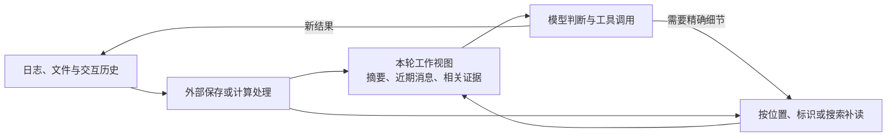
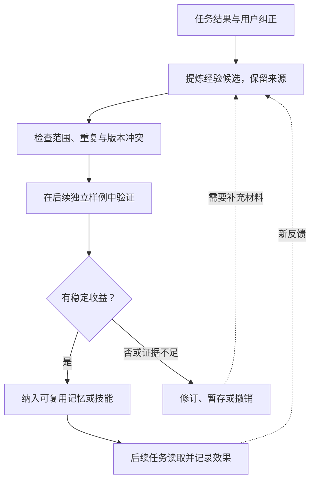
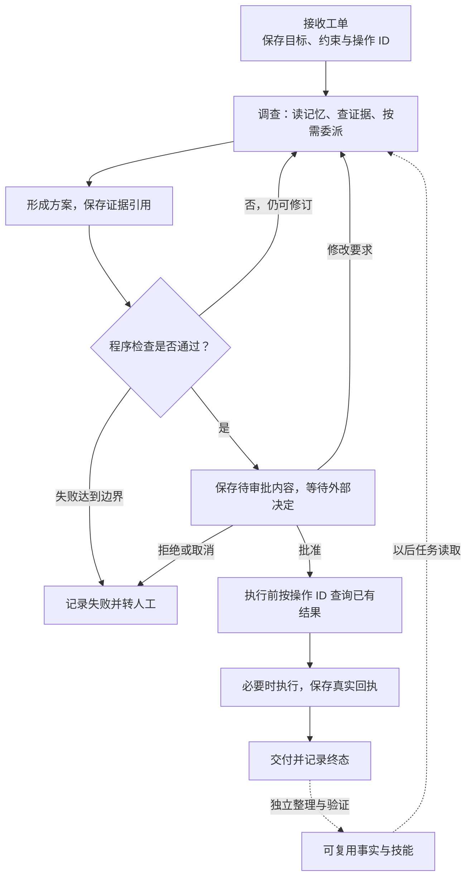

# 从 Agent 到数字员工：记忆、学习与编排的工程设计

一次接口超时调查，可能要读日志、查代码、验证假设、请同事补充证据，再等待负责人批准修复方案。等到第二天继续时，执行进程可能已经重启，对话也早已超过模型窗口。下一次遇到类似问题，之前摸索出的排查方法还应该派上用场。

如果把这项工作交给数字员工，模型推理只是其中一个环节。系统还要记住进度、找回证据、等待决定、确认交付，并把值得保留的经验带到以后。

Hermes Agent、Prime Agent、Letta Code、OpenClaw、LangGraph / DeepAgents、CrewAI 和 DeepSeek Harness，分别给出了这些问题的不同实现。把它们放在一起看，可以得到一条贯穿始终的线索：**当前任务怎样继续，过去经验怎样复用，以及系统凭什么认为工作已经完成。**

本文基于 2026 年 9 月 6—7 日获取的六组源码，以及 9 月 9 日新增的 DeepSeek Harness 固定快照整理。以下场景用于解释设计，并非实测记录；文中的比较针对实现机制，不代表性能或学习效果排名。

## 一、先把任务状态分清楚

调查超时问题时，模型刚读到的错误、正在等待的审批，以及“这个项目必须在容器里执行测试”，应当保存在不同地方。

| 信息层次 | 工单调查中的例子 | 主要用途 |
|---|---|---|
| 工作上下文 | 当前假设、刚读到的日志片段 | 支持下一次模型判断 |
| 任务状态 | 已完成的调查、待审批方案、操作 ID | 决定下一步，并在中断后恢复 |
| 原始证据 | 日志全文、工具输出、测试回执 | 补查细节与审计 |
| 长期经验 | 环境约定、稳定事实、可复用排查步骤 | 帮助以后处理类似任务 |

这几层可以互相提供信息，但生命周期不同。日志全文没有必要每轮都进入模型；审批状态不能只靠模型从聊天里猜；长期记忆也不适合记录每一次临时失败。

Prime 将这种区分做得很直接：Python REPL 保存数据和中间计算，消息历史保存交互，Continual Harness 保存经验，宿主管理会话与任务生命周期。LangGraph 则用图状态和检查点表达当前进度，用 Store 提供跨 thread 的数据接口。它们都让模型之外的代码承担明确的状态管理职责。[Prime 的运行时分工][prime-runtime]、[图状态保存][graph-persistence]、[Store 数据接口][graph-store]

这也决定了比较口径。Hermes、Prime、Letta Code 和 OpenClaw 是带有具体使用方式的运行系统；LangGraph 是图运行时，DeepAgents 在其上装配执行能力，CrewAI 提供角色协作与流程框架。阅读时，需要同时追问一项能力是否存在，以及它是否默认启用。例如，DeepAgents 工厂默认不配置 checkpointer 和 store，CrewAI 的 Crew 默认关闭 Memory；应用需要把这些能力接入实际任务。[DeepAgents 参数][deep-defaults]、[Crew Memory 开关][crew-memory-defaults]

DeepSeek Harness 进一步把运行机制本身拆开：模型、工具、循环、存储和调度通过 Cordis 插件组装，消费者通过服务接口与事件协作。它提供了另一个研究角度：每种状态由哪个组件负责，这个组件被替换或卸载时，已有工作如何处理。[DeepSeek 插件架构][dsh-architecture]

## 二、长上下文管理，重点是保留一份可继续工作的视图

处理大量日志时，最直接的减负方式是先在代码里筛选，只把统计结果和少量样本交给模型。Prime 的持久 REPL 允许数据留在变量中，后续调用继续计算；但不可序列化或超过快照限制的对象仍可能无法恢复，重要结果需要另存文件。

Hermes 和 DeepAgents 则会把超长工具正文外置，向模型返回预览与位置。历史继续增长后，再用摘要压缩旧交互。这里需要同时维护两件事：当前推理能继续，精确信息还有地方可查。

图中表达的是一种设计目标。具体实现对“摘要以后还剩什么”给出了不同答案：DeepAgents 的常规压缩路径记录摘要事件，再据此重建有效输入，原始消息仍在图状态中；CrewAI 的超限恢复会保留 system 消息，用摘要替换其余消息，并重新附上用户文件附件。后者没有在同一条压缩路径里建立原始对话文件的恢复入口。[DeepAgents 摘要视图][deep-summary]、[CrewAI 消息压缩][crew-summary]

DeepSeek Harness 也区分事件日志和有效视图：裁减、摘要通过新事件遮蔽旧消息，旧事件继续保留。不过，超长工具结果可能在记录前就被外置，日志只有预览与位置。要找回完整证据，还得确认外置文件没有过期；仅有一份完整会话日志并不够。[摘要替换][dsh-summary]、[工具结果外置][dsh-spill]、[外置文件寿命][dsh-spill-life]

因此，支持自动压缩还不足以说明长任务可以可靠延续。更有价值的检查是：摘要里是否保留了目标和约束，原文是否仍存在，模型是否知道怎样找回它。即使原始历史存在，临时卸载文件也可能过期；需要审计的证据应有明确的保存位置和生命周期。

## 三、Memory 写进去之后，怎样影响下一次任务

“记住了”至少包含两个时刻：内容已保存，以及它真正进入后续推理。这两个时刻之间，隔着作用域、索引、缓存和加载策略。

Letta Code 展示了一条容易追踪的路径。它用 `agent_id` 连接多条独立会话，把记忆放进 Git MemFS；local 后端读取已提交版本编译提示。因此，编辑文件、创建提交、同步远端和更新模型提示是不同阶段。记忆版本发生变化，不会回溯改变已经发出的模型请求。[MemFS 提示编译][letta-compile]、[远端同步][letta-sync]

其他实现也有各自的可见性边界：

| 实现 | 经验主要在哪个范围复用 | 容易忽略的生效条件 |
|---|---|---|
| Hermes | 通常同一 profile 的会话 | 写盘后，既有短记忆提示快照仍需刷新 |
| Prime | 默认当前会话；显式 global 跨会话 | 新任务未必继承 session-local 经验 |
| Letta Code | 同一 Agent 的不同 conversation | local 以已提交 MemFS 版本编译提示 |
| OpenClaw | Agent 工作区与许可的私人会话 | 更新后的技能供新会话加载 |
| DeepAgents | thread 状态或配置的共享存储 | 恢复的检查点可能带回旧记忆与技能缓存 |
| CrewAI | 配置的 Memory scope 与后端 | 同对象的读前等待，不等于跨进程同步 |
| DeepSeek Harness | 文件指令、技能目录；另接 Memory 的提供方范围 | Memory MCP 默认关闭；技能正文下次加载才读取新内容 |

这些边界直接影响体验：用户刚纠正了一个事实，新任务却仍采用旧说法，原因可能在保存范围或缓存，而不只是模型“没有记住”。DeepAgents 的记忆中间件会复用状态中已有内容；CrewAI 的批量写入可以在后台编码，后续同一 Memory 对象的召回会先等待待写队列。两者都说明，保存接口的返回值需要结合实际加载路径理解。[记忆缓存][deep-memory]、[写入与读取屏障][crew-memory]

Skill 则承载更偏程序性的经验。例如，“这个服务的负责人是谁”是事实，“遇到这类超时时先检查哪些证据”是一套方法。多个项目都先向模型提供技能名称和描述，相关时再读正文。这样的分层降低了提示开销，也把技能描述质量和按需读取能力变成了系统设计的一部分。

DeepSeek Harness 的技能目录和正文就有不同的更新路径：可见技能的名称或描述变化后，目录在后续步骤更新；若发现尚不完整，就保留原目录。正文则在调用时重读。它提供的第三方 Memory 示例另需启用，知识范围和检索由提供方管理。会话能恢复、技能能加载、事实能跨任务召回，应分别验证。[技能更新][dsh-skills]、[Memory 接入][dsh-memory]

## 四、自主学习要同时处理经验的产生与验证

这些项目的常规学习路径，主要修改外部记忆、技能或提示指导。CrewAI 的 `train()` 也将反馈整理为按角色保存的建议文件，后续加入提示；本文所分析的这条路径不更新模型权重。[训练建议生成][crew-training]

经验的组织方式各有侧重。Hermes 在前台完成任务后，按条件启动后台复盘；Prime 先 review，再提出并应用结构化条目修改；Letta 把反思放到独立工作树中，之后与主记忆整合。OpenClaw 进一步区分事实巩固与技能维护：Dreaming 分阶段处理长期事实，Workshop 从合格任务中形成技能提案。[Hermes 复盘触发][hermes-review]、[OpenClaw 记忆巩固][open-learning]、[技能提案][open-skills]

这些设计共同关心一个问题：**怎样让经验更新有材料、有范围，并且可以追踪。** Letta 的 `no_changes` 就是一个有启发的状态：没有新增记忆，也可能意味着这一批材料已经被审阅，可以推进处理游标。学习流程不必为了“产出”而保存没有价值的内容。[反思整合状态][letta-merge]

DeepSeek Harness 的 Creator 模式开放了能力创作：Agent 可以定义、运行和修复临时插件，失败信息会回到当前任务。临时定义只对所属会话可见，并随进程退出消失；若要稳定地供新会话或重启后使用，应保存为用户 preset、技能或其他持久资产，再重新加载或组装。任务内能修复自己的工具，并不能直接推导出已有自动经验复盘与学习验证闭环。[错误回传][dsh-creator-repair]、[临时定义的寿命][dsh-creator-life]

但结构校验、版本检查和内容有效性仍是不同判断。一个技能文件可以格式完全正确，却总结了错误的方法。更完整的经验管理可以设计成下面的流程；其中独立验证环节是工程建议，并非所有项目的默认机制。

CrewAI 提供了一个具体提醒：执行器的自动 Memory 保存早于 Task 的最终 guardrail 校验。因此，自动积累的经验不天然等于验收通过的结论。如果岗位要求只保留已核查事实，就需要安排相应的写入时机，而不能直接把每份候选输出都当成可靠经验。[自动保存顺序][crew-executor]

还有一类机制只评审当前任务。DeepAgents 的可选 Rubric 可以让 Agent 根据意见返工，但不会自动沉淀长期知识；达到评审上限或出现错误时，也不能只看最后一段完整答复判断成功。业务需要读取评审终态，并检查实际证据。[Rubric 的终态边界][deep-rubric]

## 五、编排的核心是控制权与完成条件

一项工作可以有计划、角色和工具，却仍然缺少可执行的依赖。例如，“先审核，再更新工单”写在提示里时，需要模型遵守；写成业务图的分支条件后，宿主代码可以决定未通过审核的路径不进入执行节点。

LangGraph 提供状态、条件边、汇合和可恢复中断，DeepAgents 在节点内处理自主判断。CrewAI 则让 Task 定义交付要求，Crew 组织角色协作，Flow 控制业务阶段。其当前默认 AgentExecutor 本身也基于 Flow；显式开启规划后，生成的步骤可以包含依赖并参与调度。外层固定流程与内层自主执行由此可以分开设计。[图状态与更新][graph-state]、[CrewAI 默认执行器][crew-default]、[计划依赖调度][crew-planning]

多 Agent 协作还需要定义“等待”的含义。Prime 的 `await rlm()` 等待子任务被接纳，最终结果通过消息或文件交付；DeepAgents 常规内联 `task` 会等待子图完成；OpenClaw 区分子任务计算完成、报告进入队列和实际送达。看起来都是一次委派，父任务持有的控制权与结果状态却不同。[Prime 委派协议][prime-delegation]、[DeepAgents 子任务][deep-subtask]、[OpenClaw 交付协议][open-delivery]

程序化编排还要看中间状态放在哪里。DeepSeek Harness 的 PTC 用 TypeScript 组合工具，但默认每次创建新 worker，不跨调用保留变量；`workflow` 用脚本组织子 Agent；Goal 在同一会话中续跑，Ralph 则每轮换新 Agent，只传递目标、共享工作区与有界报告。它们分别控制一次程序、一次委派和多轮工作，不能用同一个“循环”概念替代。[PTC 生命周期][dsh-code]、[工作流契约][dsh-workflow]、[Goal 续跑][dsh-goal]、[Ralph 交接][dsh-ralph]

长期运行时，这些区别会集中暴露。模型结束一轮生成，不代表所有子任务已经完成；结果文件生成，不代表已经送到用户；保存了 Goal，也不代表调度器会持续唤醒任务。预算、超时、验收和后续调度，都需要明确的状态与处理规则。

## 六、把这些能力放进一条工单流程

下面是一种综合设计，用来说明各层如何协作，不要求把七组项目装进同一个系统。

调查材料放在文件或数据存储中，图状态只保留推进流程所需的事实和引用。审批期间可以释放执行资源，收到决定后恢复任务；关键外部操作用稳定标识查询已有结果，避免把恢复误当作重新执行全部动作。

这个顺序尤其重要，因为检查点无法替所有外部系统提供共同事务。LangGraph 的 `interrupt` 恢复会从被中断节点开头重新执行。如果远程工单已经更新，本地完成记录却还没写入就发生崩溃，恢复后仍需核查外部结果。[中断的重执行语义][graph-interrupt]

DeepSeek Harness 对这类间隙给出了明确状态：调用已记录而结果未持久化时，恢复过程标记 `TOOL_OUTCOME_UNKNOWN`。只读或幂等操作可以按需重试，可能产生副作用的操作则应先核验外部状态。这个状态保留了不确定性，便于业务决定查询、重试还是转交处理。[中断工具的恢复][dsh-repair]

审批与学习也需要显式衔接。在本文核查的 CrewAI 快照中，直接返回反馈的路径可以执行经验提炼，而 pending/resume 路径归并反馈后继续路由，没有再次调用提炼。若采用跨进程审批，就应另设经验整理步骤，不能只凭 `learn=True` 推断恢复之后一定形成了新知识。[反馈恢复路径][crew-resume]

真正的验收可以从几次小实验开始：写入一条事实后在新任务中读取；压缩后找回一个精确 ID；在工具执行后重启进程；让子任务部分失败，再检查最终是否被错误地标成完成。这些实验会把“具备某项接口”落实为可观察的工作行为。

## 最值得带走的设计取舍

七组实现提供了不同的研究入口：Hermes 适合理解经验分层，Letta 展示记忆的版本与整合，Prime 展示代码环境和任务宿主，OpenClaw 展示多入口与异步交付。LangGraph / DeepAgents 和 CrewAI 帮助组织业务流程，DeepSeek Harness 则展示运行组件的组合、替换与上下文追溯。

构建数字员工时，可以先明确一条岗位任务的状态、证据、审批与验收，再逐步增加长期记忆和更多角色。每增加一项机制，都检查它改变了哪一层状态、何时对后续任务可见，以及失败后如何处理。

**让工作可以接续，让结果可以核查，让经验可以修正**——这三件事连起来，持续运行与自主学习才有了可落地的工程基础。

## 源码与版本

本文融合了七组实现的源码调研。正文中的实现链接固定到以下提交，避免后续主分支变动改变上下文。

| 项目 | 本文采用的源码快照 |
|---|---|
| Hermes Agent | [245e48008fa8](https://github.com/NousResearch/hermes-agent/tree/245e48008fa814b3251f50755eb656bd9fb86cb1) |
| Prime Agent | [9c54a35dac3a](https://github.com/PrimeIntellect-ai/prime-agent/tree/9c54a35dac3a2ad17910074d66664859ea175666) |
| Letta Code | [701f2a536782](https://github.com/letta-ai/letta-code/tree/701f2a5367828847313876c735ade27b9df97689) |
| OpenClaw | [047fdfe90fef](https://github.com/openclaw/openclaw/tree/047fdfe90fef01802d659eedb781cb410fcd6ccc) |
| LangGraph / DeepAgents / LangChain | [81bf17b23123](https://github.com/langchain-ai/langgraph/tree/81bf17b23123e4ef8b9d5f49fa09a0122fc2edd1) / [07d2952d346d](https://github.com/langchain-ai/deepagents/tree/07d2952d346d81d06bd181db8c560a77f2b51bc8) / [fa942aec719a](https://github.com/langchain-ai/langchain/tree/fa942aec719abd92026dcb56cab8e50a38776611) |
| CrewAI | [1f3e6113d75c](https://github.com/crewAIInc/crewAI/tree/1f3e6113d75cd12b2899943faffbc729130d200b) |
| DeepSeek Harness | [5dda764ed3aa](https://github.com/deepseek-ai/deepseek-harness/tree/5dda764ed3aa172535a7967b06ff95d9cbfe536a) |

[graph-persistence]: https://github.com/langchain-ai/langgraph/blob/81bf17b23123e4ef8b9d5f49fa09a0122fc2edd1/libs/langgraph/langgraph/graph/state.py#L1177-L1214
[graph-store]: https://github.com/langchain-ai/deepagents/blob/07d2952d346d81d06bd181db8c560a77f2b51bc8/libs/deepagents/deepagents/backends/store.py#L90-L118
[graph-state]: https://github.com/langchain-ai/langgraph/blob/81bf17b23123e4ef8b9d5f49fa09a0122fc2edd1/libs/langgraph/langgraph/graph/state.py#L131-L149
[graph-interrupt]: https://github.com/langchain-ai/langgraph/blob/81bf17b23123e4ef8b9d5f49fa09a0122fc2edd1/libs/langgraph/langgraph/types.py#L851-L871
[deep-summary]: https://github.com/langchain-ai/deepagents/blob/07d2952d346d81d06bd181db8c560a77f2b51bc8/libs/deepagents/deepagents/middleware/summarization.py#L1345-L1378
[deep-memory]: https://github.com/langchain-ai/deepagents/blob/07d2952d346d81d06bd181db8c560a77f2b51bc8/libs/deepagents/deepagents/middleware/memory.py#L279-L361
[deep-rubric]: https://github.com/langchain-ai/deepagents/blob/07d2952d346d81d06bd181db8c560a77f2b51bc8/libs/deepagents/deepagents/middleware/rubric.py#L488-L508
[deep-subtask]: https://github.com/langchain-ai/deepagents/blob/07d2952d346d81d06bd181db8c560a77f2b51bc8/libs/deepagents/deepagents/middleware/subagents.py#L732-L794
[deep-defaults]: https://github.com/langchain-ai/deepagents/blob/07d2952d346d81d06bd181db8c560a77f2b51bc8/libs/deepagents/deepagents/graph.py#L271-L291
[crew-summary]: https://github.com/crewAIInc/crewAI/blob/1f3e6113d75cd12b2899943faffbc729130d200b/lib/crewai/src/crewai/utilities/agent_utils.py#L1084-L1177
[crew-memory]: https://github.com/crewAIInc/crewAI/blob/1f3e6113d75cd12b2899943faffbc729130d200b/lib/crewai/src/crewai/memory/unified_memory.py#L430-L578
[crew-training]: https://github.com/crewAIInc/crewAI/blob/1f3e6113d75cd12b2899943faffbc729130d200b/lib/crewai/src/crewai/crew.py#L930-L983
[crew-executor]: https://github.com/crewAIInc/crewAI/blob/1f3e6113d75cd12b2899943faffbc729130d200b/lib/crewai/src/crewai/experimental/agent_executor.py#L2874-L2923
[crew-default]: https://github.com/crewAIInc/crewAI/blob/1f3e6113d75cd12b2899943faffbc729130d200b/lib/crewai/src/crewai/agent/core.py#L379-L389
[crew-planning]: https://github.com/crewAIInc/crewAI/blob/1f3e6113d75cd12b2899943faffbc729130d200b/lib/crewai/src/crewai/experimental/agent_executor.py#L1093-L1143
[crew-resume]: https://github.com/crewAIInc/crewAI/blob/1f3e6113d75cd12b2899943faffbc729130d200b/lib/crewai/src/crewai/flow/runtime/__init__.py#L1483-L1555
[crew-memory-defaults]: https://github.com/crewAIInc/crewAI/blob/1f3e6113d75cd12b2899943faffbc729130d200b/lib/crewai/src/crewai/crew.py#L655-L703
[letta-compile]: https://github.com/letta-ai/letta-code/blob/701f2a5367828847313876c735ade27b9df97689/src/backend/local/system-prompt-compilation.ts#L60-L116
[letta-sync]: https://github.com/letta-ai/letta-code/blob/701f2a5367828847313876c735ade27b9df97689/src/agent/memory-git.ts#L1922-L2053
[letta-merge]: https://github.com/letta-ai/letta-code/blob/701f2a5367828847313876c735ade27b9df97689/src/agent/memory-worktree.ts#L208-L238
[open-delivery]: https://github.com/openclaw/openclaw/blob/047fdfe90fef01802d659eedb781cb410fcd6ccc/docs/tools/subagents.md#L105-L116
[open-learning]: https://github.com/openclaw/openclaw/blob/047fdfe90fef01802d659eedb781cb410fcd6ccc/docs/concepts/dreaming.md#L31-L63
[prime-delegation]: https://github.com/PrimeIntellect-ai/prime-agent/blob/9c54a35dac3a2ad17910074d66664859ea175666/packages/coding-agent/docs/rlm-runtime.md#L23-L60
[hermes-review]: https://github.com/NousResearch/hermes-agent/blob/245e48008fa814b3251f50755eb656bd9fb86cb1/agent/turn_finalizer.py#L587-L616
[prime-runtime]: https://github.com/PrimeIntellect-ai/prime-agent/blob/9c54a35dac3a2ad17910074d66664859ea175666/packages/coding-agent/docs/rlm-runtime.md#L1-L72
[open-skills]: https://github.com/openclaw/openclaw/blob/047fdfe90fef01802d659eedb781cb410fcd6ccc/docs/tools/skill-workshop.md#L67-L107

[dsh-architecture]: https://github.com/deepseek-ai/deepseek-harness/blob/5dda764ed3aa172535a7967b06ff95d9cbfe536a/docs/architecture.zh.md#L9-L31
[dsh-summary]: https://github.com/deepseek-ai/deepseek-harness/blob/5dda764ed3aa172535a7967b06ff95d9cbfe536a/packages/compaction/compaction-basic/src/region.ts#L454-L492
[dsh-spill]: https://github.com/deepseek-ai/deepseek-harness/blob/5dda764ed3aa172535a7967b06ff95d9cbfe536a/packages/spill/spill-policy/src/index.ts#L185-L225
[dsh-skills]: https://github.com/deepseek-ai/deepseek-harness/blob/5dda764ed3aa172535a7967b06ff95d9cbfe536a/docs/subsystems/skills.md#L229-L235
[dsh-memory]: https://github.com/deepseek-ai/deepseek-harness/blob/5dda764ed3aa172535a7967b06ff95d9cbfe536a/docs/user/guide/mcp-memory.md#L5-L33
[dsh-creator-repair]: https://github.com/deepseek-ai/deepseek-harness/blob/5dda764ed3aa172535a7967b06ff95d9cbfe536a/packages/extensions/cordis-host-runner/src/index.ts#L1019-L1067
[dsh-creator-life]: https://github.com/deepseek-ai/deepseek-harness/blob/5dda764ed3aa172535a7967b06ff95d9cbfe536a/packages/extensions/cordis-host-runner/README.md#L44-L54
[dsh-code]: https://github.com/deepseek-ai/deepseek-harness/blob/5dda764ed3aa172535a7967b06ff95d9cbfe536a/packages/code-runtime/code-runtime-worker-thread/README.zh.md#L51-L79
[dsh-workflow]: https://github.com/deepseek-ai/deepseek-harness/blob/5dda764ed3aa172535a7967b06ff95d9cbfe536a/docs/subsystems/workflow.zh.md#L5-L13
[dsh-goal]: https://github.com/deepseek-ai/deepseek-harness/blob/5dda764ed3aa172535a7967b06ff95d9cbfe536a/packages/goal/goal-round-driver/README.zh.md#L47-L57
[dsh-ralph]: https://github.com/deepseek-ai/deepseek-harness/blob/5dda764ed3aa172535a7967b06ff95d9cbfe536a/packages/workflow/tool-ralph/src/index.ts#L110-L182
[dsh-repair]: https://github.com/deepseek-ai/deepseek-harness/blob/5dda764ed3aa172535a7967b06ff95d9cbfe536a/packages/core/session/src/repair.ts#L91-L133
[dsh-spill-life]: https://github.com/deepseek-ai/deepseek-harness/blob/5dda764ed3aa172535a7967b06ff95d9cbfe536a/packages/spill/spill-local/src/index.ts#L39-L88
