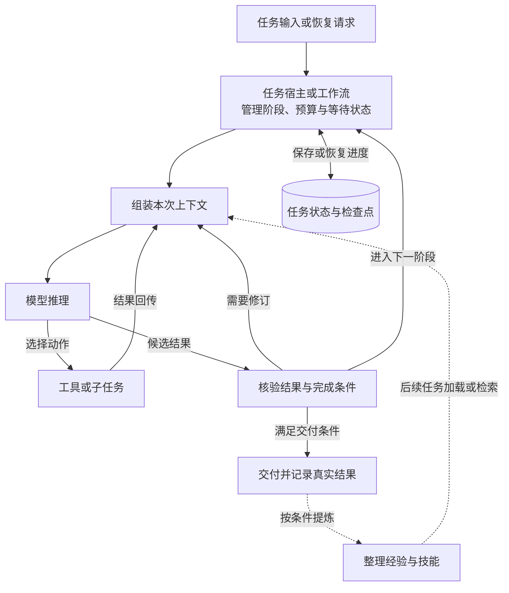

# 从七组开源实现，看 Agent 能力如何落地

一个 Agent 的基本过程很容易描述：接收目标，调用模型，执行工具，把结果交回模型，直到得到答案。当任务延续到多轮对话、跨过一次进程重启，或者需要等待另一个任务的结果时，这段描述还需要回答一系列具体问题：哪些信息必须保留？从哪里继续执行？之前积累的经验什么时候可用？怎样确认工作已经完成？

最近，我围绕自主学习、上下文管理、持久记忆和任务编排，整理了七组开源实现。这轮调研最明确的收获是：**Agent 的能力需要通过运行系统组织起来，让每次推理有依据、每次执行有记录，并让任务进度和可复用经验各有去处。**

本文基于本系列在 **2026-09-06 至 2026-09-09** 获取的固定源码与资料，未运行项目或进行效果评测。下面的实现描述沿用这些快照，架构归纳与验证建议则是基于调研的分析。具体版本、调用链和源码引用见[调研总览](<Agents 调研.md>)及各篇详解。

## 先分清各个项目承担的职责

这些项目虽然都与 Agent 有关，交付的系统层次却有所不同。Hermes、Prime、Letta Code 和 OpenClaw 包含较完整的会话执行或任务托管机制；LangGraph 与 CrewAI 提供组织状态、任务和流程的框架；DeepAgents 在图运行时之上装配执行能力；DeepSeek Harness 则着重把运行机制拆成可组合、可替换的插件。

比较时，可以先抓住各自最有辨识度的设计：

| 实现 | 本次调研中值得关注的设计 |
|---|---|
| [Hermes Agent](<Hermes Agent 设计与实现.md>) | 前台执行任务，按条件在后台整理短记忆与技能 |
| [Prime Agent](<Prime Agent 设计与实现.md>) | 持久 Python 环境保存计算状态，经验库与宿主分别管理知识和生命周期 |
| [Letta Code](<Letta Code 设计与实现.md>) | 以长期 Agent 身份连接会话，用 Git 管理记忆版本与反思结果 |
| [OpenClaw](<OpenClaw 设计与实现.md>) | Gateway、队列和结果交付协调长期在线的任务执行 |
| [LangGraph / DeepAgents](<LangGraph 与 DeepAgents 设计与实现.md>) | 图管理状态与路由，Agent 在节点内组合工具、技能和子任务 |
| [CrewAI](<CrewAI 设计与实现.md>) | Agent、Task、Crew 和 Flow 分别组织执行、输出约束、协作与流程 |
| [DeepSeek Harness](<DeepSeek Harness 设计与实现.md>) | 通过插件接口组织循环、上下文、存储与程序化编排 |

这个区分会直接影响我们怎样理解“支持某项能力”。框架暴露持久化接口，意味着应用可以配置相应实现；一个运行系统已经接入存储，则还包含默认后端、写入时机和恢复入口。两者需要核查的内容不同。例如，DeepAgents 独立工厂默认没有配置 checkpointer 和 store，不能仅从 LangGraph 具备检查点机制，就推断一次默认调用能跨进程恢复。

因此，我更倾向于沿着一个具体任务比较它们：请求进入后由谁推进，状态保存在哪里，失败交给谁处理，以及最终结果通过什么路径返回。

## 任务推进需要模型循环与外层控制配合

Agent loop 负责一轮轮地组装输入、调用模型、执行工具和接收观察结果。这个内循环赋予模型根据新证据调整行动的空间。

任务宿主和外层流程还承担另一组职责：管理阶段、预算、等待状态和后续事件，并决定什么时候可以交付。LangGraph 通过图状态和路由组织这些约束；CrewAI 用 Task 描述输出要求，用 Crew 组织协作，再由 Flow 推进流程。Prime 和 OpenClaw 的宿主机制则进一步处理任务托管、消息和运行生命周期。

以下是从这些实现中归纳出的职责关系，具体组件及启用方式仍取决于各项目配置：

以问题调查为例，模型可以判断先读哪份日志、是否需要补充检索、怎样解释异常。流程则可以明确要求：方案必须引用证据，修改必须经过指定确认，交付前必须核查实际结果。这种分工让模型在需要判断的环节保持灵活，也让关键约束有明确的执行位置。

完成判定尤其需要单独设计。DeepAgents 的可选 Rubric 评审在无法评估、发生错误或达到迭代上限时也可能结束；应用需要读取评审终态。OpenClaw 区分任务计算完成和报告送达。它们提示了同一个问题：用户看到的“完成”，需要由执行结果和交付记录支撑，不能只依据模型停止生成文本。

## 上下文管理要同时考虑精简输入与找回证据

长任务会积累日志、工具输出、讨论、代码片段和中间结论。把这些内容放在哪里，会同时影响推理成本、任务连续性和事后核查。

假设 Agent 正在排查接口超时。本次推理可能只需要目标、约束、已有判断和一小段关键日志；完整日志可以保存在文件中；已经查过哪些服务、下一步做什么，属于任务进度；项目要求通过容器执行测试，则可能成为后续任务需要的长期约定。这些信息适合不同的保存和读取方式。

几组实现给出了不同的组合。Hermes 将大工具结果外置，并通过摘要和历史查询继续任务；Prime 把数据与中间计算留在 Python REPL，让模型读取整理后的输出；DeepSeek Harness 用会话事件重建有效输入，裁减与摘要改变后续模型看到的内容，同时保留被替换的旧事件。DeepAgents 则通过 Backend 保存大内容，并用摘要事件组织有效上下文。

这些设计带来的一个启示是：**控制当前输入的体积时，也要设计精确信息的回查路径。** 摘要可以保留“已经发现某个异常”，而一次交付可能需要异常对应的请求 ID、发生时间和原始返回值。后者应当能够从历史或证据文件中重新取得。

回查能力也有实际边界。DeepSeek Harness 的外置正文可能位于会被清理的临时文件中，旧事件仍在并不能保证全文可读；DeepAgents 的历史文件保存失败后仍可能继续摘要。因此，“摘要后能继续聊”和“以后能核对原始证据”，需要分别验证。

从应用设计看，我会把可丢弃的中间材料和正式证据分开：前者服务于当前推理，后者需要稳定位置、明确保留期限，并与任务结果建立引用关系。

## 记忆的价值取决于它怎样进入下一次任务

持久 Memory 最容易被注意到的是存储形式：Markdown、Git 仓库、向量库或某种 Store。但从任务表现出发，还需要追踪一条完整路径：信息写给谁，什么时候保存完成，下一次如何找到，以及当前模型是否已经读到了更新。

Letta Code 的 local 实现把这条路径表达得很清楚。记忆文件先形成 Git 提交，编译器再从已提交版本读取内容，构造后续提示。文件修改、提交和跨机器同步分别有自己的状态。这个设计使记忆具有可以检查的版本，也让“模型使用的是哪一版知识”有了追踪依据。

其他项目中也存在类似的可见性边界。Hermes 的短记忆在提示建立或刷新时加载；DeepAgents 可以从检查点恢复已有的记忆缓存，因此修改磁盘文件后，当前 thread 未必立即读到新内容；CrewAI 的批量记忆写入可以在后台进行，同一 Memory 对象检索前会等待待写队列，但这不构成任意独立进程之间的同步保证。

作用域同样会改变结果。Prime 默认的 session-local 经验与显式 global 写入具有不同复用范围；Letta Code 的多条 conversation 可以共享同一 Agent 的记忆；DeepAgents 的跨任务共享则取决于调用方配置的 namespace 和 Store。看到经验已经落盘，还需要继续确认下一次任务是否属于可读取它的范围。

这让我更愿意用“写入—保存—加载或检索—实际采用”来理解记忆能力。排查一次记忆失效时，可以沿这条链路逐段定位，而不必立即把问题归因于模型遗忘。

技能则更偏向可复用的操作方法。例如，“这个项目使用容器测试”是一条约定；如何准备环境、运行测试、解释错误并检查结果，可以组织成技能。Hermes、Letta Code 和 DeepSeek Harness 等实现都提供了先发现索引、再按需读取正文的路径，让较长的方法说明不必每次完整进入上下文。

## 自主学习可以按经验变更流程来理解

在本次调研的常规路径中，自主学习主要修改外部记忆、技能、提示补充或执行规范，没有观察到这些路径更新模型权重。它改变的是后续任务能够获得的知识和方法。

Hermes 在满足条件后启动独立复盘实例，整理稳定事实与可复用步骤；Prime 先判断是否值得 refinement，再生成变更提案，检查冲突并保存修改；Letta Code 把反思放在独立工作树中，随后与主记忆整合；OpenClaw 分别通过 Dreaming 和 Skill Workshop 整理事实与操作技能。

值得借鉴的共同点，是将材料选择、候选生成、变更检查和后续使用拆成可追踪的阶段。以 Letta Code 为例，一批材料处理后可能得到新提交，也可能得到 `no_changes`；两种结果都可以推进材料游标。这样，系统能够区分“这批材料已经看过”和“记忆确实发生变化”。

学习与任务验收之间的先后关系也很关键。CrewAI 的自动 Memory 保存发生在 Task 最终结构化处理与 guardrail 之前，因此写入的经验未必已经通过最终验收。它的跨进程反馈恢复路径也不会自动续接经验提炼。如果应用要求只积累已核查的结论，就需要明确安排提炼和写入的位置，而不是仅打开一个学习开关。

DeepSeek Harness 还展示了另一种改进对象：Creator 可以检查并创作临时插件，在部分运行失败后接收错误反馈并尝试修复。不过，临时定义的生命周期、可持久保存的配置以及跨任务经验仍需分别管理。任务中成功修复了一次运行问题，尚不足以证明以后能稳定复用这个改进。

基于这些实现，我会把学习能力分成两个验证层次：先确认变更有没有按预期产生、保存和生效，再用新的同类任务检查它是否减少重复错误。版本记录、冲突检查和回滚解决的是变更管理问题，经验是否有效还需要任务结果证明。

## 多 Agent 协作首先需要明确交付协议

子 Agent 可以把一部分调查和推理放到独立上下文中。例如，一个子任务分析日志，另一个检查变更记录，主任务汇总证据并形成结论。这种拆分是否有用，取决于输入能否划清、结果能否独立核查，以及主任务是否知道怎样接收和使用它们。

几组实现的返回语义就有明显区别。DeepAgents 普通内联 `task` 等待子图完成，再把结果包装成父级工具消息；Prime 的 `await rlm()` 等待的是接纳，最终结果通过后续消息或文件交付；DeepSeek Harness 的 Standard 默认后台委派返回子任务 ID，之后再通知结果。即使调用形式里都有 `await`，父任务实际等到的东西也可能不同。

因此，委派协议需要交代的不只是任务描述，还包括结果标识、完成信号、产物位置和失败状态。父任务也需要知道：等待超时后子任务是否还在运行，部分结果到达后能否继续，以及同一份结果重复送达时如何处理。OpenClaw 对子结果交付和幂等交接的区分，正是在处理这些问题。

程序化编排提供了另一种组合工具与子任务的方式。Prime 允许在持久 Python 环境中组织计算；DeepSeek Harness 的 PTC 让模型用 TypeScript 程序组合多次工具调用，再返回整理后的结果。前者的 REPL 可以跨调用保留变量，后者默认每次创建新的 worker。这决定了中间状态应该依赖运行环境保存，还是显式写入文件和交接结果。

我的判断是，已有独立输入和可核验产物的工作，更适合作为协作边界。对于共享大量状态、需要频繁同步的步骤，则应先把依赖和写入顺序设计清楚，再决定是否拆成多个 Agent。协作收益需要连同额外调用、等待和汇总成本一起评估。

## 长期运行要处理“执行结果尚不确定”

恢复当前任务、在以后启动新任务、跨任务复用经验，是三种不同能力。检查点、调度器和 Memory 各自解决其中一部分。一个进程持续在线，也仍然需要定义重启后能恢复哪些内容。

LangGraph 的 `interrupt` 恢复会从节点开头重新执行；CrewAI 区分业务 state、运行检查点和 pending feedback，加载字段与恢复进度具有不同语义。Prime 的持久 kernel 在跨进程恢复时依赖尽力保存的快照。DeepSeek Harness 的 Goal 可以在同一会话继续推进，但 resume 后需要显式恢复续跑。这些差异都应当进入应用的恢复设计。

更难的一类问题发生在外部动作与本地记录之间。设想工具已经成功更新工单，进程却在保存结果前退出。重新运行整个节点可能再次提交修改，直接认为任务失败也可能与外部状态不符。

DeepSeek Harness 会将已记录调用、却缺少持久结果的情况标记为 `TOOL_OUTCOME_UNKNOWN`；Prime 对结果不明的修改命令也不会自动重放。这些机制保留了一个必要状态：系统暂时不知道动作是否完成，需要先取得证据。

由此推导到应用层，我会为重要外部动作保存稳定的操作标识，并提供查询已有结果的路径。恢复时先核查远端状态，再决定继续、重试或补偿。持久检查点提供恢复已保存执行状态的依据，外部系统是否已经发生变化，则仍需单独确认。

## 用同一组任务验证能力怎样组合

这些源码调研提供了实现思路，下一步需要通过实验判断哪些机制对具体任务有帮助。我会使用一条有代表性的任务链：调查问题、整理证据、形成方案、等待确认、执行修改，再在后续同类任务中复用经验。

先建立能够完成任务并保留证据的单 Agent 基线，再按需要加入上下文管理、恢复、记忆和协作。每增加一项机制，都给它安排一个能够暴露差异的场景：

| 能力 | 验证场景 | 观察重点 |
|---|---|---|
| 上下文管理 | 早期给出精确 ID 和约束，压缩后继续调查 | 能否找回原文，是否遗漏关键约束 |
| 持久记忆 | 保存约定，在新任务中使用，纠正后再次使用 | 作用域、更新可见性、新旧事实的实际采用情况 |
| 自主学习 | 从一次纠错中提炼经验，再处理未见过的同类任务 | 重复错误是否减少，是否引入新的错误 |
| 中断恢复 | 在等待确认时、外部工具成功后分别中断 | 恢复位置、重复动作、外部结果核查 |
| 多 Agent 协作 | 让子任务失败、超时或分批返回结果 | 主任务能否正确汇合并判断完成，总成本如何变化 |
| 运行时扩展 | 替换插件或技能，并在后续任务和重启后使用 | 注册清理、缓存刷新、持久产物是否足以恢复能力 |

对照实验需要固定模型、任务集和初始记忆，记录实际启用的配置。成功率之外，还应保留工具轨迹、运行成本、等待时间与结果证据。学习效果应在未参与经验提炼的样例上观察，避免只验证系统能否重述上一次的答案。以上是基于调研提出的验证方案，尚未执行。

这轮调研之后，我会优先围绕任务推进、状态保存和结果核验建立清晰的执行路径，再逐步接入跨任务记忆、经验提炼与协作。这样，每一项能力都有明确的输入、产物和验证方法，也更容易解释一次成功或失败究竟来自哪里。
