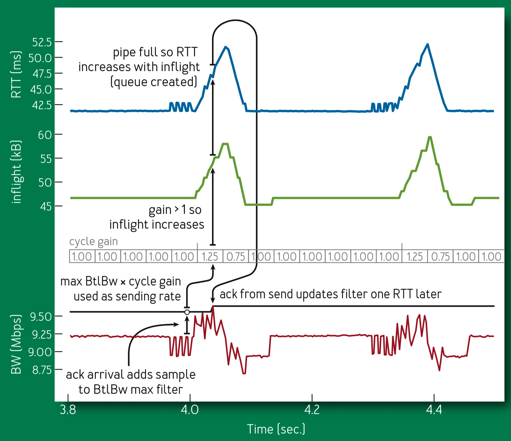

# Bottlenect Bandwith and Roundtrip Propagation Time, BBR


- When bottleneck buffers are large,loss-based congestion control keeps them full, causing bufferbloat. 
- When bottleneck buffers are small, loss- based congestion control misinterprets loss as a signal of congestion, leading to low throughput. 

## Congestion And Bottlenecks

The bottleneck is important because:

- It determines the connection’s maximum data-delivery rate. 
- It’s where persistent queues form.

Two physical constraints, **RTprop (round-trip propagation time)** and **BtlBw (bottleneck bandwidth)**, bound transport performance. 

> Delivery Rate And Rount-Trip Time VS. Inflight 


When there isn’t enough data in flight to fill the pipe, RTprop determines behavior; otherwise, BtlBw dominates.

Constraint lines intersect at $inflight = BtlBw × RTprop$, a.k.a. the pipe’s **BDP (bandwidth-delay product)**.

Packets are dropped when the excess exceeds the buffer capacity.

*Congestion* is just sustained operation to the right of the BDP line, and *congestion control* is
some scheme to bound how far to the right a connection operates on average.

Loss-based congestion control operates at the right edge of the bandwidth-limited region, delivering full bottleneck bandwidth at the cost of high delay and frequent packet loss.

**BBR**: bottleneck bandwidth and round-trip propagation time

## Charactering The Bottleneck

A connection runs with the highest throughput and lowest delay when (rate balance) the bottleneck packet arrival rate equals BtlBw, and (full pipe) the total data in flight is equal to the BDP (= *BtlBw × RTprop*).

The only way to minimize the queue at the bottleneck and all along the path is to meet both conditions simultaneously (同时).

Since path changes happen on times scales >> PTprop, an unbiased, efficient estimator at time T is 
$$
\widehat{PTprop} = RTprop + min({\eta}_t) = min(RTT_t)\space \forall t \in [T - W_R, T]
$$
a running min over time window $W_R$ (which is typically tens of seconds to minutes)

a windowed-max of delivery rate is an efficient, unbiased estimator of BtlBw:
$$
\widehat{BtlBw} = max(deliveryRate_t) \space \forall t \in [T - W_B, T]
$$
Where the time window $W_B$ is typically six to ten RTTs.

Since RTprop is visible only to the left of BDP and BtlBw only to the right in figure 1, they obey an uncertainty principle: whenever one can be measured, the other cannot.

## Matching The Packet Flow to The Delivery Path

The Core BBR algorithm has two parts:

### When an ack is received

Each ack provides new RTT and delivery rate measurements that update the RTprop and BtlBw estimates:

```c++
function onAck(packet)
	rtt = now - packet.sendtime 
  update_min_filter(RTpropFilter, rtt)
	delivered += packet.size
	delivered_time = now
	deliveryRate = (delivered - packet.delivered) / (now - packet.delivered_time) 	if (deliveryRate > BtlBwFilter.currentMax || ! packet.app_limited)
  	update_max_filter(BtlBwFilter, deliveryRate) 
  if (app_limited_until > 0) 
    app_limited_until - = packet.size
```

问题：为啥在有bdp的限制后，用delivered time算出来的速率，可以超过限制值。

### When data is sent

```c++
function send(packet)
	bdp = BtlBwFilter.currentMax * RTpropFilter.currentMin 
	if (inflight >= cwnd_gain * bdp)
		// wait for ack or timeout
		return
	if (now >= nextSendTime)
		packet = nextPacketToSend() 
    if (! packet)
			app_limited_until = inflight
			return 
   	packet.app_limited = (app_limited_until > 0) 
    packet.sendtime = now
		packet.delivered = delivered
		packet.delivered_time = delivered_time 
		ship(packet)
		nextSendTime = now + packet.size / (pacing_gain * BtlBwFilter.currentMax)
	timerCallbackAt(send, nextSendTime)
```


### Steady-state behavior

> RTT (blue), Inflight (green) and Delivery rate (RED) detail



The triangular structures result from BBR cycling pacing_gain to determine if BtlBw has increased. 

BBR minimizes delay by spending most of its time with one BDP in flight, paced at the BtlBw estimate. 

- If BtlBw hasn’t changed, then a queue is created at the bottleneck, increasing RTT, which keepsdeliveryRate constant. 
- if BtlBw has increased, deliveryRate increases and the new max immediately increases the BtlBw filter output, increasing the base pacing rate.

