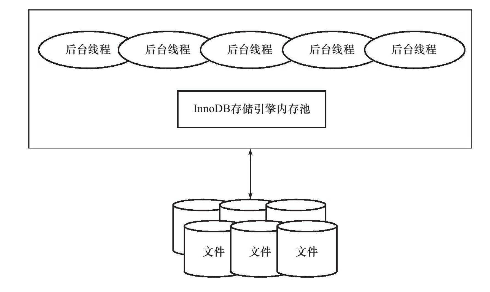
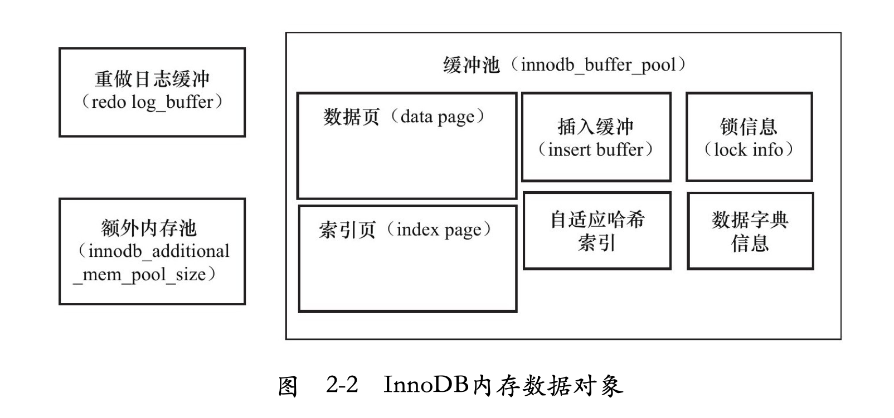
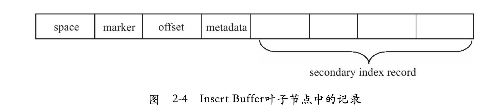
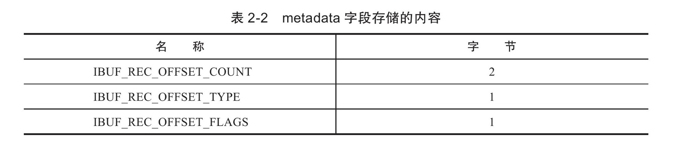
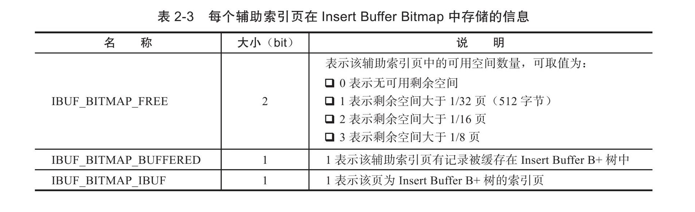
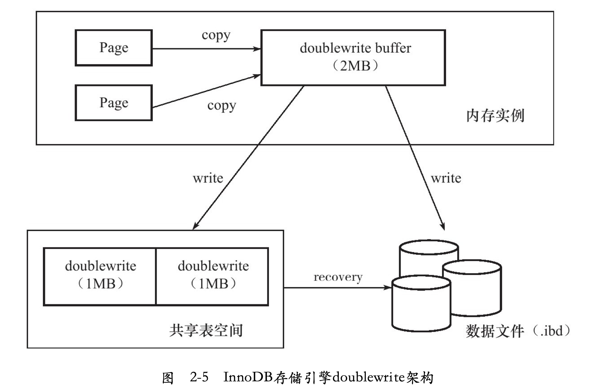

# InnoDB存储引擎

## InnoDB 体系架构

InnoDB存储引擎有多个内存块，可以认为这些内存块组成了一个大的内存池，负责如下工作：

- 维护所有进程/线程需要访问的多个内部数据结构。
- 缓存磁盘上的数据，方便快速地读取，同时在对磁盘文件的数据修改之前在这里缓存。
- 重做日志（redolog）缓冲。
- 。。。



后台线程的主要作用是负责刷新内存池中的数据，保证缓冲池中的内存缓存的是最近的数据。此外将已修改的数据文件刷新到磁盘文件，同时保证在数据库发生异常的情况下InnoDB能恢复到正常运行状态。

### 后台线程

InnoDB存储引擎是多线程的模型，因此其后台有多个不同的后台线程，负责处理不同的任务。

#### 1 MasterThread

MasterThread是一个非常核心的后台线程，主要负责将缓冲池中的数据异步刷新到磁盘，保证数据的一致性，包括脏页的刷新、合并插入缓冲（INSERTBUFFER）、UNDO页的回收等。

#### 2 IO Thread

在InnoDB存储引擎中大量使用了AIO（Async IO）来处理写IO请求，这样可以极大提高数据库的性能。而IO Thread的工作主要是负责这些IO请求的回调（callback）处理。

查看InnoDB中的IO Thread:

```mysql
show engine innodb status\G;
```

#### 3 Purge Thread

事务被提交后，其所使用的undolog可能不再需要，因此需要PurgeThread来回收已经使用并分配的undo页。

从InnoDB1.2版本开始，InnoDB支持多个PurgeThread，这样做的目的是为了进一步加快undo页的回收。同时由于PurgeThread需要离散地读取undo页，这样也能更进一步利用磁盘的随机读取性能。

#### 4 PageCleanerThread

PageCleanerThread是在InnoDB1.2.x版本中引入的。其作用是将之前版本中脏页的刷新操作都放入到单独的线程中来完成。而其目的是为了减轻原MasterThread的工作及对于用户查询线程的阻塞，进一步提高InnoDB存储引擎的性能。

### 内存

#### 1缓冲池

InnoDB存储引擎是基于磁盘存储的，并将其中的记录按照页的方式进行管理。因此可将其视为基于磁盘的数据库系统（Disk-base Database）。在数据库系统中，由于CPU速度与磁盘速度之间的鸿沟，基于磁盘的数据库系统通常使用缓冲池技术来提高数据库的整体性能。

缓冲池简单来说就是一块内存区域，通过内存的速度来弥补磁盘速度较慢对数据库性能的影响。在数据库中进行读取页的操作，首先将从磁盘读到的页存放在缓冲池中，这个过程称为将页“FIX”在缓冲池中。下一次再读相同的页时，首先判断该页是否在缓冲池中。若在缓冲池中，称该页在缓冲池中被命中，直接读取该页。否则，读取磁盘上的页。

对于数据库中页的修改操作，则首先修改在缓冲池中的页，然后再以一定的频率刷新到磁盘上。这里需要注意的是，页从缓冲池刷新回磁盘的操作并不是在每次页发生更新时触发，而是通过一种称为Checkpoint的机制刷新回磁盘。同样，这也是为了提高数据库的整体性能。

对于InnoDB存储引擎而言，其缓冲池的配置通过参数innodb_buffer_pool_size来设置。

查看缓冲池的大小：

```sql
show variables like'innodb_buffer_pool_size'\G;
```

具体来看，缓冲池中缓存的数据页类型有：索引页、数据页、undo页、插入缓冲（insert buffer）、自适应哈希索引（adaptive hash index）、InnoDB存储的锁信息（lock info）、数据字典信息（data dictionary）等。不能简单地认为，缓冲池只是缓存索引页和数据页，它们只是占缓冲池很大的一部分而已。



从InnoDB1.0.x版本开始，允许有多个缓冲池实例。每个页根据哈希值平均分配到不同缓冲池实例中。这样做的好处是减少数据库内部的资源竞争，增加数据库的并发处理能力。可以通过参数innodb_buffer_pool_instances来进行配置，该值默认为1。

```mysql
show variables like'innodb_buffer_pool_instances'\G;
```

在配置文件中将innodb_buffer_pool_instances设置为大于1的值就可以得到多个缓冲池实例。

#### 2 LRU List、Free List和Flush List

通常来说，数据库中的缓冲池是通过LRU（Latest Recent Used，最近最少使用）算法来进行管理的。即最频繁使用的页在LRU列表的前端，而最少使用的页在LRU列表的尾端。当缓冲池不能存放新读取到的页时，将首先释放LRU列表中尾端的页。

在InnoDB存储引擎中，缓冲池中页的大小默认为16KB，同样使用LRU算法对缓冲池进行管理。稍有不同的是InnoDB存储引擎对传统的LRU算法做了一些优化。在InnoDB的存储引擎中，LRU列表中还加入了midpoint位置。新读取到的页，虽然是最新访问的页，但并不是直接放入到LRU列表的首部，而是放入到LRU列表的midpoint位置。这个算法在InnoDB存储引擎下称为mid point insertion strategy。在默认配置下，该位置在LRU列表长度的5/8处。midpoint位置可由参数innodb_old_blocks_pct控制。

```mysql
show variables like'innodb_old_blocks_pct'\G;
```

参数innodb_old_blocks_pct默认值为37，表示新读取的页插入到LRU列表尾端的37%的位置（差不多3/8的位置）。在InnoDB存储引擎中，把midpoint之后的列表称为old列表，之前的列表称为new列表。可以简单地理解为new列表中的页都是最为活跃的热点数据。

>  为什么不采用朴素的LRU算法，直接将读取的页放入到LRU列表的首部呢？
>
> 若直接将读取到的页放入到LRU的首部，那么某些SQL操作可能会使缓冲池中的页被刷新出，从而影响缓冲池的效率。常见的这类操作为索引或数据的扫描操作。这类操作需要访问表中的许多页，甚至是全部的页，而这些页通常来说又仅在这次查询操作中需要，并不是活跃的热点数据。如果页被放入LRU列表的首部，那么非常可能将所需要的热点数据页从LRU列表中移除，而在下一次需要读取该页时，InnoDB存储引擎需要再次访问磁盘。

为了解决这个问题，InnoDB存储引擎引入了另一个参数来进一步管理LRU列表，这个参数是innodb_old_blocks_time，用于表示页读取到mid位置后需要等待多久才会被加入到LRU列表的热端。

LRU列表用来管理已经读取的页，但当数据库刚启动时，LRU列表是空的，即没有任何的页。这时页都存放在Free列表中。当需要从缓冲池中分页时，首先从Free列表中查找是否有可用的空闲页，若有则将该页从Free列表中删除，放入到LRU列表中。否则，根据LRU算法，淘汰LRU列表末尾的页，将该内存空间分配给新的页。当页从LRU列表的old部分加入到new部分时，称此时发生的操作为page made young，而因为innodb_old_blocks_time的设置而导致页没有从old部分移动到new部分的操作称为page not made young。

可以通过show engine innodb status 来观察LRU列表及Free列表的使用情况和运行状态.

```mysql
show engine innodb status\G;
```

缓冲池中的页还可能会被分配给自适应哈希索引、Lock信息、InsertBuffer等页，而这部分页不需要LRU算法进行维护，因此不存在于LRU列表中。

> 注意, 执行命令SHOWENGINEINNODBSTATUS显示的不是当前的状态，而是过去某个时间范围内InnoDB存储引擎的状态。

InnoDB存储引擎从1.0.x版本开始支持压缩页的功能，即将原本16KB的页压缩为1KB、2KB、4KB和8KB。而由于页的大小发生了变化，LRU列表也有了些许的改变。对于非16KB的页，是通过unzip_LRU列表进行管理的。

对于压缩页的表，每个表的压缩比率可能各不相同。可能存在有的表页大小为8KB，有的表页大小为2KB的情况。unzip_LRU是怎样从缓冲池中分配内存的呢？

首先，在unzip_LRU列表中对不同压缩页大小的页进行分别管理。其次，通过**伙伴算法**进行内存的分配。例如对需要从缓冲池中申请页为4KB的大小，其过程如下：

1. 检查4KB的unzip_LRU列表，检查是否有可用的空闲页；
2. 若有，则直接使用；
3. 否则，检查8KB的unzip_LRU列表；
4. 若能够得到空闲页，将页分成2个4KB页，存放到4KB的unzip_LRU列表；
5. 若不能得到空闲页，从LRU列表中申请一个16KB的页，将页分为1个8KB的页、2个4KB的页，分别存放到对应的unzip_LRU列表中。

在LRU列表中的页被修改后，称该页为**脏页（dirtypage）**，即缓冲池中的页和磁盘上的页的数据产生了不一致。这时数据库会通过**CHECKPOINT机制**将脏页刷新回磁盘，而Flush列表中的页即为脏页列表。需要注意的是，脏页既存在于LRU列表中，也存在于Flush列表中。LRU列表用来管理缓冲池中页的可用性，Flush列表用来管理将页刷新回磁盘，二者互不影响。

同LRU列表一样，Flush列表也可以通过命令SHOWENGINEINNODBSTATUS来查看。

#### 3 重做日志缓冲

InnoDB存储引擎的内存区域除了有缓冲池外，还有**重做日志缓冲（redo log buffer）**。InnoDB存储引擎首先将重做日志信息先放入到这个缓冲区，然后按一定频率将其刷新到重做日志文件。重做日志缓冲一般不需要设置得很大，因为一般情况下每一秒钟会将重做日志缓冲刷新到日志文件，因此用户只需要保证每秒产生的事务量在这个缓冲大小之内即可。该值可由配置参数innodb_log_buffer_size控制，默认为8MB。

```mysql
show variables like'innodb_log_buffer_size'\G;
```

重做日志在下列三种情况下会将重做日志缓冲中的内容刷新到外部磁盘的重做日志文件中，所以8M的重做日志缓冲能满足大部分情况。

1. MasterThread每一秒将重做日志缓冲刷新到重做日志文件；
2. 每个事务提交时会将重做日志缓冲刷新到重做日志文件；
3. 当重做日志缓冲池剩余空间小于1/2时，重做日志缓冲刷新到重做日志文件。

#### 4 额外的内存池

在InnoDB存储引擎中，对内存的管理是通过一种称为内存堆（heap）的方式进行的。在对一些数据结构本身的内存进行分配时，需要从额外的内存池中进行申请，当该区域的内存不够时，会从缓冲池中进行申请。例如，分配了缓冲池（innodb_buffer_pool），但是每个缓冲池中的帧缓冲（frame buffer）还有对应的缓冲控制对象（buffer control block），这些对象记录了一些诸如LRU、锁、等待等信息，而这个对象的内存需要从额外内存池中申请。因此，在申请了很大的InnoDB缓冲池时，也应考虑相应地增加这个值。

## check point 技术

为了避免发生数据丢失的问题，当前事务数据库系统普遍都采用了**Write Ahead Log策略**，即当事务提交时，先写重做日志，再修改页。当由于发生宕机而导致数据丢失时，通过重做日志来完成数据的恢复。这也是事务ACID中D（Durability持久性）的要求。

Checkpoint（检查点）技术的目的是解决以下几个问题：

- 缩短数据库的恢复时间；
- 缓冲池不够用时，将脏页刷新到磁盘；
- 重做日志不可用时，刷新脏页。

当数据库发生宕机时，数据库不需要重做所有的日志，因为Checkpoint之前的页都已经刷新回磁盘。故数据库只需对Checkpoint后的重做日志进行恢复。这样就大大缩短了恢复时间。

此外，当缓冲池不够用时，根据LRU算法会溢出最近最少使用的页，若此页为脏页，那么需要强制执行Checkpoint，将脏页也就是页的新版本刷回磁盘。

重做日志出现不可用的情况是因为当前事务数据库系统对重做日志的设计都是循环使用的。重做日志可以被重用的部分是指这些重做日志已经不再需要，即当数据库发生宕机时，数据库恢复操作不需要这部分的重做日志，因此这部分就可以被覆盖重用。若此时重做日志还需要使用，那么必须强制产生Checkpoint，将缓冲池中的页至少刷新到当前重做日志的位置。

对于InnoDB存储引擎而言，其是通过**LSN（Log Sequence Number）**来标记版本的。而LSN是8字节的数字，其单位是字节。每个页有LSN，重做日志中也有LSN，Checkpoint也有LSN。可以通过命令`show engine innodb status`来观察:

```mysql
show engine innodb status\G;

...
---
LOG
---
Log sequence number 7526115675
Log flushed up to   7526115675
Pages flushed up to 7526115675
Last checkpoint at  7526115666
...
```

Checkpoint所做的事情无外乎是将缓冲池中的脏页刷回到磁盘。不同之处在于每次刷新多少页到磁盘，每次从哪里取脏页，以及什么时间触发Checkpoint。 在InnoDB存储引擎内部，有两种Checkpoint，分别为：

- Sharp Checkpoint
- Fuzzy Checkpoint

Sharp Checkpoint发生在数据库关闭时将所有的脏页都刷新回磁盘，这是默认的工作方式，即参数innodb_fast_shutdown=1。

但是若数据库在运行时也使用Sharp Checkpoint，那么数据库的可用性就会受到很大的影响。故在InnoDB存储引擎内部使用Fuzzy Checkpoint进行页的刷新，即只刷新一部分脏页，而不是刷新所有的脏页回磁盘。

在InnoDB存储引擎中可能发生如下几种情况的Fuzzy Checkpoint：

- Master Thread Checkpoint
- FLUSH_LRU_LIST Checkpoint
- Async/Sync Flush Checkpoint
- Dirty Page too much Checkpoint

**Master Thread Checkpoint**

对于MasterThread中发生的Checkpoint，差不多以每秒或每十秒的速度从缓冲池的脏页列表中刷新一定比例的页回磁盘。这个过程是异步的，即此时InnoDB存储引擎可以进行其他的操作，用户查询线程不会阻塞。

**FLUSH_LRU_LIST Checkpoint**

FLUSH_LRU_LIST Checkpoint 是因为InnoDB存储引擎需要保证LRU列表中需要有差不多100个空闲页可供使用。倘若没有100个可用空闲页，那么InnoDB存储引擎会将LRU列表尾端的页移除。如果这些页中有脏页，那么需要进行Checkpoint，而这些页是来自LRU列表的，因此称为FLUSH_LRU_LIST Checkpoint。

从MySQL5.6版本，也就是InnoDB1.2.x版本开始，这个检查被放在了一个单独的Page Cleaner线程中进行，并且用户可以通过参数innodb_lru_scan_depth控制LRU列表中可用页的数量，该值默认为1024。

```mysql
show variables like'innodb_lru_scan_depth'\G;

*************************** 1. row ***************************
Variable_name: innodb_lru_scan_depth
        Value: 1024
```

**Async/Sync Flush Checkpoint**

Async/SyncFlushCheckpoint指的是重做日志文件不可用的情况，这时需要强制将一些页刷新回磁盘，而此时脏页是从脏页列表中选取的。

Async/Sync Flush Checkpoint是为了保证重做日志的循环使用的可用性。在InnoDB1.2.x版本之前，Async Flush Checkpoint会阻塞发现问题的用户查询线程，而Sync Flush Checkpoint会阻塞所有的用户查询线程，并且等待脏页刷新完成。从InnoDB1.2.x版本开始——也就是MySQL5.6版本，这部分的刷新操作同样放入到了单独的Page Cleaner Thread中，故不会阻塞用户查询线程。

**Dirty Page too much Checkpoint**

最后一种Checkpoint的情况是Dirty Page too much，即脏页的数量太多，导致InnoDB存储引擎强制进行Checkpoint。其目的总的来说还是为了保证缓冲池中有足够可用的页。其可由参数innodb_max_dirty_pages_pct控制。

```mysql
show variables like'innodb_max_dirty_pages_pct'\G;

*************************** 1. row ***************************
Variable_name: innodb_max_dirty_pages_pct
        Value: 75.000000
```

innodb_max_dirty_pages_pct值为75表示，当缓冲池中脏页的数量占据75%时，强制进行Checkpoint，刷新一部分的脏页到磁盘。在InnoDB1.0.x版本之前，该参数默认值为90，之后的版本都为75。

## Master Thread 工作方式

### InnoDB 1.0.x 版本之前的Master Thread

MasterThread具有最高的线程优先级别。其内部由多个循环（loop）组成：主循环（loop）、后台循环（backgroup loop）、刷新循环（flush loop）、暂停循环（suspend loop）。MasterThread会根据数据库运行的状态在loop、background loop、flush loop和suspend loop中进行切换。

```c++
void master_thread() {
	loop：for(inti=0;i＜10;i++){ 	
		do thing once per second 
		sleep 1 second if necessary
  }
  do things once per ten seconds
  goto loop;
}
```

loop循环通过thread sleep来实现，这意味着所谓的每秒一次或每10秒一次的操作是不精确的。在负载很大的情况下可能会有延迟（delay），只能说大概在这个频率下。

每秒一次的操作包括：

- 日志缓冲刷新到磁盘，即使这个事务还没有提交（总是）；
- 合并插入缓冲（可能）；
- 至多刷新100个InnoDB的缓冲池中的脏页到磁盘（可能）；
- 如果当前没有用户活动，则切换到backgroundloop（可能）。

即使某个事务还没有提交，InnoDB存储引擎仍然每秒会将重做日志缓冲中的内容刷新到重做日志文件。这一点是必须要知道的，因为这可以很好地解释为什么再大的事务提交（commit）的时间也是很短的。

合并插入缓冲（InsertBuffer）并不是每秒都会发生的。InnoDB存储引擎会判断当前一秒内发生的IO次数是否小于5次，如果小于5次，InnoDB认为当前的IO压力很小，可以执行合并插入缓冲的操作。

同样，刷新100个脏页也不是每秒都会发生的。InnoDB存储引擎通过判断当前缓冲池中脏页的比例（buf_get_modified_ratio_pct）是否超过了配置文件中innodb_max_dirty_pages_pct这个参数（默认为90，代表90%），如果超过了这个阈值，InnoDB存储引擎认为需要做磁盘同步的操作，将100个脏页写入磁盘中。

每10秒的操作，包括如下内容：

- 刷新100个脏页到磁盘（可能的情况下）；

- 合并至多5个插入缓冲（总是）；

- 将日志缓冲刷新到磁盘（总是）；

- 删除无用的Undo页（总是）；

- 刷新100个或者10个脏页到磁盘（总是）。

在以上的过程中，InnoDB存储引擎会先判断过去10秒之内磁盘的IO操作是否小于200次，如果是，InnoDB存储引擎认为当前有足够的磁盘IO操作能力，因此将100个脏页刷新到磁盘。接着，InnoDB存储引擎会合并插入缓冲。不同于每秒一次操作时可能发生的合并插入缓冲操作，这次的合并插入缓冲操作总会在这个阶段进行。之后，InnoDB存储引擎会再进行一次将日志缓冲刷新到磁盘的操作。这和每秒一次时发生的操作是一样的。

接着InnoDB存储引擎会进行一步执行full purge操作，即删除无用的Undo页。对表进行update、delete这类操作时，原先的行被标记为删除，但是因为一致性读（consistent read）的关系，需要保留这些行版本的信息。但是在full purge过程中，InnoDB存储引擎会判断当前事务系统中已被删除的行是否可以删除，比如有时候可能还有查询操作需要读取之前版本的undo信息，如果可以删除，InnoDB会立即将其删除。从源代码中可以发现，InnoDB存储引擎在执行full purge操作时，每次最多尝试回收20个undo页。

然后，InnoDB存储引擎会判断缓冲池中脏页的比例（buf_get_modified_ratio_pct），如果有超过70%的脏页，则刷新100个脏页到磁盘，如果脏页的比例小于70%，则只需刷新10%的脏页到磁盘。

backgroundloop，若当前没有用户活动（数据库空闲时）或者数据库关闭（shutdown），就会切换到这个循环。backgroundloop会执行以下操作：

- 删除无用的undo页（总是）；
- 合并20个插入缓冲（总是）；
- 跳回到主循环（总是）；
- 不断刷新100个页直到符合条件（可能，跳转到flushloop中完成）。

若flushloop中也没有什么事情可以做了，InnoDB存储引擎会切换到suspend__loop，将MasterThread挂起，等待事件的发生。若用户启用（enable）了InnoDB存储引擎，却没有使用任何InnoDB存储引擎的表，那么MasterThread总是处于挂起的状态。

### InnoDB1.2.x版本之前的MasterThread

> 可以作为扩展阅读

在写入密集程序中，之前对IO操作的限制（最大只会刷新100个脏页到磁盘，合并20个插入缓冲）会出现Master Thread忙不过来的情况，很大程度上限制了InnoDB的写入性能。

因此InnoDBPlugin（从InnoDB1.0.x版本开始）提供了参数innodb_io_capacity，用来表示磁盘IO的吞吐量，默认值为200。对于刷新到磁盘页的数量，会按照innodb_io_capacity的百分比来进行控制。规则如下：

- 在合并插入缓冲时，合并插入缓冲的数量为innodb_io_capacity值的5%；
- 在从缓冲区刷新脏页时，刷新脏页的数量为innodb_io_capacity。

若用户使用了SSD类的磁盘，或者将几块磁盘做了RAID，当存储设备拥有更高的IO速度时，完全可以将innodb_io_capacity的值调得再高点，直到符合磁盘IO的吞吐量为止。

从InnoDB1.0.x版本开始，innodb_max_dirty_pages_pct默认值变为了75。这样既可以加快刷新脏页的频率，又能保证了磁盘IO的负载。

InnoDB1.0.x版本带来的另一个参数是innodb_adaptive_flushing（自适应地刷新），该值影响每秒刷新脏页的数量。原来的刷新规则是：脏页在缓冲池所占的比例小于innodb_max_dirty_pages_pct时，不刷新脏页；大于innodb_max_dirty_pages_pct时，刷新100个脏页。随着innodb_adaptive_flushing参数的引入，InnoDB存储引擎会通过一个名为buf_flush_get_desired_flush_rate的函数来判断需要刷新脏页最合适的数量。

之前每次进行full purge操作时，最多回收20个Undo页，从InnoDB1.0.x版本开始引入了参数innodb_purge_batch_size，该参数可以控制每次full purge回收的Undo页的数量。该参数的默认值为20，并可以动态地对其进行修改，

### InnoDB 1.2.x版本的Master Thread

在InnoDB 1.2.x版本中再次对Master Thread进行了优化，由此也可以看出Master Thread对性能所起到的关键作用。在InnoDB 1.2.x版本中，Master Thread的伪代码如下：

```c
if InnoDB is idle
    srv_master_do_idle_tasks();
else
    srv_master_do_active_tasks();
```

其中srv_master_do_idle_tasks()就是之前版本中每10秒的操作，srv_master_do_active_tasks()处理的是之前每秒中的操作。同时对于刷新脏页的操作，从Master Thread线程分离到一个单独的Page Cleaner Thread，从而减轻了Master Thread的工作，同时进一步提高了系统的并发性。

## InnoDB关键特性

InnoDB存储引擎的关键特性包括：

- 插入缓冲（Insert Buffer）
- 两次写（Double Write）
- 自适应哈希索引（Adaptive Hash Index）
- 异步IO（Async IO）
- 刷新邻接页（Flush Neighbor Page）

上述这些特性为InnoDB存储引擎带来更好的性能以及更高的可靠性。

### 插入缓冲

#### 1 Insert Buffer

InsertBuffer可能是InnoDB存储引擎关键特性中最令人激动与兴奋的一个功能。

InnoDB缓冲池中有InsertBuffer信息固然不错，但是InsertBuffer和数据页一样，也是物理页的一个组成部分。

在InnoDB存储引擎中，主键是行唯一的标识符。通常应用程序中行记录的插入顺序是按照主键递增的顺序进行插入的。因此，插入聚集索引（Primary Key）一般是顺序的，不需要磁盘的随机读取。对于这类情况下的插入操作，速度是非常快的。
> 注意　并不是所有的主键插入都是顺序的。若主键类是UUID这样的类，那么插入和辅助索引一样，同样是随机的。即使主键是自增类型，但是插入的是指定的值，而不是NULL值，那么同样可能导致插入并非连续的情况。

但是不可能每张表上只有一个聚集索引，更多情况下，一张表上有多个非聚集的辅助索引（secondary index）。

在这样的情况下产生了一个非聚集的且不是唯一的索引。在进行插入操作时，数据页的存放还是按主键a进行顺序存放的，但是对于非聚集索引叶子节点的插入不再是顺序的了，这时就需要离散地访问非聚集索引页，由于随机读取的存在而导致了插入操作性能下降。当然这并不是这个b字段上索引的错误，而是因为B+树的特性决定了非聚集索引插入的离散性。

InnoDB存储引擎开创性地设计了**Insert Buffer**，对于**非聚集索引**的插入或更新操作，不是每一次直接插入到索引页中，而是先判断插入的非聚集索引页是否在缓冲池中，若在，则直接插入；若不在，则先放入到一个Insert Buffer对象中，好似欺骗。数据库这个非聚集的索引已经插到叶子节点，而实际并没有，只是存放在另一个位置。然后再以一定的频率和情况进行Insert Buffer和辅助索引页子节点的merge（合并）操作，这时通常能将多个插入合并到一个操作中（因为在一个索引页中），这就大大提高了对于非聚集索引插入的性能。

然而Insert Buffer的使用需要同时满足以下两个条件：

- 索引是辅助索引（secondary index）
- 索引不是唯一（unique）的。

当满足以上两个条件时，InnoDB存储引擎会使用Insert Buffer，这样就能提高插入操作的性能了。

辅助索引不能是唯一的，因为在插入缓冲时，数据库并不去查找索引页来判断插入的记录的唯一性。如果去查找肯定又会有离散读取的情况发生，从而导致InsertBuffer失去了意义。

可以通过命令`show engine innodb status;`来查看插入缓冲信息。

目前Insert Buffer存在一个问题是：在写密集的情况下，插入缓冲会占用过多的缓冲池内存（innodb_buffer_pool），默认最大可以占用到1/2的缓冲池内存。

#### 2 Change Buffer

InnoDB从1.0.x版本开始引入了Change Buffer，可将其视为Insert Buffer的升级。从这个版本开始，InnoDB存储引擎可以对DML操作——INSERT、DELETE、UPDATE都进行缓冲，他们分别是：Insert Buffer、Delete Buffer、Purge buffer。

Change Buffer适用的对象依然是非唯一的辅助索引。

对一条记录进行UPDATE操作可能分为两个过程：

- 将记录标记为已删除；
- 真正将记录删除。

因此Delete Buffer对应UPDATE操作的第一个过程，即将记录标记为删除。Purge Buffer对应UPDATE操作的第二个过程，即将记录真正的删除。同时，InnoDB存储引擎提供了参数innodb_change_buffering，用来开启各种Buffer的选项。该参数可选的值为：inserts、deletes、purges、changes、all、none。inserts、deletes、purges就是前面讨论过的三种情况。changes表示启用inserts和deletes，all表示启用所有，none表示都不启用。该参数默认值为all。

从InnoDB 1.2.x版本开始，可以通过参数innodb_change_buffer_max_size来控制Change Buffer最大使用内存的数量：

```mysql
show variables like 'innodb_change_buffer_max_size'\G;

Variable_name: innodb_change_buffer_max_size
        Value: 25
```

innodb_change_buffer_max_size值默认为25，表示最多使用1/4的缓冲池内存空间。而需要注意的是，该参数的最大有效值为50。

#### 3 Insert Buffer的内部实现

Insert Buffer的数据结构是一棵B+树。在MySQL4.1之前的版本中每张表有一棵Insert BufferB+树。而在现在的版本中，全局只有一棵Insert Buffer B+树，负责对所有的表的辅助索引进行Insert Buffer。而这棵B+树存放在共享表空间中，默认也就是ibdata1中。

> 因此，试图通过独立表空间ibd文件恢复表中数据时，往往会导致CHECK TABLE失败。这是因为表的辅助索引中的数据可能还在Insert Buffer中，也就是共享表空间中，所以通过ibd文件进行恢复后，还需要进行REPAIR TABLE操作来重建表上所有的辅助索引。

InsertBuffer是一棵B+树，因此其也由叶节点和非叶节点组成。非叶节点存放的是查询的search key（键值），其


search key一共占用9个字节，其中space表示待插入记录所在表的表空间id，在InnoDB存储引擎中，每个表有一个唯一的space id，可以通过space id查询得知是哪张表。space占用4字节。marker占用1字节，它是用来兼容老版本的Insert Buffer。offset表示页所在的偏移量，占用4字节。

当一个辅助索引要插入到页（space，offset）时，如果这个页不在缓冲池中，那么InnoDB存储引擎首先根据上述规则构造一个search key，接下来查询Insert Buffer这棵B+树，然后再将这条记录插入到Insert BufferB+树的叶子节点中。

对于插入到InsertBufferB+树叶子节点的记录，并不是直接将待插入的记录插入，而是需要根据如下的规则进行构造：



space、marker、offset字段和之前非叶节点中的含义相同，一共占用9字节。第4个字段metadata占用4字节：



IBUF_REC_OFFSET_COUNT是保存两个字节的整数，用来排序每个记录进入Insert Buffer的顺序。通过这个顺序回放（replay）才能得到记录的正确值。

从InsertBuffer叶子节点的第5列开始，就是实际插入记录的各个字段了。因此较之原插入记录，InsertBufferB+树的叶子节点记录需要额外13字节的开销。

因为启用InsertBuffer索引后，辅助索引页（space，page_no）中的记录可能被插入到Insert Buffer B+树中，所以为了保证每次Merge Insert Buffer页必须成功，还需要有一个特殊的页用来标记每个辅助索引页（space，page_no）的可用空间。这个页的类型为Insert Buffer Bitmap。

每个Insert Buffer Bit map页用来追踪16384个辅助索引页，也就是256个区（Extent）。每个Insert Buffer Bitmap页都在16384个页的第二个页中。

每个辅助索引页在InsertBufferBitmap页中占用4位（bit）：



#### 4 Merge Insert Buffer

Insert Buffer中的记录何时合并（merge）到真正的辅助索引中呢？

Merge Insert Buffer的操作可能发生在以下几种情况下：

- 辅助索引页被读取到缓冲池时；
- Insert Buffer Bitmap页追踪到该辅助索引页已无可用空间时；
- Master Thread。

第一种情况为当辅助索引页被读取到缓冲池中时，例如这在执行正常的SELECT查询操作，这时需要检查Insert Buffer Bit map页，然后确认该辅助索引页是否有记录存放于InsertBufferB+树中。若有，则将InsertBufferB+树中该页的记录插入到该辅助索引页中。可以看到对该页多次的记录操作通过一次操作合并到了原有的辅助索引页中，因此性能会有大幅提高。

Insert Buffer Bitmap页用来追踪每个辅助索引页的可用空间，并至少有1/32页的空间。若插入辅助索引记录时检测到插入记录后可用空间会小于1/32页，则会强制进行一个合并操作，即强制读取辅助索引页，将InsertBufferB+树中该页的记录及待插入的记录插入到辅助索引页中。这就是上述所说的第二种情况。

在MasterThread线程中每秒或每10秒会进行一次MergeInsertBuffer的操作，不同之处在于每次进行merge操作的页的数量不同。在MasterThread中，执行merge操作的不止是一个页，而是根据srv_innodb_io_capactiy的百分比来决定真正要合并多少个辅助索引页。

但InnoDB存储引擎又是根据怎样的算法来得知需要合并的辅助索引页呢？

在Insert Buffer B+树中，辅助索引页根据（space，offset）都已排序好，故可以根据（space，offset）的排序顺序进行页的选择。然而，对于Insert Buffer页的选择，InnoDB存储引擎并非采用这个方式，InnoDB随机地选择Insert Buffer B+树的一个页，读取该页中的space及之后所需要数量的页。该算法在复杂情况下应有更好的公平性。同时，若进行merge时，要进行merge的表已经被删除，此时可以直接丢弃已经被Insert/ChangeBuffer的数据记录。

### 两次写(Doublewrite)

doublewrite（两次写）带给InnoDB存储引擎的是数据页的可靠性。

当发生数据库宕机时，可能InnoDB存储引擎正在写入某个页到表中，而这个页只写了一部分，比如16KB的页，只写了前4KB，之后就发生了宕机，这种情况被称为部分写失效（partial page write）。在InnoDB存储引擎未使用doublewrite技术前，曾经出现过因为部分写失效而导致数据丢失的情况。

重做日志中记录的是对页的物理操作， 如果这个页本身已经发生了损坏，再对其进行重做是没有意义的。这就是说，在应用（apply）重做日志前，用户需要一个页的副本，当写入失效发生时，先通过页的副本来还原该页，再进行重做，这就是doublewrite。



doublewrite由两部分组成，一部分是内存中的doublewrite buffer，大小为2MB，另一部分是物理磁盘上共享表空间中连续的128个页，即2个区（extent），大小同样为2MB。在对缓冲池的脏页进行刷新时，并不直接写磁盘，而是会通过memcpy函数将脏页先复制到内存中的doublewrite buffer，之后通过doublewrite buffer再分两次，每次1MB顺序地写入共享表空间的物理磁盘上，然后马上调用fsync函数，同步磁盘，避免缓冲写带来的问题。在这个过程中，因为doublewrite页是连续的，因此这个过程是顺序写的，开销并不是很大。在完成doublewrite页的写入后，再将doublewrite buffer中的页写入各个表空间文件中，此时的写入则是离散的。

可以通过以下命令观察到doublewrite运行的情况：

```mysql
show global status like'innodb_dblwr%'\G;

*************************** 1. row ***************************
Variable_name: Innodb_dblwr_pages_written
        Value: 6 325 194
*************************** 2. row ***************************
Variable_name: Innodb_dblwr_writes
        Value: 100399
```


如果操作系统在将页写入磁盘的过程中发生了崩溃，在恢复过程中，InnoDB存储引擎可以从共享表空间中的doublewrite中找到该页的一个副本，将其复制到表空间文件，再应用重做日志。

参数skip_innodb_doublewrite可以禁止使用doublewrite功能，这时可能会发生前面提及的写失效问题。不过如果用户有多个从服务器（slave server），需要提供较快的性能（如在slaves erver上做的是RAID0），也许启用这个参数是一个办法。不过对于需要提供数据高可靠性的主服务器（master server），任何时候用户都应确保开启doublewrite功能。注意　有些文件系统本身就提供了部分写失效的防范机制，如ZFS文件系统。在这种情况下，用户就不要启用doublewrite了。

### 自适应哈希索引(Adaptive Hash Index)

哈希（hash）是一种非常快的查找方法，在一般情况下这种查找的时间复杂度为O(1)，即一般仅需要一次查找就能定位数据。而B+树的查找次数，取决于B+树的高度，在生产环境中，B+树的高度一般为`3~4`层，故需要`3~4`次的查询。

InnoDB存储引擎会监控对表上各索引页的查询。如果观察到建立哈希索引可以带来速度提升，则建立哈希索引，称之为**自适应哈希索引（Adaptive Hash Index，AHI）**。AHI是通过缓冲池的B+树页构造而来，因此建立的速度很快，而且不需要对整张表构建哈希索引。InnoDB存储引擎会自动根据访问的频率和模式来自动地为某些热点页建立哈希索引。

AHI的要求：

- 对这个页的连续访问模式必须是一样的。

例如对于（a，b）这样的联合索引页，其访问模式可以是以下情况：❑WHERE a=xxx❑WHERE a=xxx and b=xxx访问模式一样指的是查询的条件一样，若交替进行上述两种查询，那么InonDB存储引擎不会对该页构造AHI。

- 以该模式访问了100次
- 页通过该模式访问了N次，其中N=页中记录*1/16

根据InnoDB存储引擎官方的文档显示，启用AHI后，读取和写入速度可以提高2倍，辅助索引的连接操作性能可以提高5倍。毫无疑问，AHI是非常好的优化模式，其设计思想是数据库自优化的（self-tuning），即无需DBA对数据库进行人为调整。

通过命令SHOW ENGINE INNODB STATUS可以看到当前AHI的使用状况:

```mysql
show engine innodb status\G;

-------------------------------------
INSERT BUFFER AND ADAPTIVE HASH INDEX
-------------------------------------
Ibuf: size 1, free list len 11, seg size 13, 0 merges
merged operations:
 insert 0, delete mark 0, delete 0
discarded operations:
 insert 0, delete mark 0, delete 0
Hash table size 34673, node heap has 0 buffer(s)
Hash table size 34673, node heap has 0 buffer(s)
Hash table size 34673, node heap has 0 buffer(s)
Hash table size 34673, node heap has 0 buffer(s)
Hash table size 34673, node heap has 0 buffer(s)
Hash table size 34673, node heap has 0 buffer(s)
Hash table size 34673, node heap has 0 buffer(s)
Hash table size 34673, node heap has 0 buffer(s)
0.00 hash searches/s, 0.00 non-hash searches/s
```

值得注意的是，哈希索引只能用来搜索等值的查询，如SELECT*FROM table WHERE index_col='xxx'。而对于其他查找类型，如范围查找，是不能使用哈希索引的，因此这里出现了non-hash searches/s的情况。通过hash searches:non-hash searches可以大概了解使用哈希索引后的效率。

由于AHI是由InnoDB存储引擎控制的，因此这里的信息只供用户参考。不过用户可以通过观察SHOW ENGINE INNODB STATUS的结果及参数innodb_adaptive_hash_index来考虑是禁用或启动此特性，默认AHI为开启状态。

### 异步IO(Asynchronous IO)

为了提高磁盘操作性能，当前的数据库系统都采用异步IO（Asynchronous IO，AIO）的方式来处理磁盘操作。InnoDB存储引擎亦是如此。

与AIO对应的是Sync IO，即每进行一次IO操作，需要等待此次操作结束才能继续接下来的操作。但是如果用户发出的是一条索引扫描的查询，那么这条SQL查询语句可能需要扫描多个索引页，也就是需要进行多次的IO操作。在每扫描一个页并等待其完成后再进行下一次的扫描，这是没有必要的。用户可以在发出一个IO请求后立即再发出另一个IO请求，当全部IO请求发送完毕后，等待所有IO操作的完成，这就是AIO。

AIO的另一个优势是可以进行IOMerge操作，也就是将多个IO合并为1个IO，这样可以提高IOPS的性能。

例如用户需要访问页的（space，page_no）为：（8，6）、（8，7），（8，8）每个页的大小为16KB，那么同步IO需要进行3次IO操作。而AIO会判断到这三个页是连续的（显然可以通过（space，page_no）得知）。因此AIO底层会发送一个IO请求，从（8，6）开始，读取48KB的页。

在InnoDB1.1.x之前，AIO的实现通过InnoDB存储引擎中的代码来模拟实现。而从InnoDB1.1.x开始（InnoDB Plugin不支持），提供了内核级别AIO的支持，称为Native AIO。因此在编译或者运行该版本MySQL时，需要libaio库的支持。

需要注意的是，Native AIO需要操作系统提供支持。Windows系统和Linux系统都提供Native AIO支持，而Mac OSX系统则未提供。因此在这些系统下，依旧只能使用原模拟的方式。在选择MySQL数据库服务器的操作系统时，需要考虑这方面的因素。

官方的测试显示，启用NativeAIO，恢复速度可以提高75%。

在InnoDB存储引擎中，read ahead方式的读取都是通过AIO完成，脏页的刷新，即磁盘的写入操作则全部由AIO完成。

### 刷新临接页(Flush Neighbor Page)

InnoDB存储引擎还提供了**Flush Neighbor Page（刷新邻接页）的**特性。其工作原理为：当刷新一个脏页时，InnoDB存储引擎会检测该页所在区（extent）的所有页，如果是脏页，那么一起进行刷新。这样做的好处显而易见，通过AIO可以将多个IO写入操作合并为一个IO操作，故该工作机制在传统机械磁盘下有着显著的优势。

但是需要考虑到下面两个问题：

- 是不是可能将不怎么脏的页进行了写入，而该页之后又会很快变成脏页？
- 固态硬盘有着较高的IOPS，是否还需要这个特性？

为此，InnoDB存储引擎从1.2.x版本开始提供了参数innodb_flush_neighbors，用来控制是否启用该特性。对于传统机械硬盘建议启用该特性，而对于固态硬盘有着超高IOPS性能的磁盘，则建议将该参数设置为0，即关闭此特性。

## 启动、关闭与恢复

InnoDB是MySQL数据库的存储引擎之一，因此InnoDB存储引擎的启动和关闭，更准确的是指在MySQL实例的启动过程中对InnoDB存储引擎的处理过程。

在关闭时，参数innodb_fast_shutdown影响着表的存储引擎为InnoDB的行为。该参数可取值为0、1、2，默认值为1。

- 0表示在MySQL数据库关闭时，InnoDB需要完成所有的full purge和merge insert buffer，并且将所有的脏页刷新回磁盘。这需要一些时间，有时甚至需要几个小时来完成。如果在进行InnoDB升级时，必须将这个参数调为0，然后再关闭数据库。
- 1是参数innodb_fast_shutdown的默认值，表示不需要完成上述的full purge和merge insert buffer操作，但是在缓冲池中的一些数据脏页还是会刷新回磁盘。
- 2表示不完成fullpurge和mergeinsertbuffer操作，也不将缓冲池中的数据脏页写回磁盘，而是将日志都写入日志文件。这样不会有任何事务的丢失，但是下次MySQL数据库启动时，会进行恢复操作（recovery）。

当正常关闭MySQL数据库时，下次的启动应该会非常“正常”。但是如果没有正常地关闭数据库，如用kill命令关闭数据库，在MySQL数据库运行中重启了服务器，或者在关闭数据库时，将参数innodb_fast_shutdown设为了2时，下次MySQL数据库启动时都会对InnoDB存储引擎的表进行恢复操作。

参数innodb_force_recovery影响了整个InnoDB存储引擎恢复的状况。该参数值默认为0，代表当发生需要恢复时，进行所有的恢复操作，当不能进行有效恢复时，如数据页发生了corruption，MySQL数据库可能发生宕机（crash），并把错误写入错误日志中去。

参数innodb_force_recovery还可以设置为6个非零值：1~6。大的数字表示包含了前面所有小数字表示的影响。具体情况如下：

- 1(SRV_FORCE_IGNORE_CORRUPT)：忽略检查到的corrupt页。
- 2(SRV_FORCE_NO_BACKGROUND)：阻止MasterThread线程的运行，如MasterThread线程需要进行fullpurge操作，而这会导致crash。
- 3(SRV_FORCE_NO_TRX_UNDO)：不进行事务的回滚操作。
- 4(SRV_FORCE_NO_IBUF_MERGE)：不进行插入缓冲的合并操作。
- 5(SRV_FORCE_NO_UNDO_LOG_SCAN)：不查看撤销日志（UndoLog），InnoDB存储引擎会将未提交的事务视为已提交。
- 6(SRV_FORCE_NO_LOG_REDO)：不进行前滚的操作。

需要注意的是，在设置了参数innodb_force_recovery大于0后，用户可以对表进行select、create和drop操作，但insert、update和delete这类DML操作是不允许的。

## 小结

本章对InnoDB存储引擎及其体系结构进行了概述，先给出了InnoDB存储引擎的历史、InnoDB存储引擎的体系结构（包括后台线程和内存结构）；之后又详细介绍了InnoDB存储引擎的关键特性，这些特性使InnoDB存储引擎变得更具“魅力”；最后介绍了启动和关闭MySQL时一些配置文件参数对InnoDB存储引擎的影响。
