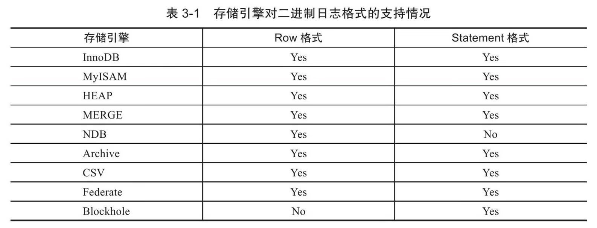

# 文件

构成MySQL数据库和InnoDB存储引擎表的各种类型文件：

- 参数文件：告诉MySQL实例启动时在哪里可以找到数据库文件，并且指定某些初始化参数，这些参数定义了某种内存结构的大小等设置，还会介绍各种参数的类型。
- 日志文件：用来记录MySQL实例对某种条件做出响应时写入的文件，如错误日志文件、二进制日志文件、慢查询日志文件、查询日志文件等。
- socket文件：当用UNIX域套接字方式进行连接时需要的文件。
- pid文件：MySQL实例的进程ID文件。
- MySQL表结构文件：用来存放MySQL表结构定义文件。
- 存储引擎文件：因为MySQL表存储引擎的关系，每个存储引擎都会有自己的文件来保存各种数据。这些存储引擎真正存储了记录和索引等数据。

## 参数文件

当MySQL实例启动时，数据库会先去读一个配置参数文件，用来寻找数据库的各种文件所在位置以及指定某些初始化参数，这些参数通常定义了某种内存结构有多大等。在默认情况下，MySQL实例会按照一定的顺序在指定的位置进行读取，用户只需通过命令`mysql--help|grep my.cnf`来寻找即可。

…

## 日志文件

日志文件记录了影响MySQL数据库的各种类型活动。MySQL数据库中常见的日志文件有：

- 错误日志（error log）
- 二进制日志（binlog）
- 慢查询日志（slow query log）
- 查询日志（log）

### 错误日志(error log)

错误日志文件对MySQL的启动、运行、关闭过程进行了记录。该文件不仅记录了所有的错误信息，也记录一些警告信息或正确的信息。用户可以通过命令`SHOW VARIABLES LIKE’log_error'`来定位该文件，如：

```mysql
mysql> show variables like'log_error'\G;
*************************** 1. row ***************************
Variable_name: log_error
        Value: /usr/local/mysql/data/mysqld.local.err
1 row in set (0.11 sec)
```

当出现MySQL数据库不能正常启动时，第一个必须查找的文件应该就是错误日志文件，该文件记录了错误信息，能很好地指导用户发现问题。

### 慢查询日志(slow query log)

慢查询日志（slow log）可帮助DBA定位可能存在问题的SQL语句，从而进行SQL语句层面的优化。例如，可以在MySQL启动时设一个阈值，将运行时间超过该值的所有SQL语句都记录到慢查询日志文件中。该阈值可以通过参数long_query_time来设置，默认值为10，代表10秒。

在默认情况下，MySQL数据库并不启动慢查询日志，用户需要手工将这个参数设为ON。

```mysql
mysql> show variables like'long_query_time'\G;
*************************** 1. row ***************************
Variable_name: long_query_time
        Value: 10.000000
1 row in set (0.05 sec)

mysql> show variables like'log_slow_queries'\G;
Empty set (0.03 sec)
```

这里有两点需要注意：

- 首先，设置long_query_time这个阈值后，MySQL数据库会记录运行时间超过该值的所有SQL语句，但运行时间正好等于long_query_time的情况并不会被记录下。也就是说，在源代码中判断的是大于long_query_time，而非大于等于。
- 其次，从MySQL 5.1开始，long_query_time开始以微秒记录SQL语句运行的时间，之前仅用秒为单位记录。而这样可以更精确地记录SQL的运行时间。

另一个和慢查询日志有关的参数是log_queries_not_using_indexes，如果运行的SQL语句没有使用索引，则MySQL数据库同样会将这条SQL语句记录到慢查询日志文件。首先确认打开了log_queries_not_using_indexes：

```mysql
mysql> show variables like'log_queries_not_using_indexes'\G;
*************************** 1. row ***************************
Variable_name: log_queries_not_using_indexes
        Value: OFF
1 row in set (0.03 sec)
```

MySQL 5.6.5版本开始新增了一个参数log_throttle_queries_not_using_indexes，用来表示每分钟允许记录到slow log的且未使用索引的SQL语句次数。该值默认为0，表示没有限制。在生产环境下，若没有使用索引，此类SQL语句会频繁地被记录到slow log，从而导致slow log文件的大小不断增加，故DBA可通过此参数进行配置。

MySQL数据库提供的`mysqldumpslow`命令可以帮助分析慢查询日志。

MySQL5.1开始可以将慢查询的日志记录放入一张表中，这使得用户的查询更加方便和直观。慢查询表在mysql架构下，名为slow_log，其表结构定义如下:

```mysql
mysql> show create table mysql.slow_log\G;
*************************** 1. row ***************************
       Table: slow_log
Create Table: CREATE TABLE `slow_log` (
  `start_time` timestamp(6) NOT NULL DEFAULT CURRENT_TIMESTAMP(6) ON UPDATE CURRENT_TIMESTAMP(6),
  `user_host` mediumtext NOT NULL,
  `query_time` time(6) NOT NULL,
  `lock_time` time(6) NOT NULL,
  `rows_sent` int(11) NOT NULL,
  `rows_examined` int(11) NOT NULL,
  `db` varchar(512) NOT NULL,
  `last_insert_id` int(11) NOT NULL,
  `insert_id` int(11) NOT NULL,
  `server_id` int(10) unsigned NOT NULL,
  `sql_text` mediumblob NOT NULL,
  `thread_id` bigint(21) unsigned NOT NULL
) ENGINE=CSV DEFAULT CHARSET=utf8 COMMENT='Slow log'
1 row in set (0.06 sec)
```

参数log_output指定了慢查询输出的格式，默认为FILE，可以将它设为TABLE，然后就可以查询mysql架构下的slow_log表了.

```mysql
mysql> show variables like'log_output'\G;
*************************** 1. row ***************************
Variable_name: log_output
        Value: FILE
1 row in set (0.02 sec)

mysql> set global log_output='TABLE'
    -> ;
Query OK, 0 rows affected (0.01 sec)

mysql> show variables like'log_output'\G;
*************************** 1. row ***************************
Variable_name: log_output
        Value: TABLE
1 row in set (0.02 sec)
```

参数log_output是动态的，并且是全局的，因此用户可以在线进行修改。

MySQL的slow log通过运行时间来对SQL语句进行捕获，这是一个非常有用的优化技巧。但是当数据库的容量较小时，可能因为数据库刚建立，此时非常大的可能是数据全部被缓存在缓冲池中，SQL语句运行的时间可能都是非常短的，一般都是0.5秒。

### 查询日志

查询日志记录了所有对MySQL数据库请求的信息，无论这些请求是否得到了正确的执行。默认文件名为：主机名.log。

从MySQL 5.1开始，可以将查询日志的记录放入mysql架构下的general_log表中，该表的使用方法和前面小节提到的slow_log基本一样，这里不再赘述。

### 二进制日志(binlog)

二进制日志（binary log）记录了对MySQL数据库执行更改的所有操作，但是不包括SELECT和SHOW这类操作，因为这类操作对数据本身并没有修改。

二进制日志还包括了执行数据库更改操作的时间等其他额外信息。总的来说，二进制日志主要有以下几种作用：

- **恢复（recovery）**：某些数据的恢复需要二进制日志，例如，在一个数据库全备文件恢复后，用户可以通过二进制日志进行point-in-time的恢复。
- **复制（replication）**：其原理与恢复类似，通过复制和执行二进制日志使一台远程的MySQL数据库（一般称为slave或standby）与一台MySQL数据库（一般称为master或primary）进行实时同步。
- **审计（audit）**：用户可以通过二进制日志中的信息来进行审计，判断是否有对数据库进行注入的攻击。

通过配置参数log-bin[=name]可以启动二进制日志。如果不指定name，则默认二进制日志文件名为主机名，后缀名为二进制日志的序列号，所在路径为数据库所在目录（datadir），如：

```mysql
mysql> show variables like'datadir';
+---------------+------------------------+
| Variable_name | Value                  |
+---------------+------------------------+
| datadir       | /usr/local/mysql/data/ |
+---------------+------------------------+
1 row in set (0.04 sec)

sudo ls -lh /usr/local/mysql/data/
total 385192
-rw-r-----    1 _mysql  _mysql   5.2K  4  7  2022 L337QMD39K.err
-rw-r--r--    1 root    _mysql     0B  4  7  2022 L337QMD39K.pid.shutdown
-rw-r-----    1 _mysql  _mysql    56B  4  7  2022 auto.cnf
-rw-------    1 _mysql  _mysql   1.6K  4  7  2022 ca-key.pem
-rw-r--r--    1 _mysql  _mysql   1.1K  4  7  2022 ca.pem
-rw-r--r--    1 _mysql  _mysql   1.1K  4  7  2022 client-cert.pem
-rw-------    1 _mysql  _mysql   1.6K  4  7  2022 client-key.pem
-rw-r-----    1 _mysql  _mysql   797B 12 11 23:13 ib_buffer_pool
-rw-r-----    1 _mysql  _mysql    48M 12 29 15:56 ib_logfile0
-rw-r-----    1 _mysql  _mysql    48M 12 29 15:56 ib_logfile1
-rw-r-----    1 _mysql  _mysql    76M 12 29 15:56 ibdata1
-rw-r-----    1 _mysql  _mysql    12M 12 11 23:14 ibtmp1
drwxr-x---    9 _mysql  _mysql   288B  8 31 16:04 is_recon
drwxr-x---   34 _mysql  _mysql   1.1K  4 17  2022 minimarket_product_db
drwxr-x---   23 _mysql  _mysql   736B  4 14  2022 minimarket_user_db
drwxr-x---   25 _mysql  _mysql   800B  4  7  2022 mysite
drwxr-x---   77 _mysql  _mysql   2.4K  4  7  2022 mysql
-rw-r-----    1 _mysql  _mysql   3.2M 12 29 13:14 mysqld.local.err
-rw-r-----    1 _mysql  _mysql     4B 12 11 23:14 mysqld.local.pid
drwxr-x---   90 _mysql  _mysql   2.8K  4  7  2022 performance_schema
-rw-------    1 _mysql  _mysql   1.6K  4  7  2022 private_key.pem
-rw-r--r--    1 _mysql  _mysql   452B  4  7  2022 public_key.pem
-rw-r--r--    1 _mysql  _mysql   1.1K  4  7  2022 server-cert.pem
-rw-------    1 _mysql  _mysql   1.6K  4  7  2022 server-key.pem
drwxr-x---  108 _mysql  _mysql   3.4K  4  7  2022 sys
```

> 我这里没有开启，所以看不到bin_log…

二进制日志文件在默认情况下并没有启动，需要手动指定参数来启动。

可能有人会质疑，开启这个选项是否会对数据库整体性能有所影响?

开启这个选项的确会影响性能，但是性能的损失十分有限。根据MySQL官方手册中的测试表明，开启二进制日志会使性能下降1%。但考虑到可以使用复制（replication）和point-in-time的恢复，这些性能损失绝对是可以且应该被接受的。

以下配置文件的参数影响着二进制日志记录的信息和行为：

- max_binlog_size
- binlog_cache_size
- sync_binlog
- binlog-do-db
- binlog-ignore-db
- log-slave-update
- binlog_format

**max_binlog_size**

参数max_binlog_size指定了单个二进制日志文件的最大值，如果超过该值，则产生新的二进制日志文件，后缀名+1，并记录到.index文件。从MySQL 5.0开始的默认值为1 073 741 824，代表1 G（在之前版本中max_binlog_size默认大小为1.1G）。

**binlog_cache_size**

当使用事务的表存储引擎（如InnoDB存储引擎）时，所有未提交（uncommitted）的二进制日志会被记录到一个缓存中去，等该事务提交（committed）时直接将缓冲中的二进制日志写入二进制日志文件，而该缓冲的大小由binlog_cache_size决定，默认大小为32K。

此外，binlog_cache_size是基于会话（session）的，也就是说，当一个线程开始一个事务时，MySQL会自动分配一个大小为binlog_cache_size的缓存，因此该值不能设置过大。当一个事务的记录大于设定的binlog_cache_size时，MySQL会把缓冲中的日志写入一个临时文件中，因此该值又不能设得太小。

通过`show global status`命令查看bingo_cache_use、binlog_cache_disk_use的状态，可以判断当前binlog_cache_size的设置是否合适。binlog_cache_use记录了使用缓冲写二进制日志的次数，binlog_cache_disk_use记录了使用临时文件写二进制日志的次数。

```mysql
mysql> show variables like 'binlog_cache_size';
+-------------------+-------+
| Variable_name     | Value |
+-------------------+-------+
| binlog_cache_size | 32768 |
+-------------------+-------+
1 row in set (0.03 sec)

mysql> show global status like 'binlog_cache%';
+-----------------------+-------+
| Variable_name         | Value |
+-----------------------+-------+
| Binlog_cache_disk_use | 0     |
| Binlog_cache_use      | 0     |
+-----------------------+-------+
2 rows in set (0.01 sec)
```

**sync_binlog**

在默认情况下，二进制日志并不是在每次写的时候同步到磁盘（用户可以理解为缓冲写）。因此，当数据库所在操作系统发生宕机时，可能会有最后一部分数据没有写入二进制日志文件中，这会给恢复和复制带来问题。

参数sync_binlog=[N]表示每写缓冲多少次就同步到磁盘。如果将N设为1，即sync_binlog=1表示采用同步写磁盘的方式来写二进制日志，这时写操作不使用操作系统的缓冲来写二进制日志。sync_binlog的默认值为0 (设置为0代表mysql 不控制binlog的刷新，由文件系统自己控制它的缓存刷新)，如果使用InnoDB存储引擎进行复制，并且想得到最大的高可用性，建议将该值设为ON。不过该值为ON时，确实会对数据库的IO系统带来一定的影响。

但是，即使将sync_binlog设为1，还是会有一种情况导致问题的发生。当使用InnoDB存储引擎时，在一个事务发出COMMIT动作之前，由于sync_binlog为1，因此会将二进制日志立即写入磁盘。如果这时已经写入了二进制日志，但是提交还没有发生，并且此时发生了宕机，那么在MySQL数据库下次启动时，由于COMMIT操作并没有发生，这个事务会被回滚掉。但是二进制日志已经记录了该事务信息，不能被回滚。这个问题可以通过将参数innodb_support_xa设为1来解决，虽然innodb_support_xa与XA事务有关，但它同时也确保了二进制日志和InnoDB存储引擎数据文件的同步。

**binlog-do-db** 和 **binlog-ignore-db**

参数binlog-do-db和binlog-ignore-db表示需要写入或忽略写入哪些库的日志。默认为空，表示需要同步所有库的日志到二进制日志。

**log-slave-update**

如果当前数据库是复制中的slave角色，则它不会将从master取得并执行的二进制日志写入自己的二进制日志文件中去。如果需要写入，要设置log-slave-update。如果需要搭建master=＞slave=＞slave架构的复制，则必须设置该参数。

**binlog_format**

binlog_format参数十分重要，它影响了记录二进制日志的格式。

>  在MySQL 5.1版本之前，没有这个参数。所有二进制文件的格式都是基于SQL语句（statement）级别的，因此基于这个格式的二进制日志文件的复制（Replication）和Oracle的逻辑Standby有点相似。同时，对于复制是有一定要求的。如在主服务器运行rand、uuid等函数，又或者使用触发器等操作，这些都可能会导致主从服务器上表中数据的不一致（not sync）。另一个影响是，会发现InnoDB存储引擎的默认事务隔离级别是REPEATABLE READ。这其实也是因为二进制日志文件格式的关系，如果使用READ COMMITTED的事务隔离级别（大多数数据库，如Oracle，Microsoft SQL Server数据库的默认隔离级别），会出现类似丢失更新的现象（受幻读的影响），从而出现主从数据库上的数据不一致。

MySQL5.1开始引入了binlog_format参数，该参数可设的值有STATEMENT、ROW和MIXED。

1. **STATEMENT**格式和之前的MySQL版本一样，二进制日志文件记录的是日志的逻辑SQL语句。
2. 在**ROW**格式下，二进制日志记录的不再是简单的SQL语句了，而是记录表的行更改情况。基于ROW格式的复制类似于Oracle的物理Standby（当然，还是有些区别）。从MySQL5.1版本开始，如果设置了binlog_format为ROW，可以将InnoDB的事务隔离基本设为READ COMMITTED，以获得更好的并发性。
3. 在**MIXED**格式下，MySQL默认采用STATEMENT格式进行二进制日志文件的记录，但是在一些情况下会使用ROW格式，可能的情况有：
   1. 表的存储引擎为NDB，这时对表的DML操作都会以ROW格式记录。
   2. 使用了UUID()、USER()、CURRENT_USER()、FOUND_ROWS()、ROW_COUNT()等不确定函数。
   3. 使用了INSERTDELAY语句。
   4. 使用了用户定义函数（UDF）。
   5. 使用了临时表（temporarytable）。

此外，binlog_format参数还有对于存储引擎的限制：



binlog_format是动态参数，因此可以在数据库运行环境下进行更改。

例如，我们可以将当前会话的binlog_format设为ROW，如：

```mysql
mysql> set@@session.binlog_format='ROW';
Query OK, 0 rows affected (0.04 sec)

mysql> select@@session.binlog_format;
+-------------------------+
| @@session.binlog_format |
+-------------------------+
| ROW                     |
+-------------------------+
1 row in set (0.02 sec)
```

当然，也可以将全局的binlog_format设置为想要的格式，不过通常这个操作会带来问题，运行时要确保更改后不会对复制带来影响。

```mysql
mysql> set global binlog_format='ROW';
Query OK, 0 rows affected (0.01 sec)

mysql> select@@global.binlog_format;
+------------------------+
| @@global.binlog_format |
+------------------------+
| ROW                    |
+------------------------+
1 row in set (0.00 sec)
```

在通常情况下，我们将参数binlog_format设置为ROW，这可以为数据库的恢复和复制带来更好的可靠性。但是不能忽略的一点是，这会带来二进制文件大小的增加，有些语句下的ROW格式会需要更大的容量。

将参数binlog_format设置为ROW，会对磁盘空间要求有一定的增加。而由于复制是采用传输二进制日志方式实现的，因此复制的网络开销也有所增加。

二进制日志文件不能像错误日志文件、慢查询日志文件那样用cat、head、tail等命令来查看。要查看二进制日志文件的内容，必须通过MySQL提供的工具mysqlbinlog。

## 套接字文件

前面提到过，在UNIX系统下本地连接MySQL可以采用UNIX域套接字方式，这种方式需要一个套接字（socket）文件。套接字文件可由参数socket控制。一般在/tmp目录下，名为mysql.sock：

```mysql
mysql> show variables like'socket'\G;
*************************** 1. row ***************************
Variable_name: socket
        Value: /tmp/mysql.sock
1 row in set (0.05 sec)
```

## pid文件

当MySQL实例启动时，会将自己的进程ID写入一个文件中——该文件即为pid文件。该文件可由参数pid_file控制，默认位于数据库目录下，文件名为主机名.pid。

```mysql
mysql> show variables like'pid_file'\G;
*************************** 1. row ***************************
Variable_name: pid_file
        Value: /usr/local/mysql/data/mysqld.local.pid
1 row in set (0.02 sec)
```

## 表结构定义文件

因为MySQL插件式存储引擎的体系结构的关系，MySQL数据的存储是根据表进行的，每个表都会有与之对应的文件。但不论表采用何种存储引擎，MySQL都有一个以frm为后缀名的文件，这个文件记录了该表的表结构定义。

frm还用来存放视图的定义，如用户创建了一个v_a视图，那么对应地会产生一个v_a.frm文件，用来记录视图的定义，该文件是文本文件，可以直接使用cat命令进行查看。

## InnoDB存储引擎文件

### 表空间文件

InnoDB采用将存储的数据按表空间（tablespace）进行存放的设计。在默认配置下会有一个初始大小为10MB，名为**ibdata1**的文件。该文件就是默认的表空间文件（tablespacefile），用户可以通过参数innodb_data_file_path对其进行设置:

```mysql
innodb_data_file_path=datafile_spec1[;datafile_spec2]...
```

用户可以通过多个文件组成一个表空间，同时制定文件的属性，如：

```mysql
innodb_data_file_path=/db/ibdata1:200M;/dr2/db/ibdata2:200M:autoextend
```

这里将/db/ibdata1和/dr2/db/ibdata2两个文件用来组成表空间。若这两个文件位于不同的磁盘上，磁盘的负载可能被平均，因此可以提高数据库的整体性能。同时，两个文件的文件名后都跟了属性，表示文件idbdata1的大小为2000MB，文件ibdata2的大小为2000MB，如果用完了这2000MB，该文件可以自动增长（autoextend）。

设置innodb_data_file_path参数后，所有基于InnoDB存储引擎的表的数据都会记录到该共享表空间中。

若设置了参数innodb_file_per_table，则用户可以将每个基于InnoDB存储引擎的表产生一个独立表空间。独立表空间的命名规则为：表名.ibd。通过这样的方式，用户不用将所有数据都存放于默认的表空间中。

```mysql
mysql> show variables like 'innodb_file_per_table'\G;
*************************** 1. row ***************************
Variable_name: innodb_file_per_table
        Value: ON
1 row in set (0.06 sec)
```

需要注意的是，这些单独的表空间文件仅存储该表的数据、索引和插入缓冲BITMAP等信息，其余信息还是存放在默认的表空间中。

InnoDB存储引擎对于文件的存储方式：


### 重做日志文件(redo log file)

在默认情况下，在InnoDB存储引擎的数据目录下会有两个名为ib_logfile0和ib_logfile1的文件。在MySQL官方手册中将其称为InnoDB存储引擎的日志文件，不过更准确的定义应该是**重做日志文件（redo log file）**。

重做日志文件对于InnoDB存储引擎至关重要，它们记录了对于InnoDB存储引擎的事务日志。

当实例或介质失败（media failure）时，重做日志文件就能派上用场。例如，数据库由于所在主机掉电导致实例失败，InnoDB存储引擎会使用重做日志恢复到掉电前的时刻，以此来保证数据的完整性。

每个InnoDB存储引擎至少有1个重做日志文件组（group），每个文件组下至少有2个重做日志文件，如默认的ib_logfile0和ib_logfile1。

为了得到更高的可靠性，用户可以设置多个的镜像日志组（mirrored log groups），将不同的文件组放在不同的磁盘上，以此提高重做日志的高可用性。

在日志组中每个重做日志文件的大小一致，并以循环写入的方式运行。InnoDB存储引擎先写重做日志文件1，当达到文件的最后时，会切换至重做日志文件2，再当重做日志文件2也被写满时，会再切换到重做日志文件1中。

一个拥有3个重做日志文件的重做日志文件组:


下列参数影响着重做日志文件的属性:

- innodb_log_file_size
- innodb_log_files_in_group
- innodb_mirrored_log_groups
- innodb_log_group_home_dir

参数**innodb_log_file_size**指定每个重做日志文件的大小。在InnoDB1.2.x版本之前，重做日志文件总的大小不得大于等于4GB，而1.2.x版本将该限制扩大为了512GB。

参数**innodb_log_files_in_group**指定了日志文件组中重做日志文件的数量，默认为2。参数**innodb_mirrored_log_groups**指定了日志镜像文件组的数量，默认为1，表示只有一个日志文件组，没有镜像。若磁盘本身已经做了高可用的方案，如磁盘阵列，那么可以不开启重做日志镜像的功能。最后，参数**innodb_log_group_home_dir**指定了日志文件组所在路径，默认为./，表示在MySQL数据库的数据目录下。

```mysql
show variables like 'innodb%log%'\G;

*************************** 8. row ***************************
Variable_name: innodb_log_file_size
        Value: 50331648
*************************** 9. row ***************************
Variable_name: innodb_log_files_in_group
        Value: 2
*************************** 10. row ***************************
Variable_name: innodb_log_group_home_dir
        Value: ./
```

重做日志文件的大小设置对于InnoDB存储引擎的性能有着非常大的影响。一方面重做日志文件不能设置得太大，如果设置得很大，在恢复时可能需要很长的时间；另一方面又不能设置得太小了，否则可能导致一个事务的日志需要多次切换重做日志文件。

此外，重做日志文件太小会导致频繁地发生async checkpoint，导致性能的抖动。重做日志有一个capacity变量，该值代表了最后的检查点不能超过这个阈值，如果超过则必须将缓冲池（innodb buffer pool）中脏页列表（flush list）中的部分脏数据页写回磁盘，这时会导致用户线程的阻塞。

**重做日志(redo log)和二进制日志(binlog)的区别**：

1. 二进制日志会记录所有与MySQL数据库有关的日志记录，包括InnoDB、MyISAM、Heap等其他存储引擎的日志。而InnoDB存储引擎的重做日志只记录有关该存储引擎本身的事务日志。
2. 记录的内容不同，无论用户将二进制日志文件记录的格式设为STATEMENT还是ROW，又或者是MIXED，其记录的都是关于一个事务的具体操作内容，即该日志是逻辑日志。而InnoDB存储引擎的重做日志文件记录的是关于每个页（Page）的更改的物理情况。
3. 写入的时间也不同，二进制日志文件仅在事务提交前进行提交，即只写磁盘一次，不论这时该事务多大。而在事务进行的过程中，却不断有重做日志条目（redo entry）被写入到重做日志文件中。

在InnoDB存储引擎中，对于各种不同的操作有着不同的重做日志格式。到InnoDB 1.2.x版本为止，总共定义了51种重做日志类型。虽然各种重做日志的类型不同，但是它们有着基本的格式:


重做日志条目是由4个部分组成：

- redo_log_type占用1字节，表示重做日志的类型
- space表示表空间的ID，但采用压缩的方式，因此占用的空间可能小于4字节
- page_no表示页的偏移量，同样采用压缩的方式
- redo_log_body表示每个重做日志的数据部分，恢复时需要调用相应的函数进行解析

写入重做日志文件的操作不是直接写，而是先写入一个重做日志缓冲（redo log buffer）中，然后按照一定的条件顺序地写入日志文件。

**重做日志的写入过程**:


从重做日志缓冲往磁盘写入时，是按512个字节，也就是一个扇区的大小进行写入。因为扇区是写入的最小单位，因此可以保证写入必定是成功的。因此在重做日志的写入过程中不需要有doublewrite。

**重做日志写入时机**:

1. 主线程中每秒会将重做日志缓冲写入磁盘的重做日志文件中，不论事务是否已经提交。
2. 另一个触发写磁盘的过程是由参数innodb_flush_log_at_trx_commit控制，表示在提交（commit）操作时，处理重做日志的方式。

参数innodb_flush_log_at_trx_commit的有效值有0、1、2:

- 0代表当提交事务时，并不将事务的重做日志写入磁盘上的日志文件，而是等待主线程每秒的刷新。
- 1表示在执行commit时将重做日志缓冲同步写到磁盘，即伴有fsync的调用。
- 2表示将重做日志异步写到磁盘，即写到文件系统的缓存中。因此不能完全保证在执行commit时肯定会写入重做日志文件，只是有这个动作发生。

因此为了保证事务的ACID中的持久性，必须将innodb_flush_log_at_trx_commit设置为1，也就是每当有事务提交时，就必须确保事务都已经写入重做日志文件。那么当数据库因为意外发生宕机时，可以通过重做日志文件恢复，并保证可以恢复已经提交的事务。

而将重做日志文件设置为0或2，都有可能发生恢复时部分事务的丢失。不同之处在于，设置为2时，当MySQL数据库发生宕机而操作系统及服务器并没有发生宕机时，由于此时未写入磁盘的事务日志保存在文件系统缓存中，当恢复时同样能保证数据不丢失。
