# 表

简单来说，表就是关于特定实体的数据集合，这也是关系型数据库模型的核心。

## 索引组织表

在InnoDB存储引擎中，表都是根据主键顺序组织存放的，这种存储方式的表称为**索引组织表（index organized table）**。在InnoDB存储引擎表中，每张表都有个主键（Primary Key），如果在创建表时没有显式地定义主键，则InnoDB存储引擎会按如下方式选择或创建主键：

- 首先判断表中是否有非空的唯一索引（Unique NOT NULL），如果有，则该列即为主键。
- 如果不符合上述条件，InnoDB存储引擎自动创建一个6字节大小的指针。

当表中有多个非空唯一索引时，InnoDB存储引擎将选择建表时第一个定义的非空唯一索引为主键。

这里需要非常注意的是，主键的选择根据的是定义索引的顺序，而不是建表时列的顺序。

## InnoDB逻辑存储结构

从InnoDB存储引擎的逻辑存储结构看，所有数据都被逻辑地存放在一个空间中，称之为表空间（tablespace）。表空间又由段（segment）、区（extent）、页（page）组成。页在一些文档中有时也称为块（block）：

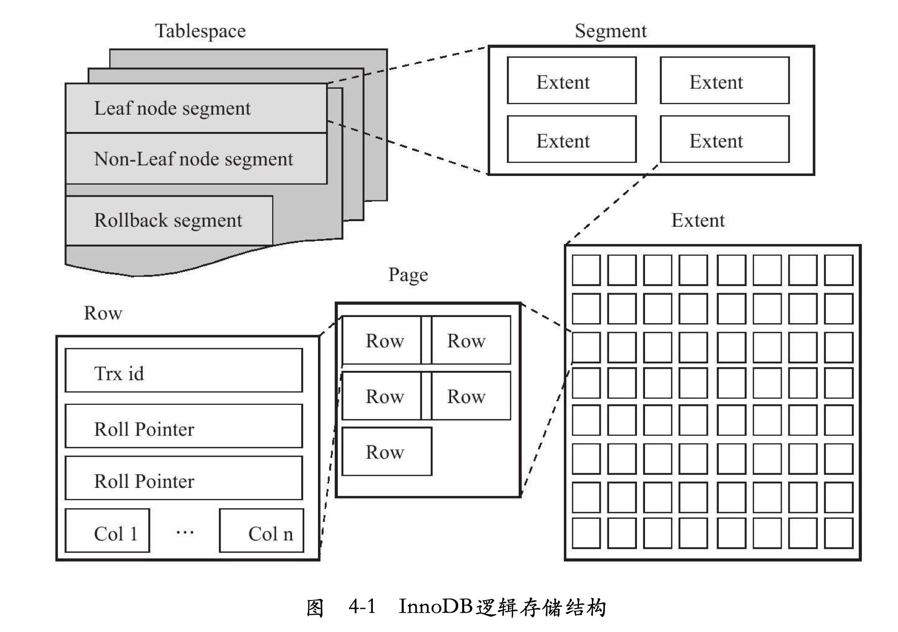

### 表空间(tablespace)

表空间可以看做是InnoDB存储引擎逻辑结构的最高层，所有的数据都存放在表空间中。默认情况下InnoDB存储引擎有一个共享表空间ibdata1，即所有数据都存放在这个表空间内。如果用户启用了参数innodb_file_per_table，则每张表内的数据可以单独放到一个表空间内。

如果启用了innodb_file_per_table的参数，需要注意的是每张表的表空间内存放的只是数据、索引和插入缓冲Bitmap页，其他类的数据，如回滚（undo）信息，插入缓冲索引页、系统事务信息，二次写缓冲（Double write buffer）等还是存放在原来的共享表空间内。 这同时也说明了另一个问题：即使在启用了参数innodb_file_per_table之后，共享表空间还是会不断地增加其大小。

### 段(segment)

表空间是由各个段组成的，常见的段有数据段、索引段、回滚段等。因InnoDB存储引擎表是索引组织的（index organized），因此数据即索引，索引即数据。那么数据段即为B+树的叶子节点（Leaf node segment），索引段即为B+树的非叶子节点（Non-leaf node segment）。

### 区(extent)

区是由连续页组成的空间，在任何情况下每个区的大小都为1MB。为了保证区中页的连续性，InnoDB存储引擎一次从磁盘申请4~5个区。在默认情况下，InnoDB存储引擎页的大小为16KB，即一个区中一共有64个连续的页。

InnoDB 1.0.x版本开始引入压缩页，即每个页的大小可以通过参数KEY_BLOCK_SIZE设置为2K、4K、8K，因此每个区对应页的数量就应该为512、256、128。

InnoDB1.2.x版本新增了参数innodb_page_size，通过该参数可以将默认页的大小设置为4K、8K，但是页中的数据库不是压缩。这时区中页的数量同样也为256、128。总之，不论页的大小怎么变化，区的大小总是为1M。

在用户启用了参数innodb_file_per_talbe后，创建的表默认大小是96KB。区中是64个连续的页，创建的表的大小至少是1MB才对啊？其实这是因为在每个段开始时，先用32个页大小的碎片页（fragment page）来存放数据，在使用完这些页之后才是64个连续页的申请。这样做的目的是，对于一些小表，或者是undo这类的段，可以在开始时申请较少的空间，节省磁盘容量的开销。

### 页(page)

同大多数数据库一样，InnoDB有页（Page）的概念（也可以称为块），页是InnoDB磁盘管理的最小单位。在InnoDB存储引擎中，默认每个页的大小为16KB。而从InnoDB1.2.x版本开始，可以通过参数innodb_page_size将页的大小设置为4K、8K、16K。若设置完成，则所有表中页的大小都为innodb_page_size，不可以对其再次进行修改。除非通过mysqldump导入和导出操作来产生新的库。

在InnoDB存储引擎中，常见的页类型有：

- 数据页（B-tree Node）
- undo页（undo Log Page）
- 系统页（System Page）
- 事务数据页（Transaction system Page）
- 插入缓冲位图页（Insert Buffer Bitmap）
- 插入缓冲空闲列表页（Insert Buffer Free List）
- 未压缩的二进制大对象页（uncompressed BLOB Page）
- 压缩的二进制大对象页（compressed BLOB Page）

### 行(row)

InnoDB存储引擎是面向行的（row-oriented），也就说数据是按行进行存放的。每个页存放的行记录也是有硬性定义的，最多允许存放16KB/2 - 200行的记录，即7992行记录。

## InnoDB 行记录格式

InnoDB存储引擎和大多数数据库一样，记录是以行的形式存储的。页中保存着表的一行行数据。在InnoDB1.0.x版本之前，InnoDB存储引擎提供了Compact和Redundant两种格式来存放行记录数据，这也是目前使用最多的一种格式。。Redundant格式是为兼容之前版本而保留的，如果阅读过InnoDB的源代码，用户会发现源代码中是用PHYSICAL RECORD（NEW STYLE）和PHYSICAL RECORD（OLD STYLE）来区分两种格式的。

在MySQL5.1版本中，默认设置为Compact行格式。用户可以通过命令`SHOW TABLE STATUS LIKE 'table_name'`来查看当前表使用的行格式，其中row_format属性表示当前所使用的行记录结构类型。

（这里我本地table的格式是Dynamic，后面会讲到）

```mysql
mysql> show table status like'user_tab_0%'\G;
*************************** 1. row ***************************
           Name: user_tab_0
         Engine: InnoDB
        Version: 10
     Row_format: Dynamic
           Rows: 964789
 Avg_row_length: 183
    Data_length: 176898048
Max_data_length: 0
   Index_length: 55230464
      Data_free: 6291456
 Auto_increment: NULL
    Create_time: 2022-04-14 15:10:56
    Update_time: 2022-12-29 15:56:07
     Check_time: NULL
      Collation: latin1_swedish_ci
       Checksum: NULL
 Create_options:
        Comment:
1 row in set (0.03 sec)
```

### Compact行记录格式

Compact行记录是在MySQL5.0中引入的，其设计目标是高效地存储数据。简单来说，一个页中存放的行数据越多，其性能就越高。


从上图可以观察到，Compact行记录格式的首部是一个非NULL变长字段长度列表，并且其是按照列的顺序逆序放置的，其长度为：

- 若列的长度小于255字节，用1字节表示；
- 若大于255个字节，用2字节表示。

变长字段的长度最大不可以超过2字节，这是因在MySQL数据库中VARCHAR类型的最大长度限制为65535。

变长字段之后的第二个部分是NULL标志位，该位指示了该行数据中是否有NULL值，有则用1表示。该部分所占的字节应该为1字节。

接下来的部分是记录头信息（recordheader），固定占用5字节（40位）

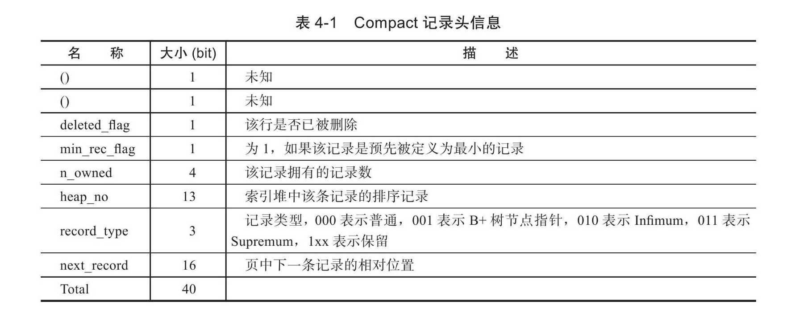

最后的部分就是实际存储每个列的数据。需要特别注意的是，NULL不占该部分任何空间，即NULL除了占有NULL标志位，实际存储不占有任何空间。另外有一点需要注意的是，每行数据除了用户定义的列外，还有两个隐藏列，事务ID列和回滚指针列，分别为6字节和7字节的大小。若InnoDB表没有定义主键，每行还会增加一个6字节的rowid列。

### Redundant行记录格式

Redundant是MySQL5.0版本之前InnoDB的行记录存储方式，MySQL5.0支持Redundant是为了兼容之前版本的页格式。


不同于Compact行记录格式，Redundant行记录格式的首部是一个字段长度偏移列表，同样是按照列的顺序逆序放置的。若列的长度小于255字节，用1字节表示；若大于255字节，用2字节表示。

第二个部分为记录头信息（record header），不同于Compact行记录格式，Redundant行记录格式的记录头占用6字节（48位），每位的含义见下表。从表中可以发现，n_fields值代表一行中列的数量，占用10位。同时这也很好地解释了为什么MySQL数据库一行支持最多的列为1023。另一个需要注意的值为1byte_offs_flags，该值定义了偏移列表占用1字节还是2字节。而最后的部分就是实际存储的每个列的数据了。

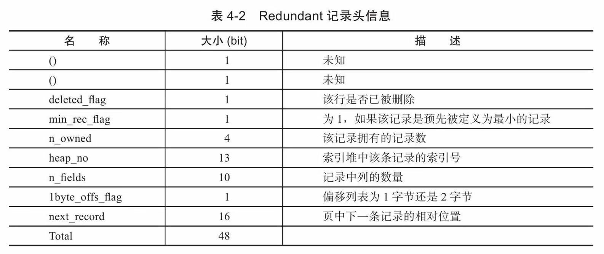

和Compact格式相比，Redundant格式对于null值的存储会有不同。

### 行溢出数据

InnoDB存储引擎可以将一条记录中的某些数据存储在真正的数据页面之外。一般认为BLOB、LOB这类的大对象列类型的存储会把数据存放在数据页面之外。但是，这个理解有点偏差，BLOB可以不将数据放在溢出页面，而且即便是VARCHAR列数据类型，依然有可能被存放为行溢出数据。

首先对VARCHAR数据类型进行研究。MySQL数据库的VARCHAR类型可以存放65535字节。但是InnoDB存储引擎并不支持65535长度的VARCHAR。这是因为还有别的开销，通过实际测试发现能存放VARCHAR类型的最大长度为65532。而且VARCHAR（N）中的N指的是字符的长度。而文档中说明VARCHAR类型最大支持65535，单位是字节。

而且需要注意的是，MySQL官方手册中定义的65535长度是指所有VARCHAR列的长度总和，如果列的长度总和超出这个长度，依然无法创建。

InnoDB存储引擎的页为16KB，即16384字节，怎么能存放65532字节呢？因此，在一般情况下，InnoDB存储引擎的数据都是存放在页类型为B-tree node中。但是当发生行溢出时，数据存放在页类型为Uncompress BLOB页中。

对于行溢出数据，其实只保存了VARCHAR（65532）的前768字节的前缀（prefix）数据，之后是偏移量，指向行溢出页，也就是前面用户看到的Uncompressed BLOB Page。

其存放采用图44的方式。

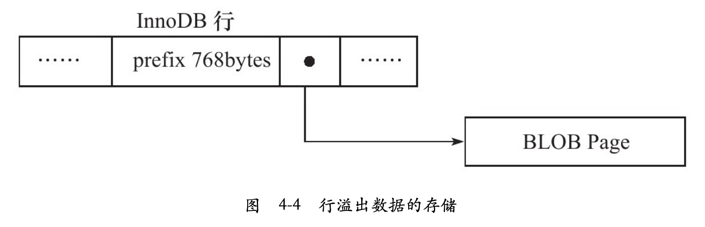

**那多长的VARCHAR是保存在单个数据页中的，从多长开始又会保存在BLOB页呢？**

可以这样进行思考：InnoDB存储引擎表是索引组织的，即B+Tree的结构，这样每个页中至少应该有两条行记录（否则失去了B+Tree的意义，变成链表了）。因此，如果页中只能存放下一条记录，那么InnoDB存储引擎会自动将行数据存放到溢出页中

如果可以在一个页中至少放入两行数据，那VARCHAR类型的行数据就不会存放到BLOB页中去。经过多次试验测试，发现这个阈值的长度为8098。

另一个问题是，对于TEXT或BLOB的数据类型，用户总是以为它们是存放在Uncompressed BLOB Page中的，其实这也是不准确的。是放在数据页中还是BLOB页中，和前面讨论的VARCHAR一样，至少保证一个页能存放两条记录。

因此在大多数的情况下BLOB的行数据还是会发生行溢出，实际数据保存在BLOB页中，数据页只保存数据的前768字节。

### Compressed 和 Dynamic行记录格式

InnoDB1.0.x版本开始引入了新的文件格式（file format，用户可以理解为新的页格式），以前支持的Compact和Redundant格式称为Antelope文件格式，新的文件格式称为Barracuda文件格式。Barracuda文件格式下拥有两种新的行记录格式：Compressed和Dynamic。

新的两种记录格式对于存放在BLOB中的数据采用了完全的行溢出的方式，如图45所示，在数据页中只存放20个字节的指针，实际的数据都存放在Off Page中，而之前的Compact和Redundant两种格式会存放768个前缀字节。

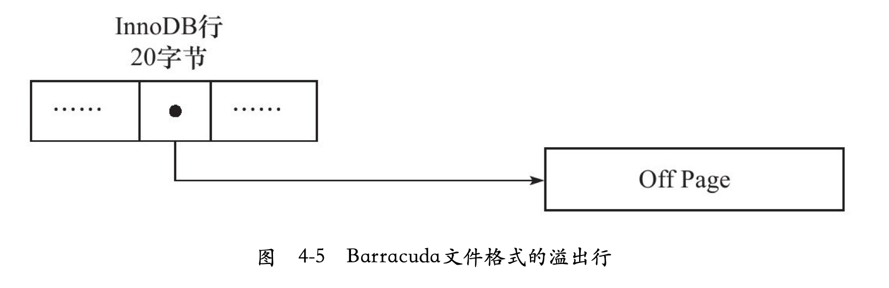

Compressed行记录格式的另一个功能就是，存储在其中的行数据会以zlib的算法进行压缩，因此对于BLOB、TEXT、VARCHAR这类大长度类型的数据能够进行非常有效的存储。

### CHAR的行结构存储

通常理解VARCHAR是存储变长长度的字符类型，CHAR是存储固定长度的字符类型。在行结构的内部的存储中可以发现每行的变长字段长度的列表都没有存储CHAR类型的长度。

从MySQL4.1版本开始，CHR（N）中的N指的是字符的长度，而不是之前版本的字节长度。也就说在不同的字符集下，CHAR类型列内部存储的可能不是定长的数据。

对于多字节的字符编码，CHAR类型不再代表固定长度的字符串了。例如，对于UTF8下CHAR（10）类型的列，其最小可以存储10字节的字符，而最大可以存储30字节的字符。因此，对于多字节字符编码的CHAR数据类型的存储，InnoDB存储引擎在内部将其视为变长字符类型。这也就意味着在变长长度列表中会记录CHAR数据类型的长度。

在InnoDB存储引擎内部对CHAR类型在多字节字符集类型的存储中，CHAR类型被明确视为了变长字符类型，对于未能占满长度的字符还是填充0x20。InnoDB存储引擎内部对字符的存储和我们用HEX函数看到的也是一致的。**因此可以认为在多字节字符集的情况下，CHAR和VARCHAR的实际行存储基本是没有区别的。**

## InnoDB数据页结构

页是InnoDB存储引擎管理数据库的最小磁盘单位。页类型为BtreeNode的页存放的即是表中行的实际数据了。

> 本书作者说明：InnoDB公司本身并没有详细介绍其页结构的实现，MySQL的官方手册中也基本没有提及InnoDB存储引擎页的内部结构。本节通过阅读源代码来了解InnoDB的页结构，此外结合了Peter对于InnoDB页结构的分析。Peter写这部分内容的时间很久远了，在其之后InnoDB引入了Compact格式，页结构已经有所改动，因此可能出现对页结构分析错误的情况，如有错误，希望可以指出。

InnoDB数据页由以下7个部分组成，如图4-6所示。

- File Header（文件头）
- Page Header（页头）
- Infimun和Supremum Records
- User Records（用户记录，即行记录）
- Free Space（空闲空间）
- Page Directory（页目录）
- File Trailer（文件结尾信息）

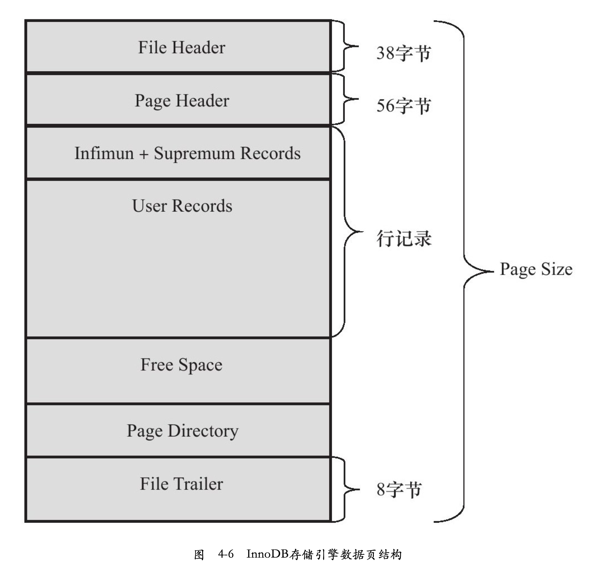

其中File Header、Page Header、File Trailer的大小是固定的，分别为38、56、8字节，这些空间用来标记该页的一些信息，如Checksum，数据页所在B+树索引的层数等。User Records、Free Space、Page Directory这些部分为实际的行记录存储空间，因此大小是动态的。在接下来的各小节中将具体分析各组成部分。

### File Header

FileHeader用来记录页的一些头信息，由表4-3中8个部分组成，共占用38字节。

| 名称                             | 大小（字节） | 说明                                                         |
| :------------------------------- | :----------- | :----------------------------------------------------------- |
| FIL_PAGE_SPACE_OR_CHKSUM         | 4            | 当 MySQL 为 MySQL4.0.14 之前的版本时，该值为 0。在之后的 MySQL版本中，该值代表页的checksum 值（一种新的 checksum 值) |
| FIL_PAGE_OFFSET                  | 4            | 表空间中页的偏移值。如果独立表空间a.ibd的大小为1GB，如果页的大小为 16KB，那么总共有65536个页。FIL PAGE OFFSET 表示该页在所有页中的位置。若此表空间的D为10，那么搜索页（10，1）就表示查找表a中的第二个页 |
| FIL_PAGE_PREV                    | 4            | 当前页的上一个页，B+Tree 特性决定了叶子节点必须是双向列表    |
| FIL_PAGE_NEXT                    | 4            | 当前页的下一个页，B+Tree 特性决定了叶子节点必须是双向列表    |
| FIL_PAGE_LSN                     | 8            | 该值代表页最后被修改的日志序列位置LSN（Log Sequence Number） |
| FIL_PAGE_TYPE                    | 2            | InnoDB 存储引擎页的类型。常见的类型见表 4-4。记住0x45BF，该值代表了存放的是数据页，即实际行记录的存储空间 |
| FIL_PAGE_FILE_FLUSH_LSN          | 8            | 该值仅在系统表空间的一个页中定义，代表文件至少被更新到了该 LSN值。对于独立表空间，该值都为 0 |
| FIL_PAGE_ARCH_LOG_NO_OR_SPACE ID | 4            | 从MySOL 41开始，该值代表页属于哪个表空间                     |

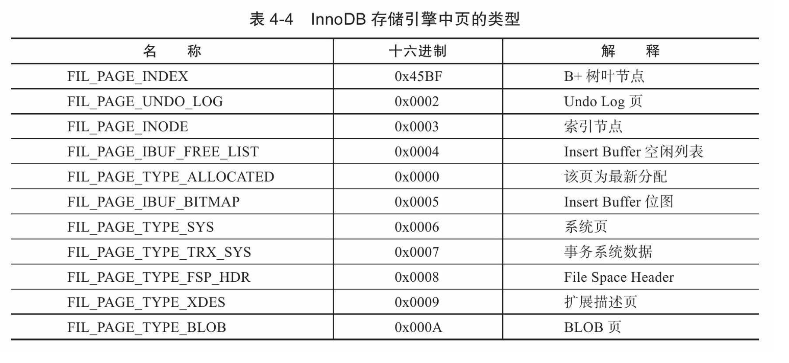

### Page Header

接着FileHeader部分的是PageHeader，该部分用来记录数据页的状态信息，由14个部分组成，共占用56字节。

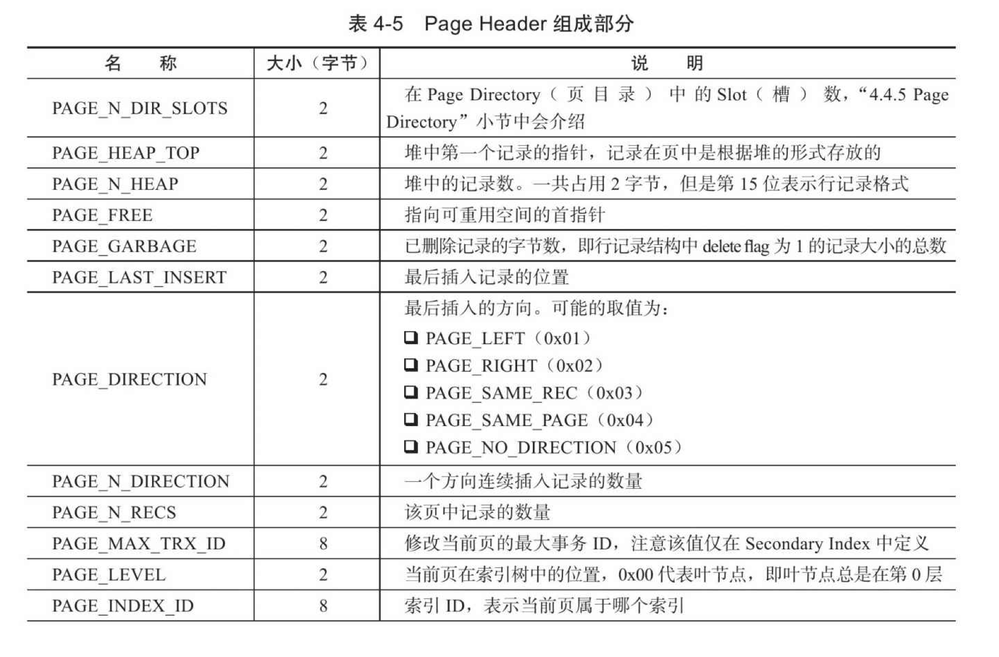

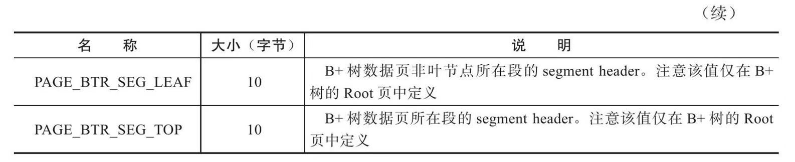

### Infimum和Supremum Record

在InnoDB存储引擎中，每个数据页中有两个虚拟的行记录，用来限定记录的边界。Infimum记录是比该页中任何主键值都要小的值，Supremum指比任何可能大的值还要大的值。这两个值在页创建时被建立，并且在任何情况下不会被删除。在Compact行格式和Redundant行格式下，两者占用的字节数各不相同。

**Infinum和Supremum Record:**

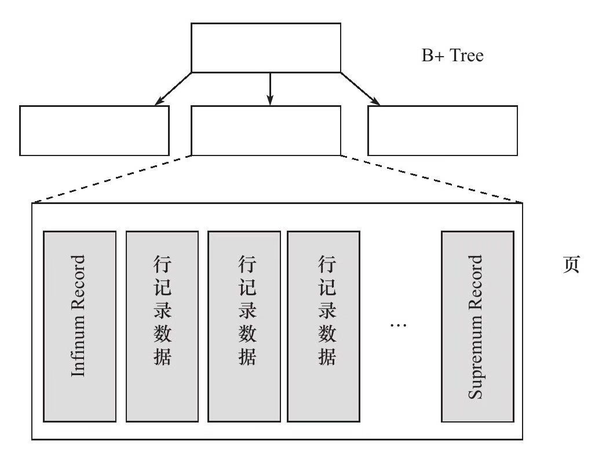

### User Record和Free Space

User Record就是实际存储行记录的内容。再次强调，InnoDB存储引擎表总是B+树索引组织的。

Free Space是空闲空间，同样也是个链表数据结构。在一条记录被删除后，该空间会被加入到空闲链表中。

### Page Directory

Page Directory（页目录）中存放了记录的相对位置（注意，这里存放的是页相对位置，而不是偏移量），有些时候这些记录指针称为Slots（槽）或目录槽（Directory Slots）。与其他数据库系统不同的是，在InnoDB中并不是每个记录拥有一个槽，InnoDB存储引擎的槽是一个稀疏目录（sparse directory），即一个槽中可能包含多个记录。伪记录Infimum的n_owned（slot中记录的数量）值总是为1，记录Supremum的n_owned的取值范围为[1，8]，其他用户记录n_owned的取值范围为[4，8]。当记录被插入或删除时需要对槽进行分裂或平衡的维护操作。

由于在InnoDB存储引擎中Page Direcotry是稀疏目录，二叉查找的结果只是一个粗略的结果，因此InnoDB存储引擎必须通过recorder header中的next_record来继续查找相关记录。同时，Page Directory很好地解释了recorder header中的n_owned值的含义，因为这些记录并不包括在Page Directory中。

B+树索引本身并不能找到具体的一条记录，能找到只是该记录所在的页。数据库把页载入到内存，然后通过Page Directory再进行二叉查找。只不过二叉查找的时间复杂度很低，同时在内存中的查找很快，因此通常忽略这部分查找所用的时间。

#### Page Directory生成过程

参考博客：https://juejin.cn/post/6974225353371975693

`Page Directory` 的生成过程如下：

- 初始情况下一个数据页里只有`Infimum`和`Supremum`两条记录，它们分属于两个组。Page Directory 中就有两个槽，分别指向这两条记录，且这两条记录的 `n_owned` 都等于 `1`。
- 之后每插入一条记录，都会从页目录中找到`主键值比本记录的主键值大并且差值最小的槽`，然后把该槽对应的记录的 `n_owned` 值加`1`，表示本组内又添加了一条记录，直到该组中的记录数等于`8条`。
- 在一个组中的记录数等于`8条`后再插入一条记录时，会将组中的记录拆分成两个组，一个组中`4条`记录，另一个`5条`记录。这个过程会在页目录中新增一个槽来记录这个新增分组中最大的那条记录的相对位置。
- 当记录被删除时，对应槽的最大记录的 n_owned 会减 1，当 n_owned 小于 4 时，各分组就会平衡一下，总之要满足上面的规定。

其实正常情况下，按照主键自增长新增记录，可能每次都是添加到 `Supremum` 所在的组，直到它的 `n_owned` 等于`8`时，再新增记录时就会分成两个组，一个组`4条`记录，一个组`5条`记录。还会新增一个槽，指向`4条`记录分组中的最大记录，并且这个最大记录的`n_owned`会改为`4`，`Supremum` 的`n_owned`就会改为`5`。

Page Directory 中槽（Slot）的数量就会记录到 `Page Header` 中的 `PAGE_N_DIR_SLOTS`。

可以通过下图来理解下 Page Directory 中槽（Slot）和分组中最大记录的关系。

- 首先，Slot0 指向 Infimum 记录，因为最小记录所在的分组只能有一条记录，它的 `n_owned=1`.
- 接着 Slot1、Slot2、Slot3 分别指向各自分组中的最大记录，且 `n_owned=4`，可以想象其实就是 `Supremum` 组分组而来的。
- 最后，Slot4 指向 `Supremum`，这是最大记录的组，经过分组后，它的 `n_owned=5`。

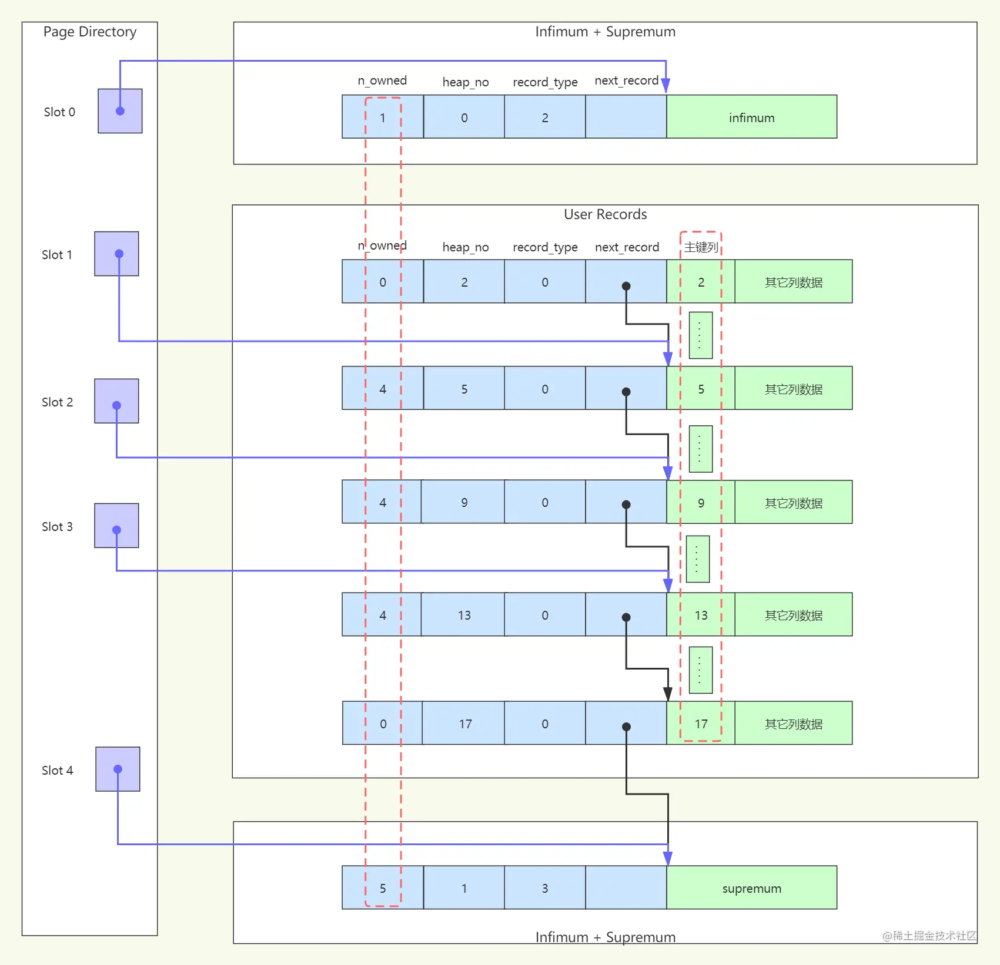

可以看到，页中的数据经过分组后在 Page Directory 中就形成了一个目录槽，每个槽就指向了分组中的最大记录，最大记录的记录头中的 `n_owned` 就记录了这个组中的记录数。

有了目录槽之后，InnoDB就会利用二叉查找迅速确定记录所在的槽，并找到该槽所在分组中主键值最小的那条记录，再通过最小记录的 next_record 遍历记录，就能快速定位到匹配的那条记录了。

二叉查找的时间复杂度很低，同时在内存中的查找很快，因此通常会忽略这部分查找所用的时间。

### File Trailer

为了检测页是否已经完整地写入磁盘（如可能发生的写入过程中磁盘损坏、机器关机等），InnoDB存储引擎的页中设置了File Trailer部分。

File Trailer只有一个FIL_PAGE_END_LSN部分，占用8字节。前4字节代表该页的checksum值，最后4字节和File Header中的FIL_PAGE_LSN相同。将这两个值与File Header中的FIL_PAGE_SPACE_OR_CHKSUM和FIL_PAGE_LSN值进行比较，看是否一致（checksum的比较需要通过InnoDB的checksum函数来进行比较，不是简单的等值比较），以此来保证页的完整性（not corrupted）。

在默认配置下，InnoDB存储引擎每次从磁盘读取一个页就会检测该页的完整性，即页是否发生Corrupt，这就是通过File Trailer部分进行检测，而该部分的检测会有一定的开销。用户可以通过参数innodb_checksums来开启或关闭对这个页完整性的检查。

MySQL 5.6.6版本开始新增了参数innodb_checksum_algorithm，该参数用来控制检测checksum函数的算法，默认值为crc32，可设置的值有：innodb、crc32、none、strict_innodb、strict_crc32、strict_none。

innodb为兼容之前版本InnoDB页的checksum检测方式，crc32为MySQL 5.6.6版本引进的新的checksum算法，该算法较之前的innodb有着较高的性能。但是若表中所有页的checksum值都以strict算法保存，那么低版本的MySQL数据库将不能读取这些页。none表示不对页启用checksum检查。strict_*正如其名，表示严格地按照设置的checksum算法进行页的检测。因此若低版本MySQL数据库升级到MySQL 5.6.6或之后的版本，启用strict_crc32将导致不能读取表中的页。启用strict_crc32方式是最快的方式，因为其不再对innodb和crc32算法进行两次检测。故推荐使用该设置。若数据库从低版本升级而来，则需要进行mysql_upgrade操作。

## Named File Formats机制

随着InnoDB存储引擎的发展，新的页数据结构有时用来支持新的功能特性。比如前面提到的InnoDB 1.0.x版本提供了新的页数据结构来支持表压缩功能，完全的溢出（Off page）大变长字符类型字段的存储。这些新的页数据结构和之前版本的页并不兼容，因此从InnoDB 1.0.x版本开始，InnoDB存储引通过Named File Formats机制来解决不同版本下页结构兼容性的问题。

InnoDB存储引擎将1.0.x版本之前的文件格式（file format）定义为Antelope，将这个版本支持的文件格式定义为Barracuda。新的文件格式总是包含于之前的版本的页格式。

> Barracuda文件格式和Antelope文件格式之间的关系:

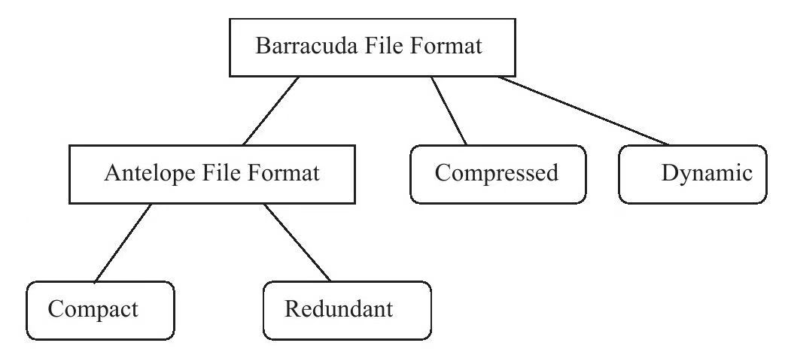

参数innodb_file_format用来指定文件格式:

```mysql
mysql> select@@version\G;
*************************** 1. row ***************************
@@version: 5.7.30
1 row in set (0.00 sec)

mysql> show variables like 'innodb_version'\G;
*************************** 1. row ***************************
Variable_name: innodb_version
        Value: 5.7.30
1 row in set (0.05 sec)

mysql> show variables like 'innodb_file_format'\G;
*************************** 1. row ***************************
Variable_name: innodb_file_format
        Value: Barracuda
1 row in set (0.03 sec)
```

## 约束(constraint)

### 数据完整性

关系型数据库系统和文件系统的一个不同点是，关系数据库本身能保证存储数据的完整性，不需要应用程序的控制，而文件系统一般需要在程序端进行控制。当前几乎所有的关系型数据库都提供了约束（constraint）机制，该机制提供了一条强大而简易的途径来保证数据库中数据的完整性。

数据完整性有一下三种形式：

1. **实体完整性保证表中有一个主键。**在InnoDB存储引擎表中，用户可以通过定义Primary Key或Unique Key约束来保证实体的完整性。用户还可以通过编写一个触发器来保证数据完整性。

2. **域完整性保证数据每列的值满足特定的条件。**在InnoDB存储引擎表中，域完整性可以通过以下几种途径来保证：

   1. 选择合适的数据类型确保一个数据值满足特定条件。
   2. 外键（Foreign Key）约束。
   3. 编写触发器。
   4. 还可以考虑用DEFAULT约束作为强制域完整性的一个方面。

3. **参照完整性保证两张表之间的关系。**InnoDB存储引擎支持外键，因此允许用户定义外键以强制参照完整性，也可以通过编写触发器以强制执行。

对于InnoDB存储引擎本身而言，提供了以下几种约束：

1. Primary Key
2. Unique Key
3. Foreign Key
4. Default
5. NOT NULL

### 约束的创建和查找

约束的创建可以采用以下两种方式：

1. 表建立时就进行约束定义
2. 利用ALTER TABLE命令来进行创建约束

对Unique Key（唯一索引）的约束，用户还可以通过命令CREATE UNIQUE INDEX来建立。对于主键约束而言，其默认约束名为PRIMARY。而对于Unique Key约束而言，默认约束名和列名一样，当然也可以人为指定Unique Key约束的名字。Foreign Key约束似乎会有一个比较神秘的默认名称。

通过information_schema架构下的表TABLE_CONSTRAINTS来查看当前MySQL库下所有的约束信息。

```mysql
mysql> select constraint_name, constraint_type from information_schema.TABLE_CONSTRAINTS where TABLE_SCHEMA='minimarket_user_db' and TABLE_NAME='user_tab_0'\G;
*************************** 1. row ***************************
constraint_name: PRIMARY
constraint_type: PRIMARY KEY
*************************** 2. row ***************************
constraint_name: name
constraint_type: UNIQUE
2 rows in set (0.00 sec)
```

对于Foreign Key的约束的命名，用户还可以通过查看表REFERENTIAL_CONSTRAINTS:

```mysql
mysql> select * from information_schema.REFERENTIAL_CONSTRAINTS\G;
*************************** 1. row ***************************
       CONSTRAINT_CATALOG: def
        CONSTRAINT_SCHEMA: mysite
          CONSTRAINT_NAME: group_id_refs_id_f4b32aac
UNIQUE_CONSTRAINT_CATALOG: def
 UNIQUE_CONSTRAINT_SCHEMA: mysite
   UNIQUE_CONSTRAINT_NAME: PRIMARY
             MATCH_OPTION: NONE
              UPDATE_RULE: RESTRICT
              DELETE_RULE: RESTRICT
               TABLE_NAME: auth_group_permissions
    REFERENCED_TABLE_NAME: auth_group
```

### 约束和索引的区别

当用户创建了一个唯一索引就创建了一个唯一的约束。但是约束和索引的概念还是有所不同的，约束更是一个逻辑的概念，用来保证数据的完整性，而索引是一个数据结构，既有逻辑上的概念，在数据库中还代表着物理存储的方式。

### 对错误数据的约束

在某些默认设置下，MySQL数据库允许非法的或不正确的数据的插入或更新，又或者可以在数据库内部将其转化为一个合法的值，如向NOT NULL的字段插入一个NULL值，MySQL数据库会将其更改为0再进行插入，因此数据库本身没有对数据的正确性进行约束。

如果用户想通过约束对于数据库非法数据的插入或更新，即MySQL数据库提示报错而不是警告，那么用户必须设置参数sql_mode，用来严格审核输入的参数，例如：

```mysql
set sql_mode='STRICT_TRANS_TABLES';
```

STRICT_TRANS_TABLES会对输入值的合法性进行了约束，而且针对不同的错误，提示的错误内容也都不同。

参数sql_mode可设的值有很多，具体可参考MySQL官方手册。

### ENUM和SET约束

MySQL数据库不支持传统的CHECK约束，但是通过ENUM和SET类型可以解决部分这样的约束需求。例如表上有一个性别类型，规定域的范围只能是male或female，在这种情况下用户可以通过ENUM类型来进行约束。

### 触发器与约束

触发器的作用是在执行INSERT、DELETE和UPDATE命令之前或之后自动调用SQL命令或存储过程。

创建触发器的命令是CREATE TRIGGER，只有具备Super权限的MySQL数据库用户才可以执行这条命令：

```mysql
CREATE
[DEFINER={user|CURRENT_USER}]
TRIGGER trigger_name BEFORE|AFTER INSERT|UPDATE|DELETE
ON tbl_name EACH ROW trigger_stmt
```

最多可以为一个表建立6个触发器，即分别为INSERT、UPDATE、DELETE的BEFORE和AFTER各定义一个。BEFORE和AFTER代表触发器发生的时间，表示是在每行操作的之前发生还是之后发生。当前MySQL数据库只支持FOR EACH ROW的触发方式，即按每行记录进行触发。

通过触发器，用户可以实现MySQL数据库本身并不支持的一些特性，如对于传统CHECK约束的支持，物化视图、高级复制、审计等特性。这里先关注触发器对于约束的支持。

### 外键约束

外键用来保证参照完整性，MySQL数据库的MyISAM存储引擎本身并不支持外键，对于外键的定义只是起到一个注释的作用。而InnoDB存储引擎则完整支持外键约束。

外键的定义如下：

```mysql
[CONSTRAINT[symbol]]FOREIGN KEY
[index_name](index_col_name,...)
REFERENCES tbl_name(index_col_name,...)
[ON DELETE reference_option]
[ON UPDATE reference_option]
reference_option:
RESTRICT|CASCADE|SET NULL|NO ACTION
```

用户可以在执行CREATE TABLE时就添加外键，也可以在表创建后通过ALTER TABLE命令来添加。

一般来说，称被引用的表为父表，引用的表称为子表。外键定义时的ON DELETE和ON UPDATE表示在对父表进行DELETE和UPDATE操作时，对子表所做的操作。

可定义的子表操作有：

- CASCADE: 当父表发生DELETE或UPDATE操作时，对相应的子表中的数据也进行DELETE或UPDATE操作
- SET NULL: 当父表发生DELETE或UPDATE操作时，相应的子表中的数据被更新为NULL值，但是子表中相对应的列必须允许为NULL值
- NO ACTION: 当父表发生DELETE或UPDATE操作时，抛出错误，不允许这类操作发生。
- RESTRICT: 当父表发生DELETE或UPDATE操作时，抛出错误，不允许这类操作发生。如果定义外键时没有指定ON DELETE或ON UPDATE，RESTRICT就是默认的外键设置。

在其他数据库中，如Oracle数据库，有一种称为延时检查（deferred check）的外键约束，即检查在SQL语句运行完成后再进行。而目前MySQL数据库的外键约束都是即时检查（immediate check），因此从上面的定义可以看出，在MySQL数据库中NO ACTION和RESTRICT的功能是相同的。

在Oracle数据库中，对于建立外键的列，一定不要忘记给这个列加上一个索引。而InnoDB存储引擎在外键建立时会自动地对该列加一个索引，这和Microsoft SQL Server数据库的做法一样。因此可以很好地避免外键列上无索引而导致的死锁问题的产生。

对于参照完整性约束，外键能起到一个非常好的作用。但是对于数据的导入操作时，外键往往导致在外键约束的检查上花费大量时间。因为MySQL数据库的外键是即时检查的，所以对导入的每一行都会进行外键检查。但是用户可以在导入过程中忽视外键的检查，如：

```mysql
SET foreign_key_checks=0;
SET foreign_key_checks=1;
```

## 视图(View)

在MySQL数据库中，视图（View）是一个命名的虚表，它由一个SQL查询来定义，可以当做表使用。与持久表（permanent table）不同的是，视图中的数据没有实际的物理存储。

### 视图的作用

视图在数据库中发挥着重要的作用。视图的主要用途之一是被用做一个抽象装置，特别是对于一些应用程序，程序本身不需要关心基表（base table）的结构，只需要按照视图定义来取数据或更新数据，因此，视图同时在一定程度上起到一个安全层的作用。

MySQL数据库从5.0版本开始支持视图，创建视图的语法如下：

```mysql
CREATE
[OR REPLACE]
[ALGORITHM={UNDEFINED|MERGE|TEMPTABLE}]
[DEFINER={user|CURRENT_USER}]
[SQL SECURITY{DEFINER|INVOKER}]
VIEW view_name[(column_list)]
AS select_statement
[WITH|CASCADED|LOCAL|CHECK OPTION]
```

虽然视图是基于基表的一个虚拟表，但是用户可以对某些视图进行更新操作，其本质就是通过视图的定义来更新基本表。一般称可以进行更新操作的视图为可更新视图（updatable view）。视图定义中的WITH CHECK OPTION就是针对于可更新的视图的，即更新的值是否需要检查。

SHOW TABLES命令把表t和视图v_t都显示出来了。若用户只想查看当前架构下的基表，可以通过information_schema架构下的TABLE表来查询，并搜索表类型为BASE TABLE的表，SQL语句如下：

```mysql
SELECT * FROM information_schema.TABLES
WHERE table_type='BASE TABLE'
AND table_schema=database()\G;
```

要想查看视图的一些元数据（meta data），可以访问information_schema架构下的VIEWS表，该表给出了视图的详细信息，包括视图定义者（definer）、定义内容、是否是可更新视图、字符集等。

```mysql
SELECT * FROM 
information_schema.VIEWS
WHERE table_schema=database()\G;
```

### 物化视图

Oracle数据库支持物化视图——该视图不是基于基表的虚表，而是根据基表实际存在的实表，即物化视图的数据存储在非易失的存储设备上。物化视图可以用于预先计算并保存多表的链接（JOIN）或聚集（GROUP BY）等耗时较多的SQL操作结果。这样，在执行复杂查询时，就可以避免进行这些耗时的操作，从而快速得到结果。物化视图的好处是对于一些复杂的统计类查询能直接查出结果。在Microsoft SQL Server数据库中，称这种视图为索引视图。

在Oracle数据库中，物化视图的创建方式包括以下两种：

- BUILD IMMEDIATE: 默认的创建方式，在创建物化视图的时候就生成数据
- BUILD DEFERRED: 在创建物化视图时不生成数据，以后根据需要再生成数据。

查询重写是指当对物化视图的基表进行查询时，数据库会自动判断能否通过查询物化视图来直接得到最终的结果，如果可以，则避免了聚集或连接等这类较为复杂的SQL操作，直接从已经计算好的物化视图中得到所需的数据。

物化视图的刷新是指当基表发生了DML操作后，物化视图何时采用哪种方式和基表进行同步。

刷新的模式有两种：

- ON DEMAND: 物化视图在用户需要的时候进行刷新
- ON COMMIT: 物化视图在对基表的DML操作提交的同时进行刷新

而刷新的方法有四种：

- FAST: 增量刷新，只刷新自上次刷新以后进行的修改。
- COMPLETE: 对整个物化视图进行完全的刷新。
- FORCE: 数据库在刷新时会去判断是否可以进行快速刷新，如果可以，则采用FAST方式，否则采用COMPLETE的方式。
- NEVER: 物化视图不进行任何刷新。

**MySQL数据库本身并不支持物化视图**，换句话说，MySQL数据库中的视图总是虚拟的。但是用户可以通过一些机制来实现物化视图的功能。

例如要创建一个ON DEMAND的物化视图还是比较简单的，用户只需定时把数据导入到另一张表。

如果要实现ON COMMIT的物化视图，就不像上面这么简单了。在Oracle数据库中是通过物化视图日志来实现的，很显然MySQL数据库没有这个日志，不过通过触发器同样可以达到这个目的。

通过触发器，在MySQL数据库中实现了类似物化视图的功能。但是MySQL数据库本身并不支持物化视图，因此对于物化视图支持的查询重写（Query Rewrite）功能就显得无能为力，用户只能在应用程序端做一些控制。

## 分区表

### 分区概述

分区功能并不是在存储引擎层完成的，因此不是只有InnoDB存储引擎支持分区，常见的存储引擎MyISAM、NDB等都支持。但也并不是所有的存储引擎都支持，如CSV、FEDORATED、MERGE等就不支持。

MySQL数据库在5.1版本时添加了对分区的支持。分区的过程是将一个表或索引分解为多个更小、更可管理的部分。就访问数据库的应用而言，从逻辑上讲，只有一个表或一个索引，但是在物理上这个表或索引可能由数十个物理分区组成。每个分区都是独立的对象，可以独自处理，也可以作为一个更大对象的一部分进行处理。

MySQL数据库支持的分区类型为水平分区，并不支持垂直分区。

> 水平分区，指将同一表中不同行的记录分配到不同的物理文件中。
>
> 垂直分区，指将同一表中不同列的记录分配到不同的物理文件中。

此外，MySQL数据库的分区是**局部分区索引**，一个分区中既存放了数据又存放了索引。而全局分区是指，数据存放在各个分区中，但是所有数据的索引放在一个对象中。目前，**MySQL数据库还不支持全局分区**。

```mysql
mysql> show variables like'%partition%'\G;
Empty set (0.09 sec)
```

也可以通过show plugins来查看：

```mysql
mysql> show plugins\G;
*************************** 44. row ***************************
   Name: partition
 Status: ACTIVE
   Type: STORAGE ENGINE
Library: NULL
License: GPL
```

当前MySQL数据库支持以下几种类型的分区。

- RANGE分区：行数据基于属于一个给定连续区间的列值被放入分区。MySQL5.5开始支持RANGE COLUMNS的分区。
- LIST分区：和RANGE分区类型，只是LIST分区面向的是离散的值。MySQL5.5开始支持LIST COLUMNS的分区。
- HASH分区：根据用户自定义的表达式的返回值来进行分区，返回值不能为负数。
- KEY分区：根据MySQL数据库提供的哈希函数来进行分区。

不论创建何种类型的分区，如果表中存在主键或唯一索引时，分区列必须是唯一索引的一个组成部分。

### 分区类型

#### 1 RANGE分区

下面的CREATE TABLE语句创建了一个id列的区间分区表。当id小于10时，数据插入p0分区。当id大于等于10小于20时，数据插入p1分区。

```mysql
CREATE TABLE t(
id INT
)
PARTITION BY RANGE(id)(
    PARTITION p0 VALUES LESS THAN(10),
    PARTITION p1 VALUES LESS THAN(20)
);
```

查看表在磁盘上的物理文件，启用分区之后，表不再由一个ibd文件组成了，而是由建立分区时的各个分区ibd文件组成，例如t#P#p0.ibd，t#P#p1.ibd。

可以通过查询information_schema架构下的PARTITIONS表来查看每个分区的具体信息：

```mysql
mysql> SELECT * FROM information_schema.PARTITIONS
    -> WHERE table_schema='test' AND table_name='t'\G;
*************************** 1. row ***************************
                TABLE_CATALOG: def
                 TABLE_SCHEMA: test
                   TABLE_NAME: t
               PARTITION_NAME: p0
            SUBPARTITION_NAME: NULL
   PARTITION_ORDINAL_POSITION: 1
SUBPARTITION_ORDINAL_POSITION: NULL
             PARTITION_METHOD: RANGE
          SUBPARTITION_METHOD: NULL
         PARTITION_EXPRESSION: id
      SUBPARTITION_EXPRESSION: NULL
        PARTITION_DESCRIPTION: 10
                   TABLE_ROWS: 0
               AVG_ROW_LENGTH: 0
                  DATA_LENGTH: 16384
              MAX_DATA_LENGTH: NULL
                 INDEX_LENGTH: 0
                    DATA_FREE: 0
                  CREATE_TIME: 2023-01-04 13:38:16
                  UPDATE_TIME: NULL
                   CHECK_TIME: NULL
                     CHECKSUM: NULL
            PARTITION_COMMENT:
                    NODEGROUP: default
              TABLESPACE_NAME: NULL
*************************** 2. row ***************************
                TABLE_CATALOG: def
                 TABLE_SCHEMA: test
                   TABLE_NAME: t
               PARTITION_NAME: p1
            SUBPARTITION_NAME: NULL
   PARTITION_ORDINAL_POSITION: 2
SUBPARTITION_ORDINAL_POSITION: NULL
             PARTITION_METHOD: RANGE
          SUBPARTITION_METHOD: NULL
         PARTITION_EXPRESSION: id
      SUBPARTITION_EXPRESSION: NULL
        PARTITION_DESCRIPTION: 20
                   TABLE_ROWS: 0
               AVG_ROW_LENGTH: 0
                  DATA_LENGTH: 16384
              MAX_DATA_LENGTH: NULL
                 INDEX_LENGTH: 0
                    DATA_FREE: 0
                  CREATE_TIME: 2023-01-04 13:38:16
                  UPDATE_TIME: NULL
                   CHECK_TIME: NULL
                     CHECKSUM: NULL
            PARTITION_COMMENT:
                    NODEGROUP: default
              TABLESPACE_NAME: NULL
2 rows in set (0.06 sec)
```

由于我们定义了分区，因此对于插入的值应该严格遵守分区的定义，当插入一个不在分区中定义的值时，MySQL数据库会抛出一个异常。我们向表t中插入30这个值，就会报分区错误。

```mysql
mysql> insert into t select 30;
ERROR 1526 (HY000): Table has no partition for value 30
```

对于上述问题，我们可以对分区添加一个MAXVALUE值的分区。MAXVALUE可以理解为正无穷，因此所有大于等于20且小于MAXVALUE的值别放入p2分区。

```mysql
mysql> alter table t
    -> add PARTITION(
    -> partition p2 values less than maxvalue);
Query OK, 0 rows affected (0.30 sec)
Records: 0  Duplicates: 0  Warnings: 0

mysql> insert into t select 30;
Query OK, 1 row affected (0.01 sec)
Records: 1  Duplicates: 0  Warnings: 0
```

#### 2 LIST分区

LIST分区和RANGE分区非常相似，只是分区列的值是离散的，而非连续的。如：

```mysql
mysql> create table t2(
    ->     a int,
    ->     b int
    -> ) partition by list(b)(
    -> partition p0 values in(1,3,5,7,9),
    -> partition p1 values in (0,2,4,6,8)
    -> );
Query OK, 0 rows affected (0.05 sec)
```

LIST分区使用VALUES IN。因为每个分区的值是离散的，因此只能定义值。

如果插入的值不在分区的定义中，MySQL数据库同样会抛出异常。

```mysql
mysql> insert into t2 select 1,10;
ERROR 1526 (HY000): Table has no partition for value 10
```

在用INSERT插入多个行数据的过程中遇到分区未定义的值时，MyISAM和InnoDB存储引擎的处理完全不同。MyISAM引擎会将之前的行数据都插入，但之后的数据不会被插入。而InnoDB存储引擎将其视为一个事务，因此没有任何数据插入。在使用分区时，也需要对不同存储引擎支持的事务特性进行考虑。

#### 3 HASH分区

HASH分区的目的是将数据均匀地分布到预先定义的各个分区中，保证各分区的数据数量大致都是一样的。在RANGE和LIST分区中，必须明确指定一个给定的列值或列值集合应该保存在哪个分区中；而在HASH分区中，MySQL自动完成这些工作，用户所要做的只是基于将要进行哈希分区的列值指定一个列值或表达式，以及指定被分区的表将要被分割成的分区数量。

要使用HASH分区来分割一个表，要在CREATE TABLE语句上添加一个“PARTITION BY HASH（expr）”子句，其中“expr”是一个返回一个整数的表达式。它可以仅仅是字段类型为MySQL整型的列名。此外，用户很可能需要在后面再添加一个“PARTITIONS num”子句，其中num是一个非负的整数，它表示表将要被分割成分区的数量。如果没有包括一个PARTITIONS子句，那么分区的数量将默认为1。

```mysql
mysql> create table t_hash(
    ->     a int,
    ->     b datetime
    -> )
    -> partition by hash(year(b))
    -> partitions 4;
Query OK, 0 rows affected (0.06 sec)
```

```mysql
mysql> insert into t_hash select 1, '2020-4-1';
Query OK, 1 row affected (0.01 sec)
Records: 1  Duplicates: 0  Warnings: 0

mysql> select table_name,partition_name,table_rows
    -> from information_schema.PARTITIONS
    -> where table_schema='test' and table_name='t_hash'\G;
*************************** 1. row ***************************
    table_name: t_hash
partition_name: p0
    table_rows: 1
*************************** 2. row ***************************
    table_name: t_hash
partition_name: p1
    table_rows: 0
*************************** 3. row ***************************
    table_name: t_hash
partition_name: p2
    table_rows: 0
*************************** 4. row ***************************
    table_name: t_hash
partition_name: p3
    table_rows: 0
4 rows in set (0.01 sec)
```

2020 mod 4 = 0, 因此可以看到p0分区有一条记录。

MySQL数据库还支持一种称为LINEAR HASH的分区，它使用一个更加复杂的算法来确定新行插入到已经分区的表中的位置。它的语法和HASH分区的语法相似，只是将关键字HASH改为LINEAR HASH。

LINEAR HASH分区的优点在于，增加、删除、合并和拆分分区将变得更加快捷，这有利于处理含有大量数据的表。它的缺点在于，与使用HASH分区得到的数据分布相比，各个分区间数据的分布可能不大均衡。

#### 4 KEY分区

KEY分区和HASH分区相似，不同之处在于HASH分区使用用户定义的函数进行分区，KEY分区使用MySQL数据库提供的函数进行分区。对于NDB Cluster引擎，MySQL数据库使用MD5函数来分区；对于其他存储引擎，MySQL数据库使用其内部的哈希函数，这些函数基于与PASSWORD()一样的运算法则。

在KEY分区中使用关键字LINEAR和在HASH分区中使用具有同样的效果，分区的编号是通过2的幂（powers-of-two）算法得到的，而不是通过模数算法。

#### 5 COLUMNS分区

在前面介绍的RANGE、LIST、HASH和KEY这四种分区中，分区的条件是：数据必须是整型（interger），如果不是整型，那应该需要通过函数将其转化为整型，如YEAR()，TO_DAYS()，MONTH()等函数。MySQL5.5版本开始支持COLUMNS分区，可视为RANGE分区和LIST分区的一种进化。COLUMNS分区可以直接使用非整型的数据进行分区，分区根据类型直接比较而得，不需要转化为整型。此外，RANGECOLUMNS分区可以对多个列的值进行分区。

COLUMNS分区支持以下的数据类型：

- 所有的整型类型，如INT、SMALLINT、TINYINT、BIGINT。FLOAT和DECIMAL则不予支持。
- 日期类型，如DATE和DATETIME。其余的日期类型不予支持。
- 字符串类型，如CHAR、VARCHAR、BINARY和VARBINARY。BLOB和TEXT类型不予支持。

MySQL5.5开始支持COLUMNS分区，对于之前的RANGE和LIST分区，用户可以用RANGE COLUMNS和LIST COLUMNS分区进行很好的代替。

### 子分区(subpartitioning)

子分区（subpartitioning）是在分区的基础上再进行分区，有时也称这种分区为复合分区（composite partitioning）。MySQL数据库允许在RANGE和LIST的分区上再进行HASH或KEY的子分区。

子分区的建立需要注意以下几个问题：

- 每个子分区的数量必须相同。
- 要在一个分区表的任何分区上使用SUBPARTITION来明确定义任何子分区，就必须定义所有的子分区。
- 每个SUBPARTITION子句必须包括子分区的一个名字。
- 子分区的名字必须是唯一的。

### 分区中的NULL值

MySQL数据库允许对NULL值做分区，但是处理的方法与其他数据库可能完全不同。MYSQL数据库的分区总是视NULL值视小于任何的一个非NULL值，这和MySQL数据库中处理NULL值的ORDER BY操作是一样的。因此对于不同的分区类型，MySQL数据库对于NULL值的处理也是各不相同。

- 对于RANGE分区，如果向分区列插入了NULL值，则MySQL数据库会将该值放入最左边的分区。
- 在LIST分区下要使用NULL值，则必须显式地指出哪个分区中放入NULL值，否则会报错
- HASH和KEY分区对于NULL的处理方式和RANGE分区、LIST分区不一样。任何分区函数都会将含有NULL值的记录返回为0。

### 分区和性能

在合理使用分区之前，必须了解分区的使用环境。

数据库的应用分为两类：

- 一类是OLTP（on-line transaction processing，在线事务处理），如Blog、电子商务、网络游戏等；
- 另一类是OLAP（on-line analytical processing， 在线分析处理），如数据仓库、数据集市。

在一个实际的应用环境中，可能既有OLTP的应用，也有OLAP的应用。如网络游戏中，玩家操作的游戏数据库应用就是OLTP的，但是游戏厂商可能需要对游戏产生的日志进行分析，通过分析得到的结果来更好地服务于游戏，预测玩家的行为等，而这却是OLAP的应用。

对于OLAP的应用，分区的确是可以很好地提高查询的性能，因为OLAP应用大多数查询需要频繁地扫描一张很大的表。假设有一张1亿行的表，其中有一个时间戳属性列。用户的查询需要从这张表中获取一年的数据。如果按时间戳进行分区，则只需要扫描相应的分区即可。这就是前面介绍的Partition Pruning技术。

然而对于OLTP的应用，分区应该非常小心。在这种应用下，通常不可能会获取一张大表中10%的数据，大部分都是通过索引返回几条记录即可。而根据B+树索引的原理可知，对于一张大表，一般的B+树需要2～3次的磁盘IO。因此B+树可以很好地完成操作，不需要分区的帮助，并且设计不好的分区会带来严重的性能问题。

例如很多开发团队会认为含有1000W行的表是一张非常巨大的表，所以他们往往会选择采用分区，如对主键做10个HASH的分区，这样每个分区就只有100W的数据了，因此查询应该变得更快了，如``SELECT*FROM TABLE WHERE PK=@pk`。但是有没有考虑过这样一种情况：100W和1000W行的数据本身构成的B+树的层次都是一样的，可能都是2层。那么上述走主键分区的索引并不会带来性能的提高。好的，如果1000W的B+树的高度是3，100W的B+树的高度是2，那么上述按主键分区的索引可以避免1次IO，从而提高查询的效率。这没问题，但是这张表只有主键索引，没有任何其他的列需要查询的。如果还有类似如下的SQL语句：`SELECT*FROM TABLE WHERE KEY=@key`，这时对于KEY的查询需要扫描所有的10个分区，即使每个分区的查询开销为2次IO，则一共需要20次IO。而对于原来单表的设计，对于KEY的查询只需要2～3次IO。

因此对于使用InnoDB存储引擎作为OLTP应用的表在使用分区时应该十分小心，设计时确认数据的访问模式，否则在OLTP应用下分区可能不仅不会带来查询速度的提高，反而可能会使你的应用执行得更慢。

(分库分表也是同理)

### 在表和分区间交换数据

MySQL 5.6开始支持ALTER TABLE…EXCHANGE PARTITION语法。该语句允许分区或子分区中的数据与另一个非分区的表中的数据进行交换。如果非分区表中的数据为空，那么相当于将分区中的数据移动到非分区表中。若分区表中的数据为空，则相当于将外部表中的数据导入到分区中。

要使用ALTER TABLE…EXCHANGE PARTITION语句，必须满足下面的条件：

- 要交换的表需和分区表有着相同的表结构，但是表不能含有分区

- 在非分区表中的数据必须在交换的分区定义内

- 被交换的表中不能含有外键，或者其他的表含有对该表的外键引用

- 用户除了需要ALTER、INSERT和CREATE权限外，还需要DROP的权限

此外，有两个小的细节需要注意：

- 使用该语句时，不会触发交换表和被交换表上的触发器
- AUTO_INCREMENT列将被重置

