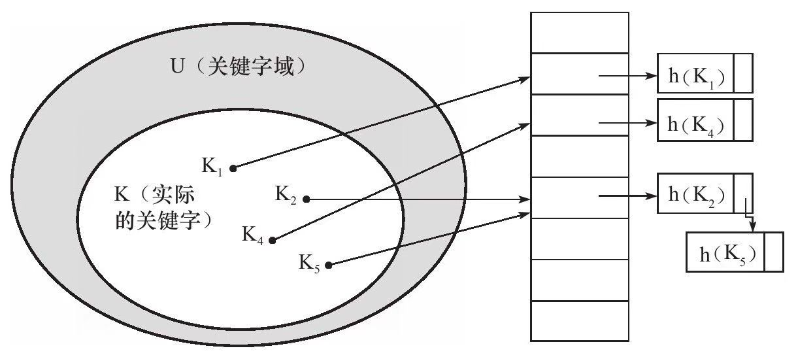

# 索引与算法

## InnoDB存储引擎索引概述

InnoDB存储引擎支持以下几种常见的索引：

- B+树索引

- 全文索引

- 哈希索引

前面已经提到过，InnoDB存储引擎支持的哈希索引是自适应的，InnoDB存储引擎会根据表的使用情况自动为表生成哈希索引，不能人为干预是否在一张表中生成哈希索引。

B+树索引就是传统意义上的索引，这是目前关系型数据库系统中查找最为常用和最为有效的索引。B+树索引的构造类似于二叉树，根据键值（KeyValue）快速找到数据。

注意　B+树中的B不是代表二叉（binary），而是代表平衡（balance），因为B+树是从最早的平衡二叉树演化而来，但是B+树不是一个二叉树。

B+树索引并不能找到一个给定键值的具体行。B+树索引能找到的只是被查找数据行所在的页。然后数据库通过把页读入到内存，再在内存中进行查找，最后得到要查找的数据。

## 数据结构与算法

### 二叉查找树和平衡二叉树

平衡二叉树，或称为AVL的定义如下：首先符合二叉查找树的定义，其次必须满足任何节点的两个子树的高度最大差为1。

平衡二叉树的查找性能是比较高的，但不是最高的，只是接近最高性能。最好的性能需要建立一棵最优二叉树，但是最优二叉树的建立和维护需要大量的操作，因此，用户一般只需建立一棵平衡二叉树即可。

平衡二叉树的查询速度的确很快，但是维护一棵平衡二叉树的代价是非常大的。通常来说，需要1次或多次左旋和右旋来得到插入或更新后树的平衡性。

除了插入操作，还有更新和删除操作，不过这和插入没有本质的区别，都是通过左旋或者右旋来完成的。因此对一棵平衡树的维护是有一定开销的，不过平衡二叉树多用于内存结构对象中，因此维护的开销相对较小。

## B+树索引

B+树索引的本质就是B+树在数据库中的实现。但是B+索引在数据库中有一个特点是高扇出性，因此在数据库中，B+树的高度一般都在2~4层，这也就是说查找某一键值的行记录时最多只需要2到4次IO。当前一般的机械磁盘每秒至少可以做100次IO，2～4次的IO意味着查询时间只需0.02～0.04秒。

数据库中的B+树索引可以分为聚集索引（clustered inex）和辅助索引（secondary index），但是不管是聚集还是辅助的索引，其内部都是B+树的，即高度平衡的，叶子节点存放着所有的数据。

聚集索引与辅助索引不同的是，叶子节点存放的是否是一整行的信息。

### 聚集索引

InnoDB存储引擎表是索引组织表，即表中数据按照主键顺序存放。聚集索引（clustered index）就是按照每张表的主键构造一棵B+树，同时叶子节点中存放的即为整张表的行记录数据，也将聚集索引的叶子节点称为数据页。

聚集索引的这个特性决定了索引组织表中数据也是索引的一部分。同B+树数据结构一样，每个数据页都通过一个双向链表来进行链接。

由于实际的数据页只能按照一棵B+树进行排序，因此每张表只能拥有一个聚集索引。在多数情况下，查询优化器倾向于采用聚集索引。因为聚集索引能够在B+树索引的叶子节点上直接找到数据。此外，由于定义了数据的逻辑顺序，聚集索引能够特别快地访问针对范围值的查询。查询优化器能够快速发现某一段范围的数据页需要扫描。

聚集索引的另一个好处是，它对于主键的排序查找和范围查找速度非常快。叶子节点的数据就是用户所要查询的数据。

聚集索引的存储并不是物理上连续的，而是逻辑上连续的。这其中有两点：一是前面说过的页通过双向链表链接，页按照主键的顺序排序；另一点是每个页中的记录也是通过双向链表进行维护的，物理存储上可以同样不按照主键存储。

另一个是范围查询（range query），即如果要查找主键某一范围内的数据，通过叶子节点的上层中间节点就可以得到页的范围，之后直接读取数据页即可。

### 辅助索引

对于辅助索引（Secondary Index，也称非聚集索引，non-clustered index），叶子节点并不包含行记录的全部数据。

叶子节点除了包含键值以外，每个叶子节点中的索引行中还包含了一个书签（bookmark）。该书签用来告诉InnoDB存储引擎哪里可以找到与索引相对应的行数据。由于InnoDB存储引擎表是索引组织表，因此InnoDB存储引擎的辅助索引的书签就是相应行数据的聚集索引键。

辅助索引的存在并不影响数据在聚集索引中的组织，因此每张表上可以有多个辅助索引。当通过辅助索引来寻找数据时，InnoDB存储引擎会遍历辅助索引并通过叶级别的指针获得指向主键索引的主键，然后再通过主键索引来找到一个完整的行记录。

举例来说，如果在一棵高度为3的辅助索引树中查找数据，那需要对这棵辅助索引树遍历3次找到指定主键，如果聚集索引树的高度同样为3，那么还需要对聚集索引树进行3次查找，最终找到一个完整的行数据所在的页，因此一共需要6次逻辑IO访问以得到最终的一个数据页。

### B+树索引的分裂

并发才是B+树索引实现最为困难的部分。

B+树索引页的分裂并不总是从页的中间记录开始，这样可能会导致页空间的浪费(例如自增索引）。

InnoDB存储引擎的Page Header中有以下几个部分用来保存插入的顺序信息：

- PAGE_LAST_INSERT
- PAGE_DIRECTION
- PAGE_N_DIRECTION

通过这些信息，InnoDB存储引擎可以决定是向左还是向右进行分裂，同时决定将分裂点记录为哪一个。若插入是随机的，则取页的中间记录作为分裂点的记录。若往同一方向进行插入的记录数量为5，并且目前已经定位（cursor）到的记录（InnoDB存储引擎插入时，首先需要进行定位，定位到的记录为待插入记录的前一条记录）之后还有3条记录，则分裂点的记录为定位到的记录后的第三条记录，否则分裂点记录就是待插入的记录。

### B+树索引管理

#### 1 索引管理

索引的创建和删除可以通过两种方法，一种是ALTER TABLE，另一种是CREATE/DROP INDEX。

用户可以设置对整个列的数据进行索引，也可以只索引一个列的开头部分数据，如前面创建的表t，列b为varchar（8000），但是用户可以只索引前100个字段，如：

```mysql
ALTER TABLE t
ADD KEY idx_b(b(100));
```

查看表上的索引：

``` mysql
mysql> show index from user_tab_0\G;
*************************** 1. row ***************************
        Table: user_tab_0
   Non_unique: 0
     Key_name: PRIMARY
 Seq_in_index: 1
  Column_name: id
    Collation: A
  Cardinality: 964789
     Sub_part: NULL
       Packed: NULL
         Null:
   Index_type: BTREE
      Comment:
Index_comment:
*************************** 2. row ***************************
        Table: user_tab_0
   Non_unique: 0
     Key_name: name
 Seq_in_index: 1
  Column_name: name
    Collation: A
  Cardinality: 799831
     Sub_part: NULL
       Packed: NULL
         Null:
   Index_type: BTREE
      Comment:
Index_comment:
2 rows in set (0.00 sec)
```

- Table：索引所在的表名。
- Non_unique：非唯一的索引，可以看到primarykey是0，因为必须是唯一的。
- Key_name：索引的名字，用户可以通过这个名字来执行DROPINDEX。
- Seq_in_index：索引中该列的位置，如果看联合索引idx_a_c就比较直观了。
- Column_name：索引列的名称。
- Collation：列以什么方式存储在索引中。可以是A或NULL。B+树索引总是A，即排序的。如果使用了Heap存储引擎，并且建立了Hash索引，这里就会显示NULL了。因为Hash根据Hash桶存放索引数据，而不是对数据进行排序。
- Cardinality：**非常关键的值**，表示索引中唯一值的数目的估计值。Cardinality/表的行数应尽可能接近1，如果非常小，那么用户需要考虑是否可以删除此索引。
  - 其实就是估计表的所有数据中，被索引的不同数据的个数。如果Cardinality/表的行数 非常小，则说明被索引的字段在行里的重复度非常高，不适合被当作索引使用。
- Sub_part：是否是列的部分被索引。如果看idx_b这个索引，这里显示100，表示只对b列的前100字符进行索引。如果索引整个列，则该字段为NULL。
- Packed：关键字如何被压缩。如果没有被压缩，则为NULL。
- Null：是否索引的列含有NULL值。可以看到idx_b这里为Yes，因为定义的列b允许NULL值。
- Index_type：索引的类型。InnoDB存储引擎只支持B+树索引，所以这里显示的都是BTREE。
- Comment：注释。

Cardinality值非常关键，优化器会根据这个值来判断是否使用这个索引。但是这个值并不是实时更新的，即并非每次索引的更新都会更新该值，因为这样代价太大了。因此这个值是不太准确的，只是一个大概的值。

#### 2 Fast Index Creation

InnoDB存储引擎从InnoDB 1.0.x版本开始支持一种称为Fast Index Creation（快速索引创建）的索引创建方式——简称FIC。

对于辅助索引的创建，InnoDB存储引擎会对创建索引的表加上一个S锁。在创建的过程中，不需要重建表，因此速度较之前提高很多，并且数据库的可用性也得到了提高。删除辅助索引操作就更简单了，InnoDB存储引擎只需更新内部视图，并将辅助索引的空间标记为可用，同时删除MySQL数据库内部视图上对该表的索引定义即可。

由于FIC在索引的创建的过程中对表加上了S锁，因此在创建的过程中只能对该表进行读操作，若有大量的事务需要对目标表进行写操作，那么数据库的服务同样不可用。此外，FIC方式只限定于辅助索引，对于主键的创建和删除同样需要重建一张表。

#### 3 Online Schema Change

Online Schema Change（在线架构改变，简称OSC）最早是由Facebook实现的一种在线执行DDL（Data Definition Language）的方式，并广泛地应用于Facebook的MySQL数据库。所谓“在线”是指在事务的创建过程中，可以有读写事务对表进行操作，这提高了原有MySQL数据库在DDL操作时的并发性。

Facebook采用PHP脚本来现实OSC，而并不是通过修改InnoDB存储引擎源码的方式。OSC最初由Facebook的员工Vamsi Ponnekanti开发。此外，OSC借鉴了开源社区之前的工具The openarkkit toolkit oak-online-alter-table。实现OSC步骤如下：

1. init，即初始化阶段，会对创建的表做一些验证工作，如检查表是否有主键，是否存在触发器或者外键等。
2. createCopyTable，创建和原始表结构一样的新表。
3. alterCopyTable：对创建的新表进行ALTER TABLE操作，如添加索引或列等。
4. createDeltasTable，创建deltas表，该表的作用是为下一步创建的触发器所使用。之后对原表的所有DML操作会被记录到createDeltasTable中。
5. createTriggers，对原表创建INSERT、UPDATE、DELETE操作的触发器。触发操作产生的记录被写入到deltas表。
6. startSnpshotXact，开始OSC操作的事务。
7. selectTableIntoOutfile，将原表中的数据写入到新表。为了减少对原表的锁定时间，这里通过分片（chunked）将数据输出到多个外部文件，然后将外部文件的数据导入到copy表中。分片的大小可以指定，默认值是500 000。
8. dropNCIndexs，在导入到新表前，删除新表中所有的辅助索引。
9. loadCopyTable，将导出的分片文件导入到新表。
10. replayChanges，将OSC过程中原表DML操作的记录应用到新表中，这些记录被保存在deltas表中。
11. recreateNCIndexes，重新创建辅助索引。
12. replayChanges，再次进行DML日志的回放操作，这些日志是在上述创建辅助索引中过程中新产生的日志。
13. swapTables，将原表和新表交换名字，整个操作需要锁定2张表，不允许新的数据产生。由于改名是一个很快的操作，因此阻塞的时间非常短。

由于OSC只是一个PHP脚本，因此其有一定的局限性。例如其要求进行修改的表一定要有主键，且表本身不能存在外键和触发器。此外，在进行OSC过程中，允许SET sql_bin_log=0，因此所做的操作不会同步slave服务器，可能导致主从不一致的情况。

#### Online DDL

**MySQL 5.6版本开始支持Online DDL（在线数据定义）操作**，其允许辅助索引创建的同时，还允许其他诸如INSERT、UPDATE、DELETE这类DML操作，这极大地提高了MySQL数据库在生产环境中的可用性。

此外，不仅是辅助索引，以下这几类DDL操作都可以通过“在线”的方式进行操作：❑

- 辅助索引的创建与删除
- 改变自增长值
- 添加或删除外键约束
- 列的重命名

通过新的ALTER TABLE语法，用户可以选择索引的创建方式：

```mysql
ALTER TABLE tbl_name
|ADD{INDEX|KEY}[index_name]
[index_type](index_col_name,...)[index_option]...
ALGORITHM[=]{DEFAULT|INPLACE|COPY}
LOCK[=]{DEFAULT|NONE|SHARED|EXCLUSIVE}
```

ALGORITHM指定了创建或删除索引的算法:

- COPY表示按照MySQL 5.1版本之前的工作模式，即创建临时表的方式。
- INPLACE表示索引创建或删除操作不需要创建临时表。
- DEFAULT表示根据参数old_alter_table来判断是通过INPLACE还是COPY的算法，该参数的默认值为OFF，表示采用INPLACE的方式

LOCK部分为索引创建或删除时对表添加锁的情况，可有的选择为：

1. NONE: 执行索引创建或者删除操作时，对目标表不添加任何的锁，即事务仍然可以进行读写操作，不会收到阻塞。因此这种模式可以获得最大的并发度。
2. SHARE: 这和之前的FIC类似，执行索引创建或删除操作时，对目标表加上一个S锁。对于并发地读事务，依然可以执行，但是遇到写事务，就会发生等待操作。如果存储引擎不支持SHARE模式，会返回一个错误信息。
3. EXCLUSIVE: 在EXCLUSIVE模式下，执行索引创建或删除操作时，对目标表加上一个X锁。读写事务都不能进行，因此会阻塞所有的线程，这和COPY方式运行得到的状态类似，但是不需要像COPY方式那样创建一张临时表。
4. DEFAULT: DEFAULT模式首先会判断当前操作是否可以使用NONE模式，若不能，则判断是否可以使用SHARE模式，最后判断是否可以使用EXCLUSIVE模式。也就是说DEFAULT会通过判断事务的最大并发性来判断执行DDL的模式。

InnoDB存储引擎实现Online DDL的原理是在执行创建或者删除操作的同时，将INSERT、UPDATE、DELETE这类DML操作日志写入到一个缓存中。待完成索引创建后再将重做应用到表上，以此达到数据的一致性。这个缓存的大小由参数innodb_online_alter_log_max_size控制，默认的大小为128MB。

若用户更新的表比较大，并且在创建过程中伴有大量的写事务，如遇到innodb_online_alter_log_max_size的空间不能存放日志时，会抛出online log too big这种错误。

对于这个错误，用户可以调大参数innodb_online_alter_log_max_size，以此获得更大的日志缓存空间。此外，还可以设置ALTER TABLE的模式为SHARE，这样在执行过程中不会有写事务发生，因此不需要进行DML日志的记录。

需要特别注意的是，由于Online DDL在创建索引完成后再通过重做日志达到数据库的最终一致性，这意味着在索引创建过程中，SQL优化器不会选择正在创建中的索引。

***遗留问题：缓冲区是怎么实现的？***

## Cardinality值

### 什么是Cardinality

并不是在所有的查询条件中出现的列都需要添加索引。对于什么时候添加B+树索引，一般的经验是，在访问表中很少一部分时使用B+树索引才有意义。对于性别字段、地区字段、类型字段，它们可取值的范围很小，称为低选择性。

怎样查看索引是否是高选择性的呢？可以通过SHOW INDEX结果中的列Cardinality来观察。Cardinality值非常关键，表示索引中不重复记录数量的预估值。同时需要注意的是，Cardinality是一个预估值，而不是一个准确值，基本上用户也不可能得到一个准确的值。在实际应用中，Cardinality/n_rows_in_table应尽可能地接近1。如果非常小，那么用户需要考虑是否还有必要创建这个索引。故在访问高选择性属性的字段并从表中取出很少一部分数据时，对这个字段添加B+树索引是非常有必要的。

### InnoDB存储引擎的Cardinality统计

在生产环境中，索引的更新操作可能是非常频繁的。如果每次索引在发生操作时就对其进行Cardinality的统计，那么将会给数据库带来很大的负担。另外需要考虑的是，如果一张表的数据非常大，如一张表有50G的数据，那么统计一次Cardinality信息所需要的时间可能非常长。这在生产环境下，也是不能接受的。因此，数据库对于Cardinality的统计都是通过**采样（Sample）**的方法来完成的。

在InnoDB存储引擎中，Cardinality统计信息的更新发生在两个操作中：INSERT和UPDATE。根据前面的叙述，不可能在每次发生INSERT和UPDATE时就去更新Cardinality信息，这样会增加数据库系统的负荷，同时对于大表的统计，时间上也不允许数据库这样去操作。因此，InnoDB存储引擎内部对更新Cardinality信息的策略为：

- 表中1/16的数据已发生过变化：自从上次统计Cardinality信息后，表中1/16的数据已经发生过变化，这时需要更新Cardinality信息。
- stat_modified_counter＞2 000 000 000：如果对表中某一行数据频繁地进行更新操作，这时表中的数据实际并没有增加，实际发生变化的还是这一行数据，则第一种更新策略就无法适用这这种情况。故在InnoDB存储引擎内部有一个计数器stat_modified_counter，用来表示发生变化的次数，当stat_modified_counter大于2 000 000 000时，则同样需要更新Cardinality信息。

InnoDB存储引擎内部是怎样来进行Cardinality信息的统计和更新操作的呢？同样是通过采样的方法。默认InnoDB存储引擎对8个叶子节点（Leaf　Page）进行采用。采样的过程如下：

1. 取得B+树索引中叶子节点的数量，记为A。
2. 随机取得B+树索引中的8个叶子节点。统计每个页不同记录的个数，即为P1，P2，…，P8。
3. 根据采样信息给出Cardinality的预估值：Cardinality=（P1+P2+…+P8）*A/8。

在InnoDB存储引擎中，**Cardinality值是通过对8个叶子节点预估而得的，不是一个实际精确的值。**再者，每次对Cardinality值的统计，都是通过随机取8个叶子节点得到的，这同时又暗示了另一个Cardinality现象，即每次得到的Cardinality值可能是不同的。

## B+树索引的使用

### 联合索引

联合索引是指对表上的多个列进行索引。联合索引的创建方法与单个索引创建的方法一样，不同之处仅在于有多个索引列。

联合索引（a，b）其实是根据列a、b进行排序，因此下列语句可以直接使用联合索引得到结果：

```mysql
select * from table where a=xxx order by b
```

然而对于联合索引（a，b，c）来说，下列语句同样可以直接通过联合索引得到结果：

```mysql
select * from table where a=xxx order by b
select * from table where a=xxx and b=xxx order by c
```

应该是最左匹配原则。

### 覆盖索引

InnoDB存储引擎支持覆盖索引（covering index，或称索引覆盖），即从辅助索引中就可以得到查询的记录，而不需要查询聚集索引中的记录。使用覆盖索引的一个好处是辅助索引不包含整行记录的所有信息，故其大小要远小于聚集索引，因此可以减少大量的IO操作。

对于InnoDB存储引擎的辅助索引而言，由于其包含了主键信息，因此其叶子节点存放的数据为（primary key1，primary key2，…，key1，key2，…）。

覆盖索引的另一个好处是对某些统计问题而言的。

例如：

```mysql
select count(*) from tbl;
```

如果表上还有辅助索引，InnoDB存储引擎并不会选择通过查询聚集索引来进行统计。因为辅助索引远小于聚集索引，选择辅助索引可以减少IO操作。

### 优化器选择不使用索引的情况

在某些情况下，当执行EXPLAIN命令进行SQL语句的分析时，会发现优化器并没有选择索引去查找数据，而是通过扫描聚集索引，也就是直接进行全表的扫描来得到数据。这种情况多发生于范围查找、JOIN链接操作等情况下。

如果用户需要的信息是整行信息，而辅助索引又不能覆盖。所以用辅助索引的情况下，还需要通过书签再进行一次查找。虽然辅助索引中的数据是有序的，但是根据主键查找则变成了无序，因此变为了磁盘上的离散读操作。如果要求访问的数据量很小，则优化器还是会选择辅助索引，但是当访问的数据占整个表中数据的蛮大一部分时（一般是20%左右），优化器会选择通过聚集索引来查找数据。因为顺序读要远远快于离散读。

因此对于不能进行索引覆盖的情况，优化器选择辅助索引的情况是，通过辅助索引查找的数据是少量的。这是由当前传统机械硬盘的特性所决定的，即利用顺序读来替换随机读的查找。若用户使用的磁盘是固态硬盘，随机读操作非常快，同时有足够的自信来确认使用辅助索引可以带来更好的性能，那么可以使用关键字FORCE INDEX来强制使用某个索引。

### 索引提示

MySQL数据库支持索引提示（INDEX HINT），显式地告诉优化器使用哪个索引。

USE INDEX只是告诉优化器可以选择该索引，实际上优化器还是会再根据自己的判断进行选择。

如果使用FORCE INDEX的索引提示，优化器则会使用该索引。

因此，如果用户确定指定某个索引来完成查询，那么最可靠的是使用FORCE INDEX，而不是USE INDEX。

### Multi-Range Read 优化

Multi-Range Read优化的目的就是为了减少磁盘的随机访问，并且将随机访问转化为较为顺序的数据访问，这对于IObound类型的SQL查询语句可带来性能极大的提升。Multi-Range Read优化可适用于range，ref，eq_ref类型的查询。

MRR优化有以下几个好处：

- MRR使数据访问变得较为顺序。在查询辅助索引时，首先根据得到的查询结果，按照主键进行排序，并按照主键排序的顺序进行书签查找。
- 减少缓冲池中页被替换的次数。
- 批量处理对键值的查询操作。

对于InnoDB和MyISAM存储引擎的范围查询和JOIN查询操作，MRR的工作方式如下：

- 将查询得到的辅助索引键值存放于一个缓存中，这时缓存中的数据是根据辅助索引键值排序的。
- 将缓存中的键值根据RowID进行排序。
- 根据RowID的排序顺序来访问实际的数据文件。

此外，Multi-Range Read还可以将某些范围查询，拆分为键值对，以此来进行批量的数据查询。这样做的好处是可以在拆分过程中，直接过滤一些不符合查询条件的数据。

是否启用Multi-Range Read优化可以通过参数optimizer_switch中的标记（flag）来控制。当mrr为on时，表示启用Multi-Range Read优化。mrr_cost_based标记表示是否通过cost based的方式来选择是否启用mrr。若将mrr设为on，mrr_cost_based设为off，则总是启用Multi-Range Read优化。

### Index Condition Pushdown（ICP）优化

和Multi-Range Read一样，Index Condition Pushdown同样是MySQL 5.6开始支持的一种根据索引进行查询的优化方式。

之前的MySQL数据库版本不支持Index Condition Pushdown，当进行索引查询时，首先根据索引来查找记录，然后再根据WHERE条件来过滤记录。

在支持Index Condition Pushdown后，MySQL数据库会在取出索引的同时，判断是否可以进行WHERE条件的过滤，也就是将WHERE的部分过滤操作放在了存储引擎层。在某些查询下，可以大大减少上层SQL层对记录的索取（fetch），从而提高数据库的整体性能。

Index Condition Pushdown优化支持range、ref、eq_ref、ref_or_null类型的查询，当前支持MyISAM和InnoDB存储引擎。当优化器选择Index Condition Pushdown优化时，可在执行计划的列Extra看到Using index condition提示。

## 哈希算法

哈希算法是一种常见算法，时间复杂度为O（1），且不只存在于索引中，每个数据库应用中都存在该数据库结构。

### 哈希表

直接寻址中，两个关键字可能映射到同一个槽上。一般将这种情况称之为发生了碰撞（collision）。在数据库中一般采用最简单的碰撞解决技术，这种技术被称为链接法（chaining）。

在链接法中，把散列到同一槽中的所有元素都放在一个链表中。槽j中有一个指针，它指向由所有散列到j的元素构成的链表的头；如果不存在这样的元素，则j中为NULL。



最后要考虑的是哈希函数。哈希函数h必须可以很好地进行散列。最好的情况是能避免碰撞的发生。即使不能避免，也应该使碰撞在最小程度下产生。一般来说，都将关键字转换成自然数，然后通过除法散列、乘法散列或全域散列来实现。数据库中一般采用除法散列的方法。

在哈希函数的除法散列法中，通过取k除以m的余数，将关键字k映射到m个槽的某一个去，即哈希函数为：

```mysql
h(k) = k mod m
```

### InnoDB存储引擎中的哈希算法

InnoDB存储引擎使用哈希算法来对字典进行查找，其冲突机制采用链表方式，哈希函数采用除法散列方式。对于缓冲池页的哈希表来说，在缓冲池中的Page页都有一个chain指针，它指向相同哈希函数值的页。

而对于除法散列，m的取值为略大于2倍的缓冲池页数量的质数。例如：当前参数innodb_buffer_pool_size的大小为10M，则共有640个16KB的页。对于缓冲池页内存的哈希表来说，需要分配640×2=1280个槽，但是由于1280不是质数，需要取比1280略大的一个质数，应该是1399，所以在启动时会分配1399个槽的哈希表，用来哈希查询所在缓冲池中的页。

InnoDB存储引擎的表空间都有一个space_id，用户所要查询的应该是某个表空间的某个连续16KB的页，即偏移量offset。InnoDB存储引擎将space_id左移20位，然后加上这个space_id和offset，即关键字K=space_id＜＜20+space_id+offset，然后通过除法散列到各个槽中去。

### 自适应哈希索引

自适应哈希索引经哈希函数映射到一个哈希表中，因此对于字典类型的查找非常快速，如SELECT*FROM TABLE WHERE index_col='xxx'。但是对于范围查找就无能为力了。

通过命令SHOW ENGINE INNODB STATUS可以看到当前自适应哈希索引的使用状况：

```mysql
-------------------------------------
INSERT BUFFER AND ADAPTIVE HASH INDEX
-------------------------------------
Ibuf: size 1, free list len 11, seg size 13, 0 merges
merged operations:
 insert 0, delete mark 0, delete 0
discarded operations:
 insert 0, delete mark 0, delete 0
Hash table size 34673, node heap has 0 buffer(s)
Hash table size 34673, node heap has 0 buffer(s)
Hash table size 34673, node heap has 0 buffer(s)
Hash table size 34673, node heap has 0 buffer(s)
Hash table size 34673, node heap has 0 buffer(s)
Hash table size 34673, node heap has 0 buffer(s)
Hash table size 34673, node heap has 0 buffer(s)
Hash table size 34673, node heap has 0 buffer(s)
0.00 hash searches/s, 0.00 non-hash searches/s
```

需要注意的是，哈希索引只能用来搜索等值的查询，而对于其他查找类型，如范围查找，是不能使用哈希索引的。因此，这里出现了non-hash searches/s的情况。通过hash searches:non-hash searches可以大概了解使用哈希索引后的效率。

自适应哈希索引是由InnoDB存储引擎自己控制的，不过可以通过参数innodb_adaptive_hash_index来禁用或启动此特性，默认为开启。

## 全文检索（Full-Text Search）

### 概述

B+树索引的特点，可以通过索引字段的前缀（prefix）进行查找。例如，对于下面的查询B+树索引是支持的：

```mysql
select * from blog where context like 'xxx%'
```

全文检索（Full-Text Search）是将存储于数据库中的整本书或整篇文章中的任意内容信息查找出来的技术。它可以根据需要获得全文中有关章、节、段、句、词等信息，也可以进行各种统计和分析。

从InnoDB 1.2.x版本开始，InnoDB存储引擎开始支持全文检索。

### 倒排索引

全文检索通常使用倒排索引（inverted index）来实现。倒排索引同B+树索引一样，也是一种索引结构。它在辅助表（auxiliary table）中存储了单词与单词自身在一个或多个文档中所在位置之间的映射。这通常利用关联数组实现，其拥有两种表现形式：

- inverted file index，其表现形式为{单词，单词所在文档的ID}
- full invertedindex，其表现形式为{单词，(单词所在文档的ID，在具体文档中的位置)}

### InnoDB全文检索

InnoDB存储引擎从1.2.x版本开始支持全文检索的技术，其采用full inverted index的方式。在InnoDB存储引擎中，将(DocumentId，Position)视为一个“ilist”。因此在全文检索的表中，有两个列，一个是word字段，另一个是ilist字段，并且在word字段上有设有索引。此外，由于InnoDB存储引擎在ilist字段中存放了Position信息，故可以进行Proximity Search，而MyISAM存储引擎不支持该特性。

倒排索引需要将word存放到一张表中，这个表称为Auxiliary Table（辅助表）。在InnoDB存储引擎中，为了提高全文检索的并行性能，共有6张Auxiliary Table，目前每张表根据word的Latin编码进行分区。

Auxiliary Table是持久的表，存放于磁盘上。然而在InnoDB存储引擎的全文索引中，还有另外一个重要的概念FTS Index Cache（全文检索索引缓存），其用来提高全文检索的性能。

FTS Index Cache是一个红黑树结构，其根据（word，ilist）进行排序。这意味着插入的数据已经更新了对应的表，但是对全文索引的更新可能在分词操作后还在FTS Index Cache中，Auxiliary Table可能还没有更新。InnoDB存储引擎会批量对Auxiliary Table进行更新，而不是每次插入后更新一次Auxiliary Table。当对全文检索进行查询时，Auxiliary Table首先会将在FTS Index Cache中对应的word字段合并到Auxiliary Table中，然后再进行查询。这种merge操作非常类似之前介绍的Insert Buffer的功能，不同的是Insert Buffer是一个持久的对象，并且其是B+树的结构。然而FTS Index Cache的作用又和Insert Buffer是类似的，它提高了InnoDB存储引擎的性能，并且由于其根据红黑树排序后进行批量插入，其产生的Auxiliary Table相对较小。

InnoDB存储引擎总是在事务提交时将分词写入到FTS Index Cache，然后再通过批量更新写入到磁盘。虽然InnoDB存储引擎通过一种延时的、批量的写入方式来提高数据库的性能，但是上述操作仅在事务提交时发生。

当数据库关闭时，在FTS Index Cache中的数据库会同步到磁盘上的Auxiliary Table中。然而，如果当数据库发生宕机时，一些FTS Index Cache中的数据库可能未被同步到磁盘上。那么下次重启数据库时，当用户对表进行全文检索（查询或者插入操作）时，InnoDB存储引擎会自动读取未完成的文档，然后进行分词操作，再将分词的结果放入到FTS Index Cache中。

参数innodb_ft_cache_size用来控制FTS Index Cache的大小，默认值为32M。当该缓存满时，会将其中的(word，ilist)分词信息同步到磁盘的Auxiliary Table中。增大该参数可以提高全文检索的性能，但是在宕机时，未同步到磁盘中的索引信息可能需要更长的时间进行恢复。

FTS Document ID是另外一个重要的概念。在InnoDB存储引擎中，为了支持全文检索，必须有一个列与word进行映射，在InnoDB中这个列被命名为FTS_DOC_ID，其类型必须是BIGINT UNSIGNED NOT NULL，并且InnoDB存储引擎自动会在该列上加入一个名为FTS_DOC_ID_INDEX的Unique Index。上述这些操作都由InnoDB存储引擎自己完成，用户也可以在建表时自动添加FTS_DOC_ID，以及相应的Unique Index。由于列名为FTS_DOC_ID的列具有特殊意义，因此创建时必须注意相应的类型，否则MySQL数据库会抛出错误。

文档中分词的插入操作是在事务提交时完成，然而对于删除操作，其在事务提交时，不删除磁盘Auxiliary Table中的记录，而只是删除FTS Cache Index中的记录。对于Auxiliary Table中被删除的记录，InnoDB存储引擎会记录其FTS Document ID，并将其保存在DELETED auxiliary table中。

由于文档的DML操作实际并不删除索引中的数据，相反还会在对应的DELETED表中插入记录，因此随着应用程序的允许，索引会变得非常大，即使索引中的有些数据已经被删除，查询也不会选择这类记录。为此，InnoDB存储引擎提供了一种方式，允许用户手工地将已经删除的记录从索引中彻底删除，该命令就是OPTIMIZE TABLE。因为OPTIMIZE TABLE还会进行一些其他的操作，如Cardinality的重新统计。

若被删除的文档非常多，那么OPTIMIZE TABLE操作可能需要占用非常多的时间，这会影响应用程序的并发性，并极大地降低用户的响应时间。用户可以通过参数innodb_ft_num_word_optimize来限制每次实际删除的分词数量。该参数的默认值为2000。

stopword列表（stopword list）是本小节最后阐述的一个概念，其表示该列表中的word不需要对其进行索引分词操作。例如，对于the这个单词，由于其不具有具体的意义，因此将其视为stopword。InnoDB存储引擎有一张默认的stopword列表，其在information_schema架构下，表名为INNODB_FT_DEFAULT_STOPWORD，默认共有36个stopword。此外用户也可以通过参数innodb_ft_server_stopword_table来自定义stopword列表。

当前InnoDB存储引擎的全文检索还存在以下的限制：

- 每张表只能有一个全文检索的索引。
- 由多列组合而成的全文检索的索引列必须使用相同的字符集与排序规则。
- 不支持没有单词界定符（delimiter）的语言，如中文、日语、韩语等。

### 全文检索

MySQL数据库通过MATCH()…AGAINST()语法支持全文检索的查询，MATCH指定了需要被查询的列，AGAINST指定了使用何种方法去进行查询。

#### 1.Natural Language

全文检索通过MATCH函数进行查询，默认采用Natural Language模式，其表示查询带有指定word的文档。

由于NATURAL LANGUAGE MODE是默认的全文检索查询模式，因此用户可以省略查询修饰符，SQL语句可以写为：

```mysql
select * from tbl where match(body) against ('Porridge');
```

在WHERE条件中使用MATCH函数，查询返回的结果是根据相关性（Relevance）进行降序排序的，即相关性最高的结果放在第一位。相关性的值是一个非负的浮点数字，0表示没有任何的相关性。根据MySQL官方的文档可知，其相关性的计算依据以下四个条件：

-  word是否在文档中出现。
- word在文档中出现的次数。
- word在索引列中的数量。
- 多少个文档包含该word。

对于InnoDB存储引擎的全文检索，还需要考虑以下的因素：❑查询的word在stopword列中，忽略该字符串的查询。❑查询的word的字符长度是否在区间[innodb_ft_min_token_size，innodb_ft_max_token_size]内。如果词在stopword中，则不对该词进行查询。

参数innodb_ft_min_token_size和innodb_ft_max_token_size控制InnoDB存储引擎查询字符的长度，当长度小于innodb_ft_min_token_size，或者长度大于innodb_ft_max_token_size时，会忽略该词的搜索。在InnoDB存储引擎中，参数innodb_ft_min_token_size的默认值为3，参数innodb_ft_max_token_size的默认值为84。

#### 2.Boolean

MySQL数据库允许使用IN BOOLEAN MODE修饰符来进行全文检索。当使用该修饰符时，查询字符串的前后字符会有特殊的含义，例如下面的语句要求查询有字符串Pease但没有hot的文档，其中+和-分别表示这个单词必须出现，或者一定不存在。

```mysql
select * from tbl
where match(body) against ('+Pease-hot' IN BOOLEAN MODE)\G;
```

Boolean全文检索支持以下几种操作符：

- +表示该word必须存在。
- -表示该word必须被排除。
- （no operator）表示该word是可选的，但是如果出现，其相关性会更高❑@distance表示查询的多个单词之间的距离是否在distance之内，distance的单位是字节。这种全文检索的查询也称为Proximity Search。如MATCH（body）AGAINST（'"Pease pot"@30'IN BOOLEAN MODE）表示字符串Pease和pot之间的距离需在30字节内。
- ＞表示出现该单词时增加相关性。
- ＜表示出现该单词时降低相关性。
- ～表示允许出现该单词，但是出现时相关性为负（全文检索查询允许负相关性）。
- *表示以该单词开头的单词，如lik*，表示可以是lik、like，又或者likes。
- "表示短语。

#### 3.Query Expansion

MySQL数据库还支持全文检索的扩展查询。这种查询通常在查询的关键词太短，用户需要implied knowledge（隐含知识）时进行。例如，对于单词database的查询，用户可能希望查询的不仅仅是包含database的文档，可能还指那些包含MySQL、Oracle、DB2、RDBMS的单词。而这时可以使用Query Expansion模式来开启全文检索的implied knowledge。

通过在查询短语中添加WITH QUERY EXPANSION或IN NATURAL LANGUAGE MODE WITH QUERY EXPANSION可以开启blind query expansion（又称为automatic relevance feedback）。该查询分为两个阶段。

- 第一阶段：根据搜索的单词进行全文索引查询。
- 第二阶段：根据第一阶段产生的分词再进行一次全文检索的查询。

由于Query Expansion的全文检索可能带来许多非相关性的查询，因此在使用时，用户可能需要非常谨慎。
