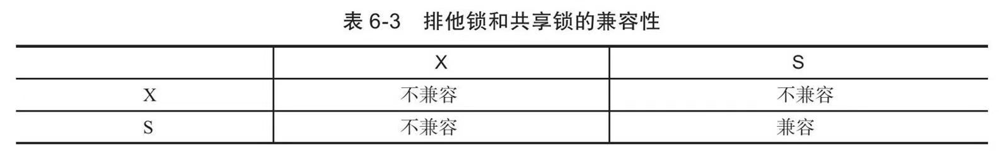

## 锁

## 什么是锁

锁是数据库系统区别于文件系统的一个关键特性。锁机制用于管理对共享资源的并发访问。

InnoDB存储引擎会在行级别上对表数据上锁，也会在数据库内部其他多个地方使用锁，从而允许对多种不同资源提供并发访问。例如，操作缓冲池中的LRU列表，删除、添加、移动LRU列表中的元素，为了保证一致性，必须有锁的介入。数据库系统使用锁是为了支持对共享资源进行并发访问，提供数据的完整性和一致性。

InnoDB存储引擎锁的实现和Oracle数据库非常类似，提供一致性的非锁定读、行级锁支持。行级锁没有相关额外的开销，并可以同时得到并发性和一致性。

## lock与latch

latch一般称为闩锁（轻量级的锁），因为其要求锁定的时间必须非常短。若持续的时间长，则应用的性能会非常差。在InnoDB存储引擎中，latch又可以分为mutex（互斥量）和rwlock（读写锁）。其目的是用来保证并发线程操作临界资源的正确性，并且通常没有死锁检测的机制。

lock的对象是事务，用来锁定的是数据库中的对象，如表、页、行。并且一般lock的对象仅在事务commit或rollback后进行释放（不同事务隔离级别释放的时间可能不同）。此外，lock，正如在大多数数据库中一样，是有死锁机制的。


对于InnoDB存储引擎中的latch，可以通过命令SHOW ENGINE INNODB MUTEX来进行查看:

```mysql
mysql> SHOW ENGINE INNODB MUTEX;
+--------+------------------------+----------+
| Type   | Name                   | Status   |
+--------+------------------------+----------+
| InnoDB | rwlock: log0log.cc:846 | waits=12 |
+--------+------------------------+----------+
1 row in set (0.00 sec)
```

## InnoDB存储引擎中的锁

### 锁的类型

InnoDB存储引擎实现了如下两种标准的行级锁：

- **共享锁（SLock）**，允许事务读一行数据。
- **排他锁（XLock）**，允许事务删除或更新一行数据。

如果一个事务T1已经获得了行r的共享锁，那么另外的事务T2可以立即获得行r的共享锁，因为读取并没有改变行r的数据，称这种情况为**锁兼容（Lock Compatible）**。



X锁与任何的锁都不兼容，而S锁仅和S锁兼容。需要特别注意的是，S和X锁都是行锁，兼容是指对同一记录（row）锁的兼容性情况。

此外，InnoDB存储引擎支持多粒度（granular）锁定，这种锁定允许事务在行级上的锁和表级上的锁同时存在。为了支持在不同粒度上进行加锁操作，InnoDB存储引擎支持一种额外的锁方式，称之为**意向锁（Intention Lock）**。意向锁是将锁定的对象分为多个层次，意向锁意味着事务希望在更细粒度（finegranularity）上进行加锁。


若将上锁的对象看成一棵树，那么对最下层的对象上锁，也就是对最细粒度的对象进行上锁，那么首先需要对粗粒度的对象上锁。例如上图，如果需要对页上的记录r进行上X锁，那么分别需要对数据库A、表、页上意向锁IX，最后对记录r上X锁。若其中任何一个部分导致等待，那么该操作需要等待粗粒度锁的完成。举例来说，在对记录r加X锁之前，已经有事务对表1进行了S表锁，那么表1上已存在S锁，之后事务需要对记录r在表1上加上IX，由于不兼容，所以该事务需要等待表锁操作的完成。

InnoDB存储引擎支持意向锁设计比较简练，其意向锁即为表级别的锁。设计目的主要是为了在一个事务中揭示下一行将被请求的锁类型。其支持两种意向锁：

1. 意向共享锁（ISLock），事务想要获得一张表中某几行的共享锁
2. 意向排他锁（IXLock），事务想要获得一张表中某几行的排他锁

用户可以通过命令SHOW ENGINE INNODB STATUS命令来查看当前锁请求的信息

### 一致性非锁定读(consistent nonlocking read)

一致性的非锁定读（consistent nonlocking read）是指InnoDB存储引擎通过行多版本控制（multi versioning）的方式来读取当前执行时间数据库中行的数据。如果读取的行正在执行DELETE或UPDATE操作，这时读取操作不会因此去等待行上锁的释放。相反地，InnoDB存储引擎会去读取行的一个快照数据。


之所以称其为非锁定读，因为不需要等待访问的行上X锁的释放。快照数据是指该行的之前版本的数据，该实现是**通过undo段来完成**。而undo用来在事务中回滚数据，因此快照数据本身是没有额外的开销。此外，读取快照数据是不需要上锁的，因为没有事务需要对历史的数据进行修改操作。

可以看到，非锁定读机制极大地提高了数据库的并发性。在InnoDB存储引擎的默认设置下，这是默认的读取方式，即读取不会占用和等待表上的锁。但是在不同事务隔离级别下，读取的方式不同，并不是在每个事务隔离级别下都是采用非锁定的一致性读。此外，即使都是使用非锁定的一致性读，但是对于快照数据的定义也各不相同。

快照数据其实就是当前行数据之前的历史版本，每行记录可能有多个版本。一个行记录可能有不止一个快照数据，一般称这种技术为行多版本技术。由此带来的并发控制，称之为**多版本并发控制（MultiVersionConcurrencyControl，MVCC）**。

在事务隔离级别READ COMMITTED和REPEATABLE READ（InnoDB存储引擎的默认事务隔离级别）下，InnoDB存储引擎使用非锁定的一致性读。然而，对于快照数据的定义却不相同。

- 在READ COMMITTED事务隔离级别下，对于快照数据，非一致性读总是读取被锁定行的最新一份快照数据。
- 而在REPEATABLE READ事务隔离级别下，对于快照数据，非一致性读总是读取事务开始时的行数据版本。

### 一致性锁定读

在默认配置下，即事务的隔离级别为REPEATABLE READ模式下，InnoDB存储引擎的SELECT操作使用一致性非锁定读。但是在某些情况下，用户需要显式地对数据库读取操作进行加锁以保证数据逻辑的一致性。而这要求数据库支持加锁语句，即使是对于SELECT的只读操作。

InnoDB存储引擎对于SELECT语句支持两种一致性的锁定读（locking read）操作：

- SELECT…FOR UPDATE
- SELECT…LOCK IN SHARE MODE

SELECT…FOR UPDATE对读取的行记录加一个X锁，其他事务不能对已锁定的行加上任何锁。SELECT…LOCK IN SHARE MODE对读取的行记录加一个S锁，其他事务可以向被锁定的行加S锁，但是如果加X锁，则会被阻塞。

SELECT…FOR UPDATE，SELECT…LOCK IN SHARE MODE必须在一个事务中，当事务提交了，锁也就释放了。因此在使用上述两句SELECT锁定语句时，务必加上BEGIN，START TRANSACTION或者SET AUTOCOMMIT=0。

### 自增长与锁

自增长在数据库中是非常常见的一种属性。

在InnoDB存储引擎的内存结构中，对每个含有自增长值的表都有一个自增长计数器（auto-increment counter）。当对含有自增长的计数器的表进行插入操作时，这个计数器会被初始化。

执行如下的语句来得到计数器的值：

```mysql
select MAX(auto_inc_col) from t for update;
```

插入操作会依据这个自增长的计数器值加1赋予自增长列。这个实现方式称做AUTO-INC Locking。这种锁其实是采用一种特殊的表锁机制，为了提高插入的性能，锁不是在一个事务完成后才释放，而是在完成对自增长值插入的SQL语句后立即释放。

虽然AUTO-INC Locking从一定程度上提高了并发插入的效率，但还是存在一些性能上的问题。首先，对于有自增长值的列的并发插入性能较差，事务必须等待前一个插入的完成（虽然不用等待事务的完成）。其次，对于INSERT…SELECT的大数据量的插入会影响插入的性能，因为另一个事务中的插入会被阻塞。从MySQL 5.1.22版本开始，InnoDB存储引擎中提供了一种轻量级互斥量的自增长实现机制，这种机制大大提高了自增长值插入的性能。并且从该版本开始，InnoDB存储引擎提供了一个参数innodb_autoinc_lock_mode来控制自增长的模式，该参数的默认值为1。

在InnoDB存储引擎中，自增长值的列必须是索引，同时必须是索引的第一个列。如果不是第一个列，则MySQL数据库会抛出异常，而MyISAM存储引擎没有这个问题。

### 外键和锁

外键主要用于引用完整性的约束检查。在InnoDB存储引擎中，对于一个外键列，如果没有显式地对这个列加索引，InnoDB存储引擎自动对其加一个索引，因为这样可以避免表锁。

对于外键值的插入或更新，首先需要查询父表中的记录，即SELECT父表。但是对于父表的SELECT操作，不是使用一致性非锁定读的方式，因为这样会发生数据不一致的问题，因此这时使用的是SELECT…LOCKINSHAREMODE方式，即主动对父表加一个S锁。如果这时父表上已经这样加X锁，子表上的操作会被阻塞。

## 锁的算法

### 行锁的3种算法

InnoDB存储引擎有3种行锁的算法，其分别是：

- Record Lock：单个行记录上的锁
- Gap Lock：间隙锁，锁定一个范围，但不包含记录本身
- Next-Key Lock∶Gap Lock+Record Lock，锁定一个范围，并且锁定记录本身

Record Lock总是会去锁住索引记录，如果InnoDB存储引擎表在建立的时候没有设置任何一个索引，那么这时InnoDB存储引擎会使用隐式的主键来进行锁定。

Next-Key Lock是结合了Gap Lock和Record Lock的一种锁定算法，在Next-Key Lock算法下，InnoDB对于行的查询都是采用这种锁定算法。

采用Next-Key Lock的锁定技术称为Next-Key Locking。其设计的目的是为了解决Phantom Problem，这将在下一小节中介绍。而利用这种锁定技术，锁定的不是单个值，而是一个范围，是谓词锁（predict lock）的一种改进。除了next-key locking，还有previous-key locking技术。

然而，当查询的索引含有唯一属性时，InnoDB存储引擎会对Next-Key Lock进行优化，将其降级为Record Lock，即仅锁住索引本身，而不是范围。

Next-Key Lock降级为Record Lock仅在查询的列是唯一索引的情况下。若是辅助索引，则情况会完全不同。

例如：

```mysql
create table z(a INT, b INT, PRIMARY KEY(a), KEY(b));
insert into z select 1,1;
insert into z select 3,1;
insert into z select 5,3;
insert into z select 7,6;
insert into z select 10,8;
```

表z的列b是辅助索引，若在会话A中执行下面的SQL语句：

```mysql
select * from z where b=3 for update
```

这时SQL语句通过索引列b进行查询，因此其使用传统的Next-Key Locking技术加锁，并且由于有两个索引，其需要分别进行锁定。对于聚集索引，其仅对列a等于5的索引加上Record Lock。而对于辅助索引，其加上的是Next-Key Lock，锁定的范围是(1，3)，特别需要注意的是，InnoDB存储引擎还会对辅助索引下一个键值加上gap lock，即还有一个辅助索引范围为(3，6)的锁。

GapLock的作用是为了阻止多个事务将记录插入到同一范围内，而这会导致Phantom Problem（幻读）问题的产生。

用户可以通过以下两种方式来显式地关闭GapLock：

- 将事务的隔离级别设置为READ COMMITTED
- 将参数innodb_locks_unsafe_for_binlog设置为1

在上述的配置下，除了外键约束和唯一性检查依然需要的Gap Lock，其余情况仅使用Record Lock进行锁定。但需要牢记的是，上述设置破坏了事务的隔离性，并且对于replication，可能会导致主从数据的不一致。此外，从性能上来看，READ COMMITTED也不会优于默认的事务隔离级别READ REPEATABLE。

最后需再次提醒的是，对于唯一键值的锁定，Next-Key Lock降级为Record Lock仅存在于查询所有的唯一索引列。若唯一索引由多个列组成，而查询仅是查找多个唯一索引列中的其中一个，那么查询其实是range类型查询，而不是point类型查询，故InnoDB存储引擎依然使用Next-Key Lock进行锁定。（只要是范围类型的查找或者加锁，都是使用间隙锁）

### 解决Phantom Problem（幻读）

在默认的事务隔离级别下，即REPEATABLE READ下，InnoDB存储引擎采用Next-Key Locking机制来避免Phantom Problem（幻像问题）。

PhantomProblem是指在同一事务下，连续执行两次同样的SQL语句可能导致不同的结果，第二次的SQL语句可能会返回之前不存在的行。

InnoDB存储引擎采用Next-Key Locking的算法避免Phantom Problem。对于上述的SQL语句SELECT*FROM t WHERE a＞2 FOR UPDATE，其锁住的不是5这单个值，而是对（2，+∞）这个范围加了X锁。因此任何对于这个范围的插入都是不被允许的，从而避免Phantom Problem。

InnoDB存储引擎默认的事务隔离级别是REPEATABLE READ，在该隔离级别下，其采用Next-Key Locking的方式来加锁。而在事务隔离级别READ COMMITTED下，其仅采用Record Lock。

引用自博客：

mysql避免幻读现象，解决的方案有两种：

- 针对**快照读**（普通 select 语句），是**通过 MVCC 方式解决了幻读**，因为可重复读隔离级别下，事务执行过程中看到的数据，一直跟这个事务启动时看到的数据是一致的，即使中途有其他事务插入了一条数据，是查询不出来这条数据的，所以就很好了避免幻读问题。
- 针对**当前读**（select ... for update 等语句），是**通过 next-key lock（记录锁+间隙锁）方式解决了幻读**，因为当执行 select ... for update 语句的时候，会加上 next-key lock，如果有其他事务在 next-key lock 锁范围内插入了一条记录，那么这个插入语句就会被阻塞，无法成功插入，所以就很好了避免幻读问题。

## 锁问题

### 脏读（Dirty Read）

在理解脏读（Dirty Read）之前，需要理解脏数据的概念。但是脏数据和之前所介绍的脏页完全是两种不同的概念。脏页指的是在缓冲池中已经被修改的页，但是还没有刷新到磁盘中，即数据库实例内存中的页和磁盘中的页的数据是不一致的，当然在刷新到磁盘之前，日志都已经被写入到了重做日志文件中。而所谓脏数据是指事务对缓冲池中行记录的修改，并且还没有被提交（commit）。

**脏读**指的就是在不同的事务下，当前事务可以读到另外事务未提交的数据，简单来说就是可以读到脏数据。

脏读现象在生产环境中并不常发生，从上面的例子中就可以发现，脏读发生的条件是需要事务的隔离级别为READ UNCOMMITTED，而目前绝大部分的数据库都至少设置成READ COMMITTED。InnoDB存储引擎默认的事务隔离级别为READ REPEATABLE，Microsoft SQL Server数据库为READ COMMITTED，Oracle数据库同样也是READ COMMITTED。

脏读隔离看似毫无用处，但在一些比较特殊的情况下还是可以将事务的隔离级别设置为READ UNCOMMITTED。例如replication环境中的slave节点，并且在该slave上的查询并不需要特别精确的返回值。

### 不可重复读

不可重复读是指在一个事务内多次读取同一数据集合。在这个事务还没有结束时，另外一个事务也访问该同一数据集合，并做了一些DML操作。因此，在第一个事务中的两次读数据之间，由于第二个事务的修改，那么第一个事务两次读到的数据可能是不一样的。这样就发生了在一个事务内两次读到的数据是不一样的情况，这种情况称为不可重复读。

不可重复读和脏读的区别是：脏读是读到未提交的数据，而不可重复读读到的却是已经提交的数据，但是其违反了数据库事务一致性的要求。

在InnoDB存储引擎中，通过使用Next-Key Lock算法来避免不可重复读的问题。在MySQL官方文档中将不可重复读的问题定义为Phantom Problem，即幻像问题。在Next-Key Lock算法下，对于索引的扫描，不仅是锁住扫描到的索引，而且还锁住这些索引覆盖的范围（gap）。因此在这个范围内的插入都是不允许的。这样就避免了另外的事务在这个范围内插入数据导致的不可重复读的问题。因此，InnoDB存储引擎的默认事务隔离级别是READ REPEATABLE，采用Next-Key Lock算法，避免了不可重复读的现象。

### 丢失更新

简单来说其就是一个事务的更新操作会被另一个事务的更新操作所覆盖，从而导致数据的不一致。

其实就是如何加锁的问题，业务中我通常使用一些乐观锁来进行判定。

## 阻塞

因为不同锁之间的兼容性关系，在有些时刻一个事务中的锁需要等待另一个事务中的锁释放它所占用的资源，这就是阻塞。阻塞并不是一件坏事，其是为了确保事务可以并发且正常地运行。

在InnoDB存储引擎中，参数innodb_lock_wait_timeout用来控制等待的时间（默认是50秒），innodb_rollback_on_timeout用来设定是否在等待超时时对进行中的事务进行回滚操作（默认是OFF，代表不回滚）。

参数innodb_lock_wait_timeout是动态的，可以在MySQL数据库运行时进行调整。

而innodb_rollback_on_timeout是静态的，不可在启动时进行修改。

当发生超时，MySQL数据库会抛出一个1205的错误。

在默认情况下InnoDB存储引擎不会回滚超时引发的错误异常。其实InnoDB存储引擎在大部分情况下都不会对异常进行回滚。

## 死锁

### 死锁的概念

死锁是指两个或两个以上的事务在执行过程中，因争夺锁资源而造成的一种互相等待的现象。若无外力作用，事务都将无法推进下去。

除了超时机制，当前数据库还都普遍采用wait for graph（等待图）的方式来进行死锁检测。较之超时的解决方案，这是一种更为主动的死锁检测方式。InnoDB存储引擎也采用的这种方式。wait for graph要求数据库保存以下两种信息：

- 锁的信息链表
- 事务等待链表

通过上述链表可以构造出一张图，而在这个图中若存在回路，就代表存在死锁，因此资源间相互发生等待。在wait-for graph中，事务为图中的节点。而在图中，事务T1指向T2边的定义为：

- 事务T1等待事务T2所占用的资源
- 事务T1最终等待T2所占用的资源，也就是事务之间在等待相同的资源，而事务T1发生在事务T2的后面

wait for graph是一种较为主动的死锁检测机制，在每个事务请求锁并发生等待时都会判断是否存在回路，若存在则有死锁，通常来说InnoDB存储引擎选择回滚undo量最小的事务。

wait-for graph的死锁检测通常采用深度优先的算法实现，在InnoDB1.2版本之前，都是采用递归方式实现。而从1.2版本开始，对wait-for graph的死锁检测进行了优化，将递归用非递归的方式实现，从而进一步提高了InnoDB存储引擎的性能。

### 死锁的示例

如果程序是串行的，那么不可能发生死锁。死锁只存在于并发的情况，而数据库本身就是一个并发运行的程序，因此可能会发生死锁。

死锁的一种经典的情况，即A等待B，B在等待A，这种死锁问题被称为ABBA死锁。

发现死锁后，InnoDB存储引擎会马上回滚一个事务，这点是需要注意的。因此如果在应用程序中捕获了1213这个错误，其实并不需要对其进行回滚。

## 锁升级

锁升级（Lock Escalation）是指将当前锁的粒度降低。举例来说，数据库可以把一个表的1000个行锁升级为一个页锁，或者将页锁升级为表锁。如果在数据库的设计中认为锁是一种稀有资源，而且想避免锁的开销，那数据库中会频繁出现锁升级现象。

InnoDB存储引擎不存在锁升级的问题。因为其不是根据每个记录来产生行锁的，相反，其根据每个事务访问的每个页对锁进行管理的，采用的是位图的方式。因此不管一个事务锁住页中一个记录还是多个记录，其开销通常都是一致的。

假设一张表有3000000个数据页，每个页大约有100条记录，那么总共有300000000条记录。若有一个事务执行全表更新的SQL语句，则需要对所有记录加X锁。若根据每行记录产生锁对象进行加锁，并且每个锁占用10字节，则仅对锁管理就需要差不多需要3GB的内存。而InnoDB存储引擎根据页进行加锁，并采用位图方式，假设每个页存储的锁信息占用30个字节，则锁对象仅需90MB的内存。由此可见两者对于锁资源开销的差距之大。
