## 事务(Transaction)

事务（Transaction）是数据库区别于文件系统的重要特性之一。

事务会把数据库从一种一致状态转换为另一种一致状态。在数据库提交工作时，可以确保要么所有修改都已经保存了，要么所有修改都不保存。

InnoDB存储引擎中的事务完全符合**ACID**的特性。ACID是以下4个词的缩写：

- 原子性（atomicity）
- 一致性（consistency）
- 隔离性（isolation）
- 持久性（durability）

## 认识事务

### 概述

事务可由一条非常简单的SQL语句组成，也可以由一组复杂的SQL语句组成。事务是访问并更新数据库中各种数据项的一个程序执行单元。在事务中的操作，要么都做修改，要么都不做。

对于InnoDB存储引擎而言，其默认的事务隔离级别为READ REPEATABLE，完全遵循和满足事务的ACID特性。

- **A（Atomicity），原子性**。原子性指整个数据库事务是不可分割的工作单位。只有使事务中所有的数据库操作都执行成功，才算整个事务成功。事务中任何一个SQL语句执行失败，已经执行成功的SQL语句也必须撤销，数据库状态应该退回到执行事务前的状态。
- **C（consistency），一致性**。一致性指事务将数据库从一种状态转变为下一种一致的状态。在事务开始之前和事务结束以后，数据库的完整性约束没有被破坏。事务是一致性的单位，如果事务中某个动作失败了，系统可以自动撤销事务——返回初始化的状态。
- **I（isolation），隔离性**。隔离性还有其他的称呼，如并发控制（concurrency control）、可串行化（serializability）、锁（locking）等。事务的隔离性要求每个读写事务的对象对其他事务的操作对象能相互分离，即该事务提交前对其他事务都不可见，通常这使用锁来实现。当前数据库系统中都提供了一种粒度锁（granular lock）的策略，允许事务仅锁住一个实体对象的子集，以此来提高事务之间的并发度。
- **D（durability），持久性**。事务一旦提交，其结果就是永久性的。即使发生宕机等故障，数据库也能将数据恢复。需要注意的是，只能从事务本身的角度来保证结果的永久性。例如，在事务提交后，所有的变化都是永久的。即使当数据库因为崩溃而需要恢复时，也能保证恢复后提交的数据都不会丢失。但若不是数据库本身发生故障，而是一些外部的原因，如RAID卡损坏、自然灾害等原因导致数据库发生问题，那么所有提交的数据可能都会丢失。因此持久性保证事务系统的高可靠性（High Reliability），而不是高可用性（High Availability）。对于高可用性的实现，事务本身并不能保证，需要一些系统共同配合来完成。

### 分类

从事务理论的角度来说，可以把事务分为以下几种类型：

- 扁平事务（Flat Transactions）
- 带有保存点的扁平事务（Flat Transactions with Savepoints）
- 链事务（Chained Transactions）
- 嵌套事务（Nested Transactions）
- 分布式事务（Distributed Transactions）

**扁平事务（Flat Transactions）**是事务类型中最简单的一种。在扁平事务中，所有操作都处于同一层次，其由BEGIN WORK开始，由COMMIT WORK或ROLLBACK WORK结束，其间的操作是原子的，要么都执行，要么都回滚。因此扁平事务是应用程序成为原子操作的基本组成模块。

扁平事务的主要限制是不能提交或者回滚事务的某一部分，或分几个步骤提交。

**带有保存点的扁平事务（Flat Transactions with Savepoints）**，除了支持扁平事务支持的操作外，允许在事务执行过程中回滚到同一事务中较早的一个状态。这是因为某些事务可能在执行过程中出现的错误并不会导致所有的操作都无效，放弃整个事务不合乎要求，开销也太大。保存点（Savepoint）用来通知系统应该记住事务当前的状态，以便当之后发生错误时，事务能回到保存点当时的状态。

对于扁平的事务来说，其隐式地设置了一个保存点。然而在整个事务中，只有这一个保存点，因此，回滚只能回滚到事务开始时的状态。保存点用SAVE WORK函数来建立，通知系统记录当前的处理状态。当出现问题时，保存点能用作内部的重启动点，根据应用逻辑，决定是回到最近一个保存点还是其他更早的保存点。

**链事务（Chained Transactions）**可视为保存点模式的一种变种。带有保存点的扁平事务，当发生系统崩溃时，所有的保存点都将消失，因为其保存点是易失的（volatile），而非持久的（persistent）。这意味着当进行恢复时，事务需要从开始处重新执行，而不能从最近的一个保存点继续执行。

链事务与带有保存点的扁平事务不同的是，带有保存点的扁平事务能回滚到任意正确的保存点。而链事务中的回滚仅限于当前事务，即只能恢复到最近一个的保存点。对于锁的处理，两者也不相同。链事务在执行COMMIT后即释放了当前事务所持有的锁，而带有保存点的扁平事务不影响迄今为止所持有的锁。

**嵌套事务（Nested Transactions）是一个层次结构框架。由一个顶层事务（top-level transaction）控制着各个层次的事务。顶层事务之下嵌套的事务被称为子事务（subtransaction），其控制每一个局部的变换。

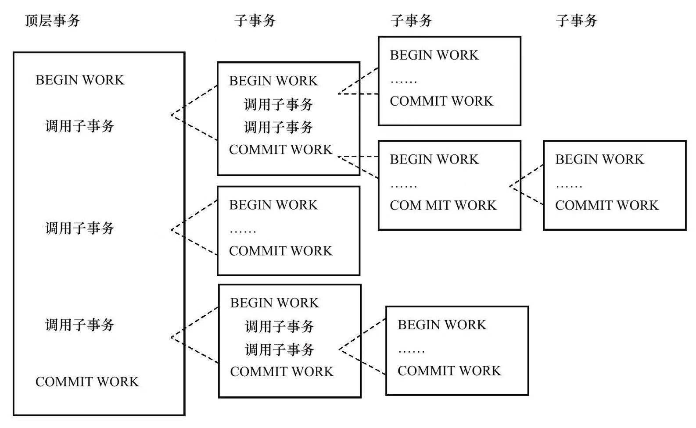

Moss对嵌套事务的定义：

1. 嵌套事务是由若干事务组成的一棵树，子树既可以是嵌套事务，也可以是扁平事务。
2. 处在叶节点的事务是扁平事务。但是每个子事务从根到叶节点的距离可以是不同的。
3. 位于根节点的事务称为顶层事务，其他事务称为子事务。事务的前驱称（predecessor）为父事务（parent），事务的下一层称为儿子事务（child）。
4. 子事务既可以提交也可以回滚。但是它的提交操作并不马上生效，除非其父事务已经提交。因此可以推论出，任何子事物都在顶层事务提交后才真正的提交。
5. 树中的任意一个事务的回滚会引起它的所有子事务一同回滚，故子事务仅保留A、C、I特性，不具有D的特性。

在Moss的理论中，实际的工作是交由叶子节点来完成的，即只有叶子节点的事务才能访问数据库、发送消息、获取其他类型的资源。而高层的事务仅负责逻辑控制，决定何时调用相关的子事务。即使一个系统不支持嵌套事务，用户也可以通过保存点技术来模拟嵌套事务

**分布式事务（Distributed Transactions）**通常是一个在分布式环境下运行的扁平事务，因此需要根据数据所在位置访问网络中的不同节点。

对于InnoDB存储引擎来说，其支持扁平事务、带有保存点的事务、链事务、分布式事务。对于嵌套事务，其并不原生支持，因此，对有并行事务需求的用户来说，MySQL数据库或InnoDB存储引擎就显得无能为力了。然而用户仍可以通过带有保存点的事务来模拟串行的嵌套事务。

## 事务的实现

事务隔离性由锁来实现。原子性、一致性、持久性通过数据库的redo log和undo log来完成。**redo log**称为重做日志，用来保证事务的**原子性和持久性**。**undo log**用来保证事务的**一致性**。

有人或许会认为undo是redo的逆过程，其实不然。redo和undo的作用都可以视为是一种恢复操作，redo恢复提交事务修改的页操作，而undo回滚行记录到某个特定版本。因此两者记录的内容不同，redo通常是物理日志，记录的是页的物理修改操作。undo是逻辑日志，根据每行记录进行记录。

### redo

#### 基本概念

重做日志用来实现事务的持久性，即事务ACID中的D。其由两部分组成：

1. 一是内存中的**重做日志缓冲（redo log buffer）**，其是易失的；
2. 二是**重做日志文件（redo log file）**，其是持久的。

InnoDB是事务的存储引擎，其通过**Force Log at Commit**机制实现事务的持久性，即当事务提交（COMMIT）时，必须先将该事务的所有日志写入到重做日志文件进行持久化，待事务的COMMIT操作完成才算完成。这里的日志是指重做日志，在InnoDB存储引擎中，由两部分组成，即redo log和undo log。redo log用来保证事务的持久性，undo log用来帮助事务回滚及MVCC的功能。redo log基本上都是顺序写的，在数据库运行时不需要对redo log的文件进行读取操作。而undo log是需要进行随机读写的。

为了确保每次日志都写入重做日志文件，在每次将重做日志缓冲写入重做日志文件后，InnoDB存储引擎都需要调用一次fsync操作。由于重做日志文件打开并没有使用O_DIRECT选项，因此重做日志缓冲先写入文件系统缓存。为了确保重做日志写入磁盘，必须进行一次fsync操作。**由于fsync的效率取决于磁盘的性能，因此磁盘的性能决定了事务提交的性能，也就是数据库的性能**。

InnoDB存储引擎允许用户手工设置非持久性的情况发生，以此提高数据库的性能。即当事务提交时，日志不写入重做日志文件，而是等待一个时间周期后再执行fsync操作。由于并非强制在事务提交时进行一次fsync操作，显然这可以显著提高数据库的性能。但是当数据库发生宕机时，由于部分日志未刷新到磁盘，因此会丢失最后一段时间的事务。

参数innodb_flush_log_at_trx_commit用来控制重做日志刷新到磁盘的策略。

- 该参数的默认值为1，表示事务提交时必须调用一次fsync操作。
- 0表示事务提交时不进行写入重做日志操作，这个操作仅在masterthread中完成，而在masterthread中每1秒会进行一次重做日志文件的fsync操作。
- 2表示事务提交时将重做日志写入重做日志文件，但仅写入文件系统的缓存中，不进行fsync操作。在这个设置下，当MySQL数据库发生宕机而操作系统不发生宕机时，并不会导致事务的丢失。而当操作系统宕机时，重启数据库后会丢失未从文件系统缓存刷新到重做日志文件那部分事务。

**binlog和redolog的区别**：

在MySQL数据库中还有一种二进制日志（binlog），其用来进行POINT-IN-TIME（PIT）的恢复及主从复制（Replication）环境的建立。从表面上看其和重做日志非常相似，都是记录了对于数据库操作的日志。然而，从本质上来看，两者有着非常大的不同。

- 首先，重做日志是在InnoDB存储引擎层产生，而二进制日志是在MySQL数据库的上层产生的，并且二进制日志不仅仅针对于InnoDB存储引擎，MySQL数据库中的任何存储引擎对于数据库的更改都会产生二进制日志。
- 其次，两种日志记录的内容形式不同。MySQL数据库上层的二进制日志是一种逻辑日志，其记录的是对应的SQL语句。而InnoDB存储引擎层面的重做日志是物理格式日志，其记录的是对于每个页的修改。
- 此外，两种日志记录写入磁盘的时间点不同。二进制日志(bin log)只在事务提交完成后进行一次写入。而InnoDB存储引擎的重做日志(redo log)在事务进行中不断地被写入，这表现为日志并不是随事务提交的顺序进行写入的。

#### log block

在InnoDB存储引擎中，重做日志都是以512字节进行存储的。这意味着重做日志缓存、重做日志文件都是以块（block）的方式进行保存的，称之为重做日志块（redo log block），每块的大小为512字节。

若一个页中产生的重做日志数量大于512字节，那么需要分割为多个重做日志块进行存储。此外，由于**重做日志块的大小和磁盘扇区大小一样，都是512字节，因此重做日志的写入可以保证原子性，不需要double write技术**。

重做日志块除了日志本身之外，还由日志块头（log block header）及日志块尾（log block tailer）两部分组成。重做日志头一共占用12字节，重做日志尾占用8字节。故每个重做日志块实际可以存储的大小为492字节。

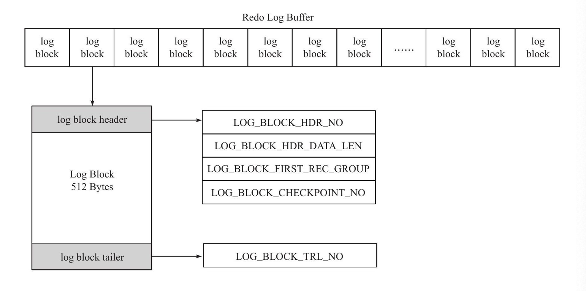

重做日志缓存由每个为512字节大小的日志块所组成。日志块由三部分组成，依次为日志块头（log block header）、日志内容（log body）、日志块尾（log block tailer）。

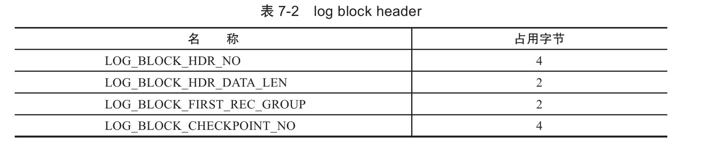

log buffer是由log block组成，在内部log buffer就好似一个数组，因此LOG_BLOCK_HDR_NO用来标记这个数组中的位置。其是递增并且循环使用的，占用4个字节，但是由于第一位用来判断是否是flush bit，所以最大的值为2G。

LOG_BLOCK_HDR_DATA_LEN占用2字节，表示log block所占用的大小。当log block被写满时，该值为0x200，表示使用全部logblock空间，即占用512字节。

LOG_BLOCK_FIRST_REC_GROUP占用2个字节，表示logblock中第一个日志所在的偏移量。如果该值的大小和LOG_BLOCK_HDR_DATA_LEN相同，则表示当前log block不包含新的日志。

LOG_BLOCK_CHECKPOINT_NO占用4字节，表示该logblock最后被写入时的检查点第4字节的值。

log block tailer只由1个部分组成，且其值和LOG_BLOCK_HDR_NO相同，并在函数log_block_init中被初始化。


#### log group

log group为重做日志组，其中有多个重做日志文件。虽然源码中已支持log group的镜像功能，但是在ha_innobase.cc文件中禁止了该功能。因此InnoDB存储引擎实际只有一个log group。

log group是一个逻辑上的概念，并没有一个实际存储的物理文件来表示log group信息。log group由多个重做日志文件组成，每个log group中的日志文件大小是相同的，且在InnoDB 1.2版本之前，重做日志文件的总大小要小于4GB（不能等于4GB）。从InnoDB 1.2版本开始重做日志文件总大小的限制提高为了512GB。InnoSQL版本的InnoDB存储引擎在1.1版本就支持大于4GB的重做日志。

重做日志文件中存储的就是之前在log buffer中保存的log block，因此其也是根据块的方式进行物理存储的管理，每个块的大小与log block一样，同样为512字节。在InnoDB存储引擎运行过程中，log buffer根据一定的规则将内存中的log block刷新到磁盘。这个规则具体是：

- 事务提交时
- 当log buffer中有一半的内存空间已经被使用时
- log check point时

对于log block的写入追加（append）在redo log file的最后部分，当一个redo log file被写满时，会接着写入下一个redo log file，其使用方式为round-robin。

redo log file除了保存logbuffer刷新到磁盘的log block，还保存了一些其他的信息，这些信息一共占用2KB大小，即每个redo log file的前2KB的部分不保存logblock的信息。对于log group中的第一个redo log file，其前2KB的部分保存4个512字节大小的块。

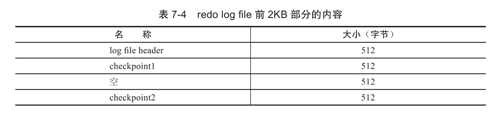

上述信息仅在每个log group的第一个redo log file中进行存储。log group中的其余redo log file仅保留这些空间，但不保存上述信息。正因为保存了这些信息，就意味着对redo log file的写入并不是完全顺序的。因为其除了log block的写入操作，还需要更新前2KB部分的信息，这些信息对于InnoDB存储引擎的恢复操作来说非常关键和重要。

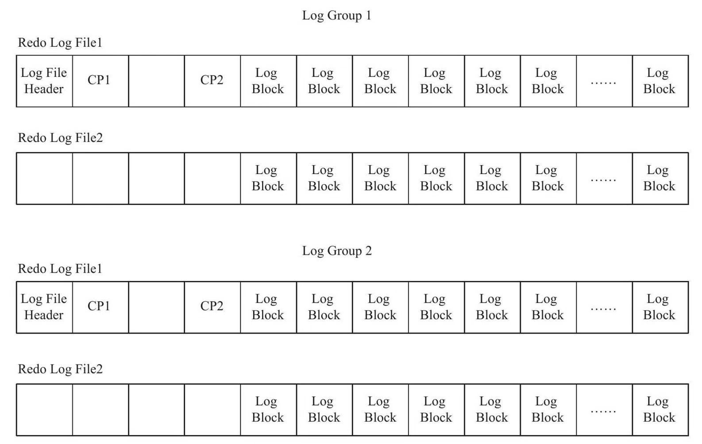

在log filer header后面的部分为InnoDB存储引擎保存的checkpoint（检查点）值，其设计是交替写入，这样的设计避免了因介质失败而导致无法找到可用的checkpoint的情况。

#### 重做日志格式

不同的数据库操作会有对应的重做日志格式。此外，由于InnoDB存储引擎的存储管理是基于页的，故其重做日志格式也是基于页的。虽然有着不同的重做日志格式，但是它们有着通用的头部格式:

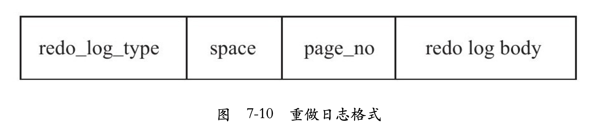

通用的头部格式由以下3部分组成：

- redo_log_type：重做日志的类型。
- space：表空间的ID。
- page_no：页的偏移量。

之后redo log body的部分，根据重做日志类型的不同，会有不同的存储内容，例如，对于页上记录的插入和删除操作，分别对应如下图所示的格式：

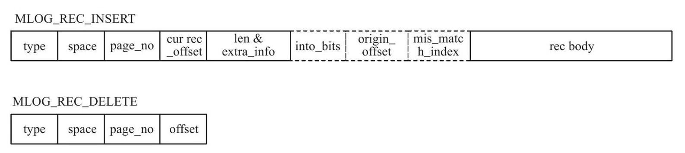

到InnoDB1.2版本时，一共有51种重做日志类型。

#### LSN(Log Sequence Number)

LSN是Log Sequence Number的缩写，其代表的是日志序列号。在InnoDB存储引擎中，LSN占用8字节，并且单调递增。LSN表示的含义有：

- 重做日志写入的总量
- checkpoint的位置
- 页的版本

**LSN表示事务写入重做日志的字节的总量，其单位是字节。**例如当前重做日志的LSN为1 000，有一个事务T1写入了100字节的重做日志，那么LSN就变为了1100，若又有事务T2写入了200字节的重做日志，那么LSN就变为了1 300。

LSN不仅记录在重做日志中，还存在于每个页中。在每个页的头部，有一个值FIL_PAGE_LSN，记录了该页的LSN。在页中，LSN表示该页最后刷新时LSN的大小。因为重做日志记录的是每个页的日志，因此页中的LSN用来判断页是否需要进行恢复操作。

例如，页P1的LSN为10 000，而数据库启动时，InnoDB检测到写入重做日志中的LSN为13 000，并且该事务已经提交，那么数据库需要进行恢复操作，将重做日志应用到P1页中。同样的，对于重做日志中LSN小于P1页的LSN，不需要进行重做，因为P1页中的LSN表示页已经被刷新到该位置。

用户可以通过命令SHOW ENGINE INNODB STATUS查看LSN的情况：

```mysql
mysql> SHOW ENGINE INNODB STATUS\G;
---
LOG
---
Log sequence number 7526155083
Log flushed up to   7526155083
Pages flushed up to 7526155083
Last checkpoint at  7526155074
0 pending log flushes, 0 pending chkp writes
79 log i/o's done, 0.00 log i/o's/second
```

Log sequence number表示当前的LSN，Log flushed up to表示刷新到重做日志文件的LSN，Last checkpoint at表示刷新到磁盘的LSN。

#### 恢复

InnoDB存储引擎在启动时不管上次数据库运行时是否正常关闭，都会尝试进行恢复操作。因为重做日志记录的是物理日志，因此恢复的速度比逻辑日志，如二进制日志，要快很多。与此同时，InnoDB存储引擎自身也对恢复进行了一定程度的优化，如顺序读取及并行应用重做日志，这样可以进一步地提高数据库恢复的速度。

由于checkpoint表示已经刷新到磁盘页上的LSN，因此在恢复过程中仅需恢复checkpoint开始的日志部分。

InnoDB存储引擎的重做日志是物理日志，因此其恢复速度较之二进制日志恢复快得多。例如对于INSERT操作，其记录的是每个页上的变化。

记录的是页的物理修改操作，若插入涉及B+树的split，可能会有更多的页需要记录日志。此外，由于重做日志是物理日志，因此其是**幂等**的。

有的开发人员错误地认为只要将二进制日志的格式设置为ROW，那么二进制日志也是幂等的。这显然是错误的，举个简单的例子，INSERT操作在二进制日志中就不是幂等的，重复执行可能会插入多条重复的记录。而redo log 的INSERT操作是幂等的。

### undo

#### 基本概念

重做日志记录了事务的行为，可以很好地通过其对页进行“重做”操作。但是事务有时还需要进行回滚操作，这时就需要undo。因此在对数据库进行修改时，InnoDB存储引擎不但会产生redo，还会产生一定量的undo。这样如果用户执行的事务或语句由于某种原因失败了，又或者用户用一条ROLLBACK语句请求回滚，就可以利用这些undo信息将数据回滚到修改之前的样子。

redo存放在重做日志文件中，与redo不同，undo存放在数据库内部的一个特殊段（segment）中，这个段称为undo段（undo segment）。undo段位于共享表空间内。

用户通常对undo有这样的误解：undo用于将数据库物理地恢复到执行语句或事务之前的样子——但事实并非如此。

**undo是逻辑日志，因此只是将数据库逻辑地恢复到原来的样子。所有修改都被逻辑地取消了，但是数据结构和页本身在回滚之后可能大不相同。**这是因为在多用户并发系统中，可能会有数十、数百甚至数千个并发事务。数据库的主要任务就是协调对数据记录的并发访问。比如，一个事务在修改当前一个页中某几条记录，同时还有别的事务在对同一个页中另几条记录进行修改。因此，不能将一个页回滚到事务开始的样子，因为这样会影响其他事务正在进行的工作。

例如，用户执行了一个INSERT 10W条记录的事务，这个事务会导致分配一个新的段，即表空间会增大。在用户执行ROLLBACK时，会将插入的事务进行回滚，但是表空间的大小并不会因此而收缩。因此，当InnoDB存储引擎回滚时，它实际上做的是与先前相反的工作。对于每个INSERT，InnoDB存储引擎会完成一个DELETE；对于每个DELETE，InnoDB存储引擎会执行一个INSERT；对于每个UPDATE，InnoDB存储引擎会执行一个相反的UPDATE，将修改前的行放回去。

当InnoDB存储引擎回滚时，它实际上做的是与先前相反的工作。对于每个INSERT，InnoDB存储引擎会完成一个DELETE；对于每个DELETE，InnoDB存储引擎会执行一个INSERT；对于每个UPDATE，InnoDB存储引擎会执行一个相反的UPDATE，将修改前的行放回去。

除了回滚操作，undo的另一个作用是MVCC，**即在InnoDB存储引擎中MVCC的实现是通过undo来完成**。当用户读取一行记录时，若该记录已经被其他事务占用，当前事务可以通过undo读取之前的行版本信息，以此实现非锁定读取。

最后也是最为重要的一点是，**undo log会产生redo log，也就是undo log的产生会伴随着redo log的产生，这是因为undo log也需要持久性的保护。**

#### undo 存储管理

InnoDB存储引擎对undo的管理同样采用段的方式。首先InnoDB存储引擎有rollback segment，每个回滚段种记录了1024个undo log segment，而在每个undo log segment段中进行undo页的申请。共享表空间偏移量为5的页（0，5）记录了所有rollback segment header所在的页，这个页的类型为FIL_PAGE_TYPE_SYS。

在InnoDB1.1版本之前（不包括1.1版本），只有一个rollback segment，因此支持同时在线的事务限制为1024。虽然对绝大多数的应用来说都已经够用，但不管怎么说这是一个瓶颈。从1.1版本开始InnoDB支持最大128个rollback segment，故其支持同时在线的事务限制提高到了128*1024。

从InnoDB1.2版本开始，可通过参数对rollback segment做进一步的设置。这些参数包括：

- innodb_undo_directory：用于设置rollback segment文件所在的路径。这意味着rollback segment可以存放在共享表空间以外的位置，即可以设置为独立表空间。该参数的默认值为“.”，表示当前InnoDB存储引擎的目录。
- innodb_undo_logs：参数innodb_undo_logs用来设置rollback segment的个数，默认值为128。在InnoDB1.2版本中，该参数用来替换之前版本的参数innodb_rollback_segments。
- innodb_undo_tablespaces：参数innodb_undo_tablespaces用来设置构成rollback segment文件的数量，这样rollback segment可以较为平均地分布在多个文件中。设置该参数后，会在路径innodb_undo_directory看到undo为前缀的文件，该文件就代表rollback segment文件。

```mysql
mysql> show variables like 'innodb_undo%';
+--------------------------+-------+
| Variable_name            | Value |
+--------------------------+-------+
| innodb_undo_directory    | ./    |
| innodb_undo_log_truncate | OFF   |
| innodb_undo_logs         | 128   |
| innodb_undo_tablespaces  | 0     |
+--------------------------+-------+
4 rows in set (0.03 sec)

mysql> show variables like 'datadir';
+---------------+------------------------+
| Variable_name | Value                  |
+---------------+------------------------+
| datadir       | /usr/local/mysql/data/ |
+---------------+------------------------+
1 row in set (0.01 sec)
```

需要特别注意的是，事务在undo log segment分配页并写入undo log的这个过程同样需要写入重做日志。当事务提交时，InnoDB存储引擎会做以下两件事情：

- 将undo log放入列表中，以供之后的purge操作
- 判断undo log所在的页是否可以重用，若可以分配给下个事务使用

事务提交后并不能马上删除undo log及undo log所在的页。这是因为可能还有其他事务需要通过undo log来得到行记录之前的版本。故事务提交时将undo log放入一个链表中，是否可以最终删除undo log及undo log所在页由purge线程来判断。

此外，若为每一个事务分配一个单独的undo页会非常浪费存储空间，因此，在InnoDB存储引擎的设计中对undo页可以进行重用。具体来说，当事务提交时，首先将undo log放入链表中，然后判断undo页的使用空间是否小于3/4，若是则表示该undo页可以被重用，之后新的undo log记录在当前undo log的后面。由于存放undo log的列表是以记录进行组织的，而undo页可能存放着不同事务的undo log，因此purge操作需要涉及磁盘的离散读取操作，是一个比较缓慢的过程。

可以通过命令SHOW ENGINE INNODB STATUS来查看链表中undo log的数量。

```mysql
mysql> SHOW ENGINE INNODB STATUS\G;
------------
TRANSACTIONS
------------
Trx id counter 27784451
Purge done for trx's n:o < 27783953 undo n:o < 0 state: running but idle
History list length 2
LIST OF TRANSACTIONS FOR EACH SESSION:
---TRANSACTION 421791692621616, not started
0 lock struct(s), heap size 1136, 0 row lock(s)
```

History list length就代表了undo log的数量。purge操作会减少该值。然而由于undo log所在的页可以被重用，因此即使操作发生，History list length的值也可以不为0。

#### undo log 格式

在InnoDB存储引擎中，undo log分为：

- insert undo log
- update undo log

insert undo log是指在insert操作中产生的undo log。因为insert操作的记录，只对事务本身可见，对其他事务不可见（这是事务隔离性的要求），故该undo log可以在事务提交后直接删除。不需要进行purge操作。（因为事务提交之后也没有回滚的需求了，所以可以直接删除)。

insert undo log的格式：

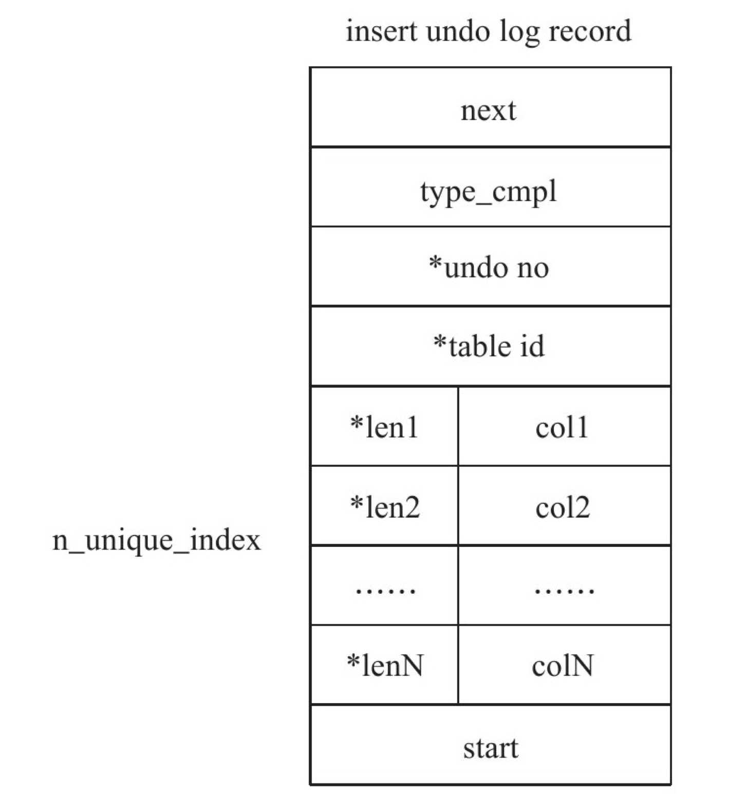

*表示对存储的字段进行了压缩

- next: insert undo log开始的前两个字节next记录的是下一个undo log的位置，通过该next的字节可以知道一个undo log所占的空间字节数。
- 尾部的两个字节记录的是undolog的开始位置。
- type_cmpl占用一个字节，记录的是undo的类型，对于insertundolog，该值总是为11。
- undo_no记录事务的ID，table_id记录undolog所对应的表对象。这两个值都是在压缩后保存的。
- 接着的部分记录了所有主键的列和值。在进行rollback操作时，根据这些值可以定位到具体的记录，然后进行删除即可。

update undo log记录的是对delete和update操作产生的undo log。该undo log可能需要提供MVCC机制，因此不能在事务提交时就进行删除。提交时放入undo log链表，等待purge线程进行最后的删除。

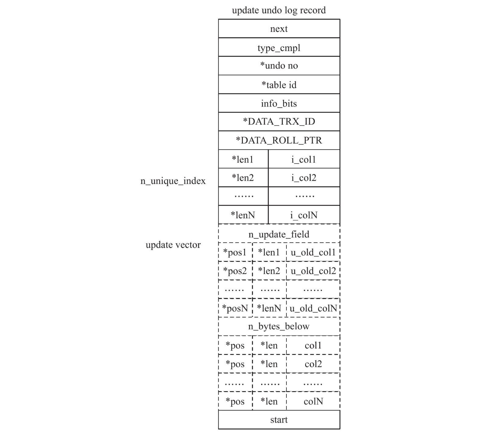

next、start、undo_no、table_id与之前介绍的insertundolog部分相同。

type_cmpl，可能的值如下：

- 12 TRX_UNDO_UPD_EXIST_REC更新non-delete-mark的记录
- 13 TRX_UNDO_UPD_DEL_REC将delete的记录标记为not delete
- 14 TRX_UNDO_DEL_MARK_REC将记录标记为delete

接着的部分记录update_vector信息，update_vector表示update操作导致发生改变的列。每个修改的列信息都要记录的undolog中。对于不同的undolog类型，可能还需要记录对索引列所做的修改。

#### 查看undo信息

delete操作并不直接删除记录，而只是将记录标记为已删除，也就是将记录的delete flag设置为1。而记录最终的删除是在purge操作中完成。

update主键的操作其实分两步完成。首先将原主键记录标记为已删除，因此需要产生一个类型为TRX_UNDO_DEL_MARK_REC的undo log，之后插入一条新的记录，因此需要产生一个类型为TRX_UNDO_INSERT_REC的undo log。

### purge

delete和update操作可能并不直接删除原有的数据。

例如执行如下语句：

```mysql
delete from t where a=1;
```

表t上列a有聚集索引，列b上有辅助索引。对于上述的delete操作，通过前面关于undo log的介绍已经知道仅是将主键列等于1的记录delete flag设置为1，记录并没有被删除，即记录还是存在于B+树中。其次，对辅助索引上a等于1，b等于1的记录同样没有做任何处理，甚至没有产生undo log。而真正删除这行记录的操作其实被“延时”了，最终在purge操作中完成。

purge用于最终完成delete和update操作。这样设计是因为InnoDB存储引擎支持MVCC，所以记录不能在事务提交时立即进行处理。这时其他事物可能正在引用这行，故InnoDB存储引擎需要保存记录之前的版本。而是否可以删除该条记录通过purge来进行判断。若该行记录已不被任何其他事务引用，那么就可以进行真正的delete操作。可见，purge操作是清理之前的delete和update操作，将上述操作“最终”完成。而实际执行的操作为delete操作，清理之前行记录的版本。

为了节省存储空间，InnoDB存储引擎的undolog设计是这样的：一个页上允许多个事务的undolog存在。虽然这不代表事务在全局过程中提交的顺序，但是后面的事务产生的undo log总在最后。此外，InnoDB存储引擎还有一个history列表，它根据事务提交的顺序，将undolog进行链接。

historylist表示按照事务提交的顺序将undo log进行组织。在InnoDB存储引擎的设计中，先提交的事务总在尾端。undo page存放了undo log，由于可以重用，因此一个undo page中可能存放了多个不同事务的undo log。

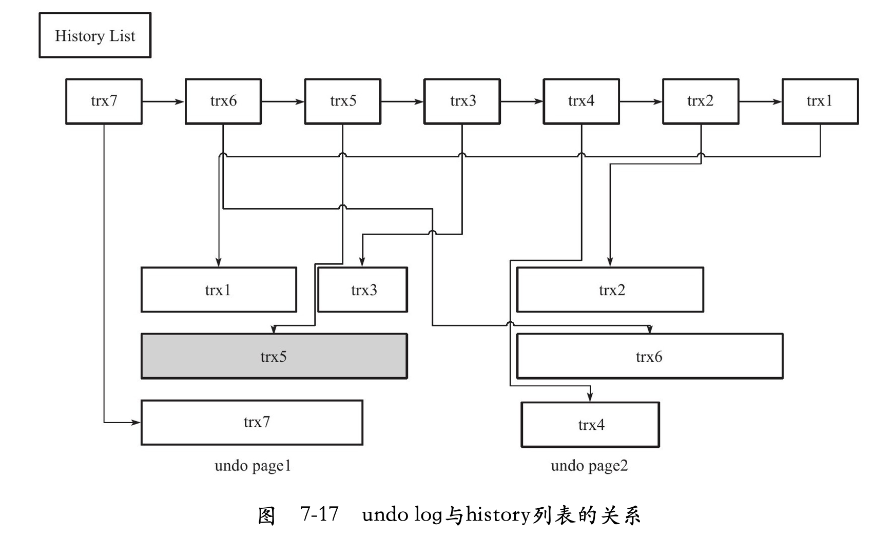

trx5的灰色阴影表示该undolog还被其他事务引用。

在执行purge的过程中，InnoDB存储引擎首先从historylist中找到第一个需要被清理的记录，这里为trx1，清理之后InnoDB存储引擎会在trx1的undo log所在的页中继续寻找是否存在可以被清理的记录，这里会找到事务trx3，接着找到trx5，但是发现trx5被其他事务所引用而不能清理，故去再次去history list中查找，发现这时最尾端的记录为trx2，接着找到trx2所在的页，然后依次再把事务trx6、trx4的记录进行清理。由于undo page2中所有的页都被清理了，因此该undo page可以被重用。

InnoDB存储引擎这种先从historylist中找undo log，然后再从undo page中找undo log的设计模式是为了**避免大量的随机读取操作，从而提高purge的效率。**

全局动态参数innodb_purge_batch_size用来设置每次purge操作需要清理的undo page数量。在InnoDB1.2之前，该参数的默认值为20。而从1.2版本开始，该参数的默认值为300。通常来说，该参数设置得越大，每次回收的undo page也就越多，这样可供重用的undo page就越多，减少了磁盘存储空间与分配的开销。不过，若该参数设置得太大，则每次需要purge处理更多的undo page，从而导致CPU和磁盘IO过于集中于对undo log的处理，使性能下降。

当InnoDB存储引擎的压力非常大时，并不能高效地进行purge操作。那么history list的长度会变得越来越长。全局动态参数innodb_max_purge_lag用来控制history list的长度，若长度大于该参数时，其会“延缓”DML的操作。该参数默认值为0，表示不对historylist做任何限制。当大于0时，就会延缓DML的操作。该参数默认值为0，表示不对history list做任何限制。当大于0时，就会延缓DML的操作，其延缓的算法为：

```mysql
delay = ((length(history_list) - innodb_max_purge_lag) * 10) - 5
```

delay的单位是毫秒。此外，需要特别注意的是，delay的对象是行，而不是一个DML操作。例如当一个update操作需要更新5行数据时，每行数据的操作都会被delay，故总的延时时间为5*delay。而delay的统计会在每一次purge操作完成后，重新进行计算。

InnoDB1.2版本引入了新的全局动态参数innodb_max_purge_lag_delay，其用来控制delay的最大毫秒数。也就是当上述计算得到的delay值大于该参数时，将delay设置为innodb_max_purge_lag_delay，避免由于purge操作缓慢导致其他SQL线程出现无限制的等待。

### group commit

若事务为非只读事务，则每次事务提交时需要进行一次fsync操作，以此保证重做日志都已经写入磁盘。当数据库发生宕机时，可以通过重做日志进行恢复。虽然固态硬盘的出现提高了磁盘的性能，然而磁盘的fsync性能是有限的。为了提高磁盘fsync的效率，当前数据库都提供了group commit的功能，即一次fsync可以刷新确保多个事务日志被写入文件。对于InnoDB存储引擎来说，事务提交时会进行两个阶段的操作

1. 修改内存中事务对应的信息，并且将日志写入重做日志缓冲.
2. 调用fsync将确保日志都从重做日志缓冲写入磁盘。

步骤2 相对步骤1 是一个较慢的过程，这是因为存储引擎需要与磁盘打交道。但当有事务进行这个过程时，其他事务可以进行步骤1的操作，正在提交的事物完成提交操作后，再次进行步骤2时，可以将多个事务的重做日志通过一次fsync刷新到磁盘，这样就大大地减少了磁盘的压力，从而提高了数据库的整体性能。对于写入或更新较为频繁的操作，group commit的效果尤为明显。

然而在InnoDB1.2版本之前，在开启二进制日志后，InnoDB存储引擎的group commit功能会失效，从而导致性能的下降。并且在线环境多使用replication环境，因此二进制日志的选项基本都为开启状态，因此这个问题尤为显著。导致这个问题的原因是在开启二进制日志后，为了保证存储引擎层中的事务和二进制日志的一致性，二者之间使用了两阶段事务，其步骤如下：

1. 当事务提交时InnoDB存储引擎进行prepare操作。
2. MySQL数据库上层写入二进制日志。
3. InnoDB存储引擎层将日志写入重做日志文件。
   1. 修改内存中事务对应的信息，并且将日志写入重做日志缓冲。
   2. 调用fsync将确保日志都从重做日志缓冲写入磁盘。

一旦步骤2）中的操作完成，就确保了事务的提交，即使在执行步骤3）时数据库发生了宕机。此外需要注意的是，每个步骤都需要进行一次fsync操作才能保证上下两层数据的一致性。步骤2）的fsync由参数sync_binlog控制，步骤3）的fsync由参数innodb_flush_log_at_trx_commit控制。

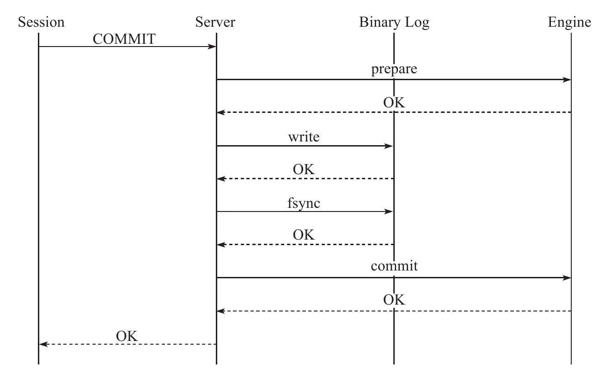

为了保证MySQL数据库上层二进制日志的写入顺序和InnoDB层的事务提交顺序一致，MySQL数据库内部使用了prepare_commit_mutex这个锁。但是在启用这个锁之后，步骤3）中的步骤a）步不可以在其他事务执行步骤b）时进行，从而导致了group commit失效。

通过锁prepare_commit_mutex保证InnoDB存储引擎层事务提交与MySQL数据库上层的二进制日志写入的顺序性:

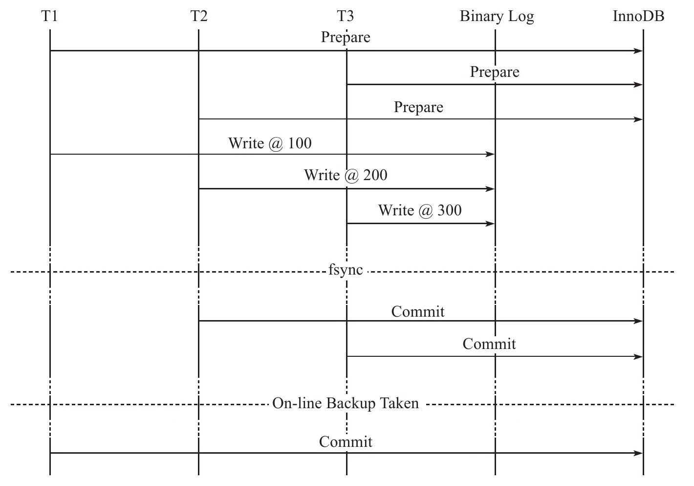


#### Binary Log Group Commit（BLGC）

MySQL5.6BLGC的实现方式是将事务提交的过程分为几个步骤来完成。

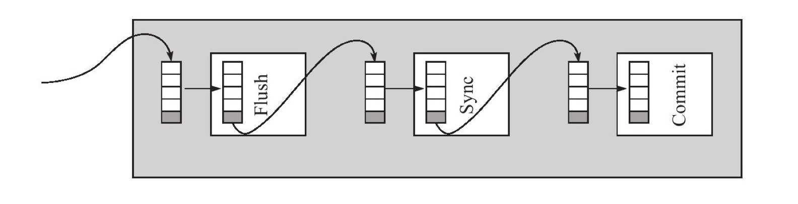

在MySQL数据库上层进行提交时首先按顺序将其放入一个队列中，队列中的第一个事务称为leader，其他事务称为follower，leader控制着follower的行为。

BLGC的步骤分为以下三个阶段：

- Flush阶段，将每个事务的二进制日志(binlog)写入内存中。
- Sync阶段，将内存中的二进制日志(binlog)刷新到磁盘，若队列中有多个事务，那么仅一次fsync操作就完成了二进制日志的写入，这就是**BLGC**。
- Commit阶段，leader根据顺序调用存储引擎层事务的提交，InnoDB存储引擎本就支持group commit，因此修复了原先由于锁prepare_commit_mutex导致group commit失效的问题。

当有一组事务在进行Commit阶段时，其他新事物可以进行Flush阶段，从而使group commit不断生效。当然group commit的效果由队列中事务的数量决定，若每次队列中仅有一个事务，那么可能效果和之前差不多，甚至会更差。但当提交的事务越多时，group commit的效果越明显，数据库性能的提升也就越大。

参数binlog_max_flush_queue_time用来控制Flush阶段中等待的时间，即使之前的一组事务完成提交，当前一组的事务也不马上进入Sync阶段，而是至少需要等待一段时间。这样做的好处是group commit的事务数量更多，然而这也可能会导致事务的响应时间变慢。该参数的默认值为0，且推荐设置依然为0。除非用户的MySQL数据库系统中有着大量的连接（如100个连接），并且不断地在进行事务的写入或更新操作。

## 事务控制语句

在MySQL命令行的默认设置下，事务都是自动提交（autocommit）的，即执行SQL语句后就会马上执行COMMIT操作。因此要显式地开启一个事务需使用命令BEGIN、STARTTRANSACTION，或者执行命令SETAUTOCOMMIT=0，禁用当前会话的自动提交。

事务控制语句：

1. START TRANSACTION|BEGIN：显式地开启一个事务。
2. COMMIT：要想使用这个语句的最简形式，只需发出COMMIT。也可以更详细一些，写为COMMIT WORK，不过这二者几乎是等价的。COMMIT会提交事务，并使得已对数据库做的所有修改成为永久性的。
3. ROLLBACK：要想使用这个语句的最简形式，只需发出ROLLBACK。同样地，也可以写为ROLLBACK WORK，但是二者几乎是等价的。回滚会结束用户的事务，并撤销正在进行的所有未提交的修改。
4. SAVEPOINT identifier∶SAVEPOINT允许在事务中创建一个保存点，一个事务中可以有多个SAVEPOINT。
5. RELEASE SAVEPOINT identifier：删除一个事务的保存点，当没有一个保存点执行这句语句时，会抛出一个异常。
6. ROLLBACK TO[SAVEPOINT]identifier：这个语句与SAVEPOINT命令一起使用。可以把事务回滚到标记点，而不回滚在此标记点之前的任何工作。例如可以发出两条UPDATE语句，后面跟一个SAVEPOINT，然后又是两条DELETE语句。如果执行DELETE语句期间出现了某种异常情况，并且捕获到这个异常，同时发出了ROLLBACK TO SAVEPOINT命令，事务就会回滚到指定的SAVEPOINT，撤销DELETE完成的所有工作，而UPDATE语句完成的工作不受影响。
7. SET TRANSACTION：这个语句用来设置事务的隔离级别。InnoDB存储引擎提供的事务隔离级别有：READ UNCOMMITTED、READ COMMITTED、REPEATABLE READ、SERIALIZABLE。

START TRANSACTION、BEGIN语句都可以在MySQL命令行下显式地开启一个事务。但是在存储过程中，MySQL数据库的分析器会自动将BEGIN识别为BEGIN…END，因此在存储过程中只能使用START TRANSACTION语句来开启一个事务。

COMMIT和COMMIT WORK语句基本是一致的，都是用来提交事务。不同之处在于COMMIT WORK用来控制事务结束后的行为是CHAIN还是RELEASE的。如果是CHAIN方式，那么事务就变成了链事务。

用户可以通过参数completion_type来进行控制，该参数默认为0，表示没有任何操作。在这种设置下COMMIT和COMMIT WORK是完全等价的。

- 当参数completion_type的值为1时，COMMIT WORK等同于COMMIT AND CHAIN，表示马上自动开启一个相同隔离级别的事务。
- 参数completion_type为2时，COMMIT WORK等同于COMMIT AND RELEASE。在事务提交后会自动断开与服务器的连接。

InnoDB存储引擎中的事务都是原子的，这说明下述两种情况：构成事务的每条语句都会提交（成为永久），或者所有语句都回滚。这种保护还延伸到单个的语句。一条语句要么完全成功，要么完全回滚（注意，这里说的是语句回滚）。因此一条语句失败并抛出异常时，并不会导致先前已经执行的语句自动回滚。所有的执行都会得到保留，必须由用户自己来决定是否对其进行提交或回滚的操作。

另一个容易犯的错误是ROLLBACK TO SAVEPOINT，虽然有ROLLBACK，但其并不是真正地结束一个事务，因此即使执行了ROLLBACK TO SAVEPOINT，之后也需要显式地运行COMMIT或ROLLBACK命令。(ROLLBACK TO SAVEPOINT命令并不真正地结束事务。)

## 隐式提交的SQL语句

以下这些SQL语句会产生一个隐式的提交操作，即执行完这些语句后，会有一个隐式的COMMIT操作。

- DDL语句：ALTER DATABASE...UPGRADE DATA DIRECTORY NAME，ALTER EVENT，ALTER PROCEDURE，ALTER TABLE，ALTER VIEW，CREATE DATABASE，CREATE EVENT，CREATE INDEX，CREATE PROCEDURE，CREATE TABLE，CREATE TRIGGER，CREATE VIEW，DROP DATABASE，DROP EVENT，DROP INDEX，DROP PROCEDURE，DROP TABLE，DROP TRIGGER，DROP VIEW，RENAME TABLE，TRUNCATE TABLE。
- 用来隐式地修改MySQL架构的操作：CREATE USER、DROP USER、GRANT、RENAME USER、REVOKE、SET PASSWORD。
- 管理语句：ANALYZE TABLE、CACHE INDEX、CHECK TABLE、LOAD INDEX INTO CACHE、OPTIMIZE TABLE、REPAIR TABLE。

TRUNCATE TABLE语句是DDL，因此虽然和对整张表执行DELETE的结果是一样的，但它是不能被回滚的。

## 事务的隔离级别

SQL标准定义的四个隔离级别为：

- READ UNCOMMITTED
- READ COMMITTED
- REPEATABLE READ
- SERIALIZABLE 

InnoDB存储引擎默认支持的隔离级别是REPEATABLE READ，但是与标准SQL不同的是，InnoDB存储引擎在REPEATABLE READ事务隔离级别下，使用Next-Key Lock锁的算法，因此避免幻读的产生。这与其他数据库系统（如Microsoft SQL Server数据库）是不同的。所以说，InnoDB存储引擎在默认的REPEATABLE READ的事务隔离级别下已经能完全保证事务的隔离性要求，即达到SQL标准的SERIALIZABLE隔离级别。

隔离级别越低，事务请求的锁越少或保持锁的时间就越短。这也是为什么大多数数据库系统默认的事务隔离级别是READ COMMITTED。

查看当前会话事务隔离级别:

```mysql
mysql> select@@tx_isolation\G;
*************************** 1. row ***************************
@@tx_isolation: REPEATABLE-READ
1 row in set, 1 warning (0.01 sec)
```

查看全局的事务隔离级别，可以使用：

```mysql
mysql> select@@global.tx_isolation\G;
*************************** 1. row ***************************
@@global.tx_isolation: REPEATABLE-READ
1 row in set, 1 warning (0.00 sec)
```

在SERIALIABLE的事务隔离级别，InnoDB存储引擎会对每个SELECT语句后自动加上LOCKIN SHARE MODE，即为每个读取操作加一个共享锁。因此在这个事务隔离级别下，读占用了锁，对一致性的非锁定读不再予以支持。这时，事务隔离级别SERIALIZABLE符合数据库理论上的要求，即事务是well-formed的，并且是two-phrased的。

因为InnoDB存储引擎在REPEATABLEREAD隔离级别下就可以达到3°的隔离，因此一般不在本地事务中使用SERIALIABLE的隔离级别。SERIALIABLE的事务隔离级别主要用于InnoDB存储引擎的分布式事务。

在READ COMMITTED的事务隔离级别下，除了唯一性的约束检查及外键约束的检查需要gap lock，InnoDB存储引擎不会使用gap lock的锁算法。但是使用这个事务隔离级别需要注意一些问题。首先，在MySQL5.1中，READ COMMITTED事务隔离级别默认只能工作在replication（复制）二进制日志为ROW的格式下。如果二进制日志工作在默认的STATEMENT下，则会出现错误。

### READ COMMITTED隔离级别+STATEMENT binlog 主从不一致举例

在master开启一个会话A执行如下事务，并且不要提交:

```mysql
# session A

BEGIN;

DELETE FROM a where b<=5;
```

同样，在master上开启另一个会话B，执行如下事务，并且提交：

```mysql
# session B

BEGIN;

INSERT INTO a select 3;

COMMIT;
```

接着会话A提交，并查看表a中的数据：

```mysql
# session A
COMMIT;

select * from a\G;

b:3
```

但是在slave上看到的结果却是：

```mysql
#slave
select * from a\G;

empty set
```

导致这个问题发生的原因有两点：

- 在READ COMMITTED事务隔离级别下，事务没有使用gap lock进行锁定，因此用户在会话B中可以在小于等于5的范围内插入一条记录；
- STATEMENT格式记录的是master上产生的SQL语句，因此在master服务器上执行的顺序为先删后插，但是在STATEMENT格式中记录的却是先插后删，逻辑顺序上产生了不一致。（因为commit的时候才提交binlog）

要避免主从不一致的问题，只需解决上述问题中的一个就能保证数据的同步了。如使用READ REPEATABLE的事务隔离级别可以避免上述第一种情况的发生，也就避免了master和slave数据不一致问题的产生。

在MySQL 5.1版本之后，因为支持了ROW格式的二进制日志记录格式，避免了第二种情况的发生，所以可以放心使用READ COMMITTED的事务隔离级别。但即使不使用READ COMMITTED的事务隔离级别，也应该考虑将二进制日志的格式更换成ROW，因为这个格式记录的是行的变更，而不是简单的SQL语句，所以可以避免一些不同步现象的产生，进一步保证数据的同步。InnoDB存储引擎的创始人HeikkiTuuri也在http:∥bugs.mysql.com/bug.php?id=33210这个帖子中建议使用ROW格式的二进制日志。

## 分布式事务

### MySQL数据库分布式事务

InnoDB存储引擎提供了对XA事务的支持，并通过XA事务来支持分布式事务的实现。分布式事务指的是允许多个独立的事务资源（transactional resources）参与到一个全局的事务中。事务资源通常是关系型数据库系统，但也可以是其他类型的资源。全局事务要求在其中的所有参与的事务要么都提交，要么都回滚，这对于事务原有的ACID要求又有了提高。另外，在使用分布式事务时，InnoDB存储引擎的事务隔离级别必须设置为**SERIALIZABLE**。

XA事务允许不同数据库之间的分布式事务，如一台服务器是MySQL数据库的，另一台是Oracle数据库的，又可能还有一台服务器是SQL Server数据库的，只要参与在全局事务中的每个节点都支持XA事务。

XA事务由一个或多个资源管理器（Resource Managers）、一个事务管理器（Transaction Manager）以及一个应用程序（Application Program）组成。

- 资源管理器：提供访问事务资源的方法。通常一个数据库就是一个资源管理器。
- 事务管理器：协调参与全局事务中的各个事务。需要和参与全局事务的所有资源管理器进行通信。
- 应用程序：定义事务的边界，指定全局事务中的操作。

在MySQL数据库的分布式事务中，资源管理器就是MySQL数据库，事务管理器为连接MySQL服务器的客户端。

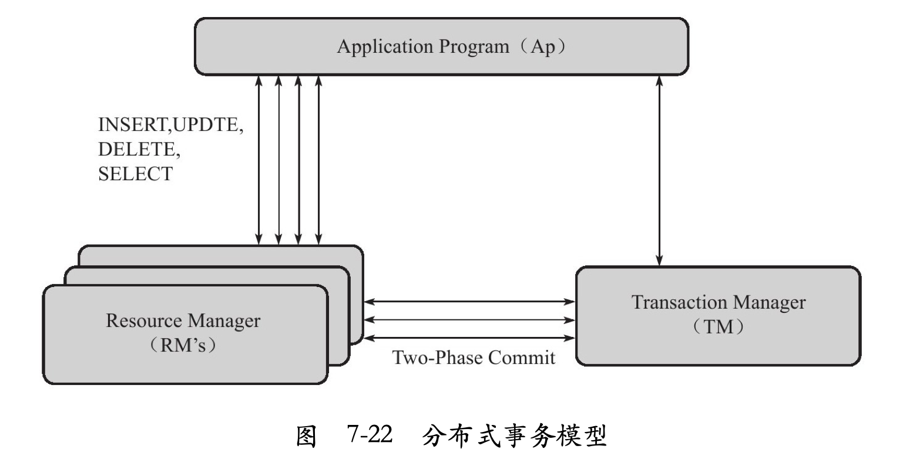

分布式事务使用**两段式提交（two-phase commit）**的方式。在第一阶段，所有参与全局事务的节点都开始准备（PREPARE），告诉事务管理器它们准备好提交了。在第二阶段，事务管理器告诉资源管理器执行ROLLBACK还是COMMIT。如果任何一个节点显示不能提交，则所有的节点都被告知需要回滚。可见与本地事务不同的是，分布式事务需要多一次的PREPARE操作，待收到所有节点的同意信息后，再进行COMMIT或是ROLLBACK操作。

通过参数innodb_support_xa可以查看是否启用了XA事务的支持（默认为ON）：

```mysql
mysql> show variables like 'innodb_support_xa'\G;
*************************** 1. row ***************************
Variable_name: innodb_support_xa
        Value: ON
1 row in set (0.08 sec)
```

### 内部XA事务

在MySQL数据库中还存在另外一种分布式事务，其在存储引擎与插件之间，又或者在存储引擎与存储引擎之间，称之为内部XA事务。

最为常见的内部XA事务存在于binlog与InnoDB存储引擎之间。由于复制的需要，因此目前绝大多数的数据库都开启了binlog功能。在事务提交时，先写二进制日志，再写InnoDB存储引擎的重做日志。对上述两个操作的要求也是原子的，即二进制日志和重做日志必须同时写入。若二进制日志先写了，而在写入InnoDB存储引擎时发生了宕机，那么slave可能会接收到master传过去的二进制日志并执行，最终导致了主从不一致的情况。

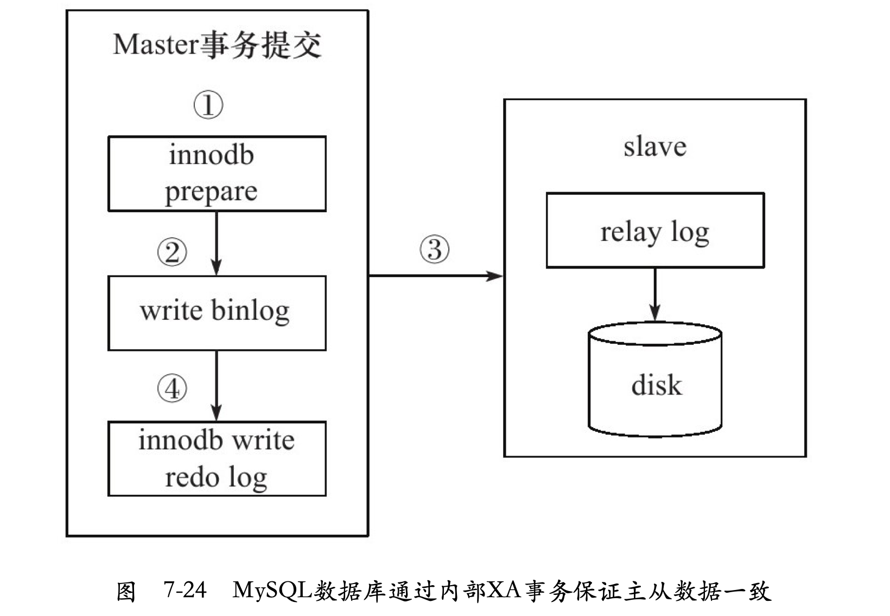

为了解决这个问题，MySQL数据库在binlog与InnoDB存储引擎之间采用XA事务。当事务提交时，InnoDB存储引擎会先做一个PREPARE操作，将事务的xid写入，接着进行二进制日志的写入。如果在InnoDB存储引擎提交前，MySQL数据库宕机了，那么MySQL数据库在重启后会先检查准备的UXID事务是否已经提交，若没有，则在存储引擎层再进行一次提交操作。
