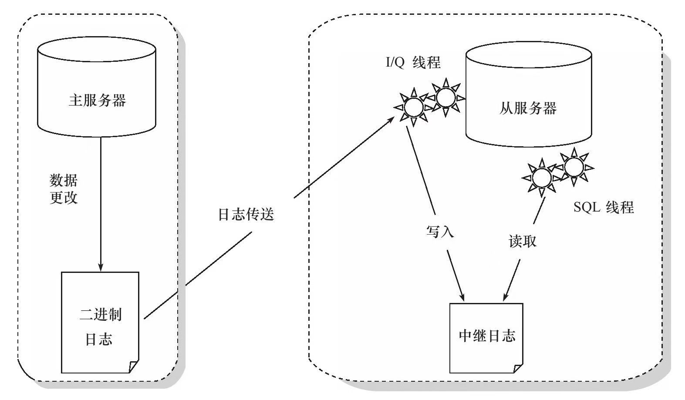
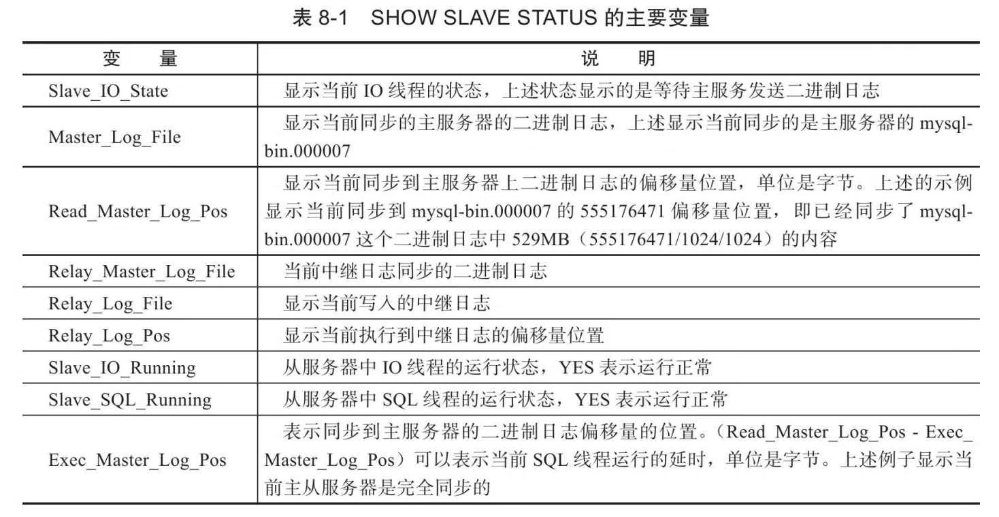
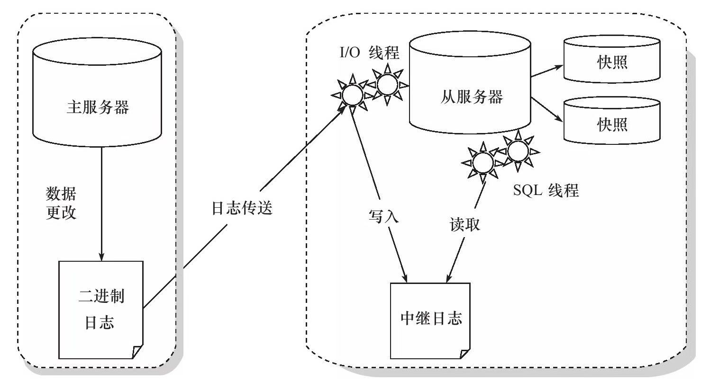

# 备份与恢复

## 复制

### 复制的工作原理

复制（replication）是MySQL数据库提供的一种高可用高性能的解决方案，一般用来建立大型的应用。总体来说，replication的工作原理分为以下3个步骤：

1. 主服务器（master）把数据更改记录到二进制日志（binlog）中。
2. 从服务器（slave）把主服务器的二进制日志复制到自己的中继日志（relaylog）中。
3. 从服务器重做中继日志中的日志，把更改应用到自己的数据库上，以达到数据的最终一致性。

复制的工作原理就是一个完全备份加上二进制日志备份的还原。不同的是这个二进制日志的还原操作基本上实时在进行中。这里特别需要注意的是，复制不是完全实时地进行同步，而是异步实时。这中间存在主从服务器之间的执行延时，如果主服务器的压力很大，则可能导致主从服务器延时较大。

从服务器有2个线程，一个是I/O线程，负责读取主服务器的二进制日志，并将其保存为中继日志；另一个是SQL线程，复制执行中继日志(relay log)。

MySQL的复制是异步实时的，并非完全的主从同步。若用户要想得知当前的延迟，可以通过命令SHOW SLAVE STATUS和SHOW MASTERSTATUS得知。

通过SHOW SLAVE STATUS命令可以观察当前复制的运行状态，一些主要的变量如下表所示：

### 快照+复制的备份架构

复制可以用来作为备份，但功能不仅限于备份，其主要功能如下：

1. 数据分布。由于MySQL数据库提供的复制并不需要很大的带宽要求，因此可以在不同的数据中心之间实现数据的复制。
2. 读取的负载平衡。通过建立多个从服务器，可将读取平均地分布到这些从服务器中，并且减少了主服务器的压力。一般通过DNS的Round-Robin和Linux的LVS功能都可以实现负载平衡。
3. 数据库备份。复制对备份很有帮助，但是从服务器不是备份，不能完全代替备份。
4. 高可用性和故障转移。通过复制建立的从服务器有助于故障转移，减少故障的停机时间和恢复时间。

复制的设计不是简简单单用来备份的，并且只是用复制来进行备份是远远不够的。

假设当前应用采用了主从的复制架构，从服务器作为备份。这时，一个初级DBA执行了误操作，如DROP DATABASE或DROP TABLE，这时从服务器也跟着运行了。这时用户怎样从服务器进行恢复呢？

一个比较好的方法是通过对从服务器上的数据库所在分区做快照，以此来避免误操作对复制造成影响。当发生主服务器上的误操作时，只需要将从服务器上的快照进行恢复，然后再根据二进制日志进行point-in-time的恢复。

此外，建议在从服务上启用read-only选项，这样能保证从服务器上的数据仅与主服务器进行同步，避免其他线程修改数据。

