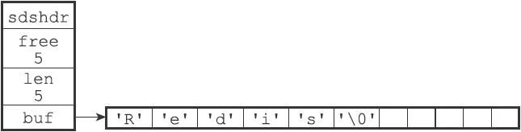

# 简单动态字符串

## SDS的定义

每个sds.h/sdshdr结构表示一个SDS值：

```c
struct sdshdr {
    //记录buf数组中已使用字节的数量
    //等于SDS所保存字符串的长度
    int len;
    //记录buf数组中未使用字节的数量
    int free;
    //字节数组，用于保存字符串
    char buf[];
};
```

示例：


- free属性的值为0，表示这个SDS没有分配任何未使用空间。
- len属性的值为5，表示这个SDS保存了一个五字节长的字符串。
- buf属性是一个char类型的数组，数组的前五个字节分别保存了'R'、'e'、'd'、'i'、's'五个字符，而最后一个字节则保存了空字符'\0'。

SDS遵循C字符串以空字符结尾的惯例，保存空字符的1字节空间不计算在SDS的len属性里面，并且为空字符分配额外的1字节空间，以及添加空字符到字符串末尾等操作，都是由SDS函数自动完成的，所以这个空字符对于SDS的使用者来说是完全透明的。遵循空字符结尾这一惯例的好处是，SDS可以直接重用一部分C字符串函数库里面的函数。

这个SDS和之前展示的SDS的区别在于，这个SDS为buf数组分配了五字节未使用空间，所以它的free属性的值为5（图中使用五个空格来表示五字节的未使用空间）。



##  SDS与C字符串的区别

根据传统，C语言使用长度为N+1的字符数组来表示长度为N的字符串，并且字符数组的最后一个元素总是空字符'\0'。

C语言使用的这种简单的字符串表示方式，并不能满足Redis对字符串在安全性、效率以及功能方面的要求。

### 常数复杂度获取字符串长度

因为C字符串并不记录自身的长度信息，所以为了获取一个C字符串的长度，程序必须遍历整个字符串，对遇到的每个字符进行计数，直到遇到代表字符串结尾的空字符为止，这个操作的复杂度为O（N）。

和C字符串不同，因为SDS在len属性中记录了SDS本身的长度，所以获取一个SDS长度的复杂度仅为O（1）。

设置和更新SDS长度的工作是由SDS的API在执行时自动完成的，使用SDS无须进行任何手动修改长度的工作。通过使用SDS而不是C字符串，Redis将获取字符串长度所需的复杂度从O（N）降低到了O（1），这确保了获取字符串长度的工作不会成为Redis的性能瓶颈。

### 杜绝缓冲区溢出

除了获取字符串长度的复杂度高之外，C字符串不记录自身长度带来的另一个问题是容易造成缓冲区溢出（buffer overflow）。

与C字符串不同，SDS的空间分配策略完全杜绝了发生缓冲区溢出的可能性：当SDS API需要对SDS进行修改时，API会先检查SDS的空间是否满足修改所需的要求，如果不满足的话，API会自动将SDS的空间扩展至执行修改所需的大小，然后才执行实际的修改操作，所以使用SDS既不需要手动修改SDS的空间大小，也不会出现前面所说的缓冲区溢出问题。

### 减少修改字符串时带来的内存重分配次数

因为内存重分配涉及复杂的算法，并且可能需要执行系统调用，所以它通常是一个比较耗时的操作：

- 在一般程序中，如果修改字符串长度的情况不太常出现，那么每次修改都执行一次内存重分配是可以接受的。
- 但是Redis作为数据库，经常被用于速度要求严苛、数据被频繁修改的场合，如果每次修改字符串的长度都需要执行一次内存重分配的话，那么光是执行内存重分配的时间就会占去修改字符串所用时间的一大部分，如果这种修改频繁地发生的话，可能还会对性能造成影响。

为了避免C字符串的这种缺陷，SDS通过未使用空间解除了字符串长度和底层数组长度之间的关联：在SDS中，buf数组的长度不一定就是字符数量加一，数组里面可以包含未使用的字节，而这些字节的数量就由SDS的free属性记录。

通过未使用空间，SDS实现了空间预分配和惰性空间释放两种优化策略。

#### 1 空间预分配

空间预分配用于优化SDS的字符串增长操作：当SDS的API对一个SDS进行修改，并且需要对SDS进行空间扩展的时候，程序不仅会为SDS分配修改所必须要的空间，还会为SDS分配额外的未使用空间。

其中，额外分配的未使用空间数量由以下公式决定：

- 如果对SDS进行修改之后，SDS的长度（也即是len属性的值）将小于1MB，那么程序分配和len属性同样大小的未使用空间，这时SDS len属性的值将和free属性的值相同。举个例子，如果进行修改之后，SDS的len将变成13字节，那么程序也会分配13字节的未使用空间，SDS的buf数组的实际长度将变成13+13+1=27字节（额外的一字节用于保存空字符）。
- 如果对SDS进行修改之后，SDS的长度将大于等于1MB，那么程序会分配1MB的未使用空间。举个例子，如果进行修改之后，SDS的len将变成30MB，那么程序会分配1MB的未使用空间，SDS的buf数组的实际长度将为30MB+1MB+1byte。

通过空间预分配策略，Redis可以减少连续执行字符串增长操作所需的内存重分配次数。

在扩展SDS空间之前，SDS API会先检查未使用空间是否足够，如果足够的话，API就会直接使用未使用空间，而无须执行内存重分配。通过这种预分配策略，SDS将连续增长N次字符串所需的内存重分配次数从必定N次降低为最多N次。

#### 2 惰性空间释放

惰性空间释放用于优化SDS的字符串缩短操作：当SDS的API需要缩短SDS保存的字符串时，程序并不立即使用内存重分配来回收缩短后多出来的字节，而是使用free属性将这些字节的数量记录起来，并等待将来使用。

与此同时，SDS也提供了相应的API，让我们可以在有需要时，真正地释放SDS的未使用空间，所以不用担心惰性空间释放策略会造成内存浪费。

###  二进制安全

C字符串中的字符必须符合某种编码（比如ASCII），并且除了字符串的末尾之外，字符串里面不能包含空字符，否则最先被程序读入的空字符将被误认为是字符串结尾，这些限制使得C字符串只能保存文本数据，而不能保存像图片、音频、视频、压缩文件这样的二进制数据。

虽然数据库一般用于保存文本数据，但使用数据库来保存二进制数据的场景也不少见，因此，为了确保Redis可以适用于各种不同的使用场景，SDS的API都是二进制安全的（binary-safe），所有SDS API都会以处理二进制的方式来处理SDS存放在buf数组里的数据，程序不会对其中的数据做任何限制、过滤、或者假设，数据在写入时是什么样的，它被读取时就是什么样。

这也是我们将SDS的buf属性称为字节数组的原因——Redis不是用这个数组来保存字符，而是用它来保存一系列二进制数据。

### 兼容部分C字符串函数

虽然SDS的API都是二进制安全的，但它们一样遵循C字符串以空字符结尾的惯例：这些API总会将SDS保存的数据的末尾设置为空字符，并且总会在为buf数组分配空间时多分配一个字节来容纳这个空字符，这是为了让那些保存文本数据的SDS可以重用一部分＜string.h＞库定义的函数。

通过遵循C字符串以空字符结尾的惯例，SDS可以在有需要时重用＜string.h＞函数库，从而避免了不必要的代码重复。

## 重点回顾

比起C字符串，SDS具有以下优点：

1. 常数复杂度获取字符串长度。
2. 杜绝缓冲区溢出。
3. 减少修改字符串长度时所需的内存重分配次数。
4. 二进制安全。
5. 兼容部分C字符串函数。

