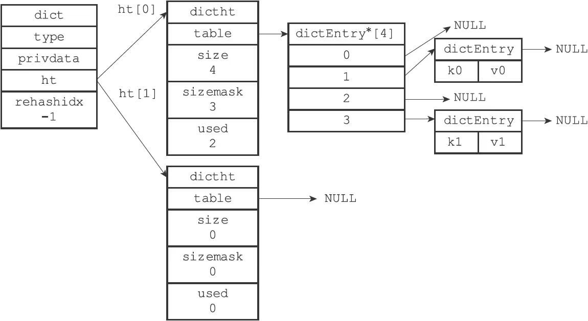
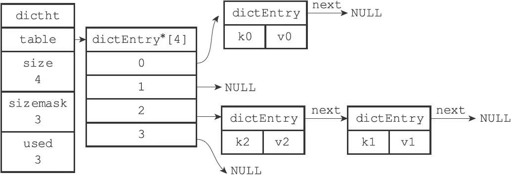

# 字典

字典，又称为符号表（symbol table）、关联数组（associative array）或映射（map），是一种用于保存键值对（key-value pair）的抽象数据结构。

字典在Redis中的应用相当广泛，比如Redis的数据库就是使用字典来作为底层实现的，对数据库的增、删、查、改操作也是构建在对字典的操作之上的。

举个例子，当我们执行命令：
```sh
redis＞ SET msg "hello world"
OK
```

在数据库中创建一个键为"msg"，值为"hello world"的键值对时，这个键值对就是保存在代表数据库的字典里面的。

除了用来表示数据库之外，字典还是哈希键的底层实现之一，当一个哈希键包含的键值对比较多，又或者键值对中的元素都是比较长的字符串时，Redis就会使用字典作为哈希键的底层实现。

## 字典的实现

Redis的字典使用哈希表作为底层实现，一个哈希表里面可以有多个哈希表节点，而每个哈希表节点就保存了字典中的一个键值对。

### 哈希表

Redis字典所使用的哈希表由dict.h/dictht结构定义：

```c
typedef struct dictht {
    //哈希表数组
    dictEntry **table;
    //哈希表大小
    unsigned long size;
    //哈希表大小掩码，用于计算索引值
    //总是等于size-1
    unsigned long sizemask;
    //该哈希表已有节点的数量
    unsigned long used;
} dictht;
```

- table属性是一个数组，数组中的每个元素都是一个指向dict.h/dictEntry结构的指针，每个dictEntry结构保存着一个键值对。
- size属性记录了哈希表的大小，也即是table数组的大小，
- used属性则记录了哈希表目前已有节点（键值对）的数量。
- sizemask属性的值总是等于size-1，这个属性和哈希值一起决定一个键应该被放到table数组的哪个索引上面。

### 哈希表节点

哈希表节点使用dictEntry结构表示，每个dictEntry结构都保存着一个键值对：

```c
typedef struct dictEntry {
    //键
    void *key;
    //值
    union{
        void *val;
        uint64_tu64;
        int64_ts64;
    } v;
    //指向下个哈希表节点，形成链表
    struct dictEntry *next;
} dictEntry;
```

- key属性保存着键值对中的键
- v属性则保存着键值对中的值，其中键值对的值可以是一个指针，或者是一个uint64_t整数，又或者是一个int64_t整数。
- next属性是指向另一个哈希表节点的指针，这个指针可以将多个哈希值相同的键值对连接在一次，以此来解决键冲突（collision）的问题。

### 字典

Redis中的字典由dict.h/dict结构表示：

```c
typedef struct dict {
    //类型特定函数
    dictType *type;
    //私有数据
    void *privdata;
    //哈希表
    dictht ht[2];
    // rehash索引
    //当rehash不在进行时，值为-1
    in trehashidx; /* rehashing not in progress if rehashidx == -1 */
} dict;
```

type属性和privdata属性是针对不同类型的键值对，为创建多态字典而设置的：

- type属性是一个指向dictType结构的指针，每个dictType结构保存了一簇用于操作特定类型键值对的函数，Redis会为用途不同的字典设置不同的类型特定函数。
- privdata属性则保存了需要传给那些类型特定函数的可选参数

```c
typedef struct dictType {
    //计算哈希值的函数
    unsigned int (*hashFunction)(const void *key);
    //复制键的函数
    void *(*keyDup)(void *privdata, const void *key);
    //复制值的函数
    void *(*valDup)(void *privdata, const void *obj);
    //对比键的函数
    int (*keyCompare)(void *privdata, const void *key1, const void *key2);
    //销毁键的函数
    void (*keyDestructor)(void *privdata, void *key);
    //销毁值的函数
    void (*valDestructor)(void *privdata, void *obj);
} dictType;
```

ht属性是一个包含两个项的数组，数组中的每个项都是一个dictht哈希表，一般情况下，字典只使用ht[0]哈希表，ht[1]哈希表只会在对ht[0]哈希表进行rehash时使用。

除了ht[1]之外，另一个和rehash有关的属性就是rehashidx，它记录了rehash目前的进度，如果目前没有在进行rehash，那么它的值为-1。

一个普通状态下（没有进行rehash）的字典:



## 哈希算法

Redis计算哈希值和索引值的方法如下：

```python
#使用字典设置的哈希函数，计算键key的哈希值
hash = dict-＞type-＞hashFunction(key);
#使用哈希表的sizemask属性和哈希值，计算出索引值
#根据情况不同，ht[x]可以是ht[0]或者ht[1]
index = hash & dict-＞ht[x].sizemask;
```

当字典被用作数据库的底层实现，或者哈希键的底层实现时，Redis使用MurmurHash2算法来计算键的哈希值。

MurmurHash算法最初由Austin Appleby于2008年发明，这种算法的优点在于，即使输入的键是有规律的，算法仍能给出一个很好的随机分布性，并且算法的计算速度也非常快。

> MurmurHash算法目前的最新版本为MurmurHash3，而Redis使用的是MurmurHash2，关于MurmurHash算法的更多信息可以参考该算法的主页：http://code.google.com/p/smhasher/。

## 解决键冲突

Redis的哈希表使用链地址法（separate chaining）来解决键冲突，每个哈希表节点都有一个next指针，多个哈希表节点可以用next指针构成一个单向链表，被分配到同一个索引上的多个节点可以用这个单向链表连接起来，这就解决了键冲突的问题。

因为dictEntry节点组成的链表没有指向链表表尾的指针，所以为了速度考虑，程序总是将新节点添加到链表的表头位置（复杂度为O（1）），排在其他已有节点的前面。

使用链表解决k2和k1的冲突:



## rehash

随着操作的不断执行，哈希表保存的键值对会逐渐地增多或者减少，为了让哈希表的负载因子（load factor）维持在一个合理的范围之内，当哈希表保存的键值对数量太多或者太少时，程序需要对哈希表的大小进行相应的扩展或者收缩。

扩展和收缩哈希表的工作可以通过执行rehash（重新散列）操作来完成，Redis对字典的哈希表执行rehash的步骤如下：

1. 为字典的ht[1]哈希表分配空间，这个哈希表的空间大小取决于要执行的操作，以及ht[0]当前包含的键值对数量（也即是ht[0].used属性的值）：
   - 如果执行的是扩展操作，那么ht[1]的大小为第一个大于等于ht[0].used*2的$2^n$（2的n次方幂）；
   - 如果执行的是收缩操作，那么ht[1]的大小为第一个大于等于ht[0].used的$2^n$。
2. 将保存在ht[0]中的所有键值对rehash到ht[1]上面：rehash指的是重新计算键的哈希值和索引值，然后将键值对放置到ht[1]哈希表的指定位置上。
3. 当ht[0]包含的所有键值对都迁移到了ht[1]之后（ht[0]变为空表），释放ht[0]，将ht[1]设置为ht[0]，并在ht[1]新创建一个空白哈希表，为下一次rehash做准备。

哈希表的扩展与收缩

当以下条件中的任意一个被满足时，程序会自动开始对哈希表执行扩展操作：

1. 服务器目前没有在执行BGSAVE命令或者BGREWRITEAOF命令，并且哈希表的负载因子大于等于1。
2. 服务器目前正在执行BGSAVE命令或者BGREWRITEAOF命令，并且哈希表的负载因子大于等于5。

其中哈希表的负载因子可以通过下面公式计算得出：

```python
#负载因子=哈希表已保存节点数量/哈希表大小
load_factor = ht[0].used / ht[0].size
```

根据BGSAVE命令或BGREWRITEAOF命令是否正在执行，服务器执行扩展操作所需的负载因子并不相同，这是因为在执行BGSAVE命令或BGREWRITEAOF命令的过程中，Redis需要创建当前服务器进程的子进程，而大多数操作系统都采用写时复制（copy-on-write）技术来优化子进程的使用效率，所以在子进程存在期间，服务器会提高执行扩展操作所需的负载因子，从而尽可能地避免在子进程存在期间进行哈希表扩展操作，这可以避免不必要的内存写入操作，最大限度地节约内存。

另一方面，当哈希表的负载因子小于0.1时，程序自动开始对哈希表执行收缩操作。

## 渐进式rehash

扩展或收缩哈希表需要将ht[0]里面的所有键值对rehash到ht[1]里面，这个rehash动作并不是一次性、集中式地完成的，而是分多次、渐进式地完成的。

这样做的原因在于，如果哈希表里保存的大量的键值对，那么要一次性将这些键值对全部rehash到ht[1]的话，庞大的计算量可能会导致服务器在一段时间内停止服务。

因此，为了避免rehash对服务器性能造成影响，服务器不是一次性将ht[0]里面的所有键值对全部rehash到ht[1]，而是分多次、渐进式地将ht[0]里面的键值对慢慢地rehash到ht[1]。

以下是哈希表渐进式rehash的详细步骤：

1. 为ht[1]分配空间，让字典同时持有ht[0]和ht[1]两个哈希表。
2. 在字典中维持一个索引计数器变量rehashidx，并将它的值设置为0，表示rehash工作正式开始。
3. 在rehash进行期间，每次对字典执行添加、删除、查找或者更新操作时，程序除了执行指定的操作以外，还会顺带将ht[0]哈希表在rehashidx索引上的所有键值对rehash到ht[1]，当rehash工作完成之后，程序将rehashidx属性的值增一。
4. 随着字典操作的不断执行，最终在某个时间点上，ht[0]的所有键值对都会被rehash至ht[1]，这时程序将rehashidx属性的值设为-1，表示rehash操作已完成。

渐进式rehash的好处在于它采取分而治之的方式，将rehash键值对所需的计算工作均摊到对字典的每个添加、删除、查找和更新操作上，从而避免了集中式rehash而带来的庞大计算量。

因为在进行渐进式rehash的过程中，字典会同时使用ht[0]和ht[1]两个哈希表，所以在渐进式rehash进行期间，字典的删除（delete）、查找（find）、更新（update）等操作会在两个哈希表上进行。例如，要在字典里面查找一个键的话，程序会先在ht[0]里面进行查找，如果没找到的话，就会继续到ht[1]里面进行查找，诸如此类。

另外，在渐进式rehash执行期间，新添加到字典的键值对一律会被保存到ht[1]里面，而ht[0]则不再进行任何添加操作，这一措施保证了ht[0]包含的键值对数量会只减不增，并随着rehash操作的执行而最终变成空表。
