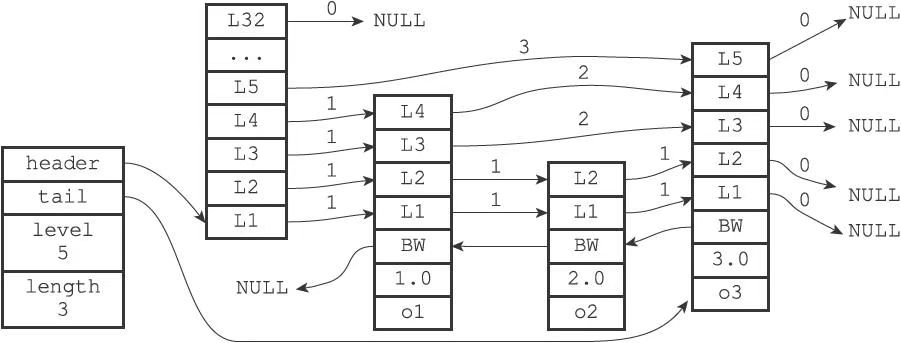

# 跳跃表

跳跃表（skiplist）是一种有序数据结构，它通过在每个节点中维持多个指向其他节点的指针，从而达到快速访问节点的目的。

跳跃表支持平均O（logN）、最坏O（N）复杂度的节点查找，还可以通过顺序性操作来批量处理节点。

在大部分情况下，跳跃表的效率可以和平衡树相媲美，并且因为跳跃表的实现比平衡树要来得更为简单，所以有不少程序都使用跳跃表来代替平衡树。

Redis使用跳跃表作为有序集合键的底层实现之一，如果一个有序集合包含的元素数量比较多，又或者有序集合中元素的成员（member）是比较长的字符串时，Redis就会使用跳跃表来作为有序集合键的底层实现。

和链表、字典等数据结构被广泛地应用在Redis内部不同，Redis只在两个地方用到了跳跃表，一个是实现有序集合键，另一个是在集群节点中用作内部数据结构，除此之外，跳跃表在Redis里面没有其他用途。

## 跳跃表的实现

Redis的跳跃表由redis.h/zskiplistNode和redis.h/zskiplist两个结构定义，其中zskiplistNode结构用于表示跳跃表节点，而zskiplist结构则用于保存跳跃表节点的相关信息，比如节点的数量，以及指向表头节点和表尾节点的指针等等。

一个跳跃表:



位于图片最左边的是zskiplist结构，该结构包含以下属性：

- header：指向跳跃表的表头节点。
- tail：指向跳跃表的表尾节点。
- level：记录目前跳跃表内，层数最大的那个节点的层数（表头节点的层数不计算在内）。
- length：记录跳跃表的长度，也即是，跳跃表目前包含节点的数量（表头节点不计算在内）。

位于zskiplist结构右方的是四个zskiplistNode结构，该结构包含以下属性：

- 层（level）：节点中用L1、L2、L3等字样标记节点的各个层，L1代表第一层，L2代表第二层，以此类推。每个层都带有两个属性：前进指针和跨度。前进指针用于访问位于表尾方向的其他节点，而跨度则记录了前进指针所指向节点和当前节点的距离。在上面的图片中，连线上带有数字的箭头就代表前进指针，而那个数字就是跨度。当程序从表头向表尾进行遍历时，访问会沿着层的前进指针进行。
- 后退（backward）指针：节点中用BW字样标记节点的后退指针，它指向位于当前节点的前一个节点。后退指针在程序从表尾向表头遍历时使用。
- 分值（score）：各个节点中的1.0、2.0和3.0是节点所保存的分值。在跳跃表中，节点按各自所保存的分值从小到大排列。
- 成员对象（obj）：各个节点中的o1、o2和o3是节点所保存的成员对象。

### 跳跃表节点

跳跃表节点的实现由redis.h/zskiplistNode结构定义：

```c
typedef struct zskiplistNode {
    //层
    struct zskiplistLevel {
        //前进指针
        struct zskiplistNode *forward;
        //跨度
        unsigned int span;
    } level[];
    //后退指针
    struct zskiplistNode *backward;
    //分值
    double score;
    //成员对象
    robj *obj;
} zskiplistNode;
```

#### 1 层

跳跃表节点的level数组可以包含多个元素，每个元素都包含一个指向其他节点的指针，程序可以通过这些层来加快访问其他节点的速度，一般来说，层的数量越多，访问其他节点的速度就越快。

每次创建一个新跳跃表节点的时候，程序都根据**幂次定律（power law，越大的数出现的概率越小）**随机生成一个介于1和32之间的值作为level数组的大小，这个大小就是层的“高度”。

#### 2 前进指针

每个层都有一个指向表尾方向的前进指针（level[i].forward属性），用于从表头向表尾方向访问节点。

#### 3 跨度

层的跨度（level[i].span属性）用于记录两个节点之间的距离：

- 两个节点之间的跨度越大，它们相距得就越远。
- 指向NULL的所有前进指针的跨度都为0，因为它们没有连向任何节点。

初看上去，很容易以为跨度和遍历操作有关，但实际上并不是这样，遍历操作只使用前进指针就可以完成了，跨度实际上是用来计算排位（rank）的：在查找某个节点的过程中，将沿途访问过的所有层的跨度累计起来，得到的结果就是目标节点在跳跃表中的排位。（其实就是用来计算在跳跃表里的位置）

#### 4 后退指针

节点的后退指针（backward属性）用于从表尾向表头方向访问节点：跟可以一次跳过多个节点的前进指针不同，因为每个节点只有一个后退指针，所以每次只能后退至前一个节点。

#### 5 分值和成员

节点的分值（score属性）是一个double类型的浮点数，跳跃表中的所有节点都按分值从小到大来排序。

节点的成员对象（obj属性）是一个指针，它指向一个字符串对象，而字符串对象则保存着一个SDS值。

在同一个跳跃表中，各个节点保存的成员对象必须是唯一的，但是多个节点保存的分值却可以是相同的：分值相同的节点将按照成员对象在字典序中的大小来进行排序，成员对象较小的节点会排在前面（靠近表头的方向），而成员对象较大的节点则会排在后面（靠近表尾的方向）。

### 跳跃表

通过使用一个zskiplist结构来持有这些节点，程序可以更方便地对整个跳跃表进行处理，比如快速访问跳跃表的表头节点和表尾节点，或者快速地获取跳跃表节点的数量（也即是跳跃表的长度）等信息。

zskiplist结构的定义如下：

```c
typedef struct zskiplist {
    //表头节点和表尾节点
    structz skiplistNode *header, *tail;
    //表中节点的数量
    unsigned long length;
    //表中层数最大的节点的层数
    int level;
} zskiplist;
```

header和tail指针分别指向跳跃表的表头和表尾节点，通过这两个指针，程序定位表头节点和表尾节点的复杂度为O（1）。

通过使用length属性来记录节点的数量，程序可以在O（1）复杂度内返回跳跃表的长度。

level属性则用于在O（1）复杂度内获取跳跃表中层高最大的那个节点的层数量，注意表头节点的层高并不计算在内。