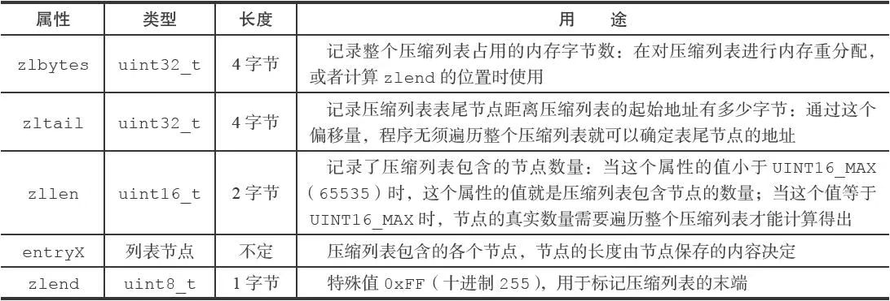
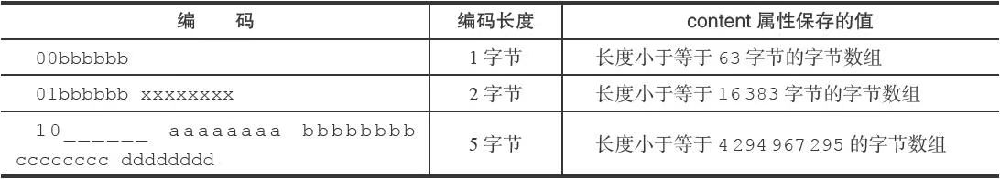
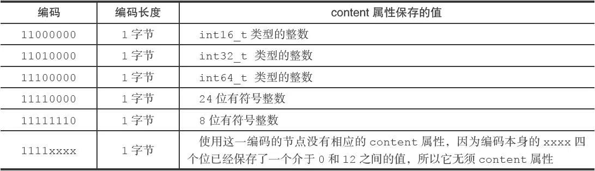

#  压缩列表

压缩列表（ziplist）是列表键和哈希键的底层实现之一。(redis 5.0引入listpack代替ziplist)

当一个列表键只包含少量列表项，并且每个列表项要么就是小整数值，要么就是长度比较短的字符串，那么Redis就会使用压缩列表来做列表键的底层实现。

当一个哈希键只包含少量键值对，比且每个键值对的键和值要么就是小整数值，要么就是长度比较短的字符串，那么Redis就会使用压缩列表来做哈希键的底层实现。

##  压缩列表的构成

压缩列表是Redis为了节约内存而开发的，是由一系列特殊编码的连续内存块组成的顺序型（sequential）数据结构。一个压缩列表可以包含任意多个节点（entry），每个节点可以保存一个字节数组或者一个整数值。

压缩列表的各个组成部分:

压缩列表各个组成部分的详细说明:

## 压缩列表节点的构成

每个压缩列表节点可以保存一个字节数组或者一个整数值，其中，字节数组可以是以下三种长度的其中一种：

- 长度小于等于63（2 6–1）字节的字节数组；
- 长度小于等于16383（2 14–1）字节的字节数组；
- 长度小于等于4294967295（2 32–1）字节的字节数组；

而整数值则可以是以下六种长度的其中一种：

- 4位长，介于0至12之间的无符号整数；
- 1字节长的有符号整数；
- 3字节长的有符号整数；
- int16_t类型整数；
- int32_t类型整数；
- int64_t类型整数。

每个压缩列表节点都由previous_entry_length、encoding、content三个部分组成:

### previous_entry_length

节点的previous_entry_length属性以字节为单位，记录了压缩列表中前一个节点的长度。previous_entry_length属性的长度可以是1字节或者5字节：

- 如果前一节点的长度小于254字节，那么previous_entry_length属性的长度为1字节：前一节点的长度就保存在这一个字节里面。
- 如果前一节点的长度大于等于254字节，那么previous_entry_length属性的长度为5字节：其中属性的第一字节会被设置为0xFE（十进制值254），而之后的四个字节则用于保存前一节点的长度。

因为节点的previous_entry_length属性记录了前一个节点的长度，所以程序可以通过指针运算，根据当前节点的起始地址来计算出前一个节点的起始地址。

 通过指针运算计算出前一个节点的地址:

压缩列表的从表尾向表头遍历操作就是使用这一原理实现的，只要我们拥有了一个指向某个节点起始地址的指针，那么通过这个指针以及这个节点的previous_entry_length属性，程序就可以一直向前一个节点回溯，最终到达压缩列表的表头节点。

### encoding

节点的encoding属性记录了节点的content属性所保存数据的类型以及长度：

- 一字节、两字节或者五字节长，值的最高位为00、01或者10的是字节数组编码：这种编码表示节点的content属性保存着字节数组，数组的长度由编码除去最高两位之后的其他位记录；
- 一字节长，值的最高位以11开头的是整数编码：这种编码表示节点的content属性保存着整数值，整数值的类型和长度由编码除去最高两位之后的其他位记录；

字节数组编码:

整数编码:

### content

节点的content属性负责保存节点的值，节点值可以是一个字节数组或者整数，值的类型和长度由节点的encoding属性决定。

## 连锁更新

前面说过，每个节点的previous_entry_length属性都记录了前一个节点的长度：

- 如果前一节点的长度小于254字节，那么previous_entry_length属性需要用1字节长的空间来保存这个长度值。
- 如果前一节点的长度大于等于254字节，那么previous_entry_length属性需要用5字节长的空间来保存这个长度值。

因为连锁更新在最坏情况下需要对压缩列表执行N次空间重分配操作，而每次空间重分配的最坏复杂度为O（N），所以连锁更新的最坏复杂度为O（$N^2$）。

要注意的是，尽管连锁更新的复杂度较高，但它真正造成性能问题的几率是很低的：

- 首先，压缩列表里要恰好有多个连续的、长度介于250字节至253字节之间的节点，连锁更新才有可能被引发，在实际中，这种情况并不多见；
- 其次，即使出现连锁更新，但只要被更新的节点数量不多，就不会对性能造成任何影响：比如说，对三五个节点进行连锁更新是绝对不会影响性能的；

因为以上原因，ziplistPush等命令的平均复杂度仅为O（N），在实际中，我们可以放心地使用这些函数，而不必担心连锁更新会影响压缩列表的性能。
