# 对象

Redis用到的主要数据结构有简单动态字符串（SDS）、双端链表、字典、压缩列表、整数集合等等。Redis并没有直接使用这些数据结构来实现键值对数据库，而是基于这些数据结构创建了一个对象系统，这个系统包含字符串对象、列表对象、哈希对象、集合对象和有序集合对象这五种类型的对象，每种对象都用到了至少一种我们前面所介绍的数据结构。

通过这五种不同类型的对象，Redis可以在执行命令之前，根据对象的类型来判断一个对象是否可以执行给定的命令。使用对象的另一个好处是，可以针对不同的使用场景，为对象设置多种不同的数据结构实现，从而优化对象在不同场景下的使用效率。

Redis的对象系统还实现了基于引用计数技术的内存回收机制，当程序不再使用某个对象的时候，这个对象所占用的内存就会被自动释放；另外，Redis还通过引用计数技术实现了对象共享机制，这一机制可以在适当的条件下，通过让多个数据库键共享同一个对象来节约内存。

Redis的对象带有访问时间记录信息，该信息可以用于计算数据库键的空转时长，在服务器启用了maxmemory功能的情况下，空转时长较大的那些键可能会优先被服务器删除。

##  对象的类型与编码

Redis使用对象来表示数据库中的键和值，每次当我们在Redis的数据库中新创建一个键值对时，我们至少会创建两个对象，一个对象用作键值对的键（键对象），另一个对象用作键值对的值（值对象）。

Redis中的每个对象都由一个redisObject结构表示，该结构中和保存数据有关的三个属性分别是type属性、encoding属性和ptr属性：

```c
typedef struct redisObject {
    //类型
    unsigned type:4;
    //编码
    unsigned encoding:4;
    //指向底层实现数据结构的指针
    void *ptr;
    // ...
} robj;
```

### 类型

对象的type属性记录了对象的类型

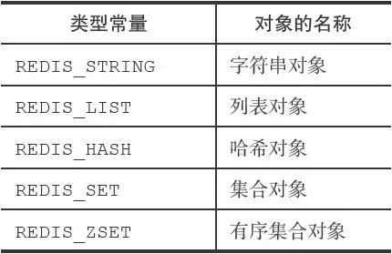

对于Redis数据库保存的键值对来说，键总是一个字符串对象，而值则可以是字符串对象、列表对象、哈希对象、集合对象或者有序集合对象的其中一种。

当我们对一个数据库键执行TYPE命令时，命令返回的结果为数据库键对应的值对象的类型:

```sh
#
键为字符串对象，值为字符串对象
redis＞ SET msg "hello world"
OK
redis＞ TYPE msg
string
#键为字符串对象，值为列表对象
redis＞ RPUSH numbers 1 3 5
(integer) 6
redis＞ TYPE numbers
list
```

 不同类型值对象的TYPE命令输出:

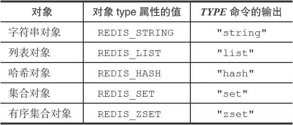

### 编码和底层实现

对象的ptr指针指向对象的底层实现数据结构，而这些数据结构由对象的encoding属性决定。encoding属性记录了对象所使用的编码，也即是说这个对象使用了什么数据结构作为对象的底层实现:

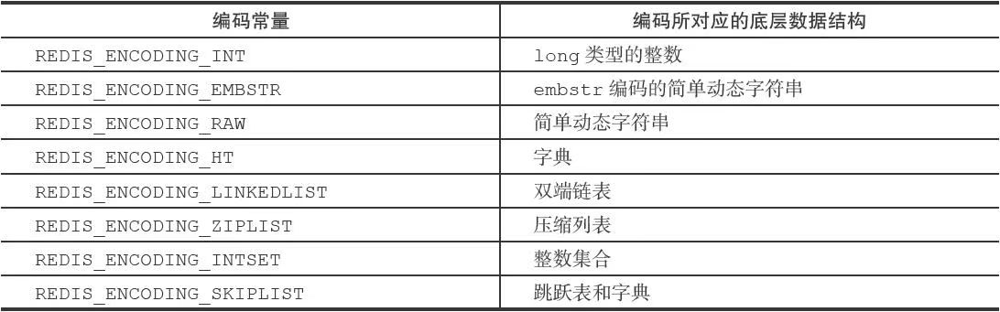

每种类型的对象都至少使用了两种不同的编码.不同类型和编码的对象:

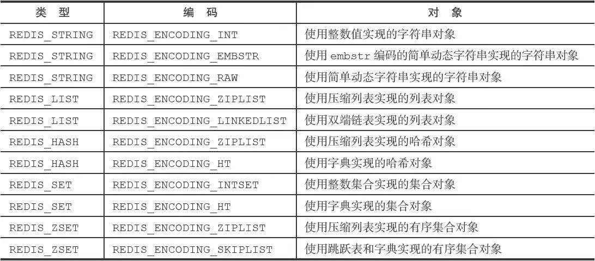

使用OBJECT ENCODING命令可以查看一个数据库键的值对象的编码：

```sh
redis＞ SET msg "hello wrold"
OK
redis＞ OBJECT ENCODING msg
"embstr"
redis＞ SET story "long long long long long long ago ..."
OK
redis＞ OBJECT ENCODING story
"raw"
redis＞ SADD numbers 1 3 5
(integer) 3
redis＞ OBJECT ENCODING numbers
"intset"
redis＞ SADD numbers "seven"
(integer) 1
redis＞ OBJECT ENCODING numbers
"hashtable"
```

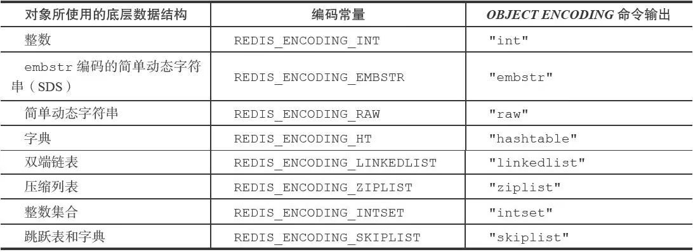

通过encoding属性来设定对象所使用的编码，而不是为特定类型的对象关联一种固定的编码，极大地提升了Redis的灵活性和效率，因为Redis可以根据不同的使用场景来为一个对象设置不同的编码，从而优化对象在某一场景下的效率。

## 字符串对象

字符串对象的编码可以是int、raw或者embstr。

如果一个字符串对象保存的是整数值，并且这个整数值可以用long类型来表示，那么字符串对象会将整数值保存在字符串对象结构的ptr属性里面（将void*转换成long），并将字符串对象的编码设置为int。

例如：

```sh
redis＞ SET number 10086
OK
redis＞ OBJECT ENCODING number
"int"
```

如果字符串对象保存的是一个字符串值，并且这个字符串值的长度大于32字节，那么字符串对象将使用一个简单动态字符串（SDS）来保存这个字符串值，并将对象的编码设置为raw。

如果字符串对象保存的是一个字符串值，并且这个字符串值的长度小于等于32字节，那么字符串对象将使用embstr编码的方式来保存这个字符串值。

embstr编码是专门用于保存短字符串的一种优化编码方式，这种编码和raw编码一样，都使用redisObject结构和sdshdr结构来表示字符串对象，但raw编码会调用两次内存分配函数来分别创建redisObject结构和sdshdr结构，而embstr编码则通过调用一次内存分配函数来分配一块连续的空间，空间中依次包含redisObject和sdshdr两个结构，如图下图所示：

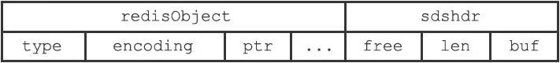

embstr编码的字符串对象在执行命令时，产生的效果和raw编码的字符串对象执行命令时产生的效果是相同的，但使用embstr编码的字符串对象来保存短字符串值有以下好处：

- embstr编码将创建字符串对象所需的内存分配次数从raw编码的两次降低为一次。
- 释放embstr编码的字符串对象只需要调用一次内存释放函数，而释放raw编码的字符串对象需要调用两次内存释放函数。
- 因为embstr编码的字符串对象的所有数据都保存在一块连续的内存里面，所以这种编码的字符串对象比起raw编码的字符串对象能够更好地利用缓存带来的优势。

可以用long double类型表示的浮点数在Redis中也是作为字符串值来保存的。如果我们要保存一个浮点数到字符串对象里面，那么程序会先将这个浮点数转换成字符串值，然后再保存转换所得的字符串值。

举个例子，执行以下代码将创建一个包含3.14的字符串表示“3.14”的字符串对象：

```sh
redis＞ SET pi 3.14
OK
redis＞ OBJECT ENCODING pi
"embstr"
```

那么程序首先会取出字符串对象里面保存的字符串值"3.14"，将它转换回浮点数值3.14，然后把3.14和2.0相加得出的值5.14转换成字符串"5.14"，并将这个"5.14"保存到字符串对象里面。

下表总结并列出了字符串对象保存各种不同类型的值所使用的编码方式：

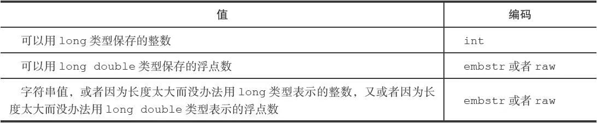

### 编码的转换

int编码的字符串对象和embstr编码的字符串对象在条件满足的情况下，会被转换为raw编码的字符串对象。

对于int编码的字符串对象来说，如果我们向对象执行了一些命令，使得这个对象保存的不再是整数值，而是一个字符串值，那么字符串对象的编码将从int变为raw。

例如通过APPEND命令，向一个保存整数值的字符串对象追加了一个字符串值，因为追加操作只能对字符串值执行，所以程序会先将之前保存的整数值10086转换为字符串值"10086"，然后再执行追加操作，操作的执行结果就是一个raw编码的、保存了字符串值的字符串对象：

```sh
redis＞ SET number 10086
OK
redis＞ OBJECT ENCODING number
"int"
redis＞ APPEND number " is a good number!"
(integer) 23
redis＞ GET number
"10086 is a good number!"
redis＞ OBJECT ENCODING number
"raw"
```

另外，因为Redis没有为embstr编码的字符串对象编写任何相应的修改程序（只有int编码的字符串对象和raw编码的字符串对象有这些程序），所以embstr编码的字符串对象实际上是只读的。当我们对embstr编码的字符串对象执行任何修改命令时，程序会先将对象的编码从embstr转换成raw，然后再执行修改命令。因为这个原因，embstr编码的字符串对象在执行修改命令之后，总会变成一个raw编码的字符串对象。

以下代码展示了一个embstr编码的字符串对象在执行APPEND命令之后，对象的编码从embstr变为raw的例子：

```sh
redis＞ SET msg "hello world"
OK
redis＞ OBJECT ENCODING msg
"embstr"
redis＞ APPEND msg " again!"
(integer) 18
redis＞ OBJECT ENCODING msg
"raw"
```

### 字符串命令的实现

因为字符串键的值为字符串对象，所以用于字符串键的所有命令都是针对字符串对象来构建的，下表列举了其中一部分字符串命令，以及这些命令在不同编码的字符串对象下的实现方法。

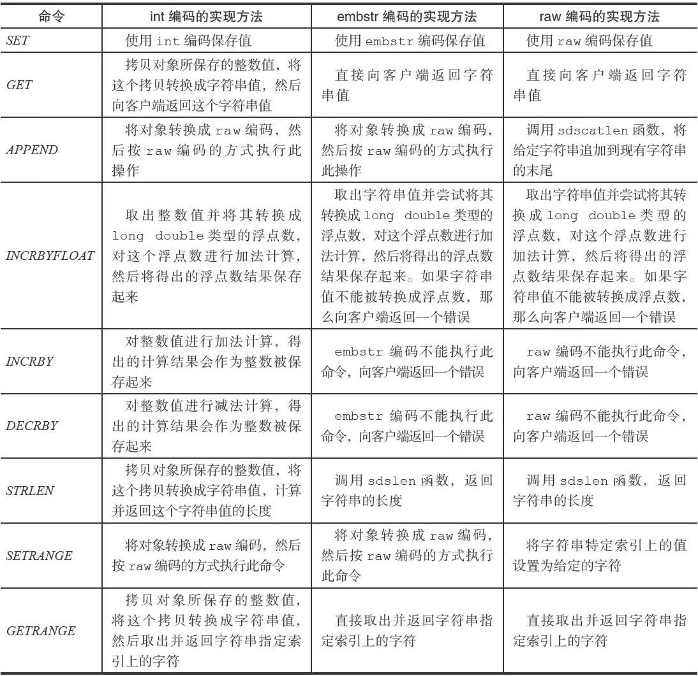

## 列表对象

> Redis3.2版本开始对列表数据结构进行了改造，使用 quicklist 代替了 ziplist 和 linkedlist.

列表对象的编码可以是ziplist或者linkedlist。

ziplist编码的列表对象使用压缩列表作为底层实现，每个压缩列表节点（entry）保存了一个列表元素。

linkedlist编码的列表对象使用双端链表作为底层实现，每个双端链表节点（node）都保存了一个字符串对象，而每个字符串对象都保存了一个列表元素。

注意，linkedlist编码的列表对象在底层的双端链表结构中包含了多个字符串对象，这种嵌套字符串对象的行为在稍后介绍的哈希对象、集合对象和有序集合对象中都会出现，字符串对象是Redis五种类型的对象中唯一一种会被其他四种类型对象嵌套的对象。

###  编码转换

当列表对象可以同时满足以下两个条件时，列表对象使用ziplist编码：

- 列表对象保存的所有字符串元素的长度都小于64字节；
- 列表对象保存的元素数量小于512个；不能满足这两个条件的列表对象需要使用linkedlist编码。

> 以上两个条件的上限值是可以修改的，具体请看配置文件中关于list-max-ziplist-value选项和list-max-ziplist-entries选项的说明。

对于使用ziplist编码的列表对象来说，当使用ziplist编码所需的两个条件的任意一个不能被满足时，对象的编码转换操作就会被执行，原本保存在压缩列表里的所有列表元素都会被转移并保存到双端链表里面，对象的编码也会从ziplist变为linkedlist。

### 列表命令的实现

因为列表键的值为列表对象，所以用于列表键的所有命令都是针对列表对象来构建的，下表列出了其中一部分列表键命令，以及这些命令在不同编码的列表对象下的实现方法。

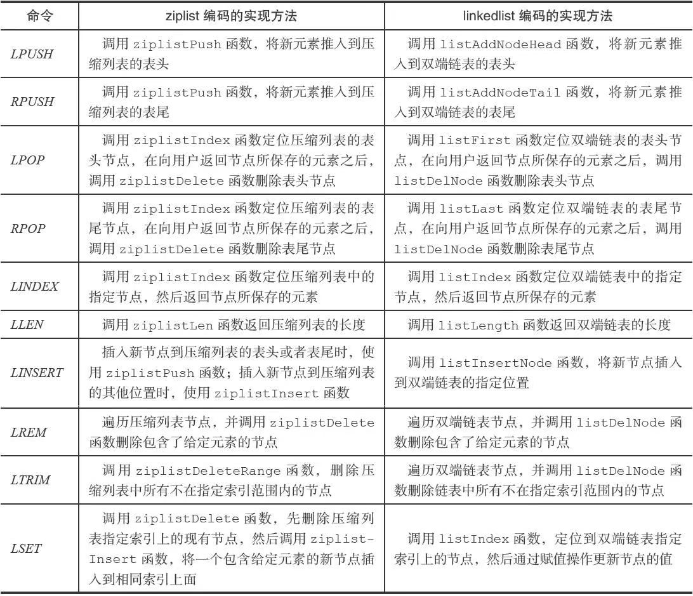

##  哈希对象

哈希对象的编码可以是ziplist或者hashtable。(目前版本使用listpack和hashtable)

ziplist编码的哈希对象使用压缩列表作为底层实现，每当有新的键值对要加入到哈希对象时，程序会先将保存了键的压缩列表节点推入到压缩列表表尾，然后再将保存了值的压缩列表节点推入到压缩列表表尾，因此：

- 保存了同一键值对的两个节点总是紧挨在一起，保存键的节点在前，保存值的节点在后；
- 先添加到哈希对象中的键值对会被放在压缩列表的表头方向，而后来添加到哈希对象中的键值对会被放在压缩列表的表尾方向。

hashtable编码的哈希对象使用字典作为底层实现，哈希对象中的每个键值对都使用一个字典键值对来保存：

- 字典的每个键都是一个字符串对象，对象中保存了键值对的键；
- 字典的每个值都是一个字符串对象，对象中保存了键值对的值。

### 编码转换

当哈希对象可以同时满足以下两个条件时，哈希对象使用ziplist编码：

- 哈希对象保存的所有键值对的键和值的字符串长度都小于64字节；
- 哈希对象保存的键值对数量小于512个；不能满足这两个条件的哈希对象需要使用hashtable编码。

> 这两个条件的上限值是可以修改的，具体请看配置文件中关于hash-max-ziplist-value选项和hash-max-ziplist-entries选项的说明。

对于使用ziplist编码的列表对象来说，当使用ziplist编码所需的两个条件的任意一个不能被满足时，对象的编码转换操作就会被执行，原本保存在压缩列表里的所有键值对都会被转移并保存到字典里面，对象的编码也会从ziplist变为hashtable。

### 哈希命令的实现

下表列出了其中一部分哈希键命令，以及这些命令在不同编码的哈希对象下的实现方法：

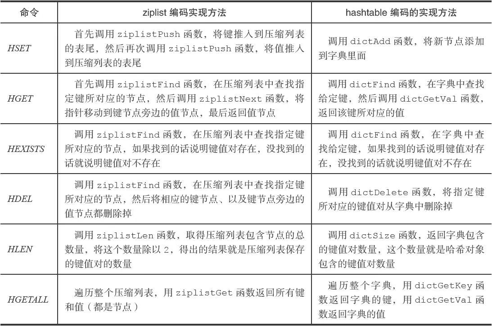

## 集合对象

集合对象的编码可以是intset或者hashtable。

intset编码的集合对象使用整数集合作为底层实现，集合对象包含的所有元素都被保存在整数集合里面。

另一方面，hashtable编码的集合对象使用字典作为底层实现，字典的每个键都是一个字符串对象，每个字符串对象包含了一个集合元素，而字典的值则全部被设置为NULL。

例如：

 intset编码的numbers集合对象：

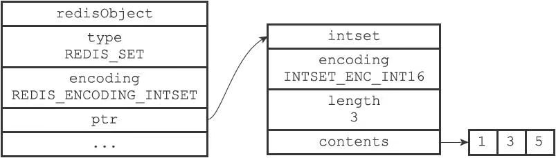

hashtable编码的fruits集合对象：

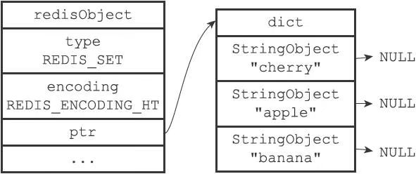

### 编码的转换

当集合对象可以同时满足以下两个条件时，对象使用intset编码：

- 集合对象保存的所有元素都是整数值；

- 集合对象保存的元素数量不超过512个。

不能满足这两个条件的集合对象需要使用hashtable编码。

> 第二个条件的上限值是可以修改的，具体请看配置文件中关于set-max-intset-entries选项的说明。

对于使用intset编码的集合对象来说，当使用intset编码所需的两个条件的任意一个不能被满足时，就会执行对象的编码转换操作，原本保存在整数集合中的所有元素都会被转移并保存到字典里面，并且对象的编码也会从intset变为hashtable。

### 集合命令的实现

集合命令的实现方法：

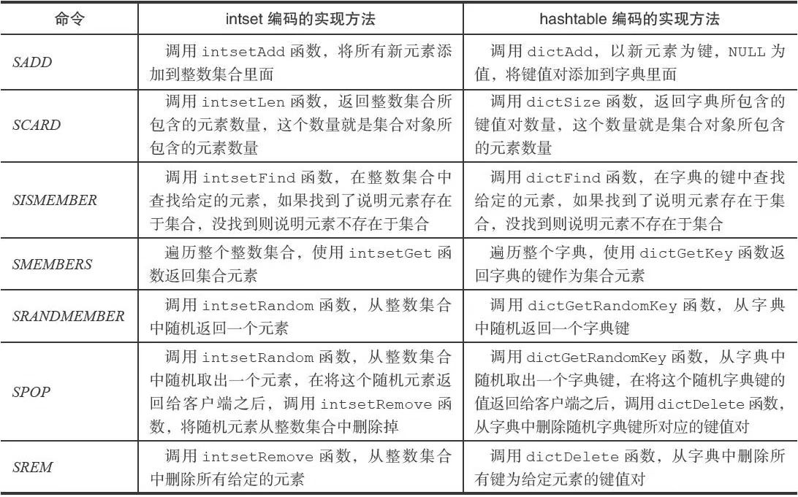

## 有序集合对象

有序集合的编码可以是ziplist或者skiplist。

ziplist编码的压缩列表对象使用压缩列表作为底层实现，每个集合元素使用两个紧挨在一起的压缩列表节点来保存，第一个节点保存元素的成员（member），而第二个元素则保存元素的分值（score）。

压缩列表内的集合元素按分值从小到大进行排序，分值较小的元素被放置在靠近表头的方向，而分值较大的元素则被放置在靠近表尾的方向。

skiplist编码的有序集合对象使用zset结构作为底层实现，一个zset结构同时包含一个字典和一个跳跃表：

```c
typedef struct zset {
    zskiplist *zsl;
    dict *dict;
} zset;
```

zset结构中的zsl跳跃表按分值从小到大保存了所有集合元素，每个跳跃表节点都保存了一个集合元素：跳跃表节点的object属性保存了元素的成员，而跳跃表节点的score属性则保存了元素的分值。通过这个跳跃表，程序可以对有序集合进行范围型操作，比如ZRANK、ZRANGE等命令就是基于跳跃表API来实现的。

除此之外，zset结构中的dict字典为有序集合创建了一个从成员到分值的映射，字典中的每个键值对都保存了一个集合元素：字典的键保存了元素的成员，而字典的值则保存了元素的分值。通过这个字典，程序可以用O（1）复杂度查找给定成员的分值，ZSCORE命令就是根据这一特性实现的，而很多其他有序集合命令都在实现的内部用到了这一特性。

有序集合每个元素的成员都是一个字符串对象，而每个元素的分值都是一个double类型的浮点数。值得一提的是，虽然zset结构同时使用跳跃表和字典来保存有序集合元素，但这两种数据结构都会通过指针来共享相同元素的成员和分值，所以同时使用跳跃表和字典来保存集合元素不会产生任何重复成员或者分值，也不会因此而浪费额外的内存。

### 为什么有序集合需要同时使用跳跃表和字典来实现？

如果我们只使用字典来实现有序集合，那么虽然以O（1）复杂度查找成员的分值这一特性会被保留，但是，因为字典以无序的方式来保存集合元素，所以每次在执行范围型操作——比如ZRANK、ZRANGE等命令时，程序都需要对字典保存的所有元素进行排序，完成这种排序需要至少O（NlogN）时间复杂度，以及额外的O（N）内存空间（因为要创建一个数组来保存排序后的元素）。

如果我们只使用跳跃表来实现有序集合，那么跳跃表执行范围型操作的所有优点都会被保留，但因为没有了字典，所以根据成员查找分值这一操作的复杂度将从O（1）上升为O（logN）。

因为以上原因，为了让有序集合的查找和范围型操作都尽可能快地执行，Redis选择了同时使用字典和跳跃表两种数据结构来实现有序集合。

### 编码的转换

当有序集合对象可以同时满足以下两个条件时，对象使用ziplist编码：

- 有序集合保存的元素数量小于128个；

- 有序集合保存的所有元素成员的长度都小于64字节；

不能满足以上两个条件的有序集合对象将使用skiplist编码。

> 以上两个条件的上限值是可以修改的，具体请看配置文件中关于zset-max-ziplist-entries选项和zset-max-ziplist-value选项的说明

对于使用ziplist编码的有序集合对象来说，当使用ziplist编码所需的两个条件中的任意一个不能被满足时，就会执行对象的编码转换操作，原本保存在压缩列表里的所有集合元素都会被转移并保存到zset结构里面，对象的编码也会从ziplist变为skiplist。

### 有序集合命令的实现

有序集合命令的实现方法：

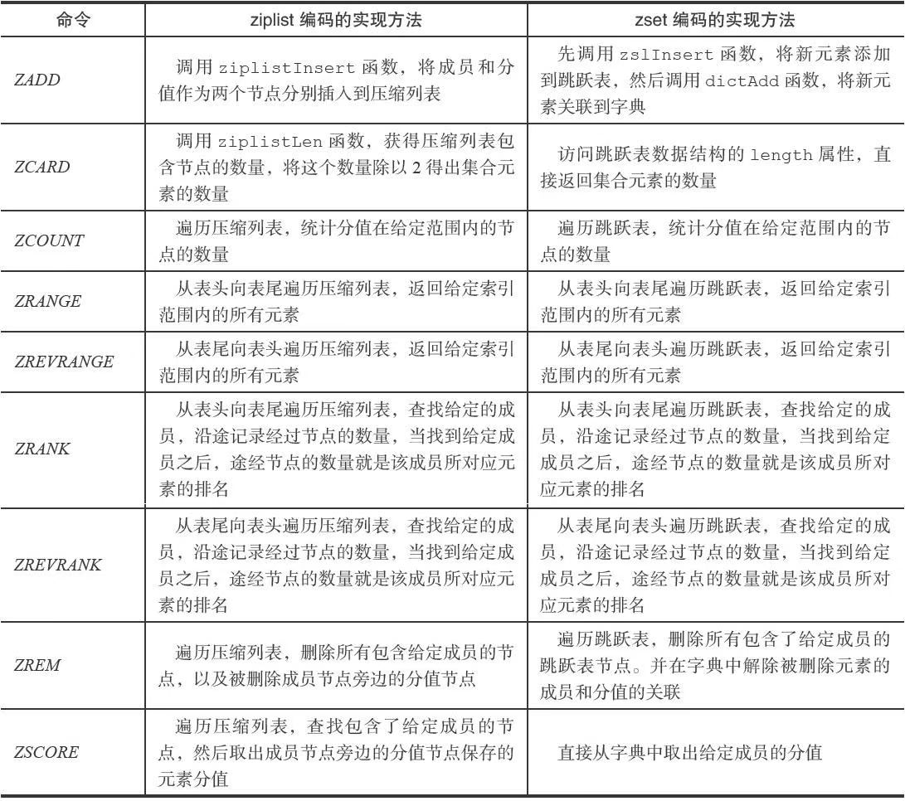

## 类型检查与命令多态

其中一种命令可以对任何类型的键执行，比如说DEL命令、EXPIRE命令、RENAME命令、TYPE命令、OBJECT命令等。

而另一种命令只能对特定类型的键执行，比如说：

- SET、GET、APPEND、STRLEN等命令只能对字符串键执行；
- HDEL、HSET、HGET、HLEN等命令只能对哈希键执行；
- RPUSH、LPOP、LINSERT、LLEN等命令只能对列表键执行；
- SADD、SPOP、SINTER、SCARD等命令只能对集合键执行；
- ZADD、ZCARD、ZRANK、ZSCORE等命令只能对有序集合键执行；

### 类型检查的实现

为了确保只有指定类型的键可以执行某些特定的命令，在执行一个类型特定的命令之前，Redis会先检查输入键的类型是否正确，然后再决定是否执行给定的命令。

类型特定命令所进行的类型检查是通过redisObject结构的type属性来实现的：

- 在执行一个类型特定命令之前，服务器会先检查输入数据库键的值对象是否为执行命令所需的类型，如果是的话，服务器就对键执行指定的命令；
- 否则，服务器将拒绝执行命令，并向客户端返回一个类型错误。

### 多态命令的实现

Redis除了会根据值对象的类型来判断键是否能够执行指定命令之外，还会根据值对象的编码方式，选择正确的命令实现代码来执行命令。

## 内存回收

因为C语言并不具备自动内存回收功能，所以Redis在自己的对象系统中构建了一个引用计数（reference counting）技术实现的内存回收机制，通过这一机制，程序可以通过跟踪对象的引用计数信息，在适当的时候自动释放对象并进行内存回收。

每个对象的引用计数信息由redisObject结构的refcount属性记录：

```c
typedef struct redisObject {
    // ...
    //引用计数
    int refcount;
    // ...
} robj;
```

对象的引用计数信息会随着对象的使用状态而不断变化：❑

- 在创建一个新对象时，引用计数的值会被初始化为1；
- 当对象被一个新程序使用时，它的引用计数值会被增一；
- 当对象不再被一个程序使用时，它的引用计数值会被减一；
- 当对象的引用计数值变为0时，对象所占用的内存会被释放。

## 对象共享

除了用于实现引用计数内存回收机制之外，对象的引用计数属性还带有对象共享的作用。

在Redis中，让多个键共享同一个值对象需要执行以下两个步骤：

1. 将数据库键的值指针指向一个现有的值对象；
2. 将被共享的值对象的引用计数增一。

目前来说，Redis会在初始化服务器时，创建一万个字符串对象，这些对象包含了从0到9999的所有整数值，当服务器需要用到值为0到9999的字符串对象时，服务器就会使用这些共享对象，而不是新创建对象。

> 创建共享字符串对象的数量可以通过修改redis.h/REDIS_SHARED_INTEGERS常量来修改。

**为什么Redis不共享包含字符串的对象？**

当服务器考虑将一个共享对象设置为键的值对象时，程序需要先检查给定的共享对象和键想创建的目标对象是否完全相同，只有在共享对象和目标对象完全相同的情况下，程序才会将共享对象用作键的值对象，而一个共享对象保存的值越复杂，验证共享对象和目标对象是否相同所需的复杂度就会越高，消耗的CPU时间也会越多：

- 如果共享对象是保存整数值的字符串对象，那么验证操作的复杂度为O（1）；
- 如果共享对象是保存字符串值的字符串对象，那么验证操作的复杂度为O（N）；
- 如果共享对象是包含了多个值（或者对象的）对象，比如列表对象或者哈希对象，那么验证操作的复杂度将会是O（N 2）。

因此，尽管共享更复杂的对象可以节约更多的内存，但受到CPU时间的限制，Redis只对包含整数值的字符串对象进行共享。

## 对象的空转时长

除了前面介绍过的type、encoding、ptr和refcount四个属性之外，redisObject结构包含的最后一个属性为lru属性，该属性记录了对象最后一次被命令程序访问的时间：

```c
typedef struct redisObject {
    // ...
    unsigned lru:22;
    // ...
} robj;
```

OBJECT IDLETIME命令可以打印出给定键的空转时长，这一空转时长就是通过将当前时间减去键的值对象的lru时间计算得出的：

> OBJECT IDLETIME命令的实现是特殊的，这个命令在访问键的值对象时，不会修改值对象的lru属性。

除了可以被OBJECT IDLETIME命令打印出来之外，键的空转时长还有另外一项作用：如果服务器打开了maxmemory选项，并且服务器用于回收内存的算法为volatile-lru或者allkeys-lru，那么当服务器占用的内存数超过了maxmemory选项所设置的上限值时，空转时长较高的那部分键会优先被服务器释放，从而回收内存。

