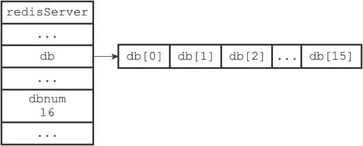

# 数据库

## 服务器中的数据库

Redis服务器将所有数据库都保存在服务器状态 `server.h/redisServer`结构的 `db`数组中，`db`数组的每个项都是一个 `server/redisDb`结构。

```c
struct redisServer {
    // ..
    redisDb * db;
    //..
    int dbnum;
    //..
    // 数据库键空间，保存着数据库中所有键值对
    dict *dict;
}
```

初始化服务器时，程序会根据dbnum属性来决定创建多少个数据库，默认为16。

```c
struct redisServer {
    // ...
    //服务器的数据库数量
    int dbnum;
    // ...
};
```
服务器数据库示例:


## 切换数据库

默认情况下，Redis客户端的目标数据库为0号数据库，但客户端可以通过执行SELECT命令来切换目标数据库。

在服务器内部，客户端状态redisClient结构的db属性记录了客户端当前的目标数据库，这个属性是一个指向redisDb结构的指针：

 ```c
 typedef struct redisClient {
 // ...
 //记录客户端当前正在使用的数据库
 redisDb *db;
 // ...
 } redisClient;
 ```

redisClient.db指针指向redisServer.db数组的其中一个元素，而被指向的元素就是客户端的目标数据库。

通过修改redisClient.db指针，让它指向服务器中的不同数据库，从而实现切换目标数据库的功能——这就是SELECT命令的实现原理。

## 数据库键空间

Redis是一个键值对（key-value pair）数据库服务器，服务器中的每个数据库都由一个redis.h/redisDb结构表示，其中，redisDb结构的dict字典保存了数据库中的所有键值对，我们将这个字典称为键空间（key space）：

```c
typedef struct redisDb {
    // ...
    //
    数据库键空间，保存着数据库中的所有键值对
    dict *dict;
    // ...
} redisDb;
```

键空间和用户所见的数据库是直接对应的：

- 键空间的键也就是数据库的键，每个键都是一个字符串对象。
- 键空间的值也就是数据库的值，每个值可以是字符串对象、列表对象、哈希表对象、集合对象和有序集合对象中的任意一种Redis对象。

### 读写键空间时的维护操作

当使用Redis命令对数据库进行读写时，服务器不仅会对键空间执行指定的读写操作，还会执行一些额外的维护操作，其中包括：

- 在读取一个键之后（读操作和写操作都要对键进行读取），服务器会根据键是否存在来更新服务器的键空间命中（hit）次数或键空间不命中（miss）次数，这两个值可以在INFO stats命令的keyspace_hits属性和keyspace_misses属性中查看。
- 在读取一个键之后，服务器会更新键的LRU（最后一次使用）时间，这个值可以用于计算键的闲置时间，使用OBJECT idletime命令可以查看键key的闲置时间。
- 如果服务器在读取一个键时发现该键已经过期，那么服务器会先删除这个过期键，然后才执行余下的其他操作。
- 如果有客户端使用WATCH命令监视了某个键，那么服务器在对被监视的键进行修改之后，会将这个键标记为脏（dirty），从而让事务程序注意到这个键已经被修改过。
- 服务器每次修改一个键之后，都会对脏（dirty）键计数器的值增1，这个计数器会触发服务器的持久化以及复制操作。
- 如果服务器开启了数据库通知功能，那么在对键进行修改之后，服务器将按配置发送相应的数据库通知。

## 设置键的生存时间或过期时间

通过EXPIRE命令或者PEXPIRE命令，客户端可以以秒或者毫秒精度为数据库中的某个键设置生存时间（Time To Live，TTL），在经过指定的秒数或者毫秒数之后，服务器就会自动删除生存时间为0的键：

```sh
redis＞ SET key value
OK
redis＞ EXPIRE key 5
(integer) 1
redis＞ GET key  // 5秒之内
"value"
redis＞ GET key  // 5秒之后
(nil)
```

> SETEX命令可以在设置一个字符串键的同时为键设置过期时间，因为这个命令是一个类型限定的命令（只能用于字符串键），SETEX命令设置过期时间的原理和EXPIRE命令设置过期时间的原理是完全一样的。

与EXPIRE命令和PEXPIRE命令类似，客户端可以通过EXPIREAT命令或PEXPIREAT命令，以秒或者毫秒精度给数据库中的某个键设置过期时间（expiretime）。

TTL命令和PTTL命令接受一个带有生存时间或者过期时间的键，返回这个键的剩余生存时间，也就是，返回距离这个键被服务器自动删除还有多长时间。

### 设置过期时间

Redis有四个不同的命令可以用于设置键的生存时间（键可以存在多久）或过期时间（键什么时候会被删除）：

- EXPIRE＜key＞＜ttl＞命令用于将键key的生存时间设置为ttl秒。
- PEXPIRE＜key＞＜ttl＞命令用于将键key的生存时间设置为ttl毫秒。
- EXPIREAT＜key＞＜timestamp＞命令用于将键key的过期时间设置为timestamp所指定的秒数时间戳。
- PEXPIREAT＜key＞＜timestamp＞命令用于将键key的过期时间设置为timestamp所指定的毫秒数时间戳。

实际上EXPIRE、PEXPIRE、EXPIREAT三个命令都是使用PEXPIREAT命令来实现的：无论客户端执行的是以上四个命令中的哪一个，经过转换之后，最终的执行效果都和执行PEXPIREAT命令一样。

### 保存过期时间

redisDb结构的expires字典保存了数据库中所有键的过期时间，我们称这个字典为过期字典：

- 过期字典的键是一个指针，这个指针指向键空间中的某个键对象（也即是某个数据库键）。
- 过期字典的值是一个long long类型的整数，这个整数保存了键所指向的数据库键的过期时间——一个毫秒精度的UNIX时间戳。

```c
typedef struct redisDb {
    // ...
    //过期字典，保存着键的过期时间
    dict *expires;
    // ...
} redisDb;
```

以下是PEXPIREAT命令的伪代码定义：

```python
def PEXPIREAT(key, expire_time_in_ms):
    #如果给定的键不存在于键空间，那么不能设置过期时间
    if key not in redisDb.dict:
        return0
    #在过期字典中关联键和过期时间
    redisDb.expires[key] = expire_time_in_ms
    #过期时间设置成功
    return 1
```

### 移除过期时间

PERSIST命令可以移除一个键的过期时间：

PERSIST命令就是PEXPIREAT命令的反操作：PERSIST命令在过期字典中查找给定的键，并解除键和值（过期时间）在过期字典中的关联。

### 计算并返回剩余生存时间

TTL命令以秒为单位返回键的剩余生存时间，而PTTL命令则以毫秒为单位返回键的剩余生存时间。

TTL和PTTL两个命令都是通过计算键的过期时间和当前时间之间的差来实现的。

##  过期键删除策略

过期键删除有三种不同的删除策略：

- 定时删除：在设置键的过期时间的同时，创建一个定时器（timer），让定时器在键的过期时间来临时，立即执行对键的删除操作。
- 惰性删除：放任键过期不管，但是每次从键空间中获取键时，都检查取得的键是否过期，如果过期的话，就删除该键；如果没有过期，就返回该键。
- 定期删除：每隔一段时间，程序就对数据库进行一次检查，删除里面的过期键。至于要删除多少过期键，以及要检查多少个数据库，则由算法决定。

## Redis的过期键删除策略

Redis服务器实际使用的是**惰性删除**和**定期删除**两种策略：通过配合使用这两种删除策略，服务器可以很好地在合理使用CPU时间和避免浪费内存空间之间取得平衡。

### 惰性删除策略的实现

过期键的惰性删除策略由`db.c/expireIfNeeded`函数实现，所有读写数据库的Redis命令在执行之前都会调用expireIfNeeded函数对输入键进行检查：如果输入键已经过期，那么expireIfNeeded函数将输入键从数据库中删除。

expireIfNeeded函数就像一个过滤器，它可以在命令真正执行之前，过滤掉过期的输入键，从而避免命令接触到过期键。

另外，因为每个被访问的键都可能因为过期而被expireIfNeeded函数删除，所以每个命令的实现函数都必须能同时处理键存在以及键不存在这两种情况：

- 当键存在时，命令按照键存在的情况执行。
- 当键不存在或者键因为过期而被expireIfNeeded函数删除时，命令按照键不存在的情况执行。

### 定期删除策略的实现

最新版代码位置：`expire.c:activeExpireCycle`

过期键的定期删除策略由`redis.c/activeExpireCycle`函数实现，每当Redis的服务器周期性操作`redis.c/serverCron`函数执行时，`activeExpireCycle`函数就会被调用，它在规定的时间内，分多次遍历服务器中的各个数据库，从数据库的expires字典中随机检查一部分键的过期时间，并删除其中的过期键。

整个过程可以用伪代码描述如下：

```python
#默认每次检查的数据库数量
DEFAULT_DB_NUMBERS = 16
#默认每个数据库检查的键数量
DEFAULT_KEY_NUMBERS = 20
#全局变量，记录检查进度
current_db = 0
def activeExpireCycle():
    #初始化要检查的数据库数量
    #如果服务器的数据库数量比 DEFAULT_DB_NUMBERS要小
    #那么以服务器的数据库数量为准
    if server.dbnum ＜ DEFAULT_DB_NUMBERS:
        db_numbers = server.dbnum
    else:
        db_numbers = DEFAULT_DB_NUMBERS
    #遍历各个数据库
    for i in range(db_numbers):
        #如果current_db的值等于服务器的数据库数量
        #这表示检查程序已经遍历了服务器的所有数据库一次
        #将current_db重置为0，开始新的一轮遍历
        if current_db == server.dbnum:
            current_db = 0
        #获取当前要处理的数据库
        redisDb = server.db[current_db]
        #将数据库索引增1，指向下一个要处理的数据库
        current_db += 1
        #检查数据库键
        for j in range(DEFAULT_KEY_NUMBERS):
            #如果数据库中没有一个键带有过期时间，那么跳过这个数据库
            if redisDb.expires.size() == 0: break
            #随机获取一个带有过期时间的键
            key_with_ttl = redisDb.expires.get_random_key()
            #检查键是否过期，如果过期就删除它
            if is_expired(key_with_ttl):
                delete_key(key_with_ttl)
            #已达到时间上限，停止处理
            if reach_time_limit(): return
```

activeExpireCycle函数的工作模式可以总结如下：

- 函数每次运行时，都从一定数量的数据库中取出一定数量的随机键进行检查，并删除其中的过期键。
- 全局变量current_db会记录当前activeExpireCycle函数检查的进度，并在下一次activeExpireCycle函数调用时，接着上一次的进度进行处理。比如说，如果当前activeExpireCycle函数在遍历10号数据库时返回了，那么下次activeExpireCycle函数执行时，将从11号数据库开始查找并删除过期键。
- 随着activeExpireCycle函数的不断执行，服务器中的所有数据库都会被检查一遍，这时函数将current_db变量重置为0，然后再次开始新一轮的检查工作。

## AOF、RDB和复制功能对过期键的处理

### 生成RDB文件

在执行SAVE命令或者BGSAVE命令创建一个新的RDB文件时，程序会对数据库中的键进行检查，已过期的键不会被保存到新创建的RDB文件中。因此，数据库中包含过期键不会对生成新的RDB文件造成影响。

### 载入RDB文件

在启动Redis服务器时，如果服务器开启了RDB功能，那么服务器将对RDB文件进行载入：

- 如果服务器以主服务器模式运行，那么在载入RDB文件时，程序会对文件中保存的键进行检查，未过期的键会被载入到数据库中，而过期键则会被忽略，所以过期键对载入RDB文件的主服务器不会造成影响。
- 如果服务器以从服务器模式运行，那么在载入RDB文件时，文件中保存的所有键，不论是否过期，都会被载入到数据库中。不过，因为主从服务器在进行数据同步的时候，从服务器的数据库就会被清空，所以一般来讲，过期键对载入RDB文件的从服务器也不会造成影响。

### AOF文件写入

当服务器以AOF持久化模式运行时，如果数据库中的某个键已经过期，但它还没有被惰性删除或者定期删除，那么AOF文件不会因为这个过期键而产生任何影响。当过期键被惰性删除或者定期删除之后，程序会向AOF文件追加（append）一条DEL命令，来显式地记录该键已被删除。

### AOF重写

和生成RDB文件时类似，在执行AOF重写的过程中，程序会对数据库中的键进行检查，已过期的键不会被保存到重写后的AOF文件中。因此，数据库中包含过期键不会对AOF重写造成影响。

### 复制

当服务器运行在复制模式下时，从服务器的过期键删除动作由主服务器控制：

1. 主服务器在删除一个过期键之后，会显式地向所有从服务器发送一个DEL命令，告知从服务器删除这个过期键。
2. 从服务器在执行客户端发送的读命令时，即使碰到过期键也不会将过期键删除，而是继续像处理未过期的键一样来处理过期键。
3. 从服务器只有在接到主服务器发来的DEL命令之后，才会删除过期键。

通过由主服务器来控制从服务器统一地删除过期键，可以保证主从服务器数据的一致性，也正是因为这个原因，当一个过期键仍然存在于主服务器的数据库时，这个过期键在从服务器里的复制品也会继续存在。

虽然这个过期键在从服务器中存在，但是在向从服务器调用get命令获取时由于键已过期，并不会返回给客户端。

## 数据库通知

数据库通知是Redis 2.8版本新增加的功能，这个功能可以让客户端通过订阅给定的频道或者模式，来获知数据库中键的变化，以及数据库中命令的执行情况。

关注“某个键执行了什么命令”的通知称为键空间通知（key-spacenotification），除此之外，还有另一类称为键事件通知（key-eventnotification）的通知，它们关注的是“某个命令被什么键执行了”。

服务器配置的notify-keyspace-events选项决定了服务器所发送通知的类型：

- 想让服务器发送所有类型的键空间通知和键事件通知，可以将选项的值设置为AKE。
- 想让服务器发送所有类型的键空间通知，可以将选项的值设置为AK。
- 想让服务器发送所有类型的键事件通知，可以将选项的值设置为AE。
- 想让服务器只发送和字符串键有关的键空间通知，可以将选项的值设置为K$。
- 想让服务器只发送和列表键有关的键事件通知，可以将选项的值设置为El。

通知的详细用法以及notify-keyspace-events选项的更多设置可以查看redis官网。

### 发送通知

发送数据库通知的功能是由`notify.c/notifyKeyspaceEvent`函数实现的：

```c
void notifyKeyspaceEvent(int type,char *event,robj *key,int dbid);
```

函数的type参数是当前想要发送的通知的类型，程序会根据这个值来判断通知是否就是服务器配置notify-keyspace-events选项所选定的通知类型，从而决定是否发送通知。

event、keys和dbid分别是事件的名称、产生事件的键，以及产生事件的数据库号码，函数会根据type参数以及这三个参数来构建事件通知的内容，以及接收通知的频道名。

每当一个Redis命令需要发送数据库通知的时候，该命令的实现函数就会调用notify-KeyspaceEvent函数，并向函数传递传递该命令所引发的事件的相关信息。

### 发送通知的实现

以下是notifyKeyspaceEvent函数的伪代码实现：

```python
def notifyKeyspaceEvent(type, event, key, dbid):
    #如果给定的通知不是服务器允许发送的通知，那么直接返回
    if not(server.notify_keyspace_events & type):
        return
    #发送键空间通知
    if server.notify_keyspace_events & REDIS_NOTIFY_KEYSPACE:
        #将通知发送给频道__keyspace@＜dbid＞__:＜key＞
        #内容为键所发生的事件 ＜event＞
        #构建频道名字
        chan = "__keyspace@{dbid}__:{key}".format(dbid=dbid, key=key)
        #发送通知
        pubsubPublishMessage(chan, event)
    #发送键事件通知
    if server.notify_keyspace_events & REDIS_NOTIFY_KEYEVENT:
        #将通知发送给频道__keyevent@＜dbid＞__:＜event＞
        #内容为发生事件的键 ＜key＞
        #构建频道名字
        chan = "__keyevent@{dbid}__:{event}".format(dbid=dbid,event=event)
        #发送通知
        pubsubPublishMessage(chan, key)
```

notifyKeyspaceEvent函数执行以下操作：

1. server.notify_keyspace_events属性就是服务器配置notify-keyspace-events选项所设置的值，如果给定的通知类型type不是服务器允许发送的通知类型，那么函数会直接返回，不做任何动作。
2. 如果给定的通知是服务器允许发送的通知，那么下一步函数会检测服务器是否允许发送键空间通知，如果允许的话，程序就会构建并发送事件通知。
3. 最后，函数检测服务器是否允许发送键事件通知，如果允许的话，程序就会构建并发送事件通知。

pubsubPublishMessage函数是PUBLISH命令的实现函数，执行这个函数等同于执行PUBLISH命令，订阅数据库通知的客户端收到的信息就是由这个函数发出的，