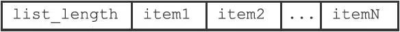

# RDB持久化

因为Redis是内存数据库，它将自己的数据库状态储存在内存里面，所以如果不想办法将储存在内存中的数据库状态保存到磁盘里面，那么一旦服务器进程退出，服务器中的数据库状态也会消失不见。

为了解决这个问题，Redis提供了RDB持久化功能，这个功能可以将Redis在内存中的数据库状态保存到磁盘里面，避免数据意外丢失。

RDB持久化既可以手动执行，也可以根据服务器配置选项定期执行，该功能可以将某个时间点上的数据库状态保存到一个RDB文件中。

RDB持久化功能所生成的RDB文件是一个经过压缩的二进制文件，通过该文件可以还原生成RDB文件时的数据库状态。

因为RDB文件是保存在硬盘里面的，所以即使Redis服务器进程退出，甚至运行Redis服务器的计算机停机，但只要RDB文件仍然存在，Redis服务器就可以用它来还原数据库状态。

## RDB文件的创建和载入

有两个Redis命令可以用于生成RDB文件，一个是SAVE，另一个是BGSAVE。

- SAVE命令会阻塞Redis服务器进程，直到RDB文件创建完毕为止，在服务器进程阻塞期间，服务器不能处理任何命令请求
- BGSAVE命令会派生出一个子进程，然后由子进程负责创建RDB文件，服务器进程（父进程）继续处理命令请求

创建RDB文件的实际工作由`rdb.c/rdbSave`函数完成，SAVE命令和BGSAVE命令会以不同的方式调用这个函数，通过以下伪代码可以明显地看出这两个命令之间的区别：

```python
def SAVE():
    #创建RDB文件
    rdbSave()
def BGSAVE():
    #创建子进程
    pid = fork()
    if pid == 0:
        #子进程负责创建RDB文件
        rdbSave()
        #完成之后向父进程发送信号
        signal_parent()
    elif pid ＞ 0:
        #父进程继续处理命令请求，并通过轮询等待子进程的信号
        handle_request_and_wait_signal()
    else:
        #处理出错情况
        handle_fork_error()
```

和使用SAVE命令或者BGSAVE命令创建RDB文件不同，RDB文件的载入工作是在服务器启动时自动执行的，所以Redis并没有专门用于载入RDB文件的命令，只要Redis服务器在启动时检测到RDB文件存在，它就会自动载入RDB文件。

另外值得一提的是，因为AOF文件的更新频率通常比RDB文件的更新频率高，所以：

- 如果服务器开启了AOF持久化功能，那么服务器会优先使用AOF文件来还原数据库状态。
- 只有在AOF持久化功能处于关闭状态时，服务器才会使用RDB文件来还原数据库状态。

载入RDB文件的实际工作由 `rdb.c/rdbLoad`函数完成。

###  SAVE命令执行时的服务器状态

当SAVE命令执行时，Redis服务器会被阻塞，所以当SAVE命令正在执行时，客户端发送的所有命令请求都会被拒绝。只有在服务器执行完SAVE命令、重新开始接受命令请求之后，客户端发送的命令才会被处理。

###  BGSAVE命令执行时的服务器状态

因为**BGSAVE**命令的保存工作是由子进程执行的，所以在子进程创建RDB文件的过程中，Redis服务器仍然可以继续处理客户端的命令请求，但是，在**BGSAVE**命令执行期间，服务器处理**SAVE**、**BGSAVE**、**BGREWRITEAOF**三个命令的方式会和平时有所不同。

- 在BGSAVE命令执行期间，客户端发送的SAVE命令会被服务器拒绝，服务器禁止SAVE命令和BGSAVE命令同时执行是为了避免父进程（服务器进程）和子进程同时执行两个rdbSave调用，防止产生竞争条件。
- 在BGSAVE命令执行期间，客户端发送的BGSAVE命令会被服务器拒绝，因为同时执行两个BGSAVE命令也会产生竞争条件。
- BGREWRITEAOF和BGSAVE两个命令不能同时执行。
  - 如果BGSAVE命令正在执行，那么客户端发送的BGREWRITEAOF命令会被延迟到BGSAVE命令执行完毕之后执行。
  - 如果BGREWRITEAOF命令正在执行，那么客户端发送的BGSAVE命令会被服务器拒绝。

因为BGREWRITEAOF和BGSAVE两个命令的实际工作都由子进程执行，所以这两个命令在操作方面并没有什么冲突的地方，不能同时执行它们只是一个性能方面的考虑——并发出两个子进程，并且这两个子进程都同时执行大量的磁盘写入操作，这怎么想都不会是一个好主意。

###  RDB文件载入时的服务器状态

服务器在载入RDB文件期间，会一直处于阻塞状态，直到载入工作完成为止。

## 自动间隔性保存

因为BGSAVE命令可以在不阻塞服务器进程的情况下执行，所以Redis允许用户通过设置服务器配置的save选项，让服务器每隔一段时间自动执行一次BGSAVE命令。

用户可以通过save选项设置多个保存条件，但只要其中任意一个条件被满足，服务器就会执行BGSAVE命令。

举个例子，如果我们向服务器提供以下配置：

```sh
save 900 1
save 300 10
save 60 10000
```

那么只要满足以下三个条件中的任意一个，BGSAVE命令就会被执行：

- 服务器在900秒之内，对数据库进行了至少1次修改。
- 服务器在300秒之内，对数据库进行了至少10次修改。
- 服务器在60秒之内，对数据库进行了至少10000次修改。

### 设置保存条件

当Redis服务器启动时，用户可以通过指定配置文件或者传入启动参数的方式设置save选项，如果用户没有主动设置save选项，那么服务器会为save选项设置默认条件：

```sh
save 900 1
save 300 10
save 60 10000
```

接着，服务器程序会根据save选项所设置的保存条件，设置服务器状态redisServer结构的saveparams属性：

```c
struct redisServer {
    // ...
    //记录了保存条件的数组
    struct saveparam *saveparams;
    // ...
};
```

saveparams属性是一个数组，数组中的每个元素都是一个saveparam结构，每个saveparam结构都保存了一个save选项设置的保存条件：

```c
struct saveparam {
    //秒数
    time_t seconds;
    //修改数
    int changes;
};
```

### dirty计数器和lastsave属性

除了saveparams数组之外，服务器状态还维持着一个dirty计数器，以及一个lastsave属性：

- dirty计数器记录距离上一次成功执行SAVE命令或者BGSAVE命令之后，服务器对数据库状态（服务器中的所有数据库）进行了多少次修改（包括写入、删除、更新等操作）。
- lastsave属性是一个UNIX时间戳，记录了服务器上一次成功执行SAVE命令或者BGSAVE命令的时间。

```c
struct redisServer {
    // ...
    //修改计数器
    long long dirty;
    //上一次执行保存的时间
    time_t lastsave;
    // ...
};
```

当服务器成功执行一个数据库修改命令之后，程序就会对dirty计数器进行更新：命令修改了多少次数据库，dirty计数器的值就增加多少。

###  检查保存条件是否满足

Redis的服务器周期性操作函数serverCron默认每隔100毫秒就会执行一次，该函数用于对正在运行的服务器进行维护，它的其中一项工作就是检查save选项所设置的保存条件是否已经满足，如果满足的话，就执行BGSAVE命令。

以下伪代码展示了serverCron函数检查保存条件的过程：

```python
def serverCron():
    # ...
    #遍历所有保存条件
    for saveparam in server.saveparams:
        #计算距离上次执行保存操作有多少秒
        save_interval = unixtime_now()-server.lastsave
        #如果数据库状态的修改次数超过条件所设置的次数
        #并且距离上次保存的时间超过条件所设置的时间
        #那么执行保存操作
        if server.dirty ＞= saveparam.changes and \
           save_interval ＞ saveparam.seconds:
            BGSAVE()
    # ...
```

程序会遍历并检查saveparams数组中的所有保存条件，只要有任意一个条件被满足，那么服务器就会执行BGSAVE命令。

## RDB文件结构

RDB：Redis Database

**RDB文件结构**

| REDIS | db_version | database | EOR  | check_sum |
| ----- | ---------- | -------- | ---- | --------- |

> 全大写单词标示常量，全小写单词标示变量和数据

- **REDIS**：RDB文件的最开头是REDIS部分，这个部分的长度为5字节，保存着“REDIS”五个字符。通过这五个字符，程序可以在载入文件时，快速检查所载入的文件是否RDB文件
- **db_version**: db_version长度为4字节，它的值是一个字符串表示的整数，这个整数记录了RDB文件的版本号，比如"0006"就代表RDB文件的版本为第六版
- **database**: database部分包含着零个或任意多个数据库，以及各个数据库中的键值对数据
  - 如果服务器的数据库状态为空（所有数据库都是空的），那么这个部分也为空，长度为0字节。
  - 如果服务器的数据库状态为非空（有至少一个数据库非空），那么这个部分也为非空，根据数据库所保存键值对的数量、类型和内容不同，这个部分的长度也会有所不同。
- **EOR**：EOF常量的长度为1字节，这个常量标志着RDB文件正文内容的结束，当读入程序遇到这个值的时候，它知道所有数据库的所有键值对都已经载入完毕了。
- **checksum**: check_sum是一个8字节长的无符号整数，保存着一个校验和，这个校验和是程序通过对REDIS、db_version、databases、EOF四个部分的内容进行计算得出的。服务器在载入RDB文件时，会将载入数据所计算出的校验和与check_sum所记录的校验和进行对比，以此来检查RDB文件是否有出错或者损坏的情况出现。

### databases部分

一个RDB文件的databases部分可以保存任意多个非空数据库

每个非空数据库在RDB文件中都可以保存为SELECTDB、db_number、key_value_pairs三个部分。

**database的数据结构**

| SELECTBD | db_number | key_value_pairs |
| -------- | --------- | --------------- |

- **SELECTDB**: SELECTDB常量的长度为1字节，当读入程序遇到这个值的时候，它知道接下来要读入的将是一个数据库号码。
- **db_number**: db_number保存着一个数据库号码，根据号码的大小不同，这个部分的长度可以是1字节、2字节或者5字节。当程序读入db_number部分之后，服务器会调用SELECT命令，根据读入的数据库号码进行数据库切换，使得之后读入的键值对可以载入到正确的数据库中。
- **key_value_pairs**: key_value_pairs部分保存了数据库中的所有键值对数据，如果键值对带有过期时间，那么过期时间也会和键值对保存在一起。根据键值对的数量、类型、内容以及是否有过期时间等条件的不同，key_value_pairs部分的长度也会有所不同。

### key_value_pairs部分

RDB文件中的每个key_value_pairs部分都保存了一个或以上数量的键值对，如果键值对带有过期时间的话，那么键值对的过期时间也会被保存在内。

不带过期时间的键值对在RDB文件中由TYPE、key、value三部分组成

| TYPE | key  | value |
| ---- | ---- | ----- |

- TYPE记录了value的类型，长度为1字节，值可以是以下常量中的一个：
  - REDIS_RDB_TYPE_STRING
  - REDIS_RDB_TYPE_LIST
  - REDIS_RDB_TYPE_SET
  - REDIS_RDB_TYPE_ZSET
  - REDIS_RDB_TYPE_HASH
  - REDIS_RDB_TYPE_LIST_ZIPLIST
  - REDIS_RDB_TYPE_SET_INTSET
  - REDIS_RDB_TYPE_ZSET_ZIPLIST
  - REDIS_RDB_TYPE_HASH_ZIPLIST
  - 以上列出的每个TYPE常量都代表了一种对象类型或者底层编码，当服务器读入RDB文件中的键值对数据时，程序会根据TYPE的值来决定如何读入和解释value的数据。

- key总是一个字符串对象，它的编码方式和REDIS_RDB_TYPE_STRING类型的value一样。根据内容长度的不同，key的长度也会有所不同。
- 根据TYPE类型的不同，以及保存内容长度的不同，保存value的结构和长度也会有所不同。

带有过期时间的键值对：

| EXPIRETIME_MS | ms   | TYPE | key  | value |
| ------------- | ---- | ---- | ---- | ----- |

- EXPIRETIME_MS常量的长度为1字节，它告知读入程序，接下来要读入的将是一个以毫秒为单位的过期时间。
- ms是一个8字节长的带符号整数，记录着一个以毫秒为单位的UNIX时间戳，这个时间戳就是键值对的过期时间。

### value的编码

RDB文件中的每个value部分都保存了一个值对象，每个值对象的类型都由与之对应的TYPE记录，根据类型的不同，value部分的结构、长度也会有所不同。

#### 1.字符串对象

如果TYPE的值为REDIS_RDB_TYPE_STRING，那么value保存的就是一个字符串对象，字符串对象的编码可以是REDIS_ENCODING_INT或者REDIS_ENCODING_RAW。

如果字符串对象的编码为REDIS_ENCODING_INT，那么说明对象中保存的是长度不超过32位的整数，这种编码的对象将以下图所示的结构保存。其中，ENCODING的值可以是REDIS_RDB_ENC_INT8、REDIS_RDB_ENC_INT16或者REDIS_RDB_ENC_INT32三个常量的其中一个，它们分别代表RDB文件使用8位（bit）、16位或者32位来保存整数值integer。


如果字符串对象的编码为REDIS_ENCODING_RAW，那么说明对象所保存的是一个字符串值，根据字符串长度的不同，有压缩和不压缩两种方法来保存这个字符串：

- 如果字符串的长度小于等于20字节，那么这个字符串会直接被原样保存。
- 如果字符串的长度大于20字节，那么这个字符串会被压缩之后再保存。

> 以上两个条件是在假设服务器打开了RDB文件压缩功能的情况下进行的，如果服务器关闭了RDB文件压缩功能，那么RDB程序总以无压缩的方式保存字符串值。具体信息可以参考redis.conf文件中关于rdbcompression选项的说明。

对于没有被压缩的字符串，RDB程序会以下图所示的结构来保存该字符串。string部分保存了字符串值本身，而len保存了字符串值的长度。


对于压缩后的字符串，RDB程序会以下图所示的结构来保存该字符串。


其中，REDIS_RDB_ENC_LZF常量标志着字符串已经被LZF算法压缩过了，读入程序在碰到这个常量时，会根据之后的compressed_len、origin_len和compressed_string三部分，对字符串进行解压缩：其中compressed_len记录的是字符串被压缩之后的长度，而origin_len记录的是字符串原来的长度，compressed_string记录的则是被压缩之后的字符串。

#### 2.列表对象

如果TYPE的值为REDIS_RDB_TYPE_LIST，那么value保存的就是一个REDIS_ENCODING_LINKEDLIST编码的列表对象，RDB文件保存这种对象的结构如下图所示。



list_length记录了列表的长度，它记录列表保存了多少个项（item），读入程序可以通过这个长度知道自己应该读入多少个列表项。

图中以item开头的部分代表列表的项，因为每个列表项都是一个字符串对象，所以程序会以处理字符串对象的方式来保存和读入列表项。

#### 3.集合对象

如果TYPE的值为REDIS_RDB_TYPE_SET，那么value保存的就是一个REDIS_ENCODING_HT编码的集合对象，RDB文件保存这种对象的结构如图所示。


其中，set_size是集合的大小，它记录集合保存了多少个元素，读入程序可以通过这个大小知道自己应该读入多少个集合元素。

图中以elem开头的部分代表集合的元素，因为每个集合元素都是一个字符串对象，所以程序会以处理字符串对象的方式来保存和读入集合元素。

#### 4.哈希表对象

如果TYPE的值为REDIS_RDB_TYPE_HASH，那么value保存的就是一个REDIS_ENCODING_HT编码的集合对象，RDB文件保存这种对象的结构如图所示：

- hash_size记录了哈希表的大小，也即是这个哈希表保存了多少键值对，读入程序可以通过这个大小知道自己应该读入多少个键值对。
- 以key_value_pair开头的部分代表哈希表中的键值对，键值对的键和值都是字符串对象，所以程序会以处理字符串对象的方式来保存和读入键值对。


#### 5.有序集合对象

如果TYPE的值为REDIS_RDB_TYPE_ZSET，那么value保存的就是一个REDIS_ENCODING_SKIPLIST编码的有序集合对象，RDB文件保存这种对象的结构如图所示。


sorted_set_size记录了有序集合的大小，也即是这个有序集合保存了多少元素，读入程序需要根据这个值来决定应该读入多少有序集合元素。

以element开头的部分代表有序集合中的元素，每个元素又分为成员（member）和分值（score）两部分，成员是一个字符串对象，分值则是一个double类型的浮点数，程序在保存RDB文件时会先将分值转换成字符串对象，然后再用保存字符串对象的方法将分值保存起来。

有序集合中的每个元素都以成员紧挨着分值的方式排列:


更详细的SKIPLIST编码有序集合对象的保存结构:


#### 6.INTSET编码的集合

如果TYPE的值为REDIS_RDB_TYPE_SET_INTSET，那么value保存的就是一个整数集合对象，RDB文件保存这种对象的方法是，先将整数集合转换为字符串对象，然后将这个字符串对象保存到RDB文件里面。

如果程序在读入RDB文件的过程中，碰到由整数集合对象转换成的字符串对象，那么程序会根据TYPE值的指示，先读入字符串对象，再将这个字符串对象转换成原来的整数集合对象。

#### 7.ZIPLIST编码的列表、哈希表或者有序集合

如果TYPE的值为REDIS_RDB_TYPE_LIST_ZIPLIST、REDIS_RDB_TYPE_HASH_ZIPLIST或者REDIS_RDB_TYPE_ZSET_ZIPLIST，那么value保存的就是一个压缩列表对象，RDB文件保存这种对象的方法是：

1. 将压缩列表转换成一个字符串对象。
2. 将转换所得的字符串对象保存到RDB文件。

如果程序在读入RDB文件的过程中，碰到由压缩列表对象转换成的字符串对象，那么程序会根据TYPE值的指示，执行以下操作：

1. 读入字符串对象，并将它转换成原来的压缩列表对象。
2. 根据TYPE的值，设置压缩列表对象的类型：如果TYPE的值为REDIS_RDB_TYPE_LIST_ZIPLIST，那么压缩列表对象的类型为列表；如果TYPE的值为REDIS_RDB_TYPE_HASH_ZIPLIST，那么压缩列表对象的类型为哈希表；如果TYPE的值为REDIS_RDB_TYPE_ZSET_ZIPLIST，那么压缩列表对象的类型为有序集合。

## 分析RDB文件

```bash
查找rdb文件位置: config get dir
打印rdb文件: od -c dump.rdb
同时使用ASCII和十六进制打印RDB文件: od -cx dump.rdb
```

## 参考资料

- Sripathi Krishnan编写的《Redis RDB文件格式》文档以文字的形式详细记录了RDB文件的格式，如果想深入理解RDB文件，或者为RDB文件编写分析/载入程序，那么这篇文档会是很好的参考资料：https://github.com/sripathikrishnan/redis-rdb-tools/wiki/Redis-RDB-Dump-File-Format。
