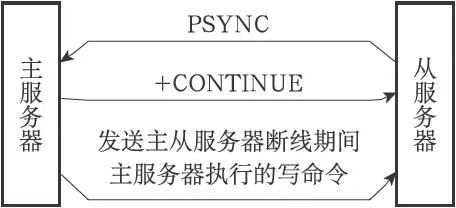
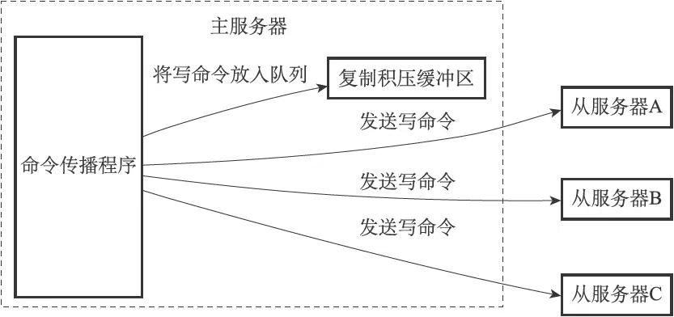
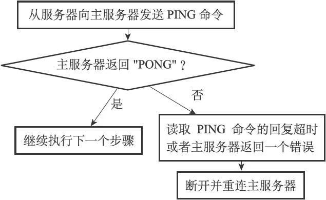
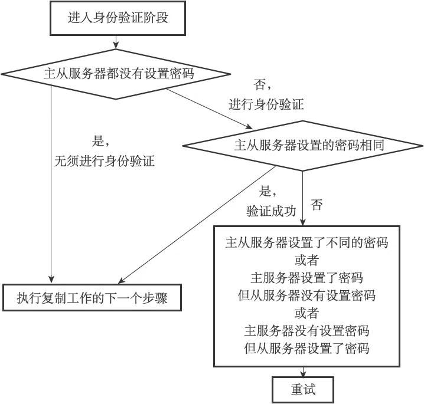

# 复制

用户可以通过执行SLAVEOF命令或者设置slaveof选项，让一个服务器去复制（replicate）另一个服务器，我们称呼被复制的服务器为主服务器（master），而对主服务器进行复制的服务器则被称为从服务器（slave）。


进行复制中的主从服务器双方的数据库将保存相同的数据，概念上将这种现象称作“数据库状态一致”，或者简称“一致”。

Redis官方网站上的《复制》文档（http://redis.io/topics/replication）有对这一特性做详细的介绍。

## 旧版复制功能的实现

Redis的复制功能分为同步（sync）和命令传播（command propagate）两个操作：

- 同步操作用于将从服务器的数据库状态更新至主服务器当前所处的数据库状态。
- 命令传播操作则用于在主服务器的数据库状态被修改，导致主从服务器的数据库状态出现不一致时，让主从服务器的数据库重新回到一致状态。

### 同步

当客户端向从服务器发送SLAVEOF命令，要求从服务器复制主服务器时，从服务器首先需要执行同步操作，也即是，将从服务器的数据库状态更新至主服务器当前所处的数据库状态。

从服务器对主服务器的同步操作需要通过向主服务器发送SYNC命令来完成：

1. 从服务器向主服务器发送SYNC命令。
2. 收到SYNC命令的主服务器执行BGSAVE命令，在后台生成一个RDB文件，并使用一个缓冲区记录从现在开始执行的所有写命令。
3. 当主服务器的BGSAVE命令执行完毕时，主服务器会将BGSAVE命令生成的RDB文件发送给从服务器，从服务器接收并载入这个RDB文件，将自己的数据库状态更新至主服务器执行BGSAVE命令时的数据库状态。
4. 主服务器将记录在缓冲区里面的所有写命令发送给从服务器，从服务器执行这些写命令，将自己的数据库状态更新至主服务器数据库当前所处的状态。


### 命令传播

每当主服务器执行写命令时，为保证主从服务器状态一致，主服务器需要对从服务器执行命令传播操作：主服务器会将自己执行的写命令，发送给从服务器执行，当从服务器执行了相同的写命令之后，主从服务器将再次回到一致状态。

## 旧版复制功能的缺陷

在Redis中，从服务器对主服务器的复制可以分为以下两种情况：

- 初次复制：从服务器以前没有复制过任何主服务器，或者从服务器当前要复制的主服务器和上一次复制的主服务器不同。
- 断线后重复制：处于命令传播阶段的主从服务器因为网络原因而中断了复制，但从服务器通过自动重连接重新连上了主服务器，并继续复制主服务器。

对于初次复制来说，旧版复制功能能够很好地完成任务，但对于断线后重复制来说，旧版复制功能虽然也能让主从服务器重新回到一致状态，但效率却非常低。

**SYNC命令是一个非常耗费资源的动作：**

1. 主服务器需要执行BGSAVE命令来生成RDB文件，这个生成操作会耗费主服务器大量的CPU、内存和磁盘I/O资源。

2. 主服务器需要将自己生成的RDB文件发送给从服务器，这个发送操作会耗费主从服务器大量的网络资源（带宽和流量），并对主服务器响应命令请求的时间产生影响。

3. 接收到RDB文件的从服务器需要载入主服务器发来的RDB文件，并且在载入期间，从服务器会因为阻塞而没办法处理命令请求。

因为SYNC命令是一个如此耗费资源的操作，所以Redis有必要保证在真正有需要时才执行SYNC命令。

## 新版复制功能的实现

为了解决旧版复制功能在处理断线重复制情况时的低效问题，Redis从2.8版本开始，使用PSYNC命令代替SYNC命令来执行复制时的同步操作。

PSYNC命令具有完整重同步（full resynchronization）和部分重同步（partialresynchronization）两种模式：

- 完整同步用于初次处理复制的情况：完整重同步的执行步骤和SYNC命令的执行步骤基本一样，它们都是通过让主服务器创建并发送RDB文件，以及向从服务器发送保存在缓冲区里面的写命令来进行同步。

- 部分重同步用于处理断线后重复制的情况：当从服务器在断线后重新连接主服务器时，如果条件允许，主服务器可以将主从服务器连接断开期间执行的写命令发送给从服务器，从服务器只要接收并执行这些写命令，就可以将数据库更新至主服务器当前所处的状态。

PSYNC命令的部分重同步模式解决了旧版复制功能在处理断线后重复制时出现的低效情况



## 部分重同步的实现

部分重同步由俄格部分构成：

- 主服务器的复制偏移量（replication offset）和从服务器的复制偏移量。
- 主服务器的复制积压缓冲区（replication backlog）。
- 服务器的运行ID（run ID）。

### 复制偏移量

执行复制的双方--主服务器和从服务器会分别维护一个复制偏移量：

- 主服务器每次向从服务器传播N个字节的数据时，就将自己的复制偏移量的值加上N
- 从服务器每次收到主服务器传播来的N个字节的数据时，就将自己的复制偏移量的值加上N。

通过对比主从服务器的复制偏移量，程序可以很容易地知道主从服务器是否处于一致状态：

- 如果主从服务器处于一致状态，那么主从服务器两者的偏移量总是相同的。
- 相反，如果主从服务器两者的偏移量并不相同，那么说明主从服务器并未处于一致状态。

### 复制积压缓冲区

复制积压缓冲区是由主服务器维护的一个固定长度（fixed-size）先进先出（FIFO）队列，默认大小为1MB。固定长度先进先出队列的长度是固定的，当入队元素的数量大于队列长度时，最先入队的元素会被弹出，而新元素会被放入队列。

当主服务器进行命令传播时，它不仅会将写命令发送给所有从服务器，还会将写命令入队到复制积压缓冲区里面:



主服务器的复制积压缓冲区里面会保存着一部分最近传播的写命令，并且复制积压缓冲区会为队列中的每个字节记录相应的复制偏移量。

当从服务器重新连上主服务器时，从服务器会通过PSYNC命令将自己的复制偏移量offset发送给主服务器，主服务器会根据这个复制偏移量来决定对从服务器执行何种同步操作：

- 如果offset偏移量之后的数据（也即是偏移量offset+1开始的数据）仍然存在于复制积压缓冲区里面，那么主服务器将对从服务器执行部分重同步操作。
- 相反，如果offset偏移量之后的数据已经不存在于复制积压缓冲区，那么主服务器将对从服务器执行完整重同步操作。

**根据需要调整复制积压缓冲区的大小**

Redis为复制积压缓冲区设置的默认大小为1MB，如果主服务器需要执行大量写命令，又或者主从服务器断线后重连接所需的时间比较长，那么这个大小也许并不合适。如果复制积压缓冲区的大小设置得不恰当，那么PSYNC命令的复制重同步模式就不能正常发挥作用，因此，正确估算和设置复制积压缓冲区的大小非常重要。

复制积压缓冲区的最小大小可以根据公式second*write_size_per_second来估算：

-  其中second为从服务器断线后重新连接上主服务器所需的平均时间（以秒计算）。
- 而write_size_per_second则是主服务器平均每秒产生的写命令数据量（协议格式的写命令的长度总和）。

为了安全起见，可以将复制积压缓冲区的大小设为2 * second * write_size_per_second，这样可以保证绝大部分断线情况都能用部分重同步来处理。

### 服务器运行ID

除了复制偏移量和复制积压缓冲区之外，实现部分重同步还需要用到服务器运行ID（run ID）：

- 每个Redis服务器，不论主服务器还是从服务，都会有自己的运行ID。
- 运行ID在服务器启动时自动生成，由40个随机的十六进制字符组成，例如53b9b28df8042fdc9ab5e3fcbbbabff1d5dce2b3。

当从服务器对主服务器进行初次复制时，主服务器会将自己的运行ID传送给从服务器，而从服务器则会将这个运行ID保存起来。

当从服务器断线并重新连上一个主服务器时，需要对比当前主服务器ID和从服务器保存的ID是否相同：

- 如果从服务器保存的运行ID和当前连接的主服务器的运行ID相同，那么说明从服务器断线之前复制的就是当前连接的这个主服务器，主服务器可以继续尝试执行部分重同步操作。
- 相反地，如果从服务器保存的运行ID和当前连接的主服务器的运行ID并不相同，那么说明从服务器断线之前复制的主服务器并不是当前连接的这个主服务器，主服务器将对从服务器执行完整重同步操作。

## PSYNC命令的实现

PSYNC命令的调用方法有两种：

- 如果从服务器以前没有复制过任何主服务器，或者之前执行过SLAVEOFno one命令，那么从服务器在开始一次新的复制时将向主服务器发送PSYNC ? -1命令，主动请求主服务器进行完整重同步（因为这时不可能执行部分重同步）。
- 相反地，如果从服务器已经复制过某个主服务器，那么从服务器在开始一次新的复制时将向主服务器发送PSYNC ＜runid＞ ＜offset＞命令：其中runid是上一次复制的主服务器的运行ID，而offset则是从服务器当前的复制偏移量，接收到这个命令的主服务器会通过这两个参数来判断应该对从服务器执行哪种同步操作。

根据情况，接收到PSYNC命令的主服务器会向从服务器返回以下三种回复的其中一种：

1. 如果主服务器返回+FULLRESYNC ＜runid＞ ＜offset＞回复，那么表示主服务器将与从服务器执行完整重同步操作：其中runid是这个主服务器的运行ID，从服务器会将这个ID保存起来，在下一次发送PSYNC命令时使用；而offset则是主服务器当前的复制偏移量，从服务器会将这个值作为自己的初始化偏移量。
2. 如果主服务器返回+CONTINUE回复，那么表示主服务器将与从服务器执行部分重同步操作，从服务器只要等着主服务器将自己缺少的那部分数据发送过来就可以了。
3. 如果主服务器返回-ERR回复，那么表示主服务器的版本低于Redis 2.8，它识别不了PSYNC命令，从服务器将向主服务器发送SYNC命令，并与主服务器执行完整同步操作。

 PSYNC执行完整重同步和部分重同步时可能遇上的情况：


## 复制的实现

通过向从服务器发送SLAVEOF命令，我们可以让一个从服务器去复制一个主服务器：

```sh
SLAVEOF <master_ip> <master_port>
```

### 步骤1：设置主服务器的地址和端口

从服务器需要将客户端给定的服务器IP地址和端口号保存在服务器状态里：

```cpp
struct redisServer {
    char *masterhost;               /* Hostname of master */
    int masterport;                 /* Port of master */
}
```

SLAVEOF命令是一个异步命令，在完成masterhost属性和masterport属性的设置工作之后，从服务器将向发送SLAVEOF命令的客户端返回OK，表示复制指令已经被接收，而实际的复制工作将在OK返回之后才真正开始执行。

### 步骤2：建立套接字连接

在SLAVEOF命令执行之后，从服务器将根据命令所设置的IP地址和端口，创建连向主服务器的套接字连接。

如果从服务器创建的套接字能成功连接（connect）到主服务器，那么从服务器将为这个套接字关联一个专门用于处理复制工作的文件事件处理器，这个处理器将负责执行后续的复制工作，比如接收RDB文件，以及接收主服务器传播来的写命令，诸如此类。

而主服务器在接受（accept）从服务器的套接字连接之后，将为该套接字创建相应的客户端状态，并将从服务器看作是一个连接到主服务器的客户端来对待，这时从服务器将同时具有服务器（server）和客户端（client）两个身份：从服务器可以向主服务器发送命令请求，而主服务器则会向从服务器返回命令回复。

### 步骤3：发送PING命令

从服务器成为主服务器的客户端之后，做的第一件事就是向主服务器发送一个PING命令。

PING命令有两个作用：

- 虽然主从服务器成功建立起了套接字连接，但双方并未使用该套接字进行过任何通信，通过发送PING命令可以检查套接字的读写状态是否正常。
- 因为复制工作接下来的几个步骤都必须在主服务器可以正常处理命令请求的状态下才能进行，通过发送PING命令可以检查主服务器能否正常处理命令请求。

从服务器在发送PING命令之后将遇到以下三种情况的其中一种：

- 如果主服务器向从服务器返回了一个命令回复，但从服务器却不能在规定的时限（timeout）内读取出命令回复的内容，那么表示主从服务器之间的网络连接状态不佳，不能继续执行复制工作的后续步骤。当出现这种情况时，从服务器断开并重新创建连向主服务器的套接字。
- 如果主服务器向从服务器返回一个错误，那么表示主服务器暂时没办法处理从服务器的命令请求，不能继续执行复制工作的后续步骤。当出现这种情况时，从服务器断开并重新创建连向主服务器的套接字。比如说，如果主服务器正在处理一个超时运行的脚本，那么当从服务器向主服务器发送PING命令时，从服务器将收到主服务器返回的BUSY Redisis busyrunning a script.You can only call SCRIPT KILL or SHUTDOWNNOSAVE.错误。
- 如果从服务器读取到"PONG"回复，那么表示主从服务器之间的网络连接状态正常，并且主服务器可以正常处理从服务器（客户端）发送的命令请求，在这种情况下，从服务器可以继续执行复制工作的下个步骤。



### 步骤4：身份验证

从服务器在收到主服务器返回的"PONG"回复之后，下一步要做的就是决定是否进行身份验证：

- 如果从服务器设置了masterauth选项，那么进行身份验证。
- 如果从服务器没有设置masterauth选项，那么不进行身份验证。

在需要进行身份验证的情况下，从服务器将向主服务器发送一条AUTH命令，命令的参数为从服务器masterauth选项的值。

从服务器在身份验证阶段可能遇到的情况有以下几种：

1. 如果主服务器没有设置requirepass选项，并且从服务器也没有设置masterauth选项，那么主服务器将继续执行从服务器发送的命令，复制工作可以继续进行。
2. 如果从服务器通过AUTH命令发送的密码和主服务器requirepass选项所设置的密码相同，那么主服务器将继续执行从服务器发送的命令，复制工作可以继续进行。与此相反，如果主从服务器设置的密码不相同，那么主服务器将返回一个invalid password错误。
3. 如果主服务器设置了requirepass选项，但从服务器却没有设置masterauth选项，那么主服务器将返回一个NOAUTH错误。另一方面，如果主服务器没有设置requirepass选项，但从服务器却设置了masterauth选项，那么主服务器将返回一个no password is set错误。

所有错误情况都会令从服务器中止目前的复制工作，并从创建套接字开始重新执行复制，直到身份验证通过，或者从服务器放弃执行复制为止。



### 步骤5：发送端口信息

在身份验证步骤之后，从服务器将执行命令REPLCONF listening-port ＜port-number＞，向主服务器发送从服务器的监听端口号。

```cpp
typedef struct client {
    // 从服务器监听端口号
    int slave_listening_port; /* As configured with: REPLCONF listening-port */
}
```

slave_listening_port属性目前唯一的作用就是在主服务器执行INFO replication命令时打印出从服务器的端口号。

### 步骤6：同步

在这一步，从服务器将向主服务器发送PSYNC命令，执行同步操作，并将自己的数据库更新至主服务器数据库当前所处的状态。

在同步操作执行之后，主从服务器双方都是对方的客户端，它们可以互相向对方发送命令请求，或者互相向对方返回命令回复。

### 步骤7：命令传播

当完成了同步之后，主从服务器就会进入命令传播阶段，这时主服务器只要一直将自己执行的写命令发送给从服务器，而从服务器只要一直接收并执行主服务器发来的写命令，就可以保证主从服务器一直保持一致了。

## 心跳检测

在命令传播阶段，从服务器默认会以每秒一次的频率，向主服务器发送命令：

```cpp
REPLCONF ACK <replication_offset>
```

其中replication_offset是从服务器当前的复制偏移量。

发送REPLCONF ACK命令对于主从服务器有三个作用：

- 检测主从服务器的网络连接状态。
- 辅助实现min-slaves选项。
- 检测命令丢失。

### 检测主从服务器的网络连接状态

主从服务器可以通过发送和接收REPLCONF ACK命令来检查两者之间的网络连接是否正常：如果主服务器超过一秒钟没有收到从服务器发来的REPLCONFACK命令，那么主服务器就知道主从服务器之间的连接出现问题了。

###  辅助实现min-slaves配置选项

Redis的min-slaves-to-write和min-slaves-max-lag两个选项可以防止主服务器在不安全的情况下执行写命令。

举个例子，如果我们向主服务器提供以下设置：

```sh
min-slaves-to-write 3
min-slaves-max-lag 10
```

那么在从服务器的数量少于3个，或者三个从服务器的延迟（lag）值都大于或等于10秒时，主服务器将拒绝执行写命令，这里的延迟值就是上面提到的INFOreplication命令的lag值。

### 检测命令丢失

如果因为网络故障，主服务器传播给从服务器的写命令丢失，当从服务器向主服务器发送REPLCONF ACK命令时，主服务器将发觉从服务器当前的复制偏移量少于自己的复制偏移量，主服务器就会根据从服务器提交的复制偏移量，在复制积压缓冲区里面找到从服务器缺少的数据，并将这些数据重新发送给从服务器。

REPLCONF ACK命令和复制积压缓冲区都是Redis 2.8版本新增的，在Redis2.8版本以前，即使命令在传播过程中丢失，主服务器和从服务器都不会注意到，主服务器更不会向从服务器补发丢失的数据，所以为了保证复制时主从服务器的数据一致性，最好使用2.8或以上版本的Redis。