# Sentinel

Sentinel（哨岗、哨兵）是Redis的高可用性（high availability）解决方案：由一个或多个Sentinel实例（instance）组成的Sentinel系统（system）可以监视任意多个主服务器，以及这些主服务器属下的所有从服务器，并在被监视的主服务器进入下线状态时，自动将下线主服务器属下的某个从服务器升级为新的主服务器，然后由新的主服务器代替已下线的主服务器继续处理命令请求。

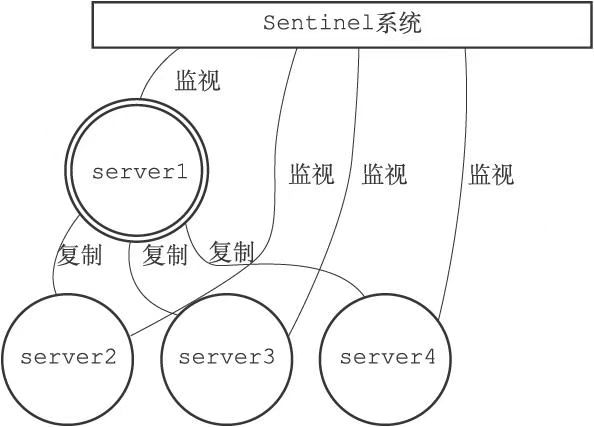

假设这时，主服务器server1进入下线状态，那么从服务器server2、server3、server4对主服务器的复制操作将被中止，并且Sentinel系统会察觉到server1已下线。

当server1的下线时长超过用户设定的下线时长上限时，Sentinel系统就会对server1执行故障转移操作：

1. 首先，Sentinel系统会挑选server1属下的其中一个从服务器，并将这个被选中的从服务器升级为新的主服务器。
2. 之后，Sentinel系统会向server1属下的所有从服务器发送新的复制指令，让它们成为新的主服务器的从服务器，当所有从服务器都开始复制新的主服务器时，故障转移操作执行完毕。
3. 另外，Sentinel还会继续监视已下线的server1，并在它重新上线时，将它设置为新的主服务器的从服务器。

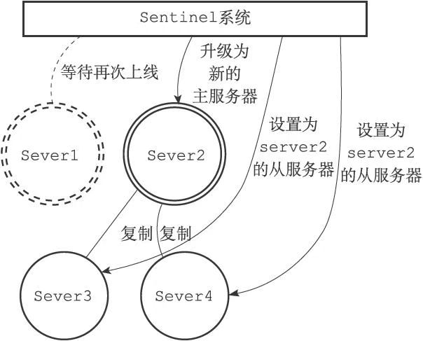

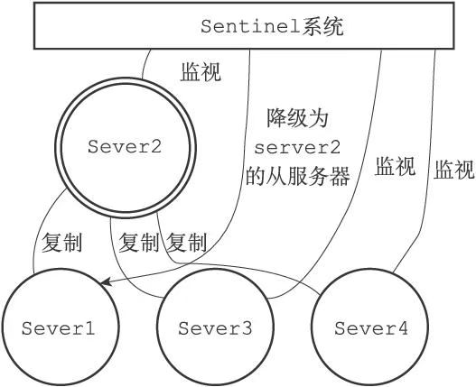

## 启动并初始化Sentinel

启动一个Sentinel可以使用命令：

```sh
$ redis-sentinel /path/to/your/sentinel.conf
```

或者命令：

```sh
$ redis-server /path/to/your/sentinel.conf --sentinel
```

当一个Sentinel启动时，它需要执行以下步骤：

1. 初始化服务器。
2. 将普通Redis服务器使用的代码替换成Sentinel专用代码。
3. 初始化Sentinel状态。
4. 根据给定的配置文件，初始化Sentinel的监视主服务器列表。
5. 创建连向主服务器的网络连接。

### 初始化服务器

首先，因为Sentinel本质上只是一个运行在特殊模式下的Redis服务器，所以启动Sentinel的第一步，就是初始化一个普通的Redis服务器，具体的步骤和第14章介绍的类似。

不过，因为Sentinel执行的工作和普通Redis服务器执行的工作不同，所以Sentinel的初始化过程和普通Redis服务器的初始化过程并不完全相同。例如，普通服务器在初始化时会通过载入RDB文件或者AOF文件来还原数据库状态，但是因为Sentinel并不使用数据库，所以初始化Sentinel时就不会载入RDB文件或者AOF文件。

 Sentinel模式下Redis服务器主要功能的使用情况:

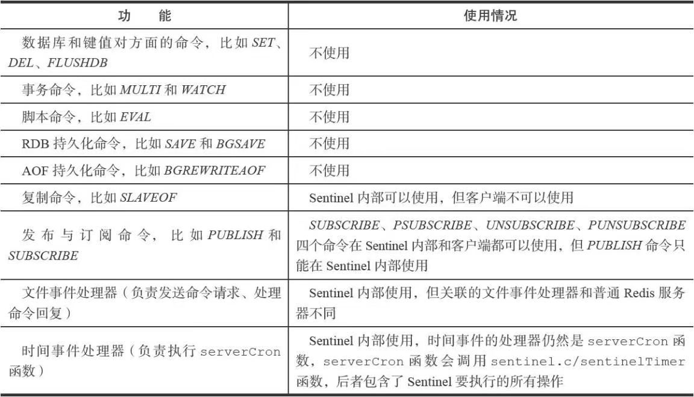

### 使用Sentinel专用代码

启动Sentinel的第二个步骤就是将一部分普通Redis服务器使用的代码替换成Sentinel专用代码。

### 初始化Sentinel状态

在应用了Sentinel的专用代码之后，接下来，服务器会初始化一个`sentinel.c/sentinelState`结构（后面简称“Sentinel状态”），这个结构保存了服务器中所有和Sentinel功能有关的状态（服务器的一般状态仍然由`redis.h/redisServer`结构保存）：

```c
struct sentinelState {
    //当前纪元，用于实现故障转移
    uint64_t current_epoch;
    //保存了所有被这个sentinel监视的主服务器
    //字典的键是主服务器的名字
    //字典的值则是一个指向sentinelRedisInstance结构的指针
    dict *masters;
    //是否进入了TILT模式？
    int tilt;
    //目前正在执行的脚本的数量
    int running_scripts;
    //进入TILT模式的时间
    mstime_t tilt_start_time;
    //最后一次执行时间处理器的时间
    mstime_t previous_time;
    //一个FIFO队列，包含了所有需要执行的用户脚本
    list *scripts_queue;
} sentinel;
```

### 初始化Sentinel状态的masters属性

Sentinel状态中的masters字典记录了所有被Sentinel监视的主服务器的相关信息，其中：

- 字典的键是被监视主服务器的名字。
- 而字典的值则是被监视主服务器对应的sentinel.c/sentinelRedisInstance结构。

每个sentinelRedisInstance结构（后面简称“实例结构”）代表一个被Sentinel监视的Redis服务器实例（instance），这个实例可以是主服务器、从服务器，或者另外一个Sentinel。

实例结构包含的属性非常多，以下代码展示了实例结构在表示主服务器时使用的其中一部分属性:

```c
typedef struct sentinelRedisInstance {
    //标识值，记录了实例的类型，以及该实例的当前状态
    int flags;
    //实例的名字
    //主服务器的名字由用户在配置文件中设置
    //从服务器以及Sentinel的名字由Sentinel自动设置
    //格式为ip:port，例如"127.0.0.1:26379"
    char *name;
    //实例的运行ID
    char *runid;
    //配置纪元，用于实现故障转移
    uint64_t config_epoch;
    //实例的地址
    sentinelAddr *addr;
    // SENTINEL down-after-milliseconds选项设定的值
    //实例无响应多少毫秒之后才会被判断为主观下线（subjectively down）
    mstime_t down_after_period;
    // SENTINEL monitor ＜master-name＞ ＜IP＞ ＜port＞ ＜quorum＞
选项中的quorum参数
    //判断这个实例为客观下线（objectively down）所需的支持投票数量
    int quorum;
    // SENTINEL parallel-syncs ＜master-name＞ ＜number＞选项的值
    //在执行故障转移操作时，可以同时对新的主服务器进行同步的从服务器数量
    int parallel_syncs;
    // SENTINEL failover-timeout ＜master-name＞ ＜ms＞选项的值
    //刷新故障迁移状态的最大时限
    mstime_t failover_timeout;
    // ...
} sentinelRedisInstance;
```

sentinelRedisInstance.addr属性是一个指向sentinel.c/sentinelAddr结构的指针，这个结构保存着实例的IP地址和端口号：

```c
typedef struct sentinelAddr {
    char *ip;
    int port;
} sentinelAddr;
```

对Sentinel状态的初始化将引发对masters字典的初始化，而masters字典的初始化是根据被载入的Sentinel配置文件来进行的。

### 创建连向主服务器的网络连接

初始化Sentinel的最后一步是创建连向被监视主服务器的网络连接，Sentinel将成为主服务器的客户端，它可以向主服务器发送命令，并从命令回复中获取相关的信息。

对于每个被Sentinel监视的主服务器来说，Sentinel会创建两个连向主服务器的异步网络连接：

- 一个是命令连接，这个连接专门用于向主服务器发送命令，并接收命令回复。
- 另一个是订阅连接，这个连接专门用于订阅主服务器的`__sentinel__:hello`频道。

**为什么有两个连接？**

在Redis目前的发布与订阅功能中，被发送的信息都不会保存在Redis服务器里面，如果在信息发送时，想要接收信息的客户端不在线或者断线，那么这个客户端就会丢失这条信息。因此，为了不丢失`__sentinel__:hello`频道的任何信息，Sentinel必须专门用一个订阅连接来接收该频道的信息。

除了订阅频道之外，Sentinel还必须向主服务器发送命令，以此来与主服务器进行通信，所以Sentinel还必须向主服务器创建命令连接。

因为Sentinel需要与多个实例创建多个网络连接，所以Sentinel使用的是异步连接。

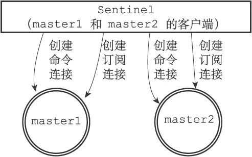

## 获取主服务器信息

Sentinel默认会以每**十秒**一次的频率，通过命令连接向被监视的主服务器发送**INFO命令**，并通过分析INFO命令的回复来获取主服务器的当前信息。

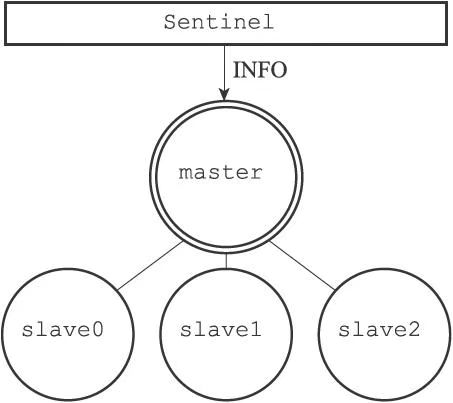

通过分析主服务器返回的INFO命令回复，Sentinel可以获取以下两方面的信息：

- 一方面是关于主服务器本身的信息，包括run_id域记录的服务器运行ID，以及role域记录的服务器角色；
- 另一方面是关于主服务器属下所有从服务器的信息，每个从服务器都由一个"slave"字符串开头的行记录，每行的ip=域记录了从服务器的IP地址，而port=域则记录了从服务器的端口号。根据这些IP地址和端口号，Sentinel无须用户提供从服务器的地址信息，就可以自动发现从服务器。

根据run_id域和role域记录的信息，Sentinel将对主服务器的实例结构进行更新。

至于主服务器返回的从服务器信息，则会被用于更新主服务器实例结构的slaves字典，这个字典记录了主服务器属下从服务器的名单：

- 字典的键是由Sentinel自动设置的从服务器名字，格式为ip:port：如对于IP地址为127.0.0.1，端口号为11111的从服务器来说，Sentinel为它设置的名字就是127.0.0.1:11111。
- 至于字典的值则是从服务器对应的实例结构。

主服务器实例结构和从服务器实例结构之间的区别：

1. 主服务器实例结构的flags属性的值为SRI_MASTER，而从服务器实例结构的flags属性的值为SRI_SLAVE。
2. 主服务器实例结构的name属性的值是用户使用Sentinel配置文件设置的，而从服务器实例结构的name属性的值则是Sentinel根据从服务器的IP地址和端口号自动设置的。

主服务器和它的三个从服务器：

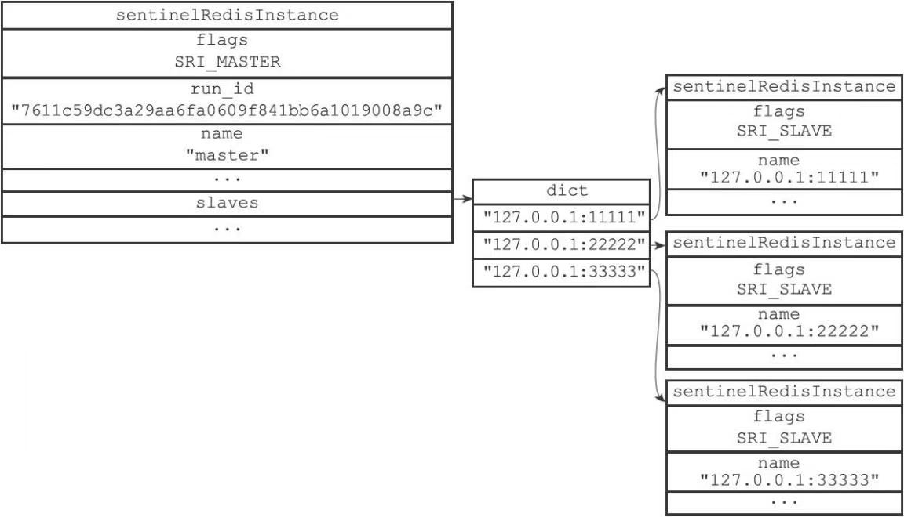

## 获取从服务器信息

当Sentinel发现主服务器有新的从服务器出现时，Sentinel除了会为这个新的从服务器创建相应的实例结构之外，Sentinel还会创建连接到从服务器的**命令连接**和**订阅连接**。

Sentinel与各个从服务器建立命令连接和订阅连接:

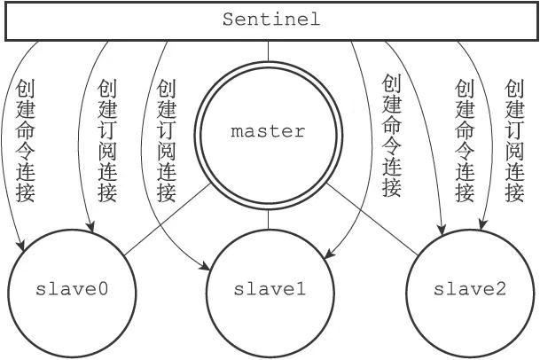

 在创建命令连接之后，Sentinel在默认情况下，会以每十秒一次的频率通过命令连接向从服务器发送INFO命令，根据INFO命令的回复，Sentinel会提取出以下信息：

- 从服务器的运行ID run_id。

- 从服务器的角色role。

- 主服务器的IP地址master_host，以及主服务器的端口号master_port。

- 主从服务器的连接状态master_link_status。

- 从服务器的优先级slave_priority。

- 从服务器的复制偏移量slave_repl_offset。

根据这些信息，Sentinel会对从服务器的实例结构进行更新。

## 向主服务器和从服务器发送信息

在默认情况下，Sentinel会以每**两秒**一次的频率，通过命令连接向所有被监视的主服务器和从服务器发送以下格式的命令：

```bash
PUBLISH __sentinel__:hello "＜s_ip＞,＜s_port＞,＜s_runid＞,＜s_epoch＞,＜m_name＞,＜m_ip＞,＜m_port＞,＜m_epoch＞"
```

这条命令向服务器的`__sentinel__:hello`频道发送了一条信息，信息的内容由多个参数组成：

- 其中以`s_`开头的参数记录的是Sentinel本身的信息。
- 而`m_`开头的参数记录的则是主服务器的信息。如果Sentinel正在监视的是主服务器，那么这些参数记录的就是主服务器的信息；如果Sentinel正在监视的是从服务器，那么这些参数记录的就是从服务器正在复制的主服务器的信息。

信息中和Sentinel有关的参数:

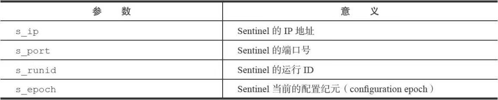

 信息中和主服务器有关的参数:

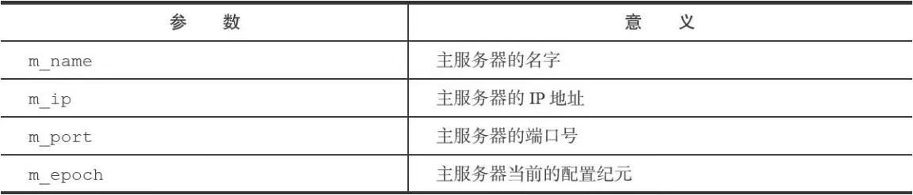

## 接收来自主服务器和从服务器的频道信息

当Sentinel与一个主服务器或者从服务器建立起订阅连接之后，Sentinel就会通过订阅连接，向服务器发送以下命令：

```sh
SUBSCRIBE __sentinel__:hello
```

Sentinel对`__sentinel__:hello`频道的订阅会一直持续到Sentinel与服务器的连接断开为止。

对于每个与Sentinel连接的服务器，Sentinel既通过命令连接向服务器的`__sentinel__:hello`频道发送信息，又通过订阅连接从服务器的`__sentinel__:hello`频道接收信息。

Sentinel同时向服务器发送和接收信息：

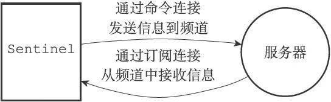

对于监视同一个服务器的多个Sentinel来说，一个Sentinel发送的信息会被其他Sentinel接收到，这些信息会被用于更新其他Sentinel对发送信息Sentinel的认知，也会被用于更新其他Sentinel对被监视服务器的认知。

举个例子，假设现在有sentinel1、sentinel2、sentinel3三个Sentinel在监视同一个服务器，那么当sentinel1向服务器的`__sentinel__:hello`频道发送一条信息时，所有订阅了`__sentinel__:hello`频道的Sentinel（包括sentinel1自己在内）都会收到这条信息:

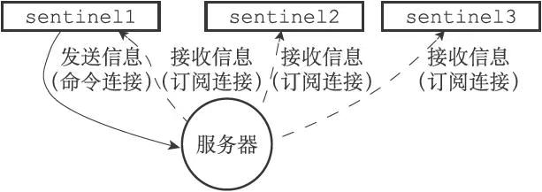

当一个Sentinel从`__sentinel__:hello`频道收到一条信息时，Sentinel会对这条信息进行分析，提取出信息中的Sentinel IP地址、Sentinel端口号、Sentinel运行ID等八个参数，并进行以下检查：

- 如果信息中记录的Sentinel运行ID和接收信息的Sentinel的运行ID相同，那么说明这条信息是Sentinel自己发送的，Sentinel将丢弃这条信息，不做进一步处理。
- 相反地，如果信息中记录的Sentinel运行ID和接收信息的Sentinel的运行ID不相同，那么说明这条信息是监视同一个服务器的其他Sentinel发来的，接收信息的Sentinel将根据信息中的各个参数，对相应主服务器的实例结构进行更新。

### 更新sentinels字典

Sentinel为主服务器创建的实例结构中的sentinels字典保存了除Sentinel本身之外，所有同样监视这个主服务器的其他Sentinel的资料：

- sentinels字典的键是其中一个Sentinel的名字，格式为ip:port，比如对于IP地址为127.0.0.1，端口号为26379的Sentinel来说，这个Sentinel在sentinels字典中的键就是"127.0.0.1:26379"。

- sentinels字典的值则是键所对应Sentinel的实例结构，比如对于键"127.0.0.1:26379"来说，这个键在sentinels字典中的值就是IP为127.0.0.1，端口号为26379的Sentinel的实例结构。

当一个Sentinel接收到其他Sentinel发来的信息时（我们称呼发送信息的Sentinel为源Sentinel，接收信息的Sentinel为目标Sentinel），目标Sentinel会从信息中分析并提取出以下两方面参数：

- 与Sentinel有关的参数：源Sentinel的IP地址、端口号、运行ID和配置纪元。
- 与主服务器有关的参数：源Sentinel正在监视的主服务器的名字、IP地址、端口号和配置纪元。

根据信息中提取出的主服务器参数，目标Sentinel会在自己的Sentinel状态的masters字典中查找相应的主服务器实例结构，然后根据提取出的Sentinel参数，检查主服务器实例结构的sentinels字典中，源Sentinel的实例结构是否存在：

- 如果源Sentinel的实例结构已经存在，那么对源Sentinel的实例结构进行更新。
- 如果源Sentinel的实例结构不存在，那么说明源Sentinel是刚刚开始监视主服务器的新Sentinel，目标Sentinel会为源Sentinel创建一个新的实例结构，并将这个结构添加到sentinels字典里面。

因为一个Sentinel可以通过分析接收到的频道信息来获知其他Sentinel的存在，并通过发送频道信息来让其他Sentinel知道自己的存在，所以用户在使用Sentinel的时候并不需要提供各个Sentinel的地址信息，监视同一个主服务器的多个Sentinel可以自动发现对方。

###  创建连向其他Sentinel的命令连接

当Sentinel通过频道信息发现一个新的Sentinel时，它不仅会为新Sentinel在sentinels字典中创建相应的实例结构，还会创建一个连向新Sentinel的命令连接，而新Sentinel也同样会创建连向这个Sentinel的命令连接，最终监视同一主服务器的多个Sentinel将形成相互连接的网络：

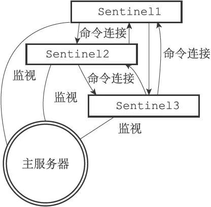

**Sentinel之间不会创建订阅连接**:

Sentinel在连接主服务器或者从服务器时，会同时创建命令连接和订阅连接，但是在连接其他Sentinel时，却只会创建命令连接，而不创建订阅连接。这是因为Sentinel需要通过接收主服务器或者从服务器发来的频道信息来发现未知的新Sentinel，所以才需要建立订阅连接，而相互已知的Sentinel只要使用命令连接来进行通信就足够了。

## 检测主观下线状态

在默认情况下，Sentinel会以每秒一次的频率向所有与它创建了命令连接的实例（包括主服务器、从服务器、其他Sentinel在内）发送PING命令，并通过实例返回的PING命令回复来判断实例是否在线。

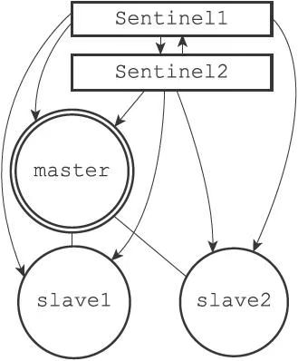

实例对PING命令的回复可以分为以下两种情况：

- 有效回复：实例返回+PONG、-LOADING、-MASTERDOWN三种回复的其中一种。

- 无效回复：实例返回除+PONG、-LOADING、-MASTERDOWN三种回复之外的其他回复，或者在指定时限内没有返回任何回复。

Sentinel配置文件中的down-after-milliseconds选项指定了Sentinel判断实例进入主观下线所需的时间长度：如果一个实例在down-after-milliseconds毫秒内，连续向Sentinel返回无效回复，那么Sentinel会修改这个实例所对应的实例结构，在结构的flags属性中打开SRI_S_DOWN标识，以此来表示这个实例已经进入主观下线状态。

用户设置的down-after-milliseconds选项的值，不仅会被Sentinel用来判断主服务器的主观下线状态，还会被用于判断主服务器属下的所有从服务器，以及所有同样监视这个主服务器的其他Sentinel的主观下线状态。

**多个Sentinel设置的主观下线时长可能不同**

down-after-milliseconds选项另一个需要注意的地方是，对于监视同一个主服务器的多个Sentinel来说，这些Sentinel所设置的down-after-milliseconds选项的值也可能不同，因此，当一个Sentinel将主服务器判断为主观下线时，其他Sentinel可能仍然会认为主服务器处于在线状态

## 检查客观下线状态

当Sentinel将一个主服务器判断为主观下线之后，为了确认这个主服务器是否真的下线了，它会向同样监视这一主服务器的其他Sentinel进行询问，看它们是否也认为主服务器已经进入了下线状态（可以是主观下线或者客观下线）。当Sentinel从其他Sentinel那里接收到足够数量的已下线判断之后，Sentinel就会将从服务器判定为客观下线，并对主服务器执行故障转移操作。

###  发送SENTINEL is-master-down-by-addr命令

Sentinel使用：

```bash
SENTINEL is-master-down-by-addr ＜ip＞ ＜port＞ ＜current_epoch＞ ＜runid＞
```

命令询问其他Sentinel是否同意主服务器已下线。

 SENTINEL is-master-down-by-addr命令各个参数的意义：

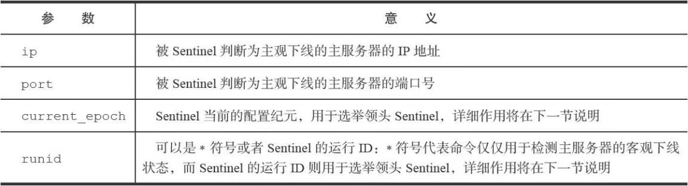

### 接收SENTINEL is-master-down-by-addr命令

 当一个Sentinel（目标Sentinel）接收到另一个Sentinel（源Sentinel）发来的SENTINEL is-master-down-by命令时，目标Sentinel会分析并取出命令请求中包含的各个参数，并根据其中的主服务器IP和端口号，检查主服务器是否已下线，然后向源Sentinel返回一条包含三个参数的Multi Bulk回复作为SENTINEL is-master-down-by命令的回复：

1. ＜down_state＞
2. ＜leader_runid＞
3. ＜leader_epoch＞

SENTINEL is-master-down-by-addr回复的意义:

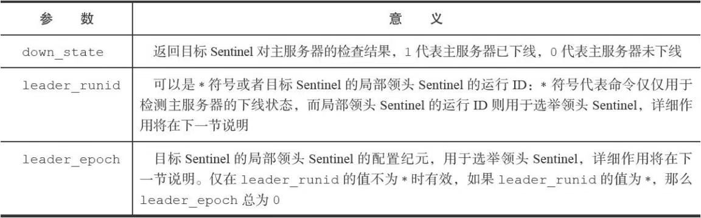

举个例子，如果一个Sentinel返回以下回复作为SENTINEL is-master-down-by-addr命令的回复：

```sh
1) 1
2) *
3) 0
```

那么说明Sentinel也同意主服务器已下线。

### 接收SENTINEL is-master-down-by-addr命令的回复

根据其他Sentinel发回的SENTINEL is-master-down-by-addr命令回复，Sentinel将统计其他Sentinel同意主服务器已下线的数量，当这一数量达到配置指定的判断客观下线所需的数量时，Sentinel会将主服务器实例结构flags属性的SRI_O_DOWN标识打开，表示主服务器已经进入客观下线状态，

**客观下线状态的判断条件**:

当认为主服务器已经进入下线状态的Sentinel的数量，超过Sentinel配置中设置的quorum参数的值，那么该Sentinel就会认为主服务器已经进入客观下线状态

比如说，如果Sentinel在启动时载入了以下配置：

```sh
sentinel monitor master 127.0.0.1 6379 2
```

那么包括当前Sentinel在内，只要总共有两个Sentinel认为主服务器已经进入下线状态，那么当前Sentinel就将主服务器判断为客观下线。

**不同Sentinel判断客观下线的条件可能不同**:

对于监视同一个主服务器的多个Sentinel来说，它们将主服务器标判断为客观下线的条件可能也不同：当一个Sentinel将主服务器判断为客观下线时，其他Sentinel可能并不是那么认为的。

## 选举领头Sentinel

当一个主服务器被判断为客观下线时，监视这个下线主服务器的各个Sentinel会进行协商，选举出一个领头Sentinel，并由领头Sentinel对下线主服务器执行故障转移操作。

以下是Redis选举领头Sentinel的规则和方法：

- 所有在线的Sentinel都有被选为领头Sentinel的资格，换句话说，监视同一个主服务器的多个在线Sentinel中的任意一个都有可能成为领头Sentinel。

- 每次进行领头Sentinel选举之后，不论选举是否成功，所有Sentinel的配置纪元（configuration epoch）的值都会自增一次。配置纪元实际上就是一个计数器，并没有什么特别的。

- 在一个配置纪元里面，所有Sentinel都有一次将某个Sentinel设置为局部领头Sentinel的机会，并且局部领头一旦设置，在这个配置纪元里面就不能再更改。

- 每个发现主服务器进入客观下线的Sentinel都会要求其他Sentinel将自己设置为局部领头Sentinel。

- 当一个Sentinel（源Sentinel）向另一个Sentinel（目标Sentinel）发送SENTINEL is-master-down-by-addr命令，并且命令中的runid参数不是*符号而是源Sentinel的运行ID时，这表示源Sentinel要求目标Sentinel将前者设置为后者的局部领头Sentinel。

- Sentinel设置局部领头Sentinel的规则是先到先得：最先向目标Sentinel发送设置要求的源Sentinel将成为目标Sentinel的局部领头Sentinel，而之后接收到的所有设置要求都会被目标Sentinel拒绝。

- 目标Sentinel在接收到SENTINEL is-master-down-by-addr命令之后，将向源Sentinel返回一条命令回复，回复中的leader_runid参数和leader_epoch参数分别记录了目标Sentinel的局部领头Sentinel的运行ID和配置纪元。

- 源Sentinel在接收到目标Sentinel返回的命令回复之后，会检查回复中leader_epoch参数的值和自己的配置纪元是否相同，如果相同的话，那么源Sentinel继续取出回复中的leader_runid参数，如果leader_runid参数的值和源Sentinel的运行ID一致，那么表示目标Sentinel将源Sentinel设置成了局部领头Sentinel。

- 如果有某个Sentinel被半数以上的Sentinel设置成了局部领头Sentinel，那么这个Sentinel成为领头Sentinel。举个例子，在一个由10个Sentinel组成的Sentinel系统里面，只要有大于等于10/2+1=6个Sentinel将某个Sentinel设置为局部领头Sentinel，那么被设置的那个Sentinel就会成为领头Sentinel。

- 因为领头Sentinel的产生需要半数以上Sentinel的支持，并且每个Sentinel在每个配置纪元里面只能设置一次局部领头Sentinel，所以在一个配置纪元里面，只会出现一个领头Sentinel。

- 如果在给定时限内，没有一个Sentinel被选举为领头Sentinel，那么各个Sentinel将在一段时间之后再次进行选举，直到选出领头Sentinel为止。

## 故障转移

在选举产生出领头Sentinel之后，领头Sentinel将对已下线的主服务器执行故障转移操作，该操作包含以下三个步骤：

1. 在已下线主服务器属下的所有从服务器里面，挑选出一个从服务器，并将其转换为主服务器。
2. 让已下线主服务器属下的所有从服务器改为复制新的主服务器。
3. 将已下线主服务器设置为新的主服务器的从服务器，当这个旧的主服务器重新上线时，它就会成为新的主服务器的从服务器。

### 选出新的主服务器

故障转移操作第一步要做的就是在已下线主服务器属下的所有从服务器中，挑选出一个状态良好、数据完整的从服务器，然后向这个从服务器发送SLAVEOF noone命令，将这个从服务器转换为主服务器。

**新的主服务器是怎样挑选出来的**:

领头Sentinel会将已下线主服务器的所有从服务器保存到一个列表里面，然后按照以下规则，一项一项地对列表进行过滤：

1. 删除列表中所有处于下线或者断线状态的从服务器，这可以保证列表中剩余的从服务器都是正常在线的。
2. 删除列表中所有最近五秒内没有回复过领头Sentinel的INFO命令的从服务器，这可以保证列表中剩余的从服务器都是最近成功进行过通信的。
3. 删除所有与已下线主服务器连接断开超过down-after-milliseconds10毫秒的从服务器：down-after-milliseconds选项指定了判断主服务器下线所需的时间，而删除断开时长超过down-after-milliseconds10毫秒的从服务器，则可以保证列表中剩余的从服务器都没有过早地与主服务器断开连接，换句话说，列表中剩余的从服务器保存的数据都是比较新的。

之后，领头Sentinel将根据从服务器的优先级，对列表中剩余的从服务器进行排序，并选出其中优先级最高的从服务器。

如果有多个具有相同最高优先级的从服务器，那么领头Sentinel将按照从服务器的复制偏移量，对具有相同最高优先级的所有从服务器进行排序，并选出其中偏移量最大的从服务器（复制偏移量最大的从服务器就是保存着最新数据的从服务器）。

最后，如果有多个优先级最高、复制偏移量最大的从服务器，那么领头Sentinel将按照运行ID对这些从服务器进行排序，并选出其中运行ID最小的从服务器。

下图展示了在一次故障转移操作中，领头Sentinel向被选中的从服务器server2发送SLAVEOF no one命令的情形。

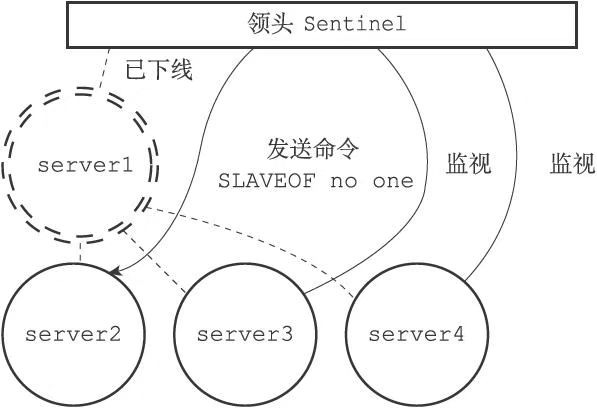

在发送SLAVEOF no one命令之后，领头Sentinel会以每秒一次的频率（平时是每十秒一次），向被升级的从服务器发送INFO命令，并观察命令回复中的角色（role）信息，当被升级服务器的role从原来的slave变为master时，领头Sentinel就知道被选中的从服务器已经顺利升级为主服务器了。

server2成功升级为主服务器:

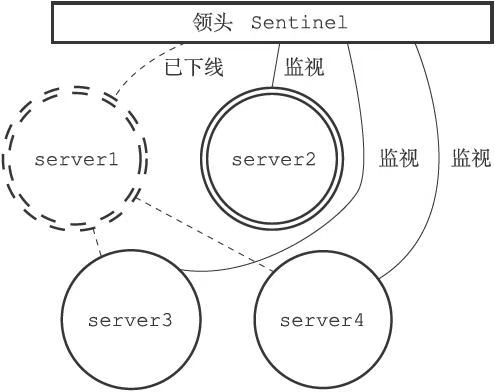

###  修改从服务器的复制目标

当新的主服务器出现之后，领头Sentinel下一步要做的就是，让已下线主服务器属下的所有从服务器去复制新的主服务器，这一动作可以通过向从服务器发送SLAVEOF命令来实现。

让从服务器复制新的主服务器:

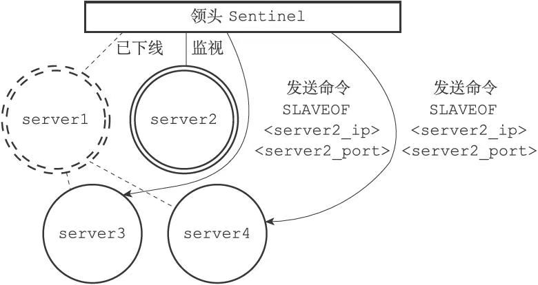

### 将旧的主服务器变为从服务器

故障转移操作最后要做的是，将已下线的主服务器设置为新的主服务器的从服务器。

## 参考资料

Sentinel系统选举领头Sentinel的方法是对Raft算法的领头选举方法的实现，关于这一方法的详细信息可以观看Raft算法的作者录制的“Raft教程”视频：http://v.youku.com/v_show/id_XNjQxOTk5MTk2.html，或者Raft算法的论文。

