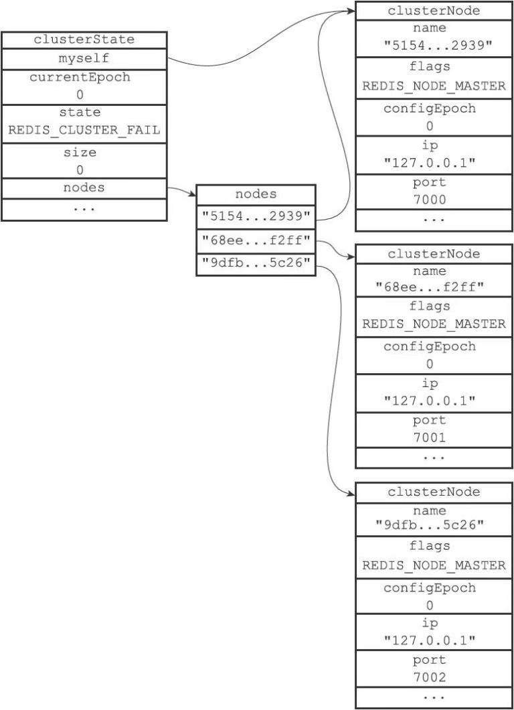
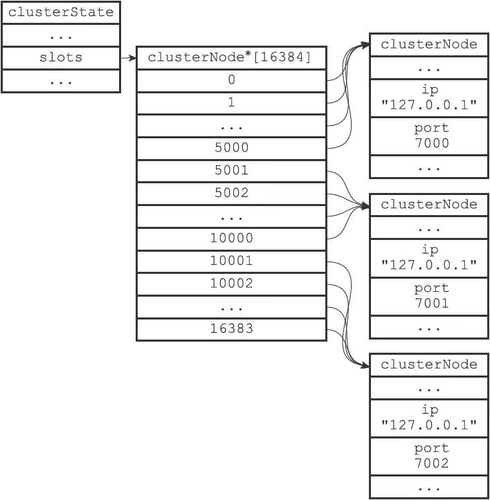
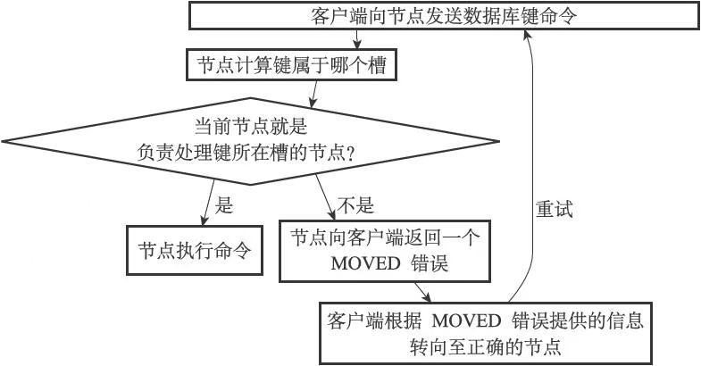
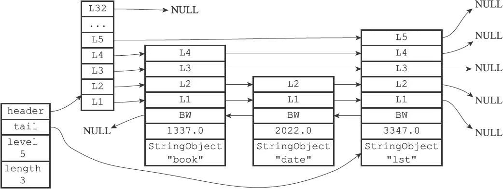
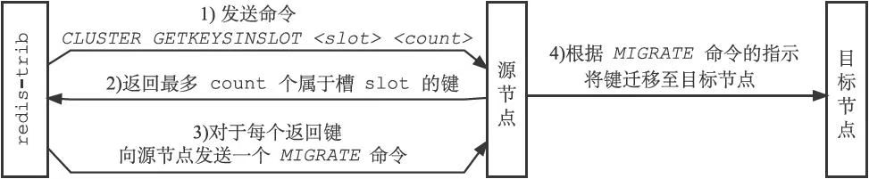
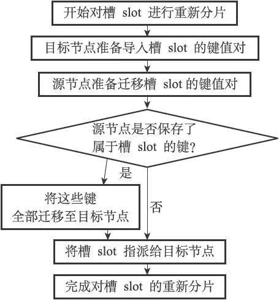
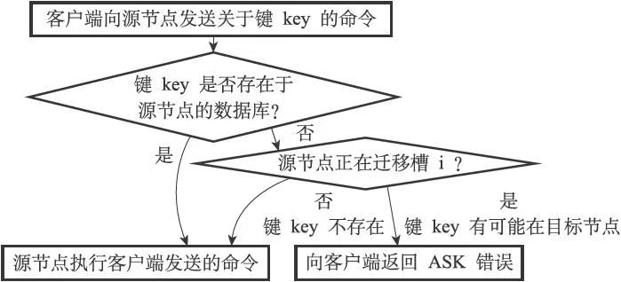
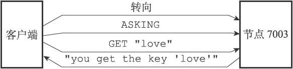
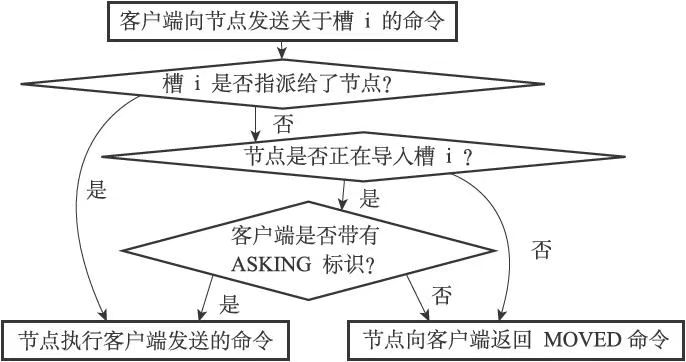

# 第17章 集群

Redis集群是Redis提供的分布式数据库方案，集群通过分片（sharding）来进行数据共享，并提供复制和故障转移功能。

## 节点

一个Redis集群通常由多个节点（node）组成，在刚开始的时候，每个节点都是相互独立的，它们都处于一个只包含自己的集群当中，要组建一个真正可工作的集群，我们必须将各个独立的节点连接起来，构成一个包含多个节点的集群。

连接各个节点的工作可以使用CLUSTER MEET命令来完成，该命令的格式如下：

```sh
CLUSTER MEET ＜ip＞ ＜port＞
```

向一个节点node发送CLUSTER MEET命令，可以让node节点与ip和port所指定的节点进行握手（handshake），当握手成功时，node节点就会将ip和port所指定的节点添加到node节点当前所在的集群中。

### 启动节点 

一个节点就是一个运行在集群模式下的Redis服务器，Redis服务器在启动时会根据**cluster-enabled**配置选项是否为yes来决定是否开启服务器的集群模式。

 节点（运行在集群模式下的Redis服务器）会继续使用所有在单机模式中使用的服务器组件，比如说：

- 节点会继续使用文件事件处理器来处理命令请求和返回命令回复。

- 节点会继续使用时间事件处理器来执行serverCron函数，而serverCron函数又会调用集群模式特有的clusterCron函数。clusterCron函数负责执行在集群模式下需要执行的常规操作，例如向集群中的其他节点发送Gossip消息，检查节点是否断线，或者检查是否需要对下线节点进行自动故障转移等。

- 节点会继续使用数据库来保存键值对数据，键值对依然会是各种不同类型的对象。

- 节点会继续使用RDB持久化模块和AOF持久化模块来执行持久化工作。

- 节点会继续使用发布与订阅模块来执行PUBLISH、SUBSCRIBE等命令。

- 节点会继续使用复制模块来进行节点的复制工作。

- 节点会继续使用Lua脚本环境来执行客户端输入的Lua脚本。

除此之外，节点会继续使用redisServer结构来保存服务器的状态，使用redisClient结构来保存客户端的状态，至于那些只有在集群模式下才会用到的数据，节点将它们保存到了cluster.h/clusterNode结构、cluster.h/clusterLink结构，以及cluster.h/clusterState结构里面 。

### 集群数据结构

clusterNode结构保存了一个节点的当前状态，比如节点的创建时间、节点的名字、节点当前的配置纪元、节点的IP地址和端口号等等。

每个节点都会使用一个clusterNode结构来记录自己的状态，并为集群中的所有其他节点（包括主节点和从节点）都创建一个相应的clusterNode结构，以此来记录其他节点的状态：

```c
struct clusterNode {
    //创建节点的时间
    mstime_t ctime;
    //节点的名字，由40个十六进制字符组成
    //例如68eef66df23420a5862208ef5b1a7005b806f2ff
    char name[REDIS_CLUSTER_NAMELEN];
    //节点标识
    //使用各种不同的标识值记录节点的角色（比如主节点或者从节点），
    //以及节点目前所处的状态（比如在线或者下线）。
    int flags;
    //节点当前的配置纪元，用于实现故障转移
    uint64_t configEpoch;
    //节点的IP地址
    char ip[REDIS_IP_STR_LEN];
    //节点的端口号
    int port;
    //保存连接节点所需的有关信息
    clusterLink *link;
    // ...
};
```

clusterNode结构的link属性是一个clusterLink结构，该结构保存了连接节点所需的有关信息，比如套接字描述符，输入缓冲区和输出缓冲区：

```c
typedef struct clusterLink {
    //连接的创建时间
    mstime_t ctime;
    // TCP套接字描述符
    int fd;
    //输出缓冲区，保存着等待发送给其他节点的消息（message）。
    sds sndbuf;
    //输入缓冲区，保存着从其他节点接收到的消息。
    sds rcvbuf;
    //与这个连接相关联的节点，如果没有的话就为NULL
    struct clusterNode *node;
} clusterLink;
```

最后，每个节点都保存着一个clusterState结构，这个结构记录了在当前节点的视角下，集群目前所处的状态，例如集群是在线还是下线，集群包含多少个节点，集群当前的配置纪元，诸如此类：

```c
typedef struct clusterState {
    //指向当前节点的指针
    clusterNode *myself;
    //集群当前的配置纪元，用于实现故障转移
    uint64_t currentEpoch;
    //集群当前的状态：是在线还是下线
    int state;
    //集群中至少处理着一个槽的节点的数量
    int size;
    //集群节点名单（包括myself节点）
    //字典的键为节点的名字，字典的值为节点对应的clusterNode结构
    dict *nodes;
    // ...
} clusterState;
```

节点7000创建的clusterState结构:



### CLUSTER MEET命令的实现

通过向节点A发送CLUSTER MEET命令，客户端可以让接收命令的节点A将另一个节点B添加到节点A当前所在的集群里面：

```bash
CLUSTER MEET ＜ip＞ ＜port＞
```

收到命令的节点A将与节点B进行握手（handshake），以此来确认彼此的存在，并为将来的进一步通信打好基础：

1. 节点A会为节点B创建一个clusterNode结构，并将该结构添加到自己的clusterState.nodes字典里面。
2. 之后，节点A将根据CLUSTER MEET命令给定的IP地址和端口号，向节点B发送一条MEET消息（message）。
3. 如果一切顺利，节点B将接收到节点A发送的MEET消息，节点B会为节点A创建一个clusterNode结构，并将该结构添加到自己的clusterState.nodes字典里面。
4. 之后，节点B将向节点A返回一条PONG消息
5. 如果一切顺利，节点A将接收到节点B返回的PONG消息，通过这条PONG消息节点A可以知道节点B已经成功地接收到了自己发送的MEET消息。
6. 之后，节点A将向节点B返回一条PING消息。
7. 如果一切顺利，节点B将接收到节点A返回的PING消息，通过这条PING消息节点B可以知道节点A已经成功地接收到了自己返回的PONG消息，握手完成。

图17-8 节点的握手过程:


之后，节点A会将节点B的信息通过Gossip协议传播给集群中的其他节点，让其他节点也与节点B进行握手，最终，经过一段时间之后，节点B会被集群中的所有节点认识。

## 槽指派

Redis集群通过分片的方式来保存数据库中的键值对：集群的整个数据库被分为16384个槽（slot），数据库中的每个键都属于这16384个槽的其中一个，集群中的每个节点可以处理0个或最多16384个槽。

当数据库中的16384个槽都有节点在处理时，集群处于上线状态（ok）；相反地，如果数据库中有任何一个槽没有得到处理，那么集群处于下线状态（fail）。

通过向节点发送CLUSTER ADDSLOTS命令，我们可以将一个或多个槽指派（assign）给节点负责：

```sh
CLUSTER ADDSLOTS ＜slot＞ [slot ...]
```

### 记录节点的槽指派信息

clusterNode结构的slots属性和numslot属性记录了节点负责处理哪些槽：

```c
struct clusterNode {
    // ...
    unsigned char slots[16384/8];
    int numslots;
    // ...
};
```

slots属性是一个二进制位数组（bit array），这个数组的长度为16384/8=2048个字节，共包含16384个二进制位。

因为取出和设置slots数组中的任意一个二进制位的值的复杂度仅为O（1），所以对于一个给定节点的slots数组来说，程序检查节点是否负责处理某个槽，又或者将某个槽指派给节点负责，这两个动作的复杂度都是O（1）。

至于numslots属性则记录节点负责处理的槽的数量，也即是slots数组中值为1的二进制位的数量。

### 传播节点的槽指派信息

一个节点除了会将自己负责处理的槽记录在clusterNode结构的slots属性和numslots属性之外，它还会将自己的slots数组通过消息发送给集群中的其他节点，以此来告知其他节点自己目前负责处理哪些槽。

当节点A通过消息从节点B那里接收到节点B的slots数组时，节点A会在自己的clusterState.nodes字典中查找节点B对应的clusterNode结构，并对结构中的slots数组进行保存或者更新。

因为集群中的每个节点都会将自己的slots数组通过消息发送给集群中的其他节点，并且每个接收到slots数组的节点都会将数组保存到相应节点的clusterNode结构里面，因此，集群中的每个节点都会知道数据库中的16384个槽分别被指派给了集群中的哪些节点。

### 记录集群所有槽的指派信息

clusterState结构中的slots数组记录了集群中所有16384个槽的指派信息：

```c
typedef struct clusterState {
    // ...
    clusterNode *slots[16384];
    // ...
} clusterState;
```

slots数组包含16384个项，每个数组项都是一个指向clusterNode结构的指针：

- 如果slots[i]指针指向NULL，那么表示槽i尚未指派给任何节点。

- 如果slots[i]指针指向一个clusterNode结构，那么表示槽i已经指派给了clusterNode结构所代表的节点。

clusterState结构的slots数组：



通过将所有槽的指派信息保存在clusterState.slots数组里面，程序要检查槽i是否已经被指派，又或者取得负责处理槽i的节点，只需要访问clusterState.slots[i]的值即可，这个操作的复杂度仅为O（1）。

### CLUSTER ADDSLOTS命令的实现

CLUSTER ADDSLOTS命令接受一个或多个槽作为参数，并将所有输入的槽指派给接收该命令的节点负责：

```sh
CLUSTER ADDSLOTS ＜slot＞ [slot ...]
```

CLUSTER ADDSLOTS命令的实现可以用以下伪代码来表示：

```python
def CLUSTER_ADDSLOTS(*all_input_slots):
    #遍历所有输入槽，检查它们是否都是未指派槽
    for i in all_input_slots:
        #如果有哪怕一个槽已经被指派给了某个节点
        #那么向客户端返回错误，并终止命令执行
        if clusterState.slots[i] != NULL:
            reply_error()
            return
    #如果所有输入槽都是未指派槽
    #那么再次遍历所有输入槽，将这些槽指派给当前节点
    for i in all_input_slots:
        #设置clusterState结构的slots数组
        #将slots[i]的指针指向代表当前节点的clusterNode结构
        clusterState.slots[i] = clusterState.myself
        #访问代表当前节点的clusterNode结构的slots数组
        #将数组在索引i上的二进制位设置为1
        setSlotBit(clusterState.myself.slots, i)
```

在CLUSTER ADDSLOTS命令执行完毕之后，节点会通过发送消息告知集群中的其他节点，自己目前正在负责处理哪些槽。

## 在集群中执行命令

在对数据库中的16384个槽都进行了指派之后，集群就会进入上线状态，这时客户端就可以向集群中的节点发送数据命令了。

当客户端向节点发送与数据库键有关的命令时，接收命令的节点会计算出命令要处理的数据库键属于哪个槽，并检查这个槽是否指派给了自己：

- 如果键所在的槽正好就指派给了当前节点，那么节点直接执行这个命令。
- 如果键所在的槽并没有指派给当前节点，那么节点会向客户端返回一个MOVED错误，指引客户端转向（redirect）至正确的节点，并再次发送之前想要执行的命令。

判断客户端是否需要转向的流程:



### 计算键属于哪个槽

节点使用以下算法来计算给定键key属于哪个槽：

```python
def slot_number(key):
	return CRC16(key) & 16383
```

其中CRC16（key）语句用于计算键key的CRC-16校验和，而&16383语句则用于计算出一个介于0至16383之间的整数作为键key的槽号。

使用`CLUSTER KEYSLOT＜key＞`命令可以查看一个给定键属于哪个槽。

### 判断槽是否由当前节点负责处理

当节点计算出键所属的槽i之后，节点就会检查自己在clusterState.slots数组中的项i，判断键所在的槽是否由自己负责：

1. 如果clusterState.slots[i]等于clusterState.myself，那么说明槽i由当前节点负责，节点可以执行客户端发送的命令。
2. 如果clusterState.slots[i]不等于clusterState.myself，那么说明槽i并非由当前节点负责，节点会根据clusterState.slots[i]指向的clusterNode结构所记录的节点IP和端口号，向客户端返回MOVED错误，指引客户端转向至正在处理槽i的节点。

### MOVED错误

当节点发现键所在的槽并非由自己负责处理的时候，节点就会向客户端返回一个MOVED错误，指引客户端转向至正在负责槽的节点。

MOVED错误的格式为：

```bash
MOVED ＜slot＞ ＜ip＞:＜port＞
```

其中slot为键所在的槽，而ip和port则是负责处理槽slot的节点的IP地址和端口号。

当客户端接收到节点返回的MOVED错误时，客户端会根据MOVED错误中提供的IP地址和端口号，转向至负责处理槽slot的节点，并向该节点重新发送之前想要执行的命令。

一个集群客户端通常会与集群中的多个节点创建套接字连接，而所谓的节点转向实际上就是换一个套接字来发送命令。如果客户端尚未与想要转向的节点创建套接字连接，那么客户端会先根据MOVED错误提供的IP地址和端口号来连接节点，然后再进行转向。

**被隐藏的MOVED错误**：

集群模式的redis-cli客户端在接收到MOVED错误时，并不会打印出MOVED错误，而是根据MOVED错误自动进行节点转向，并打印出转向信息，所以我们是看不见节点返回的MOVED错误的。

但是，如果我们使用单机（stand alone）模式的redis-cli客户端，再次向节点7000发送相同的命令，那么MOVED错误就会被客户端打印出来。这是因为单机模式的redis-cli客户端不清楚MOVED错误的作用，所以它只会直接将MOVED错误直接打印出来，而不会进行自动转向。

```sh
$ redis-cli -c -p 7000 #集群模式
127.0.0.1:7000＞ SET msg "happy new year!"
-＞ Redirected to slot [6257] located at 127.0.0.1:7001
OK
127.0.0.1:7001＞

$ redis-cli -p 7000 #单机模式
127.0.0.1:7000＞ SET msg "happy new year!"
(error) MOVED 6257 127.0.0.1:7001
127.0.0.1:7000＞
```

### 节点数据库的实现

集群节点保存键值对以及键值对过期时间的方式，与机Redis服务器保存键值对以及键值对过期时间的方式完全相同。

节点和单机服务器在数据库方面的一个区别是，节点只能使用**0号数据库**，而单机Redis服务器则没有这一限制。

除了将键值对保存在数据库里面之外，节点还会用clusterState结构中的slots_to_keys跳跃表来保存槽和键之间的关系：

```c
typedef struct clusterState {
    // ...
    zskiplist *slots_to_keys;
    // ...
} clusterState;
```

slots_to_keys跳跃表每个节点的分值（score）都是一个槽号，而每个节点的成员（member）都是一个数据库键：

- 每当节点往数据库中添加一个新的键值对时，节点就会将这个键以及键的槽号关联到slots_to_keys跳跃表。
- 当节点删除数据库中的某个键值对时，节点就会在slots_to_keys跳跃表解除被删除键与槽号的关联。

节点7000的slots_to_keys跳跃表:



通过在slots_to_keys跳跃表中记录各个数据库键所属的槽，节点可以很方便地对属于某个或某些槽的所有数据库键进行批量操作，例如命令`CLUSTER GETKEYSINSLOT＜slot＞＜count＞`命令可以返回最多count个属于槽slot的数据库键，而这个命令就是通过遍历slots_to_keys跳跃表来实现的。

## 重新分片

Redis集群的重新分片操作可以将任意数量已经指派给某个节点（源节点）的槽改为指派给另一个节点（目标节点），并且相关槽所属的键值对也会从源节点被移动到目标节点。

重新分片操作可以在线（online）进行，在重新分片的过程中，集群不需要下线，并且源节点和目标节点都可以继续处理命令请求。

### 重新分片的实现原理

Redis集群的重新分片操作是由Redis的集群管理软件redis-trib负责执行的，Redis提供了进行重新分片所需的所有命令，而redis-trib则通过向源节点和目标节点发送命令来进行重新分片操作。

redis-trib对集群的单个槽slot进行重新分片的步骤如下：

1. redis-trib对目标节点发送CLUSTER SETSLOT＜slot＞IMPORTING＜source_id＞命令，让目标节点准备好从源节点导入（import）属于槽slot的键值对。
2. redis-trib对源节点发送CLUSTER SETSLOT＜slot＞MIGRATING＜target_id＞命令，让源节点准备好将属于槽slot的键值对迁移（migrate）至目标节点。
3. redis-trib向源节点发送CLUSTER GETKEYSINSLOT＜slot＞＜count＞命令，获得最多count个属于槽slot的键值对的键名（key name）。
4. 对于步骤3获得的每个键名，redis-trib都向源节点发送一个MIGRATE＜target_ip＞＜target_port＞＜key_name＞0＜timeout＞命令，将被选中的键原子地从源节点迁移至目标节点。
5. 重复执行步骤3和步骤4，直到源节点保存的所有属于槽slot的键值对都被迁移至目标节点为止。每次迁移键的过程如下图所示。
6. redis-trib向集群中的任意一个节点发送CLUSTER SETSLOT＜slot＞NODE＜target_id＞命令，将槽slot指派给目标节点，这一指派信息会通过消息发送至整个集群，最终集群中的所有节点都会知道槽slot已经指派给了目标节点。

迁移键的过程:



对槽slot进行重新分片的过程:



## ASK错误

在进行重新分片期间，源节点向目标节点迁移一个槽的过程中，可能会出现这样一种情况：属于被迁移槽的一部分键值对保存在源节点里面，而另一部分键值对则保存在目标节点里面。

当客户端向源节点发送一个与数据库键有关的命令，并且命令要处理的数据库键恰好就属于正在被迁移的槽时：

- 源节点会先在自己的数据库里面查找指定的键，如果找到的话，就直接执行客户端发送的命令。

- 相反地，如果源节点没能在自己的数据库里面找到指定的键，那么这个键有可能已经被迁移到了目标节点，源节点将向客户端返回一个ASK错误，指引客户端转向正在导入槽的目标节点，并再次发送之前想要执行的命令。

判断是否发送ASK错误的过程:



**被隐藏的ASK错误**:

和接到MOVED错误时的情况类似，集群模式的redis-cli在接到ASK错误时也不会打印错误，而是自动根据错误提供的IP地址和端口进行转向动作。如果想看到节点发送的ASK错误的话，可以使用单机模式的redis-cli客户端。

> 在写这篇文章的时候，集群模式的redis-cli并未支持ASK自动转向，上面展示的ASK自动转向行为实际上是根据MOVED自动转向行为虚构出来的。因此，当集群模式的redis-cli真正支持ASK自动转向时，它的行为和上面展示的行为可能会有所不同。

### CLUSTER SETSLOT IMPORTING命令的实现

clusterState结构的importing_slots_from数组记录了当前节点正在从其他节点导入的槽：

```c
typedef struct clusterState {
    // ...
    clusterNode *importing_slots_from[16384];
    // ...
} clusterState;
```

如果importing_slots_from[i]的值不为NULL，而是指向一个clusterNode结构，那么表示当前节点正在从clusterNode所代表的节点导入槽i。

在对集群进行重新分片的时候，向目标节点发送命令：

```sh
CLUSTER SETSLOT ＜i＞ IMPORTING ＜source_id＞
```

可以将目标节点clusterState.importing_slots_from[i]的值设置为source_id所代表节点的clusterNode结构。

### CLUSTER SETSLOT MIGRATING命令的实现

clusterState结构的migrating_slots_to数组记录了当前节点正在迁移至其他节点的槽：

```c
typedef struct clusterState {
   // ...
   clusterNode *migrating_slots_to[16384];
   // ...
} clusterState;
```

如果migrating_slots_to[i]的值不为NULL，而是指向一个clusterNode结构，那么表示当前节点正在将槽i迁移至clusterNode所代表的节点。

在对集群进行重新分片的时候，向源节点发送命令：

```sh
CLUSTER SETSLOT ＜i＞ MIGRATING ＜target_id＞
```

可以将源节点clusterState.migrating_slots_to[i]的值设置为target_id所代表节点的clusterNode结构。

### ASK错误

如果节点收到一个关于键key的命令请求，并且键key所属的槽i正好就指派给了这个节点，那么节点会尝试在自己的数据库里查找键key，如果找到了的话，节点就直接执行客户端发送的命令。

与此相反，如果节点没有在自己的数据库里找到键key，那么节点会检查自己的clusterState.migrating_slots_to[i]，看键key所属的槽i是否正在进行迁移，如果槽i的确在进行迁移的话，那么节点会向客户端发送一个ASK错误，引导客户端到正在导入槽i的节点去查找键key。

接到ASK错误的客户端会根据错误提供的IP地址和端口号，转向至正在导入槽的目标节点，然后首先向目标节点发送一个ASKING命令，之后再重新发送原本想要执行的命令。

客户端转向至节点:



### ASKING命令

ASKING命令唯一要做的就是打开发送该命令的客户端的REDIS_ASKING标识，以下是该命令的伪代码实现:

```python
def ASKING():
#打开标识
client.flags |= REDIS_ASKING
#向客户端返回OK回复
reply("OK")
```

在一般情况下，如果客户端向节点发送一个关于槽i的命令，而槽i又没有指派给这个节点的话，那么节点将向客户端返回一个MOVED错误；但是，如果节点的clusterState.importing_slots_from[i]显示节点正在导入槽i，并且发送命令的客户端带有REDIS_ASKING标识，那么节点将破例执行这个关于槽i的命令一次。



当客户端接收到ASK错误并转向至正在导入槽的节点时，客户端会先向节点发送一个ASKING命令，然后才重新发送想要执行的命令，这是因为如果客户端不发送ASKING命令，而直接发送想要执行的命令的话，那么客户端发送的命令将被节点拒绝执行，并返回MOVED错误。

另外要注意的是，客户端的REDIS_ASKING标识是一个一次性标识，当节点执行了一个带有REDIS_ASKING标识的客户端发送的命令之后，客户端的REDIS_ASKING标识就会被移除。

### ASK错误和MOVED错误的区别

ASK错误和MOVED错误都会导致客户端转向，它们的区别在于：

- MOVED错误代表槽的负责权已经从一个节点转移到了另一个节点：在客户端收到关于槽i的MOVED错误之后，客户端每次遇到关于槽i的命令请求时，都可以直接将命令请求发送至MOVED错误所指向的节点，因为该节点就是目前负责槽i的节点。
- 与此相反，ASK错误只是两个节点在迁移槽的过程中使用的一种临时措施：在客户端收到关于槽i的ASK错误之后，客户端只会在接下来的一次命令请求中将关于槽i的命令请求发送至ASK错误所指示的节点，但这种转向不会对客户端今后发送关于槽i的命令请求产生任何影响，客户端仍然会将关于槽i的命令请求发送至目前负责处理槽i的节点，除非ASK错误再次出现。

## 复制与故障转移

Redis集群中的节点分为主节点（master）和从节点（slave），其中主节点用于处理槽，而从节点则用于复制某个主节点，并在被复制的主节点下线时，代替下线主节点继续处理命令请求。

### 设置从节点

向一个节点发送命令：

```bash
CLUSTER REPLICATE <node_id>
```

可以让接收命令的节点成为node_id所指定节点的从节点，并开始对主节点进行复制:

- 接收到该命令的节点首先会在自己的clusterState.nodes字典中找到node_id所对应节点的clusterNode结构，并将自己的clusterState.myself.slaveof指针指向这个结构，以此来记录这个节点正在复制的主节点：

  ```c
  struct clusterNode {
      // ...
      //如果这是一个从节点，那么指向主节点
      struct clusterNode *slaveof;
      // ...
  };
  ```

- 然后节点会修改自己在clusterState.myself.flags中的属性，关闭原本的REDIS_NODE_MASTER标识，打开REDIS_NODE_SLAVE标识，表示这个节点已经由原来的主节点变成了从节点。

- 最后，节点会调用复制代码，并根据clusterState.myself.slaveof指向的clusterNode结构所保存的IP地址和端口号，对主节点进行复制。因为节点的复制功能和单机Redis服务器的复制功能使用了相同的代码，所以让从节点复制主节点相当于向从节点发送命令SLAVEOF。

一个节点成为从节点，并开始复制某个主节点这一信息会通过消息发送给集群中的其他节点，最终集群中的所有节点都会知道某个从节点正在复制某个主节点。

集群中的所有节点都会在代表主节点的clusterNode结构的slaves属性和numslaves属性中记录正在复制这个主节点的从节点名单。

```c
struct clusterNode {
    // ...
    //正在复制这个主节点的从节点数量
    int numslaves;
    //一个数组
    //每个数组项指向一个正在复制这个主节点的从节点的clusterNode结构
    struct clusterNode **slaves;
    // ...
};
```

### 故障检测

集群中的每个节点都会定期地向集群中的其他节点发送PING消息，以此来检测对方是否在线，如果接收PING消息的节点没有在规定的时间内，向发送PING消息的节点返回PONG消息，那么发送PING消息的节点就会将接收PING消息的节点标记为疑似下线（probable fail，PFAIL）。

集群中的各个节点会通过互相发送消息的方式来交换集群中各个节点的状态信息，例如某个节点是处于在线状态、疑似下线状态（PFAIL），还是已下线状态（FAIL）。

当一个主节点A通过消息得知主节点B认为主节点C进入了疑似下线状态时，主节点A会在自己的clusterState.nodes字典中找到主节点C所对应的clusterNode结构，并将主节点B的下线报告（failure report）添加到clusterNode结构的fail_reports链表里面：

```c
struct clusterNode {
    // ...
    //一个链表，记录了所有其他节点对该节点的下线报告
    list *fail_reports;
    // ...
};
```

每个下线报告由一个clusterNodeFailReport结构表示：

```c
struct clusterNodeFailReport {
    //报告目标节点已经下线的节点
    struct clusterNode *node;
    //最后一次从node节点收到下线报告的时间
    //程序使用这个时间戳来检查下线报告是否过期
    //（与当前时间相差太久的下线报告会被删除）
    mstime_t time;
} typedef clusterNodeFailReport;
```

如果在一个集群里面，半数以上负责处理槽的主节点都将某个主节点x报告为疑似下线，那么这个主节点x将被标记为已下线（FAIL），将主节点x标记为已下线的节点会向集群广播一条关于主节点x的FAIL消息，所有收到这条FAIL消息的节点都会立即将主节点x标记为已下线。

### 故障转移

当一个从节点发现自己正在复制的主节点进入了已下线状态时，从节点将开始对下线主节点进行故障转移，以下是故障转移的执行步骤：

1. 复制下线主节点的所有从节点里面，会有一个从节点被选中。
2. 被选中的从节点会执行SLAVEOF no one命令，成为新的主节点。
3. 新的主节点会撤销所有对已下线主节点的槽指派，并将这些槽全部指派给自己。
4. 新的主节点向集群广播一条PONG消息，这条PONG消息可以让集群中的其他节点立即知道这个节点已经由从节点变成了主节点，并且这个主节点已经接管了原本由已下线节点负责处理的槽。
5. 新的主节点开始接收和自己负责处理的槽有关的命令请求，故障转移完成。

### 选举新的主节点

新的主节点是通过选举产生的。以下是集群选举新的主节点的方法：

1. 集群的配置纪元是一个自增计数器，它的初始值为0。
2. 当集群里的某个节点开始一次故障转移操作时，集群配置纪元的值会被增一。
3. 对于每个配置纪元，集群里每个负责处理槽的主节点都有一次投票的机会，而第一个向主节点要求投票的从节点将获得主节点的投票。
4. 当从节点发现自己正在复制的主节点进入已下线状态时，从节点会向集群广播一条CLUSTERMSG_TYPE_FAILOVER_AUTH_REQUEST消息，要求所有收到这条消息、并且具有投票权的主节点向这个从节点投票。
5. 如果一个主节点具有投票权（它正在负责处理槽），并且这个主节点尚未投票给其他从节点，那么主节点将向要求投票的从节点返回一条CLUSTERMSG_TYPE_FAILOVER_AUTH_ACK消息，表示这个主节点支持从节点成为新的主节点。
6. 每个参与选举的从节点都会接收CLUSTERMSG_TYPE_FAILOVER_AUTH_ACK消息，并根据自己收到了多少条这种消息来统计自己获得了多少主节点的支持。
7. 如果集群里有N个具有投票权的主节点，那么当一个从节点收集到大于等于N/2+1张支持票时，这个从节点就会当选为新的主节点。
8. 因为在每一个配置纪元里面，每个具有投票权的主节点只能投一次票，所以如果有N个主节点进行投票，那么具有大于等于N/2+1张支持票的从节点只会有一个，这确保了新的主节点只会有一个。
9. 如果在一个配置纪元里面没有从节点能收集到足够多的支持票，那么集群进入一个新的配置纪元，并再次进行选举，直到选出新的主节点为止。

这个选举新主节点的方法和第16章介绍的选举领头Sentinel的方法非常相似，因为两者都是基于Raft算法的领头选举（leader election）方法来实现的。

和单机容灾的方式不同，这里不同的主节点也充当了哨兵的作用，所以不需要再额外部署哨兵机器。

## 消息

集群中的各个节点通过发送和接收消息（message）来进行通信，我们称发送消息的节点为发送者（sender），接收消息的节点为接收者（receiver）。

节点发送的消息主要有以下五种：

1. MEET消息：当发送者接到客户端发送的CLUSTER MEET命令时，发送者会向接收者发送MEET消息，请求接收者加入到发送者当前所处的集群里面。
2. PING消息：集群里的每个节点默认每隔一秒钟就会从已知节点列表中随机选出五个节点，然后对这五个节点中最长时间没有发送过PING消息的节点发送PING消息，以此来检测被选中的节点是否在线。除此之外，如果节点A最后一次收到节点B发送的PONG消息的时间，距离当前时间已经超过了节点A的cluster-node-timeout选项设置时长的一半，那么节点A也会向节点B发送PING消息，这可以防止节点A因为长时间没有随机选中节点B作为PING消息的发送对象而导致对节点B的信息更新滞后。
3. PONG消息：当接收者收到发送者发来的MEET消息或者PING消息时，为了向发送者确认这条MEET消息或者PING消息已到达，接收者会向发送者返回一条PONG消息。另外，一个节点也可以通过向集群广播自己的PONG消息来让集群中的其他节点立即刷新关于这个节点的认识，例如当一次故障转移操作成功执行之后，新的主节点会向集群广播一条PONG消息，以此来让集群中的其他节点立即知道这个节点已经变成了主节点，并且接管了已下线节点负责的槽。
4. FAIL消息：当一个主节点A判断另一个主节点B已经进入FAIL状态时，节点A会向集群广播一条关于节点B的FAIL消息，所有收到这条消息的节点都会立即将节点B标记为已下线。
5. PUBLISH消息：当节点接收到一个PUBLISH命令时，节点会执行这个命令，并向集群广播一条PUBLISH消息，所有接收到这条PUBLISH消息的节点都会执行相同的PUBLISH命令。

一条消息由消息头（header）和消息正文（data）组成。

### 消息头

节点发送的所有消息都由一个消息头包裹，消息头除了包含消息正文之外，还记录了消息发送者自身的一些信息，因为这些信息也会被消息接收者用到，所以严格来讲，我们可以认为消息头本身也是消息的一部分。

每个消息头都由一个cluster.h/clusterMsg结构表示：

```c
typedef struct {
    //消息的长度（包括这个消息头的长度和消息正文的长度）
    uint32_t totlen;
    //消息的类型
    uint16_t type;
    //消息正文包含的节点信息数量
    //只在发送MEET、PING、PONG这三种Gossip协议消息时使用
    uint16_t count;
    //发送者所处的配置纪元
    uint64_t currentEpoch;
    //如果发送者是一个主节点，那么这里记录的是发送者的配置纪元
    //如果发送者是一个从节点，那么这里记录的是发送者正在复制的主节点的配置纪元
    uint64_t configEpoch;
    //发送者的名字（ID）
    char sender[REDIS_CLUSTER_NAMELEN];
    //发送者目前的槽指派信息
    unsigned char myslots[REDIS_CLUSTER_SLOTS/8];
    //如果发送者是一个从节点，那么这里记录的是发送者正在复制的主节点的名字
    //如果发送者是一个主节点，那么这里记录的是REDIS_NODE_NULL_NAME
    //（一个40字节长，值全为0的字节数组）
    char slaveof[REDIS_CLUSTER_NAMELEN];
    //发送者的端口号
    uint16_t port;
    //发送者的标识值
    uint16_t flags;
    //发送者所处集群的状态
    unsigned char state;
    //消息的正文（或者说，内容）
    union clusterMsgData data;
} clusterMsg;
```

clusterMsg.data属性指向联合cluster.h/clusterMsgData，这个联合就是消息的正文：

```c
union clusterMsgData {
    // MEET、PING、PONG消息的正文
    struct {
        //每条MEET、PING、PONG消息都包含两个
        // clusterMsgDataGossip结构
        clusterMsgDataGossip gossip[1];
    } ping;
    // FAIL消息的正文
    struct {
        clusterMsgDataFail about;
    } fail;
    // PUBLISH消息的正文
    struct {
        clusterMsgDataPublish msg;
    } publish;
    //其他消息的正文...
};
```

clusterMsg结构的currentEpoch、sender、myslots等属性记录了发送者自身的节点信息，接收者会根据这些信息，在自己的clusterState.nodes字典里找到发送者对应的clusterNode结构，并对结构进行更新。

### MEET、PING、PONG消息的实现

Redis集群中的各个节点通过Gossip协议来交换各自关于不同节点的状态信息，其中Gossip协议由MEET、PING、PONG三种消息实现，这三种消息的正文都由两个cluster.h/clusterMsgDataGossip结构组成：

```c
union clusterMsgData {
    // ...
    // MEET、PING和PONG消息的正文
    struct {
        //每条MEET、PING、PONG消息都包含两个
        // clusterMsgDataGossip结构
        clusterMsgDataGossip gossip[1];
    } ping;
    //其他消息的正文...
};
```

因为MEET、PING、PONG三种消息都使用相同的消息正文，所以节点通过消息头的type属性来判断一条消息是MEET消息、PING消息还是PONG消息。

每次发送MEET、PING、PONG消息时，发送者都从自己的已知节点列表中随机选出两个节点（可以是主节点或者从节点），并将这两个被选中节点的信息分别保存到两个clusterMsgDataGossip结构里面。

clusterMsgDataGossip结构记录了被选中节点的名字，发送者与被选中节点最后一次发送和接收PING消息和PONG消息的时间戳，被选中节点的IP地址和端口号，以及被选中节点的标识值：

```c
typedef struct {
    //节点的名字
    char nodename[REDIS_CLUSTER_NAMELEN];
    //最后一次向该节点发送PING消息的时间戳
    uint32_t ping_sent;
    //最后一次从该节点接收到PONG消息的时间戳
    uint32_t pong_received;
    //节点的IP地址
    char ip[16];
    //节点的端口号
    uint16_t port;
    //节点的标识值
    uint16_t flags;
} clusterMsgDataGossip;
```

当接收者收到MEET、PING、PONG消息时，接收者会访问消息正文中的两个clusterMsgDataGossip结构，并根据自己是否认识clusterMsgDataGossip结构中记录的被选中节点来选择进行哪种操作：

1. 如果被选中节点不存在于接收者的已知节点列表，那么说明接收者是第一次接触到被选中节点，接收者将根据结构中记录的IP地址和端口号等信息，与被选中节点进行握手。
2. 如果被选中节点已经存在于接收者的已知节点列表，那么说明接收者之前已经与被选中节点进行过接触，接收者将根据clusterMsgDataGossip结构记录的信息，对被选中节点所对应的clusterNode结构进行更新。

举个发送PING消息和返回PONG消息的例子，假设在一个包含A、B、C、D、E、F六个节点的集群里：

- 节点A向节点D发送PING消息，并且消息里面包含了节点B和节点C的信息，当节点D收到这条PING消息时，它将更新自己对节点B和节点C的认识。
- 之后，节点D将向节点A返回一条PONG消息，并且消息里面包含了节点E和节点F的消息，当节点A收到这条PONG消息时，它将更新自己对节点E和节点F的认识。

###  FAIL消息的实现

当集群里的主节点A将主节点B标记为已下线（FAIL）时，主节点A将向集群广播一条关于主节点B的FAIL消息，所有接收到这条FAIL消息的节点都会将主节点B标记为已下线。

在集群的节点数量比较大的情况下，单纯使用Gossip协议来传播节点的已下线信息会给节点的信息更新带来一定延迟，因为Gossip协议消息通常需要一段时间才能传播至整个集群，而发送FAIL消息可以让集群里的所有节点立即知道某个主节点已下线，从而尽快判断是否需要将集群标记为下线，又或者对下线主节点进行故障转移。

FAIL消息的正文由cluster.h/clusterMsgDataFail结构表示，这个结构只包含一个nodename属性，该属性记录了已下线节点的名字：

```c
typedef struct {
    char nodename[REDIS_CLUSTER_NAMELEN];
} clusterMsgDataFail;
```

因为集群里的所有节点都有一个独一无二的名字，所以FAIL消息里面只需要保存下线节点的名字，接收到消息的节点就可以根据这个名字来判断是哪个节点下线了。

举个例子，对于包含7000、7001、7002、7003四个主节点的集群来说：

- 如果主节点7001发现主节点7000已下线，那么主节点7001将向主节点7002和主节点7003发送FAIL消息，其中FAIL消息中包含的节点名字为主节点7000的名字，以此来表示主节点7000已下线。
- 当主节点7002和主节点7003都接收到主节点7001发送的FAIL消息时，它们也会将主节点7000标记为已下线。
- 因为这时集群已经有超过一半的主节点认为主节点7000已下线，所以集群剩下的几个主节点可以判断是否需要将集群标记为下线，又或者开始对主节点7000进行故障转移。

### PUBLISH消息的实现

当客户端向集群中的某个节点发送命令：

```sh
PUBLISH ＜channel＞ ＜message＞
```

的时候，接收到PUBLISH命令的节点不仅会向channel频道发送消息message，它还会向集群广播一条PUBLISH消息，所有接收到这条PUBLISH消息的节点都会向channel频道发送message消息。

PUBLISH消息的正文由cluster.h/clusterMsgDataPublish结构表示：

```c
typedef struct {
    uint32_t channel_len;
    uint32_t message_len;
    //定义为8字节只是为了对齐其他消息结构
    //实际的长度由保存的内容决定
    unsigned char bulk_data[8];
} clusterMsgDataPublish;
```

clusterMsgDataPublish结构的bulk_data属性是一个字节数组，这个字节数组保存了客户端通过PUBLISH命令发送给节点的channel参数和message参数，而结构的channel_len和message_len则分别保存了channel参数的长度和message参数的长度：

1. 其中bulk_data的0字节至channel_len-1字节保存的是channel参数。
2. 而bulk_data的channel_len字节至channel_len+message_len-1字节保存的则是message参数。

**为什么不直接向节点广播PUBLISH命令**:

实际上，要让集群的所有节点都执行相同的PUBLISH命令，最简单的方法就是向所有节点广播相同的PUBLISH命令，这也是Redis在复制PUBLISH命令时所使用的方法，不过因为这种做法并不符合Redis集群的“各个节点通过发送和接收消息来进行通信”这一规则，所以节点没有采取广播PUBLISH命令的做法。