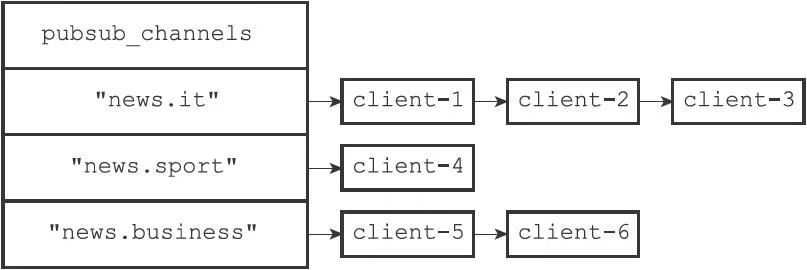
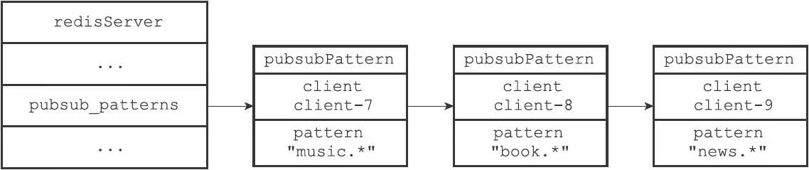

# 发布与订阅

Redis的发布与订阅功能由PUBLISH、SUBSCRIBE、PSUBSCRIBE等命令组成。

通过执行SUBSCRIBE命令，客户端可以订阅一个或多个频道，从而成为这些频道的订阅者（subscriber）：每当有其他客户端向被订阅的频道发送消息（message）时，频道的所有订阅者都会收到这条消息。

除了订阅频道之外，客户端还可以通过执行PSUBSCRIBE命令订阅一个或多个模式，从而成为这些模式的订阅者：每当有其他客户端向某个频道发送消息时，消息不仅会被发送给这个频道的所有订阅者，它还会被发送给所有与这个频道相匹配的模式的订阅者。

## 频道的订阅与退订

Redis将所有频道的订阅关系都保存在服务器状态的pubsub_channels字典里面，这个字典的键是某个被订阅的频道，而键的值则是一个链表，链表里面记录了所有订阅这个频道的客户端：

```c
struct redisServer {
    // ...
    //保存所有频道的订阅关系
    dict *pubsub_channels;
    // ...
};
```

一个pubsub_channels字典示例:



### 订阅频道

每当客户端执行SUBSCRIBE命令订阅某个或某些频道的时候，服务器都会将客户端与被订阅的频道在pubsub_channels字典中进行关联。

根据频道是否已经有其他订阅者，关联操作分为两种情况执行：

- 如果频道已经有其他订阅者，那么它在pubsub_channels字典中必然有相应的订阅者链表，程序唯一要做的就是将客户端添加到订阅者链表的末尾。
- 如果频道还未有任何订阅者，那么它必然不存在于pubsub_channels字典，程序首先要在pubsub_channels字典中为频道创建一个键，并将这个键的值设置为空链表，然后再将客户端添加到链表，成为链表的第一个元素。

SUBSCRIBE命令的实现可以用以下伪代码来描述：

```python
def subscribe(*all_input_channels):
    #遍历输入的所有频道
    for channel in all_input_channels:
        #如果channel不存在于pubsub_channels字典（没有任何订阅者）
        #那么在字典中添加channel键，并设置它的值为空链表
        if channel not in server.pubsub_channels:
          server.pubsub_channels[channel] = []
        #将订阅者添加到频道所对应的链表的末尾
        server.pubsub_channels[channel].append(client)
```

### 退订频道

UNSUBSCRIBE命令的行为和SUBSCRIBE命令的行为正好相反，当一个客户端退订某个或某些频道的时候，服务器将从pubsub_channels中解除客户端与被退订频道之间的关联：

- 程序会根据被退订频道的名字，在pubsub_channels字典中找到频道对应的订阅者链表，然后从订阅者链表中删除退订客户端的信息。
- 如果删除退订客户端之后，频道的订阅者链表变成了空链表，那么说明这个频道已经没有任何订阅者了，程序将从pubsub_channels字典中删除频道对应的键。

UNSUBSCRIBE命令的实现可以用以下伪代码来描述：

```python
def unsubscribe(*all_input_channels):
    #遍历要退订的所有频道
    for channel in all_input_channels:
        #在订阅者链表中删除退订的客户端
        server.pubsub_channels[channel].remove(client)
        #如果频道已经没有任何订阅者了（订阅者链表为空）
        #那么将频道从字典中删除
        if len(server.pubsub_channels[channel]) == 0:
          server.pubsub_channels.remove(channel)
```

## 模式的订阅与退订

前面说过，服务器将所有频道的订阅关系都保存在服务器状态的pubsub_channels属性里面，与此类似，服务器也将所有模式的订阅关系都保存在服务器状态的pubsub_patterns属性里面:

```c
struct redisServer {
    // ...
    //保存所有模式订阅关系
    list *pubsub_patterns;
    // ...
};
```

pubsub_patterns属性是一个链表，链表中的每个节点都包含着一个pubsub Pattern结构，这个结构的pattern属性记录了被订阅的模式，而client属性则记录了订阅模式的客户端:

```c
typedef struct pubsubPattern {
    //订阅模式的客户端
    redisClient *client;
    //被订阅的模式
    robj *pattern;
} pubsubPattern;
```

 pubsub_patterns链表示例:



### 订阅模式

每当客户端执行PSUBSCRIBE命令订阅某个或某些模式的时候，服务器会对每个被订阅的模式执行以下两个操作：

1. 新建一个pubsubPattern结构，将结构的pattern属性设置为被订阅的模式，client属性设置为订阅模式的客户端。
2. 将pubsubPattern结构添加到pubsub_patterns链表的表尾。

PSUBSCRIBE命令的实现原理可以用以下伪代码来描述：

```python
def psubscribe(*all_input_patterns):
    #遍历输入的所有模式
    for pattern in all_input_patterns:
        #创建新的pubsubPattern结构
        #记录被订阅的模式，以及订阅模式的客户端
        pubsubPattern = create_new_pubsubPattern()
        pubsubPattern.client = client
        pubsubPattern.pattern = pattern
        #将新的pubsubPattern追加到pubsub_patterns链表末尾
        server.pubsub_patterns.append(pubsubPattern)
```

### 退订模式

模式的退订命令PUNSUBSCRIBE是PSUBSCRIBE命令的反操作：当一个客户端退订某个或某些模式的时候，服务器将在pubsub_patterns链表中查找并删除那些pattern属性为被退订模式，并且client属性为执行退订命令的客户端的pubsubPattern结构。

PUNSUBSCRIBE命令的实现原理可以用以下伪代码来描述：

```python
def punsubscribe(*all_input_patterns):
     # 遍历所有要退订的模式
     for pattern in all_input_patterns:
         # 遍历pubsub_patterns链表中的所有pubsubPattern结构
         for pubsubPattern in server.pubsub_patterns:
             # 如果当前客户端和pubsubPattern记录的客户端相同
             # 并且要退订的模式也和pubsubPattern记录的模式相同
             if client == pubsubPattern.client and \
                pattern == pubsubPattern.pattern:
                # 那么将这个pubsubPattern从链表中删除
                server.pubsub_patterns.remove(pubsubPattern)
```

## 发送消息

当一个Redis客户端执行PUBLISH＜channel＞＜message＞命令将消息message发送给频道channel的时候，服务器需要执行以下两个动作：

1. 将消息message发送给channel频道的所有订阅者。
2. 如果有一个或多个模式pattern与频道channel相匹配，那么将消息message发送给pattern模式的订阅者。

因为服务器状态中的pubsub_patterns链表记录了所有模式的订阅关系，所以为了将消息发送给所有与channel频道相匹配的模式的订阅者，PUBLISH命令要做的就是遍历整个pubsub_patterns链表，查找那些与channel频道相匹配的模式，并将消息发送给订阅了这些模式的客户端。

### 将消息发送给频道订阅者

因为服务器状态中的pubsub_channels字典记录了所有频道的订阅关系，所以为了将消息发送给channel频道的所有订阅者，PUBLISH命令要做的就是在pubsub_channels字典里找到频道channel的订阅者名单（一个链表），然后将消息发送给名单上的所有客户端。

PUBLISH命令将消息发送给频道订阅者的方法可以用以下伪代码来描述：

```python
def channel_publish(channel, message):
     #如果channel键不存在于pubsub_channels字典中
     #那么说明channel频道没有任何订阅者
     #程序不做发送动作，直接返回
     if channel not in server.pubsub_channels:
        return
     #运行到这里，说明channel频道至少有一个订阅者
     #程序遍历channel频道的订阅者链表
     #将消息发送给所有订阅者
     for subscriber in server.pubsub_channels[channel]:
         send_message(subscriber, message)
```

### 将消息发送给模式订阅者

因为服务器状态中的pubsub_patterns链表记录了所有模式的订阅关系，所以为了将消息发送给所有与channel频道相匹配的模式的订阅者，PUBLISH命令要做的就是遍历整个pubsub_patterns链表，查找那些与channel频道相匹配的模式，并将消息发送给订阅了这些模式的客户端。

PUBLISH命令将消息发送给模式订阅者的方法可以用以下伪代码来描述：

```python
def pattern_publish(channel, message):
    #遍历所有模式订阅消息
    for pubsubPattern in server.pubsub_patterns:
        #如果频道和模式相匹配
        if match(channel, pubsubPattern.pattern):
            #那么将消息发送给订阅该模式的客户端
            send_message(pubsubPattern.client, message)
```

PUBLISH命令的实现可以用以下伪代码来描述：

```python
def publish(channel, message):
    #将消息发送给channel频道的所有订阅者
    channel_publish(channel, message)
    #将消息发送给所有和channel频道相匹配的模式的订阅者
    pattern_publish(channel, message)
```

## 查看订阅信息

PUBSUB命令是Redis 2.8新增加的命令之一，客户端可以通过这个命令来查看频道或者模式的相关信息，比如某个频道目前有多少订阅者，又或者某个模式目前有多少订阅者，诸如此类。

### PUBSUB CHANNELS

PUBSUB CHANNELS[pattern]子命令用于返回服务器当前被订阅的频道，其中pattern参数是可选的：

- 如果不给定pattern参数，那么命令返回服务器当前被订阅的所有频道。
- 如果给定pattern参数，那么命令返回服务器当前被订阅的频道中那些与pattern模式相匹配的频道。

这个子命令是通过遍历服务器pubsub_channels字典的所有键（每个键都是一个被订阅的频道），然后记录并返回所有符合条件的频道来实现的，这个过程可以用以下伪代码来描述：

```python
def pubsub_channels(pattern=None):
    #一个列表，用于记录所有符合条件的频道
    channel_list = []
    #遍历服务器中的所有频道
    #（也即是pubsub_channels字典的所有键）
    for channel in server.pubsub_channels:
        #当以下两个条件的任意一个满足时，将频道添加到链表里面：
        #1）用户没有指定pattern参数
        #2）用户指定了pattern参数，并且channel和pattern匹配
        if (pattern is None) or match(channel, pattern):
            channel_list.append(channel)
#向客户端返回频道列表
return channel_list
```

###  PUBSUB NUMSUB

PUBSUB NUMSUB[channel-1 channel-2...channel-n]子命令接受任意多个频道作为输入参数，并返回这些频道的订阅者数量。

这个子命令是通过在pubsub_channels字典中找到频道对应的订阅者链表，然后返回订阅者链表的长度来实现的（订阅者链表的长度就是频道订阅者的数量），这个过程可以用以下伪代码来描述：

```python
def pubsub_numsub(*all_input_channels):
     #遍历输入的所有频道
     for channel in all_input_channels:
     #如果pubsub_channels字典中没有channel这个键
     #那么说明channel频道没有任何订阅者
     if channel not in server.pubsub_channels:
          #返回频道名
          reply_channel_name(channel)
          #订阅者数量为0
          reply_subscribe_count(0)
     #如果pubsub_channels字典中存在channel键
     #那么说明channel频道至少有一个订阅者
     else:
          #返回频道名
          reply_channel_name(channel)
          #订阅者链表的长度就是订阅者数量
          reply_subscribe_count(len(server.pubsub_channels[channel]))
```

### PUBSUB NUMPAT

PUBSUB NUMPAT子命令用于返回服务器当前被订阅模式的数量。

这个子命令是通过返回pubsub_patterns链表的长度来实现的，因为这个链表的长度就是服务器被订阅模式的数量，这个过程可以用以下伪代码来描述：

```python
def pubsub_numpat():
# pubsub_patterns链表的长度就是被订阅模式的数量
reply_pattern_count(len(server.pubsub_patterns))
```

## 参考资料

关于发布与订阅模式的定义可以参考维基百科的Publish SubscribePattern词条：http://en.wikipedia.org/wiki/Publish-subscribe_pattern，以及《设计模式》一书的5.7节。