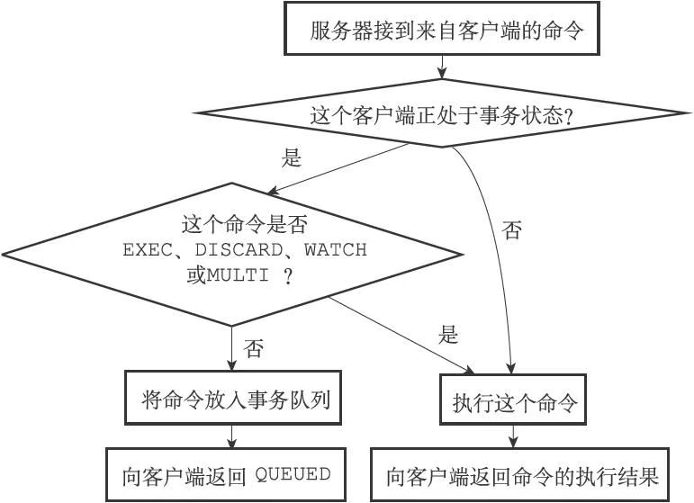
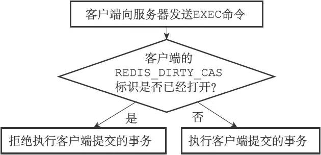

# 事务

Redis通过MULTI、EXEC、WATCH等命令来实现事务（transaction）功能。事务提供了一种将多个命令请求打包，然后一次性、按顺序地执行多个命令的机制，并且在事务执行期间，服务器不会中断事务而改去执行其他客户端的命令请求，它会将事务中的所有命令都执行完毕，然后才去处理其他客户端的命令请求。

以下是一个事务执行的过程，该事务首先以一个MULTI命令为开始，接着将多个命令放入事务当中，最后由EXEC命令将这个事务提交（commit）给服务器执行：

```sh
redis＞ MULTI
OK
redis＞ SET "name" "Practical Common Lisp"
QUEUED
redis＞ GET "name"
QUEUED
redis＞ SET "author" "Peter Seibel"
QUEUED
redis＞ GET "author"
QUEUED
redis＞ EXEC
1) OK
2) "Practical Common Lisp"
3) OK
4) "Peter Seibel"
```

## 事务的实现

一个事务从开始到结束通常会经历以下三个阶段：

1. 事务开始。
2. 命令入队。
3. 事务执行。

### 事务开始

MULTI命令的执行标志着事务的开始：

```bash
redis＞ MULTI OK
```

MULTI命令可以将执行该命令的客户端从非事务状态切换至事务状态，这一切换是通过在客户端状态的flags属性中打开REDIS_MULTI标识来完成的，MULTI命令的实现可以用以下伪代码来表示：

```sh
def MULTI():
#打开事务标识
client.flags |= REDIS_MULTI
#返回OK回复
replyOK()
```

### 命令入队

当一个客户端处于非事务状态时，这个客户端发送的命令会立即被服务器执行。

当一个客户端切换到事务状态之后，服务器会根据这个客户端发来的不同命令执行不同的操作：

- 如果客户端发送的命令为EXEC、DISCARD、WATCH、MULTI四个命令的其中一个，那么服务器立即执行这个命令。
- 与此相反，如果客户端发送的命令是EXEC、DISCARD、WATCH、MULTI四个命令以外的其他命令，那么服务器并不立即执行这个命令，而是将这个命令放入一个事务队列里面，然后向客户端返回QUEUED回复。

服务器判断命令是该入队还是该执行的过程:



### 事务队列

每个Redis客户端都有自己的事务状态，这个事务状态保存在客户端状态的mstate属性里面:

```c
typedef struct redisClient {
    // ...
    //事务状态
    multiState mstate;    /* MULTI/EXEC state */
    // ...
} redisClient;
```

事务状态包含一个事务队列，以及一个已入队命令的计数器（也可以说是事务队列的长度）：

```c
typedef struct multiState {
    //事务队列，FIFO顺序
    multiCmd *commands;
    //已入队命令计数
    int count;
} multiState;
```

事务队列是一个multiCmd类型的数组，数组中的每个multiCmd结构都保存了一个已入队命令的相关信息，包括指向命令实现函数的指针、命令的参数，以及参数的数量:

```c
typedef struct multiCmd {
    //参数
    robj **argv;
    //参数数量
    int argc;
    //命令指针
    struct redisCommand *cmd;
} multiCmd;
```

事务队列以先进先出（FIFO）的方式保存入队的命令，较先入队的命令会被放到数组的前面，而较后入队的命令则会被放到数组的后面。

### 执行事务

当一个处于事务状态的客户端向服务器发送EXEC命令时，这个EXEC命令将立即被服务器执行。服务器会遍历这个客户端的事务队列，执行队列中保存的所有命令，最后将执行命令所得的结果全部返回给客户端。

EXEC命令的实现原理可以用以下伪代码来描述：

```python
def EXEC():
    #创建空白的回复队列
    reply_queue = []
    #遍历事务队列中的每个项
    #读取命令的参数，参数的个数，以及要执行的命令
    for argv, argc, cmd in client.mstate.commands:
        #执行命令，并取得命令的返回值
        reply = execute_command(cmd, argv, argc)
        #将返回值追加到回复队列末尾
        reply_queue.append(reply)
    #移除REDIS_MULTI标识，让客户端回到非事务状态
    client.flags & = ~REDIS_MULTI
    #清空客户端的事务状态，包括：
    #1）清零入队命令计数器
    #2）释放事务队列
    client.mstate.count = 0
    release_transaction_queue(client.mstate.commands)
    #将事务的执行结果返回给客户端
    send_reply_to_client(client, reply_queue)
```

## WATCH命令的实现

WATCH命令是一个乐观锁（optimistic locking），它可以在EXEC命令执行之前，监视任意数量的数据库键，并在EXEC命令执行时，检查被监视的键是否至少有一个已经被修改过了，如果是的话，服务器将拒绝执行事务，并向客户端返回代表事务执行失败的空回复。

### 使用WATCH命令监视数据库键

每个Redis数据库都保存着一个watched_keys字典，这个字典的键是某个被WATCH命令监视的数据库键，而字典的值则是一个链表，链表中记录了所有监视相应数据库键的客户端：

```c
typedef struct redisDb {
	// ...
    //正在被WATCH命令监视的键    
    dict *watched_keys;
    // ...
} redisDb;
```

通过watched_keys字典，服务器可以清楚地知道哪些数据库键正在被监视，以及哪些客户端正在监视这些数据库键。

通过执行WATCH命令，客户端可以在watched_keys字典中与被监视的键进行关联。

### 监视机制的触发

所有对数据库进行修改的命令，比如SET、LPUSH、SADD、ZREM、DEL、FLUSHDB等等，在执行之后都会调用multi.c/touchWatchKey函数对watched_keys字典进行检查，查看是否有客户端正在监视刚刚被命令修改过的数据库键，如果有的话，那么touchWatchKey函数会将监视被修改键的客户端的REDIS_DIRTY_CAS标识打开，表示该客户端的事务安全性已经被破坏。

touchWatchKey函数的定义可以用以下伪代码来描述：

```python
def touchWatchKey(db, key):
    #如果键key存在于数据库的watched_keys字典中
    #那么说明至少有一个客户端在监视这个key
    if key in db.watched_keys:
        #遍历所有监视键key的客户端
        for client in db.watched_keys[key]:
            #打开标识
            client.flags |= REDIS_DIRTY_CAS
```

### 判断事务是否安全

当服务器接收到一个客户端发来的EXEC命令时，服务器会根据这个客户端是否打开了REDIS_DIRTY_CAS标识来决定是否执行事务：

- 如果客户端的REDIS_DIRTY_CAS标识已经被打开，那么说明客户端所监视的键当中，至少有一个键已经被修改过了，在这种情况下，客户端提交的事务已经不再安全，所以服务器会拒绝执行客户端提交的事务。
- 如果客户端的REDIS_DIRTY_CAS标识没有被打开，那么说明客户端监视的所有键都没有被修改过（或者客户端没有监视任何键），事务仍然是安全的，服务器将执行客户端提交的这个事务。



## 事务的ACID性质

在Redis中，事务总是具有原子性（Atomicity）、一致性（Consistency）和隔离性（Isolation），并且当Redis运行在某种特定的持久化模式下时，事务也具有耐久性（Durability）。

### 原子性

事务具有原子性指的是，数据库将事务中的多个操作当作一个整体来执行，服务器要么就执行事务中的所有操作，要么就一个操作也不执行。

对于Redis的事务功能来说，事务队列中的命令要么就全部都执行，要么就一个都不执行，因此，Redis的事务是具有原子性的。

Redis的事务和传统的关系型数据库事务的最大区别在于，Redis不支持事务回滚机制（rollback），即使事务队列中的某个命令在执行期间出现了错误，整个事务也会继续执行下去，直到将事务队列中的所有命令都执行完毕为止。

 Redis的作者在事务功能的文档中解释说，不支持事务回滚是因为这种复杂的功能和Redis追求简单高效的设计主旨不相符，并且他认为，Redis事务的执行时错误通常都是编程错误产生的，这种错误通常只会出现在开发环境中，而很少会在实际的生产环境中出现，所以他认为没有必要为Redis开发事务回滚功能。

### 一致性

事务具有一致性指的是，如果数据库在执行事务之前是一致的，那么在事务执行之后，无论事务是否执行成功，数据库也应该仍然是一致的。

“一致”指的是数据符合数据库本身的定义和要求，没有包含非法或者无效的错误数据。

Redis通过谨慎的错误检测和简单的设计来保证事务的一致性。

#### 1.入队错误

如果一个事务在入队命令的过程中，出现了命令不存在，或者命令的格式不正确等情况，那么Redis将拒绝执行这个事务。

#### 2. 执行错误

除了入队时可能发生错误以外，事务还可能在执行的过程中发生错误。

关于这种错误有两个需要说明的地方：

- 执行过程中发生的错误都是一些不能在入队时被服务器发现的错误，这些错误只会在命令实际执行时被触发。
- 即使在事务的执行过程中发生了错误，服务器也不会中断事务的执行，它会继续执行事务中余下的其他命令，并且已执行的命令（包括执行命令所产生的结果）不会被出错的命令影响。

对数据库键执行了错误类型的操作是事务执行期间最常见的错误之一。

因为在事务执行的过程中，出错的命令会被服务器识别出来，并进行相应的错误处理，所以这些出错命令不会对数据库做任何修改，也不会对事务的一致性产生任何影响。

#### 3.服务器停机

如果Redis服务器在执行事务的过程中停机，那么根据服务器所使用的持久化模式，可能有以下情况出现：

- 如果服务器运行在无持久化的内存模式下，那么重启之后的数据库将是空白的，因此数据总是一致的。
- 如果服务器运行在RDB模式下，那么在事务中途停机不会导致不一致性，因为服务器可以根据现有的RDB文件来恢复数据，从而将数据库还原到一个一致的状态。如果找不到可供使用的RDB文件，那么重启之后的数据库将是空白的，而空白数据库总是一致的。
- 如果服务器运行在AOF模式下，那么在事务中途停机不会导致不一致性，因为服务器可以根据现有的AOF文件来恢复数据，从而将数据库还原到一个一致的状态。如果找不到可供使用的AOF文件，那么重启之后的数据库将是空白的，而空白数据库总是一致的。

综上所述，无论Redis服务器运行在哪种持久化模式下，事务执行中途发生的停机都不会影响数据库的一致性。

### 隔离性

事务的隔离性指的是，即使数据库中有多个事务并发地执行，各个事务之间也不会互相影响，并且在并发状态下执行的事务和串行执行的事务产生的结果完全相同。

因为Redis使用单线程的方式来执行事务（以及事务队列中的命令），并且服务器保证，在执行事务期间不会对事务进行中断，因此，Redis的事务总是以串行的方式运行的，并且事务也总是具有隔离性的。

### 耐久性

事务的耐久性指的是，当一个事务执行完毕时，执行这个事务所得的结果已经被保存到永久性存储介质（比如硬盘）里面了，即使服务器在事务执行完毕之后停机，执行事务所得的结果也不会丢失。

因为Redis的事务不过是简单地用队列包裹起了一组Redis命令，Redis并没有为事务提供任何额外的持久化功能，所以Redis事务的耐久性由Redis所使用的持久化模式决定：

- 当服务器在无持久化的内存模式下运作时，事务不具有耐久性：一旦服务器停机，包括事务数据在内的所有服务器数据都将丢失。
- 当服务器在RDB持久化模式下运作时，服务器只会在特定的保存条件被满足时，才会执行BGSAVE命令，对数据库进行保存操作，并且异步执行的BGSAVE不能保证事务数据被第一时间保存到硬盘里面，因此RDB持久化模式下的事务也不具有耐久性。
- 当服务器运行在AOF持久化模式下，并且appendfsync选项的值为always时，程序总会在执行命令之后调用同步（sync）函数，将命令数据真正地保存到硬盘里面，因此这种配置下的事务是具有耐久性的。
- 当服务器运行在AOF持久化模式下，并且appendfsync选项的值为everysec时，程序会每秒同步一次命令数据到硬盘。因为停机可能会恰好发生在等待同步的那一秒钟之内，这可能会造成事务数据丢失，所以这种配置下的事务不具有耐久性。
- 当服务器运行在AOF持久化模式下，并且appendfsync选项的值为no时，程序会交由操作系统来决定何时将命令数据同步到硬盘。因为事务数据可能在等待同步的过程中丢失，所以这种配置下的事务不具有耐久性。

## 参考资料

1. Redis官方网站上的《事务》文档记录了Redis处理事务错误的方式，以及Redis不支持事务回滚的原因：http://redis.io/topics/transactions。