## 第7章　日志结构存储

不可变数据结构经常在函数式编程语言中使用，并且由于其安全性而变得越来越受欢迎：不可变结构一旦被创建就不会改变，它的所有引用都可以被并发地访问，并且它的完整性由不可修改这一事实来保证。

从高层级看来，在存储结构的内部和外部，对待数据的方式有严格的区别。在内部，不可变文件可以保存多个副本，更新的副本将覆盖旧的副本，而可变文件通常只保存最新的值。当被访问时，不可变文件被处理，冗余副本需要进行协调，最新的副本会返回客户端。

正如其他有关该主题的书籍和论文所做的那样，我们使用B树作为可变数据结构的典型示例，而使用日志结构合并树（Log-Structured Merge Tree，LSM树）作为不可变结构的示例。不可变LSM树使用仅追加存储和合并协调，而B树则在磁盘上定位数据记录并在文件中的原始偏移量上更新页。

原地更新存储结构针对读取进行了性能优化[GRAEFE04]：当在磁盘上定位数据之后，就可以将记录返回客户端。这是以牺牲写入性能为代价的：要在原地更新数据记录，首先必须在磁盘上进行定位。另一方面，仅追加存储是对写入性能进行的优化。写操作不必在磁盘上找到记录来覆盖它们。然而，这是以读取性能为代价的，读取必须检索多个数据记录版本并对它们进行协调。

由于可变B树所采用的结构和构建方法，读写和维护期间的大多数I/O操作都是随机的。每个写操作首先需要找到保存数据记录的页，然后才能修改它。B树要求对已写入的记录进行节点分裂和合并。一段时间之后，B树的页可能需要进行维护。页的大小是固定的，并且为将来的写入保留了一些可用空间。另一个问题是，即使只修改了页中的一个单元格，也必须重写整个页。

有一些替代方法可以帮助缓解这些问题，使一些I/O操作顺序化，并避免在修改期间的页重写。这样做的方法之一就是使用不可变数据结构。在本章中，我们将关注LSM树：它是如何构建的，它的属性是什么，以及它与B树有何不同。

### 7.1 LSM树

在讨论B树时，我们得出结论：使用缓冲可以改善空间开销和写入放大问题。通常，在不同的存储结构中有两种应用缓冲的方式：推迟对磁盘驻留页的写入传播（正如我们在6.4节和6.3.1节中看到的），以及使写操作顺序化。

LSM树是最流行的不可变磁盘存储结构之一，它使用缓冲和仅追加存储来实现顺序写操作。LSM树是类似于B树的磁盘驻留结构的变体，其中节点完全被填满，并为顺序磁盘访问进行了优化。这个概念是在Patrick O'Neil和Edward Cheng的一篇论文中被首次提出的[ONEIL96]。日志结构合并树的名称取自日志结构文件系统，这种文件系统将磁盘上的所有修改写入一个类似日志的文件[ROSENBLUM92]。

LSM树写入不可变的文件，并随着时间的推移将它们合并在一起。这些文件通常包含它们自己的索引，以帮助读取者高效地定位数据。尽管LSM树通常被用作B树的一种替代，但B树通常被用作LSM树的不可变文件的内部索引结构。

LSM树中的“合并”(merge)一词表示：由于它的不变性，需要使用类似于归并排序(merge sort)的方法合并树的内容。这一过程会发生在回收冗余副本所占空间的维护期，也会发生在向用户返回内容之前的读取期。

LSM树将数据文件写入推迟，并将更改缓冲在一个内存驻留表中。表中的内容随后将被写到不可变磁盘文件中。在文件完全持久化之前，所有数据记录仍然可以在内存中访问。

保持数据文件的不变性有利于顺序写入：数据被一次性写入磁盘，文件是仅追加的。可变结构也可以一次性预分配数据块（例如，索引顺序访问方法(ISAM)[RAMAKRISHNAN03,LARSON81]），但是后续访问仍然需要随机读写。而不可变结构则允许我们按顺序放置数据以防止产生碎片。此外，不可变文件具有更高的数据密度：我们无须为之后将要写入的数据记录保留任何额外的空间，也不会因更新后的记录可能比最初写入的记录需要更多空间而为其保留额外的空间。

由于文件是不可变的，所以插入、更新和删除操作不需要在磁盘上定位数据记录，这显著提高了写入的性能和吞吐量。另一方面，重复内容是允许的，且要在读取时解决冲突。LSM树在写远大于读的应用程序中特别有用。考虑到数据量和采集速率在不断增长，在现代数据密集型系统中这种情况是常见的。

读和写在设计上并不交叉，因此可以在没有段级锁的情况下读写磁盘上的数据，这大大简化了并发访问。相反，可变结构采用层级锁和闩锁（你可以在5.3节中找到更多关于锁和闩锁的信息）来确保磁盘数据结构的完整性并允许并发读取，但要求写入者对子树具有独占的所有权。基于LSM的存储引擎使用数据和索引文件的线性化内存视图，并且只需对管理它们的结构进行并发访问保护。

B树和LSM树都需要一些内务处理(housekeeping)来优化性能，但原因不尽相同。由于分配文件的数量稳定增长，所以LSM树必须合并和重写文件，以确保在读取过程中访问尽可能少的文件，因为请求的数据记录可能分布在多个文件中。另一方面，可变文件可能必须被部分或全部重写，以减少碎片并回收被更新或删除的记录所占用的空间。当然，内务处理的确切工作很大程度上取决于具体实现。

#### 7.1.1 LSM树的结构

我们从有序的LSM树[ONEIL96]开始介绍，其中文件保存排序后的数据记录。稍后，在7.4节中，我们还将讨论允许以插入顺序记录存储数据的结构，其在写入路径上具有一些明显的优势。

正如我们刚才所讨论的，LSM树由较小的内存驻留组件和较大的磁盘驻留组件组成。要在磁盘上写出不可变的文件内容，首先需要在内存中对其进行缓冲和排序。

内存驻留组件（通常称为memtable）是可变的：它缓冲数据记录，并充当读写操作的目标。当其大小达到一个可配阈值时，memtable中的内容将会被持久化到磁盘上。memtable的更新不需要磁盘访问，也没有相关的I/O开销。需要一个单独的预写日志文件（类似于我们在5.2节中所讨论的）以保证数据记录的持久性。在向客户端确认操作之前，数据记录会被追加到日志中并提交到内存。

缓冲是在内存中完成的：所有读写操作都应用于一个内存驻留表，该表维护一个允许并发访问的有序数据结构，其通常是某种形式的内存排序树，或任何可以提供类似性能和特征的数据结构。

磁盘驻留组件则是通过将内存中缓冲的内容刷写到磁盘来构建的。磁盘驻留组件仅用于读取：缓存的内容被持久化成文件，而这些文件永远不会被修改。这允许我们从简单操作的角度来考虑：对内存中的表进行写操作，以及对磁盘和基于内存的表进行读、合并和文件删除操作。

##### 双组件LSM树

我们要区分双组件和多组件的LSM树。双组件LSM树只有一个磁盘组件，由不可变段组成。这里的磁盘组件被组织为B树，它具有100%的节点占用率和只读的页。

内存驻留树的内容被分块刷写到磁盘上。在刷写期间，对于每个被刷写的内存驻留子树，我们在磁盘上找到一个相应的子树，并将内存驻留段和磁盘驻留子树的合并内容写入磁盘上的新段。图7-1展示了合并前的内存驻留树和磁盘驻留树。

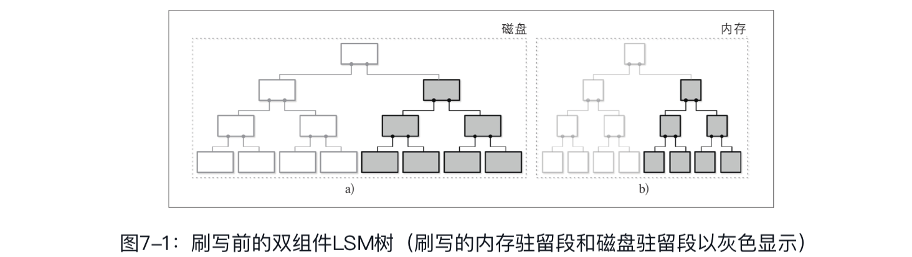

在刷写子树之后，原来的内存驻留子树和磁盘驻留子树将被丢弃，并被它们合并后的结果所替换。在替换后，该结果就可以从磁盘驻留树中先前存在的部分被寻址到。图7-2展示了合并过程的结果，合并的结果已经写入磁盘上的新位置并附加到树的其余部分。

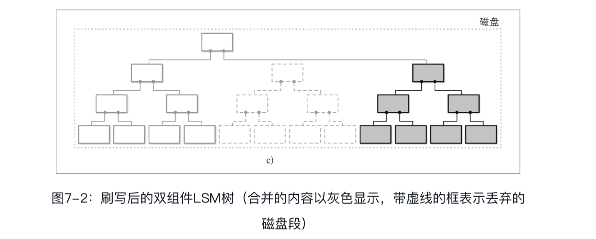

合并可以通过同时步进两个迭代器来实现，这两个迭代器分别读取磁盘驻留树的叶节点和内存树中的内容。因为两个数据源都是有序的，所以要产生有序的合并结果，我们只需要在合并过程的每个步骤中知道两个迭代器的当前值。

这种方法是我们关于不可变B树的讨论的逻辑扩展与延续。写时复制B树（参见6.1节）使用B树结构，但它的节点没有被完全填满，它要求在根叶路径上复制页，并创建一个平行的树结构。在这里，我们做了类似的事情，但是因为我们在内存中缓冲写操作，所以磁盘驻留树的更新成本被均摊了。

在实现子树合并和刷写时，我们必须确保三件事：

1. 刷新过程一旦开始，所有新的写操作都必须转到新的memtable。
2. 在子树刷写期间，磁盘驻留子树和正在刷写的内存驻留子树都要保持可以被读取的状态。
3. 在刷写之后，如下操作必须以原子的方式执行：发布合并的内容、丢弃原始的磁盘驻留与内存驻留的内容。

尽管双组件LSM树对维护索引文件很有用，但在撰写本书时，作者还不知道有这样实现的系统。这可以用该方法的写放大特性来解释：合并相对频繁，因为它们是由memtable刷写所触发的。

##### 多组件LSM树

让我们考虑另一种设计，即多组件LSM树，它具有不止一个磁盘驻留表。在这种情况下，整个memtable内容在一次运行中被刷写。

我们很快就会发现，在多次刷写之后将会得到多个磁盘驻留表，而且它们的数量只会随着时间的推移而增长。由于我们并不总是确切地知道哪些表持有我们所需的数据记录，所以我们可能不得不访问多个文件来定位要搜索的数据。

从多个数据源而不是仅从一个数据源读取数据的代价较大。为了缓解这个问题并将表的数量维持在最少，需要触发一个称为压实(compaction)的周期性合并过程（参见7.1.6节）。压实选择几个表，读取它们的内容，合并它们，并将合并的结果写到新文件中。旧表在新表出现的同时被丢弃。

图7-3展示了多组件LSM树的数据生命周期。数据首先缓存在内存驻留组件中。当它变得太大时内容会被刷写到磁盘上以创建磁盘驻留表。然后，多个表合并在一起，以创建出更大的表。

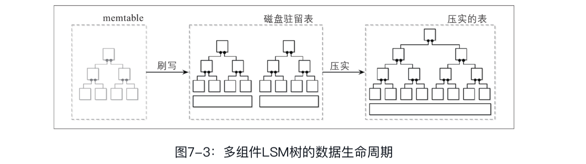

本章的其余部分将会介绍多组件LSM树、块构建及其维护过程。

##### 内存表

刷写memtable可以被周期性地触发，也可以通过大小阈值来触发。在其可被刷写之前，必须进行memtable切换：分配一个新的memtable，它成为所有新的写入操作的目标，而旧的memtable则变成刷写状态。这两个步骤必须被原子地执行。在其内容被完全刷写之前，被刷写的memtable仍可用于读取。在此之后，旧的memtable将被丢弃，取而代之的是一个新写入的磁盘驻留表，该表可用于读取。

在图7-4中，你可以看到LSM树的组件、它们之间的关系，以及实现它们之间转换的操作。

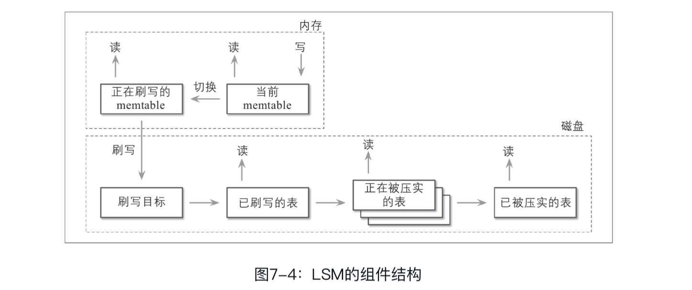

- 当前的memtable：接收写请求并服务读请求。
- 正在刷写的memtable：可用于读取。
- 磁盘上的刷写目标：不参与读取，因为其内容不完整。
- 已刷写的表：一旦被刷写的memtable被丢弃，就可以被用于读取。
- 正在被压实的表：当前正在被合并的磁盘驻留表。
- 已被压实的表：由已刷写的表或其他已压实的表所创建

数据已经在内存中进行了排序，因此可以通过将内存驻留的内容依次写入磁盘来创建磁盘驻留表。在刷写期间，正在刷写的memtable和当前的memtable都可供读取。

在完全刷写memtable之前，其内容唯一的磁盘驻留版本储存在预写日志中。当memtable内容被完全刷写到在磁盘上时，日志可以被修剪(trim)，并且保存对被刷写过的memtable进行的操作的日志段可以被丢弃。

#### 7.1.2 更新与删除

在LSM树中，插入、更新和删除操作不需要在磁盘上定位数据记录。但是，在读取的过程中需要对冗余的记录进行协调。

从memtable中删除数据记录是不够的，因为其他磁盘或内存驻留表可能持有同一个键的数据记录。如果仅通过从memtable中移除数据项来实现删除，那么要么最终删除无效，要么我们会复活(resurrect)先前的数值。

让我们考虑一个例子。被刷写的磁盘驻留表中包含与记录v1相关联的键k1，而memtable则保存其新值v2：

```sh
磁盘表        memtable
| k1 | v1 |  | k1 | v2 |
```

如果我们只是将v2从memtable中移除并刷写它，我们就实际上复活了v1，因为它成为与该键相关联的唯一值：

```sh
磁盘表        memtable
| k1 | v1 |  nil
```

因此，删除操作需要被显式地记录下来。这可以通过插入一个特殊的删除条目（delete entry，有时称为墓碑(tombstone)或休眠凭证(dormant certificate)）来实现，该条目说明与此键对应的数据记录已被删除：

```sh
磁盘表        memtable
| k1 | v1 |  | k1 | <tombstone> |
```

协调过程如果看到墓碑，就会过滤掉其所遮蔽的值。

有时，删除连续范围的键而不是单一的键可能很有用，这可以使用谓词删除来完成，谓词删除的工作方式是在删除条目中附加一个谓词，该谓词根据常规的记录排序规则进行排序。在协调期间，与谓词匹配的数据记录将被跳过而不会返回客户端。

谓词可以采用DELETE FROM table WHERE key≥"k2" AND key<"k4"的形式，并接受任何范围匹配。Apache Cassandra实现了这个方法并将其称为范围墓碑。一个范围墓碑覆盖了一个键的范围而不是单个键。

在使用范围墓碑时，由于范围可能和磁盘驻留表边界重叠，所以必须仔细考虑解析规则。例如，以下组合将从最终结果中隐去与k2和k3关联的数据记录：

```xml
| k1 | v1 |     |  k2  |  <起始_墓碑_包含> |
| k2 | v2 |     |  k4  | <终止_墓碑_不包含>|
| k3 | v3 |
| k4 | v4 |
```

#### 7.1.3 LSM树的查找

LSM树由多个组件组成。查找过程通常会访问多个组件，因此在将其返回客户端之前，必须对其内容进行合并和协调。为了更好地理解合并过程，我们来看看表在合并过程中是如何迭代的，以及冲突的记录是如何组合的。

#### 7.1.4 合并迭代

由于磁盘驻留表上的内容是经过排序的，所以我们可以使用多路归并排序算法。例如，我们有三个数据源：两个磁盘驻留表和一个memtable。通常，存储引擎提供游标或迭代器来遍历文件内容。此游标保存上次消耗的数据记录的偏移量，可以用来检查迭代是否完成，也可以用于抽取下一个数据记录。

多路归并排序使用一个优先级队列，如最小堆(min-heap)[SEDGEWICK11]，该队列最多保存N个元素（其中N是迭代器的数目），该队列对其内容进行排序并准备返回的下一个最小的元素。每个迭代器的头被放入队列。队列头部的元素就是所有迭代器的最小值。

> 优先队列是一种数据结构，用于维护一个有序数据项队列。当常规队列按照添加的顺序（先进先出）保留项目时，优先级队列在插入数据项时进行重新排序，具有最高（或最低）优先级的数据项被放在队列的头部。这对于合并迭代特别有用，因为我们必须有序地输出元素。

当从队列中移除最小的元素时，检查与之相关联的迭代器是否有下一个值，然后将该值放入队列，队列将被重新排序以维持顺序。

因为所有迭代器中的内容都是有序的，所以从之前的最小元素对应的迭代器取出下一个值并插入优先队列也维持了一个不变式——队列仍然包含来自所有迭代器的最小元素。每当其中一个迭代器耗尽时，就不再插入这个迭代器的值，但是算法仍然继续执行。该算法持续执行到查询条件被满足或所有迭代器耗尽为止。

图7-5展示了上述合并过程的一个示意图：头部元素（源表中的浅灰色项）被放置到优先级队列中。优先级队列中的元素返回输出迭代器。所产生的输出是有序的。

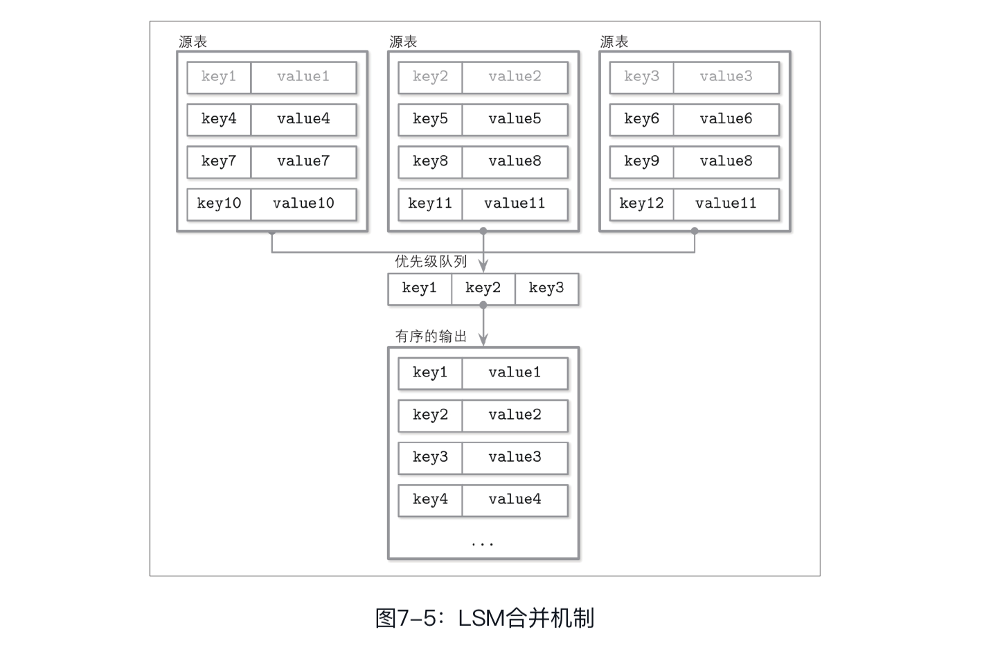

在合并迭代过程中，可能会有多个数据记录具有相同的键。从优先级队列和迭代器不变式中可知，如果在每个迭代器中每个键只持有单个数据记录，而我们又最终在队列中发现多个数据记录且有相同的键，那么这些数据记录一定来自不同的迭代器。

让我们一步步地完成一个示例。作为输入数据，我们在两个磁盘驻留表上的迭代器：

```yaml
迭代器1：   迭代器2：
{k2: v1} {k4: v2}       {k1: v3} {k2: v4} {k3: v5}
```

使用迭代器头部元素填充优先级队列：

```yaml
迭代器1：   迭代器2：   优先级队列：
{k4: v2}        {k2: v4} {k3: v5}       {k1: v3} {k2: v1}
```

键k1是队列中最小的键，将其追加到结果集中。因为它来自迭代器2，所以我们将这个迭代器的下一个元素重新填充进队列：

```yaml
迭代器1：   迭代器2：   优先级队列：                  合并后的结果集：
{k4: v2}        {k3: v5}        {k2: v1} {k2: v4}       {k1: v3}
```

此时，我们在队列中有两个记录为k2的键。可以肯定的是，由于前述的不变式，在任何迭代器中都没有其他记录具有相同的键。相同键的数据记录在被合并后会被追加到合并后的结果集中。

使用来自两个迭代器的数据重新填充这个队列：

```yaml
迭代器1：   迭代器2：   优先级队列：                  合并后的结果集：
{}      {}      {k3: v5} {k4: v2}       {k1: v3} {k2: v4}
```

由于现在所有迭代器都是空的，所以我们将剩余的队列内容追加到结果集中：

```yaml
合并后的结果集：
{k1: v3} {k2: v4} {k3: v5} {k4: v2}
```

总结一下，创建合并迭代器必须重复以下步骤：

1. 用每个迭代器的第一项填充优先队列。
2. 从优先队列中取出最小的元素（队列头部）。
3. 从相应的迭代器取出一个值重新填入优先队列，除非该迭代器耗尽。

合并迭代器与合并有序集合的时间复杂度相同。其内存开销为O(N)，其中N是迭代器的数目。平均情况下维护迭代器头部有序集合的时间复杂度是O(logN)[KNUTH98]。

#### 7.1.5 协调

合并迭代只是从多个数据源合并数据的一个方面。另一个重要方面是与同一键相关联的数据记录的协调和冲突解决。

不同的表可能持有相同键的数据记录，例如更新和删除，这时必须对它们的内容进行协调。前例中的优先级队列的实现必须能够允许插入与相同键关联的多个值，并触发协调。

> 如果记录不存在，则将其插入数据库，否则更新现有的值，这种操作称为upsert[插图]。在LSM树中，插入和更新操作是无法区分的，因为它们并不试图在所有源中找到先前与该键相关联的数据记录并重新设置其值，所以我们可以说在默认情况下upsert记录。

为了协调数据记录，我们需要了解它们中的哪一个是优先的。数据记录持有这样做所必需的元数据，例如时间戳。我们可以通过比较时间戳来建立来自多个数据源的数据项之间的顺序，并找出哪个更新。

被具有更高时间戳的记录所遮蔽的记录不会返回给客户端，在压实期间也不会被写入。

#### 7.1.6 LSM树的维护

与可变B树类似，LSM树也需要维护。该过程的性质很大程度上受到这些算法所保持的不变式的影响。

在B树中，维护过程收集未引用的单元格，对页进行碎片整理，并回收被移除和遮蔽的记录所占用的空间。在LSM树中，磁盘驻留表的数量不断增长，但可以通过触发周期性的压实来减少。

压实会挑选多个磁盘驻留表，使用前面提到的合并和协调算法迭代它们的全部内容，并将结果写入新创建的表。

由于磁盘驻留表内容是有序的，而且由于归并排序的工作方式，压实操作有一个理论上的内存使用上限，因为它只在内存中保存迭代器头部元素。所有表的内容都是按顺序消耗的，合并的结果数据也是按顺序写出的。由于一些额外的优化，这些细节在不同的实现之间可能会略有差异。

在压实过程完成之前，正在被压实的表仍可用于读取。这意味着在压实期间，磁盘上需要有足够的可用空间来写入压实的表。

系统中可以同时执行多个压实操作。然而，这些并发的压实操作通常使用不相交的表集合。压实的写入者既可以将多个表合并为一个，也可以将一个表划分为多个表。

##### 墓碑和压实

墓碑表示了正确协调所需的重要信息，因为某些其他表可能仍然保存着墓碑所遮蔽掉的过期数据记录。

在压实过程中，墓碑不会被立即丢弃。它们会被保留，直到存储引擎可以确定在任何其他表中都不存在时间戳更小且键相同的数据记录。RocksDB保留墓碑直到它们到达最底层。而Apache Cassandra保留墓碑直到它们到达GC（垃圾收集）的宽限期，这是因为数据库的最终一致性，这样做可以确保其他节点观察到墓碑。在压实过程中保留墓碑对于避免数据复活很重要。

##### 分层压实

压实提供了多种优化机会，并且有许多不同的压实策略。其中一种常用的压实策略称为层级压实(leveled compaction)，例如RocksDB就使用这一策略。

层级压实将磁盘驻留表划分为多个层级。每个层上的表都有目标大小，每个层都有相应的序号（标识符）。有些违反直觉的是，序号最高的层被称为最底层。为清楚起见，本小节避免使用“较高层”和“较低层”这两个术语，并对层序号使用相同的限定词。也就是说，由于2大于1，所以2层有着高于1层的序号。术语“之前的”和“之后的”与层序号具有相同的顺序语义。

0层表是通过刷写memtable的内容而创建的。0层中的表可能包含重叠的键范围。而0层上的表数量只要一达到某个阈值，它们的内容就会被合并，并创建一个层级为1的新表。

1层和所有序号更高的层上的表都不存在键范围上的重叠，因此在压实期间必须将0层表分区，分裂成多个范围，然后将其与持有相应键范围的表进行合并。或者，压实可以读入所有0层和1层的表，然后输出分区过的1层的表。

在序号更高的层上进行压实是从两个范围重叠的连续层中挑选表，并在较高的层上生成一个新的表。图7-6示意性地展示了压实过程是如何在层之间迁移数据的。压实1层表和2层表的过程将产生一个位于2层的新表。根据表的分区方式，可以从一层中挑选多个表进行压实。

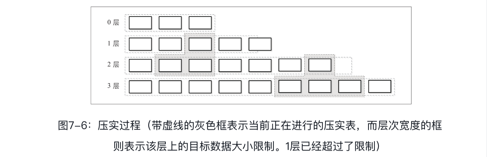

在不同的表中保持不同的键范围减少了在读取期间要访问的表的数量。这是通过检查表的元数据并过滤掉范围不包含搜索键的表来实现的。

每一层都有表大小和最大表个数的限制。在1层或任何具有较高序号的层中，一旦表的数量达到一个阈值，来自当前层的表就与键范围重叠的下一层的表进行合并。

层的大小在层与层之间是指数增长的：每一个层上的表都要比上一层上的表以指数级增大。这样，最新的数据总是在序号最低的层上，而较旧的数据逐渐迁移到序号较高的层上。

##### 按大小分层压实

另一种流行的压实策略称为按大小分层压实(size-tiered compaction)。在按大小分层压实中，磁盘驻留表不是根据其层级进行分组，而是按照大小进行分组：较小的表与较小的表分在一起，较大的表则与较大的表分在一起。

0层保存最小的表，这些表要么是从memtable中被刷写的，要么是通过压实过程来创建的。当表被压实时，所产生的合并表被写入持有相应大小的表的层。该过程持续递归地增加层，将较大的表压实并提升到更高的层，并将较小的表降级为较低的层。

> 按大小分层压实的一个问题叫作表饥饿：如果压实后的表仍然足够小（例如，数据记录被墓碑遮蔽，没有进入合并的表），则更高的层可能产生压实饥饿，其墓碑将一直不被回收，从而增加读取的开销。在这种情况下，对于一个层将不得不进行强制压实，即使它没有包含足够数量的表。

还有其他一些常见的压实策略实现，可以针对不同的工作负载对其进行优化。例如，Apache Cassandra还实现了一个时间窗口压实策略，该策略对于具有生存期(time-to-live)的时间序列型工作负载（换句话说，数据项必须在给定的一段时间之后过期）特别有用。

时间窗口压实策略将写入时间戳考虑在内，允许整个丢弃那些持有已过期时间范围的数据的文件，而不需要对它们的内容进行压实和重写。

### 7.2 读写放大与空间放大

在实现最优压实策略时，我们必须考虑多个因素。一种方法是回收重复记录占用的空间，减少空间开销，但这会产生由不断重写表导致的更高的写放大。替代方案是避免连续重写数据，而这又增加了读放大（在读取期间协调关联到相同键的数据记录的开销）和空间放大（因为冗余记录会被保存更长时间）。

> 数据库界的一大争议是B树和LSM树之中到底哪个的写放大较低。对于二者，理解写放大的来源是极其重要的。在B树中，写放大来自回写操作以及后续对同一节点的更新。而在LSM树中，写放大是由在压实过程中将数据从一个文件迁移到另一个文件引起的。直接比较两者可能会导致不正确的结论。

总结起来，当以不可变的方式在磁盘上存储数据时，我们面临三个问题：

- **读放大**: 由为了检索数据而需要读取多个表所引起。
- **写放大**: 由压实过程中不断进行的重写所引起。
- **空间放大**: 由存储关联到同一键的多个记录所引起。

在本章的剩余部分，我们将逐一对这些问题进行讨论。

**RUM猜想**

有一种流行的存储结构开销模型考虑了如下三个因素：读取(Read)、更新(Update)和内存(Memory)开销。它被称为RUM猜想[ATHANASSOULIS16]。

RUM猜想指出，减少其中两项开销将不可避免地导致第三项开销的恶化，并且优化只能以牺牲三个参数中的一个为代价。我们可以根据这三个参数对不同的存储引擎进行比较，以了解它们针对哪些参数进行了优化，以及其中隐含着哪些可能的权衡。

一个理想的解决方案是拥有最小的读取开销，同时保持较低的内存与写入开销。但在现实中，这是无法实现的，因此我们需要进行取舍。

B树是针对读进行优化的。对B树的写入需要在磁盘上找到一个记录，而随后对同一页的写入可能需要多次更新该磁盘页面。还要为将来的更新和删除保留额外的空间，这会增加空间开销。

而LSM树则不需要在写入期间定位磁盘上的记录，也不用为以后的写入保留额外的空间。但由于存储冗余记录，所以仍然存在一些空间开销。在默认配置中，由于必须通过访问多个表才能返回完整的结果，所以读取的成本更高。但是，本章中讨论的优化有助于缓解这个问题。

正如我们在关于B树的章节中已经看到、在本章中将要看到的那样，有一些方法可以通过使用不同的优化手段来改善这些特性。

这个开销模型并不完美，因为它没有考虑其他重要的指标，如延迟、访问模式、实现复杂度、维护成本以及与硬件相关的细节。对于分布式数据库很重要的概念，如一致性含义和复制开销，也没有被考虑进去。然而，该模型可以被用作初步评估或当作一种经验法则，它有助于我们理解存储引擎必须提供什么。

### 7.3 实现细节

我们已经介绍了LSM树的基本动态特性：数据是如何被读取、写入和合并的。然而，还有许多LSM树实现的共同点是值得讨论的：内存驻留表和磁盘驻留表是如何实现的，二级索引是如何工作的，如何减少读取时要访问的磁盘驻留表的数量，以及关于日志结构存储的新想法。

#### 7.3.1 有序字符串表

到目前为止，我们已经讨论了LSM树的层次结构和逻辑结构（它是由多个内存驻留组件与磁盘驻留组件构成的），但是还没有讨论磁盘驻留表是如何实现的，以及其设计是如何与系统的其余部分配合而发挥作用的。

磁盘驻留表通常使用有序字符串表(Sorted String Table，SSTable)来实现。顾名思义，SSTable中的数据记录是按照键顺序进行排序和布局的。SSTable通常由两个组件组成：索引文件和数据文件。索引文件是用能够以对数时间复杂度（如B树）或常量时间复杂度（如哈希表）进行查找的某种结构来实现的。

由于数据文件以键顺序保存记录，所以使用哈希表进行索引并不妨碍我们实现范围扫描，因为访问哈希表只是为了定位范围中的第一个键，并且在范围谓词仍然匹配的情况下，范围本身可以顺序地从数据文件中读出。

索引组件保存键和数据入口（实际数据记录在数据文件中的偏移量）。数据组件由连起来的键值对组成。我们在第3章中讨论的单元格设计和数据记录格式大都适用于SSTable。这里的主要区别在于，单元格是按顺序写入的，并且在SSTable的生命周期中不被修改。由于索引文件持有的指针指向存储在数据文件中的记录，所以在创建索引时必须知道它们的偏移量。

在压实期间，可以顺序读取数据文件而不对索引组件进行寻址，这是因为它们中的数据记录已经是有序的。由于在压实过程中合并的表具有相同的顺序，并且合并迭代是保留顺序的，所以合并结果表也是通过在单次运行中按顺序写入数据记录而创建的。一旦文件被完全写入，它就被认为是不可变的，其驻留在磁盘上的内容也不会被修改。

**SSTable附加二级索引**

LSM树索引领域的一个有趣的发展是在Apache Cassandra中实现的SSTable附加二级索引(SSTable-Attached Secondary Index，SASI)。为了允许除通过主键之外还可以通过其他任何字段来索引表内容，索引结构及其生命周期与SSTable的生命周期相耦合，并且根据SSTable来创建索引。当memtable被刷写时，它的内容被写入磁盘，此时二级索引文件与SSTable主键索引也一起被创建出来。

由于LSM树在内存中缓冲数据，索引必须对驻留在内存中的内容和驻留在磁盘上的内容同样有效，所以SASI维护了一个单独的内存结构，为memtable内容建立索引。

在读取过程中，通过搜索和合并索引内容来定位被搜索记录的主键，与LSM树中的查找工作方式类似，数据记录将会被合并和协调。

将索引与SSTable生命周期同步的优点之一是，可以在memtable刷盘或压实期间创建索引。

#### 7.3.2 布隆过滤器

LSM树中读放大的来源是，我们必须寻址多个磁盘驻留表，以便完成读取操作。这是因为我们不一定能预先知道一个磁盘驻留表是否包含要搜索的键指向的数据记录。

防止表查询的方法之一是在元数据中存储其键的范围（存储给定表中的最小和最大键），并检查要搜索的键是否在该表的范围之内。这一信息是不精确的，它只能告诉我们数据记录是否可能会出现在表中。为了改进这种情况，包括ApacheCassandra和RocksDB在内的许多实现都使用一种称为布隆过滤器(Bloom Filter)的数据结构。

> 概率型数据结构通常比它对应的“常规”数据结构具有更高的空间效率。例如，要检查集合成员身份、基数（找出集合中不同元素的数量）或频率（找出某个元素出现的次数），我们必须储存所有集合元素，然后遍历整个数据集以找到结果。而概率结构则允许我们储存近似信息并执行查询，从而产生带有不确定因素的结果。关于这类数据结构的一些众所周知的例子有布隆过滤器（用于集合成员判断）、HyperLogLog（用于估计基数）[FLAJOLET12]和Count-Min Sketch（用于估计频率）[CORMODE12]。

布隆过滤器是Burton Howard Bloom在1970年提出的[BLOOM70]，它是一种空间效率很高的概率型数据结构，可以用来测试元素是否是集合的成员。它可能产生假阳性匹配（返回“元素在集合中”的结果，而实际上该元素却不在集合中），但不会出现假阴性匹配（若返回“元素不在集合中”的结果，则保证该元素肯定不是集合的成员）。

换句话说，可以使用布隆过滤器来判断键是否可能在表中或肯定不在表中。在查询期间跳过布隆过滤器返回“不匹配”的文件，而只访问其余文件，以查明数据记录是否确实存在。使用与磁盘驻留表相关联的布隆过滤器能显著减少读取过程中要访问的表的数量。

布隆过滤器使用一个大的比特数组和多个哈希函数构建。将这些哈希函数应用于表中记录的键，并将哈希值作为数组下标来将其对应比特位设置为1。如果哈希函数所确定的所有比特位都为1，则表示该搜索键在该集合中可能是存在的。在查找过程中，当检查布隆过滤器中的元素是否存在时，需要再次计算键的哈希函数：如果所有哈希函数确定的位都为1，则返回肯定的结果，说明该项目有一定概率是集合中的成员；如果至少有一个位为0，则我们可以肯定地说该元素不存在于集合中。

应用于不同键的哈希函数可能返回相同的比特位并导致哈希冲突，比特位为1仅表示某个哈希函数为某个键产生了该比特位上的一个置位。

假阳性的概率是通过配置比特集的大小和哈希函数的数量来控制的：在较大的比特集中，冲突的概率较小；同样，若拥有更多的哈希函数，则我们也可以检查更多的比特位，这也将产生一个更精确的结果。

较大的比特集占用较多的内存，而用较多的哈希函数计算结果又可能会对性能产生负面影响，因此我们必须在可接受的概率和产生的开销之间进行权衡。概率可以从预期的集合大小中计算出来。因为LSM树中的表是不可变的，所以集合大小（表中键的数目）是预先知道的。

让我们来看一个简单例子，如图7-7所示。我们有一个16位的比特数组和3个哈希函数，它们产生key1的值3、5和10。我们现在在这些位置上设置比特位。添加下一个键，用哈希函数产生key2的值5、8和14，我们也为key2设置比特位。

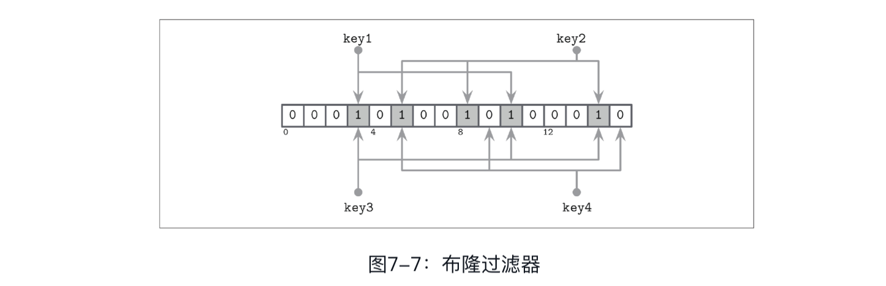

现在，我们尝试检查key3是否存在于集合中，用哈希函数生成3、10和14。由于在添加key1和key2时所有三个位都被置位，所以我们会遇到这样一种情况，即布隆过滤器返回一个假阳性报告：key3从未被添加到那里，但所有被计算的位都被置位。但是，由于布隆过滤器只声明元素可能在表中，所以这个结果是可以接受的。

如果我们尝试查找key4并由哈希函数得到值5、9和15，那么我们会发现只有第5位被置位，而其他两位未置位。即使只有其中一位未置位，我们也可以肯定该元素从未被添加到过滤器中。

#### 7.3.3 跳表

有许多不同的数据结构用于在内存中保存有序数据，其中一种结构由于其简单性越来越受欢迎，它被称为跳表(skiplist)[PUGH90b]。从实现的角度来看，跳表并不比单链表复杂多少，而其概率复杂度保证与搜索树接近。

跳表不需要为插入和更新而旋转或者移动元素，而是使用概率性平衡。跳表通常不如内存B树那样缓存友好，因为跳表的节点很小，而且在内存中是随机分配的。有些实现通过使用松散链表(unrolled linked list)来对这种情况进行改进。

跳表由一系列高度不同的节点组成，构建了链接在一起的层次结构，允许跳过数据项的范围。每个节点拥有一个键，并且与链表中的节点不同，有些节点不止有一个后继节点。高度为h的节点与高度小于等于h的一个或多个前导节点所链接。最低层上的节点可以与任意高度的节点所链接。

节点高度由随机函数确定，并在插入时计算出来。具有相同高度的节点形成层。层数设有上限以避免无限增长，并且最大高度是基于该结构可以容纳的数据项的数量来选择的。每一层节点的数量相比上一层是以指数级减少的。

首先跟随最高层上的节点指针进行查找。搜索一旦遇到一个节点的键大于所搜索的键，就会先回到其前序节点，跟随其前序节点低一层的链接到达一个新的节点。换句话说，如果搜索的键大于当前节点键，则搜索会继续向前。如果搜索的键小于当前节点的键，则从前一个节点开始在低一层上继续搜索。递归地重复这个过程，直到找到所搜索的键或其前序节点。

例如，要在图7-8所示的跳表中搜索键7，可以这样做：

1. 跟随最高层上的指针，指向持有键10的节点。
2. 由于要搜索的键7小于10，所以跟随头节点上的低一层的指针，找到持有键5的节点。
3. 跟随该节点上的最高层指针，再次找到持有键10的节点。
4. 要搜索的键7小于10，回到节点5并跟随再下一层的指针，找到持有要搜索的键7的节点。

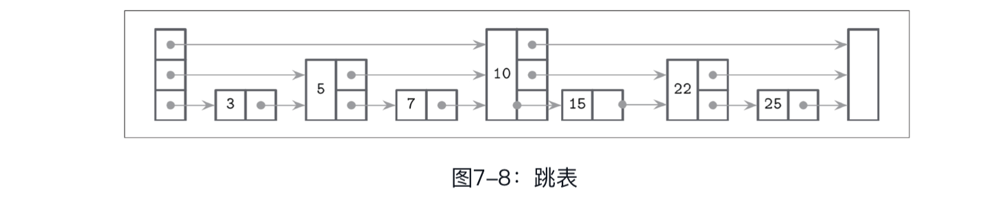

在插入过程中，使用上述算法找到插入点（持有键的节点或其前序节点），并且创建新节点。为了构建树状层次结构并保持平衡，使用基于概率分布生成的随机数来确定节点的高度。持有比新节点小的键的前序节点将被链接到新节点。其较高层的指针则保持不变。新创建的节点中的指针链接到每一层上相应的后继节点。

在删除过程中，被删除节点的前序指针被放置到相应层上的前置节点上。

我们可以通过实现一个线性化方案来创建一个跳表的并发版本，该方案使用一个额外的fully_linked标志来确定节点指针是否被完全更新。可以使用CAS[HERLIHY10]来设置此标志。因为必须在多个层上更新节点指针才能完全恢复跳表的结构，所以这个标志是必需的。

在具有非托管内存模型的语言中，可以使用引用计数或危险指针来确保当前引用的节点在被并发访问时不会被释放[RUSSEL12]。这种算法是无死锁的，因为节点总是从更高层开始访问。

Apache Cassandra将跳表用于二级索引memtable实现。WiredTiger在一些内存操作里使用了跳表。

#### 7.3.4 磁盘访问

由于大多数表的内容都驻留在磁盘上，并且存储设备通常允许按块访问数据，所以许多LSM树的实现依赖于页缓存，并通常将其用于磁盘访问和中间缓存。在5.1节中描述的许多技术，如页换出和固定，仍然适用于日志结构存储。

最显著的区别是内存中的内容是不可变的，因此不需要额外的锁或闩锁来控制并发访问。引用计数用于确保当前访问的页不会被从内存中换出，并且保证在压实过程中发出的请求在底层文件被移除之前均已经完成。

另一个区别是LSM树中的数据记录不一定是页对齐的，指针可以使用绝对偏移量而不是页ID来实现寻址。在图7-9中，你可以看到与磁盘块不对齐的记录。有些记录跨越页边界，需要在内存中加载多个页。

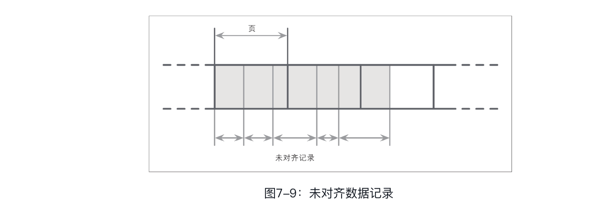

#### 7.3.5 压缩

我们已经在B树的上下文中讨论过压缩（参见4.6节）。类似的思想也适用于LSM树。这里的主要区别在于LSM树表是不可变的，并且通常是在一次请求中写入的。当按页压缩数据时，压缩后的页不是页对齐的，因为它们的大小比未压缩的小。

为了能够处理被压缩的页，我们需要在写入它们的内容时跟踪它们的地址边界。我们可以用零来填充压缩的页，使它们与页大小对齐，但这样我们就失去了压缩的好处。

为了使被压缩的页可寻址，我们需要一个间接层来存储偏移量和压缩页的大小。图7-10展示了压缩块和未压缩块之间的映射。压缩后的页一定比原始的小，否则压缩它们就没有意义了。

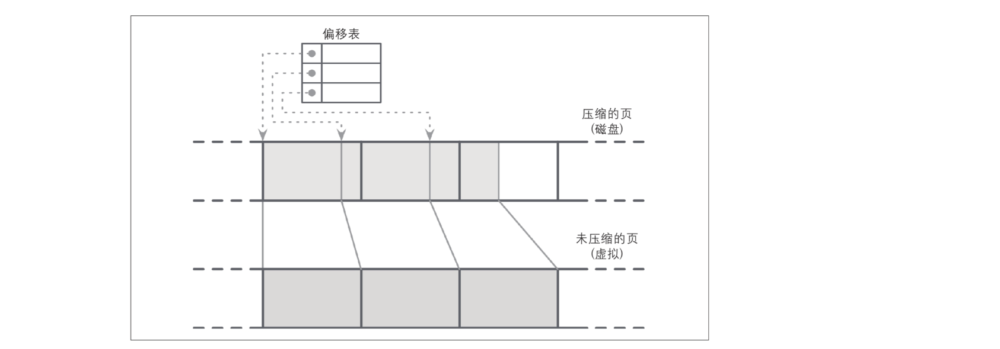

> 图7-10：读取压缩块（虚线表示从映射表到磁盘上压缩页偏移量的指针。未压缩的页一般位于页缓存中）

在压缩和刷盘期间，压缩的页被顺序地追加，并且压缩信息（原始未压缩的页偏移量和实际压缩的页偏移量）存储在单独的文件段中。在读取过程中，将压缩后的页偏移量及其大小查询出来，之后在内存中解压缩并物化。

### 7.4 无序LSM存储

到目前为止讨论过的大多数存储结构都是有序地存储数据的。可变和不可变的B树页、FD树中的有序段、LSM树中的SSTable都是按键顺序存储数据记录的。这些结构保留顺序的方式有所不同：B树的页是原地更新的，FD树的有序段是通过合并两个有序段来创建的，而SSTable通过在内存中缓冲和排序数据记录而创建。

在本节中，我们将讨论按随机顺序存储数据记录的结构。无序存储一般不需要单独的日志，并且允许我们按插入顺序存储数据记录以减少写入的开销。

#### 7.4.1 Bitcask

Bitcask是Riak中使用的存储引擎之一，它是一个无序的日志结构存储引擎[SHEEHY10b]。与此前讨论的日志结构存储实现不同，它不使用memtable进行缓冲，而是将数据记录直接存储在日志文件中。

为了使值可被搜索，Bitcask使用一种名为keydir（键目录）的数据结构，它保存与键相应的最新数据记录的引用。旧的数据记录可能仍然在磁盘中，但不会被keydir引用，并且它们会在压实过程中被垃圾收集。keydir被实现为内存中的哈希表，并且在启动期间必须从日志文件中重建。

在一次写入中，键和数据记录被顺序地追加到日志文件中，并且会在keydir中放入指向新写入的数据记录位置的指针。

读取时会查看keydir以定位要搜索的键，并跟随指向对应日志文件的指针以定位数据记录。由于在任何给定时刻都只能有一个值与keydir中的键相关联，所以点查询不必合并来自多个数据源的数据。

图7-11展示了Bitcask的数据文件中键和记录之间的映射。日志文件保存数据记录，而keydir则指向与每个键相关联的最新活动数据记录。数据文件中被遮蔽的记录（被后来的写入或删除所取代的记录）显示为灰色。

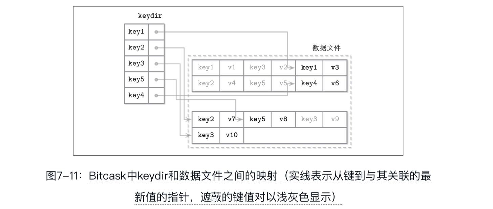

在压实过程中，所有日志文件的内容被顺序读取、合并、写入到新的位置，只保留活动数据记录，丢弃被遮蔽的数据。使用指向移动过的数据记录的新指针来更新keydir。

数据记录直接存储在日志文件中，因此不必维护单独的预写日志，这减少了空间开销和写放大。这种方法的缺点是它只支持单点查询，不允许范围扫描，因为数据项在keydir和数据文件中都是无序的。

这种方法的优点是简单，其拥有良好的单点查询性能。尽管存在多个版本的数据记录，但只有最新的一个版本由keydir处理。然而，这种方法必须将所有键保留在内存，并且在启动时需要重建keydir，这些限制可能使其无法支持某些用例。虽然其非常适合单点查询，但它不支持范围查询。

#### 7.4.2 WiscKey

范围查询对于许多应用程序都很重要，如果有一种存储结构既有无序存储的写入和空间优势，同时还支持执行范围扫描就好了。

WiscKey[LU16]通过在LSM树中保存键排序并在称为vLog（值日志）的无序仅追加文件中保存数据记录，来将排序与垃圾收集解耦。这种方法可以解决讨论Bitcask时提到的两个问题：需要将所有键保留在内存中，以及需要在启动时重新构建哈希表。

图7-12展示了WiscKey的关键组件，以及键和日志文件之间的映射。vLog文件保存无序数据记录。键存储在排序的LSM树中，指向日志文件中最新的数据记录。

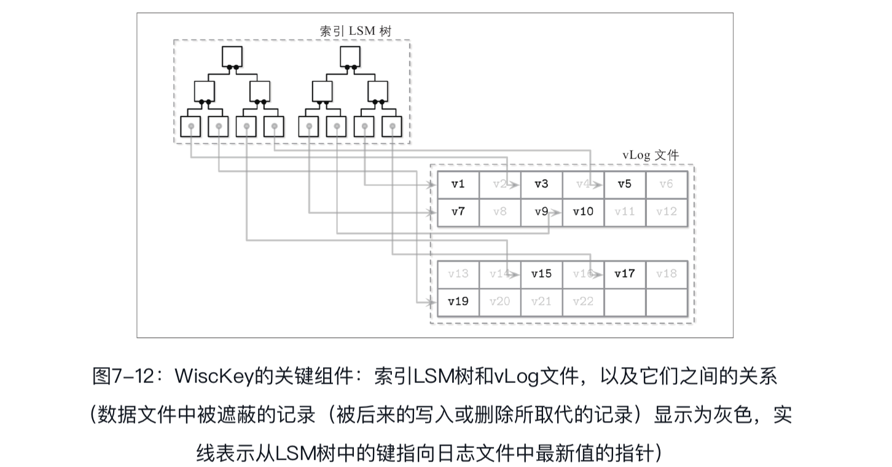

由于键通常比与其相关联的数据记录小得多，所以压实它们的效率要高得多。这种方法对于更新和删除较少的场景特别有用，在这种情况下，垃圾收集不会释放太多的磁盘空间。

这里的主要挑战是，由于vLog数据是未排序的，所以范围扫描需要随机I/O。WiscKey在范围扫描时使用固态硬盘的内部并行性来并行预取数据块，以减少随机I/O的开销。在数据块传输方面，其成本仍然很高：在范围扫描期间，要获取一条的数据记录，必须读取该数据记录所在的整个页。

在压实过程中，vLog文件的内容被顺序读取，并在合并后写入新的位置。指针（键LSM树中的值）被更新以指向这些新位置。为了避免扫描整个vLog的内容，WiscKey使用头部(head)和尾部(tail)指针持有有关vLog段的信息，这些vLog段中仍保留着存活的键。

由于vLog中的数据未排序，并且不包含存活信息，所以必须扫描键树以查找哪些值仍然是存活的。在垃圾收集期间执行这些检查引入了额外的复杂度：传统的LSM树可以在压实期间直接解析文件内容，而无须处理键索引。

### 7.5 LSM树中的并发

LSM树中的并发挑战主要与切换表视图（在刷写和压缩过程中更改的内存驻留表和磁盘驻留表的集合）和日志同步有关。memtable通常也是并发访问的（除了ScyllaDB这样的核心分区存储），但是并发内存数据结构不在本书的讨论范围之内。

在刷写期间，必须遵循以下规则：

-  新的memtable必须对读写可用。
- 旧的（正在刷写的）memtable必须对读保持可见。
- 正在刷写的memtable必须写到磁盘上。
- 丢弃已经刷写的memtable与创建刷写磁盘驻留表这两个操作必须被原子地执行。
- 预写日志中，记录之前曾应用于被刷写memtable的操作的日志段必须被丢弃。

例如，Apache Cassandra通过使用操作顺序屏障来解决这些问题：在memtable刷写之前，所有已经接受的写操作都必须等待。这样，刷写进程（作为消耗者）就知道哪些其他进程（作为生产者）依赖于它。

更一般地，我们有以下同步点：

- **memtable切换**: 在此之后，所有的写操作都去到新的memtable，使其成为主memtable，而旧的memtable仍可用于读操作。
- **刷写完成**: 在表视图中用刷写完的磁盘驻留表来替换旧的memtable。
- **预写日志截断**: 丢弃持有与被刷写memtable相关联的记录的日志段。

这些操作隐含着严苛的正确性要求。继续写入旧的memtable可能导致数据丢失（例如，如果写入已被刷写的memtable段）。类似地，在驻留磁盘的对应部分准备就绪之前，如果旧的memtable不提供读取，则将导致读取到不完整的结果。

在压实期间，表视图也会更改，但这里的过程稍微简单一些：旧的磁盘驻留表被丢弃，而被压实的版本则被添加进来。旧表必须保持可访问性，直到新表完全写入并准备好代替它进行读操作。同一个表参与多个并行压实的情况也必须避免。

在B树中，日志截断必须与从页缓存中刷写脏页相协调，以保证持久性。在LSM树中，我们有一个类似的要求：写入操作在memtable中被缓冲，并且它们的内容在完全刷盘之前是不具备持久性的，因此日志截断必须与memtable刷盘相协调。刷盘一旦完成，日志管理器就会得到最新的已刷写日志段的信息，因此可以安全地丢弃其中的内容。

不将日志截断与刷盘同步也会导致数据丢失：如果在刷盘完成之前丢弃了日志段，并且在此时节点崩溃，那么这些日志内容将不会被重放，从而导致该段的数据也不会被恢复。

### 7.6 日志堆叠

许多现代文件系统都使用日志结构：它们在内存段中缓冲写操作，并在缓冲满时以仅追加方式将内容刷写到磁盘上。固态硬盘也使用日志结构存储，以处理小的随机写入、最小化写入开销、均衡磨损以及延长设备寿命。

随着固态硬盘变得更经济，日志结构存储(Log-Structured Storage，LSS)系统开始流行。LSM树和固态硬盘是一个很好的搭配，因为序列化的工作负载和仅追加写入有助于减少原地更新带来的放大，而原地更新会对固态硬盘的性能产生负面影响。

如果将多个日志结构系统堆叠在一起，那么我们可能会遇到几个使用LSS要试图解决的问题，包括写放大、碎片化和糟糕的性能。至少，在开发应用程序时，我们需要牢记固态硬盘闪存转换层和文件系统[YANG14]。

#### 7.6.1 闪存转换层

在固态硬盘中使用日志结构映射层是由两个因素驱动的：1）小型随机写入必须在物理页中一起被批处理；2）固态硬盘是通过使用编程/擦除周期(program/erasecycle)来工作的。只能对先前擦除过的页进行写操作意味着非空页（未被擦除的页）不能被编程（换句话说，写入）。

单个页不能被擦除，只有块中的页组（通常拥有64～512个页）才能被一起擦除。图7-13展示了一个示意图，其中页被分组成多个块。闪存转换层(FTL)将逻辑页地址转换到它们的物理位置，并跟踪页的状态（存活、丢弃或空）。当FTL耗尽空闲页时，它不得不执行垃圾收集并擦除丢弃的页。

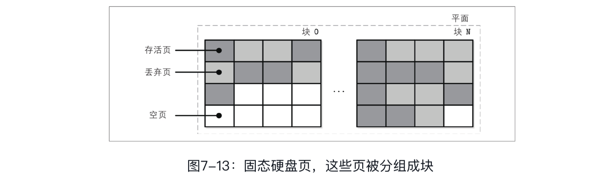

不能保证数据块内所有即将被擦除的页都是被丢弃的。在擦除数据块之前，FTL必须将它里面的存活页转移到一个包含空页的数据块中。图7-14展示了将存活页从一个数据块转移到新数据块的过程。

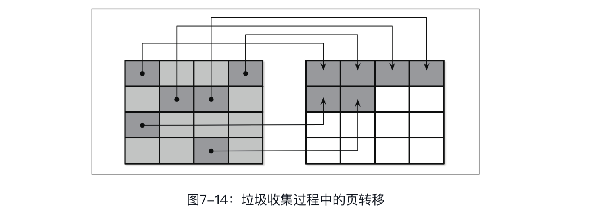

当所有的存活页被转移后，数据块便可以被安全地擦除，其空闲页就可以用于写操 作。由于FTL知道页状态和状态转换，并且拥有所有必要的信息，所以它还负责固态硬盘的磨损均衡。

> 磨损均衡将负载均匀地分布在介质上，从而避免热点。在热点上的编程/擦除周期数高，因而会导致数据块过早失效。这是必需的，因为闪存内存单元只能承受有限数量的编程–擦除周期，均匀地使用内存单元有助于延长器件的寿命。

总结起来，在固态硬盘上使用日志结构存储的动机是将小的随机写入缓冲在一起进行批处理以摊销I/O成本，这通常会减少操作的数量，进而减少触发垃圾收集的次数。

#### 7.6.2 文件系统日志记录

在此之上，许多文件系统也使用日志记录技术进行写缓冲，以减少写放大，并以最优化的方式使用底层硬件。

日志堆叠(log stacking)以几种不同的方式体现。首先，每一层都必须进行该层自己的信息记录，而且最常见的情况是，底层日志不会暴露必需的信息给上层，从而避免重复工作。

图7-15展示了较高层的日志（例如应用程序）和较低层的日志（例如文件系统）之间的映射，其导致了冗余的日志记录和不同的垃圾收集模式[YANG14]。未对齐的段写入可能会使情况变得更糟，因为丢弃较高层的日志段可能会导致相邻段部分的碎片化和移动。

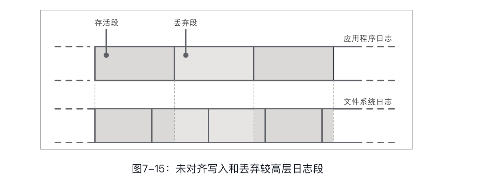

由于各层之间不会沟通与LSS相关的调度（例如，丢弃或重新定位段），所以低层子系统可能对丢弃的数据或即将丢弃的数据执行冗余操作。同样，由于没有单一的标准段大小，所以可能会出现未对齐的高层段占据多个低层段的情况。所有这些开销都是可以减少或完全避免的。

即使我们说日志结构存储都是关于顺序I/O的，我们也必须记住数据库系统可能有多个写入流（例如，日志写操作与数据记录写操作并行）[YANG14]。当在硬件层上考虑时，交错的顺序写入流可能没有转换成相同的顺序模式：块不一定会按写入顺序放置。图7-16展示了在时间上重叠的多个流，写入记录的大小与底层硬件页大小不对齐。

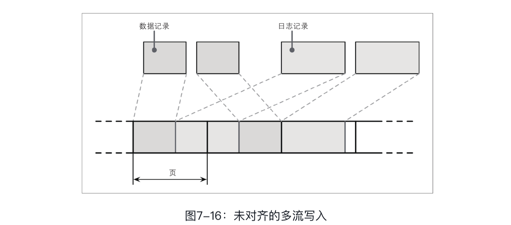

这就导致了碎片化，而这则是我们想避免的。为了减少交错，一些数据库厂商建议将日志保存在单独的设备上，以隔离工作负载，并能够独立地考虑它们的性能和访问模式。然而，更重要的是保持分区与底层硬件的对齐[INTEL14]，并保持写入与页大小的对齐[KIM12]。

### 7.7 LLAMA与精心堆叠

在6.5节中，我们讨论了B树的一个不可变版本，称为Bw树。Bw树是构建在无闩锁、日志结构、访问方法感知(Latch-free，Log-structured，Access-MethodAware，LLAMA)之上的存储子系统。这种分层使得Bw树可以动态地增长和收缩，同时使树的垃圾收集和页管理是透明的。这里，我们最感兴趣的是访问方法感知部分，它展示了软件层之间协调带来的好处。

回顾一下，一个Bw树的逻辑节点由物理增量节点的链表，即一个从最新节点到最旧节点的更新链所组成，这个链表以基节点结束。逻辑节点使用内存中的映射表链接，该表指向磁盘上最新更新的位置。键和值被添加到逻辑节点或从逻辑节点中移除，但是它们的物理表示保持不变。

日志结构将缓冲节点更新（增量节点）存储到4MB大小的刷写缓冲区中。页一旦被填满，就会被刷写到磁盘上。垃圾收集会周期性地回收未使用的增量节点和基节点所占用的空间，并移动存活的节点以释放碎片化的页。

在没有访问方法感知的情况下，交替产生的属于不同逻辑节点的增量节点会按照插入顺序被写入。LLAMA中的Bw树感知可以将几个增量节点合并到单一的连续物理位置。如果增量节点中的两个更新相互抵消（例如，一个插入后面接着一个删 除），则也可以执行它们的逻辑合并，并且可以只持久化后面的删除操作。

LSS垃圾收集还会负责合并逻辑Bw树节点的内容。这意味着垃圾收集不仅可以回收可用空间，而且可以显著减少物理节点的碎片。如果垃圾收集只是连续重写了几个增量节点，则它们仍将占用相同数量的空间，并且读取者还需要执行将增量更新应用到基节点的工作。同时，如果较高层的系统合并了节点并将它们连续地写入新位置，则LSS仍然不得不对旧版本进行垃圾收集。

通过了解Bw树的语义，可以将几个增量节点重写为单个基节点，其中所有增量都已在垃圾收集期间进行了应用。这减少了用于表示这个Bw树节点所需的总空间和读取页所需的延迟，同时回收了被丢弃的页所占用的空间。

如果仔细考虑，那么堆叠可以产生许多好处。没有必要总是建造紧密耦合的单层结构。好的API和对外公开正确的信息可以显著提高效率。

**开放通道固态硬盘**

堆叠软件层的另一种选择是跳过所有间接层而直接使用硬件。例如，直接面向开放通道固态硬盘进行开发，可以避免使用文件系统和闪存转换层。这样，我们就可以避免至少两层日志，并且可以更好地控制磨损均衡、垃圾收集、数据分布和调度。使用这种方法的实现之一是开放通道固态硬盘上基于LSM树的KV存储(LSM Tree-based KV Store on Open-Channel SSD，LOCS)[ZHANG13]。使用开放通道固态硬盘的另一个例子是LightNVM，它是在Linux内核中实现的[BJØRLING17]。

闪存转换层(FTL)通常处理数据分布、垃圾收集和页移动。开放通道固态硬盘越过FTL直接暴露其内部信息、驱动器管理和I/O调度。虽然从开发人员的角度来看需要关注更多的细节，但这种方法可能会带来显著的性能改进。你可以使用O_DIRECT标志来绕过内核页缓存，这将提供更好的控制，但需要手动的页管理。

软件定义闪存(Software Defined Flash，SDF)[OUYANG14]是一种软硬件协同设计的开放通道固态硬盘系统，它开放了一种考虑固态硬盘特性的非对称I/O接口。SDF的读写单元的大小不同，并且写单元大小对应于擦除单元大小（数据块），这大大降低了写放大。这种设置对于日志结构存储非常理想，因为只有一个软件层执行垃圾收集和转移页。此外，开发人员可以利用固态硬盘的内部并行性，因为SDF中的每个通道都作为一个单独的块设备被暴露出来，这可以用来进一步提高性能。

将复杂度隐藏在一个简单的API后面听起来可能很吸引人，但是在软件层具有不同语义的情况下可能会引起一些复杂问题。暴露一些下层系统的内部情况可能有利于更好地进行集成。

