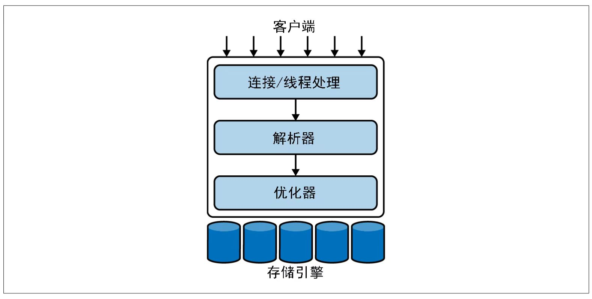
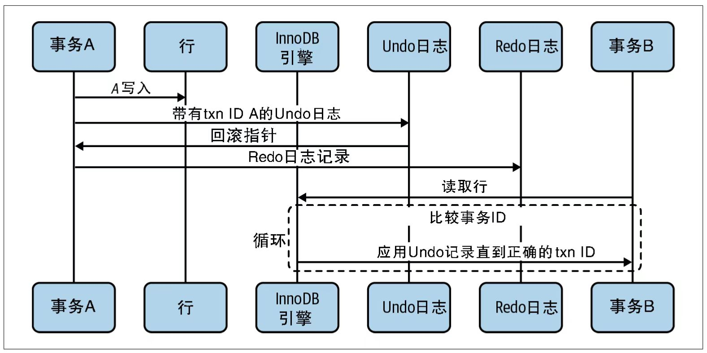

# 第1章　MySQL架构

## MySQL的逻辑架构

> MySQL的逻辑架构图



最上层的客户端所包含的服务并不是MySQL独有的，大多数基于网络的客户端/服务器工具或服务器都有类似的服务，包括连接处理、身份验证、确保安全性等。

第二层是比较有意思的部分。大多数MySQL的核心功能都在这一层，包括查询解析、分析、优化、以及所有的内置函数（例如，日期、时间、数学和加密函数），所有跨存储引擎的功能也都在这一层实现：存储过程、触发器、视图等。

第三层是存储引擎层。存储引擎负责MySQL中数据的存储和提取。和GNU/Linux下的各种文件系统一样，每种存储引擎都有其优势和劣势。服务器通过存储引擎API进行通信。这些API屏蔽了不同存储引擎之间的差异，使得它们对上面的查询层基本上是透明的。存储引擎层还包含几十个底层函数，用于执行诸如“开始一个事务”或者“根据主键提取一行记录”等操作。但存储引擎不会去解析SQL，不同存储引擎之间也不会相互通信，而只是简单地响应服务器的请求。

### 连接管理与安全性

默认情况下，每个客户端连接都会在服务器进程中拥有一个线程，该连接的查询只会在这个单独的线程中执行，该线程驻留在一个内核或者CPU上。服务器维护了一个缓存区，用于存放已就绪的线程，因此不需要为每个新的连接创建或者销毁线程。

当客户端（应用）连接到MySQL服务器时，服务器需要对其进行身份验证。身份验证基于用户名、发起的主机名和密码。如果以跨传输层安全(TLS)的方式连接，还可以使用X.509证书认证。客户端连接成功后，服务器会继续验证该客户端是否具有其发出的每个查询的权限。

### 优化与执行

MySQL解析查询以创建内部数据结构（解析树），然后对其进行各种优化，包括重写查询、决定表的读取顺序，以及选择合适的索引等。用户可以通过特殊关键字向优化器传递提示，从而影响优化器的决策过程。

优化器并不关心表使用的是什么存储引擎，但存储引擎对于查询优化是有影响的。优化器会向存储引擎询问它的一些功能、某个具体操作的成本，以及表数据的统计信息。

在旧版本中，MySQL可以使用内部查询缓存(query cache)来查看是否可以直接提供结果。但是，随着并发性的增加，查询缓存成为一个让人诟病的瓶颈。从MySQL 5.7.20版本开始，查询缓存已经被官方标注为被弃用的特性，并在8.0版本中被完全移除。尽管查询缓存不再是MySQL服务器的核心部分，但缓存被频繁请求的结果集依然是一个很好的实践。在本书的范围之外，一个流行的设计模式是在memcached或Redis中缓存数据。

## 并发控制

### 读写锁

并发控制这一经典问题的解决方案相当简单。处理并发读/写访问的系统通常实现一个由两种锁类型组成的锁系统。这两种锁通常被称为**共享锁(shared lock)**和**排他锁(exclusive lock)**，也叫**读锁(read lock)**和**写锁(write lock)**。

锁的概念可以如下描述：资源上的读锁是共享的，或者说是相互不阻塞的。多个客户端可以同时读取同一个资源而互不干扰。写锁则是排他的，也就是说，一个写锁既会阻塞读锁也会阻塞其他的写锁，这是出于安全策略的考虑，只有这样才能确保在特定的时间点只有一个客户端能执行写入，并防止其他客户端读取正在写入的资源。

在实际的数据库系统中，每时每刻都在发生锁定：当某个客户端在修改某一部分数据时，MySQL会通过锁定防止其他客户端读取同一数据。如果数据库服务器以可接受的方式执行，锁的管理速度足够快，那么不会引起客户端的感知。

### 锁的粒度

一种提高共享资源并发性的方式就是让锁定对象更有选择性。尽量只锁定包含需要修改的部分数据，而不是所有的资源。更理想的方式是，只对需要修改的数据片段进行精确的锁定。任何时候，让锁定的数据量最小化，理论上就能保证在给定资源上同时进行更改操作，只要被修改的数据彼此不冲突即可。

问题是加锁也需要消耗资源。锁的各种操作，包括获取锁、检查锁是否空闲、释放锁等，都会增加系统的开销。如果系统花费大量的时间来管理锁，而不是存取数据，那么系统的性能可能会受影响。

#### 表锁

表锁(table lock)是MySQL中最基本也是开销最小的锁策略。它会锁定整张表。当客户端想对表进行写操作（插入、删除、更新等）时，需要先获得一个写锁，这会阻塞其他客户端对该表的所有读写操作。只有没有人执行写操作时，其他读取的客户端才能获得读锁，读锁之间不会相互阻塞。

表锁有一些变体，可以在特定情况下提高性能。例如，READ LOCAL表锁支持某些类型的并发写操作。写锁队列和读锁队列是分开的，但写锁队列的优先级绝对高于读队列。

#### 行级锁

使用行级锁(row lock)可以最大程度地支持并发处理（也带来了最大的锁开销）。行级锁等同于锁定电子表格中的某一行。这种策略允许多人同时编辑不同的行，而不会阻塞彼此。这使得服务器可以执行更多的并发写操作，带来的代价则是需要承担更多开销，以跟踪谁拥有这些行级锁、已经锁定了多长时间、行级锁的类型，以及何时该清理不再需要的行级锁。

行级锁是在存储引擎而不是服务器中实现的。服务器通常[插图]不清楚存储引擎中锁的实现方式。

## 事务

事务就是一组SQL语句，作为一个工作单元以原子方式进行处理。如果数据库引擎能够成功地对数据库应用整组语句，那么就执行该组语句。如果其中有任何一条语句因为崩溃或其他原因无法执行，那么整组语句都不执行。也就是说，作为事务的一组语句，要么全部执行成功，要么全部执行失败。

在这一系列操作中，有更多的失败可能性。连接可能会断开、会超时，甚至数据库服务器在操作执行过程中会崩溃。这就是为什么存在高度复杂且缓慢的两阶段提交系统的典型原因：为了应对各种失败场景。

除非系统通过严格的ACID测试，否则空谈事务的概念是不够的。**ACID代表原子性(atomicity)、一致性(consistency)、隔离性(isolation)和持久性(durability)**。一个确保数据安全的事务处理系统，必须满足这些密切相关的标准。

**原子性(atomicity)**

一个事务必须被视为一个不可分割的工作单元，整个事务中的所有操作要么全部提交成功，要么全部失败回滚。对于一个事务来说，不可能只执行其中的一部分操作，这就是事务的原子性。

**一致性(consistency)**

 数据库总是从一个一致性状态转换到下一个一致性状态。如果事务最终没有提交，该事务所做的任何修改都不会被保存到数据库中。

**隔离性(isolation)**

通常来说，一个事务所做的修改在最终提交以前，对其他事务是不可见的，这就是隔离性带来的结果。后面我们讨论隔离级别(isolation level)的时候，会发现为什么我们要说“通常来说”是不可见的。

**持久性(durability)**

一旦提交，事务所做的修改就会被永久保存到数据库中。此时即使系统崩溃，数据也不会丢失。持久性是一个有点模糊的概念，实际上持久性也分很多不同的级别。有些持久性策略能够提供非常强的安全保障，而有些则未必。而且不可能有100%的持久性保障（如果数据库本身就能做到真正的持久性，那么备份又怎么能增加持久性呢？）。

ACID事务和InnoDB引擎提供的保证是MySQL中最强大、最成熟的特性之一。虽然它们在吞吐量方面做了一定的权衡，但如果应用得当，就可以避免在应用层实现大量复杂逻辑。

### 隔离级别

隔离性在实际操作中比看起来复杂得多。ANSI SQL标准定义了4种隔离级别。这个通用标准的目标是定义在事务内外可见和不可见的更改的规则。较低的隔离级别通常允许更高的并发性，并且开销也更低。

**READ UNCOMMITTED（未提交读）**

在READ UNCOMMITTED级别，在事务中可以查看其他事务中还没有提交的修改。这个隔离级别会导致很多问题，从性能上来说，READ UNCOMMITTED不会比其他级别好太多，却缺乏其他级别的很多好处，除非有非常必要的理由，在实际应用中一般很少使用。读取未提交的数据，也称为脏读(dirty read)。

**READ COMMITTED（提交读）**

大多数数据库系统的默认隔离级别是READ COMMITTED（但MySQL不是）。READ COMMITTED满足前面提到的隔离性的简单定义：一个事务可以看到其他事务在它开始之后提交的修改，但在该事务提交之前，其所做的任何修改对其他事务都是不可见的。这个级别仍然不可重复读(nonrepeatable read)，这意味着同一事务中两次执行相同语句，可能会看到不同的数据结果。

**REPEATABLE READ（可重复读）**

REPEATABLE READ解决了READ COMMITTED级别的不可重复读问题，保证了在同一个事务中多次读取相同行数据的结果是一样的。但是理论上，可重复读隔离级别还是无法解决另外一个幻读(phantom read)的问题。所谓幻读，指的是当某个事务在读取某个范围内的记录时，另外一个事务又在该范围内插入了新的记录，当之前的事务再次读取该范围的记录时，会产生幻行(phantom row)。InnoDB和XtraDB存储引擎通过多版本并发控制(MVCC，Multiversion Concurrency Control)解决了幻读的问题。

REPEATABLE READ是MySQL默认的事务隔离级别。

**SERIALIZABLE（可串行化）**

SERIALIZABLE是最高的隔离级别。该级别通过强制事务按序执行，使不同事务之间不可能产生冲突，从而解决了前面说的幻读问题。简单来说，SERIALIZABLE会在读取的每一行数据上都加锁，所以可能导致大量的超时和锁争用的问题。实际应用中很少用到这个隔离级别，除非需要严格确保数据安全且可以接受并发性能下降的结果。

>  ANSI SQL的隔离级别


### 死锁

死锁是指两个或多个事务相互持有和请求相同资源上的锁，产生了循环依赖。当多个事务试图以不同的顺序锁定资源时会导致死锁。当多个事务锁定相同的资源时，也可能会发生死锁。

为了解决这个问题，数据库系统实现了各种死锁检测和锁超时机制。更复杂的系统，比如InnoDB存储引擎，检测到循环依赖后会立即返回一个错误信息。这可能是一件好事——否则，死锁将表现为非常缓慢的查询。还有一种方式，当超过锁等待超时的时间限制后直接终止查询，这样做通常来说不太好。InnoDB目前处理死锁的方式是将持有最少行级排他锁的事务回滚（这是一种最容易回滚的近似算法）。

锁的行为和顺序是和存储引擎相关的。同样的一系列查询语句，有些存储引擎会产生死锁，有些则不会。死锁的产生有双重原因：有些是因为真正的数据冲突，这种情况通常很难避免，但有些则完全是由于存储引擎的实现方式导致的。

一旦发生死锁，如果不回滚其中一个事务（部分或全部），就无法打破死锁。对于事务型的系统，这是无法避免的，所以应用程序在设计时必须考虑如何处理死锁。大多数情况下只需要重新从头开始执行被回滚的事务即可，除非又遇到另一个死锁。

### 事务日志

事务日志有助于提高事务的效率。存储引擎只需要更改内存中的数据副本，而不用每次修改磁盘中的表，这会非常快。然后再把更改的记录写入事务日志中，事务日志会被持久化保存在硬盘上。因为事务日志采用的是追加写操作，是在硬盘中一小块区域内的顺序I/O，而不是需要写多个地方的随机I/O，所以写入事务日志是一种相对较快的操作。最后会有一个后台进程在某个时间去更新硬盘中的表。因此，大多数使用这种技术（**write-ahead logging，预写式日志）**的存储引擎修改数据最终需要写入磁盘两次。

如果修改操作已经写入事务日志，那么即使系统在数据本身写入硬盘之前发生崩溃，存储引擎仍可在重新启动时恢复更改。具体的恢复方法则因存储引擎而异。

### MySQL中的事物

存储引擎是驱动如何从硬盘中存储和检索数据的软件。这里描述的事务原语将基于InnoDB引擎中的事务。

#### 理解AUTOCOMMIT

默认情况下，单个INSERT、UPDATE或DELETE语句会被隐式包装在一个事务中并在执行成功后立即提交，这称为自动提交(AUTOCOMMIT)模式。通过禁用此模式，可以在事务中执行一系列语句，并在结束时执行COMMIT提交事务或ROLLBACK回滚事务。

在当前连接中，可以使用SET命令设置AUTOCOMMIT变量来启用或禁用自动提交模式。启用可以设置为1或者ON，禁用可以设置为0或者OFF。如果设置了AUTOCOMMIT=0，则当前连接总是会处于某个事务中，直到发出COMMIT或者ROLLBACK，然后MySQL会立即启动一个新的事务。此外，当启用AUTOCOMMIT时，也可以使用关键字BEGIN或者START TRANSACTION来开始一个多语句的事务。修改AUTOCOMMIT的值对非事务型的表不会有任何影响，这些表没有COMMIT或者ROLLBACK的概念。

还有一些命令，当在活动的事务中发出时，会导致MySQL在事务的所有语句执行完毕前提交当前事务。这些通常是进行重大更改的DDL命令，如ALTER TABLE，但LOCK TABLES和其他一些语句也具有同样的效果。有关会导致自动提交事务的完整命令列表，请查看对应版本的官方文档。

MySQL可以通过执行SET TRANSACTION ISOLATION LEVEL命令来设置隔离级别。新的隔离级别会在下一个事务开始的时候生效。可以在配置文件中设置整个服务器的隔离级别，也可以只改变当前会话的隔离级别：

```mysql
SET SESSION TRANSACTION ISOLATION LEVEL READ COMMITTED;
```

建议最好在服务器级别设置最常用的隔离，并且只在显式情况下修改。MySQL可以识别所有4个ANSI标准的隔离级别，InnoDB也支持这些隔离级别。

#### 在事务中混合使用存储引擎

MySQL不在服务器层管理事务，事务是由下层的存储引擎实现的。所以在同一个事务中，混合使用多种存储引擎是不可靠的。

假设在事务中混合使用事务表和非事务表（例如，InnoDB和MyISAM表），如果一切顺利，事务将正常工作。如果需要回滚，则无法撤销对非事务表的更改。这会使数据库处于不一致的状态，可能难以恢复，并使整个事务问题变得毫无意义。所以，为每张表选择合适的存储引擎，并不惜一切代价避免在应用中混合使用存储引擎是非常重要的。

在非事务表中执行事务相关操作的时候，MySQL通常不会发出提醒，也不会报错。有时候只有回滚的时候才会发出一个警告：某些非事务表中的变更无法回滚。但在大多数情况下，对非事务表的操作都不会有提示。

> 最好不要在应用程序中混合使用存储引擎。失败的事务可能导致不一致的结果，因为某些部分可以回滚，而其他部分不能回滚。

#### 隐式锁定和显式锁定

InnoDB使用**两阶段锁定协议(two-phase locking protocol)**。在事务执行期间，随时都可以获取锁，但锁只有在提交或回滚后才会释放，并且所有的锁会同时释放。前面描述的锁定机制都是隐式的。InnoDB会根据隔离级别自动处理锁。

另外，InnoDB还支持通过特定的语句进行显式锁定，这些语句不属于SQL规范：

```mysql
SELECT ... FOR SHARE
SELECT ... FOR UPDATE
```

> 这些锁定提示经常被滥用，应当尽量避免使用。
> SELECT ... FOR SHARE 是MySQL 8.0的新语句，取代了以前版本的SELECT ... LOCK IN SHARE MODE。

MySQL还支持LOCK TABLES和UNLOCK TABLES命令，这些命令在服务器级别而不在存储引擎中实现。如果需要事务，应该使用支持事务的存储引擎。因为InnoDB支持行级锁，所以没必要使用LOCK TABLES。

> LOCK TABLES命令和事务之间的交互非常复杂，并且在一些服务器版本中存在意想不到的行为。因此，建议除了在禁用AUTOCOMMIT的事务中可以使用之外，其他任何时候都不要显式地执行LOCK TABLES，不管使用的是什么存储引擎。

## 多版本并发控制

MySQL的大多数事务型存储引擎使用的都不是简单的行级锁机制。它们会将行级锁和可以提高并发性能的多版本并发控制(MVCC)技术结合使用。不仅是MySQL，包括Oracle、PostgreSQL以及其他一些数据库系统也都使用了MVCC，但各自的实现机制不尽相同，因为MVCC如何工作没有统一的标准。

可以认为MVCC是行级锁的一个变种，但是它在很多情况下避免了加锁操作，因此开销更低。根据其实现方式，不仅实现了非阻塞的读操作，写操作也只锁定必要的行。

MVCC的工作原理是使用数据在某个时间点的快照来实现的。这意味着，无论事务运行多长时间，都可以看到数据的一致视图，也意味着不同的事务可以在同一时间看到同一张表中的不同数据！

每个存储引擎实现MVCC的方式都不同。其中一些变体包括乐观并发控制和悲观并发控制。我们可以通过图1-2所示的序列图解释InnoDB的行为，以此来展示MVCC的一种实现方式。

> 跨不同事务处理同一行多个版本的序列图



InnoDB通过为每个事务在启动时分配一个事务ID来实现MVCC。该ID在事务首次读取任何数据时分配。在该事务中修改记录时，将向Undo日志写入一条说明如何恢复该更改的Undo记录，并且事务的回滚指针指向该Undo日志记录。这就是事务如何在需要时执行回滚的方法。

当不同的会话读取聚簇主键索引记录时，InnoDB会将该记录的事务ID与该会话的读取视图进行比较。如果当前状态下的记录不应可见（更改它的事务尚未提交），那么Undo日志记录将被跟踪并应用，直到会话达到一个符合可见条件的事务ID。这个过程可以一直循环到完全删除这一行的Undo记录，然后向读取视图发出这一行不存在的信号。

事务中的记录可以通过在记录的“info flags”中设置“deleted”位来删除。这在Undo日志中也被作为“删除标记”进行跟踪。

值得注意的是，所有Undo日志写入也都会写入Redo日志，因为Undo日志写入是服务器崩溃恢复过程的一部分，并且是事务性的。这些Redo日志和Undo日志的大小也是高并发事务工作机制中的重要影响因素。

在记录中保留这些额外信息带来的结果是，大多数读取查询都不再需要获取锁。它们只是尽可能快地读取数据，确保仅查询符合条件的行即可。缺点是存储引擎必须在每一行中存储更多的数据，在检查行时需要做更多的工作，并处理一些额外的内部操作。

MVCC仅适用于REPEATABLE READ和READ COMMITTED隔离级别。READ UNCOMMITTED与MVCC不兼容，是因为查询不会读取适合其事务版本的行版本，而是不管怎样都读最新版本。SERIALIZABLE与MVCC也不兼容，是因为读取会锁定它们返回的每一行。

## 复制

MySQL被设计用于在任何给定时间只在一个节点上接受写操作。这在管理一致性方面具有优势，但在需要将数据写入多台服务器或多个地区时，会导致需要做出取舍。MySQL提供了一种原生方式来将一个节点执行的写操作分发到其他节点，这被称为复制。在MySQL中，源节点为每个副本节点提供一个线程，该线程作为复制客户端登录，当写入发生时会被唤醒，发送新数据。通常将它称为一主多副的多个MySQL服务器拓扑树。

> MySQL服务器复制拓扑的简化视图


对于在生产环境中运行的任何数据，都应该使用复制并至少有三个以上的副本，理想情况下应该分布在不同的地区（在云托管环境中，称为region）用于灾难恢复计划。

## 数据文件结构

在8.0版本中，MySQL将表的元数据重新设计为一种数据字典，包含在表的.ibd文件中。这使得表结构上的信息支持事务和原子级数据定义更改。在操作期间，我们不再仅仅依赖information_schema来检索表定义和元数据，而是引入了字典对象缓存，这是一种基于最近最少使用(LRU)的内存缓存，包括分区定义、表定义、存储程序定义、字符集和排序信息。服务器访问表的元数据的方式的这一重大变化减少了I/O，非常高效。特别是当前访问最活跃的那些表，在缓存中最常出现。每个表的.ibd和.frm文件被替换为已经被序列化的字典信息(.sdi)。

## InnoDB引擎

InnoDB是MySQL的默认事务型存储引擎，也是最重要、使用最广泛的引擎。它是为处理大量短期事务而设计的，这些事务通常是正常提交的，很少会被回滚。InnoDB的性能和自动崩溃恢复特性，使得它在非事务型存储需求中也很流行。

InnoDB是MySQL默认的通用存储引擎。默认情况下，InnoDB将数据存储在一系列的数据文件中，这些文件统被称为表空间(tablespace)。表空间本质上是一个由InnoDB自己管理的黑盒。

InnoDB使用MVCC来实现高并发性，并实现了所有4个SQL标准隔离级别。InnoDB默认为**REPEATABLE READ隔离级别**，并且通过**间隙锁(next-key locking)**策略来防止在这个隔离级别上的幻读：InnoDB不只锁定在查询中涉及的行，还会对索引结构中的间隙进行锁定，以防止幻行被插入。

InnoDB表是基于聚簇索引构建的。InnoDB的索引结构与MySQL其他大部分存储引擎有很大的不同。聚簇索引提供了非常快速的主键查找。但是，因为二级索引（secondary index，非主键索引）需要包含主键列，如果主键较大，则其他索引也会很大。如果表中的索引较多，主键应当尽量小。

InnoDB内部做了很多优化。其中包括从磁盘预取数据的可预测性预读、能够自动在内存中构建哈希索引以进行快速查找的自适应哈希索引(adaptive hash index)，以及用于加速插入操作的插入缓冲区(insert buffer)。

InnoDB的行为是非常复杂的，强烈建议阅读MySQL官方手册中“InnoDB锁定和事务模型”（参见链接5）一节。由于其MVCC架构，在使用InnoDB构建应用程序之前，有许多微妙之处需要注意。存储引擎要为所有用户甚至包括修改数据的用户维持一致性的视图，这是非常复杂的工作。

作为事务型存储引擎，InnoDB可以通过一些机制和工具支持真正的在线“热”备份，包括Oracle专有的MySQL Enterprise Backup和开源的Percona XtraBackup。

从MySQL 5.6开始，InnoDB引入了在线DDL，它最初只支持有限的使用场景，但在5.7和8.0版本中进行了扩充。就地(in-place)更改schema的机制允许在不使用完整表锁和外部工具的情况下进行特定的表更改操作，这大大提高了MySQL InnoDB表的可操作性。

### JSON文档支持

JSON类型在5.7版本被首次引入InnoDB，它实现了JSON文档的自动验证，并优化了存储以允许快速读取，这是对旧版本只能使用BLOB类型来处理JSON文档作为折中的重大改进。除了支持新的数据类型，InnoDB还引入了SQL函数来支持在JSON文档上的丰富操作。MySQL 8.0.7的进一步改进增加了在JSON数组上定义多值索引的能力。将常用访问模式匹配到可以映射JSON文档值的函数这一特性可以进一步加快对JSON类型的读取访问查询。

### 数据字典的变化

MySQL 8.0的另一个主要变化是删除了基于文件的表元数据存储，并将其转移到使用InnoDB表存储的数据字典中。这给所有类似修改表结构这样的操作带来了InnoDB的崩溃恢复事务的好处。

这一更改虽然大大改进了MySQL中数据定义的管理，但也需要我们对MySQL服务器的操作方式做出很大改变。最显著的变化是，以前依赖于表元数据文件的备份程序，现在必须查询新的数据字典以提取表定义。

### 原子DDL

最后，MySQL 8.0引入了原子数据定义更改。这意味着数据定义语句现在要么全部成功完成，要么全部失败回滚。这是通过创建DDL特定的Undo日志和Redo日志来实现的，InnoDB便依赖这两种日志来跟踪变更——这是InnoDB经过验证的设计，已经扩展到MySQL服务器的操作中。

## 小结

MySQL拥有分层的架构，上层是服务器级别的服务和查询执行层，下层则是存储引擎。虽然有很多不同作用的插件API，但存储引擎API是最重要的。MySQL通过API来与存储引擎交互需要处理的数据行，理解了这一点，就掌握了MySQL服务器架构的基本原理。

在过去的几个主要版本中，MySQL主要的改进核心在于InnoDB的演进。表元数据、用户认证、身份鉴权这些内部统计信息的管理也已经调整为使用InnoDB表来实现，而在几年前，使用的都是MyISAM引擎。Oracle官方在InnoDB引擎上加大了投入，这使得MySQL有了一些重大改进，例如原子DDL，更完善的online DDL，更强大的崩溃恢复能力，以及更安全的部署操作。

