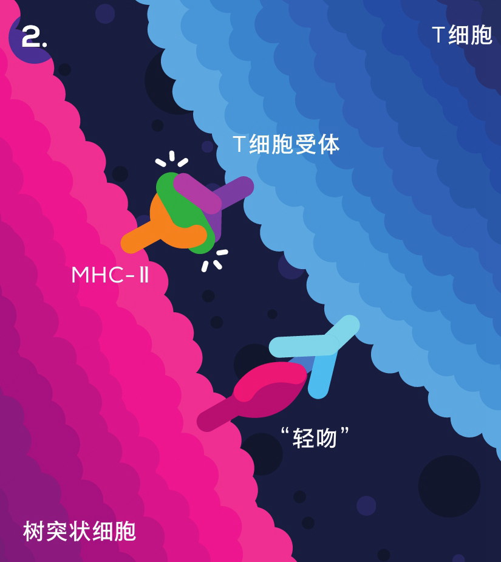
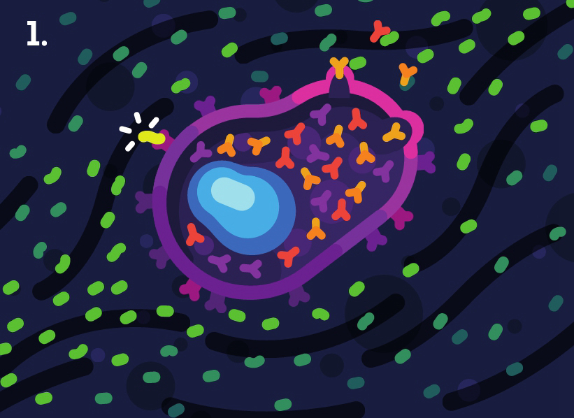
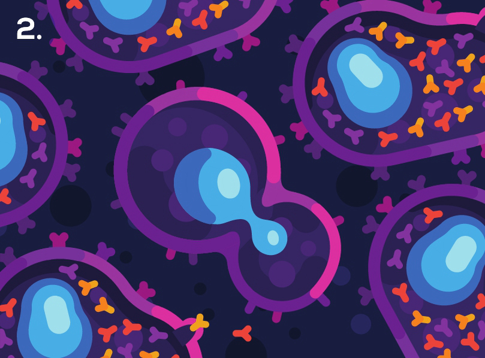

## 战斗细胞：人体免疫系统奇妙之旅

——[作者] 菲利普·德特玛

### 前言

1. 免疫系统本身就是造物的无上杰作，蕴藏着自然之美。它可不仅仅是让你不再咳嗽的工具，而是和体内几乎所有生命进程都交织在一起。不过，虽然免疫系统对维持生命至关重要，免疫缺陷或免疫亢进也可能是早逝的原因。
2. 生病让人恐慌不安，我也尝够了生病的苦。但是知道我的免疫细胞——我这不可或缺的一部分——正守卫着“我”这个存在，知道它们冲锋陷阵、英勇牺牲、疗愈并重建我所栖居的身体，总是会带给我极大的安慰。认识免疫系统让我的生活更优质、更有趣，也大大减轻了患病带来的不安。了解免疫系统能让我们正确地看待事物。
3. 在人类已知的生物系统中，除人脑外，就属免疫系统最复杂了。

### 第1部分 认识免疫系统

#### 1 免疫系统是什么？

1. 要是你因为每天都要早起帮孩子收拾好，或是买个汉堡半冷不热，就觉得生活不易，那原始的单细胞生命可以给你好好上一课。它们必须想办法把周围的化学物质转化成能为己所用的东西，同时获取生存必需的能量，而其中有些细胞就盯上了“捷径”。如果能偷别人的，干吗还要自己干呢？

2. 既然擅长“吸血”成了有效的生存技能，那么保护自己不被“吸”就也成了演化上的必需。接下来的29亿年里，微生物们凭借相似的招数，互相竞争厮杀。要是有时光机，能回到过去一睹此类战争的宏大场面，你其实多半会失望：除了潮湿的石头上有一些纤薄的细菌膜之外，什么都没有。在最初的几十亿年里，地球是个相当乏味的地方。直到生命形式的复杂程度发生了那一次最大的飞跃。

3. 几十亿年来，生活在微型世界中的它们，无论进入任何生态系统，都要为其中的空间和资源争斗，而对这些细菌及其他微小生物来说，还有比多细胞动物更好的生态系统吗？这个系统里，从头到脚都是免费的营养啊！所以从一开始，多细胞生命就面临着细胞入侵者和机体寄生者的威胁。

4. 从最微小的层面来说，细菌也有抵御病毒的方法，它们不可能乖乖就范。而在动物世界中，海绵这种已经存在了5亿多年的最古老、最简单的动物，就拥有可能是最原始的动物免疫反应：“体液免疫”（“体液/humor”一词来自古希腊语，这里可不是“幽默”）。体液免疫主要通过游离在细胞外体液中的微小蛋白来实现功能，杀伤、歼灭不该出现的外来微生物。这类防御非常有用，也非常成功，几乎所有现存的动物，包括我们人类，都有体液免疫。它没有被演化淘汰，而是变得举足轻重。原则上说，体液免疫在5亿年里都没怎么变。

5. 但体液免疫只是个开端。多细胞动物的优势之一是它擅长调动多种多样的特化细胞。因此，从演化上来看，动物很可能没用多久就发展出了专业的防御细胞，相应的免疫就叫“细胞［介导］免疫”。这种新型的免疫一开始就大获成功。连在蠕虫和昆虫的小小身体里，我们都发现了专门的免疫细胞卫士，它们能在小虫体内自由巡行，与入侵者正面交锋。沿着演化之树，越是向枝头探寻，免疫系统就变得越是精妙。而在最早的脊椎动物身上，我们就已经看到了重大的创新：出现了专门的免疫器官暨细胞的“训练场”，以及最为强大的免疫原理之一——能够识别特定的敌人，并快速制造大量的针对性武器实现精准打击，还要牢牢记住它们！

6. 在最核心的意义上，免疫系统就是区分自身和异物的工具。对方是否有恶意并不重要，只要不是享有自由通行证的贵客，就会遭受免疫系统的攻击和歼灭，因为它有可能造成威胁。对免疫系统来说，为任何“他者”冒险都不值得。没有它们的此种忠诚，我们可能活不了几天。可惜，免疫系统如果忠诚不足或忠诚过头，也会造成困扰甚至致人死亡，后面我们会谈到这些情况。

7. 区分自身和异物尽管是免疫功能的核心，但并不是它的目标。免疫系统的首要目标是维持“稳态”，即维持体内全部细胞及物质的平衡。

8. 健康的宝贵，只有在失去它时才最能体会。健康其实是一个抽象的概念，因为它描述的是没有病痛、不受限制的状态，不是“有”而是“无”。拥有健康的时候，你觉得一切正常，感觉良好。而一旦健康离你而去，哪怕只有几天，你都很难忽视人的脆弱和生命的稍纵即逝。疾病是生命中不可避免的事情。可能你比较幸运，迄今都还没有遭遇过病痛。但如果你或你的亲人曾不幸患病，你就会明白，对于美好生活而言，没有什么比健康的身体更重要。对免疫系统来说，健康就是稳态。尽管这场守护健康的战争终会不可避免地输掉，变成徒劳，但我们仍在努力夺取多一些岁月，哪怕只是几个小时。因为总体而言，生而为人是幸福的，我们都希望自己可以活得久一点。

9. 对微生物来说，你就是一套有待征服的生态系统。这片广袤无垠的土地资源丰富，适合繁殖，充满了机遇，是理想的栖居之地。当然，等我们最终死去时，它们还是会胜利的；没有了免疫系统的保护，大量疯狂的微生物组成的军团会大大加速尸体的分解过程。

10. 要担心的还不止这一大堆想要入侵的微生物，还包括可能误入歧途的身体本身，就是癌症。预防癌症是免疫系统的头等大事之一。事实上，在你读这几页书的时候，身体里可能就有早期癌细胞正在被免疫系统悄无声息地清除掉。

11. 还有过敏反应，它是指免疫系统对无害的物质产生了过激反应。“过敏性休克”就是一种严重的过敏反应，它凸显了免疫系统有多强大，一旦出错又多么可怕：疾病未必会马上置人于死地，而免疫系统带来的过敏性休克却能在几分钟内夺人性命。

12.  就和人类社会一样，如果你的身体不得不打仗，那它至少想要快速地结束战争，赢得干净利落，而不想经历长期的被占领或冲突，那只会耗尽资源，毁坏基础设施。

    所以，免疫系统肩负的是尽可能保卫健康的重任。哪怕我们最终会输，但在当下，认真、尽职地打好这场守卫战，对我们来说很重要。

    总结：区分自身和异物是免疫系统的核心，维持稳态是其目标，另外免疫系统还有许多种可能会出错

#### 2 守卫每一寸身体

1. 假如你小得就像一个细胞，那么人体对你来说就有15到20座珠穆朗玛峰摞在一起那么大。

2. 真正薄弱、易受感染的，其实是黏膜，它们分布在气管和肺、眼睑、口腔和鼻腔、胃肠道、生殖道和膀胱的内表面。

3. 生殖器官、鼻孔、耳朵都是朝外的开口，是通向身体内部更大的管道及其他洞穴系统的入口。这些部位是身体的边境，直接和外界接触。身体就被这些黏膜包绕着。在这些“体内的外部”表面，每天发生着上百万起外敌入侵。所以细胞可是有大片的领土需要守卫。对细胞来说，黏膜就像中欧或者美国中部对你那么辽阔。在边境修筑隔离墙是无济于事的，因为它们守卫的不光是边境线，而是整个表面！入侵者们可不会只攻击边境，而可能会乘降落伞空降。免疫细胞要守卫的是整片大陆，每一寸土地。

   人体就是一条管道。

#### 3 细胞是什么样的？

1. 细胞很微小，它们没有意识，没有感情，没有目标，没有自由意志，也没有主动决策。简而言之，细胞就像生物机器人，完全受更小的细胞构成部件所引导的生化反应驱动。

2. 书里常常把细胞画成一个空袋子，里面装着上述细胞器，这是在传递错误的印象；其实细胞内部拥挤喧闹，复杂繁忙——不妨看一眼你现在所处的房间。

   请想象这个房间堆得满满的。里面有数百万颗的沙粒和大米，几千只苹果和桃子，还有几十个大西瓜。细胞里面大概就像这样。这在现实中意味着什么？

3. 一个人体细胞内，有几千万个分子。其中一半是水分子，相当于上述房间中的沙子；以分子尺度看，水不再是液体，而变得像蜂蜜一样黏稠，它们使细胞内部有了一定黏稠度，好像软果胶一样，其他分子可以在里面自由移动。

   另一半主要是千百万的蛋白质。细胞功能和任务不同，含有的蛋白质也不同，种类有1千到1万种，相当于我们房间中的大米和小水果。而西瓜就是我们在教材示意图里看到的细胞器。因此细胞主要是蛋白质构成和填充的。

4. 蛋白质是由氨基酸链形成的。氨基酸这种微型有机构件有20种，把它们以无论什么顺序连成一串，就能得到蛋白质。这一原理能让生命构建出超级多不同种类的蛋白质。

5.  脱氧核糖核酸(DNA)，它含有对生命来说至关重要的长串信息序列。这是在说，DNA中约有1%的序列会指导蛋白质的合成，这些序列就是“基因”。其余DNA调控合成蛋白质的时机、种类、方式和数量。也就是说，蛋白质对生物来说很重要，所谓的生命编码基本上就是构建蛋白质的指导手册。

6. 这些微小的蛋白质拼图块会和细胞内的结构以复杂、繁多而又酷炫的方式相互作用。它们是怎么做到的呢？靠快速地移动。蛋白质如此微小、几无重量，它们的世界和我们的有本质区别，因此其运动方式在人类看来也会非常奇特。重力对它们这个尺度的东西不起太大作用，于是理论上，在室温下，一个蛋白质平均每秒能移动5米。这听起来不快，不过别忘了，蛋白质也只有指尖的百万分之一那么大。在人类的世界里，如果你能跑得像蛋白质这么快，你就会快似一架喷气式飞机，撞到障碍物就会不幸死去。

   但实际上，蛋白质在细胞内动得没有这么快，因为细胞中还有许多其他分子挡路。蛋白质会不停地撞到四周的水分子和其他蛋白质，并被反弹。它推挤别人，同时也受到推挤。这种过程叫“布朗运动”，指的是气体或液体中的分子所做的随机运动。正因为如此，水对于细胞才格外重要——有了水，其他分子才能容易地移动。尽管细胞内的分子会做随机运动，造成一片混乱，而蛋白质拼图块的速度又那么快，细胞仍然能行使正常的功能——说不定正是因为这样的局面，细胞才能正常工作。

7. 让我们简化一下这个过程。为了理解细胞合成物质的基本原理，我们可以用三明治来打个比方。要在细胞内做三明治，最好的办法就是把面包片和果胶都抛到空中，再稍等几秒。细胞内的一切物质都会快速地撞击，所以它们会自动合在一起，组成三明治，你只用等它从天上掉下来就好了。

   在微观世界里，分子的形状决定了它们是互相吸引还是互相排斥。因此细胞内蛋白质的形状也决定了蛋白质会互相吸引还是排斥，以及它们之间会发生怎样的相互作用（作用的频率则由不同种类蛋白质的数量决定）。

8. 自然界中这种现象很常见，叫“涌现”(emergence)，指的是实体拥有它的组成部分所没有的属性和能力。单只蚂蚁做不到的复杂事情，蚁群这个实体可以做到。

   人体内部的情况也大体如此。细胞只不过是一袋袋由生化反应控制的蛋白质。但这些蛋白质集合起来构成的生命，却能完成相当精密的工作。同样，尽管细胞本身仍然是没头脑的小机器人，单独一个细胞还没有蚂蚁聪明，但许多细胞集合在一起，能做到单个细胞做不到的事，比如形成专门的组织和器官，从让心脏跳动起来的心肌，到让人能思考、阅读的脑细胞等等。也是许多笨笨的部件、细胞凑在一起，经过复杂的相互作用，创造出了极富智慧的免疫系统。

#### 4 免疫帝国

1. 先天性免疫系统王国包括所有与生俱来的、在遇袭后马上就能调动起来的免疫机制。它们是人体的基本防御机制，历史可以回溯到地球上最早一批多细胞生物，对生存来说至关重要。先天性系统的核心特征是智能，有能力区分自身和异物，一旦检测到异物就会快速反应。不过，先天性免疫没有针对特定敌人的定制武器，而是无差别地大范围攻击各种敌人

2. 因为先天性免疫是第一道防线，所以它不仅仅负责向危险区域派遣士兵，还要做出重要判断：某次入侵有多危险？敌人是什么类型？需不需要使用更为重型的武器？

   这些判断举足轻重，因为它们关系到免疫系统整体将调用何种武器。细菌袭来，需要的反应就和病毒入侵时不同。所以在交战中，先天性免疫系统会收集情报数据，再做出往往关乎生死存亡的决策。如果判断情况严峻，它有权激活并召集二线部队，调动它们加入战斗。

3. 适应性免疫系统王国，则由特化的超级细胞组成，会配合并支援一线部队。它拥有能生产重型蛋白质武器的工厂，和在病毒入侵时捕获、清除感染细胞的专门细胞。适应性免疫的典型特征是有针对性，难以想象的针对性。

4. 和先天性免疫不同，适应性免疫在人出生时还远未就绪，它需要长时间的训练和打磨。人在出生时完全没有适应性免疫力，后来这种免疫力会不断增强，等到老年又会减弱。正因为适应性免疫较弱，老人和孩子才会比正值壮年的人更容易因为某些疾病而死去。母亲可以通过母乳传给婴儿一点适应性免疫力，给他们保护，帮他们存活。

   可能你很容易觉得适应性免疫是更高级的防御，但其实它最重要的任务之一就是激励先天免疫细胞更努力、更高效地战斗，从而增强先天性免疫

### 第2部分 惨重损伤

#### 5 认识你的敌人

1. 大部分无意中闯入人体的微生物，并没有准备好面对人体的酷烈防御措施，很快就被处理掉了。因此环境中的大部分微生物对免疫系统而言都只是小麻烦。

   真正的敌人，是能够更有效地攻破人体防线的精锐部队。其中有些甚至专门感染人，或是把寄生人体作为其生命循环的重要部分——比如麻疹病毒，就一直专让人类特别困扰；还有结核分枝杆菌，它们和人类共同演化了7万年，至今每年仍造成约200万人死亡。另一些微小生命，比如引发COVID-19的新型冠状病毒，是偶然传播到人类中间的，连它们自己都不信能这么走运。

2. 人们往往误以为细菌很原始，就因为它体积小，没有人体细胞复杂。实际上细菌经历了悠久的演化，复杂程度刚刚好，在地球上超级成功！它们是生存大师，有养分的地方基本都能找到它们的踪影。要是实在没有营养物质，它们有时也可以通过吸收辐射或摄入其他一些通常不能消化的东西来自产养分。

3. 细菌在地球上无处不在，你几乎无时无刻不是盖满了细菌，根本不可能摆脱它们。所以身体必须面对现实，善加利用环境。没有细菌的生命是无法想象的。事实上，大部分细菌对人不但无害，反而有益，人类的祖先早早就和它们达成了合作。数万亿细菌是人类友好的邻居、伙伴，它们赶走有害的细菌，帮人类分解食物的特定部分，而作为回报，它们也得到家园和免费的食物。不过这些细菌不是本书的重点。

#### 6 荒漠之国：皮肤

1. 它有一些巧妙的防御策略，入侵者几乎无法破解。首先皮肤细胞会不停地死去。你可以想象它们是一条死亡传送带，而不是一道铜墙铁壁。

2. 皮肤是从约1毫米深的“基底层”开始生长的。这里是皮肤合成工厂的所在地。基底层的干细胞什么都不干，只顾闷头增殖，它们夜以继日地自我克隆，产生的新生细胞再踏上从内部到表层的旅程。这里产生的新细胞很特殊，因为它们担负着艰巨的任务。皮肤要很坚韧（不是比喻性说法），因此皮肤细胞会生成大量的角［质化］蛋白，这种蛋白质强度很高，是皮肤表层、指甲和毛发的组成部分。皮肤细胞是一群强硬的家伙，因为含有特殊蛋白质，所以很难被攻破。

3. 新的皮肤细胞一出生就要离开家门。皮肤干细胞不停增殖，新生代不断推动旧细胞朝表层移动。因此皮肤细胞是一直被下层的新生细胞推动着的。越靠近表面，就越要准备好承担防御的职责。皮肤细胞在发育成熟的过程中，会形成长长的突起，借此与周围的细胞连锁在一起，形成一道牢不可破的坚固屏障。随后皮肤细胞会制造出“板层小体”，这是一种囊泡样结构，可以分泌脂质，在细胞上和细胞间的微小空隙中，覆盖上防水、防渗的“膜衣”。

4. 在向表层不断迁移的过程中，皮肤细胞会开始准备迎接它们的终极使命：死亡。细胞会变平、膨大，更紧地粘在一起，直至融合成不可分割的一团，最后脱水并死去。

5. 人体内的细胞自然死亡很常见，每秒钟就有至少100万细胞正经历着某种形式的程序性死亡。通常，细胞自然死亡后，其残骸会很好清理。不过死去的皮肤细胞还能派上大用场。你甚至可以说，皮肤细胞活着就是为了在合适的地方变成齐整的尸体。融合后的死亡皮肤细胞会被不断推向表层。足足有50层死细胞叠在一起，形成皮肤那“死去”的表层，覆盖整个身体。

6. 天热的时候，人会大量流汗，在给人降温的同时，也把大量盐分带到体表。大部分盐分会被重新吸收，不过还有一些会留在皮肤上，这样一来，皮肤表面就变成了一片盐碱地，而许多微生物不喜欢这种环境。要是这还不够，那汗液中还有更多的天然抗生素，也能被动杀灭细菌。

   所以，皮肤是在想方设法让自己变成阴曹地府。在细菌看来，这是一片干燥的盐碱荒漠，上面遍布着能喷出毒液把敌人冲走的间歇泉。

7. 这还不够，皮肤还有一重被动防御。皮肤的表面覆盖着一层非常薄的酸性膜，叫“酸罩”，它由汗液和皮下腺体的分泌物混合而成。酸罩的酸性并不太强，不会损伤身体，它只是使得皮肤的pH值微微小于7，呈弱酸性，这样很多微生物就不喜欢了。想象一下你在洒满了电池酸液的床上睡觉。你很可能不会死，但会被灼伤，你也不会喜欢这种处境。细菌也是这么觉得的。

8. 酸罩还有一重了不起的被动防御作用，主要针对细菌：体表和内部pH是有差别的。如果某细菌适应了体表的酸性环境，并通过适当的机会（比如开放性伤口）进入了血液，那么它将马上面临挑战：血液的pH要高一些。细菌会发现自己突然置身于不适应的环境当中，且留给它去适应的时间也很少，这对一些菌种来说可是个大麻烦。
9. 皮肤表面的细菌就像一群“门口的野蛮人”。皮肤筑起高高的城墙，邀请细菌部落在城外安家。尊重边境的细菌可以在这片土地上生活，享用免费的资源和空间。只要维持平衡，皮肤这片“边境之国”和细菌的各个“部落”不但能和谐共处，甚至还会合作共生。如果皮肤因受伤而破损，于是这些细菌想要侵入体内，免疫系统的士兵就会毫不留情地攻击、消灭它们。那么，这百亿细菌对人有什么好处呢？最主要的就是把位置占住：要强占有住户的房子，就要难上很多了。
10. 皮肤上的“微生物组”对自己的居住环境很满意，可不想和陌生人分享。它们不光利用资源，占据地方，它们还会和边境部队以及体内的免疫细胞互相沟通、直接互动，起到调节后两者的作用。比如，有些细菌卫士能产生消灭有害的不速之客的物质。它们甚至能调节皮肤之下的免疫细胞，告诉免疫细胞要生产哪些抗菌物质、生产多少。

#### 7 伤口

1. 不起眼的行为会带来严重后果，小小的错误可能酿成大型灾难。有些事对人这样的庞然大物来说只是小麻烦，落在小小的细胞头上，却会引发全面告急。

2. 最先出现的是哨兵细胞——它们正在周围平静地巡逻，“大撞击”发生后听到呼救，看到碎屑瓦砾，火速赶到了出事地点。这些细胞名叫“巨噬细胞”，是体内最大的免疫细胞。巨噬细胞的体型很是惹眼。假如把普通细胞比作人类大小，巨噬细胞就相当于黑犀牛。而且就跟黑犀牛一样，你最好不要招惹它们。它们的工作是吞噬死去的细胞和活生生的敌人，组织防御，并帮助伤口愈合。

3. 这一片混乱使得巨噬细胞变得前所未有地狂暴。几秒之内，它们就和细菌开始正面交战，整个扑到细菌身上——想想发狂的犀牛要把惊慌失措的兔子踩死的景象。兔子当然也不想被踩死，它们四下逃窜，要逃离巨噬细胞的魔爪。但它们的挣扎是白费力气，巨噬细胞可以像章鱼一样伸出触手，嗅着慌乱的细菌散发出的气味，变形延伸。一旦落入巨噬细胞手中，细菌的命运就毫无悬念了。巨噬细胞会牢牢抓住细菌，一切反抗都是徒劳，它会把倒霉的细菌拉到跟前，整个生吞。

4. 中性粒细胞的时间更紧迫：一旦被激活，几小时后它们就会弹尽粮绝、筋疲力尽而死。它们只得接受现实，不管不顾地去杀敌——不只是杀灭敌人，还会对原则上需要它们保护的组织造成不小的破坏。附带损害它们不会去管，现在和将来都不会去管，因为细菌感染扩散的威胁太严峻，顾不上考虑那些平民了。中性粒细胞不光会去杀伤，还会自我牺牲——它们中有些会破裂，在周围形成一张张有毒的大网。这些网包含大量杀伤性化学物质，可以封锁战场，困住并杀灭细菌，让它们难以躲藏和逃脱。

5. 你感觉到的轻微肿胀，其实是免疫系统有意做出的反应。它名为“炎症”，是抵抗感染的细胞展开的重要防御过程。

   在炎症的指挥下，血管会增加通透性，让温暖的体液流向伤口处的战场，就像打开大坝向山谷放水。这样做有几个作用，其中一项就是可以刺激和挤压对处境已经深为不满的神经细胞，向大脑传递疼痛信号，提醒主人有状况，身体受伤了。

6. 激烈的战斗仍在继续，越来越多的细菌被剿灭，首批上场的免疫战士也纷纷阵亡。它们竭尽了全力，现在只想睡去。数百万数百万的细胞士兵源源不断地涌来，在牺牲之前尽可能多多消灭敌人。现在我们到了一个十字路口，战争可以往不同方向发展。在大多数情况下，如果一切顺利，损伤大体就到此为止了。所有细菌都被消灭，免疫系统协助平民细胞慢慢地修复。最后，伤口会变得毫不起眼，就像经常出现、而你甚至都不会注意到的伤口那样。

7. 于是另外一种免疫细胞就要做出重大决定，加入战斗了。它一直在后方静静地活动，密切关注着战场上的事态变化。灾难发生几小时后，感染开始出现，终于轮到它上场了。

   它就是“树突状细胞”，先天性免疫系统强大的信使和情报员，它是不会对灾难袖手旁观的。人体边境的易攻破处，到处都驻扎着树突状细胞。周围的混乱和恐慌使它们受了震动，马上开始收集战场的样本。和巨噬细胞一样，树突状细胞也有长长的触手，可以抓住入侵者，把它们撕成碎片。但树突状细胞的目标不是吃掉敌人，而是收集死亡敌人的样本，呈递给免疫系统的情报中心。经过几小时的取样，它们会采取下一步行动，离开战场去找适应性免疫系统帮忙。树突状细胞要走差不多一天才能到，当它们终于找到了要找的东西，或毋宁说是要找的人后，一头猛兽将从沉睡中醒来，使得天昏地暗、风云变色。

#### 8 先天性免疫士兵：巨噬细胞和中性粒细胞

1. 巨噬细胞和中性粒细胞是先天性免疫系统主要的杀伤力量。它们一起构成一类特殊细胞，叫“吞噬细胞”。

2. 事实上，巨噬细胞的主要工作就是吞食身体不需要的物质，不管是否需要战斗。

   有意思的是，巨噬细胞吃掉的大部分是人体自身的部分。身体的大部分细胞都寿命有限，这样它们就不至于出错或变成癌细胞一类的坏东西。所以每秒钟体内都有约100万细胞经历程序性死亡，这个过程称为“凋亡”（它很重要，我们后面还会提几次）。细胞觉得自己寿命已到的时候，会释放特殊信号，告诉大家它准备离开了。随后，细胞进入凋亡过程，自行分解成碎片，整齐地打包成废弃物。巨噬细胞被信号吸引过来，清理细胞碎片，回收零件。

3. 巨噬细胞可以存活达数月。我们的皮下有几十亿巨噬细胞，负责在脏器表面比如肺以及肠道周围的组织中巡逻。身体里面还有几十亿巨噬细胞。肝脏和脾脏中的巨噬细胞可以捕获衰老的红细胞，将它们整个吃下，回收其中珍贵的铁。在脑内，巨噬细胞占到细胞总量的15%，在这里，它们非常平和，不会误伤那些不可再生的神经细胞——对理解电影或是呼吸这些头等大事来说，神经细胞都必不可少。

   巨噬细胞的生活很平淡。它们在负责的区域内游走，四处吞食，也清理垃圾和死细胞。不过一旦被惹怒，它们就会变成令人胆寒的战士。一个被激活的愤怒的巨噬细胞，可以吃掉多达100个细菌，直至力竭而亡

4. 巨噬细胞更像先天性免疫部队中的地方长官：在战斗中，它们指挥其他细胞该做什么，也告诉它们要继续还是停止作战。

   最后，当感染得到控制后，巨噬细胞能下令减慢甚至终止相应部位的免疫应答，避免对身体造成进一步损害。持续的免疫反应对你可不好，因为免疫细胞一般都会让身体处于压力之下，并消耗大量的能量和资源。所以，战斗平息后，有些巨噬细胞会把战场变成工地，还会确确实实地吃掉剩下的战士。随后，它们会释放化学物质，促进平民细胞的再生和血管等受损组织的重建，这样伤口就能更快愈合。再说一遍，免疫系统讨厌浪费任何资源。

5. 中性粒细胞就要简单一些了。它就是为了战斗和为集体献身而生的。它就好像是免疫系统的斯巴达战士，随时准备着发起疯狂的自杀式袭击。如果还是用动物打比方的话，它就像是嗑了兴奋药的黑猩猩，脾气暴躁，手里还拿着机枪。它是免疫系统的泛用型武器，是特为快速解决绝大多数常见敌人、特别是细菌而打造的。它是血液中数量最多同时无疑也是最厉害的免疫细胞。中性粒细胞的确很危险，因此都带有自毁装置。它们寿命很短，不发挥作用的情况下只能活几天，随后就会启动程序性死亡。

   而在战斗中，它们只能活几小时。它们给身体的基础设施造成大灾难的风险实在太高了。每天都有1000亿中性粒细胞自行死去，同时也有约1000亿中性粒细胞新生，准备在必要时为你而战。

   尽管可能危及身体，但它们对你的日常生存来说依然必不可少，没有它们，你的防御力量将大大削弱。在交战中，除了生吞敌人外，它们还有两大武器：向敌人释放酸，以及牺牲自己以制造死亡陷阱。中性粒细胞体内有大量“颗粒”，这些颗粒基本就是装满致命弹药的小包裹。你可以把它们想象成小刀小剪，能把敌人割划伤残。要是中性粒细胞碰到一群细菌，它就会发射大量的颗粒，把细菌的外表面割碎。这种方法的问题是它的针对性不强，可能误伤无辜，比如会误伤正常细胞。这也是身体有点怕它的原因之一。它们杀敌的效率很高，可一旦反应过激，就可能害多利少。

6. 简而言之，中性粒细胞在制造“中性粒细胞胞外陷阱”(NET)时就和上面的守卫一样。它一旦觉得有必要采取极端措施，就会开始疯狂的自杀。首先是细胞核溶解，释放出DNA。这些DNA充满细胞后，大量的蛋白质和酶——相当于故事中尖利的骨头碎片——会黏附其上。随后中性粒细胞会吐出所有这些DNA，在细胞周围形成巨大的网。这种网不但能困住并伤害敌人，还构建出了一道物理屏障，阻止细菌、病毒逃逸及进一步深入体内。在这之后，英勇的中性粒细胞会一命呜呼——不死才怪呢。

7. 损失了所有遗传物质的细胞还是不是活细胞，这是个问题。不管怎样，它也就坚持到这儿了——没有DNA细胞就无法维持内在机制的运转。不管这个细胞是什么——是活物，还是无脑地服从最后一条指令的僵尸——它仍然在做它该做的事：为你而战，为你而死，让你活下去。不管中性粒细胞使用了哪套武器，它都是你最勇猛的战士之一，无论敌人还是你自身，都很有理由怕它。

#### 9 炎症：玩火的艺术

1.  炎症对于生存和健康都至关重要，它使得免疫系统能处理突发伤害和感染。

   炎症是免疫系统对所有类别的损伤做出的普遍反应，不管是烧伤、划伤还是擦伤，不管细菌还是病毒造成了鼻腔、肺部或肠道感染，也不管是新生肿瘤偷取了正常细胞的养分造成细胞死亡，还是对食物过敏，身体统统会出现炎症反应。任何真实或误判的损伤、危险都会引发炎症。昆虫叮咬后的红肿刺痒是炎症，感冒时的咽痛也是炎症。

   简而言之，炎症反应的目标是将感染局限在一定范围内，防止它扩散，同时也协助清除受损和死去的组织，为免疫细胞和免疫蛋白搭建起直达感染部位的特快通道。

2. 可以凭五个标志来判断是否发炎：红、热、肿、痛和功能丧失。

3. 血液还带来额外的体温，使受伤的脚趾发热。这对身体有好处：大部分微生物都不喜欢热，所以伤口的升温会让病菌变得不那么活跃，生存压力增加。对你来说，病原体们当然是越难受越好。与此相对，有修复作用的正常细胞很喜欢升温，这会加快它们的新陈代谢，促进伤口快速愈合。

4.  然后是疼痛。炎症释放的化学物质让神经末梢对疼痛更加敏感，在局部肿胀的过程中，具有疼痛感受器的神经细胞应压力而激活，把疼痛信号传给大脑。疼痛是有力的刺激信号，因为我们不想感到痛。

5. 炎症会给身体造成不利影响，它给受累的组织带去压力，激活中性粒细胞这些会造成损害的免疫细胞，因此炎症也自有一些自我平息的内在机制。比如引起炎症的化学信号分子会消耗得很快，免疫细胞要持续不断地释放信号才能引发炎症，否则炎症就会自行消失。

6. 你可能会问，具体是什么引发了炎症？那，好些机制都可以。

   第一种是死亡细胞引发炎症。非常神奇，身体演化出了能区分细胞是自然死亡还是意外惨死的本领。免疫系统会把细胞非自然死亡和重大危险联系在一起，因此细胞死亡是引发炎症的一种信号。

7. 通常，细胞走到生命的终点时，会通过我们前面提到的凋亡程序来自行了断。凋亡基本就是细胞平静地自杀，此时细胞的内容物会保持得完好有序。但如果细胞意外死亡，比如被钉子扎、被烧红的锅烫，或是被细菌感染产生的废物毒死，细胞内容物就会散落得到处都是。像DNA和RNA等类的细胞内容物，会高度激活免疫系统，引发快速的炎症反应。

8. 要是你曾经有过严重的过敏，身体明显水肿，那很可能跟这种细胞有关：它就是“肥大细胞”。它长得肥肥大大，细胞内充满了小炸弹似的颗粒，颗粒里都是超强效的化学物质，能在局部快速引发重度炎症（比如被蚊子咬了会痒，大约就是肥大细胞释放的化学物质引起的）。幸好大部分时候它们都待在皮下，各行其是（近乎无所事事）。而一旦人体受伤，组织受损，肥大细胞就会死去或被激活，释放出超级化学武器，大大加快发炎过程。

9. 引发炎症的另一条途径更像是种主动策略：战斗中的巨噬细胞和中性粒细胞下令启动炎症反应。这样，只要战斗还在继续，它们就会释放化学物质冲刷战场，随时准备接收增援部队。不过，这也正是各种长时间的免疫战争都会造成损害的原因。

#### 10 光秃、盲目又惊惧：细胞怎么知道要去哪

1. 既然人类意义上的“视力”和“听力”在微观世界中不怎么值得选用，那细胞如何体验、感知它们的微观世界，又如何彼此交流呢？

   某种意义上，它们靠的是“闻”。对细胞来说，信息是实实在在的物理对象：“细胞因子”。简而言之，细胞因子是一类小分子蛋白质，用以传递信息。

2. 锈铁钉扎破皮肤，造成数不清的死亡和破坏，于是，成千上万的细胞一同呼救，释放出大量惊恐的细胞因子，翻译过来就是出大事了，它们急需帮助，这样一来就能督促细胞们赶紧动起来。细胞因子的作用还不仅于此，它们的“气味”还有导航功能。

3. 离“气味”来源越近的细胞，结合的细胞因子越多。通过测量周围细胞因子的浓度，细胞可以准确定位信息来源，并朝该方向移动。哪里“气味”最浓，细胞就往哪里走，这样就可以到达战场。

   为了做到这一点，免疫细胞可不是只有一个“鼻子”，而是有百万千万个鼻子，浑身上下都是，全方位覆盖细胞膜。

   为什么要这么多？有两个原因：浑身长满鼻子，细胞就有了360°的全向“嗅觉系统”。可以准确判断细胞因子的来源。这些鼻子非常敏感，1%的细胞因子信号浓度差就能告诉细胞该往哪儿走（浓度高1%，就是细胞某一侧的分子多1%的形象说法）。

4. 有这么多鼻子的另一个原因，是防止细胞犯错。免疫细胞又瞎又聋又笨，也不能提问。它们不知道某个信号是不是真的，自己理解得对不对

5. 这条原理很重要。信号要超过一定阈值才能激活细胞。这是免疫系统巧妙的调控机制之一。少量细菌引起的轻微感染，只会让少数免疫细胞分泌细胞因子，也就只有少量其他细胞会闻到这些信号。可如果感染很严重很凶险，就会激发大量信号，也会有大量细胞做出反应。因为周围的战斗“气息”很浓，细胞也会果断地行动起来。气味的强度不仅可以召集来更多的细胞襄助，也可以确保免疫应答自行平息。在战场上，战士们打得越顺利，存活的敌人越少，免疫细胞释放的细胞因子也会越少。渐渐地，前来增援的部队也会越来越少。战场上的细胞斗士随后也都慢慢自杀身亡。顺利的话，免疫系统就会自行关闭。

6. 不过有些时候，整个系统会出故障，产生严重的后果。一旦细胞因子数量过多，免疫系统就会完全失控，陷入狂怒，做出过激反应——人们形象地称之为“细胞因子风暴”。它无非是指太多的免疫细胞释放了太多的细胞因子，哪怕实际上没有危险。其后果是很可怕的。铺天盖地的信号会激活全身的免疫细胞，后者则可能释放更多的细胞因子。免疫细胞大量聚集在受累器官周围，会造成严重损害。全身的血管都会增加通透性，液体于是从血管系统中大量渗出，进入组织。最严重的情况下，血压会降到临界水平以下，器官会因为得不到足够的氧气而开始衰竭，这种情况可能致命。幸好平常你不用太担心这些，只有出了大状况时，细胞因子风暴才会产生。

#### 11 闻出生命的基本构件

1. 不管采取什么手段，细菌、病毒、原生动物或真菌都无法让自己在受体面前完全遁形。还有一些Toll样受体根本不需要直接碰到敌人。就像本章开始提到的，细菌会发出臭味。只要还活着，细菌就会分泌蛋白质，产生垃圾，这些信号都能被免疫细胞受体接收到，暴露细菌的身份和行踪。细菌当然会尽量隐藏自己，但做不到天衣无缝。先天性免疫系统已经和细菌共同演化了几亿年，知道怎么嗅出细菌身上的特殊蛋白质。巨噬细胞和中性粒细胞正是靠这种机制来发现敌人的，哪怕它们不知道入侵的究竟是哪种细菌。它们只是闻出了敌人的气味，知道要把敌人痛揍一顿。

#### 12 隐形杀手部队：补体系统

1. 补体系统是由30多种不同的蛋白质（不是细胞！）组成的军队，它们通力协作，巧妙配合，阻止入侵者在人体内优哉游哉。大体说来，此时此刻，你的体液里到处都充满了大量的补体蛋白，数量约为1.5×1019。补体蛋白体型微小，却遍布四处。

2.  补体比细胞更没有头脑，更不会拿主意，完完全全受生化反应的指导，但它们也能完成多种目标。

   简而言之，补体系统有三大作用：

   1. 打击敌人，让敌人不好过。
   2. 激活免疫细胞，引导免疫细胞发现并消灭敌人。
   3. 往敌人身上扎洞，直至它们死去。

3. 但它们要怎么做到这些呢？它们不过是一些随机漂荡的无脑蛋白质而已，毫无心意或方向。但这其实是它们战略的一部分。补体蛋白以某种被动的方式四处漂动，无所事事，直到被激活为止。你可以把它们想象成几百万根紧紧堆在一起的火柴，只要点燃一根，它就会引燃周围的火柴，这些火柴再引燃更多火柴，火就腾地一下烧起来了。

   对补体而言，“引燃”就意味着形状的改变。前面我们说过，蛋白质的形状决定了它的功能，以及它能以哪种方式和哪些蛋白质相互作用。在未活化的形状下，补体没有功能。而活化后，补体可以改变其他补体蛋白的形状，从而激活它们。

   这种简单的机制会引发自我强化的级联反应。一个蛋白激活另一个蛋白，2个激活4个，4个激活8个，8个激活16个。很快，几千个蛋白就被激活。前面我们聊细胞的时候简单提过，蛋白质移动得极快。几秒之内，原本全无作用的补体蛋白就活化起来，变成快速扩散、无法阻挡的杀伤性武器。

4. 在这个意义上，补体有着和细胞因子同样的作用，只不过C3a是裂解生成的，而不是像细胞因子那样需要由细胞分泌。

5. 就算细菌放弃逃命，还有一个物理问题要解决：细胞和细菌的膜表面都带负电——玩过磁铁的我们都知道，同种电荷会互相排斥。虽然细菌表面的电荷强度不大，这种排斥力可以被吞噬细胞克服，但还是让抓获细菌变得相当困难。

   不过没关系！

   补体带正电。所以当补体黏附到细菌表面后，就像强力胶水——更确切地说就像小小的把手——一样，大大有利于免疫细胞抓到、困住细菌。表面结合了补体的细菌更容易被免疫卫士们俘获，而且某种意义上变得更美味了！这个过程叫“调理作用”(opsonization)，其词根来自古希腊语，意为“美味的配菜”。细菌经过调理，当然更美味啦。

6.  细菌表面的C3补体复合物再次变形，开始激活另一组补体蛋白，并与之共同形成更大的结构：“膜攻击复合物”，我保证这是免疫学中唯一一个取得还不错的名字。新的补体蛋白一块块彼此结合，形成长矛般的形状，深深地、牢牢地扎进细菌。它们一边伸展一边挤压，直到在细菌身上戳出一个再也闭不拢的

#### 13 细胞情报员：树突状细胞

1. 树突状细胞都不太受重视，看看它们的长相，你就能明白缘由：它们长得太滑稽了。大大的细胞长着海星一样的触手，四处晃悠，吞吐不停。后来人们发现，它们承担了免疫系统的两项重要职能：
   - 一、辨别敌人的身份，看敌人是细菌、病毒还是寄生虫；
   - 二、决定是否激活下一步防御，即适应性免疫细胞，要是先天性免疫系统行将不堪重负，这些特化的重型武器就该上场了。
2. 树突状细胞会一直寻找几种特别的味道：细菌或病毒的味道，濒死细胞的味道，以及作战免疫细胞释放的警示性细胞因子的味道。一旦从体液中尝出这些味道，它就知道危险来了，于是马上进入更积极的样本采集模式。它不再吐出液体，而是开始吞噬。取样时间有限，它要争分夺秒。和巨噬细胞一样，它会开启“吞噬作用”，抓住漂在战场上的一切垃圾和敌人，一口吞下。但它和巨噬细胞也有一点主要的不同：树突状细胞不会去“消化”敌人。它还是会把敌人进一步分解成碎片，不过这是为了收集样本，识别敌人。树突状细胞不光能识别出敌人是不是细菌等类，还能分辨出细菌的品种，而且也知道要采取怎样的针对性防御措施。
3. 一旦启程，树突状细胞就变成了某时某地的战场事态快照。它“鲜活”地承载着取样时感染处的信息。后面我们会进一步讨论这些，但简而言之，树突状细胞传给适应性免疫系统的是战斗的“背景”。

#### 14 高速路和大都市

1. 淋巴系统会负责这项工作。它不停地回收身体和组织中多余的液体并运回血液当中，让它们重新循环起来。要是淋巴系统不做这些，人就会慢慢地肿成气球。

2. 淋巴系统起于遍布全身的毛细淋巴管组成的紧密且复杂的网络。还有形状不规则的粗淋巴管。淋巴管的构造像单向阀：组织液可以流进，但不能流出。淋巴液也只朝一个方向流动，小淋巴管慢慢汇聚成大淋巴管，再汇合成淋巴干。因为淋巴系统没有心脏那样的器官，所以淋巴液的流速很慢。假如细胞相当于一个人，那血液的奔流速度就相当于音速的好几倍，而在淋巴管中流动则像是悠闲地乘船观光旅行。

3. 淋巴系统中流动的是淋巴液；你要是觉得血有点恶心，也不会喜欢淋巴液。淋巴液大部分是透明的，但在有些地方，比如肠道附近，淋巴液会带点黄白色，看起来就像变质的牛奶。之所以会有这种颜色，是因为淋巴系统不仅运送体液，它也是废物管理系统和预警系统。在回收细胞间多余体液时，淋巴系统也会收集各种残渣和垃圾：受损的残破体细胞、死去甚至活的细菌或其他入侵者，还有各种各样的化学信号及游离分子。

4. 尽管淋巴携带各种各样的信息，但它最主要的任务还是充当免疫细胞的高速公路。每秒钟都有几十亿免疫细胞在淋巴管中流动，寻找着“工作”，而“招聘启事”的发布都发生在免疫系统的大都市，也是淋巴液重新入血的必经之地：豆子形的淋巴结。一个人全身遍布着600多个淋巴结。

5. 大部分淋巴结分布在肠道周围、腋下、头颈部和腹股沟。你现在就可以试着摸一摸。把头往后仰，轻触颌骨两角下的柔软地方。现在你的淋巴结可能很小，摸不到，但在咽痛或感冒的时候肯定可以摸到，那时淋巴结会肿，摸着像奇怪的硬块。淋巴结就像大型约会平台，在这里，适应性免疫系统和先天性免疫系统热情地相遇，或者更准确地说，适应性免疫细胞会在这里寻找理想的伴侣。这里也是从战场启程的树突状细胞在一天不紧不慢地旅程后抵达的终点。

6. 淋巴系统中有一个不大的特殊器官，尽管它很重要，但很多人都不知道，它就是脾脏。脾脏就像一个大淋巴结，桃子大小，却是豆子形状。它像淋巴结一样，也是个过滤器，不过要大得多。首先，体内90%衰老、垂死的红细胞都在这里过滤回收。另外，脾脏中存有一点紧急血液储备，约有一茶杯的量，在发生意外、身体需要额外的血量时，这点血就弥足珍贵。还有，25%到30%的红细胞和25%的血小板（还记得这些能愈合伤口的细胞碎片吗）也储存在脾脏里以备急用。

7. 不过脾脏可不仅仅是受伤时可资依靠的紧急血库，它还是免疫细胞的聚集地、“兵营”。还有一种免疫细胞我们前面没有提到，但它也参与了脚伤后的防御过程，那就是“单核细胞”，这种细胞主要就在淋巴结安家。单核细胞基本是增援部队，能转化成巨噬细胞和树突状细胞。一半的单核细胞在血液中巡逻，它们是心血管系统中最大的单个细胞。在受伤和感染导致巨噬细胞大量消耗时，单核细胞就会赶来增援。一旦到达感染部位，它们就不再是单核细胞，而会变成新生的巨噬细胞。这样一来，就算在激烈的战斗中损失了许多巨噬细胞，你仍然有源源不断的新细胞可以补充。

   另一半单核细胞则待在脾脏，作为应急储备。我们容易认为单核细胞就是巨噬细胞的替代品，但其实有些类型的单核细胞有更特殊的作用，比如扩大炎症反应，或是在心脏病发作时驰援心脏，协助心肌自我修复。

   除了是紧急储备库和兵营外，脾脏的确就只是一个巨型淋巴结，它过滤血液（不是像普通的淋巴结那样过滤淋巴液），也发挥淋巴结的所有功能。等我们详细讨论淋巴结的功能时，你别忘了脾脏也有同样的功能，只不过脾脏处理的是血液。

8. 切除脾脏的情况很普遍，比如车祸时躯干遭受猛烈撞击导致脾脏破裂，医生就不得不摘除它。但这并不像你想的那样危险。肝脏、普通淋巴结还有骨髓可以接替脾脏的大部分工作。还有30%的人有一个很小的副脾，在原脾脏切除后会长大取代它。

   但失去脾脏总归不是一件好事，你可能也知道，多数器官的存在都有其理由。失去脾脏的人，面对特定的疾病，如肺炎等，易感性会大大增加，最严重时可能死亡。所以，虽然失去脾脏这个奇怪的小器官不会死，但还是尽量保住它吧！

9. 而扁桃体，在人们的心目中只是长在喉咙末端的两团东西，有时候孩子的扁桃体还要手术摘除。不过扁桃体可不只是两小块没用又讨厌的组织而已。它是口腔里的智能免疫系统中心。本书中提到的许多免疫细胞就在这里工作，守卫你的健康。扁桃体表面有深深的沟壑，食物碎屑会卡在里面，供免疫细胞取样。“微皱褶细胞”这种非常好奇的免疫细胞会收集嘴里各种各样的东西，再将它们拉去组织内部，供其他免疫细胞检查。

#### 15 超级武器降临

1. 有一只巨噬细胞已被这场俨然没有终点的战争消耗殆尽，它慢慢在战场上挪动，寻找着等它杀伤的细菌。但它已经快不行了。它太累太累了，只想停止奋战，放下一切，拥抱死亡，陷入永恒的沉睡。就在这时，它看到了些东西。成千上万的新细胞涌至战场，快速散开。不过来的不是免疫士兵。

   是辅助性T细胞！

   它们是来自适应性免疫系统的特殊细胞，专为这场战斗而打造，就为对付这种给免疫细胞带来了巨大麻烦的土壤菌。一个辅助性T细胞到处转了转，闻了闻，了解了一下环境。它好像在盘算着什么。随后，它径直朝疲惫的巨噬细胞跑去，用特殊的细胞因子轻声说出了它想说的消息。突然间，一股能量传遍了巨噬细胞肿胀的身体，眨眼间它就恢复了精神，焕发了神采。不过除此之外，它还爆发了白热化的愤怒。巨噬细胞知道它的使命：消灭那些细菌，马上！恢复了活力的巨噬细胞扑向敌人，要把敌人撕成碎片。此番情景在战场上到处上演，因为辅助性T细胞在疲惫的士兵耳边念了神奇的咒语，鼓舞它们振作精神，带着更强的战力重新对付细菌。

2. 抗体尽管和补体一样，也由蛋白质构成，但又和补体完全不同。

   如果说补体是用棍棒和利爪武装起来的武士，抗体就是带狙击枪的杀手。现在，它们的目标就是打击感染部位的特定这一种细菌，让后者缴械投降。这一次，这些细菌无路可逃。成千上万的抗体扑到细菌身上，黏着不放，让这些躲在细胞后面或是打算逃跑的细菌无力招架，只有哆嗦的份。更糟的是，细菌们还被黏成一团，动弹不得。

3. 直到最后一个惊惶的细菌也被恢复了力量的巨噬细胞整个吞了下去。免疫系统赢得了胜利。辅助性T细胞通过细胞因子吟哦的低语慢慢减弱，巨噬细胞开始有了倦意。周围的士兵，主要是那些英勇杀敌的中性粒细胞，也开始自杀。现在它们已然无用，它们也知道，自己若继续前行，实是弊大于利。后面，会有新生的巨噬细胞来清理中性粒细胞的残骸，并取代它们承担起保卫组织的职责。

   第一项任务就是发出信号刺激普通细胞生长，好让伤口愈合。大部分辅助性T细胞也加入了大批程序性死亡的过程，但也有一些留在原地以保护身体组织，应对未来可能的袭击。

#### 16 宇宙最大图书馆

1. 免疫系统并不怎么能适应新入侵者，而是在人出生时就具备了适应性。新生儿体内预装着几亿不同的免疫细胞——其中一些负责应对此生可能遇到的每种威胁。现在，你体内至少有一个专门的细胞，用来对付黑死病、各种流感、冠状病毒甚至100年后火星上可能出现的首个致病菌。你已经为全宇宙每种可能存在的微生物做好了准备。

#### 18 胸腺——杀手大学

1. T细胞有各种各样的功能，包括指挥其他免疫细胞、成为抗病毒的超级武器、杀灭癌细胞等。后面我们会详谈神奇的T细胞及其功能，现在你只用记住：没有T细胞你就一命呜呼了，它们可能是你最重要的适应性免疫细胞。不过它们在为你而战之前，必须在胸腺中通过异常凶险的课程。在这里，考试通不过不是拿低分，而是死亡。

2. 适应性免疫系统混合基因片段，生成数不清的受体，这些受体可以和宇宙间每一种可能的蛋白质结合，这些可被识别的蛋白就叫抗原。这意味着，每个T细胞生来都有某一种特殊的受体，可以识别某一种特殊的抗原。但这种办法也有个致命缺陷：受体种类这么多，肯定有很多T细胞的受体能和自体细胞的蛋白结合。这不是理论上的威胁，而是真实存在的病因，能引发一系列严重的疾病，叫“自身免疫性疾病”，几百万人正饱受其折磨。

3. 新生的T细胞会来胸腺大学接受训练，训练分三步，或者更准确地说包含三项测试：

   第一项测试主要是确保T细胞能够生成有效的T细胞受体。这就像在普通的学校里，老师要确保学生都带了笔记本和学习材料——唯一的不同是，T细胞学生要是忘了，可没机会回家拿，而会被一枪爆头。

   通过了第一项测试的T细胞都拥有功能正常的受体。目前为止，一切顺利！第二项测试叫“正向选择”：教练细胞会查看T细胞是否擅长识别合作细胞的受体。这就像是老师检查学生的笔有没有墨水，作业本是不是好的。同样，失败的惩罚就是死亡。

   经过了前两关，最后也是最重要的一关正等着这些T细胞学生：“负向选择”。这可能也是最难的一关。这项结业考试很简单：T细胞会不会识别自身的细胞？T细胞的受体会不会和组成人体的主要蛋白质结合？正确答案只有“不，决不”。

   因此在结业考试中，T细胞会见识身体细胞用到的所有蛋白质组合。顺便一提，安排的见面方式很巧妙：胸腺中主持考试的教练细胞有特权生成各种通常只在心脏、胰腺、肝脏等器官中才能生成的蛋白质，以及各种激素，如胰岛素等。然后它们会向T细胞展示所有这些被标记为“自身”的蛋白质。一旦T细胞能识别任一种自体蛋白，就会被带走直接一枪爆头。

   总之，98%的学生通不过全部培训，没毕业就被干掉了。每天有一两千万T细胞从胸腺大学毕业，它们代表2%的成功幸存者。这些T细胞各不相同，最后，对于你在全宇宙中可能遇到的每种敌人，都会至少有一个T细胞能识别它。

4. 但可惜，杀手大学已经在关停过程中了。胸腺在幼儿期就会开始萎缩，到青春期后退化得更快。每年都有越来越多的胸腺细胞变成脂肪细胞或干脆没用的组织。这所大学不断裁汰系科，随着人的老去情况不断恶化，到85岁左右，胸腺就永久关停了。对于想要健康长寿的人来说，这太可怕了。尽管身体也有其他一些地方能培训T细胞，但从今往后免疫力就大大减弱了。一旦胸腺失能，人就只能依靠现有的成熟T细胞了。胸腺功能的缺失是老年人比年轻人体弱，容易感染、患病、患癌的重要原因之一。为什么要这样呢？因为大自然不青睐不再拥有繁殖能力的人类，因此没有演化压力来让人活得更久。

#### 19 信息盛宴：抗原呈递

1. 适应性免疫细胞破坏力很大，后续几章对此还有进一步讨论。所以，必须不惜一切代价避免意外地激活这些免疫细胞，因此，只有满足一些特殊条件，它们才会活化，而条件之一就是热狗面包——MHC-Ⅱ类受体。

   抗原只有包裹在MHC-Ⅱ类分子中呈递过来，辅助性T细胞才能识别，或者说，辅助性T细胞只吃夹成热狗的香肠。你可以把它们想象成非常挑剔的食客——光是一根香肠漂过来，它们连碰都不想碰。它们会说，不吃，太恶心了！只有好好夹在热狗面包中呈递过来的香肠，它们才会考虑吃。

   这就确保了辅助性T细胞不会在只碰到血液或淋巴液中的游离抗原时就意外活化。只有那些包裹在抗原呈递细胞表面MHC-Ⅱ类分子中的抗原才能激活它们。只有通过这种方式，辅助性T细胞才能确定真有危险，需要马上动员起来。

2.  要激活适应性免疫系统，树突状细胞首先要杀死敌人，把敌人撕成名为“抗原”的碎片，你可以把这些碎片想象成小香肠。抗原会被夹进特殊的MHC-Ⅱ类分子中间，这些分子就像热狗面包。

   另一边，辅助性T细胞会重排基因片段，生成能结合特定抗原（香肠）的一个个特定的受体。树突状细胞要寻找对的辅助性T细胞，后者要拥有能结合相应抗原的特定受体。

   找到之后，两个般配的细胞就会紧密纠缠在一起。但这时还需要另一个信号，就像一个热情温柔的吻亲在脸颊上，这会告诉T细胞一切都对，呈递来的抗原信号是真实的。这样辅助性T细胞才会活化。

3.  免疫系统需要持续的刺激才能保持活化状态，而发送来自战场的实时消息和信息的定期自行删除，可以让免疫系统做出强度刚好合适的应答。

4. 负责编码MHC分子的基因，是人类基因库中多样性最丰富的，因此每个人的MHC分子都迥然不同。在人与人之间的许多差异中，为什么MHC分子对每个人都如此特殊？

   不同类型的MHC会更擅长或更不擅长呈递不同的抗原，比如有的类型会特别擅长呈递特定的病毒抗原，而另一种会擅长呈递某种细菌抗原。这对人类这一物种来说非常有用，使得人类很难被单一种病原体消灭。

   比如，在中世纪黑死病肆虐欧洲时，有些人的MHC-Ⅱ类分子天生就非常擅长呈递引发鼠疫的抗原“鼠疫杆菌”，这些人有更大的机会熬过疫情，从而确保人类这个物种得以延续。

   这对我们种族的存亡如此重要，于是演化之力或许使MHC分子的不同成了择偶时的得分项。换句话说：和你有不同MHC分子的人会更有吸引力！等等，什么？你怎么知道的？好吧，你真的可以闻出不一样的地方！MHC分子的形状会影响身体分泌的一些特殊分子，我们从他人的体味中会无意识地接受这些信息，因此你可以用自己独特的气味传递免疫系统类型的信息！

#### 20 唤醒适应性免疫系统：T细胞

1. T细胞的样子毫不起眼。它们中等大小，各方面都平平无奇。但它们对人的生存来说是必不可少的。有些人会因遗传缺陷、化疗或是艾滋病等问题而缺乏T细胞，他们死于感染和癌症的风险就相当高。可惜，就算是当今最顶尖的医疗手段，往往也不能挽救T细胞缺乏的病人。因为，就像我们后面会了解到的，T细胞是免疫系统的协调者。它们指挥其他免疫细胞，并激活最重型的武器。

2. T细胞是来源于骨髓的旅行者，它们在骨髓中混合不同的基因片段，创造出自己独特的受体，随后进入胸腺这所杀手大学受训。只有通过胸腺试炼的T细胞才能劫后余生，进入淋巴结大都市的网络，在这里等待匹配的抗原和树突状细胞的轻吻将自己激活。

   你可能还在想，这种原理居然也行得通，简直难以置信。毕竟，携带某种抗原的树突状细胞刚好找到有相匹配的受体的T细胞，这概率也太低了吧？从几百万拼图块中随便拿一块，再从几十亿细胞中找出一个拥有完美相配的拼图块的细胞，这得多难啊？

   是这样的：首先，树突状细胞不是单枪匹马，感染时，起码有几十个树突状细胞会出动。另外细胞走得很快。T细胞一天就能走遍全身的淋巴高速路网——设想一下在人类尺度这是什么概念，相当于每天从纽约开车到洛杉矶，还要在沿途几百处城镇和服务区停下来打听看有没有人特意在找你。T细胞就是这么做的，所以它们还算可以找到携带合适抗原、能和自己的受体结合的树突状细胞。一旦结合，T细胞就会活化，释放出可怕的力量。

3. 活化的辅助性T细胞离开激活它的树突状细胞，迁移到淋巴结的其他部分，开始自我克隆。它不停地分裂，极尽快速地增殖：1个变2个，2个变4个，4个变8个，以此类推。几小时内，就有了几千个同样的活化辅助性T细胞（每个克隆都有和最开始被激活的辅助性T细胞同样的特定受体，因此免疫系统现在就有了几千个具有此种受体、专门针对特定敌人的细胞）。这种增殖特别快，新生的辅助性T细胞很快就被挤出了淋巴结大都市的这个区域。

4. 受伤5到7天后，辅助性T细胞会抵达感染地点，开始指挥作战。尽管不亲自上阵杀敌，但它们能大大增强局部免疫细胞特别是主力们的作战能力。它们一边释放重要的细胞因子，发挥从召集增援到加强炎症反应等一系列作用，同时还能增强士兵的战斗力，直接影响战局。

5. 噬细胞就是危险的猛兽，要决心完全释放它的威力，必须经过再三考虑。要是它们一有感染就变身为战斗狂魔，身体可是会严重受损的。

   但如果是辅助性T细胞下令让它们适当地愤怒起来，这就意味着感染严重到已经唤醒了适应性免疫系统的地步，这样，先天性免疫系统就要使出全部本领。因此感染处的辅助性T细胞指挥官就像放大器，它能释放先天性免疫系统的内在能力，来制服凶险的敌人。

> 树突状细胞呈递抗原（小香肠），寻找带有合适受体的T细胞

> 找到特定的T细胞之后，它们通过另一组不同的受体介导的信号连接起来（细胞间的轻吻）。辅助性T细胞活化！

> 活化的辅助性T细胞在淋巴结当中快速增殖并分为两组

> 其中一组奔赴战场指挥作战。它们让巨噬细胞进入杀敌模式，并决定战斗何时结束。

6. 辅助性T细胞不能只是启动巨噬细胞的杀敌模式，也要保证它们变成战斗狂后还能活着。辅助性T细胞要监控战场的情况，只要察觉到危险就要持续活化，知道还需继续战斗。疯狂杀敌的巨噬细胞体内有定时器，时间一到就会凋亡。这是保障免疫反应不会过激的另一重安防机制。而辅助性T细胞可以一遍遍地重设定时器：只要还有危险，它们就会不断激活疲惫不堪的巨噬细胞战士。

   直到辅助性T细胞决定停下来。当它们发现免疫系统已经胜券在握时，就会叫停战斗，筋疲力尽的战士们也会一批一批地自行了断。辅助性T细胞不但能加快战争的步伐，也会决定何时终止，让所有细胞都平静下来。

   一俟赢得战役，辅助性T细胞的最后使命就是像大部分免疫细胞那样自我毁灭，避免伤到人体。但其中一小部分不会。有些辅助性T细胞会变成“记忆T细胞”。每次你听说你对某种病免疫，意思都是，你体内有记住了特定敌人的记忆T细胞。此类敌人可能再犯，所以记忆T细胞就严阵以待，充当有力的守卫。记忆T细胞识别旧敌的速度比先天性免疫系统还快得多。万一再次感染，树突状细胞就不必再长途奔赴淋巴结，因为这些记忆T细胞能立即活化，并请求强力支援。

   记忆T细胞的反应既快速又高效，所以大部分病原体只能感染人一次。就是因为适应性免疫系统有了经验和记忆。

7. 还有另一组辅助性T细胞，它们马上要做的事甚至更为重要：激活你能调用的最强效武器。它们就是好比军工厂的无敌“B细胞”。

#### 21 军工厂和狙击枪

1. B细胞体积比T细胞稍大，二者有一些共同点：都起源于骨髓，都必须经历酷烈的训练——只是B细胞的训练场不在胸腺，而在骨髓。

2. 使B细胞卓尔不群、敌友皆惧的，是它们能生成免疫系统最强大的特化武器：抗体。

3. 简而言之，抗体就是B细胞的受体。抗体长得有点像小龙虾，作用好似狙击枪，专为结合特定抗原、打击特定敌人而打造，会宛如正中眉心一般精准打击病原体。

   等等，抗体怎么能既是细胞上的受体，又是游离的武器呢？大致来说就是，抗体黏附在B细胞表面，起着B细胞受体的作用，即它们能够结合抗原并激活B细胞。B细胞一旦活化，就会生产并泌出大量新的抗体来攻击敌人——可以多达每秒2000个。

4. B细胞威力太大，要激活它们必须严格满足双重认证，分别由先天性免疫系统和适应性免疫系统做出。

   

6. 还记得MHC-Ⅱ类分子吗，那个把抗原香肠呈递给T细胞受体，从而激活T细胞的热狗面包？T细胞受体是很挑剔的食客，只吃夹在面包里的香肠。但这带来了一项严重后果：能激活T细胞受体的，必须是很短的抗原分子，因为MHC分子只能携带短抗原——树突状细胞表面的面包只能夹小香肠。相反，B细胞受体则没这么挑剔。

  B细胞受体和T细胞受体都只能识别特定的抗原，不过B细胞不受那么多限制，因此B细胞和T细胞能识别的抗原在大小尺寸方面很是不同。B细胞不光能识别淋巴液中的抗原并活化，还能识别大分子抗原，如果还用食物打比方的话，就是它可以大块吃肉。
  
  香肠是深加工肉类，看不太出是用什么肉做的。T细胞受体能识别的抗原也是如此。而B细胞受体能识别的抗原则有点像大大的带皮带骨的烤火鸡腿。T细胞太挑剔了，不吃鸡腿，B细胞却毫不在意。
  
  B细胞也不需要MHC分子，不像T细胞那样需要别的细胞来呈递抗原，而是可以直接和淋巴液中的大抗原（火鸡腿）结合。
  
6. 先天性免疫系统负责激活适应性免疫系统，并为后者创造背景，此处的原理也是这样。补体蛋白黏附在病原体上，就像是在跟B细胞正式确认有危险。所以，若遇到补体蛋白结合抗原的情况，B细胞的活化效率会提高100倍。免疫系统的各个部分巧妙互动，谨慎沟通，此种多层次的复杂性，正是免疫系统如此优美和神奇的原因之一（你可以把抗原上的补体蛋白想象成酱汁，它能让火鸡腿在B细胞尝来更觉美味）。

6. 有趣的是，这尽管只是B细胞活化的第一步，却已经关键非常：它能触发针对感染的快速反应。没有任何多余步骤，这些可以自行发生的简单机制就可以快速应答，因为全身组织液在一直不断地渗入淋巴系统。在感染初期，树突状细胞还没有大批抵达淋巴结、激活辅助T细胞时，这些机制尤其重要。

6. 如果没有第二步、二次激活，大部分克隆B细胞会在一天内凋亡。这意义重大：没有被二次激活，B细胞就会认为感染很轻，自己派不上大用场——为避免浪费资源，造成不必要的损伤，它们会自行毁灭。

  B细胞要真正苏醒，还须满足双重认证中的第二重。这是由其在适应性免疫系统中的伙伴，准确地说就是辅助性T细胞来完成的。
  
6. 大致来说，B细胞要真正活化，必须变成抗原呈递细胞。这是因为，B细胞受体和T细胞受体截然不同，后者只能识别夹在面包中的小片抗原，前者则不是。两者一个挑剔，一个不挑剔，还记得吗？

  B细胞和大块抗原（火鸡腿）结合后，会像树突状细胞一样将其吞下，并在自己内部将抗原分解。它把火鸡腿切成几十甚至几百段小香肠，再把这些小块抗原夹进B细胞表面的MHC分子（面包）。就是说，B细胞会结合一块复杂的抗原，将其转化成许多深加工的简单小块，再呈递给辅助性T细胞。
  
  
  
  > 来自战场的抗原流经淋巴结，在这里与处女B细胞结合。
  
  
  
  > B细胞被第一阶段激活，开始大量自我复制。
  
  
  
  >  B细胞把抗原分解成小抗原，再用MHC-Ⅱ分子呈递它们。
  
  
  
  > 同时树突状细胞拾取抗原，也用MHC-Ⅱ分子呈递出去，激活适配的T细胞。
  
  
  
  > B细胞与这些活化的T细胞相遇，后者可以凭借其特定的T细胞受体识别B细胞表面的某个抗原。
  
  
  
  > 现在，B细胞完全活化，成为浆细胞！
  
6. 免疫系统的这些所作所为，大大增加了B细胞和T细胞彼此匹配的机会。B细胞呈递的不是单个抗原，而是几十、数百个和MHC分子结合的不同抗原！几百个面包里夹着几百根小香肠。所以严格地说，B细胞和T细胞识别的不是完全相同的抗原。对适应性免疫系统来说，这样就足够了，因为这意味着，如果辅助性T细胞可以和B细胞呈递的抗原结合，那么敌人入侵时，两种细胞就都能识别敌人。这就是B细胞完全活化的秘密：必须满足双重认证。

6. 满足了双重认证并充分活化的B细胞开始发生变化。这一刻它已经等了太久。它开始肿胀膨大，变成几乎原来的两倍，化身为B细胞的最终形态：浆细胞。

  浆细胞开始生成真正的抗体。它每秒可以释放多达2000个抗体，进入淋巴液、血液和组织液当中。就像二战期间苏联的火箭炮可以朝敌人发射无穷无尽的火箭弹一样，浆细胞也可以生成百万千万的抗体，成为细菌、病毒、寄生虫等所有敌人的噩梦。甚至癌细胞都会惧怕于它。而如果你不幸患有自身免疫性疾病，它也会攻击自身细胞。
  

#### 22 T细胞和B细胞的共舞

1. 这一切的目标就是为客人奉上完美的大餐，让他们品尝之后欣喜若狂——就是生成能和抗原完美结合的抗体。那B细胞大厨怎么知道客人们会更喜欢改良后的菜谱——新抗体能比原先的更匹配抗原？就和B细胞的活化方式一模一样：新生的改良受体会充分沐浴来自战场、又流经淋巴结的淋巴液。如果战斗还在持续，应该会有大量抗原顺着淋巴液流过。

   假如经过随机突变（菜品微调）的B细胞受体变差了，它结合抗原会变得更难，就不会得到来自T细胞的刺激和轻吻。于是，这个B细胞受体就会情绪低落，随后自我了断。

   要是突变提升了B细胞受体的抗原识别力，B细胞就会再次收到激活信号。活化的B细胞会把大块抗原（火鸡腿）分解成小块（香肠），再一次呈递给辅助性T细胞。就好像B细胞大厨对改良后的菜谱非常满意，兴奋得想要告诉全世界。

   继续用烹饪作比的话，辅助性T细胞就像是从餐厅走来后厨的美食评论家，对厨师大加赞许、亲个不停。而这一番鼓励，肯定让B细胞更有动力改进菜品。这样就进入了良性循环。

   慢慢地，自然选择就会出现。B细胞越是擅长识别流经淋巴结的抗原，就越容易得到刺激和鼓励。与此同时，那些没有进步甚至越来越差的B细胞，就会自行凋亡。

   最后，只有胜算最大的B细胞能留下来，并大量自我复制。这些能够微调自身受体、并制造最有力武器的B细胞，最后就变成了浆细胞。这正是抗体有如此强的杀伤力、能像狙击枪一样正中眉心的原因。抗体是经过打磨和不断改进而直臻完美的，不是随机挑选的。这也是你大体从医学界人士那里听过好些次“抗体”一词的原因，就算你对免疫系统一无所知。抗体是人类的超级武器，是人从严重感染中幸存下来的主要原因。

2. 凭借这种机制，适应性免疫系统真的能实时适应敌人的情况。前面我们问过，面对着几十亿能够变异的病原体，人是怎样做到有效应对的。这就是办法之一：让免疫系统拥有能迅速自我复制的细胞，有明确的目标并能对其做出快速适应，能不断改良武器直至完美。适应性免疫系统应对敌人的方法巧妙又智慧，真是名副其实。它确实可以在和微生物的战斗中立于不败之地。

#### 23 抗体

1. 抗体是免疫系统最厉害、针对性最强的武器之一。它们由B细胞生成，本身杀伤力并不大，不过是能黏附抗原的蛋白质小块而已。但它们黏附抗原的效率极高。

   你可以把它们想象成死亡标签。常见的抗体长得像有两只钳子的小龙虾，体积真的很小：把免疫细胞比作人体，抗体就相当于一颗藜麦那么大。某种意义上，抗体和补体有点像，都是游离的微小蛋白质；不过两者有一项巨大的区别：补体蛋白没有针对性，而抗体有。

2. 这种针对性使得病原体在相应的抗体面前无所遁形。抗体就像磁铁，会把相应的病原体都吸出来，再用小钳子牢牢抓住它们。抗体一旦和抗原结合，就再也不会放手——抗体就是小龙虾形状的微小蛋白，特别擅长抓住其所针对的敌人不放，因为，就像上一章简单提过的，它们就是B细胞受体，所以在人体内有着最强的抗原结合力。

3. 抗体的构造决定了它们和病原体的结合非常高效。每个抗体都有两只钳子，可以牢牢地钳住特定的抗原。而抗体尾端又可以很方便地结合到免疫细胞上。钳子用来御敌，尾端用来结盟。

4.  抗体部队赶到感染的脚趾附近时，那里的细菌也是这样凄惨和无助。抗体不光会抓住病原体，还可以攻击后者，令其动弹不得。如果是病毒感染的话，抗体会直接中和病毒，让它们无法再感染细胞。

5. 更厉害的是，抗体有两只钳子，所以就能同时抓住两个敌人，这样一来，这两个病原体就被绑在了一起。几百万抗体涌入战场的话，可以把大量的病原体黏成一大堆，巨噬细胞和中性粒细胞就更容易发现这些病原体，并吞食或用酸液喷淋它们，让它们越发无助和惊惶。试想一下，你想去袭击敌人，结果和几十个同伴一起被小龙虾钳兵捆成了一团。你动弹不得，无计可施，敌人则狂笑不止，拿着火焰喷射器走了过来。

6. 和补体蛋白一样，抗体也可以直接支援免疫细胞。细菌肯定不想被抓去投入强酸池中惨死，于是演化出了逃脱巨噬细胞和中性粒细胞魔爪的机制：它们就像受惊逃窜的小猪，身上油汪汪的、滑溜溜的，可不好抓。而抗体就像特殊的强力胶——免疫细胞，特别是吞噬细胞，很容易就能和抗体尾端结合。没有抗体，就像用湿漉漉的手去拧泡菜罐头瓶一样；有了抗体，就相当于把手擦干了去拧。

7. 在此过程中，免疫系统还另有一层安防机制。抗体兀自漂浮时，用来黏附免疫细胞的尾端处于“隐身模式”，免疫细胞无法从淋巴液中拾取抗体。而一旦抗体的小钳子捕获到病原体，其尾端就会变形，并能与免疫细胞结合。这种机制很重要，因为每时每刻体内都存在大量抗体，如果免疫细胞可以随意和抗体结合，会引发各种各样的混乱。

8. 抗体的尾端还有一个功能就是激活补体系统。尽管补体和细菌的结合很高效，杀伤力也很大，但只有补体的话，它就不能充分发挥作用，要发现敌人全凭运气。因为它只是在淋巴液中随波逐流。有些细菌可以躲着补体系统，补体也不能去主动接近它们。而抗体能激活补体系统，将补体引向细菌，大大增加其杀伤力。从中我们能再次看到免疫系统两部分的原理：先天性免疫系统负责作战，而适应性系统让进攻更快、更准、更狠。

9. IgG的另一个特色是，唯有此种抗体能经胎盘由母体传入胎儿的血流。这能保护胎儿免受母体遭遇的病毒感染，而且这种保护作用还能持续到出生以后。IgG是衰减最慢的抗体，它能给新生儿建起抵抗病毒感染的被动免疫屏障，在出生后的头几个月里保护婴儿，直到婴儿自身的免疫系统获得充分发展壮大的机会。
10. IgA擅长攻击多个目标，并把它们黏成一团，这样这些细菌就会被鼻涕、黏液或粪便等带走。粪便的1/3其实都是细菌，都是在废物向远端移动中被裹挟进来的。一旦被裹进大便，细菌就无处可逃了。除了保护和清理肠道，IgA也能够保护婴儿。妈妈在喂养母乳时，会经奶水给孩子提供大量的IgA抗体。这些抗体随后会覆盖新生儿的肠道，让他们还很脆弱的肠道免受感染。

###  第3部分 恶意接管

#### 24 沼泽之国：黏膜

1. 人体大部分都是无菌的，没有微生物，没有异物，而沼泽之国却在持续接触着各种“异物”：有待吸收的食物碎块，由此通过的可消化物质，可以自由进入并在肠道安居的有益菌，还有从空气中吸入的各种颗粒物，如污染物、灰尘等等。

   这样一来，当然会有数不清的不速之客想要偷偷潜入，越过防线。其中一些是不小心闯入的无辜过客，另一些则是专门攻击人体的危险病原体。这使得这些部位的免疫系统有着格外艰巨的职责，要维持平衡更是难上加难——因为沼泽之国的免疫系统要有一定的宽容度。

   与此相反，身体多数部位的免疫系统对异物是毫不留情的。划伤之后，细菌侵入软组织，免疫系统就会发动猛烈的还击。皮下或者肌肉组织是容不得细菌的，会不惜一切代价把它们消灭掉。而这在黏膜附近就不可能了。想想看，要是免疫系统像在锈铁钉扎脚的故事里那样，狂暴地攻击食物上夹带的每一丁点无益细菌，情况会有多可怕；也想想看，要是你吸入的每一粒微小灰尘都能引发免疫系统的剧烈反应，又会发生什么。黏膜处的免疫系统不能像其他部位一样有攻击性，否则这些负责气体和营养交换的部位会遭到严重破坏，从而影响正常生活甚至造成死亡（许多患有自身免疫性疾病或过敏的人，就会遇到这种情况，不过我们后面再详细讲）。黏膜的免疫系统必须小心行事，被激活后要尽量把免疫反应限制在最必要的范围内。但同时，黏膜又是身体最薄弱的地方，免疫系统必须要能发挥保护作用，不能太过散漫。真是非常棘手。

2. 黏液不仅是一层黏糊糊的屏障，还和皮肤荒漠一样充满了陷阱：有盐，有可以溶解微生物外部结构的酶，还有一些特殊的物质能耗尽细菌赖以为生的关键营养，从而饿死细菌。

   大多数部位的黏液都富含杀伤力强大的IgA抗体。所以黏液层本身就不是宜居之地。而且，黏液层不仅能为你抵御外敌，还能让你免受自身的伤害。比如，你是否想过，胃里有那么多胃酸，你为什么没事？因为胃黏膜就是一层屏障，能保护胃壁细胞，令其不与胃酸接触。

#### 25 奇特的肠道免疫系统

1. 经过胃部后，食物就到了肠道。肠道长约3—7米，是最长的一段消化道。90%以上人体所需的营养都是在肠道吸收的。这里生活着大量人体必需的细菌伙伴，它们进一步分解食物，便于身体吸收营养。但这些可不是随便什么细菌。几百万年以前，人类祖先和某些微生物种类做了个脆弱的约定：人允许它们住在温暖的肠道里，并提供源源不断的食物；作为交换，这些微生物负责分解人类自己无法分解的碳水化合物，并生成人体自身不能合成的维生素。肠道细菌就像租客一样，生成的营养物质就是租金。

2. 肠道黏膜有三层。先是黏液层，内含大量抗体、防御素（前面讲皮肤时提过，它们就像微型针头，能杀死微生物）和其他一些能杀伤或杀灭细菌的蛋白质。肠道的黏液层很薄，且要有一定的通透性，好让食物中的营养物质通过，要是第一层保护太厚，你可能就要饿死了。

   黏液层之下是肠道上皮细胞，它们是人体内外之间的真正屏障。和肺部相似，肠道的上皮层也只有一个细胞那么厚。为了更好地起保护人体内部的作用，肠道上皮细胞彼此连接得非常紧密，被特殊的蛋白紧紧粘在一起，就像真正的墙一样牢固。免疫系统严密监控着这里的情况，对于一切企图黏附到上皮细胞上的微生物，它都会毫不客气。

   共生细菌突破防护墙的情况每时每刻都在发生，所以上皮细胞下面还有第三层，“固有层”，这里是肠道免疫系统的大本营。在紧贴着黏膜表面的固有层之内，有特殊的巨噬细胞、B细胞和树突状细胞随时待命，等着收拾那些不速之客。

3. 若非有绝对的必要，免疫系统会极力避免引发炎症，因为炎症会让肠道产生大量多余的液体，造成腹泻。腹泻不仅会使大便呈水样，还会损伤负责从食物中吸收营养的、敏感纤薄的上皮层，并迅速导致重度脱水。

4. 守卫肠道的巨噬细胞有两个特点：一、很擅长吞噬细菌；二、不会释放召集中性粒细胞进而引发炎症的细胞因子。这里的巨噬细胞更像是无声的杀手，不慌不忙地吃掉越界的细菌，不会大呼小叫。

5. 肠道的树突状细胞也很特别。大量树突状细胞直接待在上皮细胞下面，将长触手从上皮细胞之间挤过去，直接伸入肠道黏液。这样，它们就能对不安分的调皮鬼，即想侵入体内的细菌，不断进行采样。

   这里就埋藏着免疫学中的一大未解之谜，将来解开谜题的人定能获得诺贝尔奖：树突状细胞怎么知道它采样的细菌是危险的病原体，还是无害的共生细菌？目前我们还不知道答案；我们知道的是，采样是共生细菌时，树突状细胞会让肠道免疫系统保持冷静，不要为这些细菌携带的抗原而烦恼。

6. 肠道还有特殊的B细胞，它们只生成大量的IgA，这些抗体特别适合在黏液中工作，简直就是为肠道的环境而设的：IgA可以穿过上皮细胞的屏障，大量进入黏膜层；它们也不会激活补体系统，不会引发炎症，这两点对肠道来说都很重要。

7. IgA还有别的长处：它们有四只钳子，伸向两个相反的方向，这让它很擅长抓住两种不同的细菌，并把它们粘在一起。于是，大量IgA可以把无法反抗的细菌黏成大团，这些菌团会成为粪便的一部分，被排出体外。毕竟，粪便有三成多都是细菌，其中相当多的细菌是被IgA粘在一起的（而最让人担心的是，其中约一半的细菌在被排出时仍然是活菌）。肠道免疫系统默默地守护着你，确保内部和外界的细菌不会作乱。有了这些机制和特殊细胞，免疫系统就保证了肠道黏液不会被野心太大的共生细菌所侵扰，同时自己也不会因过激而损伤身体——肠道免疫系统可真是一支维和部队。

8. 但要是有真正的敌人入侵，比如有致病菌经受住了胃酸的洗礼，存活到了肠道，这些机制就成了可怕的漏洞。此时，为了尽快捕获敌人，肠道有一种名为“派尔集合淋巴结”的特殊淋巴结，它们直接长在肠道上。会有“微皱褶细胞”（讲扁桃体时我们遇到过这种细胞）直接伸入肠壁，对免疫系统可能感兴趣的对象进行采样，某种意义上它们有点像电梯，装上乘客后会直接把它们送进派尔集合淋巴结，让适应性免疫细胞能检查肠道的各种情况。这样一来，肠道就相当于拥有了超快速的免疫筛查，可以持续地密切监测肠道的细菌组成。

#### 26 病毒是什么

1. 病毒的外壳上长着特殊的蛋白质刺突，可以和宿主细胞表面的某类受体结合。这意味着病毒不是任何细胞都能黏附，这些细胞必须有它们可以黏附的受体才行。可以说，每个病毒上都有许多不同的蛋白拼图块，它只能和恰好有匹配受体的细胞结合。

   病毒不会攻击所有细胞，它有专长，专门攻击特定的猎物。这对人类来说是个好消息，因为就像前面说过的，病毒实在是太多了——但能感染人类的病毒只有200左右种。

2. 病毒结构非常简单，基本没有细胞那些复杂机制来防止突变，所以它时时刻刻都在突变。

   总的来说，生物发生不利突变的概率比有利突变要高。不过病毒不在乎：它有着惊人的增殖率，每个增殖周期生成的病毒数量也极大，因此，在每个被感染的细胞中，几千次病毒突变中出现一个大大有利于该病毒生存的突变，概率都相当高。这是老式的演化策略：蛮力尝试，撞对为止。但特别有效。

3.  病毒和细菌不同，二者的手段也大相径庭，所以，免疫系统不能用对付细菌的那套武器来对付病毒。病毒个头更小，自身没有新陈代谢，不会释放化学废物供免疫细胞识别，所以比细菌更难发现。在病毒的生命周期里，它大部分时间都藏在细胞之内，并努力操纵被感染的细胞，好骗免疫系统卸下防备。病毒的变化比细菌快得多，一个病毒一天之内就能变成上万个，实现指数级增长。致病病毒可是极度危险的敌人。

#### 27 肺部免疫系统

1. 肺部的免疫系统必须更谨慎，不能太粗暴。它必须演化成一套平衡的系统：既能赶跑入侵者、清除污染，同时又不能阻碍气体交换。

2. 黏液都会被不停地排出体外或吞进肚子。但这种机制在肺脏深处发挥不了作用，因为储存气体的“小袋子”肺泡表面不能有黏液，否则人就无法呼吸。因此，在肺的最深处，同时也是最脆弱的地方，仅仅有一层上皮细胞，把身体内部和外界隔开。它暴露在外，是各种病原体的完美目标。

   为了守护肺泡，这里生活着一种非常特殊的巨噬细胞：肺泡巨噬细胞。它的主要职责就是在肺部巡逻，清理垃圾。大多数的残骸和其他有害物质都被上呼吸道黏膜困住了，但还是有一些抵达了下呼吸道。肺泡巨噬细胞非常沉着冷静，和皮肤上的巨噬细胞相比，要激活它们可难得多。在呼吸道，它们会下调中性粒细胞等免疫细胞的敏感度，让免疫系统更平和。更重要的是，肺泡巨噬细胞会缓和所有的炎症——你可不想肺里有液体对吧。

#### 28 流感——威力被低估的病毒

1.  病毒真的很可怕。它们攻击人体最脆弱的环节，躲在普通细胞内部疯狂地增殖，增殖速度远超过任何其他病原体，每个增殖周期都能感染无数细胞。在病毒感染的高峰期，体内可能有几十亿病毒。所有这些特性，都要求免疫系统必须用和抵抗细菌不同的方式来防御病毒。
2. 在我们的故事中，此刻或许已经有几十个细胞被感染了，不过第一项反制措施也已经启动。感染早期，被感染的细胞会试图警示免疫系统，而病毒会努力让它们噤声，双方就要展开一番搏斗。

#### 29 化学战：干扰素，干扰起来

1. 适应性免疫系统反应很慢，需要几天的时间才能苏醒；考虑到病毒惊人的增殖速度，这种情况可不是我们想看到的。所以，在严重病毒感染时，先天性免疫系统就要和被感染的细胞一起争取世上最宝贵的东西：时间。它们必须减慢感染的速度，尽可能阻止病毒向更多的细胞扩散。

2. 一旦某个细胞发现自己被病毒感染，它马上就会朝周围的细胞和免疫系统紧急释放出一系列细胞因子。这些细胞因子就像看到入侵者站到自己床边后尖叫的平民。

   这种情况下，细胞会释放许多不同的细胞因子，它们功用各异，而这里我们要重点介绍一类非常特殊的因子：“干扰素”。顾名思义，它们是干扰病毒的细胞因子。

   某种意义上，你可以把干扰素想象成回荡在大街小巷的警示，它呼吁大家锁好大门，再用家具顶住，窗户也要用木板钉上，防备敌军的袭击。干扰素等于是“准备迎接病毒来袭”的确定信号。

   所以，细胞一旦接收到干扰素的分子，就会激活各种旁路，令细胞的活动发生剧变。这里我们必须知道，此时此刻的身体，是无法得知有多少病毒入侵、多少细胞已遭感染，或者有多少细胞已经开始偷偷合成新病毒的。

   所以细胞活动的第一批剧变中，就包括暂停蛋白的生产。每时每刻，细胞都在回收和重建细胞内部构件和材料，确保蛋白的形状和功能都正常。而有些干扰素会让细胞休息，减缓新蛋白的合成。细胞如果不再大量合成蛋白，那么在已被感染的情况下就也不会合成大量病毒蛋白。所以通过让细胞慢下来，干扰素就可以明显减慢病毒的合成。

3. 干扰素不太可能独力消灭感染，但它们也不用这样做。它们只要让周围的细胞对病毒的抵抗力大大增强，从而减慢病毒的复制就行了。有时，这样就可以很有效地阻止病毒感染扩散，身体甚至都不会有任何感觉。

4. 甲型流感很有斗争经验，几小时之内，几十个病毒就能增至数万个。不过，病毒最开始采取的尽力隐藏自己的策略还是有不利的一面，哪怕这个方法一开始奏效，后面还是会失败：病毒不可能永远藏住。病毒感染的平民细胞越多，发动化学战的细胞就越多，最后死亡的细胞也越多，这将引发炎症，激活免疫系统，同时细胞外液的病毒颗粒也会增多，引起身体的警报。因此，最狡猾的病毒迟早也会被发现。

   通常这都不会太迟，因为化学战会触发先天性免疫系统抗病毒级联反应的下一个步骤：浆细胞样树突状细胞(pDC)的出动。

5. 这些特殊细胞会随血液流动，或是驻扎在淋巴网络中，专门扫描病毒的指征——平民细胞释放的报警干扰素或直接是体液中的病毒颗粒。不管是哪种情况，只要发现了病毒感染的迹象，它们就会活化，转变为化学“水”电厂，释放出大量的干扰素，这些干扰素不仅会使细胞启动抗病毒模式（停止合成蛋白质等），还会使免疫系统活化并做好应战的准备。你可以把pDC想象成移动的烟雾报警器：甲型流感等病毒或许可以抑制细胞自发释放化学武器，让自己不被发现。但pDC却可以探测出微弱的病毒迹象并充分放大，从而拉响警报。

   实际上，pDC对病毒感染非常敏感，第一批普通细胞被感染几个小时后，它们就会打开干扰素洪流的闸门。整个过程非常快；血液中的干扰素激增，往往是病毒感染的最早指征，远远早于出现身体症状或检测到病毒本身。

6. 感染事件中，最严重的损害往往是免疫系统本身造成的，流感时也不例外。你即将经历的痛苦，都会是免疫系统拼命阻止病毒对肺部的野蛮入侵而带来的。

7. 先天性免疫系统提供背景信息、做出重大决策的一般性作用，在这里再次表现了出来：免疫细胞意识到它们面对的是病毒感染，需要更大规模的援助，于是释放出另一组细胞因子：“热原质”。

   大致解释，热原质就是“产生热的物质”，这个名字非常贴切。简单地说，热原质就是引起“发热”的化学物质。发热是系统性的全身反应，它会形成不利于病原体生活的环境，让免疫细胞能更有力地战斗。发热也会促使人卧床休息，保存能量，给身体和免疫系统修复和抵抗感染的时间。

8. 热原质有着厉害的起效方式：它们直接影响大脑，给大脑下命令。你可能听过“血脑屏障”，它是精巧的结构，能阻止大多数细胞和物质（当然也包括病原体）进入脆弱的脑组织，保护大脑免受损伤和干扰。不过大脑中有些部位的血脑屏障，可以让热原质一定程度上通过。热原质进入脑内，会和神经细胞发生作用，引发复杂的连锁反应，改变人体的内在恒温设定，从而升高体温。

   而大脑会通过两种主要方式升高体温：一种产热方式是让人打寒战，即让肌肉会快速收缩，同时产生热作为副产物；另一种是让体表的血管收缩，减少皮肤的热量散失，从而保持热量。这也是发热时会感觉很冷的原因：皮肤的确变冷了，因为身体内部正在升温，好在战场上形成对病原体非常不利的温度环境。

9. 大部分能感染人类的病原体都很适应人体的正常体温，而发热时，更高的体温会让它们过得很痛苦。想一想在春日的清晨跑步，和在炎夏的正午且毫无遮蔽的情况下跑步的差别，就明白了。太热的话，做什么事都会更消耗。因此，体温升高可以直接减慢病毒和细菌的增殖，让它们更容易被免疫系统攻击。

   我们还不了解所有相关机制和发热对免疫系统的影响，但总的说来，发热时，先天性和适应性免疫系统在好些方面都表现得更为出色。中性粒细胞会更快集结，巨噬细胞和树突状细胞吞噬敌人的效率会提高，杀手细胞提升了杀伤力，抗原呈递细胞也能更好地呈递信息，T细胞可以更自由地在血液和淋巴系统之间游弋。发热似乎激活了免疫系统，全面增强了它对抗病原体的能力。

10. 体温升高究竟是怎样做到让病原体不好过，同时又让体细胞的抗病能力更强的呢？这和细胞内的蛋白及其工作机制有关。简单地说：蛋白质之间的某些化学反应有一个最佳温度区间，在这个温度范围内反应效率最高。发热时体温升高，病原体就只得在最佳区间之外行事。那为什么发热不会影响人体细胞，反而还有帮助呢？前面我们讲过，人体细胞比细菌更大、更复杂，有更精巧的机制（如热休克蛋白）保护自己免受高温损害。此外，人体细胞有更多的冗余，某个内部机制受损后，往往还有别的机制可以替代。这也是发热有益于免疫细胞的原因，因为免疫细胞可以耐受升高的体温，而高温常会加快某些蛋白之间的反应，免疫细胞可以利用这一点。因此和许多微生物不同，人体细胞的复杂程度让它们可以耐受高温，并且效率更高。当然人体可以耐受、不致机体崩溃的温度和时间，也有其限度。

11. 日常里，有人会说鼻涕的颜色可以判断是哪种感染，是普通感冒还是流感，但这种说法不对：颜色只能反映鼻内炎症的严重程度，不能判断病因。颜色越黄，说明牺牲的中性粒细胞越多。

12. 感染甲流病毒三天之内，病毒的复制会达到最高峰，而此时先天性免疫系统也在奋力擒敌杀敌。这时，大部分病毒仍然安稳地躲在细胞里，偷偷摸摸地搞寄生的勾当。要是一直这样，病毒不可能被消灭，感染也没法解决。病毒大部分时候都待在被感染的细胞里，所以，要趁病毒在细胞间传播的时候抓住它，简直太难了。假如免疫系统只能在病毒跑到细胞外时才能对付它，那病毒就几乎不可战胜，人类恐怕也活不到现在。

    要消灭大量病毒，最好的办法是杀死感染的细胞，这样同时就消灭了里面的病毒。我们可以好好想想，这是何等大事。免疫系统需要有能力杀死自体细胞，即有权置你于死地。可以想见，免疫系统拥有多么危险的能力，又负有多么重大的责任：只需想一下，要是免疫细胞出了错，决定杀死正常的组织和器官，会怎么样。

#### 30 细胞之窗

1. 免疫细胞不能透过结实的细胞膜来观察细胞内部合成了哪些蛋白，是不是一切正常。但大自然提供了别的办法：让一种起窗口作用的特殊分子，把细胞内部的情况呈现出来。

2. 细胞在不停地分解自身的蛋白，好对分解后的成分进行被回收利用。其中关键在于，在回收蛋白的时候，细胞会随机采集蛋白碎片，转运到细胞膜上，对外部呈现出来。

   就像精致的橱窗会精选商店的各种商品来展示那样，MHC-Ⅰ类分子也会对外展示那些蛋白。这样一来，外面就能知道细胞内部的情况。为确保展示的都是最新情况，细胞有成千上万个展示窗（MHC-Ⅰ类分子），每个窗口大概一天换一个新蛋白。这一切在每个含有细胞核且能合成蛋白质的细胞内都在不断上演。也就是说，细胞会不断地展示其内部情况，让免疫系统知道自己正常。在后面几章中我们会看到，此刻就有免疫细胞在抽查体细胞的橱窗，确保细胞内没有怪事发生。

3. 比如感染甲型流感时，它就会这样运作：还记得病毒成功入侵细胞后，第一件事就是占领蛋白质合成工厂吗？病毒会利用细胞的产线和资源来合成病毒蛋白，即病毒抗原。部分病毒抗原作为背景噪声，也会被自动采集起来，转运到细胞外面的展示窗，即MHC-Ⅰ类分子上。这样一来，细胞遭到感染的情况且造成感染的元凶就都一目了然了——尽管敌人藏在里面看不到，但其抗原出卖了它们！

   细胞不停地借MHC-Ⅰ类分子展示蛋白，于是，感染的细胞就能暴露其内部的情况，哪怕它们并不“知道”自己被感染了。“橱窗展示”是一个自动的过程，作为细胞正常生活的一部分在后台持续进行。当免疫细胞想要确定细胞是否遭到感染时，它就凑过来，透过小“窗口”往里看，给细胞内部拍张快照。一旦它发现窗口内有细胞里不该有的东西，这个受感染的细胞就会被杀死。

> MHC-Ⅰ类分子：细胞之窗。MHC-Ⅰ类分子向外展示从细胞内部随机选取的蛋白，这样外面的免疫系统就能看到病毒感染等异常情况。

> MHC-II类分子：热狗面包。MHC-II类分子会将抗原呈递给其他免疫细胞，借此激活它们。

4. 不仅如此，MHC-Ⅰ类分子的数量还是可变的。在干扰素引发的化学战中，重要的事件之一就是受到刺激的细胞会开始生成更多的MHC-Ⅰ类分子。所以在感染中，干扰素可以让周围的细胞开辟更多的窗口，变得更“坦白”，更多地讲述内部蛋白质的故事，让免疫系统看得更清楚。

5. MHC-Ⅰ类分子还有一个特点，就是它们非常体现你的个性。在书的前半本我们已经提过，编码MHC-Ⅰ类和Ⅱ类分子的基因是人类最为多样的基因。如果你不是同卵双胞胎之一，那么你的MHC-Ⅰ类分子很可能只为你所独有。所有的MHC-Ⅰ类分子在健康人身上都有同样的作用，但组成这些分子的蛋白有成百上千种差异细微的形状，于是，每个人的MHC-Ⅰ类分子都有些许的不同。

   这一点非常重要，但对器官移植来说又很不幸。因为免疫系统可以通过MHC分子识别出慷慨捐献的器官上的细胞不是属于你：不是“自身”，而是“异物”。一旦确定是异物，免疫系统就会发动攻击，杀死移植的器官。而器官移植的本质，也使得这种情况更有可能发生。

#### 31 专业杀手：杀伤性T细胞

1. 就和辅助性T细胞需要“热狗面包”（MHC-Ⅱ类分子）才能识别抗原一样，杀伤性T细胞要靠细胞的“橱窗”（MHC-Ⅰ类分子）来激活。

2. 你只需知道树突状细胞能够做“交叉呈递”就行了，就是，它哪怕自己没有被病毒感染，也能采集病毒抗原，并在MHC-Ⅰ类分子的橱窗中展示出来。因此，通过把抗原夹在面包中并展示在橱窗里，树突状细胞可以同时激活辅助性T细胞和杀伤性T细胞。

3. 这些树突状细胞满载着病毒感染的战场快照，能呼叫三类增援：它们可以激活能杀死感染细胞的杀伤性T细胞，能协助战斗的辅助性T细胞，以及能激活B细胞生成抗体的辅助性T细胞。这一切靠的都是一个树突状细胞，它带来了适应性免疫系统渴求的各种情报和抗原。

4. 树突状细胞的这些作用很重要，还有一个原因：杀伤性T细胞要真正苏醒，还需要另外一个信号。你可以想到，杀伤性T细胞非常危险，绝不能意外活化。和B细胞类似，它们也要满足双重认证，才能完全活化。单纯被树突状细胞激活的T细胞只能少量地自我克隆，它们也能作战，但动作迟缓，而且很快就会凋亡。

   第二个激活信号要来自辅助性T细胞。这和激活B细胞的双重认证很像：要真正激活适应性免疫系统最强大的武器，需要先天性和适应性免疫系统达成一致，需要两者的共同许可。

   辅助性T细胞只有先被树突状细胞激活，才能接着去二次激活杀伤性T细胞，才能真正发挥它的所有潜力。完全活化的杀伤性T细胞会快速增殖，产生大量的克隆，大家一起上阵杀敌。

5. 可以说，杀伤性T细胞对普通细胞做的是“脸贴脸”的近距离检查，它们透过普通细胞“脸上”的一个个展示窗，仔细扫描后者内部的情况。如果没有发现自己的T细胞受体可以结合的抗原，它们就不会采取任何行动，而是继续检查后面的细胞。

   而一旦发现某个细胞的展示窗中有病毒抗原，杀伤性T细胞就会马上给这个细胞下达一道特殊指令：“自行了断吧，干净利落点。”拟人化地来说就是，在这个过程中，杀伤性T细胞平静庄严，没有发火，没有动怒。感染的细胞必须死，这改变不了——得体的死亡有重要的意义。这是对抗病毒感染的关键一环：

   感染细胞怎样死很重要。假如T细胞也像中性粒细胞那样，四处投放化学武器，周围的细胞就会被撕开并且破裂，散落出内容物及内部构件，引起严重的炎症反应；而感染细胞内一直在合成的病毒，也都会被释放出来。

   所以杀伤性T细胞不会这样做，而只是在感染细胞上扎一个洞，传递死亡信号，下达特殊命令：凋亡，就是我们前面提过的细胞有序死亡。这样，病毒微粒仍然完好地包裹在死细胞之内，不会造成进一步破坏，直到路过的巨噬细胞把死细胞的遗体吃掉。这个办法很有效，随着成千上万的杀伤性T细胞在战场上游走，检查每个细胞是否感染，病毒的数量也就急剧下降。这个过程叫“连环杀”。免疫学家真的把T细胞叫“连环杀手”，这名字可是取得很好，该表扬的时候就要表扬。成百上千万的病毒，还没来得及感染更多细胞，就这样被消灭了。但同时也有几十万受感染的平民细胞听从命令，自行了断。免疫系统是不会退缩的，它只做该做的事。

#### 32 天生杀手

1.  自然杀伤细胞相当低调，但却是拥有正式“杀人执照”的少数细胞之一。某种意义上，你可以把它看成幅员辽阔的免疫帝国的检察官。它总在搜寻腐化堕落的迹象，同时充当法官、陪审团和行刑人的角色。简而言之，它要找两种敌人：被病毒感染的细胞和癌变的细胞。

2. 自然杀伤细胞不看细胞内部的情况。就算它想也做不到：它无法透过细胞的展示窗（MHC-Ⅰ类分子）去看里面发生了什么。相反，它们这样做：检查细胞有没有MHC-Ⅰ类分子。仅此而已。这种办法是专为反制病毒和癌细胞对抗免疫系统的绝招而设的。为掩盖细胞的内部情况，感染的或异常的细胞不会生成MHC-Ⅰ类受体。许多病毒感染细胞后，一项侵占策略就是阻止细胞生成MHC-Ⅰ，而许多癌细胞也会停止生成MHC-Ⅰ类分子，这样它们就不会被我们讲的抗病毒免疫应答发现。

3. 别的免疫细胞都是寻找异常的、非自身的东西是否存在，而自然杀伤细胞却是找正常的、自身的东西是否缺失。这叫“自我缺失”假说。

   和这个方法本身一样有趣的，还有它的运作机制：自然杀伤细胞会时刻待命——它接近体细胞时，是带着“杀意”的。为防止误杀正常细胞，它们有特殊的受体来抑制自己的冲动。这种受体可以识别细胞释放的阻止信号——就是细胞的展示窗MHC-Ⅰ类分子，它能和这种受体很好地结合。

   当自然杀伤细胞检查细胞是否感染或癌变、有没有健康的细胞应该拥有的大量MHC-Ⅰ类分子时，抑制受体就会被激活，让自然杀伤细胞冷静下来。如果体细胞没有足够的MHC-Ⅰ类分子，没有冷静信号，那自然杀伤细胞就会大开杀戒。

   这里的“杀”是指自然杀伤细胞会命令受感染的细胞自行凋亡，即有序死亡，把病毒颗粒困在死细胞之内。自然杀伤细胞有点像神经质的特工，它们在城里巡逻，随机盘问路过的平民。他们不打招呼，而是直接拿枪指着你的头。假如你没有很快出示身份证，他们就会把塑料袋套在你头上，照头就是一枪。

   

>  自然杀伤细胞: 自然杀伤细胞会在感染两三天后抵达战场。它们会检查细胞是否应激，有没有展示MHC-Ⅰ类分子。如果没有展示，它就会命令细胞自杀。

4. 那，这是不是意味着，如果敌人没有隐藏MHC-Ⅰ类分子，自然杀伤细胞就没用了呢？完全不是，情况比这复杂，但最重要的是展示窗。自然杀伤细胞会寻找压力所在，寻找健康不佳的细胞。而且，它不是只在感染时才会检查细胞，就在此时此刻，身体中就有成百上千万的自然杀伤细胞在巡逻，检查细胞有没有压力和恶变迹象，有没有行将或已然癌变的细胞。

5. 某种意义上，自然杀伤细胞也可以这样对待体细胞。细胞如果有很大的压力——这里是指由成百上千万的蛋白质构成的复杂的细胞工作机制受到了干扰，比如病毒扰乱了蛋白的合成、细胞正在癌变或是没有正常运转——就会在细胞膜上表达一定的压力信号。

   这些压力信号的细节不重要，你可以把它们想成朋友的脸色越发忧郁。压力越大，忧愁越多，脸上的皱纹也就越多。自然杀伤细胞可以发现这些压力信号，也能把体细胞叫到一边好好和它谈谈。只不过自然杀伤细胞不会像你一样直接问发生了什么，有什么能帮忙。要是发现了太多的压力信号，自然杀伤细胞会把已经承受不住的可怜细胞直接爆头。要是有人形自然杀伤细胞的话，在他们身边你一定要多笑！

#### 33 如何清除病毒感染

1. 自然杀伤细胞的到来明显增强了战场上的防御力量，大大降低了感染细胞的数量。但哪怕是这些冷酷无情的杀手，也不足以终结感染。它们也只是在拖延时间，虽然成效比巨噬细胞、单核细胞和中性粒细胞大得多。

   战斗过程中，成千上万的树突状细胞在战场上取样，它们俘获病毒，再将其撕成碎片，放入自己的MHC-Ⅰ类分子（及MHC-Ⅱ类分子）中。树突状细胞会一路来到淋巴结，激活杀伤性T细胞和辅助性T细胞，辅助性T细胞继而再激活B细胞去生成抗体。

   现在，在你一头倒在床上一个星期后，重型武器终于来了。

   成千上万的杀伤性T细胞，装备着能识别甲流病毒的受体，涌入肺部。它们一个个地检查细胞，热情地拥抱后者，从细胞的MHC-Ⅰ展示窗仔细地往里面看，倾听细胞讲述内部蛋白质的故事。一旦发现病毒抗原，它们就会下令让感染细胞自尽。巨噬细胞则加班加点地吃光死去的朋友和敌人。

   千百万的抗体也赶到战场，清除细胞外的病毒，不让它们感染更多的细胞。在B细胞和T细胞的神奇共舞之下，免疫细胞生成了多种类型的抗体，从方方面面攻击病毒。

   病毒表面有和上皮细胞结合的结构，而中和抗体会和这类结构牢牢结合，从而让病毒失去攻击性。病毒被数十抗体覆盖后，就不能侵入细胞，而会变成一团没功能也没有危害的遗传编码和蛋白质，最后还是会被巨噬细胞清除掉。

> 呼吸道黏膜被病毒感染。病毒会成百万倍的增殖。被感染的上皮细胞会释放干扰素，拉响警报。

> 两三天后，自然杀伤细胞抵达战场，开始消灭感染、受损的细胞

> 树状突细胞对战场进行取样，再去到淋巴结，激活杀伤性T细胞和辅助T细胞

> 活化的杀伤性T细胞开赴肺部，命令感染细胞自杀，巨噬细胞再清除尸体。

> 活化的B细胞释放百万级的抗体，把病毒黏在一起，阻止病毒进入其他细胞，或是把病毒困在受感染的宿主细胞的细胞膜上。

> 免疫系统赢得了战役，消灭了大部分病毒。现在是时候再次关闭免疫系统了，以防它造成严重的破坏。

2. 与前面的细菌感染故事相比，病毒感染引起的免疫应答是颇为不同的：它波及全身，牵涉更多的系统、器官和组织，感染也更凶险。当你躺在床上、浑身难受的时候，可别忘了，大部分不舒服的症状都是你的免疫系统为清除感染而造成的。如果任其随意使用这些反制手段，免疫系统会对身体造成严重损害，甚至比甲流病毒的危害大得多。

   因此，身体必须还要能下调免疫应答，使其强度得当，一旦不再需要就马上关闭，恢复内部“稳态”。

3.  最早取得成功的抗生素“青霉素”由“产红青霉”生成，它可以阻止细菌生成细胞壁。细菌在生长、分裂的过程中要形成更多的细胞壁，而青霉素的形状可以干扰这个形成过程，抑制细菌的繁殖。用青霉素治疗细菌感染很安全，因为人体细胞没有细胞壁，只有细胞膜，它和细胞壁完全不同，所以青霉素不会对人体细胞有任何影响。

4. 简而言之，细菌细胞和人体细胞非常不同。它们赖以存活的蛋白质不同，生成的细胞壁等特殊结构也不为人体所有，繁殖方式也不同。其中一些差异给了我们攻击和消灭细菌的大好机会。基本上，有效的药物要具有这样的分子：它可以和病原体拥有的特定形状结合（与受体结合抗原不无相似之处），而这种形状又是人体没有的。原则上，这就是许多药物、特别是抗生素的工作机制，它们专门攻击细菌那些和人体细胞不同的构型。

5. 其实我们有几千种对付病毒感染的药物，但问题是，这些药大部分都很危险，甚至会致人死亡。许多药不到万不得已不能用，只有在病人命悬一线的情况下才能用。

6.  再想一想病毒的本性。我们可以在两个地方攻击病毒：体细胞外，或是体细胞内。要在细胞外攻击病毒，就要攻击那些能和体细胞受体结合的病毒蛋白。而这种方法最大、最突出的问题，就是能够抑制病毒蛋白的药物，也会跟人体的许多部分结合。因为病毒要和体细胞受体结合，就必须伪装成人体的一部分，这一部分还要具备某种关键功能。要是我们针对某类能结合这种体细胞受体的病毒来开发药物，那么，这种药物就很可能攻击所有能结合该受体的人体蛋白。要在细胞内攻击病毒，道理也是这样——我们无法生产扰乱病毒各新陈代谢环节的药，比如对付核糖体的药。因为病毒利用的就是人类的核糖体。好讨厌，但病毒太像人了，因为它就是利用人体的结构来自我复制的。

#### 34 关闭免疫应答

1. 免疫应答的“平息”过程和激活一样重要。活跃的免疫系统会造成附带损害，消耗大量能量，因此越早消停越好。不过话说回来，要是免疫系统停战太早，这时病症还没有败北，病原体还有机会死灰复燃、击溃撤退中的免疫部队，那又该有多危险？

   因此，关闭免疫应答，要选在非常合适的时机，这可是说着容易做来难。毕竟有数以亿计的活化免疫细胞参与了战斗，而它们既无管理中心，也无思想意识。就和激活过程一样，免疫系统要靠自身的力量来结束防御行动。

2. 随着越来越多的敌人被消灭，敌人的数量大大减少，战场上的细胞因子也释放得越来越少，因为被战事激活的免疫细胞也更少了。

   这意味着，在前一批战士相继死去或停止战斗时，不再有新的战士集结过来。引起炎症的细胞因子很快就会耗尽，而没有新的活化免疫细胞不停释放细胞因子，炎症反应自然就会消退，补体系统也会慢慢消停下来。

   来自战场的信号越来越少，新发的T细胞活化过程也就越来越慢，进而完全停止，而已经活化的T细胞活动得越久，也会越难被刺激到，直至大多数T细胞都自行赴死。

   整个免疫系统都需要刺激才能持续运行，因此，一旦激活链条停止，免疫应答就会逐渐平息下来。

   许多免疫细胞为清除感染、守护健康而英勇捐躯，最后，它们的尸体会由巨噬细胞吞噬和清理掉。因此，免疫系统在赢得胜利的同时，就已经开始关停自身了，无需任何中心规划。

3. 当然，这其中也有意外，因为人体有一类细胞，能主动关闭免疫防御机制，下调免疫应答，这就是“调节性T细胞”。它们只占T细胞总数的5%，某种意义上可说是“反向辅助性T细胞”。

   比如，调节性T细胞可以下调树突状细胞激活适应性免疫系统的能力，或是抑制辅助性T细胞从而减少其增殖。它们可以让杀伤性T细胞变得不那么凶恶，阻止炎症反应，让炎症更快消退。简而言之，它们可以终止免疫反应，或是干脆防止免疫系统被激活。

#### 35 免疫系统是怎样牢记敌人的

1. 人体有着免疫记忆，而且这种记忆有其生命，或者说是由许多有生命的细胞，即“记忆细胞”组成的，前面我们曾简单介绍过。人体有近1000亿记忆细胞，它们分布于全身，专注于记录你的患病经历，此外什么都不做。免疫就意味着身体的一些细胞会记住你付出的艰辛，并且会让你变得更强大，这是不是还有那么点儿诗意？

   记忆细胞也是有些病对小孩来说致命、对成人却不构成威胁的主要原因之一：他们小小的身体里还没有足够的记忆细胞，因此轻微的感染也能扩散，进而危及生命。而成人的适应性免疫系统记得成千上万次的侵袭，大可依靠这些鲜活的记忆。同样，随着我们老去，越来越多的记忆细胞也无法像它们年轻时工作得那么出色了，或者说它们都退役了，这也让我们在老年阶段更容易生病。

2. B细胞被T细胞激活后，有一部分B细胞就会变成各种类型的记忆细胞，成为会在以后的岁月甚至余生中守护你的鲜活记忆。

   第一类叫“长寿命浆细胞”，它们会跑进骨髓，而且就像它们这漂亮的名字一样，能活很久。它们不像其他浆细胞吐出尽可能多的抗体，而是舒舒服服地给自己找了个家，住上几个月甚至几年。生活在骨髓中的长寿命浆细胞可以持续生成一定量的抗体。所以它们的全部职责就是保证体液中时刻都有特定的抗体，能对抗一度战胜过的敌人。

   敌人要是再次出现，会马上遭到这些抗体的攻击，也就不太有机会再造成真正的威胁。这种方法特别有效，事实上，你的每一滴血液中都有13000000000000抗体。13万亿啊。这份蛋白质记忆中，包含着你一生中战胜的所有疾病。

   这还不是全部，还有“记忆B细胞”。它们，什么都不干。这些记忆B细胞被激活后，也待在淋巴结中，只是休息。在漫长的岁月中，它们就这样待着不动，静静地扫描淋巴液，寻找记忆中的抗原。一旦发现抗原，它们就会突然苏醒，无比严肃地投入工作。它们会快速大量增殖出成千上万份克隆，并无须辅助性T细胞激活而化身为浆细胞，并立即开始共同生成百万千万的抗体。

   这就是为什么人能对遭遇过的那么多疾病和病原体免疫——记忆B细胞可以直接活化，无须经过我们前面讲过的复杂共舞和双重确认。它们是能一下子激活适应性免疫系统的捷径。

3. 与之相似，活化后的T细胞也会生成记忆细胞，不过有几个主要区别。首先，感染结束后，大约90%参与作战的T细胞都会凋亡。剩下的10%会变成“组织驻留记忆T细胞”，成为静默的卫士。这些记忆T细胞是沉睡的特工，躺在那里什么都不做，只是静静地等着；一旦发现敌人，它们就会醒来发起攻击，并立即激活周围的免疫细胞。

   但这样还不够，这只能保护感染部位而非全身，所以我们还另有“效应记忆T细胞”。它们常年在淋巴系统和血液中巡逻，不是为了惹是生非，而只是寻找曾经激活过先辈细胞们的抗原。最后还有“中心记忆T细胞”，它们驻扎在淋巴结中，只储存战斗记忆，此外什么都不做；一旦活化，它们可以快速生成大量能立刻发动攻击的效应T细胞。

4. 为什么记忆细胞威力如此巨大？首先，它们数量众多。前面我们讲过，身体为每种可能的敌人都只准备了少量的B细胞和T细胞。再回想一下我们那个为数百万潜在客人办晚宴的例子。免疫系统这位厨师，努力准备好了数不清的菜品，每种可能的组合都有。每道菜都代表着独一无二的T细胞或B细胞，它们各自都带有独一无二的受体，针对的是特定的抗原。因此初次遭遇某种感染时，体内可能只有十几个能识别相应抗原的免疫细胞。

   这很合理，因为在几十上百亿的B细胞和T细胞中，绝大部分一辈子都用不上。免疫系统是想为所有的不测都做好准备，不管可能性有多小。一旦出现了带有特定抗原的病原体，免疫系统就会知道这种抗原的存在，也就有理由着力生成大量能攻击此种病原体的特定细胞。

5. 单纯因为记忆细胞数量众多，同样的病原体再次袭击时，某个记忆细胞早早活化、快速捕获敌人的概率就相当高。这些特性一起，使你对曾经得过的绝大多数病有了免疫力，大大提高了存活机会。但是，有些病能破坏免疫记忆，杀死记忆细胞。令人心痛的是，其中有一种病如今又卷土重来，它就是麻疹。

6. 麻疹病毒最喜欢攻击T细胞和B细胞，特别是易感的长寿命浆细胞、记忆B细胞和记忆T细胞。麻疹破坏的是免疫系统真实鲜活的记忆，最严重时会感染百万、千万甚至数十亿免疫细胞。

   幸好，免疫系统往往能控制住局面，消灭麻疹病毒。只是感染了麻疹病毒的记忆细胞都死掉了，无法复生。感染前，体内有各种各样的特定抗体，此时，许多抗体都不会再生成了。另外大量游走的效应记忆T细胞也死亡了。就好像免疫系统突然得了严重的失忆症。

   结果就是，感染麻疹之后，免疫系统就失去了让你对曾经得过的疾病免疫的能力。雪上加霜的是，麻疹感染还会清除掉人体因接种其他疫苗而获得的保护，因为大多数疫苗都会产生记忆细胞。所以，就麻疹而言，杀不死你的让你变得更脆弱，而非更强大了。麻疹会给健康造成不可逆的长期损害，威胁儿童的健康乃至生命。

#### 36 疫苗和人工免疫

1. 接种疫苗，刺激身体生成记忆细胞，为可能出现的病原体做好准备，这能够抵御一系列危险的感染。不过，生成记忆细胞可一点儿都不简单。就像我们前面说过的，免疫系统非常小心，需要非常特殊的信号才能启动和充分活化。要刺激身体生成能存活数年的记忆细胞，免疫系统须得在双重认证等等一干机制的作用下逐步升级。

   为了生产有效的疫苗，我们要安全地引发身体的免疫应答，让免疫系统认为发生了真正的攻击，这样它才会生成记忆细胞；但又不能让人因为疫苗而意外染上这种病。这可比听上去难得多，

2. 抗体不光能对抗病原体，还能对抗其毒素。在微观世界中，有毒物质其实就是某种分子，它们会扰乱生命的自然过程，或是破坏、溶解一些结构从而造成损伤。抗体可以用它的钳子跟这些分子结合，中和掉这些分子，让它们不再有毒性。

3. 怀孕的时候也会发生被动免疫，某些抗体可以通过胎盘进入胎儿体内，让胎儿获得母体的免疫力。

   更有趣的是，婴儿出生以后，大量抗体也会通过母乳传给孩子。

4. 但不是所有的病原体都可以制成活疫苗。就像人不能驯化大白鲨，有些病原体也无法通过培养把致病性降得足够低，有时引发相应疾病的风险过高。所以另有一种办法是，在注射前直接杀死病原体，叫“灭活疫苗”。

   研究人员收集大量致病的细菌或病毒，并用化学物质、高温甚或辐射来杀死它们，目的是摧毁其遗传编码，让它们变成空壳，无法繁殖或进行生命活动。但这也会带来一个问题。你能想到是什么吗？

   这些病原体会变得太过无害！只是死翘翘的病原体尸骸四处乱漂，是无法充分激活免疫系统的。所以，灭活的病原体残片必须和可以高度激活免疫系统的化学物质混合在一起。你可以把这些化学物质想象成让人反应过激的挑衅行为，比如穿着客队的队服到处跑，并且辱骂刚输掉一场大赛的主队。这样做的人很可能会吃上迎面一拳。

   死细菌如果和可以真正激发免疫系统的物质混在一起，免疫细胞就无法区分，随即会生成记忆细胞。可惜，一些不懂化学的人就此推论说疫苗有毒，这就荒谬无比了。首先，这些化学物质剂量非常小，通常只会引发局部反应。而没有这些物质，灭活疫苗就不能起效。这种疫苗还有一个优点：它非常稳定，储存和运输都比活疫苗方便。

5. 比灭活疫苗走得更远的是“亚单位疫苗”。它利用的不是完整的病原体，而只是其“亚单位”，或者说是病原体的特定部分（抗原），因此更容易被T细胞和B细胞识别。这种方法很安全，大大减少了对病原体的不良反应（因为有时候造成危害的不是病原体本身，而是其代谢产物，说白了就是“细菌的屎”）。

6.  群体免疫指的是对某种疾病免疫的人，数量多到该疾病无法传播，在有机会接触易感的人之前就能消亡。问题在于，要让群体免疫策略起效，必须给足够多的人接种，比如对麻疹来说，要95%的人接种疫苗，才能产生有效的群体免疫。

### 第4部分 反叛与内战

#### 37 免疫系统太弱：HIV和艾滋病

1. “人类免疫缺陷病毒”，简称HIV。事实上，它影响的不是整个免疫系统，而主要只是非常特殊的一种细胞：辅助性T细胞。HIV和艾滋病(AIDS)造成的恐怖，都是因为它会击倒辅助性T细胞。你要是已经读到了这里，大概了解这种细胞的重要性以及免疫力有多么依赖它。

2. HIV是通过一种名为“CD4”的特殊受体进入人体细胞的，这些受体主要位于辅助性T细胞表面，巨噬细胞和树突状细胞上也有少量表达。HIV属于“逆转录病毒”，意思是它会侵入人体最核心最个性化的表达——遗传编码——并与之融合。某种意义上，一旦感染HIV，它就会永远成为你的一部分。不过是“恶变”的你。

3. 人类基因组计划发现，人类DNA中含有数千种病毒的基因遗迹，宛如活化石，它们占人体遗传编码的8%。所以某种意义上，你有8%是病毒。这些遗传编码大都没有功能，基本也没有危害，但它们表明，逆转录病毒一旦感染就会伴随终身。

4. HIV感染过程有三个阶段：

   第一个阶段是急性期。现在认为，树突状细胞属于HIV最先感染和接管的一批细胞。这对病毒来说非常有利，因为树突状细胞在履行职责时，就会把HIV带到细胞的聚会之地：淋巴结大都市中的T细胞约会区。这正是病毒梦寐以求的。

   一旦受感染的树突状细胞抵达淋巴结，HIV就能轻易接触大量辅助性T细胞。HIV就像披着受害者人皮的间谍，要侵入敌国的总部。

   一旦病毒接触到最爱的目标，其数量就会暴增。在HIV感染早期，病毒的复制几乎不受遏制，先天性免疫系统试图延缓感染进程，但并不成功。在这一阶段，身体和面对其他病毒的时候反应一样，会动用常规的免疫机制和武器，激活适应性免疫系统——就是在这时，你可能会注意到一些感染反应。

   HIV感染的早期症状没有充分的记录，因为病人往往在感染几周、数月甚至几年之后才被诊断出来。我们只知道，早期症状很轻微，有些无妨的普通感冒症状。人往往感觉疲劳，可能伴有咽痛、低热——就是普通人每年都会经历几次的症状，不会引起重视，没什么大不了。

   到某个时候，体内会有足够的杀伤性T细胞和浆细胞活化起来，杀死周围的感染细胞，摧毁、清除几十亿病毒。症状消失了，你可能觉得小感冒已经好了。对大部分普通的病毒感染来说，感染确实到此为止。所有病毒都被清除，体内也生成了记忆T细胞和记忆B细胞，几年内甚至从今往后你都不会再被这种病毒感染，免疫力就这样出现了。要是你非常走运，在十分罕见的情况下，HIV感染也会被这样清除。

   可惜在HIV的情况下，这往往才只是开始。

5. 后面的阶段就是感染的慢性期。许多病毒都无法在免疫系统的攻击下幸存，但HIV有很多奇招：它不仅仅是通过大量自我复制直到细胞破裂来传播——它小心得多，会努力尽可能延长感染细胞的生命。

   此外，它还有一些极其狡猾的方法来寻找新目标。在细胞间传播过程中，HIV可以直接从一个细胞传给另一个细胞。它利用了免疫细胞的一种重要机制：“免疫突触”。免疫细胞在彼此直接相互作用、互相激活的过程中，会脸贴着脸，舔对方的面颊，就是说它们会彼此靠得很近，伸出许多短小的触手触摸对方，这些触手叫“伪足”。这看起来有点可笑，就像细胞表面伸出来许多短手指——许多免疫细胞就是用这种方式检查彼此的受体。而HIV可以劫持这一过程：它会利用免疫细胞间的这种紧密接触，从一个细胞跳去另一个细胞。

   这种方式有许多好处。病毒无须杀死细胞，从而导致细胞破裂并发出危急信号，引起免疫系统的愤怒和警觉。病毒也无须大量游离到细胞外，从而被免疫细胞发现并引发警报。比起大多数病毒使用的随机乱漂策略，这种方法感染新细胞的成功率很高。就这样，HIV利用细胞间的接触，从被感染的树突状细胞跳去T细胞，从辅助性T细胞跳到杀伤性T细胞，也从T细胞跳到巨噬细胞。

   最后但也同样重要的是，用这种方式，HIV可以很好地隐藏自己。就算免疫系统时常暴起，杀死大部分感染细胞，但病毒只需要舒舒服服地躲在淋巴结里的少数几个免疫细胞内，就会再次被运送到全身，就会一直在它想要接近的目标细胞附近！这也使得开发克服HIV的药物和疗法格外困难，因为它有各种各样在目标细胞间传播的办法。

6. HIV可以休眠在体内潜伏很长时期，等待合适的时机再度活跃起来。细胞不增殖的时候，蛋白质合成会进入低速模式，只为维持细胞的正常代谢；而一旦细胞开始增殖，蛋白质合成机制会增强数千倍。

   于是，当感染后的辅助性T细胞开始增殖时，HIV就会苏醒，并在几小时之内生成几千个新病毒。HIV复制得非常快，就算附近有杀伤性T细胞正在搜寻它，它也能成功生成大量逃离抓捕的新病毒，感染大量新细胞。

7. 前面我们讲过，微生物会带给免疫系统巨大的挑战，是因为它们有一项核心能力：它们能比多细胞生物更快地变化和适应，因此我们要靠适应性免疫系统才有获胜的可能。HIV的遗传变异性处在完全不同的级别上，这就是它如此危险的原因。HIV的遗传编码极易发生复制错误：平均每次复制都会出错。这意味着，单一个细胞里面，就有好多不同的HIV变体。

   病毒突变会有三种可能的后果：1.变得无法复制或是传染性降低，于是自毁；2.没有损益，维持原状；3.能更好地躲避免疫系统的攻击。

8.  HIV感染人体后，每天就可以生成约100亿新病毒——因此纯凭概率，每天都会产生大量感染性更强的病毒。更糟的是，细胞还可能同时被不同毒株的HIV感染，这些毒株又可以重组生成新的病毒。每天都生成百亿新病毒，其中出现几种能避开免疫应答的，机会就很大。

   想想看这意味着什么：适应性免疫系统一周才能生成几千个杀伤性T细胞和几百万擅长清除HIV的抗体，可体内早就有了数不清的新生病毒，都带着完全不同的抗原！这些抗原的种类，多到刚生成的杀伤性T细胞和抗体可能已经对它们毫无用处。

   新变异的病毒又感染新一批细胞，再复制出几百万病毒。对这些新病毒来说，免疫系统适应的病毒已成过去，跟它们毫不相关。HIV总是比免疫系统快上一步。因此在HIV感染的慢性期，体内仍然有大量病毒。这个阶段，每毫升血液中平均有1000到10万个病毒颗粒。

9.  想想看HIV专门攻击T细胞造成的真正后果：它摧毁并杀死了适应性免疫系统要充分激活B细胞和杀伤性T细胞所必需的细胞。

   免疫系统仍未放弃。一场将持续多年的斗争拉开了帷幕。每天，HIV都会生成十亿百亿新病毒，免疫系统相应地生成新的抗体和杀伤性T细胞。这是一场死亡与重生间的拉锯，是双方的生死较量，可以持续十年甚至更久，却几乎对身体没有任何影响——这也糟糕地使感染者成了病毒库，可以感染他人。

10. 尽管免疫系统用尽了全力，但局面对它却很不利。辅助性T细胞不光是不断地被病毒感染，还被杀伤性T细胞凶残地追杀（因为如果辅助性T细胞在细胞橱窗中展示HIV抗原，杀伤性T细胞就会令其自杀）。这本来是好事，但也意味着对抗HIV的武器在不断消耗殆尽。

11. 不只是辅助性T细胞，树突状细胞也受伤惨重，而后者对激活免疫系统也同样重要。没有了这两种细胞，适应性免疫系统的动员能力就会开始瓦解。免疫系统的衰亡过程会持续多年，在此期间，身体也在拼命生成新的辅助性T细胞，但长期看，新生弥补不了死亡。岁月流逝，辅助性T细胞的总量慢慢下降，越来越少。直到有一天到了某个关键阈值，适应性免疫系统就会崩溃。血液中的病毒颗粒爆炸性增长，遍布全身，因为此时的身体已几无抵抗之力。

12. 这就来到了最后一个阶段：重度免疫抑制，身体出现“获得性免疫缺陷综合征”，即“艾滋病”。这意味着适应性免疫系统已经基本失效，当然也印证了这套系统的重要性。曾经通常对你不会有丝毫影响的千百种病原体、微生物、癌细胞等，现在变成了致命的威胁。你还不仅仅是极易受无数外界疾病的袭击——抑制癌症也需要适应性免疫系统，特别是辅助性T细胞和杀伤性T细胞，现在没有了它们，癌症就能在体内肆无忌惮地发展。一旦出现艾滋病，情况就变得非常危急。艾滋病人的主要死因是各种癌症、细菌或病毒感染，往往三者皆有——基本上就是通常免疫系统能为你抵挡的所有疾病。

13.  HIV感染曾无异于死刑判决，最终都会进展到艾滋病暴发阶段，一旦暴发艾滋病，患者很快就会死亡。但因为有了科学界和医学界前所未有的巨大努力，对接受了恰当治疗的患者来说，艾滋病已成为可控的慢性病。几乎所有疗法都是在设法阻止HIV感染进入最后阶段，即设法阻止艾滋病暴发，因为一旦暴发，病人就难逃一死。

#### 38 免疫系统太激进：过敏

1.  事实上我们也不知道，为什么有些人在碰到特定过敏原时会生成大量IgE抗体，而另一些人却不会。尽管我们不确定为什么有些人更容易过敏，但我们知道，IgE本来的作用应该是这样的：

   它们是免疫系统对付大型寄生生物的超级武器——巨噬细胞和中性粒细胞吞不下这些体积太大的寄生生物，特别是寄生虫。几百万年以来，它们一直困扰着人类。让我们来看看IgE抗体原本的使命，为它们聊作正名。

#### 39 免疫系统可能想念寄生虫

1. 而IgE抗体的奇怪机制，在应对寄生虫感染时就突然变得特别合理了。对免疫细胞来说，寄生虫仿佛耸入云霄的巨型怪兽，要对付它们，非得拿出点厉害手段才有望破防。要杀死寄生虫，把它们从身体中清除出去，免疫系统要调动各个系统共同努力才行。几百万年前，人类祖先的免疫系统找到了办法：首先是认清它的长相，为进攻做好准备。

   所以第一次认出寄生虫——很可能在身体与外界的交界处——驻扎在皮肤、呼吸道或肠道附近的特殊B细胞会开始生成大量IgE抗体。这些抗体会“预热”肥大细胞——如果把肥大细胞比作武器，IgE抗体对它们的激活，就相当于打开了保险。等免疫系统再次遇到寄生虫时，肥大细胞就可以通过表面的IgE抗体与之结合，近距离向寄生虫吐出杀伤性武器。不光是这些化学混合物能伤害寄生虫，肥大细胞引发的急性重度炎症也会惊动免疫系统的其他部分。巨噬细胞和中性粒细胞会涌过来，继续攻击寄生虫。嗜碱性粒细胞也会被骚乱激活，确保战斗在寄生虫被杀死前会一直持续。来自骨髓的嗜酸性粒细胞随后也会加入战团，在后续的数小时甚至几天中继续攻击寄生虫和其可能存在的党羽。

   在这些细胞的共同作用下，免疫系统就能把寄生虫这样的东西消灭。我们要再次感叹一下人类的祖先要面对多少危险，而免疫系统又是怎样巧妙地找到了解决办法。

2. 人类的祖先对寄生虫几乎是毫无办法。他们没有相应的药物，不知道“卫生”的含义，生活环境中也常常没有干净的饮用水。所以他们的身体不得不适应长期甚至终身感染寄生虫的情况。其中有一项适应策略可能就是上调免疫系统的亢进性。这样，即使处于寄生虫的抑制效应之下，略有亢进的免疫系统仍然足以消灭病原体的感染和寄生。这是人体免疫系统在几百万年前不得不行出的险招。

3. 从演化的角度看，情况可能是这样的。过去几百年间，寄生虫突然从发达国家的人身上消失了。肥皂的发明、卫生措施的出现，以及粪便和饮用水完全隔离，摧毁了大部分人体寄生虫的生命周期循环。其余的寄生虫也被药物和现代医学驱逐出了人类社会。在几百万年的时间里一直抑制免疫反应的敌人突然消失了。而免疫系统可能还在预设有寄生虫在削弱自己，必须上调免疫反应来抗衡。

   这个一般性的观点如果成立，就能在很大程度上解释免疫系统亢进在没有寄生虫的人身上引起的疾病，主要是过敏和炎性疾病。还不止这些——没有了寄生虫感染，好多细胞就没有了对手，而它们本来是为了经常作战而生的，没有寄生虫刺激的话，这些作战武器就会去攻击新的目标，这种说法也说得通。

#### 40 自身免疫病

1. 其实树突状细胞一直处在取样模式之下。即使没有危险，少数树突状细胞，比如皮肤中的树突状细胞，也会对漂在正常的组织液中的物质取样——其中想必有很多自身抗原——然后前往淋巴结，把采集到的样本展示给适应性免疫系统。

   现在你可能会问：这怎么还会有好处？采集了自身抗原的树突状细胞难道不会引起自身免疫性疾病吗？那你再想想——先天性免疫系统的主要职能之一是什么？为适应性免疫系统提供背景信息。树突状细胞要是在淋巴结里传达了“一切正常，你看看吧”这样的信息，其实可以防止自身免疫性疾病的发生。因为它实际上是在搜寻自身反应性T细胞，即那些能通过MHC分子和自身抗原结合的T细胞。树突状细胞如果碰巧发现了哪个自身反应性T细胞，就可以与之结合，阻止它继续作乱。

   还记得树突状细胞为了激活T细胞而给它的一“吻”信号吗，就是那个让T细胞知道真有危险的确认信号？如果没有危险，树突状细胞就不会释放这个信号。从自己的MHC分子那里得到了激活信号的T细胞，如果没被这样“亲吻”，会自行失活。它不会马上死去，但是不能被再次激活，从此再不能发挥作用，剩下的时光里只好四处游荡，最后静静地凋亡。在人无伤无病的时候，先天性免疫系统也没闲着，而是一直在背后低调地抵抗着自身免疫性疾病。各个系统的相互交织，以及所有的激活和调节机制都协同运作，为人提供全方位的保护，这一切都太奇妙、太奇妙了。免疫系统调用了所有的乐器，奏响了一曲安康之歌。

#### 41 卫生假说和老朋友

1. 人们是这样理解的：人类太执着于摆脱病原体，结果变得太过干净、无菌，对自然犯下了罪愆，正因为如此，人类如今才会遭遇免疫障碍！免疫系统需要经历有害的感染才能充分生效，这听起来似乎很有道理。解决方法也同样简单直接：别太干净，别总洗手，或许可以吃点变质的食物，挖挖鼻孔。简单说就是，要让自己和孩子接触各种微生物，甚至要多感染、生病，以此训练免疫系统！

2. 人体免疫系统不光要对付寄生虫，还要对付甲型肝炎等病毒或者幽门螺杆菌等细菌造成的无法清除、只能共存的感染。

3. 卫生是真正有益于人类健康的伟大观念。这一点太重要了，我要再次重申：引起人类传染病的微生物，是相对晚近才出现的，人体和人体免疫系统并没有和它们共同演化几十万年。挺过麻疹并不会让你变得更强大，只是让你的人生难受了两个星期。要是免疫功能不太好，你还可能会死掉。危险的病原体就是这么，呃，危险。

4. 在发达国家，“室内”指的是用各种加工材料建造出的人工环境，尽管这些加工材料不是完全无菌的，但它们之中的微生物和人类祖先所适应的那些完全不同，因而形成的也是迥异的生态系统。

   就像我们说过的，直到不久前，人类住的房子都还取材于木头、泥巴、茅草等天然材料，材料中都是免疫系统再熟悉不过的微生物。

5. 但抗生素不太擅长区别有害和有益的细菌，所以也会杀死体内的共生细菌，我们的老朋友。抗生素滥用除了会导致病原体耐药问题，也极大威胁着健康的微生物组。

   这个问题可能早在婴儿降生之初就出现了：现在有许多孩子是剖宫产。这样不是很理想，因为顺产时，婴儿会和母亲的阴道中、常常还有粪便中的微生物组亲密接触。出生其实是让身体和免疫系统开始适应微生物的第一步。出生方式不同的小孩，微生物组会有显著差别。

   母乳喂养比过去更少，也是早期影响因素之一。母亲的胸膛皮肤上和乳汁中含有丰富多样的物质，可以滋养新生的微生物组，滋养多种细菌。过去，演化之力会确保新生儿和母亲身上那久经考验的微生物组充分密切接触。剖宫产和欠缺母乳喂养，都和过敏等免疫失调问题的高发生率有关。

   从演化角度考虑，现在和过去最重要的区别之一，可能就是现代饮食中所含纤维大大少于过去。纤维是许多有益共生细菌的重要食粮，我们吃的纤维越来越少，也就意味着人体无法供养足够的益生菌。

6. 事实上许多研究也证明了这一点。即使在发达国家，一系列研究也表明，在农村长大，特别是住在农场、经常置身户外和动物之间的孩子，免疫失调的发生率会显著降低。房子干不干净没关系，但房子周围有没有牛、有没有高矮树木、有没有四处撒欢的狗，很重要。

   那我们可以从这一章得到什么启发？起码每次上完厕所要洗手；要打扫房间，但别去消毒；好好清洁厨具。

   也要让孩子们去森林里玩耍。

#### 42 如何强化免疫系统

1. 不说别的，免疫系统应该是平衡的，处于稳态，既有一定的攻击性又能保持冷静。你需要的是把动作牢记于心的优雅舞者，而非力大如牛、四处冲撞的橄榄球员。大多数情况下，免疫系统都是在恰好发挥应有的功能。

2. 要想拥有健康的免疫系统，你最需要做的事就是平衡膳食，摄入人体所需的各种维生素和营养。原因不过是：免疫系统会不停地生成千百亿的新细胞，而这些新生细胞都需要营养才能正常工作。营养不良和免疫功能低下有很强的相关性。饥饿的人更容易感染生病，因为在这种情况下身体会不得已牺牲某些机能，免疫系统就会受累。

   但只要你的饮食还比较均衡，有蔬菜水果，你就能获取让免疫系统正常工作所需的各种微量和常量营养素。滑稽的是，就连发达国家的人，特别是老人，也会缺乏微量营养素。也就是说，缺乏必需的营养和维生素，常常是因为进食不足或者饮食太过单一。只吃比萨是不健康的饮食习惯，这应该已经很清楚了。只要你吃得还比较健康，免疫系统就能维持应有的功能。

   除了均衡饮食，规律运动对健康的好处也早已广为人知，即使运动量不大也有效果。人天生就是要动的，经常活动一下，可以使身体各系统、特别是心血管系统保持在较好状态。锻炼也可以直接强化免疫系统，因为它能促进体液的全身循环。简而言之，和整天躺在沙发上相比，活动、伸展、按压各身体部位，都能让体液流动得更顺畅。良好的循环也有益于免疫系统，因为这时细胞和免疫蛋白可以更快更自由地流动，从而更好地发挥作用。

3. 我们可以把免疫系统看成一台有几千根操纵杆和几百块控制仪表的超大机器，内部有千百亿个齿轮、螺栓和闪灯在一刻不停地联动。拉动任何一根操纵杆，都能不确定会引发下游的何种反应。

#### 43 免疫系统与应激

1. 慢性应激非常不利于健康，且与许多疾病有关。

   总的说来，慢性应激会干扰身体终止炎症反应的功能，从而导致慢性炎症。前面我们说过，慢性炎症和癌症、糖尿病、心脏病及自身免疫性疾病等一系列病症的风险增高有关，同时也和全身性衰弱及高死亡率有关。慢性应激会改变辅助性T细胞的行为，这也很不妙，因为辅助性T细胞是重要的指挥，会影响其他多种免疫应答。辅助性T细胞可能会因此做出误判，从而导致免疫反应的失衡。

   应激也会导致皮质醇等激素的释放，这些激素会抑制和关闭免疫系统，让免疫系统变弱，在很多方面都不能很好地发挥作用。身体原有的感染或疾病不再能得到有效的控制，人可能会长疱疹，等等。更严重的，原有的HIV感染进程会大大加快。慢性应激意味着身体会持续释放皮质醇，总体上拖累免疫系统。最近科学家们还发现，应激和自身免疫疾病之间有很强的关联，也是肿瘤进展的众多风险因素之一。

2. 如果你还在寻找强化免疫系统的办法，那么，消除生活中的应激源，呵护自身心理健康，就是你马上可以做的实实在在的事。这个建议听上去好像没意义，因为它显而易见，但是，心态和健康的确有非常真切的联系。帮助人们活得快乐、充实，减少抑郁和应激状态，很可能对社会整体的健康水平有相当大的促进。

#### 44 免疫系统与癌症

1.  在世的人中，有近1/4会在一生中患癌，1/6的人会死于癌症。所以基本上，每个人早晚都会认识某个癌症患者。

2. 总的来说，患癌的最简单办法就是活得足够久。从统计上讲，一个人不可能一辈子毫无癌变，哪怕最后他并非死于癌症。

3.  细胞要发展成癌症，必须发生适当的突变，使得联合抑制癌症的三种不同机制都失效。

4. 第一种关键突变发生在“癌基因”中，这种基因监控着癌细胞的生长和增殖。比如，当你处在胚胎期，还只是一小团细胞时，有些癌基因的表达就非常活跃。一颗受精卵要在短短几个月之内变成万亿级的细胞，就必须要快速地分裂和生长，最终发育成一个小小人体。当胚胎发育充分，足以形成小人儿后，这些能引起快速增殖的基因就会关闭。几年或几十年后，当某个突变重新开启了这些癌基因时，“堕落”的细胞就会开始快速分裂增殖，就像受精卵在子宫内变成人体那样。所以第一个突变就是：快速增长。

5. 第二种关键的突变要发生在修复遗传编码损伤的基因上，这种基因被恰当地叫作“肿瘤抑制基因”。这种基因能提供保护和控制机制，不停地扫描DNA，看有没有异常和复制错误，一旦发现，马上修正。如果此类基因恶变或出现故障，细胞基本就失去了自我修复的能力。

   不过只有这两种突变还不够。

6. 细胞在自身遗传编码严重受损、可能癌变时，往往会有所察觉。要是发现及时，它们就会启动自毁程序，自行了断。所以第三组必须“堕落”的，是能让细胞通过凋亡而有序自毁的基因。我们已经讲了好几次“凋亡”，大部分细胞都是这样死去的。它是细胞持续的自我再循环过程，可以避免细胞长期下来累积太多错误。

   一旦细胞失去适时自毁的能力，无法修复遗传编码中自然累积下的错误，并且开始无限制地生长，它们就会癌变并产生威胁。

7. 某种意义上，一旦这些损伤累积起来，某个细胞变成了癌细胞，它就变成了别的东西。一种既古老又陌生的东西。几十亿年前，演化把细胞打造得可以自我优化，能在恶劣的环境中存活并茁壮成长。它们互相争夺空间和资源，直到涌现出了一种激动人心的全新生命形式：合作。这种合作使细胞的分工和特化成为可能，细胞们作为一个整体变得更为成功。但合作也需要牺牲。一个多细胞的有机体要生存，集体的团结和利益比单个细胞的存活更重要。

   癌细胞逆转了这个过程，它不再是这个集体的一部分，而是某种意义上又变回了个体。

8. 在你的一生中，有些癌细胞可能长成小肿瘤，但最后会被免疫系统清除。说不定当下就在发生这样的事，只是你毫不知情。所以你可以放心，体内长出来的癌细胞，绝大部分都会在不知不觉中被消灭掉。这固然很好，但我们关心的不是99.99%的正常情况，而是那0.01%的可能：免疫系统落败，新生癌细胞长成了威胁生命的真正肿瘤。

9. 经免疫系统锤炼而成的新癌细胞，才是最终引起大问题的罪魁祸首。它们竟然对免疫系统有了免疫力！

10. 吸烟者更少患炎性疾病，这单纯是因为炎症反应被调低了，毕竟免疫系统已经迟缓得像吃了甜食的蜗牛了。所以，在患有溃疡性结肠炎等自身免疫性疾病的情况下，吸烟有一定程度的保护作用。

11. 总的来说，尽管吸烟对某些疾病有一些抵御作用，但它同时也大大增加了患许多其他疾病的风险。这点微不足道的好处可抵不过那么一大堆坏处。这里我们很应该打个比方，来说明为了避开某些疾病而去抽烟是有多么愚蠢，不过其实，这种行为本身就是因小失大的好例子。为了提升一点点免患炎性疾病的概率而去吸烟，实在愚不可及。

#### 45 新冠疫情

1. 有些人感染新冠病毒后，尽管能传给他人，自己却全无症状。有80%的感染者有轻微症状，虽是轻症，但对许多人来说也很难受了。这里，“轻”只是说不需要住院治疗。感染早期的一个迹象往往是嗅觉甚至味觉的丧失——这对生活质量的影响比多数人设想的大得多，直至患病，人们才意识到这一点。多数人的嗅觉和味觉要几星期后才开始恢复。因为病毒存在的时间还不够长，我们还不能确定完全恢复这些感觉需要多久。

   除此以外，多数轻症病例都会有发热、咳嗽、咽痛、头痛、浑身酸痛和乏力等流感样症状。甚至在感染几个月之后，有些人还会有持续疲劳、无法集中注意力、肺活量下降等症状。

2. 这种病毒针对的是ACE2这种很特殊又很重要的受体。这种受体有一些关键的功能，尤其和调节血压有关，这意味着体内很多细胞都有这种受体，都可能因此感染。你可能猜到鼻腔和肺部的上皮细胞有大量这种受体了吧，一点没错。对新冠病毒来说，肺就好比大片大片的免费房产。

   不过，拥有ACE2受体的细胞，也同样位于全身多处组织和器官，如血管（包括毛细血管）、心脏、肠道和肾脏等等。这些地方都有ACE2受体。

3. 新冠病毒之所以这么危险，原因之一就是它能终止（或严重延迟）干扰素的释放，但同时被感染的细胞仍然可以释放各种各样的细胞因子，引发炎症，惊动免疫系统。于是，病毒就可以感染大量的细胞，并且不受拖累地快速扩散，同时引起广泛的炎症反应，激活免疫细胞，后者又会引发更重的炎症。

4. 大面积的肺部炎症真的会在组织上撕出空洞，造成不可逆的损伤，在身体急速愈合的过程中留下瘢痕。许多幸存者都有永久性的肺功能损伤，这意味着他们会出现呼吸困难和活动能力的下降。

5. 很多人可能也是在这种语境下第一次听说了“细胞因子风暴”，这是指各种免疫信号都给出了极为过度的反应和刺激，而通常情况下免疫系统都会小心地确保所用信号的量刚好能满足需求。

6. 而且，感染还没有清除，所以还有更多坏消息：咆哮的细胞因子风暴还可能影响到另一套关键的身体系统。在COVID-19的许多重症患者身上，会出现“凝血级联”反应，即血液中负责让伤口愈合的成分会被激活，并在血管中凝结，导致器官缺氧。体内供氧不足的同时，肺部充满液体也使呼吸变得愈加困难。凝血也会引起一系列我们熟知的后果，如中风、心肌梗死等。

   许多原本就有基础疾病的人，尤难承受这样的损伤。风险因素包括但不限于糖尿病、心脏病、高血压、肥胖等。另外，许多老年人本来免疫功能就弱，生成干扰素的能力不强，更容易被新冠病毒抑制。这就是死亡多见于老人和有基础疾病的患者身上的原因。但别误会，还是有很多年轻、健康的人死于COVID-19。这主要看运气，以及免疫系统应对挑战的能力。

### 结语

1. 宇宙很吸引人，但是它并不比生物学更有趣。星体就是一团没有生命的燃烧的气体，最复杂最有趣的行星也不能和细菌试图躲开巨噬细胞攻击的奇妙和惊险景象相提并论。

2. 免疫系统之美带有隐隐的伤感。生命太短暂太匆忙，我们无法真正了解世间万物的真相，明白这一点让人痛心。算了，反正最后我们什么也做不了。我们能做的只有时时迎难而上，试着去了解那些比人宏大得多的存在。

   哪怕我们永远也无法穷尽其奥秘。

