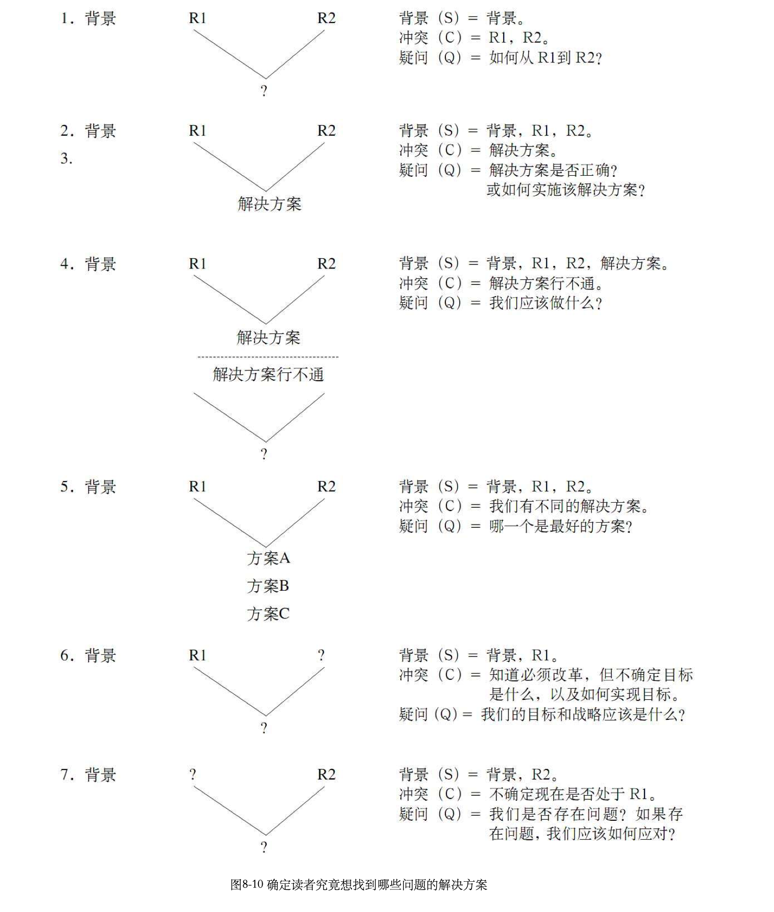
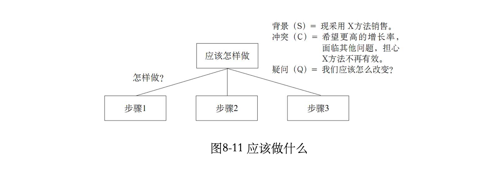
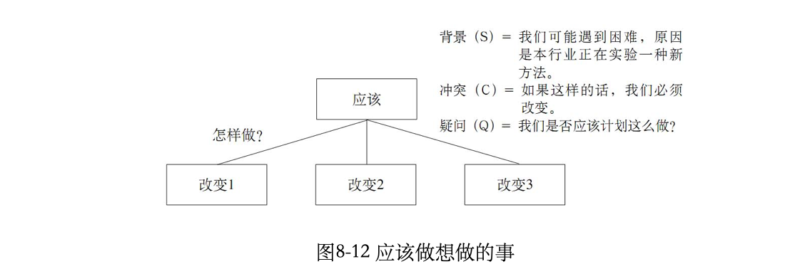
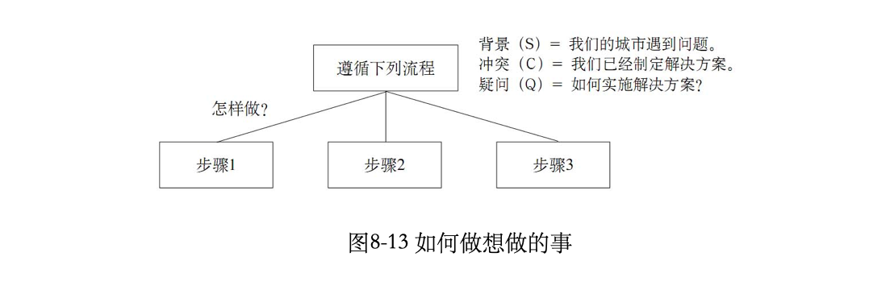
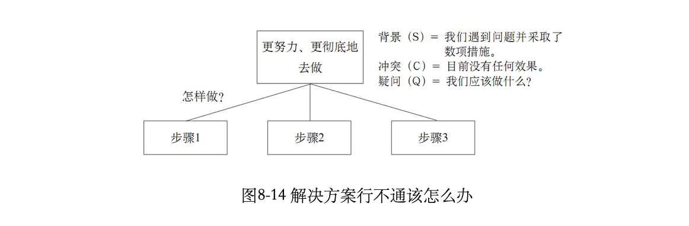
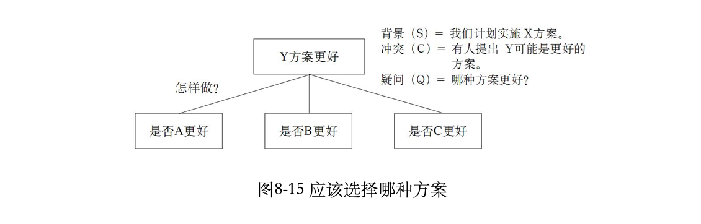
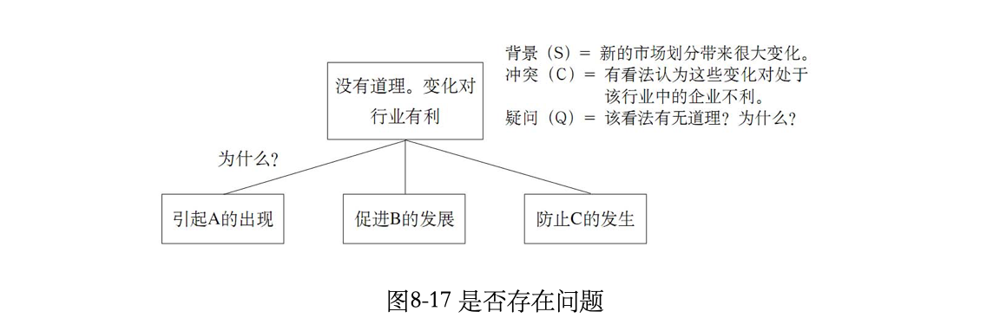

## 金字塔原理

——[作者] [美]芭芭拉.明托

### 为什么要用金字塔

1. 因为只有金字塔结构才能够满足大脑的两个需求： 一次记忆不超过7个思想、概念或项目。 找出逻辑关系。
2. 受众的大脑只能逐句理解作者（演讲者、培训讲师）表达的思想。他们会假定一同出现的思想在逻辑上存在某种关系。如果你不预先告诉他们这种逻辑关系，而只是一句一句地表达你的思想，读者就会自动从中寻找共同点，将你所表达的思想归类组合，以便了解各个组合的意义。由于受众的知识背景和理解力千差万别，他们很难对你所表达的思想组作出与你完全一样的解读。事实上，如果你不预先告诉读者某一组思想之间的逻辑关系，他们很有可能会认为某一组中的思想之间根本没有任何关系。退一步说，即使受众能够作出与你完全一样的解读，你也增加了他们阅读的难度，因为他们必须自己找出这种你没有提前说明的逻辑关系。
3. 无论读者的智商有多高，他们可利用的思维能力都是很有限的。一部分思维能力用于识别和解读读到的词语，另一部分用于找出各种思想之间的关系，剩下的思维能力则用于理解所表述思想的含义。

### 金字塔内部的结构

1. 金字塔结构的巨大价值就在于它迫使你在理清思路时，从视觉上使纵向的疑问／回答式对话关系清晰化。你的每一个表述都应当引发读者的疑问，而你也必须在这一表述下的横向结构层次上逐个回答读者的疑问。
2. 以下是我对金字塔原理的初学者常问问题的回答：
   1. 一定先搭结构，先尝试自上而下法
      - 不要试图一下子就把整篇文章都写出来，因为你稍后就可能很容易地想出文章的结构。一旦你的思想变成了文字，你就可能会觉得写得不错，而根本不管你的思路实际上是不连贯的。
   2. 序言先写背景，将背景作为序言的起点
      - 一定要从“背景”开始构思，因为按照这个顺序，你更容易准确地找到“冲突”和“疑问”
   3. 先多花时间思考序言，不要省略
      - 先想好序言，避免开始论证时还在想背景或冲突。你应当先整理出序言的信息，然后把注意力完全集中在金字塔结构中较低层次的思想上。
   4. 将历史背景放在序言中
      - 你不应该在文章的正文部分才告诉读者过去发生的事情。正文部分应当只包括思想（即：因能够为读者提供新思维而引起读者疑问的表述），思想只能以逻辑方式互相联系。
   5. 序言仅涉及读者不会对其真实性提出质疑的内容。
      - 序言的目的只是告诉读者一些他们已经知道的信息。
      - 如果所表达的信息能够很容易地由客观的第三方进行检验和证实，那就可以假定你的读者“知道”该信息，因为读者不会对其真实性提出质疑。
      - 注意不要在序言中涉及任何读者不知道的信息，因为这样的信息可能导致读者提出非你所愿的“疑问”。反之亦然，不要在金字塔结构中涉及任何读者已经知道的信息。如果你利用读者已经知道的信息，回答金字塔结构中较低层次上的问题，就说明你在序言中遗漏了重要的信息。如果在序言中提供该信息的话，也许读者会提出不同的疑问。
   6. 在关键句层次上，更宜选择归纳推理法而非演绎论证法。 
      - 在关键句层次上使用归纳推理比使用演绎推理更容易使读者接受，因为归纳法更容易被人理解。人们的倾向是按照思维发展的顺序表达自己的思想，而思维发展的顺序通常都是演绎的顺序。但是，以演绎的顺序发展的思想并不一定要以演绎的顺序表达出来。在大多数情况下，你都可以将以演绎法发展的思想用归纳法的形式表达出来。

### 序言的具体写法

1. 序言总是向读者说明其已知的信息，其意义是：序言说明某种“背景”，这种“背景”中发生了某种“冲突”，从而引发了某种“疑问”，而整篇文章的目的就是回答该“疑问”。
2. 序言必须采取“背景—冲突—疑问—解决方案”的结构，但是，各部分的顺序可以有所变化，以创造不同的文章风格。
3. 关键句的每一个要点，都应该按照与全文的序言相似（但简单得多）的背景—冲突—疑问结构逐个引出。也就是说，当读者对任何一个关键句要点提出疑问时，你应当告诉读者一个简单的“故事”，以保证读者与你站在同一位置上。
4. 序言应当介绍4要素:
   1. 介绍背景（S, Situation）
   2. 指出冲突（C, Complication）
   3. 引发疑问（Q, Question）
   4. 给出答案（A, Answer）

### 演绎推理与归纳推理

1. 演绎是一种线性的推理方式，最终是为了得出一个由逻辑词“因此”引出的结论。在金字塔结构中，位于演绎论证过程上一层次的思想是对演绎过程的概括，重点是在演绎推理过程的最后一步，即由逻辑词“因此”引出的结论。归纳推理是将一组具有共同点的事实、思想或观点归类分组，并概括其共同性（或论点）。在演绎过程中，每个思想均由前一个思想导出；而在归纳过程中则不存在这种关系。
2. 演绎推理需要完成3个步骤：
   1. 阐述世界上已存在的某种情况。 
   2. 阐述世界上同时存在的相关情况。如果第二个表述是针对第一个表述的主语或谓语的，则说明这两个表述相关。 
   3. 说明这两种情况同时存在时隐含的意义。
3. 演绎推理也可以是以下3个步骤： 
   1. 出现的问题或存在的现象。 
   2. 产生问题的根源、原因。
   3.  解决问题的方案。
4. 还要注意的是：不论你将几个句子组织在一起，是为了进行归纳推理，还是为了进行演绎推理，你的思维都会主动预期某个归纳式结论或演绎式结论的出现。大脑对归纳论述和演绎论述的完整性有一种预期，读者的这种预期，使读者将思维“投射”到前方，预测作者的下一个句子。如果读者预期的结果与作者实际的表述不同，读者就可能感到困惑、不解、烦躁。因此，你应当在呈现归纳或演绎过程之前，先告诉读者你的主题思想，以使读者能够容易地跟上你的思路。
5. 演绎推理与归纳推理的区别：
   - 演绎推理，第二点是对第一点主语或谓语的论述。
   - 归纳推理，同组中的思想具有类似的主语或谓语。

### 应用逻辑顺序

1. 分组的MECE原则，保证划分后的各部分符合以下要求： 
   - 各部分之间相互独立（mutuallyexclusive），相互排斥，没有重叠。 
   - 所有部分完全穷尽（collectivelyexhaustive），没有遗漏。

### 概括各组思想

1. 思想的表达方式可以是行动性语句，即告诉读者做什么事；也可以是描述性语句，即告诉读者关于某些事的情况。 
   - 概括行动性思想（介绍采取的行动、行为、步骤、流程）时，应说明采取行动后取得的“结果”（效果、达到的目标）。 
   - 概括描述性思想（介绍背景、信息）时，应说明这些思想具有的“共同点的含义”（共同点的意义）。
2. 还有一些能够帮助你理顺思路、轻松表达的技巧： 
   - 在将各行动（步骤、流程等）联系起来之前，先用明确的语句描述各行动（步骤、流程等）。
   - 找出明显的因果关系组合，尽量将每一组中的行动、步骤控制在5个以下。 
   - 直接从这些行动、步骤、流程，总结、概括行动的结果、目标。
3. 在讲述行动、步骤、流程等时，理顺自己思路最简单的方法，就是想象自己确实采取了这些行动，然后根据完成这些行动将产生的明确结果，修改各行动步骤的措辞，使之更明确、更具体。
4. 组织各种行动、步骤等唯一合理的方法，就是根据其产生的结果归类分组。
5. 条理清晰地表达行动性思想绝不是一件容易的事。这是一项艰难的脑力劳动，但是，如果不这样做，就会给读者造成极大的阅读困难。因此，你应当按照我们曾经讨论的步骤，努力完成这一艰难的过程：先用明确的词汇、语句表述各行动、步骤、流程等，然后区分不同的抽象层次，再直接从各行动、步骤、流程等总结概括出行动的结果。

### 界定问题

1. 判断问题是否存在，通常要看经过努力得到的结果（现状），与希望得到的结果（目标）之间是否有差距。由某一特定背景导致的某一特定结果，称为非期望结果（R1,即现状，UndesiredResult）。

2. “问题”是指你不喜欢某一结果（比如销售额降低），想得到其他结果（比如销售额增长），称为期望结果（R2,即目标，DesiredResult）。解决方案则是指如何从现状R1到目标R2。
     

3. 以上界定问题的方法称为连续分析（统计学上称为序列分析），是一种有效地解决问题的技巧，可以帮助你为以下按逻辑顺序排列的问题寻找答案：

   1. 是否有/是否可能有问题（或机会）？
   2. 问题在哪里？
   3. 为什么存在（产生问题的根源、原因）？
   4. 我们能做什么？
   5. 我们应该做什么？ 

4. 在前面的部分已经看到，需要确定4个要素后才能界定问题，并由此寻找解决方案。这4个要素分别是： 

   1. 切入点/序幕（StartingPoint/OpeningScene） 
   2. 困扰／困惑（DisturbingEvent） 
   3. 现状，非期望结果（R1,UndesiredResult） 
   4. 目标，期望结果（R2,DesiredResult）

   

5. 最常见的问题

   1. 不知道如何从R1（现状）到R2（目标）。

   2. 知道如何从R1到R2，但不敢肯定是否正确。

   3. 知道从R1到R2的正确方案，但不知道如何实施。

6. 最常见问题的变形
     1. 知道从R1到R2的解决方案，并且已经实施，但由于某种原因行不通。
     2. 确定了好几个解决方案，但不知道选哪一个。

7. 可能但不常见的情形

     1. 知道R1，但不能具体描述R2，所以无法找到解决方案。
     2. 知道R2，但不清楚自己是否处在R1（这是典型的标杆比对）。

8. 序言：我们应该做什么

   这种结构是所有分析和写作的最简单的一种。背景描述的是正在发生的事情，冲突是指读者处在R1，希望到达R2。这种结构也可以用来讲述如何调整和升级正在使用的系统。在这种情况下：

   - 背景（S）=系统目前的工作情况。
   - 冲突（C）=它不做它该做的工作。
   - 疑问（Q）=如何让它做它该做的工作？

9. 序言：我们是否应该做我们想做的事这种结构还有几种有意思的变形：

     - 背景（S）=我们存在问题。
     - 冲突（C）=我们计划采取行动。
     - 疑问（Q）=该行动是否正确？
     - 背景（S）=我们计划采取X行动。
     - 冲突（C）=除非出现Y情况，否则我们不希望采取X行动疑问
     - （Q）=Y情况会出现吗？

10. 序言：我们应该如何做我们想做的事

该结构也适用于向某人解释如何完成某事：

  - 背景（S）=我们曾经存在问题。
  - 冲突（C）=通过X行动我们解决了问题。
  - 疑问（Q）=你是如何进行X行动的？
  - 背景（S）=我们有（过去有）一个目标。
  - 冲突（C）=我们正在安装一套系统或流程来实现该目标。
  - 疑问（Q）=该系统或流程是如何运行的？
11. 序言：解决方案行不通，我们应该做什么

    该结构是第一种结构的延伸，问题都是我们应该做什么。唯一的区别在于针对该问题已经采取过两次或三次措施，需要追溯其过去的历史才能发现真正的问题。

12. 序言：我们应该选择哪种方案

    备选方案一般归在冲突项下。不要一一列出所有的备选方案，除非读者事先已经知道，否则读者会误把它们当做选择某种解决方案的原因。尤其要避免把备选方案罗列出来，然后否定。例如，“我们有3种方法可以解决该问题”，关键句要点为：

    A方法不好→B方法不好→因此采用

    是因为……是因为……C方法。

    采用C方法的原因其实并不是A和B不好，而是C方法行之有效。

13. 序言：我们存在问题吗

    文章关注的是处于变化中的行业。使用该结构最典型的情况，是当客户希望瞄准同行业竞争对手，或其他行业中采取同样措施的企业时。

### 结构化分析问题

1. 分析问题的标准流程是：收集信息→描述发现→得出结论→提出方案
2. 建立诊断框架的过程有时候被称为“是非问题分析”（issueanalysis）
3. 是非问题对困难的解决至关重要，因为它们能给出直截了当的回答。能不能设计出鲜明的是非问题，决定着解决困难的努力能不能取得成效。

### 在书面上呈现金字塔

1. 在实际写作中，文章多以书面的形式呈现给读者。文章无论长短，都应该让读者能从字面上迅速理解和吸收其主要思想（观点、论点、建议等）。理想的文章，应该让读者在30秒内理解作者的整体思维构架，包括序言、中心思想和关键句要点。此外，读者还应当能了解整体构架下，各组思想观点之间的相互关系。
2. 写作长篇文章时，在页面上呈现金字塔层级的方法很多，最常见的有： 
   1. 多级标题法
   2. 下划线法
   3. 数字编号法
   4. 行首缩进法
   5. 项目符号法
3. 多级标题法：使用多级标题的基本方法是：不同层次的思想（观点、论点、论据、建议），用不同的标记区分；层次越低的思想离页面的右端越近；同一层次的思想采用同一表现形式。
4. 因此，当你写完长长的一组论点，准备接着写下一组时，你不能期望读者对某一点的理解和你要求的一样精确。可以说，各种不同的过渡方法都是为了抓住读者的思想，把它拉回到它应该属于的地方，让读者理解你想说的内容。可以把写过渡性文字当做礼仪练习，当需要的时候以优雅的方式写。

### 在PPT演示文稿中呈现金字塔

1. 问题在于视觉演示是面向现场观众的。周围环境往往极不舒适，有时糟糕到你甚至希望换个地方。观众的反应不仅不可预测，而且注意力很不集中。因此，你的大部分工作是预测观众可能的反应，时时努力让他们集中注意力，激起他们接受你的信息的热情。换句话说，你必须取悦观众。商业演示和其他任何娱乐形式一样，也需要艺术性。

2. 你必须会“作秀”。“作秀”需要明星、剧本、故事情节和技术上出类拔萃的视觉元素，另外还要考虑一些无形的因素，如时机、节奏和悬念等。这一整套技巧远不是“以幻灯片的形式作报告”那么简单。

3. 为了吸引受众的注意力，下面是设计PPT演示文稿的人必须了解和掌握的最基本规则：

   - 文字幻灯片应只包含最重要的、经过适当分组和总结的思想（观点、论据、建议等），叙述时应尽量简洁；
   - 演示文稿应图文并茂，使用各种图表（图、表或示意图）相配合；
   - 演示文稿应呈现经过深思熟虑后的故事梗概和剧本。

4. 演示文稿包括两类幻灯片——文字和图表（图、表或示意图），理想的比例是图表占90%，文字占10%，其各自的作用是：

   1. 说明演示文稿的框架结构（文字幻灯片）。
   2. 强调重要的思想、观点、结论、论点、建议或要采取的措施等（文字幻灯片）。
   3. 阐明单用文字难以说清楚的数据、关系（图表）。

5. 制作现场演示用的文字幻灯片时，需要强调的是，只有你，演示者，才是表演的明星。房间里所有听众最感兴趣的不是幻灯片，而是你。幻灯片只不过是视觉上的辅助手段，其作用主要是让演示更加生动。因此，你所说的和你在屏幕上演示的应该有明显的区别。

6. 决定一张幻灯片的内容，应牢记以下指导性原则：

   1. **每次只演示和说明一个论点**。除非你想先列出摘要或列表中的一组论点，其他论点在接下来的幻灯片中再完全展开。

   2. **论点应使用完整的陈述句，而不是标题性语言**。你可以用一两个词或一个简短的陈述句提出观点。

   3. **文字应尽量简短。每张幻灯片最好不要超过6行或约30个单词**。如果一张幻灯片难以说清楚一个思想观点，可以使用多张幻灯片。

   4. **使用简单的词汇和数字**。使用一长串单词、技术术语或者复杂的词组，会分散受众的注意力。数字也是越简单越好，比如490万美元就比4876987美元更容易让人记住。 

   5. **字号应足够大**。32是个非常有用的数字。用最远一位观众到屏幕的距离（英尺）除以32，得到的就是可以看清楚的最小字号（英寸）。所以，如果从16英尺远的地方看屏幕，屏幕上的字号必须是1/2英寸（16÷32=0.5）。同样道理，如果已知屏幕显示文字的字号（英寸），乘上32，就得到可以看清楚屏幕上文字的最远距离。所以，如果站在24英尺以外，就无法看清楚字号为3/4英寸的文字（0.75×32=24）。

   6. **注意幻灯片的趣味性**。趣味性取决于布局、字号的选择和颜色的运用。但如果把文字幻灯片看成是文字的展示，而不是数据或图表的展示，就能通过显示思想之间的相互关系，制作出更加美观、赏心悦目的幻灯片。

   7. **用逐级展开呈现，提高趣味性**。提高趣味性和降低复杂性的另一种方法，是让幻灯片的各个部分逐一显示，这样可以边演示边解释，整张幻灯片不至于显得主次不分。

7. 图表幻灯片传递的信息应该尽量简单易懂，因为观众没有机会对它们仔细研究并找出各个部分的含义。如果图表过于复杂、过于详细，或过于分散，就会把大量宝贵的时间浪费在解释上，而不是用在讨论上。当然，也不排除有时非常复杂的图表会随着演讲者展开观点而变得简单。但一份演示文稿最好不要有超过一个或两个这样复杂的图表。

8. 制作图表幻灯片的诀窍是：确定你想用图表回答的问题，把答案作为图表的标题，然后选择最适合表现论点的图表样式。

9. 图表的标题一定要直接传递信息，要么用一个完整的句子，要么用一个含有动词的短语，才能保证图表给观众的视觉印象和所要传达的信息一致。

10. 从金字塔结构到演示文稿，我通常采用以下方法：

    1. 序言尽量写得详细，把每个你想说的词汇按照你希望的顺序写下来。这样做不仅可以保证没有遗漏，还可以再次检查你回答的问题是否仍然是受众想问的。
    2. 用写故事梗概的形式。每张幻灯片写作的顺序，从上往下依次为序言各要素、关键句要点和关键句下一层次的论点。
    3. 初步决定你准备采用的呈现方法。这时你可能还没有准确的数据，但只要知道数据的类型和想要表现何种关系即可。 4
    4. 准备好每张幻灯片的讲稿，确保整个演示像讲故事一样流畅。
    5. 完成幻灯片的设计和绘图。
    6. 排练，排练，再排练！可以用一张白纸写最简单的故事梗概，把它分成若干个区域，每个区域代表一张空白幻灯片，写上你想要阐述的要点，并说明哪些需要用文字幻灯片，哪些需要用图表幻灯片。

11. “演示是参会者给予演讲者的一种恩惠”，确实值得铭记在心。

### 在字里行间呈现金字塔

1. 有关记忆的研究已经证明图像能帮助增加记忆，但同时也表明，忘记和添加哪些细节取决于人们的感情偏好。尽管如此，记忆图像确实能在阅读过程中，帮助你逐字逐句记忆段落和从中提取的信息。
2. 总之，做到条理清晰的有效方法就是，强迫自己想象各种思想观点之间的内在关系。头脑里有了清晰的图像后，就能立刻把它转换成清楚的句子，读者也能马上理解和吸收，并在记忆中以图像的形式储存知识。
3. 以图像形式储存知识非常重要，因为阅读是一个逐字逐句进行的过程，而且我们的头脑只能容纳有限的词汇。通过从文字恢复图像的方法，读者不仅能大量传递知识，使头脑更加有效地处理，而且能用清晰的图像传递信息，

​       