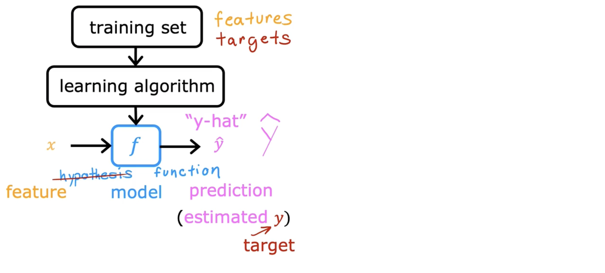
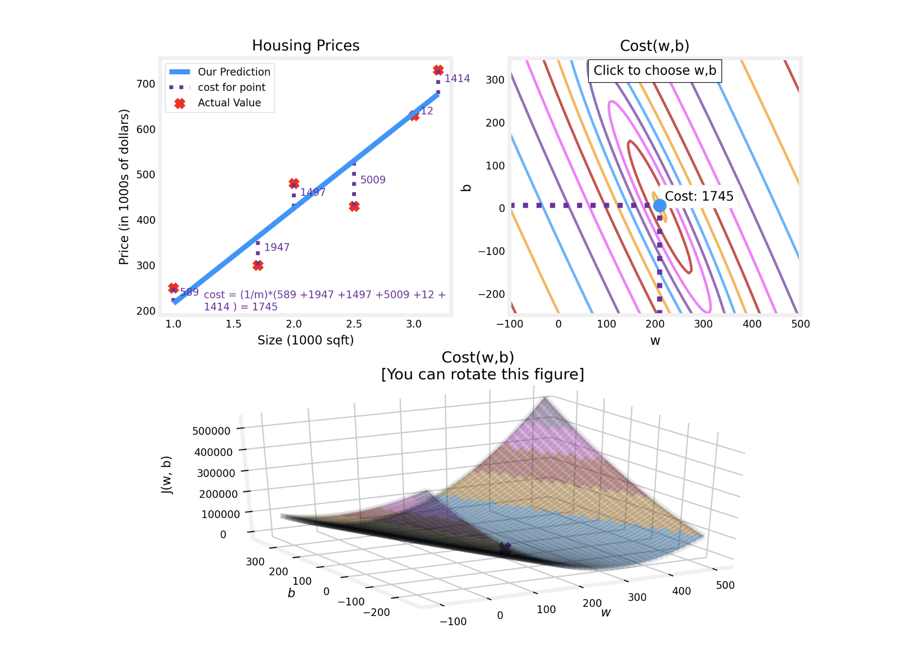

## Regression Model

### Linear Regression Model

#### Terminology

**Training set**: Data used to train the model.

**Notation**:

- `x`: “input” variable, feature
- `y`: “output” variable, “target” variable
- `m`: number of training examples
- `(x,y)` = single traning example

- $(x^{(i)},y^{(i)})$ = $i^{th}$ traning exapmle 

#### Process Of Supervised

#### Liner regression

$$
f_{w,b}(x) = wx + b \\
f(x) = wx + b
$$

Liner regression with one variable

Univariate(one variable) liner regression

### Cost function formula

cost function will tell us how well the model is doing so that we can try to get it to do better.

In machine learning **parameters** of the model are the variables you can adjust during training in order to improve the model.

**Cost Function: Squared error cost function**
$$
J(w,b) = \frac{1}{2m}\sum_{i=1}^{m}({\hat{y}}^{(i)} - y^{(i)})^{2}
$$
m = number of training examples
$$
J(w,b) = \frac{1}{2m}\sum_{i=1}^{m}(f_{w,b}(x^{(i)}) - y^{(i)})^{2}
$$

