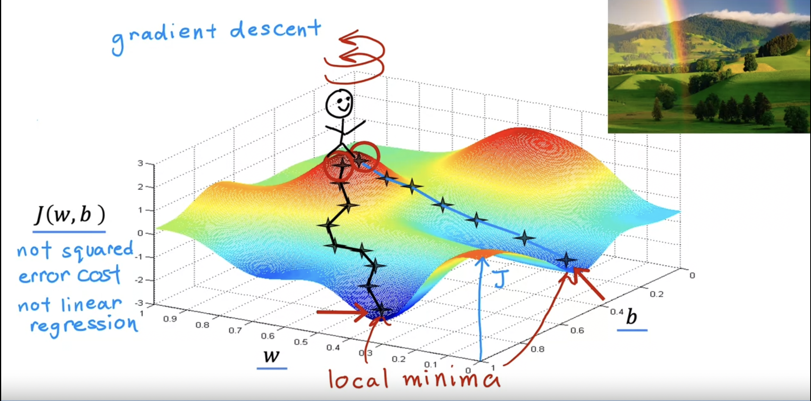

## Train the model with gradient descent

### Gradient descent

### Gradient descent algorithm

$$
w = w - \alpha \frac{d}{d w}J(w,b)
$$

$$
b = b - \alpha \frac{d}{d b}J(w,b)
$$

- $\alpha$:Learning rate. The learning rate is usually a small positive number between 0 and 1 and it might be say, 0.01, it basically controls how  big of a step you take downhill.

- Simultaneously update w and b.

### Gradient descent intuition

### Learning rate

$$
w = w - \alpha \frac{d}{d w}J(w,b)
$$

- if $\alpha$​ is too small, gradient descent may be slow.
- if $\alpha$ is too large, gradient descent may 
  - overshoot, never reach minimum.
  - fail to converge, diverge.

### Gradient descent for linear regression

**Linear regression model**

$$
f_{w,b}(x) = wx + b
$$
**Cost function**

$$
J(w,b) = \frac{1}{2m}\sum_{i=1}^{m}(f_{w,b}(x^{(i)}) - y^{(i)})^{2}
$$
**Gradient descent algorithm**

repeat until convergence:
$$
w = w - \alpha \frac{d}{d w}J(w,b) \\
b = b - \alpha \frac{d}{d b}J(w,b)
$$

### Running gradient descent

#### “Batch” gradient descent

“Batch”: Each step of gradient descent uses all the training examples.

