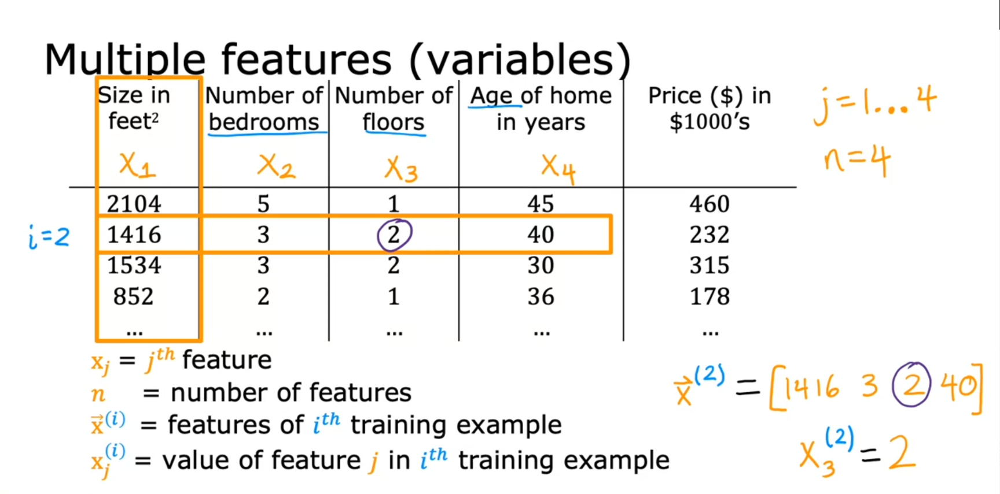
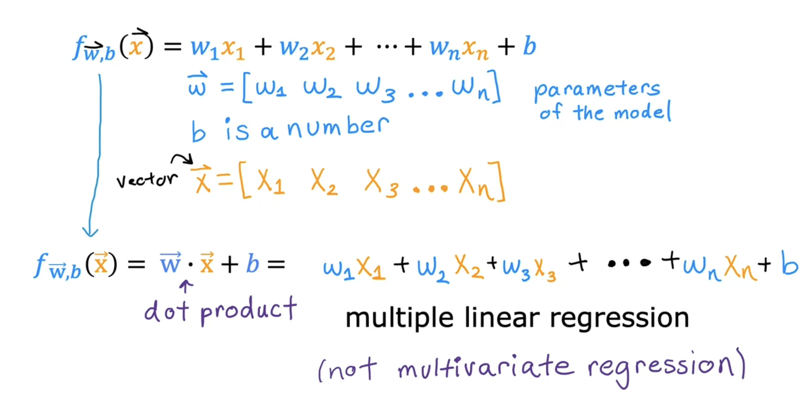
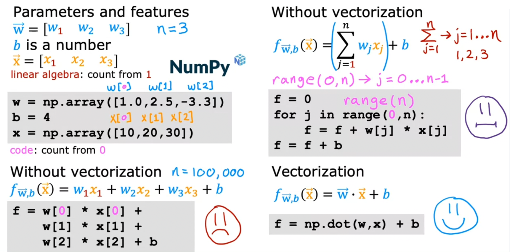
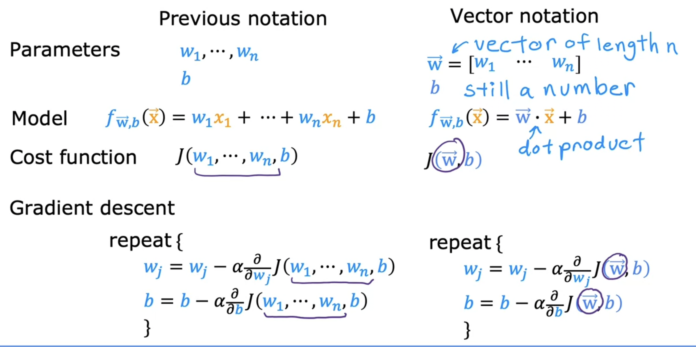
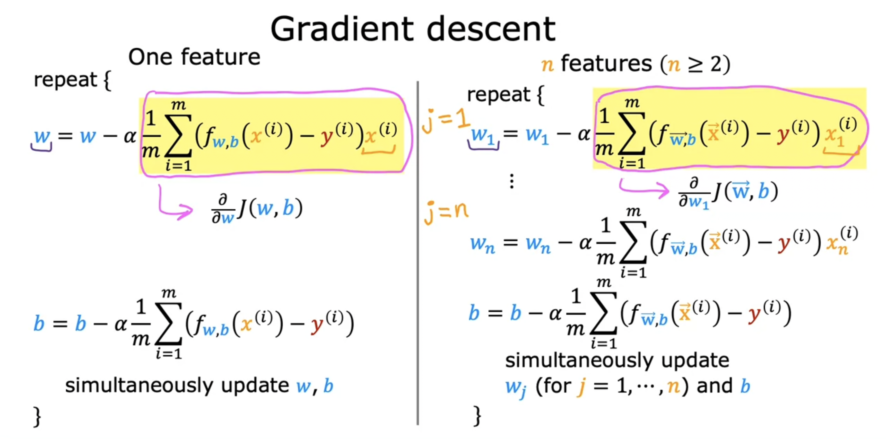

## Multiple features

**Model**
$$
f_{w,b} = w_1x_1 + w_2x_2 + w_3x_3 + w_4x_4 + b
$$

**multiple liner regression **

### Vectorization

### Gradient descent for multiple linear regression

#### Normal Equation

Normal Equation:

- Only for linear regression
- Solve for w,b withour iterations.

Disadvantages

- Doesn’t generalize to other learning algorithms.
- Slow when number of features is large (> 10,000)

What you need to know

- Normal equation method may be used in machine learning libraries that implement linear regression
- Gradient descent is the recommended method for finding parameters w,b

