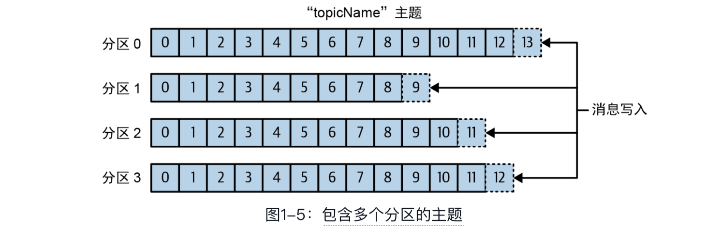
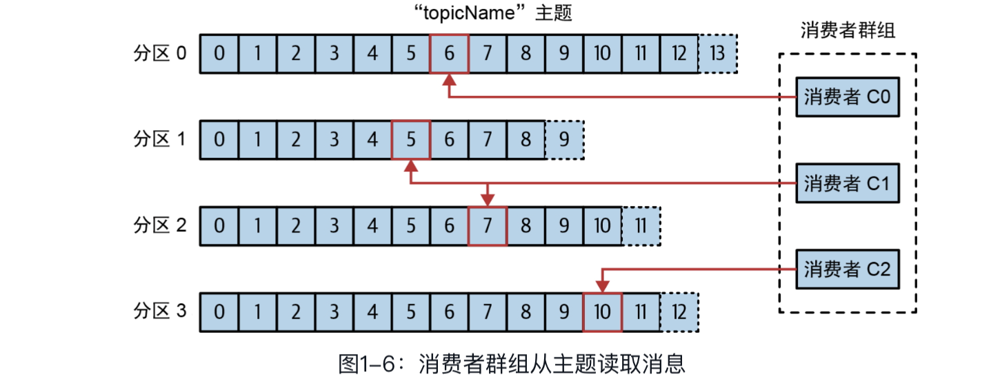
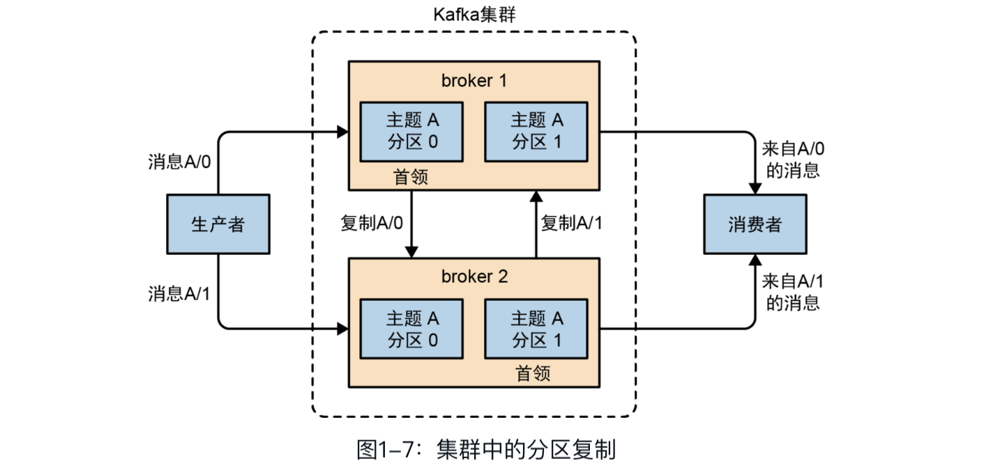
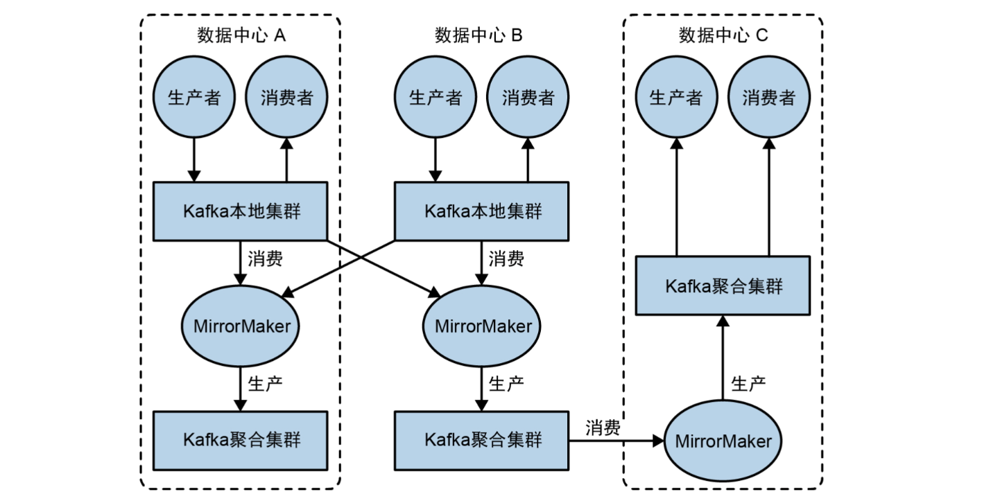
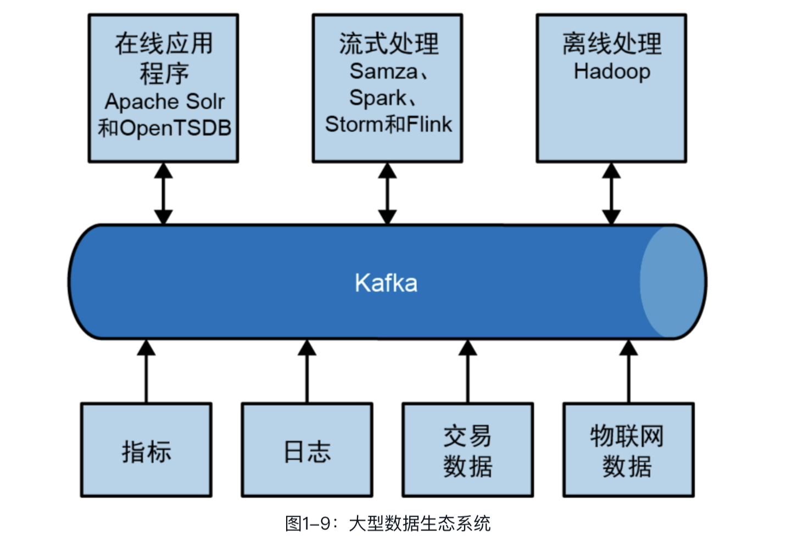

## 第1章　初识Kafka

数据为企业的发展提供动力。我们从数据中获取信息，对它们进行分析处理，并生成更多的数据。每个应用程序都会生成数据，包括日志、指标、用户活动记录、响应消息等。数据的点点滴滴都在暗示一些重要的东西，比如下一步要做什么。我们把数据从源头移动到可以对它们进行分析处理的地方，然后再把得到的结果应用到实际场景中，这样才能确切地知道这些数据要告诉我们什么。如果每天在亚马逊网站上浏览感兴趣的商品，那么浏览信息就会被转化成商品推荐，展示给我们。

这个过程完成得越快，组织的反应就越敏捷。在数据移动上花费的精力越少，就越能专注于核心业务。这就是为什么在数据驱动型企业中，数据管道会成为关键性组件。如何移动数据几乎变得与数据本身一样重要。

### 1.1　发布与订阅消息系统

在正式讨论Apache Kafka（以下简称Kafka）之前，先来了解什么是发布与订阅消息系统，以及为什么它是数据驱动型应用程序的关键组件。数据（消息）的发送者（发布者）不会直接把消息发送给接收者，这是发布与订阅消息系统的一个特点。发布者以某种方式对消息进行分类，接收者（订阅者）通过订阅它们来接收特定类型的消息。发布与订阅系统一般会有一个broker，也就是发布消息的地方。

### 1.2　Kafka登场

Kafka就是为了解决上述问题而设计的一款基于发布与订阅模式的消息系统。它一般被称为“分布式提交日志”或“分布式流式平台”。文件系统或数据库提交日志旨在保存事务的持久化记录，通过重放这些日志可以重建系统状态。同样，Kafka的数据是按照一定的顺序持久化保存的，并且可以按需读取。此外，Kafka的数据分布在整个系统中，具备数据故障恢复能力和性能伸缩能力。

#### 1.2.1　消息和批次

Kafka的数据单元被称为消息。如果在使用Kafka之前你已经有使用数据库的经验，那么可以把消息看成数据库中的一个“数据行”或一条“记录”。消息由字节数组组成，对Kafka来说，消息里的数据没有特殊的格式或含义。消息可以有一个可选的元数据，也就是键。键也是一个字节数组，与消息一样，对Kafka来说没有特殊含义。当需要以一种可控的方式将消息写入不同的分区时，需要用到键。最简单的例子就是为键生成一个一致性哈希值，然后用哈希值对主题分区数进行取模，为消息选取分区。这样可以保证具有相同键的消息总是会被写到相同的分区中（前提是分区数量没有发生变化）。

为了提高效率，消息会被分成批次写入Kafka。批次包含了一组属于同一个主题和分区的消息。如果每一条消息都单独穿行于网络中，那么就会导致大量的网络开销，把消息分成批次传输可以减少网络开销。不过，这需要在时间延迟和吞吐量之间做出权衡：批次越大，单位时间内处理的消息就越多，对单条消息来说，其传输时间就越长。消息批次会被压缩，这样可以提升数据的传输和存储性能，但需要做更多的计算处理。第3章将详细介绍消息的键和批次。

#### 1.2.2　模式

对Kafka来说，消息不过是晦涩难懂的字节数组，所以有人建议用一些额外的结构来定义消息内容，让它们更易于理解。不同的应用程序有不同的需求，因此消息模式(schema)也有很多可选项。一些简单的模式，比如JavaScript ObjectNotation(JSON)和Extensible Markup Language(XML)，不仅易用，还具备良好 的可读性。不过，它们缺乏强类型处理能力，不同版本之间的兼容性也不是很好。很多Kafka开发者喜欢使用Apache Avro，其最初是为Hadoop开发的一款序列化框架。Avro提供了一种紧凑的序列化格式，模式和消息体是分开的，当模式发生变化时，无须重新生成代码。Avro还支持强类型和模式演化，既向前兼容，也向后兼容。

数据格式的一致性对Kafka来说非常重要，它消除了消息读写操作之间的耦合性。如果读写操作紧密耦合在一起，那么消息订阅者就需要升级应用程序才能同时处理新旧两种数据格式，而消息发布者需要在消息订阅者升级之后跟着升级，然后使用新的数据格式发布消息。将定义好的模式保存在公共库中，更方便我们了解Kafka的消息结构。第3章将详细讨论模式和序列化。

#### 1.2.3　主题和分区

Kafka的消息通过主题进行分类。主题就好比数据库的表或文件系统的文件夹。主题可以被分为若干个分区，一个分区就是一个提交日志。消息会以追加的方式被写入分区，然后按照先入先出的顺序读取。需要注意的是，由于一个主题一般包含几个分区，因此无法在整个主题范围内保证消息的顺序，但可以保证消息在单个分区内是有序的。图1-5所示的主题有4个分区，消息被追加写入每个分区的尾部。Kafka通过分区来实现数据的冗余和伸缩。分区可以分布在不同的服务器上，也就是说，一个主题可以横跨多台服务器，以此来提供比单台服务器更强大的性能。此外，分区可以被复制，相同分区的多个副本可以保存在多台服务器上，以防其中一台服务器发生故障。

我们通常会使用流这个词来描述Kafka这类系统中的数据。很多时候，人们会把一个主题的数据看成一个流，不管它有多少个分区。流是一组从生产者移动到消费者的数据。当我们讨论流式处理时，一般都是这样描述消息的。Kafka Streams、Apache Samza和Storm这些框架以实时的方式处理消息，这就是所谓的流式处理。流式处理有别于离线处理框架（如Hadoop）处理数据的方式，后者被用于在未来某个时刻处理大量的数据。第14章将介绍流式处理。

#### 1.2.4　生产者和消费者

Kafka的客户端就是Kafka系统的用户，其被分为两种基本类型：生产者和消费者。除此之外，还有其他高级客户端API——用于数据集成的Kafka Connect API和用于流式处理的Kafka Streams。这些高级客户端API使用生产者和消费者作为内部组件，提供了更高级的功能。

生产者创建消息。在其他发布与订阅系统中，生产者可能被称为发布者或写入者。一条消息会被发布到一个特定的主题上。在默认情况下，生产者会把消息均衡地分布到主题的所有分区中。不过，在某些情况下，生产者会把消息直接写入指定的分区，这通常是通过消息键和分区器来实现的。分区器会为键生成一个哈希值，并将其映射到指定的分区，这样可以保证包含同一个键的消息被写入同一个分区。生产者也可以使用自定义的分区器，根据不同的业务规则将消息映射到不同的分区。第3章将详细介绍生产者。

消费者读取消息。在其他发布与订阅系统中，消费者可能被称为订阅者或读取者。消费者会订阅一个或多个主题，并按照消息写入分区的顺序读取它们。消费者通过检查消息的偏移量来区分已经读取过的消息。偏移量（不断递增的整数值）是另一种元数据，在创建消息时，Kafka会把它添加到消息里。在给定的分区中，每一条消息的偏移量都是唯一的，越往后消息的偏移量越大（但不一定是严格单调递增）。消费者会把每一个分区可能的下一个偏移量保存起来（通常保存在Kafka中），如果消费者关闭或重启，则其读取状态不会丢失。

消费者可以是消费者群组的一部分，属于同一群组的一个或多个消费者共同读取一个主题。群组可以保证每个分区只被这个群组里的一个消费者读取。在图1-6所示的群组中，有3个消费者同时读取一个主题，其中的两个消费者各自读取3个分区中的1个分区，另外一个消费者读取其他2个分区。消费者与分区之间的映射通常被称为消费者对分区的所有权关系。

通过这种方式，消费者可以读取包含大量消息的主题。而且，如果一个消费者失效，那么群组里的其他消费者可以接管失效消费者的工作。第4章将详细介绍消费者和消费者群组。

#### 1.2.5　broker和集群

一台单独的Kafka服务器被称为broker。broker会接收来自生产者的消息，为其设置偏移量，并提交到磁盘保存。broker会为消费者提供服务，对读取分区的请求做出响应，并返回已经发布的消息。根据硬件配置及其性能特征的不同，单个broker可以轻松处理数千个分区和每秒百万级的消息量。

broker组成了集群。每个集群都有一个同时充当了集群控制器角色的broker（自动从活动的集群成员中选举出来）。控制器负责管理工作，包括为broker分配分区和监控broker。在集群中，一个分区从属于一个broker，这个broker被称为分区的首领。一个被分配给其他broker的分区副本（参见图1-7）叫作这个分区的“跟随者”。分区复制提供了分区的消息冗余，如果一个broker发生故障，则其中的一个跟随者可以接管它的领导权。所有想要发布消息的生产者必须连接到首领，但消费者可以从首领或者跟随者那里读取消息。第7章将详细介绍如何操作集群（包括复制分区）。

**保留消息**（在一定期限内）是Kafka的一个重要特性。broker默认的消息保留策略是这样的：要么保留一段时间（如7天），要么保留消息总量达到一定的字节数（如1 GB）。当消息数量达到这些上限时，旧消息就会过期并被删除。所以，在任意时刻，可用消息的总量都不会超过配置参数所指定的大小。主题可以配置自己的保留策略，将消息保留到不再使用它们为止。例如，用于跟踪用户活动的数据可能需要保留几天，而应用程序的指标可能只需要保留几小时。我们可以把主题配置成紧凑型日志，只有最后一条带有特定键的消息会被保留下来。这比较适用于变更日志类型的数据，因为人们只关心最近一次发生的更新事件。

#### 1.2.6　多集群

随着broker数量的增加，最好使用多个集群，原因如下。

- 数据类型分离
- 安全需求隔离
- 多数据中心（灾难恢复）

如果有多个数据中心，则需要在它们之间复制消息，让在线应用程序能够访问到多个站点的用户活动信息。如果一个用户修改了他们的资料，那么不管从哪个数据中心都应该能看到这些更新。或者，可以将多个站点的监控数据聚合到一个部署了分析应用程序和告警系统的中心位置。不过，需要注意的是，Kafka的消息复制机制只能在单个集群中而不能在多个集群之间进行。

Kafka提供了一个叫作 **MirrorMaker** 的工具，我们可以用它将数据复制到其他集群中。MirrorMaker的核心组件包括一个消费者和一个生产者，它们之间通过队列相连。消费者会从一个集群读取消息，生产者则会把消息发送到另一个集群中。图1-8是使用MirrorMaker的例子，两个“本地”集群的数据被集合到一个“聚合”集群中，然后聚合集群的数据再被复制到其他数据中心。不过，这个应用程序太过简单了，还不足以展示Kafka在构建复杂数据管道方面的能力。第9章将详细讨论这些复杂的应用场景。

### 1.3　为什么选择Kafka

基于发布与订阅的消息系统那么多，为什么Kafka是更好的选择呢？

#### 1.3.1　多个生产者

Kafka可以无缝支持多个生产者，不管客户端消费的是单个主题还是多个主题。所以，它很适用于从多个前端系统收集数据，并以统一的格式对外提供数据。例如，对于一个包含了多个微服务的网站，我们可以为页面视图创建一个主题，所有服务都以相同的消息格式向这个主题写入数据。消费者应用程序将获得统一的页面视图，不需要协调来自不同生产者的数据流。

#### 1.3.2　多个消费者

除了支持多个生产者，Kafka也支持多个消费者从一个单独的消息流读取数据，而且消费者之间互不影响。这与其他队列系统不同。在其他队列系统中，消息一旦被一个客户端读取，就无法再被其他客户端读取。多个消费者还可以组成一个群组，它们共享一个消息流，并保证整个群组只处理一次给定的消息。

#### 1.3.3　基于磁盘的数据保留

Kafka不仅支持多个消费者，还允许消费者非实时地读取消息，这要归功于Kafka的数据保留特性。消息会被提交到磁盘，并根据设置的保留策略进行保存。每个主题可以设置单独的保留策略，以满足不同消费者的需求。各个主题还可以保留不同数量的消息。消费者可能会因为处理速度慢或突发的流量高峰而无法及时读取消息，在这种情况下，持久化的数据可以保证数据不会丢失。消费者可以在应用程序维护期间离线一小段时间，无须担心消息丢失或被堵塞在生产者端。消费者也可以被关闭，但消息会继续保留在Kafka中。消费者被重启之后，可以从上次中断的地方继续处理消息。

#### 1.3.4　伸缩性

为了能够轻松地处理大量数据，Kafka从一开始就被设计成一个具备灵活伸缩性的系统。用户可以在开发阶段使用单个broker，然后再扩展到包含3个broker的小型开发集群。随着数据量不断增长，在部署到生产环境时，集群可以包含上百个broker。对在线集群进行扩展丝毫不影响系统的整体可用性。也就是说，一个包含多个broker的集群，即使个别broker失效，仍然可以持续地为客户端提供服务。要提高集群的容错能力，需要配置较高的复制系数。第7章将介绍更多的有关复制的内容。

#### 1.3.5　高性能

上面提到的所有特性让Kafka成了一个高性能的发布与订阅消息系统。通过横向扩展生产者、消费者和broker，Kafka可以轻松处理巨大的消息流。在处理大量数据的同时，它还能保证亚秒级的消息延迟。

#### 1.3.6　平台特性

Kafka核心项目还加入了一些流式平台特性，从而使开发人员能够更容易执行一些常见的任务。虽然Kafka算不上是一个完整的平台（完整的平台通常包含像YARN这样的结构化运行时环境），但这些特性会以API和开发库的形式存在，为开发者构建其他功能提供坚实的基础和非常好的部署灵活性。我们可以用Kafka Connect从一个源数据抽取数据并将其推送到Kafka，或者从Kafka抽取数据并将其推送到另一个接收数据的系统。Kafka Streams提供了一个开发库，开发人员可以用它开发具备伸缩性和容错能力的流式处理应用程序。第9章将更详细地介绍ApacheConnect，而Apache Streams将在第14章进行介绍。

### 1.4　数据生态系统

现在已经有很多应用程序加入到我们为数据处理而构建的生态系统中。我们通过应用程序的形式定义了输入，这些应用程序会生成数据或者把数据引入系统中。我们也定义了输出，它们可以是指标、报告或者其他类型的数据产品。我们创建了一个 闭环，用组件从系统中读取数据，再用来自其他数据源的数据对已读取的数据进行转换，然后再将其写回数据基础设施。数据类型可以多种多样，每一种可以有不同的内容、大小和用途。

Kafka为数据生态系统带来了循环能力，如图1-9所示。它在基础设施的各个组件之间传递消息，为所有客户端提供一致的接口。如果系统提供了消息模式，那么生产者和消费者之间将不再紧密耦合，我们也不需要在它们之间建立任何类型的直连。我们可以根据业务需要添加或移除组件，因为生产者不再关心谁在使用数据，也不关心有多少个消费者。

#### 应用场景

**1.活动跟踪**

Kafka最初的应用场景是跟踪网站用户的活动。网站用户与前端应用程序发生交互，前端应用程序再生成与用户活动相关的消息。这些消息既可以是一些静态信息，比如页面访问次数和点击量，也可以是一些复杂的操作，比如修改用户资料。这些消息会被发布到一个或多个主题上，并会被后端应用程序读取。这样，我们就可以生成报告，为机器学习系统提供数据，更新搜索结果，或者实现更多其他的功能。

**2.传递消息**

Kafka的另一个基本用途是传递消息。应用程序向用户发送通知（如邮件）就是通过消息传递来实现的。这些应用程序组件可以生成消息，而无须关心消息的格式以及消息是如何被发送出去的。一个公共应用程序会负责读取并处理如下这些消息。

-  格式化消息（也就是所谓的装饰）。
- 将多条消息放在同一个通知里发送。
- 根据用户配置的首选项来发送消息。

使用公共组件的好处在于，无须在多个应用程序中开发重复的功能，并且可以在公共组件中做一些有趣的转换，比如把多条消息聚合成一个单独的通知，而这些工作是无法在其他地方完成的。

**3.指标和日志记录**

Kafka也可以用于收集应用程序以及系统的指标和日志。Kafka的多生产者特性在这个时候就派上用场了。应用程序定期把指标发布到Kafka主题上，监控系统或告警系统会读取这些消息。Kafka也可以被用在离线处理系统（如Hadoop）中，进行较长时间片段的数据分析，比如年度增长走势预测。我们也可以把日志消息发布到Kafka主题上，然后再路由给专门的日志搜索系统（如Elasticsearch）或安全分析应用程序。更改目标系统（如日志存储系统）不会影响前端应用程序或聚合方法，这是Kafka的另一个优点。

**4.提交日志**

Kafka的基本概念源自提交日志，所以将Kafka作为提交日志是件顺理成章的事。我们可以把数据库的更新发布到Kafka，然后应用程序会通过监控事件流来接收数据库的实时更新。这种变更日志流也可以用于把数据库的更新复制到远程系统，或者将多个应用程序的更新合并到一个单独的数据库。持久化的数据为变更日志提供了缓冲，也就是说，如果消费者应用程序发生故障，则可以通过重放这些日志来恢复系统状态。另外，可以用紧凑型主题更长时间地保留数据，因为我们只为一个键保留了一条最新的变更数据。

**5.流式处理**

流式处理是另一个包含多种类型应用程序的领域。虽然可以认为大部分Kafka应用程序是基于流式处理，但真正的流式处理通常是指提供了类似map/reduce(Hadoop)处理功能的应用程序。Hadoop通常依赖较长时间片段的数据聚合，可以是几小时或几天。流式处理采用实时的方式处理消息，速度几乎与生成消息一样快。开发人员可以通过用流式处理框架开发小型应用程序来处理Kafka消息，执行一些常见的任务，比如指标计数、对消息进行分区或使用多个数据源的数据来转换消息，等等。第14章将通过其他案例来介绍流式处理。

