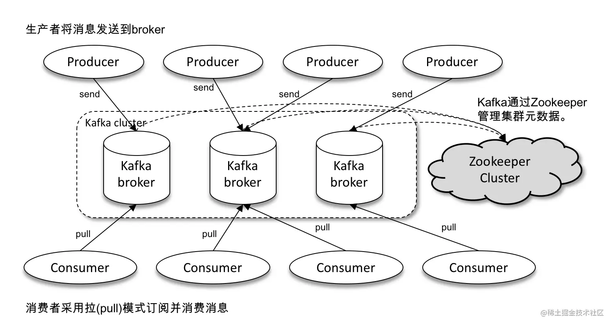
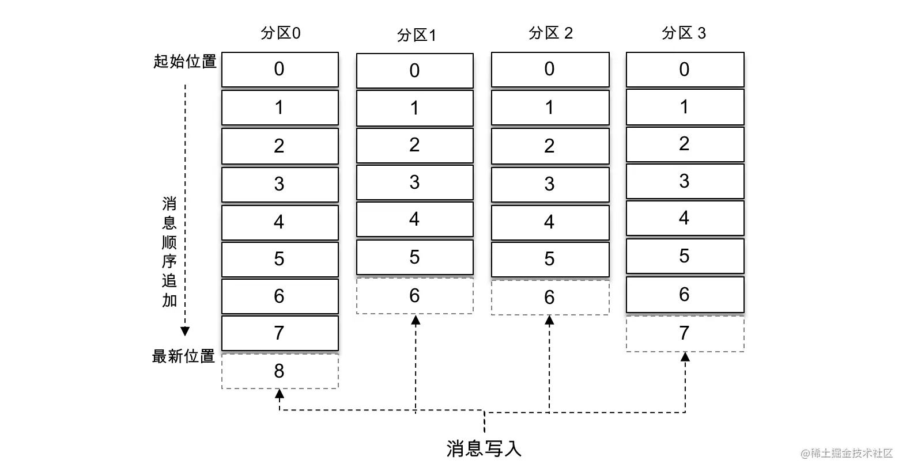
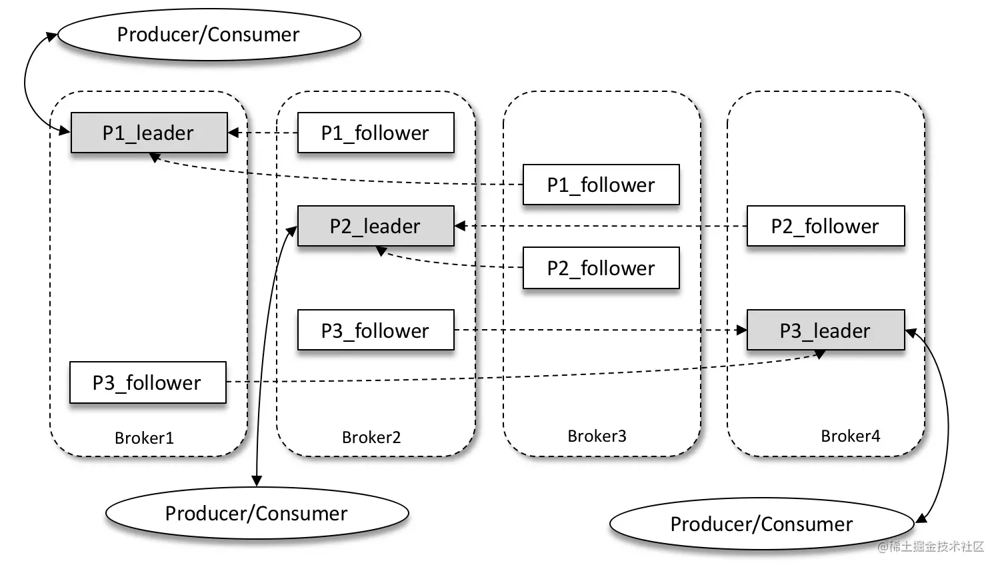
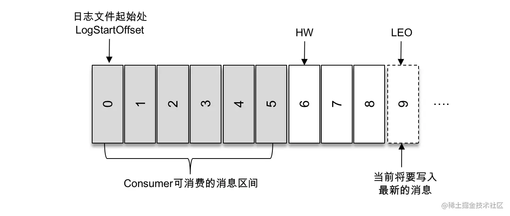

# 初识Kafka

Kafka 起初是 由 LinkedIn 公司采用 Scala 语言开发的一个多分区、多副本且基于 ZooKeeper 协调的分布式消息系统，现已被捐献给 Apache 基金会。目前 Kafka 已经定位为一个分布式流式处理平台，它以高吞吐、可持久化、可水平扩展、支持流数据处理等多种特性而被广泛使用。目前越来越多的开源分布式处理系统如 Cloudera、Storm、Spark、Flink 等都支持与 Kafka 集成。

Kafka 之所以受到越来越多的青睐，与它所“扮演”的三大角色是分不开的：

- **消息系统：** Kafka 和传统的消息系统（也称作消息中间件）都具备系统解耦、冗余存储、流量削峰、缓冲、异步通信、扩展性、可恢复性等功能。与此同时，Kafka 还提供了大多数消息系统难以实现的消息顺序性保障及回溯消费的功能。
- **存储系统：** Kafka 把消息持久化到磁盘，相比于其他基于内存存储的系统而言，有效地降低了数据丢失的风险。也正是得益于 Kafka 的消息持久化功能和多副本机制，我们可以把 Kafka 作为长期的数据存储系统来使用，只需要把对应的数据保留策略设置为“永久”或启用主题的日志压缩功能即可。
- **流式处理平台：** Kafka 不仅为每个流行的流式处理框架提供了可靠的数据来源，还提供了一个完整的流式处理类库，比如窗口、连接、变换和聚合等各类操作。

## 基本概念

一个典型的 Kafka 体系架构包括若干 Producer、若干 Broker、若干 Consumer，以及一个 ZooKeeper 集群，如下图所示。

- ZooKeeper 是 Kafka 用来负责集群元数据的管理、控制器的选举等操作的。
- Producer 将消息发送到 Broker
- Broker 负责将收到的消息存储到磁盘中
- Consumer 负责从 Broker 订阅并消费消息。

整个 Kafka 体系结构中引入了以下3个术语：

1. **Producer：** 生产者，也就是发送消息的一方。生产者负责创建消息，然后将其投递到 Kafka 中。
2. **Consumer：** 消费者，也就是接收消息的一方。消费者连接到 Kafka 上并接收消息，进而进行相应的业务逻辑处理。
3. **Broker：** 服务代理节点。对于 Kafka 而言，Broker 可以简单地看作一个独立的 Kafka 服务节点或 Kafka 服务实例。大多数情况下也可以将 Broker 看作一台 Kafka 服务器，前提是这台服务器上只部署了一个 Kafka 实例。一个或多个 Broker 组成了一个 Kafka 集群。一般而言，我们更习惯使用首字母小写的 broker 来表示服务代理节点。

在 Kafka 中还有两个特别重要的概念—**主题（Topic）**与**分区（Partition）**。Kafka 中的消息以主题为单位进行归类，生产者负责将消息发送到特定的主题（发送到 Kafka 集群中的每一条消息都要指定一个主题），而消费者负责订阅主题并进行消费。

主题是一个逻辑上的概念，它还可以细分为多个分区，一个分区只属于单个主题，很多时候也会把分区称为主题分区（Topic-Partition）。同一主题下的不同分区包含的消息是不同的，分区在存储层面可以看作一个可追加的日志（Log）文件，消息在被追加到分区日志文件的时候都会分配一个特定的偏移量（offset）。

offset 是消息在分区中的唯一标识，Kafka 通过它来保证消息在分区内的顺序性，不过 offset 并不跨越分区，也就是说，Kafka 保证的是分区有序而不是主题有序。

如上图所示，主题中有4个分区，消息被顺序追加到每个分区日志文件的尾部。Kafka 中的分区可以分布在不同的服务器（broker）上，也就是说，一个主题可以横跨多个 broker，以此来提供比单个 broker 更强大的性能。

每一条消息被发送到 broker 之前，会根据分区规则选择存储到哪个具体的分区。如果分区规则设定得合理，所有的消息都可以均匀地分配到不同的分区中。如果一个主题只对应一个文件，那么这个文件所在的机器I/O将会成为这个主题的性能瓶颈，而分区解决了这个问题。在创建主题的时候可以通过指定的参数来设置分区的个数，当然也可以在主题创建完成之后去修改分区的数量，通过增加分区的数量可以实现水平扩展。

Kafka 为分区引入了多副本（Replica）机制，通过增加副本数量可以提升容灾能力。

同一分区的不同副本中保存的是相同的消息（在同一时刻，副本之间并非完全一样），副本之间是“一主多从”的关系，其中 leader 副本负责处理读写请求，follower 副本只负责与 leader 副本的消息同步。副本处于不同的 broker 中，当 leader 副本出现故障时，从 follower 副本中重新选举新的 leader 副本对外提供服务。Kafka 通过多副本机制实现了故障的自动转移，当 Kafka 集群中某个 broker 失效时仍然能保证服务可用。

如上图所示，Kafka 集群中有4个 broker，某个主题中有3个分区，且副本因子（即副本个数）也为3，如此每个分区便有1个 leader 副本和2个 follower 副本。生产者和消费者只与 leader 副本进行交互，而 follower 副本只负责消息的同步，很多时候 follower 副本中的消息相对 leader 副本而言会有一定的滞后。

Kafka 消费端也具备一定的容灾能力。Consumer 使用拉（Pull）模式从服务端拉取消息，并且保存消费的具体位置，当消费者宕机后恢复上线时可以根据之前保存的消费位置重新拉取需要的消息进行消费，这样就不会造成消息丢失。

分区中的所有副本统称为 **AR（Assigned Replicas）**。所有与 leader 副本保持一定程度同步的副本（包括 leader 副本在内）组成**ISR（In-Sync Replicas）**，ISR 集合是 AR 集合中的一个子集。消息会先发送到 leader 副本，然后 follower 副本才能从 leader 副本中拉取消息进行同步，同步期间内 follower 副本相对于 leader 副本而言会有一定程度的滞后。

前面所说的“一定程度的同步”是指可忍受的滞后范围，这个范围可以通过参数进行配置。与 leader 副本同步滞后过多的副本（不包括 leader 副本）组成 **OSR（Out-of-Sync Replicas）**，由此可见，AR=ISR+OSR。在正常情况下，所有的 follower 副本都应该与 leader 副本保持一定程度的同步，即 AR=ISR，OSR 集合为空。

leader 副本负责维护和跟踪 ISR 集合中所有 follower 副本的滞后状态，当 follower 副本落后太多或失效时，leader 副本会把它从 ISR 集合中剔除。如果 OSR 集合中有 follower 副本“追上”了 leader 副本，那么 leader 副本会把它从 OSR 集合转移至 ISR 集合。默认情况下，当 leader 副本发生故障时，只有在 ISR 集合中的副本才有资格被选举为新的 leader，而在 OSR 集合中的副本则没有任何机会（不过这个原则也可以通过修改相应的参数配置来改变）。

ISR 与 HW 和 LEO 也有紧密的关系。HW 是 High Watermark 的缩写，俗称高水位，它标识了一个特定的消息偏移量（offset），消费者只能拉取到这个 offset 之前的消息。

如上图所示，它代表一个日志文件，这个日志文件中有9条消息，第一条消息的 offset（LogStartOffset）为0，最后一条消息的 offset 为8，offset 为9的消息用虚线框表示，代表下一条待写入的消息。日志文件的 HW 为6，表示消费者只能拉取到 offset 在0至5之间的消息，而 offset 为6的消息对消费者而言是不可见的。

LEO 是 Log End Offset 的缩写，它标识当前日志文件中下一条待写入消息的 offset，上图中 offset 为9的位置即为当前日志文件的 LEO，LEO 的大小相当于当前日志分区中最后一条消息的 offset 值加1。分区 ISR 集合中的每个副本都会维护自身的 LEO，而 ISR 集合中最小的 LEO 即为分区的 HW，对消费者而言只能消费 HW 之前的消息。

Kafka 的复制机制既不是完全的同步复制，也不是单纯的异步复制。

事实上，同步复制要求所有能工作的 follower 副本都复制完，这条消息才会被确认为已成功提交，这种复制方式极大地影响了性能。而在异步复制方式下，follower 副本异步地从 leader 副本中复制数据，数据只要被 leader 副本写入就被认为已经成功提交。在这种情况下，如果 follower 副本都还没有复制完而落后于 leader 副本，突然 leader 副本宕机，则会造成数据丢失。Kafka 使用的这种 ISR 的方式则有效地权衡了数据可靠性和性能之间的关系。

