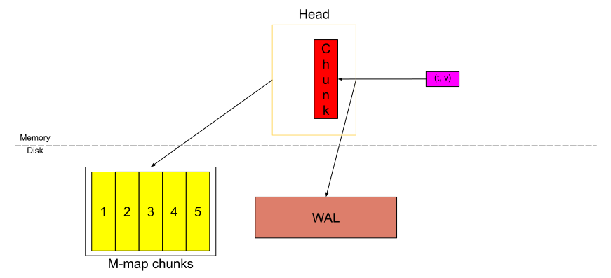
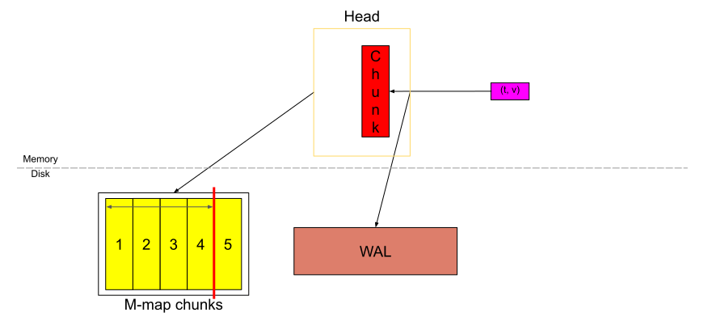
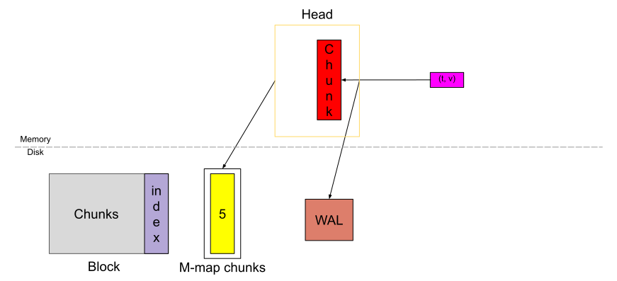

# Prometheus TSDB (Part 1): The Head Block

[link](https://ganeshvernekar.com/blog/prometheus-tsdb-the-head-block/)

## Introduction

Though Prometheus 2.0 was launched about 3 years ago, there are not much resources to understand it's TSDB other than [Fabian's blog post](https://web.archive.org/web/20210622211933/https://fabxc.org/tsdb/), which is very high level, and the [docs on formats](https://github.com/prometheus/prometheus/tree/master/tsdb/docs/format) is more like a developer reference.

The Prometheus' TSDB has been attracting lots of new contributors lately and understanding it has been one of the pain points due to lack of resources. So, I plan to discuss in detail about the working of TSDB in a series of blog posts along with some references to the code for the contributors.

In this blog post, I mainly talk about the in-memory part of the TSDB — the Head block — while I will dive deeper into other components like WAL and it's checkpointing, how the memory-mapping of chunks is designed, compaction, the persistent blocks and it's index, and the upcoming snapshotting of chunks in future blog posts.

## Prologue

[Fabian's blog post](https://fabxc.org/tsdb/) is a good read to understand the data model, core concepts, and the high level picture of how the TSDB is designed. He also [gave a talk at PromCon 2017](https://www.youtube.com/watch?v=b_pEevMAC3I) on this. I recommend reading the blog post or watching the talk before you dive into this one to set a good base.

## Small Overview of TSDB

In the figure above, the **Head block is the in-memory part of the database** and the grey blocks are persistent blocks on disk which are immutable. We have a Write-Ahead-Log (WAL) for durable writes. An incoming sample (the pink box) first goes into the Head block and stays into the memory for a while, which is then flushed to the disk and memory-mapped (the blue box). And when these memory mapped chunks or the in-memory chunks get old to a certain point, they are flushed to the disk as persistent blocks. Further multiple blocks are merged as they get old and finally deleted after they go beyond the retention period.

## Life of a Sample in the Head

All the discussions here are about a single [time series](https://prometheus.io/docs/concepts/data_model/) and the same applies to all the series.

The samples are stored in compressed units called a "chunk". When a sample is incoming, it is ingested into the "active chunk" (the red block). It is the only unit where we can actively write data.

While committing the sample into the chunk, we also record it in the Write-Ahead-Log (WAL) on disk (the brown block) for durability (which means we can recover the in-memory data from that even if the machine crashes abruptly). 

Once the chunk fills till 120 samples (or) spans upto chunk/block range (let's call it `chunkRange`), which is 2h by default, a new chunk is cut and the old chunk is said to be "full". For this blog post, we will consider the scape interval to be 15s, so 120 samples (a full chunk) would span 30m.

The yellow block with number 1 on it is the full chunk which just got filled while the red chunk is the new chunk that was created.

Since Prometheus v2.19.0, we are not storing all the chunks in the memory. As soon as a new chunk is cut, the full chunk is flushed to the disk and memory-mapped from the disk while only storing a reference in the memory. With memory-mapping, we can dynamically load the chunk into the memory with that reference when needed; it's a feature provided by the Operating System.

And they are flushed to the disk and memory-mapped.

After some time the Head block would look like above. If we consider the red chunk to be almost full, then we have 3h of data in Head (6 chunks spanning 30m each). That is `chunkRange*3/2`.

When the data in the Head spans `chunkRange*3/2`, the first `chunkRange` of data (2h here) is compacted into a persistent block. If you noticed above, the WAL is truncated(截断) at this point and a "**checkpoint**" is created (not shown in the diagram). 

This cycle of ingestion of samples, memory-mapping, compaction to form a persistent block, continues. And this forms the basic functionality of the Head block.

## Few more things to note/understand

### Where is the index?

It is in the memory and stored as an inverted index. More about the overall idea of this index is in Fabian's blog post. When the compaction of Head block occurs creating a persistent block, Head block is truncated to remove old chunks and garbage collection is done on this index to remove any series entries that do not exist anymore in the Head.

### Handling Restarts

In case the TSDB has to restart (gracefully or abruptly), it uses the on-disk memory-mapped chunks and the WAL to replay back the data and events and recontruct the in-memory index and chunk.

## Code reference

[`tsdb/db.go`](https://github.com/prometheus/prometheus/blob/master/tsdb/db.go) coordinates the overall functioning of the TSDB.

For the parts relevant in the blog post, the core logic of ingestion for the in-memory chunks is all in [`tsdb/head.go`](https://github.com/prometheus/prometheus/blob/master/tsdb/head.go) which uses WAL and memory mapping as a black box.

